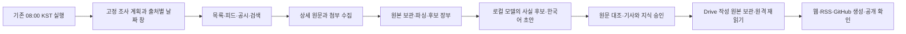

# 매일 반복되는 뉴스 수집·편집·발행의 구현 명세

기준일: 2026-09-30. 이 문서는 **기사를 시스템적으로 계속 가져오는 구조**의 구현 계약과 남은 작업을 기록한다. 현재 동작하는 로컬 수집기와 아직 연결하지 않은 편집·Drive·발행 단계를 구분한다. 출처별 선택자와 실제 수집 증거는 [원천 수집 명세](SOURCE_ACQUISITION_SPEC.md), 기존 기사·지식 전환과 전체 완료 순서는 [구현 계획](LOCAL_AI_NEWS_IMPLEMENTATION_PLAN.md), 명령·비공개 실행 기록은 [런북](LOCAL_AI_NEWS_RUNBOOK.md)을 따른다. 아래에서 `구현`은 로컬 코드와 검증을, `계획`은 미구현 작업을 뜻한다.

## 1. 완성할 흐름과 현재 도달점



| 단계             | 확인한 구현                                                                                                                                                                                                                                                           | 아직 연결할 부분                                                                   |
| ---------------- | --------------------------------------------------------------------------------------------------------------------------------------------------------------------------------------------------------------------------------------------------------------------- | ---------------------------------------------------------------------------------- |
| 출처 등록        | 실제 지정 기간을 개별 검증한 17개 경로를 `research-daily-routes.json`에 활성화했다. 마지막 통합 실행은 15개 경로이고, KAIST 로봇 연구뉴스와 SK하이닉스 뉴스룸의 개별 기간·상세 시험 및 일일 계획 검사를 마쳤다.                                                       | 남은 분야와 기업 IR·대학/TLO의 목록·상세 경로를 검증해 추가한다.                   |
| 기간별 목록·상세 | `research.mjs scan-list`의 한 경로씩 수집을 `research-daily.mjs`가 단일 잠금 아래 순차 실행한다. KST 날짜·7일 겹침·최대 7일 창·실패 구간·경로별 receipt를 보존한다. 제공된 완전한 Drive 내보내기와 로컬 네 원본 폴더가 일치할 때만 그 스냅샷을 계획에 결합할 수 있다. | 기존 08시 예약 지침은 연결했고, 첫 실제 예약의 원격 획득·CLI 실행을 확인해야 한다. |
| 원문·후보        | URL·원본 SHA·source version·parse를 저장한다. 재개할 때 성공 receipt와 과거 coverage의 저장 원본을 다시 검증한다. 완주 창의 후보만 병합한다.                                                                                                                          | 새 후보를 기존 승인 사건/언어판/정정과 대조해 편집 대기로 보낸다.                  |
| 모델·편집        | Ollama 역할 정책과 주장 추출·검토·초안·정정·비공개 승인이 분리되어 있다.                                                                                                                                                                                              | 독립 평가, 일일 후보 우선순위와 사람 검토 용량, 승인 결과의 일일 인계가 필요하다.  |
| 보관·공개        | 과거 기사들을 반영한 **로컬 비공개 사본**과 웹·RSS·digest 일치 검사가 있다.                                                                                                                                                                                           | 승인 원고의 Drive 업로드·원격 bytes 재읽기, 실제 공개 URL 확인이 필요하다.         |

현재 활성 목록은 로봇 제조사 여섯 경로, GitHub Changelog, Google Cloud Threat Intelligence, NVIDIA 보도자료, NASA Technology, FDA 발표, MIT Robotics·AI, Frontiers Robotics and AI, Samsung Global Newsroom RSS, KAIST 로봇 연구뉴스, SK하이닉스 공식 RSS의 **17경로**다. 분야와 축의 표지는 조사 경로를 나타내며 개별 기사 분류나 주장 승인을 자동으로 결정하지 않는다([출처 명세 34~44절](SOURCE_ACQUISITION_SPEC.md#34-github-changelog-월별-아카이브의-기간-수집)). 마지막 **통합 일일 실행** `daily-20260929-v17`은 당시 Drive 작성 원본 181개와 일치한 입력으로 15경로/30창을 `window_scanned`까지 진행했다. 32칸 중 10칸 `partial`·22칸 `not_attempted`이며 `candidate_published`, `drive_verified`, `public_verified`는 모두 `false`다. KAIST와 SK하이닉스 경로는 개별 실물 창 및 새 설정의 17경로/34창 `plan-only`만 마쳤고 통합 일일 실행에는 아직 포함되지 않았다. 08시 자동화의 첫 실제 실행·정규 발행은 확인하지 않았다. **당일 관측은 실행 시점까지의 스냅샷**이고 9월 29일 전체 완료를 뜻하지 않는다.

## 2. 공개 결과와 조사 범위

- 기존 **8개 분야 × 국내/해외 × 기술·제품/기업·운영**의 32칸을 매일 조사한다. 제조사 경로는 로봇 분야에 *추가*하며 다른 일곱 분야를 대체하지 않는다. 기업 IR·공시, 전문지·지역 매체, 고객·공급사, 학회·논문, 대학·TLO·교수 창업 경로를 분리한다.
- 32칸 각각에 `시도 없음`, `목록만 확인`, `원문 확인`, `접근 실패`, `완료 판단 가능한 기간 수집`을 기록한다. 수집 건수와 게재 건수는 다르다. 출처 편중은 추가 탐색 신호로 사용하고 비율을 맞추려 오래된 기사를 채우지 않는다.
- 독자에게는 육하원칙을 자연스럽게 담은 2~4문장 리드와 필요한 상세 설명을 제공한다. 심층 분석은 기업 전략·논문·연구 사업화 중 근거가 충분한 것만 게재한다. 발표일/시행일, 계획/완료, 회사의 주장/외부 검증, 금액·성능의 조건을 분리한다.
- 뉴스·브리핑에는 지도나 운영 안내문을 넣지 않는다. 분야 탭과 `#` 태그는 내용이 있을 때만 표시한다. 지식 페이지와 별도 연결지도에는 원문 검토를 마친 전문용어만 넣고, 회사·제품·일반 단어를 자동 노드로 만들지 않는다.
- Google Drive `Projects / Tech Knowledge`가 `Editions`, `Knowledge`, `Signals`, `TrendTopics` 작성 원본의 최종 보관 위치다. 로컬 `vault/`는 편집·생성 사본, `.local/research/local-ai/`는 비공개 작업 공간이다. 원문 bytes와 검토 이유가 공개 Git·웹에 섞이지 않도록 별도 보관 경로를 유지한다.

## 3. 출처를 실제 운영 경로로 만드는 방법

등록 URL이 있거나 검색 결과가 나온 것만으로는 경로를 활성화하지 않는다. 경로 하나의 도입 단위는 **발견→목록 종료→상세 bytes→발표일·본문·첨부→정정·중복→실패 재개**다. 다음 계약을 출처별 설정과 실제 fixture에 함께 기록한다.

| 정보      | 필수 기록·동작                                                                                                     | 통과하지 못할 때                                                                               |
| --------- | ------------------------------------------------------------------------------------------------------------------ | ---------------------------------------------------------------------------------------------- |
| 신원·권한 | `channel_id`, 발행 주체/법인/지역/언어/분야/축, 시작 URL, 허용 host, 공개 접근·robots·이용 조건                    | 접근 불가를 `새 뉴스 없음`으로 바꾸지 않는다. 차단 우회나 비공개 API 호출을 하지 않는다.       |
| 발견      | RSS GUID·permalink, HTML 카드·DOM 위치, JSON pointer, 공시 ID, DOI/arXiv/학회 ID 등 원래 신원                      | 검색 스니펫·목록 제목은 상세 기사의 사실 근거가 아니다.                                        |
| 기간 종료 | 날짜 내림차순/페이지·cursor/총건수의 검증 방식, `[since, until)`보다 오래된 항목에 도달한 증거, 페이지·상세 예산   | 페이지 1만 읽었거나 새 페이지가 생기면 `incomplete`; 빈 후보도 종료 근거가 있을 때만 인정한다. |
| 상세      | 원 URL·최종 URL·HTTP/MIME·관측 시각·raw bytes SHA·첨부 링크·발표/수정 날짜의 DOM 또는 PDF 위치                     | 상세 403, 선택자 0개·복수, 날짜 충돌, 본문 누락은 후보의 자동 승인과 창 완료를 막는다.         |
| 판본      | 원본 SHA로 불변 `source_version_id`; parser/profile fingerprint로 별도 `parse_id`; 제목·날짜·본문 블록의 내용 지문 | 레이아웃 변화만으로 기사 정정을 강제하지 않고, 실제 내용 변경은 재검토 대기로 올린다.          |
| 수용 시험 | 정상·빈 기간·누락/중복 링크·페이지 증가·날짜 충돌·접근 실패·중단/재개·정정판                                       | 하나라도 미확인인 경우 `registered` 또는 `trial`로 남기고 일일 완주 경로로 세지 않는다.        |

자료형별 파서는 공유 수집기 위에 얹는다. RSS/Atom은 항목 발견과 수정 감지에 쓰되 기사 원문을 별도로 수집한다. 정적 HTML은 목록과 본문 선택자를 각각 고정한다. 공개 JSON·폼은 실제 화면이 쓰는 요청·페이지 종료를 명시하고 응답 스키마 변화를 실패로 남긴다. IR·공시는 공시 법인, 보고 기간, 정정/첨부 ID, 표의 통화·단위·계획/집행 상태를 보존한다. 논문은 초록·전문·사전공개본·최종판을 분리하고 페이지·표·비교 조건을 근거로 쓴다. 대학/TLO/회사 자료는 교수의 공동저자·자문·기술이전·공동창업 역할을 각각 확인한다. 고객·공급사 발표는 제조사 보도자료의 전재인지 독립 발표인지 계보를 확인한다. PDF는 네이티브 텍스트·표·페이지를 먼저 읽고 이미지 페이지만 OCR 대상으로 삼으며 OCR 수치·수식은 원본 이미지와 대조한다.

### 3.1 원천 유형별 adapter 개발 순서

| 유형               | 발견과 기간 종료                                                                                                                                       | 상세·파싱에서 반드시 보존할 것                                                                                                 | 다음 수용 시험                                                                               |
| ------------------ | ------------------------------------------------------------------------------------------------------------------------------------------------------ | ------------------------------------------------------------------------------------------------------------------------------ | -------------------------------------------------------------------------------------------- |
| RSS·Atom           | 피드 자체의 ETag/Last-Modified, GUID, permalink, 공개·수정 시각을 읽는다. 페이지/과거 항목 경계가 없으면 피드 1회 성공을 긴 기간의 완주로 보지 않는다. | 피드 설명은 발견 자료로 남기고 permalink 원문을 별도 요청한다. 원문 날짜·본문·첨부를 다시 판정한다.                            | 새 항목·수정·삭제·GUID 변경·빈 피드와 이전 기간 미포함을 fixture와 실제 피드에서 확인한다.   |
| 월별 HTML 아카이브 | 실제 기간이 걸친 각 달의 공식 아카이브를 읽고 월 표시·항목 날짜·URL 날짜·선택자 건수·정렬·추가 페이지 유무를 검사한다.                                 | 목록 원본과 해당 기간 상세 원본을 각각 저장하고 상세의 게시일·본문을 대조한다.                                                 | 월 경계, 빈 기간, 선택자 누락, 날짜 불일치, 새 페이지, 상세 예산 초과를 실패로 남긴다.       |
| 뉴스룸 HTML        | 연도/카테고리/검색 조건, 카드 날짜와 링크, 다음 페이지·끝 페이지를 명시한다. 정렬이 역순이라는 증거가 없으면 오래된 카드 하나로 종료하지 않는다.       | 저장 HTML에서 기사 제목, 발표일, 본문·표·인용, 회사/제품 범위, 수정일을 exact profile로 뽑는다.                                | 정상·빈 창·중복 카드·누락 날짜·페이지 증가·레이아웃 변경을 검증한다.                         |
| 공개 JSON·폼       | 실제 화면의 요청 경로·메서드·locale·페이지 인자·total/cursor와 허용 host를 고정한다. 미공개 endpoint나 인증 우회는 사용하지 않는다.                    | 원 응답 bytes, 항목 ID, 상세 HTML/JSON, 법인과 언어를 따로 저장한다. 목록 날짜와 상세 날짜를 대조한다.                         | 응답 schema 변경, total 불일치, 페이지 누락, 다음 페이지 조건, HTTP 오류를 실패로 남긴다.    |
| IR·공시 PDF        | 법인 ID·접수번호·보고 기간·정정판·첨부별 URL로 발견한다. 공시 검색 결과와 실제 제출 문서를 구분한다.                                                   | PDF 페이지·표·각주·단위·통화·회계연도·계획/집행 시점을 보존한다. 이미지 페이지에만 OCR을 쓰고 수치는 페이지 이미지와 대조한다. | 최초/정정 공시, 발표일/회계기간 차이, 표 여러 페이지, OCR 오독, 동일 문서 재게시를 검증한다. |
| 논문·연구 발표     | DOI/arXiv/학회 ID와 버전·저자·기관을 발견키로 삼는다. 초록만 접근되는 자료는 전문 확보와 다른 상태로 둔다.                                             | 실제 열람 범위를 표시하고 방법, 표·그림·비교 대상·실험 조건·한계를 페이지/구간에 연결한다.                                     | 사전공개본·최종판 중복, 결과 수치의 평가 조건, 표/수식 보존, 전문 접근 실패를 검증한다.      |
| 대학·기술이전·창업 | 대학/TLO 목록을 회사·연구실·교수의 관계 **후보**로 사용한다. 회사·대학 원문을 각각 찾는다.                                                             | 공동저자·자문·기술이전·공동창업·제품화·고객 계약을 서로 다른 관계와 날짜로 기록한다.                                           | 동명이인, 연구실 이동, 기술이전만 된 회사, 투자 발표와 실제 고객 도입의 차이를 검증한다.     |

이 표는 앞으로 추가할 경로의 **수용 계약**이다. 월별 HTML 아카이브는 현재 GitHub Changelog 한 경로에서 실제 시험했다. 나머지 유형 전체가 일일 CLI에 연결됐다는 뜻이 아니다. 출처별 실제 URL·선택자·실패 사례·법인/논문 식별자는 [원천 수집 명세](SOURCE_ACQUISITION_SPEC.md)를 기준으로 관리한다.

안전한 요청은 기존 `source-policy.mjs`/`fetch.mjs`를 재사용한다. 허용 URL·DNS/IP·리다이렉트·robots, 시간/크기/동시 요청 제한, 403·429·503·네트워크 오류를 각각 receipt에 남긴다. 수집기가 원 bytes를 보관하고 파서는 **저장 bytes만** 읽는다. 같은 URL의 새 관측은 이전 원본·파싱을 덮지 않는다. 조건부 요청이 가능하더라도 `not_modified`는 이전에 저장한 원본과 연결할 수 있을 때에만 유효하다.

### 3.2 새 출처를 활성화하는 체크리스트

1. **출처 후보:** 32칸에서 비어 있는 분야·지역·축과 기사 유형(기업 전략, 논문, 교수 창업)을 먼저 고른다. 공식 원문과 독립 취재를 구분하고 전재 관계를 표시한다. 기사량을 맞추기 위해 오래된 항목을 오늘 사건으로 채우지 않는다.
2. **허용 범위와 식별:** 공식 시작 URL, 발행 주체·법인, 언어, 허용 host, 공개 접근 정책을 기록한다. 목록 ID·원문 ID·정정 ID를 임의 URL 해시 하나로 합치지 않는다.
3. **목록 fixture:** 실제 목록/피드/API 응답을 비공개 bytes로 저장한다. 끝 페이지·오래된 날짜 경계·새 페이지 유입을 증명하는 fixture와 빈 기간 fixture를 만든다. 페이지만 읽고 세부 사건을 검토하지 않은 경우 `incomplete`로 남긴다.
4. **상세 profile:** 기사와 PDF 첨부의 본문·발표일·수정일·표·각주·언어를 원본에서 재파싱한다. 원문 링크가 접근 불가일 때 검색 snippet을 대체 본문으로 사용하지 않는다.
5. **실물 기간 시험:** 새 경로로 좁은 `[since, until)`을 실행해 `window_scanned`, 원본 SHA, parse, 날짜·후보 연결을 검증한다. 실패·재시도·정정판을 시험한 뒤에만 활성 설정에 baseline run을 추가한다.
6. **편집 연결:** 후보를 기존 `event_id`와 공식 언어판·고객/공급사·공시 정정판에 대조한다. 근거가 검증된 사실만 육하원칙 기사와 주제/용어 이력으로 넘긴다. 기사 빈도와 기업 발표를 시장 성과로 추론하지 않는다.

## 4. 구현된 로컬 일일 수집기와 다음 연결 계약

### 4.1 활성 경로 설정

[`data/research-daily-routes.json`](../data/research-daily-routes.json)은 2026-09-30 현재 실제 지정 기간 `window_scanned` 원본을 확보한 17개 `channel_id`와 각 `baseline_run`을 활성화한다. 공통 `lookback_days: 7`, `max_window_days: 7`을 두고, 출처별 페이지·상세 한도와 파서 설정은 기존 레지스트리·profile에서 읽는다. `validateDailyRoutes()`는 설정 schema·중복·알 수 없는 경로·지원하지 않는 목록 API를 거부한다. 월별 아카이브에는 URL template·규칙 ID·항목 URL pattern을, 경계가 있는 RSS에는 피드 제목·항목 URL pattern·허용 host·GUID 조건·최대 항목/상세 건수를 요구한다. `bootstrapCoverage()`는 활성화할 때 baseline과 과거 일일 성공 구간의 목록/상세 원본 SHA, parse, 후보 날짜를 다시 확인한다. 설정의 `enabled`는 **실제 시험을 거친 반복 스캔 대상**이라는 뜻이고, `registry`의 나머지 경로는 발견·확장 후보라는 뜻이다.

활성 경로는 로봇·제조, 소프트웨어·클라우드, 사이버보안, AI, 바이오·의료기술, 우주·기초과학의 일부만 다룬다. **새 CLI만 실행해서는 여덟 분야 전체가 조사되지 않는다.** 분야별 공식 RSS/HTML/공시/논문/대학 경로는 3절의 수용 시험을 통과할 때마다 한 경로씩 추가한다. 자동 스캔과 사람이/모델이 탐색한 경로를 같은 수집 성공 수치로 합산하지 않는다.

### 4.2 실행 ID, 날짜 창, 체크포인트

[`scripts/research-daily.mjs`](../scripts/research-daily.mjs)는 `--plan-only`, `--execute`, `--resume`, 저장된 실행의 `--handoff`를 제공하고 `npm run research:daily -- --run … --plan-only`로도 호출한다. 내부에서 기존 `research.mjs`의 `main(["scan-list", …])`을 순차 호출한다. 별도 예약은 없다. 네 모드 모두 단일 `daily-acquisition` 잠금을 사용한다. `--execute`/`--resume`은 수집 뒤 비공개 편집 인계도 생성한다.

1. 실행 ID는 서울 날짜와 맞는 `daily-YYYYMMDD[-suffix]`다. 계획의 `kst_day`를 고정하고 원 발표일 기준 `[since, until_exclusive)`를 만든다. 오늘 날짜까지 목록을 요청할 수 있도록 마지막 창의 끝은 다음 달력일로 잡되, 오늘 아침의 성공으로 **오늘 하루 전체를 확인했다고 기록하지 않는다.** 확인 범위의 끝은 실행일 시작일로 자른다. 오늘 관측한 후보는 후보 장부에 남긴다.
2. 각 경로의 시작일은 최근 7일 시작, 마지막 연속 확인일에서 다시 7일 전, 열린 실패 구간 시작일 중 가장 이른 날이다. 확인 범위가 오래 비었으면 이전 실패부터 읽고, 창은 최대 7일씩 분할한다. `coveredFrontier()`는 연속 구간만 계산하므로 앞쪽 실패 뒤의 더 최근 성공이 frontier를 건너뛰지 못한다.
3. 계획 전에는 **로컬 `vault/`의 마지막 회차** `coverage_end`와 파일 SHA를 읽는다. 스냅샷을 제공하지 않으면 `cutoff_basis: local_vault_unreconciled`이며 Drive 확인값이 아니다. `--drive-snapshot`을 제공하면 완전한 네 원본 폴더의 경로·본문 SHA·로컬 bytes 일치와 내보내기 시각(생성 시 10분 이내)을 검사하고, 통과한 스냅샷 해시·파일 해시·시각·파일 수를 `edition`에 묶는다. 이 상태는 `provided_drive_snapshot_matched`로 표시하며, **제공 파일이 실제 최신 Drive에서 왔다는 독립적인 인증이나 원격 재읽기·발행 승인은 아니다.** 검증된 경로별 연속 확인일·미해결 구간을 `coverage_basis`와 SHA로 고정하고, 계획은 첫 HTTP 요청 전에 원자적으로 저장한다. 재개 시 제공한 같은 스냅샷 bytes와 로컬 네 폴더 일치를 다시 검사하지만 생성 시각의 10분 제한은 재적용하지 않는다. 저장 계획의 전체 `windows[]`를 그 고정 근거와 현재 활성 route 순서·설정으로 다시 산출해 비교한다. 창·날짜·기준 run·스냅샷·설정·코드가 바뀌면 같은 run ID의 실행을 거부한다. 후보 장부와 원격 revision의 발행 시점 대조는 **다음 단계**다.
4. 각 경로·날짜 창·시도에는 별도의 `attempt_id`가 있다. 기존 `scan-list`가 목록/상세 원본, parse, 후보를 비공개 subrun으로 보관한다. `window_scanned`는 저장된 목록 bytes와 모든 해당 상세 bytes의 SHA, parse·후보의 URL/날짜 일치를 검사한 뒤에만 receipt에 적는다. 빈 창도 목록 원본이 있어야 성공이다.
5. 실패나 미완료는 별도 receipt와 `unresolved` 구간으로 남고 다음 시도는 새 ID를 만든다. 다른 경로는 계속 실행한다. 같은 계획의 이미 완료한 창은 receipt 파일명·시도 ID와 저장 subrun의 목록/상세 원본·parse·후보 키·병합 상태를 **다시 검사한 뒤** `--resume`에서 건너뛴다. 이전 일일 성공 구간도 새 계획의 frontier에 사용하기 전에 해당 저장 원본을 다시 검사한다. 이전 일일 스캔이 당일 전체를 잘못 확인한 것으로 기록한 경우에는 원래 run ID의 달력 날짜를 기준으로 coverage를 잘라 복구한다.

실제 비공개 산출물은 `.local/research/local-ai/daily/runs/<run>/plan.json`, `receipts/<attempt_id>.json`, `summary.json`과 공용 `.local/research/local-ai/daily/route-coverage.json`이다. 상세 증거는 기존 `runs/<attempt_id>/` 아래의 `list-scan.json`, `list-pages.json`, `documents.json`, `parses.json`, `candidates.json` 및 원본 bytes에 있다. receipt는 이 하위 run ID와 건수·상태·시각·후보 키·병합 결과를 참조한다. 이 내부 자료를 기사·브리핑·RSS에 그대로 출력하지 않는다.

### 4.3 성공·부분 실패와 후보 장부

`scan-list`의 `list-scan.json.status === "window_scanned"`를 확인하고 `documents.json`·`parses.json`·`candidates.json`과 저장된 원본을 재읽은 뒤에만 그 창의 후보를 장부에 병합한다. 기존 `--merge-backlog`의 불완전 창 병합 결함은 `mergeCompletedScan()`으로 고쳤고, **부분 후보가 있어도 미완료 창은 병합하지 않는** 회귀 시험을 추가했다. 미완료 subrun의 후보는 비공개 증거로 남지만 완주·승인 기사로 취급하지 않는다. 완주 여부는 목록 종료, 상세 예산, 정확한 날짜에 달려 있으며 후보 수 0은 그 자체로 근거가 아니다.

한 경로가 실패해도 다른 경로는 계속 수집하고 실패 창의 확인 범위는 전진하지 않는다. 같은 후보 URL의 재관측은 기존 후보 장부 병합 규칙을 사용해 검토 상태·고정 사건 ID를 보존한다. **구현된 편집 연결:** 완료 receipt의 후보 키와 저장된 상세 판본을 후보 장부·로컬 회차의 실제 `event_id`/원문 URL에 대조해 비공개 `editorial-handoff`를 만든다. `기존 사건`, `원문 변경 재검토`, `새 후보의 발표일 검토`, `과거 회차 검토`, `날짜 미확인`, `종결`로 라우팅할 뿐 사실 검토·동일 사건 판정·원고 승인은 하지 않는다. URL/ID가 없는 이름 유사성으로 자동 연결하지 않는다. 공식 언어판·전재·정정의 사람/근거 기반 판정과 Drive의 승인 inventory 대조는 아직 별도 관문이다.

### 4.4 비공개 데이터 계약과 순서

아래는 **현재 파일의 주요 필드**다. `plan`과 시도별 `receipt`는 원자적으로 새 파일을 만들고, `route-coverage.json`과 `summary.json`은 현재 상태로 갱신한다. receipt에는 원문 본문을 복제하지 않는다. coverage는 baseline과 성공 receipt를 기준으로 재계산 가능해야 한다.

| 객체                            | 현재 주요 필드                                                                                                                                        | 해석·제약                                                                                                                                                                  |
| ------------------------------- | ----------------------------------------------------------------------------------------------------------------------------------------------------- | -------------------------------------------------------------------------------------------------------------------------------------------------------------------------- |
| `research-daily-plan/v1`        | `run_id`, `kst_day`, `cutoff`, `cutoff_basis`, `edition`, `config_sha256`, `created_at`, `coverage_basis`, `coverage_basis_sha256`, `windows[]`       | 로컬 회차·검증된 coverage 근거·코드/설정 판본을 고정하고 재개 시 창 전체를 재계산한다. 선택적으로 제공된 Drive 내보내기의 내용·파일 해시·시각·개수를 `edition`에 고정한다. |
| 계획의 `windows[]`              | `channel_id`, `baseline_run`, `since`, `until_exclusive`                                                                                              | 날짜 구간은 반열림이다. 출처별 profile·한도는 레지스트리를 따른다.                                                                                                         |
| `research-daily-receipt/v1`     | `daily_run`, `attempt_id`, 창 키, `started_at`, `finished_at`, `status`, `reason`, `candidate_keys`, `scan_evidence`, `backlog_merge`                 | 시도별 파일을 수정하지 않는다. 원본·parse의 세부 ID는 해당 subrun에서 읽는다.                                                                                              |
| `research-daily-coverage/v1`    | 경로별 `baseline_run`, `anchor_since`, `covered[]`, `unresolved[]`, `last_contiguous_until`                                                           | 같은 날의 미래 시간은 확인하지 않은 것으로 남긴다. 연속 확인일과 개별 성공 구간을 분리한다.                                                                                |
| `research-daily-summary/v1`     | `run_id`, `status`, 경로별 상태/frontier, `coverage_grid`, `receipts`, `candidate_published`, `drive_verified`, `public_verified`                     | 32칸은 실제 시도한 경로만 `partial`이다. 공개·Drive 플래그는 `false`다.                                                                                                    |
| `research-editorial-handoff/v1` | `daily_run`, 계획 입력의 출처 표시, 입력 해시, 완료/미완료 창, `pending[]`, `observed_resolved[]`, 후보별 `next_route`·원문 판본/parse·완료 시도 참조 | 저장 원문과 로컬 회차로 만든 비공개 편집 대기 목록이다. 기사·Drive·공개 승인을 뜻하지 않는다.                                                                              |

상태 전이는 `registered → trial → active → suspended`(출처 경로), `planned → scanning → window_scanned | incomplete | blocked | failed`(시도), `unreviewed → verified | deferred | rejected`(기사 후보), `draft → editorial_review → approved → Drive verified → public verified`(작성·발행)로 **서로 다른 축**에서 관리한다. 예를 들어 `window_scanned`와 `verified`는 서로 대체할 수 없고, `approved`와 `public verified`도 같지 않다. 출처 경로가 `suspended`되어도 이전 완주 receipt와 원본 bytes는 보존한다.

현재 구현된 로컬 수집 순서는 다음과 같다. 편집·Drive·발행 호출은 이 순서 뒤에 **별도 관문으로 추가해야 한다.**

```text
read local vault edition cutoff; optionally compare all four authoring roots
to a fresh complete supplied Drive export and freeze its hashes in the plan
create immutable daily plan from active routes, seven-day overlap and open gaps
for each planned route/window:
    create a unique attempt ID; scan listing and selected detail sources
    persist listing/detail bytes, parses and candidates in the subrun
    if status is window_scanned and stored evidence check passes:
        merge complete candidates into private backlog
        persist receipt and add only the elapsed interval to confirmed coverage
    else:
        persist receipt, retain partial evidence and queue the unresolved interval
write local summary with 32-cell coverage and no publication claim
verify successful receipts again and snapshot the private editorial handoff

NEXT: reconcile the Drive revision and approved event inventory
NEXT: review routed candidates against originals, language versions and existing IDs
NEXT: hand only approved material to Drive readback and public generators
```

### 4.5 명령 계약과 현재 가능한 범위

개별 경로에는 `node scripts/research.mjs scan-list --run <고유ID> --channel <한 경로ID> --since YYYY-MM-DD --until YYYY-MM-DD`를 사용한다. `--merge-backlog`은 완료 창만 병합하도록 수정했다. `research.mjs`의 기존 `discover`, `collect`, `extract`, `review`, `draft`, `correct`, `approve`, `preview`는 각자의 검토·승인 계약을 유지한다.

일일 명령은 다음과 같다. **`--plan-only`도 비공개 계획 파일은 만든다.** 원문 네트워크 요청, 후보 장부, Drive 쓰기는 하지 않는다. `--execute`는 같은 계획을 실행하고 `--resume`은 미완료 창에만 새 시도 ID를 만든다. 둘 다 실행 뒤 편집 인계 스냅샷을 생성한다. `--handoff`는 이미 저장된 계획·영수증·원본을 재검증하고 **HTTP 없이** 현재 후보 장부·로컬 회차에 맞는 새 편집 인계만 만든다. `--as-of` CLI 옵션은 없다. 테스트는 함수의 `now`를 주입한다. 설정·관련 코드나 로컬 최신 회차가 바뀌면 수집 실행에는 새 run ID를 사용한다.

```bash
node scripts/research-daily.mjs --run daily-YYYYMMDD --plan-only
node scripts/research-daily.mjs --run daily-YYYYMMDD --execute
node scripts/research-daily.mjs --run daily-YYYYMMDD --resume
node scripts/research-daily.mjs --run daily-YYYYMMDD --handoff
```

`YYYYMMDD`를 실제 KST 날짜로 바꾸고, 같은 날짜에 설정·코드·로컬 회차가 바뀌면 `daily-YYYYMMDD-v2`처럼 새 run ID를 사용한다. 완료된 `daily-20260929-v4`는 이후 코드 변경으로 계획 fingerprint가 달라졌으므로 재실행하지 않는다. 어느 명령도 기사 승인, Drive 보관, RSS 생성 또는 배포를 수행하지 않는다.

Drive 기준 계획을 만들 때는 **실제 연결된 Drive에서 새로 읽은** `tech-drive-source/v1` 전체 내보내기를 Git에 들어가지 않는 `.local/` 경로에 둔다. 연결 도구에서 네 작성 폴더의 모든 Markdown 원문 bytes와 메타데이터를 읽고 두 번째 목록 조회에서 파일 ID·부모·크기·수정 시각이 변하지 않았음을 확인한 뒤, 비공개 `tech-drive-connector-readback/v1` 영수증을 만든다. [`build-connector-snapshot.py`](../scripts/build-connector-snapshot.py)는 이 영수증의 고정 루트·부모 관계·파일별 SHA-256·로컬 전체 목록과 bytes·10분 시각을 검사해 `tech-drive-source/v1` 파일을 만든다. 영수증 JSON만 외부에서 받은 경우 그 내용의 원격 진위는 증명되지 않는다. 실제 연결 도구의 raw-byte 조회와 후속 목록 재확인을 함께 수행해야 한다.

`python3 scripts/pull-drive.py --snapshot <파일> --verify-source-snapshot`으로 내보내기 범위·본문 해시·10분 시각·로컬 네 폴더의 완전 일치를 다시 확인한다. 이후 `--plan-only` 또는 `--execute`에 `--drive-snapshot <같은 파일>`을 주며 `--resume`에도 같은 파일을 전달한다. `--handoff`는 저장된 계획과 원본을 읽는 단계이며 새 Drive 입력을 받지 않는다. 제공 파일이 없으면 기존 로컬 수집은 계속 가능하지만 Drive 대조로 표시하지 않는다. 현재 보관된 2026-09-13 스냅샷은 오래되어 이 관문을 통과하지 못한다. 08시 실행에 새 내보내기 획득을 연결하기 전까지 이 옵션은 수동 입력 경로다.

### 4.6 2026-09-29 실제 실행과 자료 위치

앞선 `daily-20260929-v3`는 제조사 여섯 경로의 12개 창을 완주한 당시 기록이다. 그 뒤 GitHub Changelog 월별 아카이브를 추가해 `daily-20260929-v4`를 새 계획으로 실행했다. 일곱 활성 경로마다 `[2026-09-22, 2026-09-29)`와 `[2026-09-29, 2026-09-30)` 두 창을 두어 총 14개 창이다. 두 번째 창은 **실행 당시의 당일 관측 스냅샷**이며 완주 receipt가 있어도 확인 범위의 마지막 연속 날짜는 모든 경로에서 `2026-09-29`로 남긴다. 32칸 표는 로봇·제조 3칸과 소프트웨어·클라우드 해외 기술·제품 1칸만 `partial`, 나머지 28칸은 `not_attempted`다. `configured_routes_scanned`는 **설정된 경로의 로컬 수집 성공**이지 전체 취재·발행 성공이 아니다.

시도별 영수증과 원문은 `.local/research/local-ai/daily/runs/daily-20260929-v4/` 및 `.local/research/local-ai/runs/<attempt_id>/`에 있다. 첫 실행에서 HD현대로보틱스의 7일 창 하나가 요청 시간 초과로 실패했고, 다른 13창의 성공은 보존됐다. `--resume`은 저장된 성공 증거를 검사한 뒤 **실패한 그 창만** 새 시도로 재수집했다. 최종 영수증 15개는 성공 14개와 보존된 실패 1개다. 실행 요약의 `candidate_published: false`, `drive_verified: false`, `public_verified: false`를 함께 읽는다. GitHub 경로의 첫 7일 창은 상세 원문 23건을 저장했으며, 이 23건은 **기사 게재 23건이 아니다.** 이전 수집의 ABB E-Device는 비공개 승인 원고가 있지만 후보 장부의 상태와 승인 원고 ID `5e467cdcb79271a9`를 대조해 중복 승인을 막아야 한다. 현재 장부 83건(`verified` 43, `deferred` 13, `rejected` 1, `unreviewed` 26)은 후보 상태 수이지 발행 기사 수가 아니다.

복구 직후 같은 계획을 다시 `--resume`했을 때 추가 HTTP 시도와 receipt 없이 즉시 끝났고 요약·coverage·후보 장부의 SHA가 같았다. 저장 listing을 손상시킨 fixture에서는 재개와 과거 coverage 채택이 모두 중단된다. v2 시험에서 당일 전체가 확인된 것처럼 기록된 결함은 원래 coverage 파일의 사본을 비공개로 보존한 뒤 `repairDailyCoverageState()`와 당일 상한을 적용해 수정했다. **이 시험은 기존 08시 예약, Drive 작성 원본, 공개 웹/RSS/GitHub를 변경하지 않았다.**

이후 Google Cloud 공식 Threat Intelligence RSS를 추가한 `daily-20260929-v5`는 여덟 경로에 같은 두 날짜 창을 배정해 **16/16 `window_scanned`**를 기록했다. 모든 frontier는 9월 29일 시작 시점이다. 32칸 중 로봇 3칸, 소프트웨어·클라우드 해외 기술 1칸, 사이버보안 해외 기술 1칸만 `partial`이고 27칸은 `not_attempted`다. 후보 장부는 85건(`verified` 43, `deferred` 13, `rejected` 1, `unreviewed` 28)이며 새 Google Cloud 2건은 미검토다. 같은 코드/설정에서 v5를 다시 재개했을 때 영수증 16개와 summary·coverage·장부의 SHA가 그대로였다. 이후 발견 필터 등 공유 코드도 계획 fingerprint에 추가했으므로 **현재 코드로 v5를 다시 재개하면 의도적으로 입력 변경 오류가 난다.** 이때는 기존 기록을 덮지 않고 새 run ID로 계획한다. `daily-20260929-v7`은 당시 코드 fingerprint로 계획만 생성했으며 원문 요청·기사 승인·공개를 실행하지 않았다. 이후 편집 인계 코드가 추가됐으므로 v7도 현재 코드의 실행 계획은 아니다.

NASA Technology 공식 RSS를 더한 `daily-20260929-v8`은 아홉 경로의 **18/18창을 `window_scanned`**로 끝냈다. NASA의 실제 첫 7일 창은 원문 네 건, 다음 당일 창은 관측 시점에 0건이었고 둘 다 피드의 시작일 이전 항목을 저장했다. 전체 32칸은 **6칸 `partial`·26칸 `not_attempted`**다. NASA 네 건이 비공개 후보 장부에 추가돼 총 **89건**(verified 43/deferred 13/rejected 1/unreviewed 32)이고, 실행 후 인계는 미해결 45건(이번 실행 관측 31건, 과거 회차 검토 위치 21건)이다. 동일 계획의 `--resume`은 추가 영수증 없이 summary·coverage·장부 SHA를 유지했다. 상세 원본·해시·재현 명령은 [출처 명세 36절](SOURCE_ACQUISITION_SPEC.md#36-nasa-technology-공식-rss와-상세-원문)과 [런북 71절](LOCAL_AI_NEWS_RUNBOOK.md#71-nasa-technology-rss-도입과-아홉-경로-일일-수집)에 있다. 이 수치는 **수집과 비공개 편집 대기**의 증거다. 새 NASA 후보의 사실 승인, Drive 저장, 뉴스/브리핑 생성, RSS 발행, 08시 예약 전환은 수행하지 않았다.

FDA 공식 발표 목록을 더한 `daily-20260929-v9`은 **10경로×2창=20개 날짜 창**을 실행했다. 첫 시도에서 FANUC 영문 목록의 robots 확인 실패와 일본어 공시 목록의 요청 시간 초과가 각각 발생했고 나머지 18창은 성공했다. 실패 receipt와 성공 원본을 보존한 `--resume`은 **실패한 두 창만** 새 attempt ID로 수집해 최종 20/20창을 `window_scanned`로 만들었다. 영수증은 성공 20개·보존 실패 2개로 총 **22개**다. 그 뒤 동일 계획의 `--resume`은 새 영수증을 만들지 않았고 summary·coverage·후보 장부 SHA가 불변이었다. FDA의 7일 창은 상세 3건, 당일 창은 관측 시점 0건이며 둘 다 시작일 이전의 목록 항목이 있다. 32칸 중 **7칸 `partial`·25칸 `not_attempted`**이고, FDA 새 3건이 모두 미검토로 병합돼 장부는 **92건**(verified 43/deferred 13/rejected 1/unreviewed 35)이다. 비공개 인계에는 미해결 **48건**, 이번 실행 관측 **34건**, 과거 회차 검토 위치 **21건**, 미완료 창 0개가 있다. 이 수치는 수집·인계 상태이며 FDA 기사 3건의 사실 승인이나 분야 전체 취재 완료가 아니다([출처 명세 37절](SOURCE_ACQUISITION_SPEC.md#37-fda-공식-발표-목록과-상세-원문의-기간-수집), [런북 73절](LOCAL_AI_NEWS_RUNBOOK.md#73-fda-공식-발표-경로와-열-경로-일일-실행)).

### 4.7 완료 수집에서 비공개 편집 인계로

[`editorial-handoff.mjs`](../scripts/research/editorial-handoff.mjs)는 계획·summary·성공 receipt와 해당 `runs/<attempt_id>/candidates.json`/상세 원문·parse를 먼저 재검증한다. 완료 receipt에 있던 후보 키가 현재 후보 장부에서 사라졌으면 인계 생성을 중단한다. 실패/미완료 receipt의 부분 후보는 그 실행에서 관측 완료로 표시하지 않고, 그 창은 `incomplete_windows[]`에 남긴다. 기존 backlog의 미해결 후보는 오래됐다는 이유만으로 삭제하지 않는다.

로컬 `vault/Editions`의 검증 완료 기사와 후보의 **확인된 `event_id` 일치만** 기존 사건 발행 판정에 사용한다. 일반 조사 창은 미검토 기사를 발행 근거로 보지 않는다. 정규화한 원문 URL 일치는 `possible_publications[]`로 보존하고 `review-existing-identity`에 남긴다. 같은 갱신형 URL에 서로 다른 사건이 있어도 첫 기사의 ID로 자동 연결하지 않는다. 확인된 기사에 대한 원문 변경 알림은 `review-source-revision`, 확인된 발행 사건은 `already-published`다. 인계 단계에서만 미검토 로컬 기사까지 후보로 대조해 `review-existing-unverified`로 분리하며, URL만 겹칠 때는 `publication`을 채우지 않는다. 거절 후보는 `closed`, 발표일이 없으면 `verify-original-date`, 최신 회차 cutoff 전이면 `historical-review`, 나머지는 `review-publication-time`이다. 분류는 편집 작업의 다음 위치를 정할 뿐 새 사건 여부나 사실을 승인하지 않는다. 확인된 ID와 서로 다른 사건의 **고유** 원문 URL이 한 후보에 섞이면 오류로 중단한다.

각 후보는 `article_source_version_id`·`article_parse_id`·본문 지문, 성공 시도의 동일 필드와 `current_source_version_observed_in_run`을 갖는다. 최신 장부 판본이 해당 실행에서 관측한 판본과 다르면 그 실행의 원문을 최신 근거로 혼동하지 않는다. 새 계획은 전체 Editions 파일 목록·bytes SHA의 지문을 고정하며, 이후 다른 회차 파일이 추가·수정되어도 `--handoff`가 이전 계획의 권위 상태로 새 결과를 만들지 못한다. 후보 장부 bytes·회차 파일 inventory·현재 기사 투영·라우팅 코드·계획·receipt의 SHA로 불변 스냅샷 이름을 만든다. 같은 입력의 `--handoff`는 같은 파일을 반환하며, 편집이나 코드가 달라지면 기존 스냅샷을 보존하고 새 경로를 만든다. 파일은 `.local/research/local-ai/daily/runs/<run>/handoffs/<입력 SHA>.json`에만 저장한다. `authority`는 계획의 로컬/제공 Drive 스냅샷 상태를 그대로 밝히고 `candidate_published/drive_verified/public_verified: false`를 유지한다. 이 계획 시점의 일치를 발행 직전 원격 재읽기로 간주하지 않는다.

기존 `daily-20260929-v5`의 저장 원본을 다시 읽은 `--handoff` 결과는 완료 16/16창, 미해결 후보 41건(그 실행에서 관측 27건), 그중 `historical-review` 21건, 해당 실행에서 재관측한 종결 후보 0건이다. 새 원문 판본 27건은 현재 장부 판본과 일치했다. 이는 로컬 대조 결과이고 41건을 기사로 쓰거나 21건을 과거 회차에 편입했다는 뜻이 아니다. 당시 계획의 코드 fingerprint가 현재와 달라도 `--handoff`는 저장 원본만 검사하므로 수집 자체를 재개하지 않는다.

### 4.8 로컬 수집기에서 발행 경로까지 남은 직접 결합

1. **계획 동일성:** 성공 receipt와 과거 coverage의 원문·parse 재검사, 저장 계획의 전체 날짜 창과 고정 `coverage_basis`에서 재계산한 창의 직접 비교를 구현했다. 코드/설정·활성 경로·창 순서/날짜/baseline이 바뀌면 같은 run ID를 거부한다. 이번에는 원격 전체 181개 raw bytes를 재조회한 영수증에서 완전 내보내기를 만들어 로컬 네 작성 원본 일치를 계획에 고정했다. 다음에는 **수집 이후 새 원격 revision이 생겼는지** 승인·발행 전에 확인하고 후보 장부 입력을 승인 단계에 고정한다. 저장 데이터의 손상은 새 ID 없이 덮어 복구하지 않고 원본 사본을 보존해 원인을 확인한다.
2. **권위 입력:** 현재 수집 계획에는 로컬 `coverage_end`와 연결 도구에서 생성한 전체 Drive 내보내기의 내용·파일 SHA를 고정할 수 있다. 최신 원격 원본의 한 시점 raw bytes·메타데이터 획득은 4.9절에서 수행했다. 이를 매일 08시 실행에서 **매번 자동으로 갱신**하거나, 새 원고 업로드 후 재읽고 발행 경로에 전달하는 결합은 아직 없다. 수집 중 원격 변경을 확인하면 발행 경로는 해당 계획을 거부하고 재조정해야 한다. 최초 원격 읽기와 로컬 일치만으로 `drive_verified`를 `true`로 표시하지 않는다.
3. **후보 인계:** 저장 완료 시도와 로컬 게재 `event_id`/URL에 대한 비공개 라우팅은 구현했다. 다음에는 Drive의 승인 event inventory와 source-version/언어판/정정 이력을 대조한다. 동일 사건이면 기존 ID와 원 회차로, 새 사건이면 새 ID 후보로, 사실 충돌이면 `deferred`로 분기한다. 이미 비공개 승인된 ABB E-Device 같은 항목을 재승인·재발행하지 않는다.
4. **검토·집필:** 저장된 원문 block/page에서 모델이 주장 후보를 추출하고, 검토자가 주체·행위·발표일·시행일·수치 조건을 원문과 대조한다. 기사·심층·용어는 승인된 사실만 사용한다. 매일 심층 1건은 근거가 충분할 때만 넣고, 분석이 없으면 화면의 섹션 자체를 만들지 않는다.
5. **보관·공개:** 승인 원고와 의존 지식·과거 회차를 Drive에 쓰고 원격 bytes·부모·revision을 재읽는다. 같은 확인된 snapshot에서 웹·RSS·GitHub Markdown을 생성하고 실제 공개 URL의 제목·기사 ID·GUID·날짜·원문 링크를 비교한다. 기존 08시 자동화 하나에 이 순서를 연결한다.

### 4.9 연결된 Drive 전체 원본의 실제 읽기와 신뢰 경계

2026-09-29에는 연결된 Google Drive에서 `Projects / Tech Knowledge` 루트와 `Editions`, `Knowledge`, `Signals`, `TrendTopics`를 확인했다. 네 작성 폴더와 하위 폴더를 끝까지 열거해 Markdown **181개**, 하위 폴더 **9개**를 찾았고, 각 파일의 원문 raw bytes를 실제로 읽어 로컬 `vault/`의 같은 상대경로와 **181/181개 바이트 단위로 일치**시켰다. 실패·누락은 0개였다. 전체 원격 목록을 한 번 더 읽었을 때 파일 ID·부모·크기·수정 시각과 로컬 해시 목록은 그대로였다. 가장 최근 회차는 `Editions/2026/09/2026-09-23_0800_Tech_AI_Briefing.md`였으며, 그 뒤의 날짜를 이미 작성된 회차로 추정하지 않았다.

연결 도구의 원문 조회 결과에서 서명된 다운로드 URL이나 본문을 보고서·Git에 복사하지 않는다. 원격 조회에서 얻은 파일 ID·상대경로·부모·크기·수정 시각·원문 SHA-256과 조회 완료 시각만 `.local/drive-sync/connector-readback-20260929T035214Z.json`에 보관했다. [`build-connector-snapshot.py`](../scripts/build-connector-snapshot.py)가 이 영수증과 실제 일치한 로컬 bytes를 사용해 `.local/drive-sync/connector-source-snapshot-20260929T035214Z.json`을 만들었다. 내보내기 SHA-256은 `a911f93144962e566e7fc3ac2691efee59e3cedb09963c7f6b00bd3b8fe78f0d`; `pull-drive.py --verify-source-snapshot`의 본문 기준 SHA-256은 `505a788ec077770d83fa21d1b68405020b46c696df68b9a970c15b02d0d2f508`이다. 둘은 해시 대상이 다르다.

```sh
python3 scripts/build-connector-snapshot.py \
  --repository . \
  --readback .local/drive-sync/connector-readback-20260929T035214Z.json \
  --output .local/drive-sync/connector-source-snapshot-20260929T035214Z.json
python3 scripts/pull-drive.py \
  --snapshot .local/drive-sync/connector-source-snapshot-20260929T035214Z.json \
  --verify-source-snapshot
node scripts/research-daily.mjs \
  --run daily-20260929-v10 \
  --drive-snapshot .local/drive-sync/connector-source-snapshot-20260929T035214Z.json \
  --plan-only
```

위 명령의 파일은 **이미 생성된 실행 증거**이며, 날짜를 바꾼 새 실행은 연결 도구에서 새 목록·raw bytes·영수증을 먼저 다시 만들어야 한다. snapshot 생성은 동일 이름의 기존 파일을 덮지 않는다. 스냅샷을 받은 일일 계획은 `authority:provided_drive_snapshot_matched`, 작성 원본 181개·내보내기 SHA·최신 회차 SHA를 고정했다. 이 속성은 **수집 시작 때의 Drive 읽기와 로컬 사본 일치**를 뜻한다. 이후 새로운 Drive 변경, 기사 승인·업로드 후 원격 재읽기, GitHub/웹/RSS 공개를 뜻하지 않으므로 `drive_verified:false`, `public_verified:false`를 유지한다. 원격 루트가 조회 중 바뀌거나 로컬 원본이 달라지면 기존 run을 발행 근거로 사용하지 말고 새로운 스냅샷·run ID로 다시 계획한다.

### 4.10 Drive 대조 입력을 사용한 2026-09-29 수집 결과

`daily-20260929-v10`은 위 스냅샷을 받은 **10개 활성 경로 × 두 날짜 창 = 20창**의 계획이다. `--execute`는 영수증 20개를 남겼고 그중 **18개 `window_scanned`**, KUKA 독일어 뉴스의 두 창은 **2개 `blocked`**였다. 두 실패는 `page_blocked`이며 저장된 `page-0.json`의 원인은 `Robots policy could not be checked: failed`다. 별도 `robots.txt` 진단 요청도 20초 동안 응답 bytes가 없어 시간 초과였다. 정책을 우회하지 않았고 해당 날짜 창을 성공이나 새 소식 없음으로 바꾸지 않았다. 다른 아홉 경로의 성공 원본과 실패 영수증을 모두 보존했다.

결과 `summary.status:partial`, 32칸 중 **7칸 `partial`·25칸 `not_attempted`**다. 로봇·제조 해외 기술 칸의 `partial`은 FANUC·ABB 경로의 성공이 있었기 때문이며 KUKA 실패가 `failed_route_ids`에도 남는다. 다른 칸의 미시도를 이 실행으로 메우지 않는다. 비공개 후보 장부는 **92건**(verified 43/deferred 13/rejected 1/unreviewed 35)으로 전 실행과 같고, 이번 인계는 `pending:48`, `pending_observed_in_run:33`, `historical_review:21`, `incomplete_windows:2`다. 로컬 후보 재관측·인계 수이지 신규 기사 33건 또는 발행 48건이 아니다.

KUKA의 정책 확인이 복구되면 **같은 코드·설정·로컬 작성 원본과 동일한 스냅샷 bytes**로 `--resume`을 실행해 실패한 두 창만 새 attempt ID로 재조사한다. 정책 파일 접근이 계속 막혀 있으면 미완료를 유지하고, 별도의 공식 대체 경로를 출처별 수용 시험으로 추가한다. 단지 기다린 뒤 같은 요청을 무차별 반복하지 않는다. 이번 실행은 원격 Drive 읽기를 입력으로 묶었지만 원고 승인, Drive 업로드 후 readback, 웹·RSS·GitHub 공개, 기존 08시 자동화 수정은 하지 않았다.

### 4.11 기존 08시 예약의 지침과 첫 실행 관문

수동 v10 이후 기존 `tech-ai-briefing-08`의 활성 예약 **하나**에 [런북 75절](LOCAL_AI_NEWS_RUNBOOK.md#75-기존-오전-8시-예약에-비공개-수집-단계-연결)의 비공개 수집 지침을 추가했다. 스케줄·모델·추론 수준·프로젝트·시작 폴더와 기존 브리핑 지침은 변경 전후 설정 재읽기로 동일함을 확인했다. 새 지침은 매 실행마다 인증된 Drive 전수 원문 조회에서 새 영수증·스냅샷을 만든 뒤 `research-daily.mjs`를 호출하도록 요구하며, 실패/부분 완료를 뉴스 없음이나 발행 성공으로 승격시키지 않는다. 그 결과를 승인 사건 inventory·GPT 보완 취재·원문 검토에 전달하도록 했다.

이것은 **지침이 예약에 저장된 상태**이고 운영 경로의 성공은 아니다. 예약 변경 후 첫 실행의 connector 도구 가용성, 10분 freshness, 중복 worker 회피, 수집 receipt와 후보 인계, 승인 원고 Drive 쓰기·원격 readback, 웹/RSS/GitHub 공개 비교는 아직 확인하지 않았다. 최초 실제 실행에서는 `provided_drive_snapshot_matched`와 최종 `drive_verified/public_verified`를 별도 상태로 읽고, 출처별 `blocked`를 해당 범위의 미완료로 남기는지 확인한다. 기존 v10의 일부 성공을 내일의 취재 완료로 재사용하지 않는다.

### 4.12 기업 동향 원천 추가와 실제 실행의 경계

NVIDIA Newsroom의 공식 보도자료 RSS를 **AI/해외/기업·운영** 탐색의 열한 번째 활성 경로로 추가했다([출처 명세 38절](SOURCE_ACQUISITION_SPEC.md#38-nvidia-newsroom-공식-보도자료-rss의-기간-수집)). 날짜별 피드와 상세 원문이 있는 공식 경로여서 회사의 투자·제휴·제품 발표를 직접 발견할 수 있다. 다만 회사의 발표는 회사에 귀속된 주장이다. 성과·집행·시장 효과로 설명하려면 공시, IR, 고객/파트너, 독립 연구와 대조해야 한다. 경로의 분야 태그는 수집 우선순위일 뿐 개별 기사 태그가 아니다.

`20260929-nvidia-press-window-v1`은 9월 22~~28일 범위에서 피드 20항목 중 원문 2건과 이전 경계 18건을 확보했다. `20260929-nvidia-press-empty-v1`은 9월 15~~21일에 대상 0건·이전 18건·이후 2건을 확보했다. 두 창 모두 정책 수집과 저장 bytes/parse/날짜 재검증을 통과했다. 축소 XML/HTML 회귀 2건은 GUID 주소 변경·경계 누락·메뉴 혼입을 검사한다. 새 `data/research-daily-routes.json`의 baseline은 첫 run이다. 그러나 `daily-20260929-v11 --plan-only`는 **11경로/22창의 계획**만 만들었고 Drive 스냅샷을 주지 않았다. 마지막 실제 전체 실행은 여전히 v10의 10경로/20창 부분 완료이며 32칸의 7 partial/25 미시도도 그 관측값이다.

예약 첫 실제 실행은 새로운 Drive 인증 조회·스냅샷과 새 run ID에서 이 경로가 실제 완료/미완료로 기록되는지 확인해야 한다. 피드가 최근 20항목만 반환해 일주일 시작일 이전까지 닿지 못하는 날에는 이 RSS만으로 기간 완료를 선언하지 않는다. 회사 발표의 두 미검토 후보를 자동 기사나 전략 판단으로 올리지 않고, 같은 사건/공시/기존 회차와 대조한 뒤 원문 근거가 있는 문장만 승인한다. 원본 XML·HTML은 비공개 수집 증거에 두고 공개 화면에는 재작성한 설명과 원문 링크를 사용한다.

### 4.13 MIT 연구 뉴스의 반복 수집과 논문 원문 사이의 경계

[MIT의 공식 RSS 목록](https://news.mit.edu/rss)에 있는 Robotics와 Artificial intelligence 주제 피드를 기존 `mit-robotics`와 새 `mit-ai-research` 경로로 등록했다. 두 경로는 각각 **로봇·제조/해외/기술·제품**, **AI/해외/기술·제품** 조사 기회다. 실제 기사 분야는 원문 확인 뒤 편집자가 정한다. AI 피드에는 RNA 백신, 교육·사회 연구처럼 이 서비스의 기술 기사 여부를 다시 판정해야 하는 항목도 들어온다. MIT News 기사는 **대학의 연구 보도**이며 논문 전문이나 독립 재현 근거를 대신하지 않는다.

| 경로와 날짜 창                                | 피드 관측·종료 근거                   | 상세 원문과 판정                                          |
| --------------------------------------------- | ------------------------------------- | --------------------------------------------------------- |
| `mit-ai-research`, `[2026-09-22, 2026-09-29)` | 피드 50개, 기간 안 6·이전 42·이후 2개 | 여섯 원문 정책 확인·날짜/제목/본문 파싱, `window_scanned` |
| `mit-robotics`, `[2026-09-22, 2026-09-29)`    | 피드 50개, 기간 안 0·이전 49·이후 1개 | 이전 항목 경계를 확인한 **실제 빈 창**, `window_scanned`  |
| `mit-ai-research`, `[2026-09-29, 2026-09-30)` | 피드 50개, 기간 안 2·이전 48개        | 두 원문 수집, 실행 당시의 9월 29일 관측만 증명            |
| `mit-robotics`, `[2026-09-29, 2026-09-30)`    | 피드 50개, 기간 안 1·이전 49개        | 한 원문 수집, 실행 당시의 9월 29일 관측만 증명            |

네 run은 각각 `20260929-mit-ai-window-v1`, `20260929-mit-robotics-window-v1`, `20260929-mit-ai-today-v1`, `20260929-mit-robotics-today-v1`이다. 모든 수집 문서의 robots 상태가 `checked`였고 `verifyStoredListScan`이 원본 SHA·parse·후보 URL/발표일을 다시 검사했다. **후보 9건은 비공개 미검토 자료**다. 두 피드의 baseline은 완료된 첫 7일 창으로 고정했다. 공통 상세 profile `mit-news-article-v1`은 `main#main h1`, `article` 안의 `time[datetime]`, `news-article--content--body--inner`만 파싱한다. 사이트 메뉴·이미지 다운로드 안내는 제외한다. 실물 샘플은 로봇 연구 기사 28블록, 9월 14일 창업 보도 24블록에서 제목·발표일과 본문 분리를 확인했다. 실제 피드/상세 DOM, GUID와 종료 조건은 [출처 명세 39절](SOURCE_ACQUISITION_SPEC.md#39-mit-news-연구-rss의-기간-수집과-논문-검증-경계)에 기록했다.

로컬 `daily-20260929-v12 --plan-only`는 **13경로×2창=26창**을 계산했다. 이후 공통 RSS 수집기에 피드/원문 제목의 공백 정규화 비교를 추가해, 불일치가 후보가 아닌 `title_conflict`가 되도록 했다. 당시 코드 판본의 `daily-20260929-v13 --plan-only`도 26창이었다. 두 계획 모두 Drive snapshot 없이 만들었으며 실행·기사 승인·Drive 저장·사이트 갱신의 증거가 아니다. 당시 마지막 전체 실행은 v10의 성공 18/20, KUKA 정책 실패 2, 32칸의 `partial` 7/미시도 25였고, MIT와 이후 경로의 실제 통합 기여는 4.15절의 v15 실행에서 집계했다.

논문 전문 수집 축은 별도 작업이다. 현재 `SourceFetcher`로 시험한 `export.arxiv.org/api/query`는 robots가 `/`를, `arxiv.org/api/query`는 `/api`를 거부해 **이 실행 환경에서는 활성화하지 않았다**. [arXiv API 명세](https://info.arxiv.org/help/api/user-manual.html)와 [이용 조건](https://info.arxiv.org/help/api/tou.html)에 맞는 허용된 발견 경로를 다시 조사하고, 논문 식별자·판본·원문 HTML/PDF·표/실험 조건·정정판을 각각 수용해야 한다. `arxiv.org/list/cs.RO/recent`는 이 관측에서 최근 항목 일부만 보여 지난 7일 이전 경계를 끝까지 증명하지 못했다. 허용된 목록에서 날짜 경계를 확보하지 못하면 후보 발견으로만 사용하고 `window_scanned`를 선언하지 않는다. 교수 창업도 MIT News의 `Startups` 태그만으로 입증하지 않고 대학/TLO·회사 원문에서 역할을 확인한다.

### 4.14 학술 출판물의 날짜 수집과 해설 승인 사이

[`frontiers-robotics-papers`](../data/research-source-channels.json)은 공식 저널의 `Published` 카드와 상세 HTML을 읽는 첫 **논문 원천 경로**다. [출처 명세 40절](SOURCE_ACQUISITION_SPEC.md#40-frontiers-in-robotics-and-ai-출판-목록과-전문-html)의 Published/Accepted 분리, 이전 날짜 경계, 제목·발표일 대조를 통과한 두 실물 run이 있다. 지난 7일 창은 출판 카드 15개 중 8개를 상세 파싱했고 `Accepted` 9개를 후보로 만들지 않았다. 당일 관측 창은 2개다. 두 run의 저장 원본과 후보 연결을 재검사한 뒤 `research-daily-routes.json`에 **14번째 baseline**을 등록했다. `daily-20260929-v14 --plan-only`는 14경로×2창=28창을 계산했지만 Drive snapshot을 붙이지 않았고 `--execute`를 실행하지 않았다. 이후 실제 통합 결과는 4.15절의 v15 실행에 기록한다.

이 새 경로의 후보는 **학술 출판물 목록**이지 자동 브리핑 기사나 논문 해설이 아니다. 게재 카드에는 원저 외에 종설·Editorial이 포함된다. 상세 HTML은 본문 위치와 날짜를 잡았지만 수식·단위·표 구조가 텍스트 파서에서 온전히 보존되지 않는 예가 있다. 편집기는 DOI·기사 종류·저자/기관·수정·철회 여부를 확인하고, 방법·비교 대상·실험 조건·표/그림의 원 위치를 HTML/JATS/PDF와 대조해야 한다. 초록만 읽었거나 표의 단위가 빠졌으면 수치 해설과 성능 일반화를 승인하지 않는다. 같은 연구의 arXiv 사전공개본과 정식판, 교수 창업 연결도 제목/저자 공동 등장만으로 합치지 않는다. 자료가 부족한 경우 독자 화면에 빈 심층 탭이나 운영상의 한계 설명을 만들지 않는다.

다음 수용 묶음은 **JATS XML/MathML와 표의 구조화 보존**, 논문 종류·DOI/수정 표시, 전문/초록 구분 fixture, 출판 후 정정/철회의 재관측이다. 실제 기사 승인은 저장 원문 판본과 claim block을 기존 `review → draft → correct → approve`에 넣은 뒤 별도로 판정한다. 저널 한 곳의 성공은 국내 논문, 교수·연구실 창업, 다른 7개 분야의 출처 수용을 완료하지 않는다.

### 4.15 새 Drive 원본으로 14경로 통합 실행

2026-09-29에 연결된 Google Drive의 네 작성 원본을 다시 끝까지 열거하고 Markdown **181개**의 인증된 raw bytes에서 SHA-256을 계산했다. 하위 폴더 **9개**의 부모와 전체 목록의 두 번째 조회를 대조했고, [`build-connector-snapshot.py`](../scripts/build-connector-snapshot.py)가 로컬 `vault/`의 **181/181개 bytes 일치**를 확인했다. 새 비공개 영수증은 `.local/drive-sync/connector-readback-20260929T111457Z.json`, 스냅샷은 `.local/drive-sync/connector-source-snapshot-20260929T111457Z.json`이다. `pull-drive.py --verify-source-snapshot`의 원본 내용 SHA는 `505a788ec077770d83fa21d1b68405020b46c696df68b9a970c15b02d0d2f508`이다. 이는 계획 시점의 권위 입력이며 새 원고 업로드나 발행 직전 원격 일치를 증명하지 않는다.

새 계획 `daily-20260929-v15`는 이 입력과 Editions 전체 목록 지문을 고정했다. `--execute`가 **14경로/28창 모두 `window_scanned`**로 끝났고, 32칸은 **9칸 `partial`·23칸 `not_attempted`**다. 이전 v10의 KUKA 정책 실패는 그 실행 이력에 남지만, 새 v15의 KUKA 두 창은 완료됐다. 후보 장부는 **113개**(`verified` 44, `deferred` 13, `rejected` 1, `unreviewed` 55)이고 비공개 인계는 pending **69개**, 이 실행에서 관측 **55개**, 과거 회차 검토 위치 **24개**, 미완료 창 **0개**다. 숫자는 후보와 조사 경로의 상태이지 승인 기사 수가 아니다.

같은 계획의 `--resume`은 28개 receipt와 plan·summary·coverage·backlog·handoff의 SHA를 그대로 유지했고 새 HTTP 시도를 만들지 않았다. 기존 `coverage_end` 이후 전체 8개 분야의 국내외·기술/기업 운영 취재는 아직 완료되지 않았고, 승인 원고의 Drive 작성 원본 저장·원격 재읽기, 웹·RSS·GitHub 공개, 첫 실제 오전 8시 예약 실행도 미확인이다. 이 수동 밤 실행은 정규 발행 7회 감사의 성공 횟수에 넣지 않는다.

### 4.16 일일 결손 칸에서 등록 출처까지의 검색·원문 연결

[`daily-search-basis.mjs`](../scripts/research/daily-search-basis.mjs)는 v15의 저장 계획·성공 receipt 원본·32칸 coverage·현재 Editions 목록을 다시 검사하고 SHA를 검색 계획에 고정한다. `research.mjs queries --daily-run daily-20260929-v15`는 이 근거를 입력으로 로컬 `qwen3.8:27b`의 32칸 현지어 질의와 기존 15개 로봇 제조사 양축 질의 30개를 생성했다. `20260929-gap-search-v1`의 62개 질의를 SearXNG로 실제 실행해 59개 부분 응답·3개 실패, 원시 발견 후보 800개(고유 URL 748개)를 저장했다. 검색 엔진의 결과에는 오래되거나 관련성이 낮은 페이지가 많아 후보 장부에 병합하거나 기사로 승인하지 않았다. 검색 응답의 `partial`은 해당 32칸의 기간 완주나 출처 검증이 아니다.

넓은 검색의 잡음을 줄이기 위해 [`source-targeted-search.mjs`](../scripts/research/source-targeted-search.mjs)는 **미시도·실패 칸**만 기존 등록 출처에서 골라 host 지정 질의를 만든다. `20260929-source-targeted-v2`는 미시도 23칸에 대해 45개 질의, 출처 후보가 전혀 없는 칸 0개를 기록했다. 실제 검색은 31개 부분 응답·14개 실패, 발견 URL 163개(고유 152개)였고 163개 모두 지정 등록 host와 일치했다. 이후 코드는 `registered-source` 질의의 `source_url`/`site:` 일치를 검사하고 다른 host의 결과를 후보에서 거르도록 강화했다. 검색 실패와 후보의 오래된 게시물을 성공 창으로 바꾸지 않는다. 두 검색 run 모두 **발견 전용**이며 후보 장부·작성 원본·Drive·공개 결과를 변경하지 않았다.

지정 출처 검색에서 발견한 [카카오의 AI 안전성 협약](https://www.kakaocorp.com/page/detail/12150)과 [카나나 상담매니저 업데이트](https://www.kakaocorp.com/page/detail/12151) 두 공식 원문을 `20260929-kakao-official-v1`에 raw HTML로 저장했다. 첫 exact profile의 실제 재파싱은 중간 HTML 래퍼를 빠뜨린 본문 XPath 때문에 실패한 `20260929-kakao-profile-v1`로 남겼다. XPath를 수정해 `20260929-kakao-profile-v2`에서 두 건의 제목·**9월 29일 발표일**·본문 12/9블록을 저장 원문으로 재확인했다([출처 명세 41절](SOURCE_ACQUISITION_SPEC.md#41-카카오-공식-보도자료의-개별-원문-파싱)). 첫 협약의 **체결일은 9월 28일**로 본문에 별도로 명시되어 있다. 이 결과는 아직 목록의 기간 종료를 증명한 일일 경로도, 편집 승인 기사도 아니다. 기존 08시 정규 발행에 앞서 23칸의 실제 조사·승인 사건 대조·새 Drive readback이 남는다.

## 5. 로컬 모델과 편집 단계의 정확한 역할

현행 [`data/research-model-policy.json`](../data/research-model-policy.json)은 `qwen3.8:27b`를 다섯 역할의 시작점으로 둔다. `search_plan`, `fact_extract`, `article_write`, `concept_write`는 `think:false`; 상충하는 **이미 검토된 근거**의 비교 후보인 `evidence_compare`만 `think:medium`이다. 문맥 16,384·최대 출력 4,096토큰, 사실 추출은 20,000자/묶음 6사실/전체 900초로 제한한다. 이는 **현재 실행 설정**이지 모든 분야에서 품질이 입증된 최종 모델 선정이 아니다. 검색·웹 요청·원문 날짜 판정·기사 발행은 모델이 직접 하지 않는다.

| 단계        | 입력 → 출력                                                                    | 자동 검사와 사람 판정                                                                                                  |
| ----------- | ------------------------------------------------------------------------------ | ---------------------------------------------------------------------------------------------------------------------- |
| 검색 계획   | 32칸 결손과 기존 후보 → 현지어 질의/출처 후보                                  | 지역·축·출처 유형 누락을 검사한다. 검색 결과는 발견 후보로만 취급한다.                                                 |
| 사실 추출   | 저장된 `parse_id`/block/page → 인용·주체·행위·날짜·수치 조건을 가진 claim 후보 | JSON·인용 문자열·숫자/날짜 구조를 검사하고, 문장 의미·귀속·계획/완료는 원문에서 직접 판정한다.                         |
| 한국어 기사 | 검증 claim·분류·근거 → 제목·육하원칙 리드·필요한 상세 설명                     | 원문에 없는 원인·효과·전망·성능 일반화, 시스템 안내, 인용 누락을 삭제/정정한다. 구조 통과 원고도 `editorial_review`다. |
| 심층 분석   | 같은 주제의 최소 두 시점 또는 연구 전문/사업화 역할의 검증 근거 → 비교 후보    | 같은 기준의 수치·시점·주체를 대조할 수 있을 때만 게재. 근거 부족은 섹션 자체를 생략한다.                               |
| 용어·이력   | 검증 원문과 사건 ID → 정의·작동 원리·날짜별 실제 사건                          | 정확한 별칭·관련 개념·확인된 연결만 승인한다. 공동 등장/기사 빈도를 성장이나 인과로 해석하지 않는다.                   |

모델 요청마다 모델 digest·Ollama 버전·prompt/schema/profile·think 타입·입력 범위·원문 SHA·시간/실패를 기록한다. JSON Schema 통과나 두 모델의 일치는 사실 승인 근거가 아니다. 단일 기사 후보가 실행 예산을 초과하면 해당 후보를 보류하고 나머지 수집을 계속한다. 초록만 읽은 논문을 전문 해설로 만들지 않는다.

운영 모델 선택은 **같은 입력**의 개발 40건과 잠금 20건에서 결정한다. 주체·날짜·계획/완료·숫자 조건·출처 귀속의 치명 오류는 출고 관문에서 0이어야 한다. 누락률, 인용 정확도, 한국어 읽기, 처리 시간, 메모리, 모델 교정량을 역할별로 기록한다. 잠금 20건은 prompt·예산·모델 선택에 재사용하지 않는다. 기준 미달이면 사람 검토형을 유지하고 무검토 자동 발행으로 전환하지 않는다.

## 6. 기사·지식·발행의 상태 경계

후보는 `unreviewed → verified/deferred/rejected`로 관리한다. `verified`는 원문 대조를 거친 편집 사실을 뜻하며 **공개 완료**를 뜻하지 않는다. 기사에는 고정 `event_id`, 원 발표일, 검토일, 원문 판본/claim/분류/용어 ID를 둔다. 한 사건의 언어판·전재·다른 회차 등장은 같은 ID에 연결한다. 제목·URL 정정 후에도 기존 뉴스 주소와 RSS GUID·`pubDate`를 유지한다. 과거 사건 보완은 원래 회차를 수정하고 오늘 새 사건으로 재발행하지 않는다.

기사 원고가 승인되면 관련 기업 전략 이력, 연구 주제, 교수 창업 관계, 전문용어와 `Signals`·`TrendTopics`를 함께 검토한다. `event_date`와 `reviewed_at`을 분리해 현재 판단으로 과거 판단을 덮지 않는다. 공개 제외는 비공개 근거를 보존하고 뉴스/브리핑/검색/RSS/digest/용어 이력/지도에서 내용을 제거하며 기존 주소에는 간결한 비공개 상태만 남긴다. 검토 상태를 결정하지 않은 기존 자료는 새 용어 판단의 근거로 사용하지 않는다.

발행은 **Drive의 최신 작성 원본 대조 → 승인 변경만 원격 보관 → remote bytes/부모/revision 재읽기 → 같은 승인 snapshot으로 웹·RSS·GitHub 생성 → 실제 공개 URL 재읽기** 순서다. 다른 작성자가 Drive 원본을 수정했거나 일부 파일의 readback이 실패하면 해당 회차 cutoff와 공개 단계를 전진시키지 않는다. 한 단계의 재시작은 이전 성공을 재검증하되 새 기사·RSS 항목을 중복 생성하지 않는다. 배포는 기존 사용자 승인 범위와 저장소의 발행 관문을 따른다.

## 7. 구현 작업을 나눈 구체적인 순서

### 재개 우선순위 (2026-09-30)

기존 목표인 **기사를 반복 수집해 근거 있는 브리핑으로 발행하는 흐름을 완료**할 때까지, 구조 개선과 신규 출처 등록은 첫 정규 발행의 직접 차단 문제에 필요한 범위로 제한한다. NVIDIA·삼성·GitHub·KAIST 등의 비공개 기사 승인과 KAIST 원문 Drive `Research` 보관은 편집·증거 보관 단계의 성과이며 정규 오전 8시 회차나 공개 성공으로 승격하지 않는다.

1. **발행 코드와 권위 기준선:** 현재 checkout의 미커밋 구현과 기존 원고의 소유 범위를 먼저 확인해 발행에 사용할 코드 판본을 고정한다. 다음 유효한 오전 8시 회차 가까이에 Drive 네 작성 원본을 새로 읽어 raw bytes·부모·revision을 로컬과 대조한다. 승인 사건 inventory와 후보를 연결하고, 9월 23일 이후 미발행 기간·기존 사건·정정 여부를 판정한다. 이전에 저장한 181개 일치 결과는 새 실행의 권위 증거로 재사용하지 않는다.
2. **첫 정규 발행:** 기존 8개 분야의 국내외·기술/기업 운영 조사 칸을 실제로 확인하고 접근 실패를 별도로 남긴다. 원문으로 확인한 사건만 육하원칙 기사와 필요한 설명·누적 기록으로 승인한다. 승인 원고를 Drive 작성 원본에 저장·재읽은 동일 snapshot에서 웹·RSS·GitHub를 생성하고 실제 공개 주소를 재검사한다. 기사 수를 맞추려고 과거 소식을 새 회차에 넣지 않는다.
3. **반복 운영:** 기존 `tech-ai-briefing-08` 한 개의 첫 실제 실행과 서로 다른 성공 회차 7회를 관찰한다. 각 회차의 수집·편집·Drive·공개 영수증, 32칸 조사, 중복·실패·독서 분량을 대조한다. 예약 지침 변경, `plan-only`, 로컬 preview를 실행 성공 횟수로 세지 않는다.
4. **기존 자료 소급:** 정규 발행과 충돌하지 않는 별도 묶음으로 92회차/801구간을 최근순으로 판정하고 의존 지식·RSS·고정 URL을 함께 정정한다. 미검토 자료는 새 용어 분석의 근거로 사용하지 않는다. 전체 소급과 독립 모델 평가는 목표의 완료 조건으로 남긴다.

미커밋 생성 코드로 만든 결과를 예전 원격 코드의 배포 성공으로 간주하지 않는다. `publish.mjs`는 콘텐츠 외 코드·설정·문서 변경이 미커밋이면 Drive 적용과 push 전에 중단한다. 현재 checkout은 이 관문에 걸리므로 코드 소유 범위를 검토하고 발행 판본을 먼저 일치시켜야 한다. Drive 불일치, 승인 사건 충돌, 분야 조사 부족, 기사·RSS·공개 불일치처럼 발행을 막는 결함은 바로 수정한다. 이벤트 상태 인덱스나 병렬화 같은 최적화는 실제 지연·오류를 측정한 뒤 적용한다. 아래 A–I 표와 7.3절은 구현 계약이며, 이번 재개 순서는 위 네 단계가 우선한다.

| 작업               | 현재 상태                                                         | 변경할 위치·다음 동작                                                                                                                                                                          | 검증·완료 증거                                                                                                                        |
| ------------------ | ----------------------------------------------------------------- | ---------------------------------------------------------------------------------------------------------------------------------------------------------------------------------------------- | ------------------------------------------------------------------------------------------------------------------------------------- |
| A. 기준선·설정     | **로컬 17경로의 개별 기간 수용 완료**                             | 지정 기간을 완주한 17개를 [`research-daily-routes.json`](../data/research-daily-routes.json)에 등록했다. 새 경로는 3.2절 수용 시험 뒤 추가한다.                                                | baseline의 원본·parse·날짜 재검사와 설정 schema/중복/지원 목록 API 검사가 통과해야 한다. Drive revision 기준선은 H에서 별도로 닫는다. |
| B. 안전한 병합     | **로컬 완료**                                                     | `scan-list --merge-backlog`과 일일 수집기가 `window_scanned`만 병합하도록 바꿨다.                                                                                                              | 미완료의 부분 후보와 완주 빈 창을 분리한 회귀 시험.                                                                                   |
| C. 날짜·계획       | **최신 원격 전체 입력으로 수동 시험, 08시 지침 반영·실행 미검증** | [`daily-plan.mjs`](../scripts/research/daily-plan.mjs)의 KST 날짜·7일 겹침·실패 구간·7일 분할·고정 계획에 실제 Drive 181개 원문의 대조 스냅샷과 파일 해시를 연결했다.                          | 자정·오늘 미경과 시간·끊긴 연속 범위·입력 변경·스냅샷 오래됨/불일치 시험; 다음 예약 실행의 원격 재획득과 발행 전 변경 재검사.         |
| D. 일일 수집       | **로컬 완료**                                                     | [`daily-scan.mjs`](../scripts/research/daily-scan.mjs)의 잠금·subrun·시도별 영수증·실패 이월·후보 병합과 성공 receipt·과거 coverage 원본 재검사를 유지한다.                                    | 같은 계획 재개 시 추가 네트워크/파일 변경 0, 저장 파일 손실·변조 시 중단, 실패→새 시도 복구.                                          |
| E. 첫 실제 실행    | **Drive 대조 15경로 v17 수동 완주, 정규 발행 미완료**             | v17은 30/30창을 수집했다. 16번째 KAIST 경로는 개별 창 2개와 일일 `plan-only`만 확인했다. 다음 통합 실행에서는 22개 미시도 조사 칸을 보완한다.                                                  | v17의 30 receipt와 저장 원본, 10칸 `partial`·22칸 `not_attempted`; 기사/Drive 작성 원본/공개 미검증.                                  |
| F. 출처 확장       | **삼성 공식 RSS·KAIST 연구 목록 등 추가, 전체 미완료**            | 공식 RSS, FDA 발표 목록, Frontiers 학술 목록에 이어 삼성·KAIST 경로를 더했다. 남은 조사 칸에 공식/독립 보도, IR·공시, 고객·공급사, 논문, 대학/TLO adapter와 fixture를 3절의 계약으로 추가한다. | 새 경로마다 날짜 창·상세/첨부·정정·법인/DOI/인물 신원·차단/재개 실물 시험.                                                            |
| G. 모델·편집 연결  | **비공개 로컬 인계 구현, 사실 검토 미완료**                       | 완료 후보를 로컬 회차 사건·원문 판본에 대조하는 불변 handoff를 만들었다. 다음에는 Drive 승인 inventory를 대조하고 검토 사실만 `draft`/`approve`와 지식 이력에 넘긴다.                          | 기업 전략·논문·연구 사업화, 제조사 기술/운영 사례; 계획/완료·수치 조건·빈 분석 생략 시험과 독립 40/20 평가.                           |
| H. 기존 08시·Drive | **예약 지침 반영, 실제 실행·발행 관문 미검증**                    | 기존 예약 하나의 지침에 `Drive 최신 대조 → 비공개 수집 → 보완 조사·검토 → Drive 원격 readback → 공개` 순서를 추가했다. 다음 실행에서 실제 도구·원격·공개 영수증을 확인한다.                    | 충돌·중단/재개·원격 실패 시험, 정확한 승인 snapshot, 예약 변경 전후 비교와 첫 실제 실행.                                              |
| I. 전수·운영 검증  | **미완료**                                                        | 최신 자료부터 기존 92회차/801구간과 의존 지식을 전수 판정하고 새 회차 7회를 각각 확인한다.                                                                                                     | ID/GUID 보존, 제외 자료의 모든 투영 제거, 웹/RSS/GitHub 원고·원문 일치, 모바일/키보드/공유 URL, 신규 성공 7회.                        |

A–E의 **비공개 통합 15경로 수집 절편**과 저장 계획의 창 직접 비교는 실행됐다. KAIST 16번째 경로는 별도 기간·상세 수용 시험과 일일 계획 계산을 마쳤다. 기존 08시 예약에는 이 절차를 요구하는 지침을 추가했지만 **첫 예약 실행의 재획득·실패 처리와 승인·발행 시점 원격 변경 재검사는 확인하지 않았다.** 과거 v10의 KUKA 실패 기록은 보존한다. F–I의 나머지 범위와 실제 예약·공개 검증이 끝나야 반복 서비스의 완료를 선언할 수 있다. 출처 보완과 과거 자료 소급은 작은 묶음으로 병행하지만 승인·Drive 저장·공개는 최신 권위 원본 대조 후 순서대로 진행한다.

### 7.1 검증 순서와 제출할 증거

1. **설계·단위:** [`research-daily-plan.test.mjs`](../tests/research-daily-plan.test.mjs), [`research-daily-scan.test.mjs`](../tests/research-daily-scan.test.mjs), [`research-monthly-scan.test.mjs`](../tests/research-monthly-scan.test.mjs), [`research-rss-scan.test.mjs`](../tests/research-rss-scan.test.mjs)가 KST 날짜·겹침·고정 계획 비교·중단/재개·중복·빈 완주·원본 변경·부분 실패·월/피드 경계를 재현한다. 기존 `research-list-scan`, `research-api-scan`, `research-kuka-scan`, `research-abb-scan`, `research-candidate-identity` 회귀도 실행한다. 남은 Drive 입력 변경 사례는 테스트를 먼저 추가한다.
2. **저장·파서:** fixture뿐 아니라 실제 새 날짜 창의 `list-scan.json`, 목록 원본, 모든 선택 상세, `documents.json`/`parses.json`을 SHA와 내용으로 재읽는다. 목록 종료·상세 날짜·필수 본문·첨부가 맞지 않으면 해당 경로는 실패로 남긴다.
3. **전체 코드:** 변경 범위의 Node/Python 검사를 통과한 뒤 `npm run test:garden`, 프로젝트 전용 Python 환경의 `unittest discover`, `npx tsc --noEmit`, `git diff --check`를 실행한다. 발행 코드를 건드린 묶음에서만 `npm run refresh`, `npm run validate`, `npm run build`, `node scripts/verify-site.mjs`와 RSS/digest 비교까지 확장한다.
4. **비공개 운영:** `daily-20260929-v4`의 14개 창은 최초 HD 시간 초과 1회 뒤 해당 창만 재시도해 성공했다. 최종 15 receipt(성공 14·실패 이력 1)를 보존했고, 그 뒤의 동일 계획 재개에서는 요약·coverage·후보 장부 SHA와 receipt 수가 같으며 새 HTTP 시도가 없었다. 이는 수집 운영 시험이며 기사 품질/공개 증거가 아니다.
   `daily-20260929-v5`의 16창은 첫 공식 RSS를 포함해 모두 로컬 완주했고, 같은 코드/설정 아래 재개 불변성을 확인했다. 후속 공유 코드 fingerprint 강화 이후의 `v7`은 계획만 만들었다. 아홉 경로 `v8`의 18창도 성공했다. 열 경로 `v9`은 첫 시도 18성공/2실패에서 실패 창만 재개해 20성공·실패 이력 2개를 보존했다. 같은 계획 재개에서 receipt·summary·coverage·장부 SHA가 같았다. 이 실행들의 상태를 합쳐 발행 성공 횟수로 계산하지 않는다.
5. **승인·원격:** 실제 편집 승인을 받은 변경만 Drive에 저장하고 remote bytes/부모/revision을 확인한다. 그 동일 입력으로 생성한 웹·RSS·GitHub를 실제 URL에서 읽고 ID·날짜·문장·원문 링크를 대조한다. 공개 성공과 신규 운영 7회는 각각 별도 receipt로 남긴다.

### 7.2 다음 구현 묶음의 파일·입출력·중단 기준

아래 작업은 **계획**이며 앞선 로컬 수집 성공을 완료 처리하는 목록이 아니다. 각 묶음은 작은 실제 출처/사건 하나를 끝까지 통과시킨 뒤 확대한다. 새 경로와 과거 기사 소급은 병행할 수 있으나 같은 승인 원본을 서로 다른 작업자가 동시에 수정하지 않는다.

| 묶음      | 수정할 핵심 위치와 입력                                                                                     | 만들어야 할 결과                                                                                                                                                           | 실패 시 중단·재개 기준                                                                                                                            |
| --------- | ----------------------------------------------------------------------------------------------------------- | -------------------------------------------------------------------------------------------------------------------------------------------------------------------------- | ------------------------------------------------------------------------------------------------------------------------------------------------- |
| 계획 고정 | `daily-plan.mjs`, `daily-scan.mjs`; 기존 `plan.json`, 활성 route 설정, 이전 coverage                        | `coverage_basis`와 `windows[]`의 직접 비교, 연결 도구로 만든 Drive 전체 snapshot의 파일·내용 SHA 고정을 구현했다. 다음에는 수집 이후 원격 변경을 승인 관문에서 재검사한다. | 창 누락/추가·원본 손상은 지금 거부한다. 승인·발행 전 원격 revision 변경 차단은 후속 구현이다. 파일을 조용히 고쳐 재개하지 않는다.                 |
| 출처 수용 | `research-source-channels.json`, `research-acquisition.json`, 해당 `*-scan.mjs`/worker, 경로별 fixture      | 한 출처에 대해 정상 창·빈 창·월/페이지 경계·정정·상세·첨부의 원 bytes/parse/실패 receipt를 얻고 나서만 활성 baseline을 등록한다.                                           | robots·접근·파서·총건수·예산 실패는 해당 창 `incomplete/blocked`로 남긴다. 다른 경로의 성공과 조사 미실시 칸을 혼동하지 않는다.                   |
| 사건 대조 | 기존 `candidate-backlog.json`, 승인 원고의 `event_id`, source version/parse, 언어판·전재·정정 기록          | `새 사건/기존 사건 재관측/본문 변경 재검토/보류`를 분리한 비공개 인계 결과와 원 회차의 고정 ID 연결                                                                        | URL만 같거나 이름이 같다는 이유로 자동 승인하지 않는다. 기존 승인과 후보 상태가 충돌하면 공개 입력으로 넘기지 않는다.                             |
| 근거·집필 | `research.mjs`의 `select-source → extract → review → draft → correct → approve`, 모델 정책과 승인 JSON      | 블록·페이지 인용을 가진 사실, 육하원칙 기사, 조건이 확인된 심층, `Knowledge/Signals/TrendTopics`의 의존 정정                                                               | 모델 JSON 통과만으로 승인하지 않는다. 날짜·수치·주체·현재/계획·논문 전문/초록·교수 역할 중 핵심이 확인되지 않으면 그 주장이나 분석을 생략한다.    |
| 권위 보관 | `prepare-drive.py`, Drive 저장·동기화 모듈, 네 작성 원본 폴더와 비공개 검토 기록                            | 최신 Drive revision과 로컬 원본 차이를 대조하고 승인된 파일만 쓰며 원격 bytes SHA·부모·revision을 재읽은 receipt                                                           | 다른 작성자의 새 revision, 일부 업로드/재읽기 실패, 공개·비공개 경로 혼합은 발행 단계로 넘기지 않는다. 원격 실패를 로컬 성공으로 표시하지 않는다. |
| 생성·발행 | 기존 `garden.mjs`, `knowledge.mjs`, `build-site.mjs`, RSS/digest 검증, 단일 `tech-ai-briefing-08` 호출 경계 | 같은 Drive 검증 snapshot에서 웹·RSS·GitHub를 생성하고 기존 ID/GUID·`pubDate`와 원문 링크를 비교한다. 실제 공개 URL을 다시 읽는다.                                          | preview·빌드 성공은 공개 성공이 아니다. 한 채널의 원격 불일치나 제외 기사 재노출이 있으면 그 회차의 완료/cutoff 전진을 막는다.                    |
| 전수·운영 | 기존 소급 inventory, source/knowledge 의존 목록, 발행별 감사 기록                                           | 92회차/801구간의 각 검토 판정, 누락·제외·정정과 의존 지식 판정, 서로 다른 신규 성공 7회 기록                                                                               | 실행하지 않은 날을 성공 횟수에 넣지 않는다. 자료 접근 실패나 근거 부족은 독자 화면 설명으로 채우지 않고 비공개 운영 상태에만 남긴다.              |

한 묶음의 납품에는 입력 원본 ID와 SHA, 변경한 코드/설정/원고, 그 변경을 잡는 회귀 시험, 저장된 실제 run ID, 공개 여부 플래그를 함께 기록한다. 실패한 첫 시도와 복구 시도는 별도 ID로 남겨, 재실행만으로 처음 실패가 사라진 것처럼 보이지 않게 한다.

### 7.3 다음 구현 묶음의 세부 계약

**① Drive 기준선과 수집 계획 결합.** `--drive-snapshot`으로 제공된 완전 내보내기의 네 작성 루트·파일 SHA·로컬 bytes 일치는 현재 계획에 고정한다. 4.9절의 실제 연결 도구 조회로 181개의 원격 file ID·부모·수정 시각·raw bytes SHA와 후속 목록 안정성을 확인했다. 다음에는 이 획득을 기존 오전 8시 실행의 반복 단계로 연결하고, 계획·편집·발행 관문마다 원격 revision/bytes를 다시 확인한다. 원격 변경·부분 다운로드·한 파일이라도 해시 불일치가 있으면 수집 증거는 보존하되 승인과 cutoff 전진을 중단하고 새 snapshot/새 run으로 조정한다. 시험은 다른 작성자의 revision 변경, 누락 파일, 같은 이름의 다른 부모 폴더, 쓰기 중 중단을 재현한다. 단순 로컬 파일 일치만을 Drive 확인으로 표시하지 않는다.

**② 출처 범위 확장.** 매 묶음은 32칸 중 `not_attempted` 또는 출처가 하나뿐인 `partial` 칸을 고르고, 공식 원문과 독립 취재의 탐색 역할을 분리한다. 등록→원본 fixture→기간 경계/빈 창→상세·첨부 profile→실제 날짜 창→실패/정정 시험→baseline 순서로 한 경로를 끝낸다. 로봇은 기존 제조사에 고객·SI·공급사·협회·공시를, 다른 분야는 3.1절의 RSS/월별 목록/공시/PDF/논문/대학 유형을 추가한다. 국내와 해외, 기술·제품과 기업·운영의 미시도 칸을 우선하며, URL만 등록한 경로를 `partial`로 세지 않는다. 한 경로의 새 기사 수보다 목록 종료·원문 판본·실패 복구를 먼저 수용한다. 해당 경로의 실제 run ID, 선택자/스키마, 원본 SHA, 완료/빈/실패 fixture를 [출처 명세](SOURCE_ACQUISITION_SPEC.md)에 기록한다.

**③ 후보와 승인 사건의 대조.** `editorial-handoff.mjs`의 로컬 `event_id`/원문 URL 연결을 Drive의 승인 사건 inventory와 결합한다. 입력은 완료 receipt, 후보 장부의 현재 판본, 모든 승인 사건의 ID·출처 URL·언어판·정정 이력·기사 발표일이다. 결과는 `already-published`, `source-revision-review`, `historical-review`, `new-event-review`, `deferred`처럼 **검토 위치**를 정한 비공개 스냅샷이어야 한다. 공식 언어판/전재/정정은 URL 구조나 이름 유사성만으로 합치지 않고 동일 발표의 내용·시점·주체를 확인한다. 한 후보가 여러 ID에 걸리거나 현재 장부 판본이 수집 시도 판본과 다르면 자동 작성으로 진행하지 않는다. 기존 ID, 과거 회차, RSS GUID·`pubDate`는 보존한다. 충돌·중복·정정이 없는 단순 새 후보도 여전히 `unreviewed`다.

**④ 원문 기반 기사·심층·지식 편집.** 승인 후보에 대해서만 `select-source → extract → review → draft → correct → approve`를 진행한다. 모델의 JSON claim은 원문 block/page의 정확한 인용과 숫자·날짜·단위·주체·현재/계획 상태를 검사한 뒤 사람이 승인한다. 육하원칙 리드는 2~4문장으로 사건을 먼저 설명하고, 필요한 작동 원리·규모·조건·실행 단계를 `explanations`에 쓴다. 기업 전략은 목표와 실제 자원 배분, 논문은 비교 조건과 한계, 교수 창업은 명시된 역할·기술이전·제품/고객 경과를 각각 검토한다. 정보 가치가 부족하면 분석 문단과 탭을 만들지 않는다. 전문용어는 정의와 근거가 있을 때만 `Knowledge`의 기존 ID에 연결하고, 사건 날짜와 검토 날짜를 분리해 `Signals`·`TrendTopics`의 판단 변화를 기록한다. 의존 기사의 공개 제외나 정정은 관련 용어 설명·이력·지도 링크에도 전파한다.

**⑤ 단일 08시 발행과 7회 점검.** 기존 `tech-ai-briefing-08` 호출 경계에서 최신 Drive snapshot 확인→수집/인계→검토/승인→Drive 원격 저장·bytes/부모/revision 재읽기→같은 승인 snapshot의 웹/RSS/GitHub 생성→실제 공개 URL 재읽기 순서로 묶는다. 각 단계의 영수증은 이전 단계의 정확한 입력 해시를 참조하며 일부 채널만 성공한 경우 완료 상태나 cutoff를 올리지 않는다. 첫 7번의 **실제 실행**에서 32칸의 시도/실패, 국내외·분야·출처 유형 편중, 반복·정정, 모델 원출력 오류와 편집 시간, 읽기 분량, 피드 GUID·링크 일치를 기록한다. 실행하지 않은 날짜, `plan-only`, 로컬 preview, 과거 회차 수정은 그 일곱 번에 포함하지 않는다.

각 묶음의 PR/작업 단위에서는 관련 회귀→전체 Node/Python·타입 검사→실제 원본/영수증 재읽기 순으로 검사한다. 작성·발행 코드를 바꾸는 묶음에는 사이트 생성·RSS/digest 일치와 모바일/키보드/공유 URL도 검증한다. 실패는 원본 접근, 선택자/스키마, 모델, 편집, Drive, 공개 중 어느 층인지 구분해 기록하고 이전 성공으로 덮지 않는다.

## 8. 실행·장애·복구의 운영 계약

- 오전 8시 실행은 하나만 유지한다. 수집 실패나 Ollama 중단 때문에 예약을 늘리지 않는다. 매 단계에는 소유 lock·입력 해시·단계별 상태와 재시도 경로를 남긴다. 기존 다른 작업자/자동화가 같은 checkout을 사용 중이면 겹치는 쓰기·발행을 중단하고 소유 상태를 먼저 확인한다.
- **접근 실패:** robots/HTTP/네트워크/로그인/위치별 차단 원인을 보존한다. 허용된 공식 대체 원문, 동일 회사의 다른 언어판, 공시·고객·대학 원문을 조사한다. 실패한 최초 원문을 성공으로 고치지 않는다.
- **파서 실패:** 원본 SHA를 고정한 채 profile/worker의 새 판본으로 오프라인 재파싱한다. 단락·인용문·표·각주·날짜 선택자를 원문과 맞춘 후 새 parse ID를 승인한다. 기존 parse를 지우지 않는다.
- **모델 실패:** 원출력·지연·잘린 결과·구조 실패를 비공개 기록하고 후보는 미승인으로 둔다. 검토자가 원문 블록에서 직접 claim을 작성할 수 있으며 실패한 모델 출력을 근거로 삼지 않는다.
- **Drive/발행 실패:** 권위 revision이 달라지면 새 snapshot으로 재계획한다. 업로드 응답만으로 성공 처리하지 않고 bytes/부모/revision 재읽기와 공개 URL 확인을 완료한다. 부분 결과를 발행 완료나 최신 cutoff로 표시하지 않는다.
- **자원:** 요청 간격·총 페이지·상세·OCR·모델 호출/시간 예산을 경로와 실행 전체에 둔다. 예산 소진은 `incomplete` receipt이며 검색 축소나 `오늘 뉴스 없음`의 근거가 아니다. 실제 7회 운영에서 평균·최대 시간과 실패 패턴을 측정한 뒤 예산을 조정한다.

내부 대시보드/일일 receipt에서는 `활성 경로 완주/시도`, 32칸의 실제 확인 상태, 접근 실패·파서 실패·재시도 구간, 원문 판본 변경, 미검토/보류 후보, 승인/발행 수, 첫 발견에서 게재까지 걸린 시간, 출처/언어/지역 편중, 모델 교정량과 소요 시간을 본다. 독자 화면에는 이 운영 문구를 출력하지 않는다. **기사가 0건인 경로와 수집하지 못한 경로는 반드시 다르게 표시**한다.

## 9. 이번 설계의 완료 판정

문서 완료와 제품 완료는 다르다. 14경로의 **Drive 대조 수동 일일 수집**은 28창의 원본/parse/후보/coverage 영수증을 남겼고 같은 계획의 무변경 재개를 확인했다. 이전 v10의 정책 확인 실패·부분 진행도 별도 이력으로 보존했다. 그러나 32칸 중 23칸은 미시도이며 지속 운영은 입증되지 않았다. 기존 08시 예약의 지침은 갱신했지만 첫 예약 실행은 아직 확인하지 않았고 새 후보의 중복·정정 편집도 완료되지 않았다. **서비스 전체 완료**는 기존 8개 분야와 기업·연구 경로의 실물 수용, 과거 자료 전체와 의존 지식의 판정, 독립 모델 평가, 승인 원고의 Drive 원격 readback, 웹·RSS·GitHub 공개 일치, 서로 다른 신규 성공 7회를 추가로 확인한 뒤에만 선언한다. 등록 출처 수, 테스트 통과 수, 로컬 사본, 모델 JSON 생성만으로 이 기준을 대신하지 않는다.
