# 로컬 AI 뉴스 시스템: 현재 구현과 남은 개발 계약

기준: 2026-09-28. 이 문서는 **실제 코드와 비공개 실행 결과**를 기준으로 개발자가 바로 작업을 이어갈 수 있게 정리한 진입점이다. 현재의 구현/계획/수용 조건을 한 경로로 읽으려면 [실행 명세](LOCAL_AI_NEWS_EXECUTION_SPEC.md), 설계의 근거와 예외는 [시스템 명세](LOCAL_AI_NEWS_SYSTEM.md), [출처·파싱 명세](SOURCE_ACQUISITION_SPEC.md), [단계별 계획](LOCAL_AI_NEWS_IMPLEMENTATION_PLAN.md), [실행 가이드](LOCAL_AI_NEWS_RUNBOOK.md)를 따른다. 이 문서의 수량은 기준일의 스냅샷이며 새 실행의 성공 수치가 아니다.

## 1. 완료 상태를 읽는 방법

| 표현        | 의미                                                                     | 이 문서에서의 예                                         |
| ----------- | ------------------------------------------------------------------------ | -------------------------------------------------------- |
| 구현        | 해당 코드 경로와 회귀시험이 존재한다                                     | 원문 수동 편입, 저장 원문 선택, 모델 역할 정책           |
| 실행        | 실제 입력을 넣고 결과를 보존했다                                         | 공식 HTML 두 건 수입·파싱, 로컬 모델 12개 주장 후보 추출 |
| 검토        | 원문 블록의 의미·날짜·수치·귀속을 직접 판정했다                          | Admin 8개 검증/1개 보류, Jalapeño 15개 검증              |
| 비공개 승인 | 검토 결과를 기존 기사·용어와 연결해 로컬 전체 사본에 반영했다            | 승인 기사 run 27개/영향 회차 13개/지식 노트 18개         |
| 운영 완료   | Drive 원격 보관·재읽기, 실제 공개 채널, 기존 08시 반복 실행까지 확인했다 | **현재 전체 시스템은 이 상태가 아니다**                  |

현재 최신 전체 비공개 사본은 `20260928-abb-dunia-historical-private-site-v1`이다. 승인 기사 run 27개, 영향받은 과거 회차 13개, 승인 지식·관측 노트 18개를 통합했다. **공개 산출 파일 284개(그중 HTML 258개)**와 GitHub digest 132개를 생성했고 기존 RSS 40개 항목의 GUID와 `pubDate`를 보존했다. 과거 기록에서 “HTML 281개”라고 표현한 수치는 당시 manifest의 `public_files` 전체를 가리킨 것이며, HTML 파일만의 개수가 아니다. 사본을 만들 때 고정한 manifest의 `candidate_published`, `drive_verified`, `browser_verified`는 `false`다. ABB E-Device·FANUC 자기주식·이번 Dunia 뉴스와 각 과거 브리핑을 **별도 로컬 Chromium 브라우저 시험**으로 확인했다([실행 가이드 60절](LOCAL_AI_NEWS_RUNBOOK.md#60-abb-e-device-원문-직접-검토와-과거-회차-비공개-보완), [62절](LOCAL_AI_NEWS_RUNBOOK.md#62-fanuc-자기주식-공시-3건의-직접-검토와-비공개-소급), [63절](LOCAL_AI_NEWS_RUNBOOK.md#63-abb-dunia-고객-사례의-직접-검토와-비공개-소급)). manifest의 `browser_verified:false`를 사후 검사로 다시 쓰지 않는다. 원본 `vault/`·Drive·공개 사이트에 이번 로컬 승인본을 적용했다는 뜻은 아니다. 비공개 사실 후보 수나 회귀시험 통과 수를 독립적인 사실 정확도 또는 무인 발행 품질로 환산하지 않는다.

## 2. 독자가 받을 결과와 편집 규칙

- 기존 8개 분야를 유지하고 산업용·협동로봇 제조사 조사를 추가한다. FANUC, KUKA, ABB, 두산로보틱스, HD현대로보틱스를 포함하되 제조사 이름만으로 뉴스를 선정하지 않는다. 같은 기업을 기술·제품과 전략·투자·인력·실적의 **두 축**에서 확인한다. 국내외 조사 기회는 균등하게 배분하되 기사 수를 맞추려고 오래된 소식을 끼우지 않는다.
- 한 사건의 핵심은 구체적인 제목과 **육하원칙을 자연스럽게 담은 2~4문장 리드**로 전달한다. 본문에는 원문에 있는 제품 범위, 비교 대상, 실험 조건, 투자 금액의 성격, 사업 실행 단계 등 독서에 필요한 설명을 붙인다. 근거 있는 비교만 분석으로 싣고 부족하면 문단·탭 자체를 생략한다. 취재·검증·발행 과정이나 분석 불가 해명은 독자 화면에 싣지 않는다.
- 뉴스·브리핑은 카드, 내용이 있는 분야 탭, `#` 태그 블록으로 읽는다. 필터는 URL에 남아 공유·뒤로 가기가 가능하다. 뉴스·브리핑에는 연결지도를 넣지 않는다. 전문용어 페이지는 정의·원리·관련 기사·날짜별 변화를 표시하고, 지도에는 검토된 학습 용어와 확인된 관계만 넣는다. 일반 단어·기업명·제품명은 자동 지도 노드가 아니다.
- 웹, RSS, GitHub Markdown은 **동일한 승인 기사**에서 생성한다. RSS의 요약과 상세 기사·원문·GitHub 정리 링크를 대조한다. 회사 발표의 성능 수치와 독립 평가, 계획과 완료, 논문 초록과 전문 분석, 공동저자와 창업자 역할을 섞지 않는다.

## 3. 구현 구조와 저장 책임

```mermaid
flowchart LR
  A[24개 발견 채널과 94개 등록 경로] --> B[목록·RSS·공시·논문 후보]
  B --> C[출처 정책과 원문 수집]
  C --> D[불변 원문 bytes·관측 기록]
  D --> E[출처별 profile·HTML/PDF 파서]
  E --> F[날짜·제목·인용 블록]
  F --> G[로컬 모델의 주장 후보]
  G --> H[원문 직접 검토와 사실 승인]
  H --> I[육하원칙 기사·전문용어·누적 이력]
  I --> J[전체 비공개 사본·검증]
  J --> K[Drive 권위 원본·원격 재읽기]
  K --> L[웹·RSS·GitHub 실제 공개 확인]
```



| 계층           | 현재 코드·설정                                                                                                                                                                                                                          | 현재 상태와 다음 책임                                                                                                                                                       |
| -------------- | --------------------------------------------------------------------------------------------------------------------------------------------------------------------------------------------------------------------------------------- | --------------------------------------------------------------------------------------------------------------------------------------------------------------------------- |
| 발견·출처 정책 | [`data/research-source-channels.json`](../data/research-source-channels.json), [`data/research-acquisition.json`](../data/research-acquisition.json), `scripts/research/discovery.mjs`, `source-policy.mjs`, `search.mjs`, `robots.mjs` | 발견 채널 24개, registry 경로 94개, article profile 37개. 기존 5경로와 FANUC 날짜별 일본어 IR 공시의 지정 기간 목록→상세→기간 종료를 실제 확인했다. 나머지 경로는 미완주다. |
| 취득·보관      | `fetch.mjs`, `api.mjs`, `browser.mjs`, `archive.mjs`, `run-state.mjs`                                                                                                                                                                   | 원 URL·HTTP/접근 상태·관측 시각·본문 SHA·재개 단계 저장. 수집 실패를 빈 뉴스로 처리하지 않는다. 두 공식 HTML의 수동 편입은 실제 완료.                                       |
| 파싱           | `parser.mjs`, `integrations/research-worker/worker.py`, 출처별 exact profile                                                                                                                                                            | HTML·Markdown·PDF의 저장 bytes를 인용 블록과 날짜 근거로 변환. 본문 누락·표·첨부·OCR·목록 종료는 경로별 실물 시험이 더 필요하다.                                            |
| 모델·검토      | [`data/research-model-policy.json`](../data/research-model-policy.json), `ollama.mjs`, `claims.mjs`, `editor.mjs`, `evaluation.mjs`                                                                                                     | 역할별 Qwen 정책·구조 검증·검토·정정·승인이 분리되어 있다. 실제 60건 독립 평가는 미완료.                                                                                    |
| 기사·지식      | `retrospective.mjs`, `publish-adapter.mjs`, `knowledge-editor.mjs`, `note-review.mjs`, `knowledge-links.mjs`                                                                                                                            | 기존 사건 ID와 출처·용어·이력을 연결한다. 현재 부분 승인 범위 밖의 구형 92회차/801구간과 전체 지식 재검토는 미완료.                                                         |
| 생성·발행      | `preview.mjs`, `scripts/garden.mjs`, `scripts/build-site.mjs`, `scripts/prepare-drive.py`, 기존 발행 경로                                                                                                                               | 검증된 비공개 전체 사본 생성은 실행됐다. 단일 08시 실행기, 최신 Drive readback, 이번 승인본의 실제 공개 검증은 별도 남았다.                                                 |

Drive `Projects / Tech Knowledge`의 `Editions`, `Knowledge`, `Signals`, `TrendTopics`가 최종 작성 원본이다. `vault/`는 작업·검증·웹 생성 사본이다. `.local/research/local-ai/`의 원문 bytes, 수집 실패, 수동 복구 근거, 모델 원출력, 사실 판정과 승인 이유는 비공개다. 공개 저장소에 들어갈 수 있는 생성 파일에 비공개 검토 이유를 복사하지 않는다. 기존 Git 이력 재작성은 범위 밖이다.

## 4. 한 자료의 데이터 계약

| 객체      | 고정해야 하는 것                                                                | 변경 시 처리                                                                               |
| --------- | ------------------------------------------------------------------------------- | ------------------------------------------------------------------------------------------ |
| 발견 후보 | 발견 URL, 원발표/재인용 계보, 채널·언어, 발견 시각                              | 후보만으로 기사 작성·`새 소식 없음` 판정 금지                                              |
| 수집 관측 | 요청 원 URL, 최종 URL, HTTP/차단/실패, MIME, 관측 시각                          | 재시도는 새 관측이다. 기존 403 기록을 나중의 200으로 덮어쓰지 않는다.                      |
| 원문 버전 | `source_id`, 원 bytes SHA-256, `source_version_id`, 원문 경로                   | 동일 판본의 bytes/metadata 충돌 거부; 원문이 달라지면 새 버전                              |
| 파싱 버전 | `parse_id`, source version, 파서·profile 입력, 제목·날짜 근거, 블록·페이지·캡션 | 선택자 변경은 같은 bytes의 **새 파싱**으로 남긴다. 재수집 성공으로 세지 않는다.            |
| 주장 후보 | 원문 블록 ID, 문자 그대로의 짧은 인용, 수치의 단위·분모·비교 조건, 출처 귀속    | 구조 통과와 사실 검토를 분리한다. 의미가 다르면 후보를 거부/정정한다.                      |
| 기사 사건 | 기존 고정 `event_id`, 발표일, 회차 날짜, 재검토일, 검토 상태, 출처·전문용어 ID  | URL·제목 수정으로 기존 ID/기사 주소/RSS GUID를 바꾸지 않는다.                              |
| 누적 기록 | 개념/기업/연구 주제 ID, 사건 날짜와 검토 날짜, 근거 claim·기사, 이전 판단       | 후대에 안 사실로 과거 시점 판단을 덮어쓰지 않는다. 공동 등장만으로 관계선을 만들지 않는다. |

`published_at`(원 발표일), `observed_at`(수집 관측), 회차 발행일, `reviewed_at`(판정)은 다른 시계다. 페이지의 관련 기사 날짜, URL 경로, PDF 생성 시각을 발표일로 조용히 대체하지 않는다. 발표일이 없으면 `unknown`과 근거 부족을 보존한다. 현재 검토 상태는 `unreviewed`, `verified`, `excluded`를 구별하며, 접근 실패는 세 상태 중 하나를 임의로 선택할 근거가 아니다. 공개 제외 자료는 검색·RSS·지도·키워드 이력·digest에서 빠져야 하고 기존 주소는 내용 재노출 없는 상태 페이지를 유지한다.

## 5. 원문 발견·크롤링·파싱을 구현하는 순서

### 5.1 경로별 입력과 산출물

| 경로            | 발견과 원문 확보                                                              | 파싱·검증 포인트                                                                 | 구현 수용 증거                                                               |
| --------------- | ----------------------------------------------------------------------------- | -------------------------------------------------------------------------------- | ---------------------------------------------------------------------------- |
| RSS/Atom        | 피드 URL의 실제 응답/MIME·중복 GUID·permalink를 확인하고 원문 상세 URL로 이동 | 피드 설명을 원문으로 착각하지 않고, ETag/Last-Modified와 페이지/보관 한계를 기록 | 정상·깨진 XML, 리다이렉트, 빈 피드, 수정 항목, 상세 403, 연속 기간/종료 증거 |
| 정적 HTML 목록  | 제조사 뉴스룸·대학·전문지의 언어별 목록, 날짜 범위, 다음 페이지               | 정확한 상세 링크와 목록 게시일 후보만 발견; 본문은 exact profile로 별도 파싱     | 목록→상세→다음 페이지→기간 종료·중복·재개 cursor의 실제 기록                 |
| 동적 페이지     | 공식 API/서버 렌더링 우선, 필요한 경우 허용된 브라우저 접근                   | 렌더링 DOM과 최종 URL/본문 bytes를 보관; 로그인·권한 우회 없음                   | 같은 permalink 재방문·타임아웃/차단·본문 누락을 재현 가능하게 기록           |
| 기업 IR·공시    | 삼성·HD현대 등 기업 IR과 해당 국가의 공식 공시, 고객·공급사 발표              | 보고 기간, 제출일·발표일, 사업부·법인, 계획/집행/실적, 표 단위 분리              | 원 PDF/HTML·본문/표/첨부 링크·기간/cursor·정정 공시 판본                     |
| 논문·학회       | DOI·arXiv 등 식별자와 학회/저널·대학 원문을 따라 판본 확보                    | 초록/전문, 사전공개/정식 출판, 실험 데이터·비교 조건·한계                        | 같은 논문의 판본 중복 방지, PDF 페이지·수식·표·그림 근거                     |
| 대학·연구실·TLO | 연구 발표와 기술이전·창업 기관 공지, 회사의 역할 설명                         | 교수·연구자 동명이인, 공동저자/자문/기술이전/공동창업 분리                       | 최소 두 역할 주체의 근거와 사건 날짜, 근거 없는 사업화 연결 거부             |

로봇 업계는 제조사 발표뿐 아니라 고객 도입·협회·인증·특허·공급망/생산·IR 경로에서 후보를 찾는다. 한 회사가 여러 분야에 속하면 한 번 수집해 여러 분류에 연결한다. 한국어·영어 외 제조사의 현지어 원문도 탐색한다. 채널 도메인 수는 독립 취재 건수가 아니므로, 원 발표와 인용/재배포의 계보를 함께 기록한다. 등록된 경로는 **설정 수**이지 실제 기간을 완주한 출처 수가 아니다.

### 5.2 본문 품질 관문

1. 수집기는 robots·사용 조건·HTTP 상태·리다이렉트·MIME·크기·상한/재시도 횟수와 다음 cursor를 남긴다. 403, 인증 필요, rate limit, 서버 오류, 파서 실패는 서로 다른 상태다. 접근에 실패하면 공식 대체 HTML/PDF와 독립 자료를 찾되 원 URL 실패를 보존한다.
2. 원 bytes를 먼저 불변 저장하고 그 **같은 bytes**에서 제목·단일 발표일·주요 본문·표·캡션·첨부를 추출한다. 목록/전역 내비게이션/관련 기사/광고를 제외한다. 제목·날짜 선택자의 0개/복수 매치는 명시 실패이며 관련 기사 날짜로 fallback하지 않는다.
3. PDF는 페이지/텍스트/표·그림 위치와 판본을 보존한다. native text가 빠졌을 때만 OCR 후보를 별도 provenance로 만들고, OCR 결과를 정확한 숫자 원문으로 자동 승격하지 않는다. 학술 수식과 단위는 HTML·PDF 원형과 대조한다.
4. 본문이 짧거나 핵심 표/Appendix가 누락되면 `quality.reviewed:false`로 막는다. 이후 profile 변경은 새 parse와 회귀 fixture로 재생한다. 출처 한 곳의 활성화는 실패/성공/수정/기간 종료 실물 사례를 통과한 뒤에만 선언한다.

### 5.3 이번 공식 HTML 두 건의 실제 구현

원 URL `https://openai.com/index/introducing-admin-plugin/`와 `https://openai.com/index/jalapeno-first-results/`에서 Node 수집기는 HTTP 403, 별도 일반 Python HTTPS GET은 HTML 200을 기록했다. 원인은 확정하지 않았다. 수동 확보 bytes/manifest를 `import-capture`로 원문 저장소에 편입하면서 **403 관측을 보존**했다. 두 exact profile은 기사 머리의 2026-08-25 게시일을 각각 찾고 Admin 21블록, Jalapeño 77블록을 파싱했다. Jalapeño Appendix/캡션도 포함한다. 두 source version은 여전히 `article_review_status:unreviewed`다.

한 수집 run에 두 기사가 들어 있어 [`selectStoredSources`](../scripts/research/parser.mjs)와 `research.mjs select-source`를 추가했다. exact 원 URL 1~8개만 선택하고 원 bytes·parse ID·원 run의 해시를 검증한다. 새 네트워크 요청/파싱/모델 호출은 없다. 선택된 `documents.json`·`parses.json`·`source-selection.json`은 다른 run ID로 고정되며 같은 run의 입력 변경, URL 중복/미존재, 원본 손상을 거부한다. 실제 분리 run은 `20260928-openai-admin-source-v1`과 `20260928-openai-jalapeno-source-v1`이다.

```sh
node scripts/research.mjs select-source \
  --run 20260928-openai-admin-source-v1 \
  --source-run 20260928-openai-admin-jalapeno-manual-import-v1 \
  --url https://openai.com/index/introducing-admin-plugin/

node scripts/research.mjs select-source \
  --run 20260928-openai-jalapeno-source-v1 \
  --source-run 20260928-openai-admin-jalapeno-manual-import-v1 \
  --url https://openai.com/index/jalapeno-first-results/
```

두 원문을 합쳐 로컬 `qwen3.8:27b`, `think:false`의 `fact_extract`를 **실제로 2배치 실행**했다. 후보 12개 중 문자열·수치 metadata 등 구조 검사 통과는 10개다. 두 실패는 `unit_not_in_evidence` 또는 `condition_not_in_evidence`가 포함된다. 이 초기 모델 결과는 `.local/research/local-ai/runs/20260928-openai-admin-jalapeno-auto-extraction-v1/claims.json`에 있으며 여전히 전부 `unreviewed`다. 원문을 별도로 직접 읽고 누락된 사실을 추가한 판정은 Admin 8개 검증/1개 보류, Jalapeño 15개 검증이다. 초기 모델의 구조 통과를 사실 승인으로 승격하지 않았다. Admin 문서의 약45% IT 티켓 해결은 Slack 기반 ChatGPT Work agent 사례여서 Admin plugin 성과로 쓰지 않았다. Jalapeño 성능은 OpenAI가 선택한 세 모델·비교 시스템·정격 전력·명목 8k/1k STP 조건에 귀속했다.

## 6. 로컬 모델의 역할, 추론 수준, 검토 관문

현재 [`model-execution-policy/v1`](../data/research-model-policy.json)의 공통 시작 모델은 로컬 Ollama `qwen3.8:27b`다. 실제 실행값을 새 추천과 혼동하지 않는다.

| 역할               | 현재 `think`/예산                                                        | 산출물                              | 승인 전 필수 검사                                         |
| ------------------ | ------------------------------------------------------------------------ | ----------------------------------- | --------------------------------------------------------- |
| `search_plan`      | `false`, 16,384 context, 최대 4,096 출력 토큰                            | 언어·출처·날짜 범위별 탐색 질의     | 실제 검색/원문 URL이 없으면 발견 완료 아님                |
| `fact_extract`     | `false`, 16,384 context, 입력 20,000자·배치당 최대 6사실·전체 최대 900초 | 블록 인용에 연결된 주장 **후보**    | quote 실재, 숫자 문자/단위/조건, 시간·귀속·의미 직접 대조 |
| `article_write`    | `false`, 16,384 context, 호출 최대 300초                                 | 검토 사실을 이용한 한국어 기사 초안 | 리드/설명 정확성, 추론·운영 문구, 게시일/계획 여부        |
| `concept_write`    | `false`, 같은 context/호출 상한                                          | 정의·원리·혼동 개념·사건 이력 초안  | 전문용어 선정 가치, 원문별 정의, 관계/별칭 충돌           |
| `evidence_compare` | `medium`, 같은 context, 전체 최대 900초                                  | 판본·상충 근거 비교 후보            | 출처별 범위·시간·측정 조건의 사람이 직접 확인한 판정      |

모델의 `false`는 답변 품질이 충분하다는 선언이 아니라 현재 비용·시간을 통제하는 출발 정책이다. 중요한 상충/장문 비교에서만 `medium`을 검토한다. 모델 이름·digest, Ollama 버전, 설정, prompt/profile/원문 SHA, 요청/응답·시간·실패를 run에 고정하고, 모델 변경은 잠근 동일 평가 자료로 비교한다. 현재 비공개 실행은 모델의 초안 생성 능력을 보여줄 뿐 모든 분야의 무검토 발행 적합성을 증명하지 않는다. 구현 작업을 돕는 Codex 모델의 추천과 운영 뉴스 원고용 Ollama 정책도 분리한다([시스템 명세 6.4](LOCAL_AI_NEWS_SYSTEM.md#64-구현을-도울-codex-모델)).

모델 후보의 구조 검사 → 인용 블록 존재 확인 → 수치의 정확한 조건 확인 → 날짜/행위 주체/계획·완료 확인 → 독립 자료 범위 확인 → 편집 문장 검사 → 명시 승인 순으로 승격한다. 특정 단계의 오류는 그 claim만 거부하거나 원문을 다시 찾는다. 빈 분석·추측·안내 문구를 채워 넣어 통과시키지 않는다. `reviewed-claims.json`과 승인 파일은 source/parse SHA에 묶고 원출력과 수정본을 모두 보존한다.

품질 평가는 **서로 분리한 실물 40개 개발·20개 보류 자료**를 사용한다. 분야/언어/출처 유형/긴 문서/표·수식/회사 주장·독립 근거를 층화하고, 보류 20개는 prompt·모델 조정에 재사용하지 않는다. 사건 누락, 잘못된 인과, 수치·단위·분모 오류, 날짜 오류, 출처 귀속, 한국어 독서 품질, 처리시간·메모리·타임아웃/재개를 기록한다. 시험 fixture 통과나 과거 원고를 직접 고친 결과를 독립 gold로 계산하지 않는다. 핵심 사실 오류가 남으면 무인 발행 경로를 열지 않는다.

## 7. 기사·전문용어·과거 자료 전환

1. **사건 단위:** 같은 사건을 여러 회차가 인용해도 원문 사실 조사는 한 번 수행한다. 모든 등장 회차에 같은 승인 내용/ID를 연결하고 기존 URL과 RSS GUID/`pubDate`를 유지한다. 과거 정정은 오늘의 새 사건으로 발행하지 않는다.
2. **기사 단위:** 공개 문장은 승인 claim의 subset만 사용한다. 발표일과 재검토일을 분리하고, 기업 주장에 `회사에 따르면`의 귀속을 붙인다. 본문의 설명은 비교 조건과 실행 단계가 이해될 만큼 쓰되 근거 없는 의미·한계·후속 질문 형식을 강요하지 않는다.
3. **전문용어 단위:** 일반 명사/광범위 테마가 아니라 독자가 학습할 가치가 있는 정확한 기술 용어에만 고정 ID를 준다. 정확한 별칭과 정의·작동 원리·혼동 개념을 원문으로 검토한다. 변화 이력은 사건 날짜와 검토 날짜, 기사·원문을 연결하고 이전 판단을 보존한다. 기사 빈도는 기술 성장/시장 성과의 근거가 아니다.
4. **기업·연구·사업화 단위:** 전략 목표와 실제 투자/인력/계약·성과를 서로 다른 사건으로 기록한다. 논문 판본/실험 조건을 보존한다. 교수 창업은 대학·회사 원문이 명시한 역할만 연결한다. 여러 회사의 동시 투자를 인과관계로 묶지 않는다.
5. **전체 소급:** 기존 92개 구형 회차의 801개 구간을 모두 조사·판정한다. 최신부터 작은 묶음으로 전환하며 승인 범위 밖의 원본은 보존한다. 핵심을 공식·대체 자료로도 검증할 수 없는 경우 `excluded`와 모든 공개 투영의 제거를 함께 시험한다. 단순 접근 실패는 제외 판정도 검증 완료도 아니다.

두 OpenAI 사건은 기존 2026-08-26 회차의 `33eae878317d27dc`(Admin)와 `b9406ae170bd9133`(Jalapeño) ID로 직접 판정·원고 정정·비공개 승인했다. 원 발표일은 각각 2026-08-25, 검토일은 2026-09-28이다. Admin은 역할·권한·사용량·승인 기능 8사실만 기사에 쓰고 Slack IT 약45% 수치를 보류했다. Jalapeño는 세 모델의 회사 시험, 처리량과 지연의 별도 지표, 정격/지속 전력, 선택된 GPT-OSS 블록의 결과와 연말 배치 **계획**을 구분했다. 원문의 `nominal 8k/1k`를 입력·출력 길이라고 확장했던 중간 승인 원고는 원문 표기만 남기는 새 승인 run으로 정정하고 이전 결과를 보존했다. `AI Inference Infrastructure`, `Enterprise AI Operating Model`, 8월26일 Signal을 포함한 의존 노트와 기존 승인 묶음을 새 전체 private preview에 반영했다. 다음 단계는 전체 소급 대상의 남은 개별 사건·용어·관계 판정이다.

## 8. 일일 실행·Drive·발행의 목표 계약

기존 오전 8시 예약 **하나**가 GPT/로컬 조사와 후속 일일 실행을 호출하도록 연결한다. 별도 5분 예약, 유료 API, 로봇 전용 대체 브리핑은 만들지 않는다. 로컬 모델은 외부 뉴스를 스스로 발견할 수 없으므로 검색/원문 수집을 분리하고, 정보가 없는 날에는 빈약한 원고를 만들지 않는다.

| 단계           | 입력과 처리                                                                                | 완료 증거·재개 규칙                                                                        |
| -------------- | ------------------------------------------------------------------------------------------ | ------------------------------------------------------------------------------------------ |
| 1. 기준선      | Drive 최신 작성 원본 revision/SHA, 전일 성공 cutoff, 미해결 후보, 고정 출처/모델 정책      | 로컬과 원격 불일치·동시 수정이면 조사 결과를 발행으로 올리지 않음                          |
| 2. 탐색        | 8개 분야 × 기술/기업 동향, 국내외, 제조사·연구·사업화 경로; 겹치는 최근 7일과 후보 backlog | 채널별 성공/실패·기간 종료·출처 계보를 남김. 누락된 과거 사건은 과거 회차에 보완           |
| 3. 검토        | 원 bytes→parse→모델 후보→사람의 claim 검토→기사·심층/용어·이력                             | 근거 없는 심층은 생략하고 실패·보류는 비공개 기록으로 이월                                 |
| 4. 비공개 생성 | 승인 입력만으로 웹/RSS/digest 전체 사본 생성, 기존 URL/GUID 및 공개 제외 전파              | 관련 Node/Python/TypeScript·링크·채널·데스크톱/모바일/키보드 검사                          |
| 5. 권위 보관   | Drive의 비공개 근거와 승인 작성 원본을 구분해 업로드                                       | 업로드 전 revision 조건, 원격 bytes/SHA·부모·revision 재읽기; 응답 불명은 원격 조회로 판정 |
| 6. 공개        | 검증된 Drive 원본에서 기존 GitHub 발행 경로 실행                                           | 실제 commit/Actions/웹 URL·RSS·digest·원문 링크 readback, 실패 시 이전 공개본 유지         |
| 7. 성공 기록   | 위 관문이 모두 끝난 실행의 cutoff와 감사 기록                                              | 실패한 날·소급만 한 날을 신규 성공 7회에 포함하지 않음                                     |

동일 입력 재개는 원문·모델 결과·승인·발행을 중복 생성하지 않아야 한다. 각 단계는 입력 fingerprint와 산출물 SHA를 남기고, 입력 변경은 새 run 또는 명시 재검토로 처리한다. Drive/공개가 막혀도 원본·기존 승인·이전 공개판을 지우지 않는다. 외부 권한/인증이 필요한 상태를 로컬 성공으로 표기하지 않는다.

## 9. 실행 순서와 작업별 수용 조건

| 순서              | 착수 입력                                                 | 실제 변경/산출물                                                          | 그 묶음의 완료 조건                                                            |
| ----------------- | --------------------------------------------------------- | ------------------------------------------------------------------------- | ------------------------------------------------------------------------------ |
| A. 두 잔여 사건   | 분리 source run 2개, 후보12/구조10, 8월26일 원본 기사     | 직접 검토 claim, 수정 원고, 의존 지식·등장 회차, 새 전체 private preview  | **완료:** 두 사건의 비공개 승인은 7절과 50절, 최신 통합본은 13절 참조          |
| B. 전체 소급      | 92회차/801구간 inventory, Drive 원본, 보관 원문·접근 실패 | 사건별 중복 제거·원문 재조사·전체 등장·Knowledge/Signals/Topics 수정/제외 | 전체 항목의 명시 판정, 검색/RSS/지도/digest와 기존 주소·GUID 보존              |
| C. 반복 출처      | 24채널·92경로·31profile, 제조사/IR/공시/논문 실물         | 경로별 adapter·상세/첨부 profile·기간 종료/cursor·실패 재개 receipt       | 두 제조사 목록의 기간 완주를 기반으로 유형별·언어별 확대                       |
| D. 모델 품질      | 잠근 개발40/보류20 원문과 독립 사람이 작성한 근거·정답    | 역할별 모델/추론 비교, 오류 분석, 처리 예산·품질 기준                     | 보류 세트에서 핵심 사실 오류와 독서 품질/시간을 보고; 모델 출력 단독 승인 금지 |
| E. 단일 일일 경로 | 최신 Drive revision, 승인 기사, 기존 08시 작업            | 동일 run의 탐색→검토→생성→원격 readback→발행 재개                         | 중단/충돌/재실행에서 중복 발행·cutoff 상승 없음                                |
| F. 실제 공개·7회  | Drive 승인 bytes, 기존 발행기, RSS/웹/GitHub              | 실제 원격 결과와 7개 **서로 다른 신규 성공** 실행 감사                    | 채널 간 본문·날짜·링크 일치, 모바일/키보드, 분야/국내외/출처·반복/실패 감사    |

순서 A의 private preview가 끝나도 B~F를 자동 완료 처리하지 않는다. A와 B의 승인 산출물은 C/D의 원문·모델 품질 개선에 회귀 자료로 사용할 수 있으나, 사람이 직접 고친 원고를 D의 독립 평가 정답으로 재사용하지 않는다. C의 출처 활성화와 D의 모델 정책 승격은 실물 자료로 검증한 후 E의 운영 입력에 추가한다. 단계별 세부 파일·시험·복구 지점은 [계획 19.25](LOCAL_AI_NEWS_IMPLEMENTATION_PLAN.md#1925-현재-코드에서-전체-서비스까지의-상세-납품-계약)를 따른다.

2026-09-28 기준 **A의 두 기사·의존 노트·전체 private preview는 완료**했다. 새 사본의 직접 영수증은 `.local/research/local-ai/20260928-openai-editorial-v1/final-integrity-v5.json`이다. 작성 원본 181개 SHA와 두 공식 HTML SHA가 보존됐고, 기사→용어 변화 이력·8월26일 브리핑→RSS/GitHub 원문 링크와 RSS40 GUID/발행 시각이 일치했다. 관련 Markdown 숫자 범위가 취소선으로 변하는 결함도 `scripts/research/publish-adapter.mjs`, `scripts/briefings.mjs`, `scripts/explanations.mjs`와 검증기의 의미상 동등한 escape 처리로 수정했다. `npm run test:garden` 273/273, Python 60/60, `npx tsc --noEmit`을 확인했다. 별도 로컬 브라우저 시험은 기사·용어·브리핑 화면을 통과했다. Drive와 실제 사이트는 어느 로컬 영수증에도 포함되지 않는다. B~F와 신규 성공7회는 계속 남는다.

## 10. 지금 재개할 때의 확인 명령

```sh
git status --short
node --test tests/research-source-selection.test.mjs
node --test tests/research-manual-capture.test.mjs tests/research-archive.test.mjs
.local/research/local-ai/runtime/venv/bin/python -m unittest discover \
  -s tests -p 'test_*.py'
npm run test:garden
npx tsc --noEmit
```

이 명령은 현재 변경 범위의 코드 회귀를 확인한다. Drive 보관이나 실제 사이트 배포가 됐다는 시험은 아니다. 두 OpenAI 사건의 원문별 사실·기사·지식 판정은 [실행 가이드 50절](LOCAL_AI_NEWS_RUNBOOK.md#50-admin-pluginjalapeño-기사와-의존-지식의-비공개-재검토)에 기록했다. 다음 자료 작업은 전체 소급 목록의 남은 미검토 사건과 연결된 용어·관계를 작은 묶음으로 다시 조사하는 것이다. 전체 완료 판정에는 실제 생성·링크, 채널/화면, Drive 원격 readback, GitHub/웹/RSS 원격 결과와 신규 7회의 별도 기록이 모두 필요하다.

## 11. 실제 반복 수집의 첫 두 경로와 남은 범위

2026-09-28에 `scan-list`를 새로 구현하여 **조사 기간 `[2026-09-01, 2026-09-28)` 한정**으로 두 제조사 출처를 실제 실행했다. 두 경로 모두 목록의 원 bytes·관측 시각·SHA와 선택한 상세 원문의 별도 bytes/parse를 비공개로 보존한다. `window_scanned`는 그 목록에서 해당 기간을 빠짐없이 순회하고 선택된 상세의 게시일을 대조했다는 뜻이다. 회사·제품을 망라한 전체 로봇 시장 조사, 사건의 사실 검토, 기사 승인 또는 신규 발행을 뜻하지 않는다.

| 경로                                                                       | 목록의 종료 근거                                               | 기간 내 상세                                                                                     | 저장/재개 영수증                                                                                               |
| -------------------------------------------------------------------------- | -------------------------------------------------------------- | ------------------------------------------------------------------------------------------------ | -------------------------------------------------------------------------------------------------------------- |
| [FANUC 영문 뉴스](https://www.fanuc.co.jp/en/profile/pr/newsrelease/)      | 날짜를 가진 단일 전체 목록 69건을 읽고 기준일 이전 66건에 도달 | 2026-09-11 원문 3건. 목록·기사 날짜 일치                                                         | `20260928-fanuc-en-window-20260901-v2`: 목록+상세 4문서/4파싱, 후보 3개, `candidate_published:false`           |
| [HD현대로보틱스 보도자료](https://www.hd-hyundairobotics.com/company/news) | 화면 뒤 공개 JSON 목록 19페이지, 고유 항목 150건을 전체 순회   | 2026-09-14 [원문](https://www.hd-hyundairobotics.com/company/news/7499) 1건. 목록·기사 날짜 일치 | `20260928-hd-press-window-20260901-v1`: 목록 원본 19개+상세 1문서/1파싱, 후보 1개, `candidate_published:false` |

실제 구현 위치는 [`list-scan.mjs`](../scripts/research/list-scan.mjs), [`api-scan.mjs`](../scripts/research/api-scan.mjs), [`research.mjs`](../scripts/research.mjs)와 [출처 설정](../data/research-acquisition.json)이다. 실행 명령·원문 SHA 재읽기·실패 시 처리·테스트는 [실행 가이드 51절](LOCAL_AI_NEWS_RUNBOOK.md#51-두-제조사-공식-목록의-기간-완주와-재개)에, 확장 순서는 [계획 19.28](LOCAL_AI_NEWS_IMPLEMENTATION_PLAN.md#1928-실제-두-제조사-경로-완주-이후의-출처-확장)에 정리했다. 다른 등록 경로는 같은 수준으로 활성화됐다고 표시하지 않는다. 앞 절의 전체 소급, 독립 모델 평가, 단일 오전 8시 실행, Drive 원격 재읽기와 실제 공개·7회 점검은 그대로 남아 있다.

## 12. 두 FANUC 사건의 최종 비공개 편집 상태

11절의 **당시 미검토 후보** 네 건 중 두 건은 기존 사건과 동일했다. FANUC AI 용접 에이전트 영문 원문은 9월 13일의 `eb739a02acad3ab9`, HD의 9월 14일 공식 게시물은 9월 11일 투자 보도의 `902d86854fec2b7d`와 대조했다. 앞선 글을 새로운 사건으로 만들지 않았고, 늦게 게시된 HD 공식 글을 9월 13일 당시 취재 근거로 돌리지 않았다. 별도의 [FANUC 철골 기둥 시스템](https://www.fanuc.co.jp/en/profile/pr/newsrelease/2026/notice20260911-03.html)과 [배관 레이저 시스템](https://www.fanuc.co.jp/en/profile/pr/newsrelease/2026/notice20260911-02.html)만 원문 블록·모델 후보·사람 판정·한국어 정정 원고를 거쳐 2026-09-11 사건으로 **비공개 승인**했다. 고정 사건 ID는 `0107f0fb7dbbd8f9`, `c55a004d1f2a2193`이다.

원문 사실 후보의 누락은 사람이 저장된 원문 블록을 정확히 인용하는 `review.additions`로 보완했다. 철골 7개, 배관 6개 사실을 검증했고 배관 2개는 보류했다. 초안은 출시/시연/고객 도입·장치 사양의 시제와 회사 귀속을 바로잡았다. 분류에는 광범위한 전문용어 노드를 자동 생성하지 않고 두 기사 모두 기업 필터 `FANUC`를 사용한다. 구현·판본·원문 URL별 결론은 [가이드 52절](LOCAL_AI_NEWS_RUNBOOK.md#52-fanuc-사건-두-건의-원문-검토와-과거-회차-보완)에 있다.

`historical_addition_review`는 기존 기사 정정과 별개로, 기존 회차에서 빠진 검증 사건을 원본 SHA·날짜/중복 판정에 묶어 private preview에만 추가한다. 최종 `20260928-fanuc-two-historical-additions-private-site-v3`의 로컬 생성은 승인 기사19건·영향 회차11개·승인 지식18개·공개파일281개(HTML255개)·digest132개·기존 RSS40개의 GUID/발행 시각 보존을 확인했다. 9월 13일 회차는 6→8건이 됐으며 기존 기사 주소는 유지된다. `npm run test:garden` **279/279**, Python **62/62**, TypeScript 통과. 별도 로컬 Chromium에서 새 두 기사와 해당 브리핑을 데스크톱/390px로 열어 제목·원문·태그·넘침을 확인했다. 이 결과는 로컬 사본이며 작성 원본 `vault/`·Google Drive·실제 공개 사이트/피드/예약은 갱신하지 않았다. 최신 과거 회차 수정은 신규 일일 성공 실행으로 세지 않는다.

다음에는 Drive 권위 원본과 충돌 여부를 먼저 대조하고, 이 두 사건에 의존하는 지식·나머지 9월 13일 기사와 다른 로봇 제조사/IR/RSS/논문 경로를 조사한다. 전체 92회차/801구간의 검토 상태, 독립40/20 모델 평가, 단일 오전8시 실행의 Drive readback, 실제 공개와 신규 성공7회는 미완료다. 구현 순서와 수용 관문은 [계획 19.29](LOCAL_AI_NEWS_IMPLEMENTATION_PLAN.md#1929-두-fanuc-기사-이후의-사건-중복과거-보완-경로)를 따른다.

## 13. 9월 13일 기존 기사 세 건의 원문 재검토와 최신 비공개 사본

2026-09-28에 Google Drive 작성 원본 181개의 상대경로·파일 ID·크기·수정 시각을 로컬 수신 영수증과 대조해 불일치 0건을 확인했다. 그중 9월 13일 회차 한 파일은 Drive 전문과 로컬 `vault/` 전문이 정확히 같았다. **181개 전부의 원격 bytes SHA 재검사나 Drive 쓰기 승인은 아니다.** 이 기준 원본 SHA `69a9793d517d13b6ea7764b6203819af9a723fef2161afe47afa46a7b529c2dd`에서만 비공개 소급 사본을 만들었다.

원문을 다시 읽은 기존 사건은 [RubyGems 조사 결과](https://blog.rubygems.org/2026/09/11/update-may-spam-publishing-campaign.html) `67402935155ca6d3`, [Copilot 코드 리뷰](https://github.blog/changelog/2026-09-11-auto-resolution-and-analysis-updates-in-copilot-code-review/) `f5b7434d849eacf1`, [VS Code Agents 지표](https://github.blog/changelog/2026-09-11-add-vs-code-agents-to-copilot-usage-metrics/) `28ba300194033bae`다. 세 글의 9월 11일 발표일·기존 사건 ID·뉴스 URL·9월 13일 회차를 유지했다. RubyGems는 **5월 운영 대응과 9월 11일 조사 설명**, 연구자 주장과 운영팀이 확인한 범위를 구분했다. GitHub 코드 리뷰는 원문에 없는 실험 숫자를 버리고 기능 범위만, 사용량 지표는 기업/조직 집계와 사용자별 선택 항목·접근 정책 조건을 구분했다. 로컬 모델의 후보와 초안은 검토 전 단계로 보존하고 실제 원문 블록에서 확인한 사실만 최종 원고에 썼다.

`20260928-sep13-three-reviewed-private-site-v4`는 앞선 FANUC 2건을 포함한 기존 승인 사본 위에 세 **정정**을 합친 최신 private preview다. 승인 기사 run 22개, 영향 회차 11개, 지식 노트 18개, 생성 공개 파일 281개(HTML 255개), digest 132개이며 기존 RSS 40개 `(GUID,pubDate)`를 보존했다. 이전 사본과 달라진 작성 회차는 9월 13일 한 파일뿐이고 기사 consistency 차이는 정확히 위 세 사건 ID다. `vault/` 작성 원본, Drive, 실제 GitHub Pages/RSS, 오전 8시 예약은 이 사본으로 갱신되지 않았다. 로컬 Chromium은 세 뉴스와 브리핑을 1440px·390px에서 열어 HTTP 200·발표일·원문 링크·지도 부재·가로 넘침 부재를 확인했다. 세부 run, 보류 주장, 명령과 복구 지점은 [실행 가이드 53절](LOCAL_AI_NEWS_RUNBOOK.md#53-9월-13일-기존-기사-세-건의-원문-재검토와-비공개-사본)에 있다.

같은 회차의 OpenAI Habitat, HD현대로보틱스 투자, 기존 FANUC AI 에이전트 세 기사는 이 묶음에서 새 원문 판정을 마치지 않았다. 9월 13일 `Signals`/`TrendTopics`와 RubyGems 공급망 보안·AI 에이전트 용어의 의존 설명도 새 원고와 상충하는지 사건별로 확인해야 한다. 전체 구형 92회차/801구간, 남은 로봇 제조사·IR/RSS/공시/논문/대학 경로, 독립 40/20 모델 평가, 단일 08시/Drive 원격 readback, 공개 검증과 신규 성공 7회는 계속 B~F의 수용 관문이다.

## 14. 문서화 시점의 추가 원문·파싱과 다음 판정

13절 private preview 이후에 **작성 원본·승인 기사·공개물을 수정하지 않고** 9월 13일의 미검토 자료를 더 확보했다. FANUC AI Welding Agent의 일본어 공식 발표를 `20260928-fanuc-ai-ja-original-source-v1`에서 22블록, 기존 영어 공식판을 `20260928-fanuc-ai-en-source-v1`에서 23블록으로 저장하고 `20260928-fanuc-ai-bilingual-source-v1`로 묶었다. `20260928-fanuc-ai-sep13-extract-v1`의 로컬 추출은 주장 후보 6개/구조 통과 5개였으나 **사실 검토와 기사 승인은 0개**다. “에이전트”는 제품 이름으로 쓰였으며 현재 기술적 `AI Agents` 용어 연결의 근거로 바로 사용할 수 없다. 기존 고정 사건 ID `eb739a02acad3ab9`를 유지해 원문 의미와 지식 링크를 별도로 판정한다.

HD–에이딘의 기존 사건 `902d86854fec2b7d`는 9월 11일 당시 뉴스핌·이데일리 보도 원문을 `20260928-hd-aidin-sep13-original-news-v1`에 저장했다. 뉴스핌 사이트의 AI 자동 요약이 기자 본문보다 앞에 있어 generic parse를 사실 근거로 쓰면 잘못된 요약이 섞인다. `newspim-news-article` exact profile과 게시 시각 보존을 추가했고, **동일 원문 bytes의 새 파싱** `20260928-hd-aidin-sep13-reparse-v2`에서 AI 요약·기자 이메일을 제외한 본문 6블록/`2026-09-11T10:23:07+09:00`을 확인했다. 이데일리 본문은 7블록이다. 두 원문은 아직 사실 판정·원고 정정 전이다. 9월 14일 HD 공식 발표는 후대의 보강 자료이지 9월 13일 당시 취재 원문이 아니다. OpenAI Habitat의 원 URL 403은 접근 보류로 유지한다.

이번에 [단일 실행 명세](LOCAL_AI_NEWS_EXECUTION_SPEC.md)를 추가해 현재 구현·입력/출력·출처별 수집/파싱·모델 정책·B1~F의 수정 위치/납품·중단 조건·Drive/공개/7회 수용 기준을 한 문서로 묶었다. 기존 [계획 19.30](LOCAL_AI_NEWS_IMPLEMENTATION_PLAN.md#1930-9월-13일-세-기사-재검토-이후의-정확한-재개-순서)과 [런북 53](LOCAL_AI_NEWS_RUNBOOK.md#53-9월-13일-기존-기사-세-건의-원문-재검토와-비공개-사본)의 승인 상태보다 이 **추가 원문/파싱**을 기사 완료로 승격해 읽지 않는다.

## 15. FANUC·HD 기존 사건의 원문 판정과 독자용 출처 표시

14절의 **당시 미검토** 자료를 원문에서 다시 읽고 9월 13일 기존 기사 두 건으로 연결했다. [FANUC 일본어 발표](https://www.fanuc.co.jp/ja/profile/pr/newsrelease/2026/news20260911.html)와 [영어 공식판](https://www.fanuc.co.jp/en/profile/pr/newsrelease/2026/notice20260911.html)은 `20260928-fanuc-ai-sep13-extract-v1`에서 후보 6개 가운데 실행 단계 과장·인용 불일치 2개를 보류하고 직접 확인한 사실 4개를 추가해 **8개 검증 사실**을 남겼다. 원고는 도면의 재료·형상을 읽어 용접 전류·전압 조건과 로봇 동작을 만드는 범위, 작업자의 실행·조정 선택, 9월 16일 시연과 12월 말 출하 **계획**을 분리했다. 기존 ID `eb739a02acad3ab9`와 2026-09-11 발표일은 유지했다. 제품 이름의 “에이전트”만으로 도구 선택·실행 루프를 입증할 수 없어 `AI Agents` `concept_ids`와 오브시디언 링크 및 브리핑 `linked_knowledge_notes`의 낡은 연결을 제거했다. 기업·제품 태그는 남는다.

[뉴스핌 당시 보도](https://www.newspim.com/news/view/20260911000305)와 [이데일리 당시 보도](https://www1.edaily.co.kr/News/Read?mediaCodeNo=257&newsId=02932326645579136)는 `20260928-hd-aidin-sep13-extract-v1`에서 모델 후보의 숫자 조건 3개를 원문과 일치하도록 교정하고 표면처리 자동화 계획 1개를 추가했다. 결과는 **6개 검증·1개 보류**다. 정정 원고는 HD현대로보틱스의 130억 원 지분 취득, 에이딘로보틱스의 160억 원 전체 투자 유치, 공동 개발 대상과 연 3만 대 생산체제 **계획**을 다른 범위·상태로 설명한다. 기존 ID `902d86854fec2b7d`와 발표일은 그대로다. 9월 14일 HD 공식 글은 9월 13일 당시 출처로 쓰지 않았다. 두 사건의 검토·정정·승인 입력은 각 run의 `.local/research/local-ai/runs/<run>/` 아래에 원문 parse, 사실 판정, `drafts/`, `corrections/`, 최종 `editorial-review.json`으로 남겼다.

소급 생성기 [`publish-adapter.mjs`](../scripts/research/publish-adapter.mjs)는 승인한 `concept_ids`를 기존 지식 노트의 고정 ID에 매핑해 실제 오브시디언 링크를 만든다. 기존 기사에서 빠진 용어는 같은 회차의 다른 기사·본문에서 계속 쓰지 않는 경우에만 `linked_knowledge_notes`에서 제거하며 독립·공유 링크는 유지한다. [`preview.mjs`](../scripts/research/preview.mjs)는 현재 `Knowledge`와 이번에 승인한 지식 노트의 ID→경로를 함께 확인하고 존재하지 않는 ID는 중단한다. [`garden.mjs`](../scripts/garden.mjs)는 독자용 뉴스 노트의 내부 `[S번호]`를 해당 원문으로 가는 `원문 1` 링크로 바꾸고 중복 출처 목록을 없앤다. 작성 원본의 출처 표식과 사건 ID는 유지한다. 재현·공유 링크 회귀는 [`research-projection.test.mjs`](../tests/research-projection.test.mjs)와 [`garden.test.mjs`](../tests/garden.test.mjs)에 있다.

최신 **비공개** 전체 사본 `20260928-sep13-fanuc-hd-clean-citations-private-site-v8`은 승인 기사 run 24개, 영향 회차 11개, 지식 노트 18개, 공개 산출 파일 281개(HTML 255개), digest 132개를 생성했다. 기존 RSS **40개 `(GUID,pubDate)`**는 순서까지 유지했고 두 기사의 뉴스·브리핑·RSS·GitHub digest 원고와 원문 링크가 승인본과 일치했다. 브리핑 메타데이터에서 `AI Agents`만 빠졌으며 다른 두 전문용어 링크는 남았다. `npm run test:garden` 282/282, Python 64/64, TypeScript 검사 통과. 비공개 Chromium 1440/390px에서 두 뉴스와 브리핑의 제목·원문·분야 탭 URL/뒤로 가기·가로 넘침·콘솔 오류를 점검했다. `v7`에서 검사한 기사·브리핑·RSS bytes가 코드 서식만 변경한 `v8`과 동일하며 바뀐 생성 파일은 시간 의존 `sitemap.xml` 한 개다. 원본 `vault/`, Drive, 공개 사이트·RSS·GitHub, 오전 8시 예약은 이 작업으로 변경하지 않았다.

OpenAI Habitat의 원 URL은 별도 요청에서도 HTTP 403이라 **접근 보류**이며 9월 13일 세 번째 기존 사건은 승인하지 않았다. 전체 구형 92회차/801구간, KUKA·ABB·두산로보틱스와 IR/공시/논문/대학 경로의 반복 수집, 독립 40/20 모델 평가, 단일 08시 실행·Drive 전량 readback·공개 배포·신규 성공 7회는 완료가 아니다. 재개 명령과 검증 경계는 [런북 55절](LOCAL_AI_NEWS_RUNBOOK.md#55-9월-13일-두-기존-사건의-원문-승인과-출처-표시-검증), 전체 개발 관문은 [계획 19.32](LOCAL_AI_NEWS_IMPLEMENTATION_PLAN.md#1932-두-기존-사건-정정-이후의-미완료-관문)에 둔다.

## 16. KUKA 독일어 공식 목록의 기간 완주

후속 `scan-list` 구현은 초기 HTML에 기사 카드가 없는 [KUKA 독일어 뉴스룸](https://www.kuka.com/de-de/unternehmen/presse/news)의 공개 POST 폼을 읽기 전용 목록 경로로 사용한다. 원본 요청 URL에 폼 필드·offset·`sc_lang=de-DE`를 묶어 저장했고, 같은 host의 robots/허용 범위·고정 IP/응답 크기 제한을 적용했다. 별도 [`kuka-scan.mjs`](../scripts/research/kuka-scan.mjs)는 총건수·페이지 크기·날짜 내림차순·중복과 기간 이전 항목 도달을 검사한다. 독일어 상세 profile을 추가하면서 현재 article profile은 **32개**다. 월 이름 변환은 OS locale에 의존하지 않는다.

최종 비공개 run `20260928-kuka-de-sep-window-v2`가 `[2026-09-01, 2026-09-28)`의 KUKA 뉴스 목록을 확인했다. 전체 282개 중 첫 20개에 9월 창의 항목 두 개와 시작일보다 오래된 항목이 있어 이 구간의 목록 종료가 성립한다. 두 상세 원문은 목록과 각각 2026-09-24, 2026-09-10 게시일이 일치했고 본문 10·12블록을 추출했다. 목록 1개/상세 2개 원 bytes SHA와 출처 identity를 재읽어 확인했고, 동일 run 재실행에서 시도 수·출력 SHA가 그대로였다. **후보 두 건은 `unreviewed`**다. KUKA 한 경로의 구간 완주는 ABB·두산·IR·논문·대학 등 다른 경로의 완주나 기사 발행을 뜻하지 않는다.

실행·실패 시험은 [출처 명세 28절](SOURCE_ACQUISITION_SPEC.md#28-kuka-독일어-뉴스의-폼-목록과-상세-원문)과 [런북 56절](LOCAL_AI_NEWS_RUNBOOK.md#56-kuka-독일어-뉴스-기간-수집과-폼-원문-보존)에 있다. 코드 회귀는 Node 286/286, Python 65/65, TypeScript를 통과했다. `vault/`, Drive, 공개 웹/RSS/GitHub 및 오전 8시 예약에는 이번 수집 결과를 적용하지 않았다. 다음 미완료 관문은 [계획 19.33](LOCAL_AI_NEWS_IMPLEMENTATION_PLAN.md#1933-kuka-목록-완주-이후의-조사발행-관문)을 따른다.

## 17. 두산로보틱스 영문 뉴스의 경로 오류 수정과 구간 검증

`SourceFetcher`가 원문 URL 뒤의 `/`를 지워 두산 뉴스 목록을 홈페이지로 잘못 요청하던 문제를 회귀 테스트로 재현해 수정했다. 원본 URL·source ID 철자는 유지하고 네트워크 경로의 `/`를 보존한다. `route-doosan-news-en`의 정확한 목록 profile은 DOM 기사 35개와 화면의 총건수35·페이지 `[1/1]`을 대조한다. 목록 parse가 불완전하거나 새 페이지·건수 차이·날짜 충돌이 있으면 `incomplete`로 멈춘다. slug 상세와 이전 `/view/<번호>` 상세는 각기 다른 본문 profile을 사용한다.

2026년 9월 1일부터 28일 직전까지는 이 **영문 뉴스 목록 경로**에서 35개 전체가 시작일보다 오래돼 후보가 없었다. 6월 창에서는 6월26일·22일 상세 두 건을 별도 수집해 목록/상세 날짜가 같고 본문 23·8블록임을 확인했다. 이전 view 템플릿도 저장 원문 재파싱에서 2026-01-06/9블록이었다. 이 세 원본·parse 묶음은 `assertStoredEvidence`를 통과했다. 6월26일 건은 원기사 MoneyToday의 재게시로 표시돼 있어 원기사를 별도 검토하기 전까지 독립 회사 발표로 쓰지 않는다. 두 후보의 내용은 **미검토**이고 신규 9월 뉴스로 발행하지 않는다.

현재 기간 종료가 확인된 등록 경로는 FANUC 영문, HD현대로보틱스 보도자료, KUKA 독문, 두산로보틱스 영문 뉴스 **4개/92개**이며 article profile은 **34개**다. 경로의 지정 구간 성공을 회사/8개 분야의 조사 완료로 해석하지 않는다. 전체 기존 자료 정정·독립 모델 평가·단일 오전 8시/Drive·공개 결과·신규 성공 7회는 여전히 B~F 수용 관문이다. 실행 영수증·복구 위치는 [런북 57절](LOCAL_AI_NEWS_RUNBOOK.md#57-두산로보틱스-영문-뉴스의-url-보존과-기간-완주), URL·목록·재게시 계약은 [출처 명세 29절](SOURCE_ACQUISITION_SPEC.md#29-두산로보틱스-영문-뉴스의-전체-목록상세-경로)에 있다. 최신 코드 회귀는 Node288/288·Python67/67·TypeScript 통과이며, 이 결과는 Drive나 공개 배포 검증이 아니다.

## 18. ABB Robotics 영문 피드의 기간 수집

[ABB Robotics 공식 뉴스 아카이브](https://www.abb.com/global/en/areas/robotics/news-and-media/news-archive)는 정적 HTML에 기사 목록을 담지 않는다. 공개 페이지 모델과 `NewsList.js`에서 Robotics 전용 All news feed ID와 페이지 요청을 확인하고 `abb-newsbank-json-pages-v1` 스캐너로 구현했다. 요청은 기존 `SourceFetcher`의 robots·허용 호스트·DNS/IP·크기/시간 정책을 통과한다. `abb-global-en-news-detail`은 실제 press release, customer story, feature article 세 종류의 상세 HTML에 있는 제목·본문과 `scheduledPublishDate`를 읽는다. 모델의 일반적인 홈페이지 강조 카드나 ABB 그룹 전체 피드를 Robotics 목록으로 대체하지 않는다.

비공개 `20260928-abb-en-sep-window-v2`에서 `[2026-09-01, 2026-09-28)` 구간은 전체 305건 중 첫 페이지 20건을 읽어 3건을 선택했고, 첫 페이지 안에서 3월 16일 항목까지 내려가 시작일 이전 경계를 확인했다. 세 상세의 목록 날짜와 HTML 발표일이 9월 21일·9월 2일·9월 2일로 일치했다. 최초 본문 파싱 14·15·33블록, 페이지 원본 1개와 상세 원본 3개의 SHA, 동일 run의 다섯 산출 파일 SHA 불변을 검사했다. 세 후보는 모두 **미검토**로, 고객 사례의 수치나 특집의 주장, 출처 간 독립성은 아직 판정하지 않았다.

현재 지정 기간에 대해 목록 종료와 상세까지 확인된 등록 경로는 **5개/92개**, article profile은 **35개**다. 이 수치는 전체 8분야/국내외 조사, 과거 전수 재검토, 모델 평가 또는 운영 발행 완료를 뜻하지 않는다. 입력·실패·복구의 구체적인 경로는 [출처 명세 30절](SOURCE_ACQUISITION_SPEC.md#30-abb-robotics-영문-뉴스의-공개-피드상세-경로)과 [런북 58절](LOCAL_AI_NEWS_RUNBOOK.md#58-abb-robotics-영문-뉴스의-공개-json-기간-수집)에 있다. Node291/291·Python68/68·TypeScript가 통과했다. 기존 승인 run, 작성 원본 `vault/`, Drive, 실제 공개 웹/RSS/GitHub와 예약은 바꾸지 않았다.

당시 [원문별 1차 편집 판정](LOCAL_AI_NEWS_RUNBOOK.md#59-abb-robotics-9월-후보의-원문-유형별-1차-편집-판정)은 E-Device를 제품 출시, Dunia를 고객 사례, 현대화 글을 일반 가이드로 구분했다. 이 **1차 판정 시점**에는 세 후보 모두 `unreviewed`였고, 후속 E-Device·Dunia 승인은 [19절](#19-abb-e-device의-비공개-기사-승인과-과거-회차-투영)과 [22절](#22-abb-dunia-고객-사례의-원문-판정과-비공개-소급)에 별도로 기록했다.

이 판정 중 ABB 인용문이 최초 파싱에서 빠진 것을 발견해 worker의 기본 HTML 블록에 `blockquote`를 포함하고 중첩 단락의 중복을 막았다. 저장 원문 bytes를 다시 받지 않고 `20260928-abb-en-quote-reparse-v1`로 별도 파싱했으며 순서대로 **15·17·33블록**과 발표일 2026-09-21/09-02/09-02를 확인했다. 새 parse 3건은 원본 bytes SHA와 저장 parse fingerprint 검사를 통과했다. 최초 파싱 판본과 목록 run은 보존한다.

## 19. ABB E-Device의 비공개 기사 승인과 과거 회차 투영

ABB 9월 후보 3건 중 E-Device만 분리해 인용문을 포함한 공식 원문에서 모델 사실 후보 5개를 추출했다. 구조 검사 통과는 5개였고, 이후 원문 직접 검토에서 3개를 검증·2개를 보류했으며 누락된 사용 도구와 오프라인 개발→현장 배포 2개를 원문 블록에 묶어 추가했다. 최종 검증 사실은 5개다. ISO/CE/UL 인증의 적용 범위와 회사 소개 인력 수치는 기사에 쓰지 않았다. 회사 출시 발표를 고객 출하·시장 성과로 바꾸지 않았다.

한국어 모델 초안을 직접 정정한 비공개 승인 사건 ID는 `5e467cdcb79271a9`, 원 발표일은 2026-09-21이다. 기존 9월 22일 브리핑을 SHA로 고정한 `historical_addition_review`를 통해 별도 사본에만 넣었다. `20260928-abb-edev-historical-private-site-v1`은 승인 기사 run 25개·영향받은 과거 회차 11개·지식 노트 18개·생성 파일 282개다. 기존 RSS 40개 `(GUID,pubDate)`는 유지됐고 웹 기사·9월 22일 브리핑·RSS·GitHub digest가 같은 날짜·리드·원문을 가리킨다. 기사 자체는 새 뉴스 HTML 1개이며 9월 28일 신규 회차를 만들지 않았다. 자세한 명령·사실 판정·소급 검증은 [런북 60절](LOCAL_AI_NEWS_RUNBOOK.md#60-abb-e-device-원문-직접-검토와-과거-회차-비공개-보완)에 있다.

이 결과는 **E-Device만의 로컬 비공개 승인과 생성 검증**이다. 생성 뒤 별도 로컬 Chromium에서 기사·브리핑을 1440/390px로 열어 원문/기사 링크·지도 부재·가로 넘침·page error 0을 확인했다. 작성 원본 `vault/`·Drive·공개 서비스·예약에는 적용하지 않았고 실제 모바일 실기기나 공개 URL은 검증하지 않았다. **이 사본 당시** 같은 ABB 목록의 Dunia 고객 사례와 현대화 특집은 `unreviewed`였으며, Dunia의 후속 판정은 [22절](#22-abb-dunia-고객-사례의-원문-판정과-비공개-소급)에 있다. 5/92 등록 경로의 지정 기간 수집과 E-Device 기사 1건의 편집 완료를 B~F 전체 운영 완료로 합치지 않는다.

## 20. FANUC 날짜별 IR 공시의 기간 수집

[FANUC 공식 기타 공시자료](https://www.fanuc.co.jp/ja/ir/announce_other/)는 연도 `h2`와 날짜 `h3` 아래에 PDF를 나열한다. 기존 [분기 결산 아카이브](https://www.fanuc.co.jp/ja/ir/announce/)에는 각 링크의 공개일이 목록에 명확하지 않으므로 같은 완료 기준을 적용할 수 없었다. 두 URL을 하나로 합치지 않고, 날짜가 명시된 `fanuc-ir-disclosures-ja`를 회사 운영 축의 별도 route로 등록했다. 실시간 registry를 다시 세면 발견 채널 **24개**, 등록 경로 **94개**, 기사 원문 profile **36개**다. 이전 92경로 표기는 구형 스냅샷으로, 이번 한 route만으로 분모 차이 전체를 설명하지 않는다.

`data/research-acquisition.json`의 `route-fanuc-ir-disclosures-ja`는 기존 `single-page` 목록 scanner를 재사용한다. `#main`의 PDF 앵커와 가장 가까운 연도·일자 제목을 XPath로 결합해 URL·목록 날짜를 얻고, 정확히 허용된 FANUC PDF URL만 선택한다. 지정 창 `[2026-09-01, 2026-09-28)`의 실제 `20260928-fanuc-ir-disclosures-sep-window-v2`는 목록 링크 **144/144개**를 읽어 기간 안 **2개**, 이전 **142개**, 이후 **0개**를 기록했다. 목록·두 PDF는 기존 `SourceFetcher` 정책을 거쳐 bytes/SHA로 보존됐다. PDF 첫 페이지의 일본어 제목·발표일만을 뽑는 `fanuc-ja-ir-disclosure-buyback-202609` exact profile은 9월 18일 문서 21블록, 9월 3일 문서 22블록을 만들었다. 두 문서 모두 목록 날짜와 PDF 날짜가 일치해 해당 창은 `window_scanned`다. 동일 run ID 재실행 때 산출물 5개 SHA가 유지됐다.

두 PDF는 각각 [9월 18일 자기주식 취득 현황·종료 공지](https://www.fanuc.co.jp/ja/ir/announce_other/pdf/2026/notice20260918.pdf), [9월 3일 자기주식 취득 현황 공지](https://www.fanuc.co.jp/ja/ir/announce_other/pdf/2026/notice20260903.pdf)다. 이 단계는 **공식 원문을 기간 내 후보로 확보하고 제목·날짜를 파싱**한 것이다. 재무 수치·규모·목적·집행 성과·전략 해석을 승인하지 않았고 두 후보는 `unreviewed`, `candidate_published:false`다. 앞으로 다른 종류의 PDF가 추가되면 이 exact profile과 일치하지 않아 해당 기간은 `incomplete`로 멈춰야 한다. 목록 날짜, PDF 날짜, 공개일을 서로 대체하지 않는다.

다음 편집 단위는 두 PDF의 법인·결의/취득 시점·주식 수와 금액·계획/집행·정정 여부를 원문 페이지와 표 각주에서 직접 판정하고, 기존 기사·회차에 같은 사건이 있는지 대조하는 것이다. 분기 결산 IR·DART/SEC·다른 기업·논문·대학 경로는 각자의 날짜/목록 종료 규칙이 필요하다. 현재의 **6/94** 지정 기간 완료는 이 공시 유형 하나의 추가 실증이고, 구형 92회차/801구간 재검토, 독립 40/20 평가, Drive readback, 기존 08시 조정기, 공개 발행·신규 성공 7회는 남아 있다. 실제 명령·저장 receipt는 [런북 61절](LOCAL_AI_NEWS_RUNBOOK.md#61-fanuc-날짜별-ir-공시의-원문-수집과-재현)을 따른다.

## 21. FANUC 자기주식 공시의 직접 검토와 비공개 소급

61절의 수집 후보 두 건에 [4월 24일 최초 이사회 결의 PDF](https://www.fanuc.co.jp/ja/ir/announce_other/pdf/2026/notice20260424-01.pdf)를 더해 같은 매입 프로그램의 계획·진행·종료를 대조했다. 최초 결의의 문서 일자와 PDF 생성 메타데이터 일자가 달라, 1쪽의 명시된 발표일만을 쓰는 `fanuc-ja-ir-buyback-resolution-20260424` exact profile을 추가했다. 따라서 registry의 기사 profile은 **37개**다. 4월 문서는 9월 뉴스가 아니라 9월 18일 종료 공지의 배경 근거다.

9월 3일 공시는 8월 1~~31일 **3,981,900주·24,824,866,000엔**, 9월 18일 공시는 9월 1~~17일 **4,287,000주·25,174,924,800엔**과 9월 17일까지의 누계 **8,268,900주·49,999,790,800엔**을 기록했다. 두 월별 합이 누계와 일치한다. 4월 결의의 한도는 **1,000만 주·500억 엔**, 최초 매입 예정 기간은 2027년 4월 30일까지였다. 기사는 FANUC이 9월 18일 종료를 **발표**했고 마지막 매입 구간은 9월 17일까지였다고 쓴다. 종료 이유나 로봇 사업 실적으로 해석하지 않는다. 사실 8개를 원문 PDF와 직접 대조했고, 모델 초안의 반도체 분야 오분류와 종료 날짜 표현을 고쳐 `로봇·제조`/`투자·기업거래`/`자기주식 취득`으로 승인했다.

고정 사건 ID `45b47c5d0f0f0a04`, 원 발표일 2026-09-18, 검토일 2026-09-28을 부여했다. 기존 9월 20일 회차의 원본 SHA와 날짜 범위·중복을 검사하는 `historical_addition_review`로만 넣었다. 새 비공개 전체 사본 `20260928-fanuc-buyback-historical-private-site-v4`는 앞선 ABB 사본 25개에 이번 승인 1개를 더한 기사 run **26개**, 영향받은 과거 회차 **12개**, 지식 노트 **18개**, 생성 파일 **283개(HTML 257개)**, digest **132개**다. RSS **40개**의 GUID·`pubDate`는 순서까지 같다. 기사·브리핑·RSS·GitHub digest의 제목·리드·원문 링크를 별도 대조했고 기존 `vault/`의 9월 20일 회차 SHA도 그대로다. 동일 매체의 여러 원문은 기사·카드에서 번호로 구분하고, 다른 매체의 출처명은 그대로 둔다. 이 사본은 `candidate_published:false`, `drive_verified:false`, `browser_verified:false`다. 원본 vault·Drive·공개 채널·08시 예약은 변경하지 않았다.

저장 원문/검토 입력/명령과 채널 비교의 재현 경로는 [런북 62절](LOCAL_AI_NEWS_RUNBOOK.md#62-fanuc-자기주식-공시-3건의-직접-검토와-비공개-소급)을 따른다. 코드 검증은 Node **294/294**, 프로젝트 전용 Python **70/70**, TypeScript를 통과했다. 별도 Chromium 1440/390px에서 뉴스·브리핑 4화면의 HTTP 200, 제목·금액·원문, 지도 부재, 가로 넘침·page error 0을 확인했다. 시스템 Python의 PDF 의존성 부족으로 나온 최초 import 오류는 테스트 실패가 아니라 인터프리터 선택 오류로 기록한다. 전체 92회차/801구간·나머지 출처·독립 모델 40/20·Drive 원격 재읽기·실제 배포·신규 성공 7회는 그대로 남는다.

## 22. ABB Dunia 고객 사례의 원문 판정과 비공개 소급

[ABB Robotics 공식 고객 사례](https://www.abb.com/global/en/news/138370/cstmr-ai-self-driving-labs-enable-up-to-10x-faster-materials-research-at-dunia-innovations)는 2026-09-02 발표 자료다. 이미 저장한 원 HTML을 `20260928-abb-en-quote-reparse-v1`의 인용문 포함 17블록 parse에서 URL로 선택했다. 원문 HTML의 `newsMetadata.scheduledPublishDate=2026-09-02T13:13:50.6230000Z`와 `newsStatus=Published`를 확인했다. 한국 시각 9월 2일 22:13:50은 기존 9월 3일 회차의 수집 범위에 든다. 이는 ABB가 기록한 게시 예정 시각이지 고객 셀 설치일이나 별도로 관측된 최초 공개 시각이 아니다.

로컬 `qwen3.8:27b`는 주장 후보 6개를 냈고 구조 검사는 6개를 통과했다. 직접 검토에서는 핵심 셀의 **GoFa 협동로봇**, 고체·액체 투입과 분산 작업, 측정값을 AI 모델에 되돌리는 구조가 모델 후보에서 빠진 것을 발견해 원문 블록 6·7에 묶인 사실 3개를 추가했다. 기존 후보 4개와 함께 사실 **7개를 검증**, 순차 방식 `200회 초과`라는 Dunia의 반사실적 **추정**과 별도 전극 프로젝트 2개를 보류했다. ABB가 전한 `20회`는 **한 실험에서 목표에 도달한 반복 횟수**로만 썼다. 비교 실험, 일반적인 `10배` 성능, GoFa 단독 효과, 3셀/최대 60셀의 현재 가동은 기사에 없다.

모델의 `AI/연구·기술` 분류와 현재 셀·미래 계획을 섞은 원고를 교정했다. 승인 기사 `368b46197845ce07`은 `로봇·제조`/`사업·고객`/`고객 도입`으로 분류하고 발표일, 현재 GoFa 셀, 한 실험 결과, 다음 단계 3셀 계획을 나눠 전한다. 이미 있던 9월 3일 회차의 SHA·날짜 범위·중복을 고정한 `historical_addition_review`로 과거에만 추가했다. 전문용어 지도에 기업·제품 노드를 자동 등록하지 않았다.

최신 전체 사본 `20260928-abb-dunia-historical-private-site-v1`은 승인 기사 run **27개**, 영향 회차 **13개**, 지식 노트 **18개**, 생성 파일 **284개(HTML 258개)**, digest **132개**다. 웹 기사·9월 3일 브리핑·RSS·GitHub digest에서 제목·리드·원문 URL이 일치하고 RSS **40개**의 `(GUID,pubDate)` 순서와 값이 그대로다. 작성 `vault/`의 9월 3일 원본 SHA `8120ecbe772d3dfeb70d7ade90fadfbe54a34de29e8d0852a6d7cbb5efabfaee`도 불변이다. 별도 Playwright Chromium 1440/390px에서 뉴스·브리핑 4화면의 HTTP 200, 원문 링크, 지도 부재, 가로 넘침·page error 0, 브리핑 `로봇·제조` 탭과 뒤로 가기를 확인했다. [실행 가이드 63절](LOCAL_AI_NEWS_RUNBOOK.md#63-abb-dunia-고객-사례의-직접-검토와-비공개-소급)에 재현 입력과 영수증을 남겼다.

같은 ABB 9월 피드의 [현대화 특집](https://www.abb.com/global/en/news/138456/wbstr-send-robots-into-overdrive-with-modernization) 33블록도 직접 읽었다. 특정 신규 출시·계약·고객 설치·투자 집행·측정 성과가 없는 기존 설비 갱신 가이드여서 새 뉴스 사건을 만들지 않았다. RobotStudio `최대 90%` 단축의 비교 대상·조건은 이 글에 없으므로 실적 또는 일반 성능으로 옮기지 않았다. 판정 근거는 [런북 63.1절](LOCAL_AI_NEWS_RUNBOOK.md#631-abb-현대화-특집의-배경-자료-판정)과 비공개 disposition에 보존했고 public/digest/기존 `vault/`의 해당 URL 노출은 0건이었다.

이 결과는 비공개 기사·브리핑의 **로컬 사본**과 남은 ABB 특집의 배경 자료 판정이다. 작성 `vault/`·Drive·실제 웹/RSS/GitHub·오전 8시 예약은 변경하지 않았다. 다른 출처 경로, 구형 92회차/801구간·독립 품질 평가·Drive readback·실제 발행·신규 7회 운영은 계속 미완료다.

## 23. 배경 자료 판정의 후보 장부 연결

22절의 ABB 현대화 특집은 원문 판정 파일만 있고 발견 후보 장부에는 없었다. 이 상태에서는 다음 취재의 미검토 후보와 배경 자료 판정을 한 화면에서 대조하기 어렵다. [`candidate-disposition.mjs`](../scripts/research/candidate-disposition.mjs)와 `research.mjs candidate-disposition` 명령을 추가해 **후보를 발견한 run**과 **최종 근거로 읽은 parse run**을 각각 지정한다. 이번 건은 최초 `20260928-abb-en-sep-window-v2`가 후보와 본문 원 bytes를, 후속 `20260928-abb-en-quote-reparse-v1`이 인용문을 포함한 33블록 parse를 보관한다. 두 run의 본문 SHA와 source version이 같아야 하며 parse ID는 다를 수 있다.

명령은 원문 bytes/저장 parse 무결성, URL·원문 날짜·검토일·인용 블록·비공개 투영 금지, 기존 `vault/Editions`의 동일 URL 부재, 후보 ID 중복·기존 검증 사건 충돌을 검사한다. 통과한 건만 비공개 `.local/research/candidate-backlog.json`에 `rejected`와 판정 근거를 기록한다. 이 상태는 **처음부터 뉴스 사건으로 선정하지 않은 발견 후보**에만 적용하며, 이미 공개한 기사의 `excluded` 정정과 다르다. 기존 수집 run의 `candidates.json`은 수정하지 않는다. 재발견 시 [`mergeBacklog`](../scripts/research/discovery.mjs)가 판정을 보존하고 [`researchWindow`](../scripts/research-window.mjs)는 이를 미해결 후보에서 제외한다.

적용 전 후보 장부 55건의 bytes를 별도 비공개 복구본으로 보존했다. 적용 후 **56건(verified 42·deferred 13·rejected 1)**이며 ABB 특집의 `event_id`는 없다. 영수증 `20260928-abb-modernization-background-v1/candidate-disposition.json`은 발견 run·검토 run·원문 version·parse·판정 해시를 고정한다. 동일 명령 재실행에서 장부의 SHA-256 `2d945d3acd63466426a25c52a6f24168e5c905da5c61bfca6d1956bcf69b8f9c`가 변하지 않았다. 테스트는 손상된 본문·없는 블록·기존 기사 URL·이미 검증된 후보를 거부하고 서로 다른 parse run을 허용한다. 실제 명령, 최초 실패의 원인, 복구본은 [런북 64절](LOCAL_AI_NEWS_RUNBOOK.md#64-배경-자료-판정의-후보-장부-기록)에 있다.

이 구현은 **비공개 후보 관리 한 단위**다. 자동으로 기사 가치를 결정하지 않는다. 이후 상세 기사의 추출 내용이 바뀐 경우에만 종결 판정을 재검토 대기로 옮기는 경로를 [24절](#24-기사-내용-지문과-재검토-상태-전이)에서 추가했다. 전체 소급 판정·출처 완주·독립 평가·기존 08시 조정기·Drive 원격 저장·실제 공개·서로 다른 신규 성공 7회는 여전히 남아 있다.

## 24. 기사 내용 지문과 재검토 상태 전이

실제 KUKA 독일어 뉴스 두 건은 네 번의 수집에서 기사별 **원본 HTML SHA가 모두 달랐지만**, 파싱한 제목·발표일·순서 있는 본문 10/12블록은 각각 같았다. HTML 전체의 bytes 변경을 곧바로 배경 자료 판정 취소로 취급하면 화면 장식·추적 코드 변경마다 같은 글을 다시 검토하게 된다. 반대로 URL·목록 HTML만 비교하면 실제 기사 수정이 지나간다. 원본은 버전별로 그대로 보관하고, 추출 기사 내용의 별도 SHA-256 지문을 후보·판정에 기록하도록 했다.

`scan-list --merge-backlog`는 날짜 창의 목록·상세를 확인하고 비공개 `.local/research/candidate-backlog.json`에 후보를 병합한다. 기존 `rejected` 후보의 **추출 내용**이 달라지면 이전 판정을 이력에 보존하고 `deferred`로 옮긴다. 원본 bytes만 달라진 경우에는 판정을 유지한다. 옛 판정에 내용 지문이 없고 같은 원본을 다른 parse ID로 읽은 경우에는 누락된 본문이 새로 잡혔을 수 있어 보수적으로 재검토한다. 최초 도입 이전의 ABB 현대화 특집 판정은 같은 저장 원문·같은 검토 JSON으로 명령을 다시 실행해 내용 지문을 보강했고 `rejected` 상태를 유지했다. 이전 판본의 판정 근거와 신규 관측 시각은 따로 남긴다. 자동 기사 승인이나 공개는 없다.

2026-09-28 실제 재실행 `20260928-kuka-de-content-fingerprint-final-v1`의 선택 후보는 두 건이고 장부는 **58건: verified 42·deferred 13·rejected 1·unreviewed 2**다. 같은 run 반복에서 `backlog_merge.changed:false`와 동일 장부 SHA가 나왔다. 두 KUKA 후보는 직접 원문 사실·중복 검토 전이므로 `unreviewed`다. 이 연결로 최신 비공개 승인 사본의 27기사 run/13회차/18노트/284생성 파일/RSS40은 갱신하지 않았다. 경계·실패 조건은 [실행 명세 24절](LOCAL_AI_NEWS_EXECUTION_SPEC.md#24-기사-본문-변경에-따른-후보-재검토-계약), 재현 명령·백업·비교 SHA는 [런북 65절](LOCAL_AI_NEWS_RUNBOOK.md#65-후보-재발견과-기사-내용-지문의-실제-검증), 남은 구현은 [계획 19.41절](LOCAL_AI_NEWS_IMPLEMENTATION_PLAN.md#1941-재발견-후보의-기사-내용-변경-감지와-다음-관문)에 있다.

## 25. KUKA 독일어 재게시와 기존 사건의 명시적 연결

9월 독일어 목록에서 발견한 [KUKA 지게차 발표](https://www.kuka.com/de-de/unternehmen/presse/news/2026/09/kuka-mobile-forklift-launch)는 9월 10일의 신규 후보처럼 보였지만, 기존 9월 11일 회차의 [영문 공식 발표](https://www.kuka.com/en-sg/company/press/news/2026/09/kuka-mobile-forklift-launch)와 같은 사건이다. 양쪽의 제품 `KMF 1500P-CB`, 발표일 2026-09-10, 최대 1,500kg, 9월 주문·12월 인도 **예정**을 직접 대조했다. 기존 사건 ID `2fa2d03292bbcc0d`와 제목·기사 주소·RSS 식별자를 유지하고 독문 후보만 같은 ID로 연결했다. 언어판 URL의 모양이나 회사 이름만으로 자동 합치지 않는다.

영문 원문은 `20260928-kuka-forklift-en-source-v1`에서 HTTP 200/원 bytes를 보관했다. 기본 파싱이 본문 2블록·발표일 미확정에 그쳐 [`kuka-en-news-detail`](../data/research-acquisition.json) profile을 추가했다. 같은 bytes의 `20260928-kuka-forklift-en-reparse-v1`은 게시일 `2026-09-10`과 본문 12블록을 추출한다. 독문 근거는 앞 절의 `20260928-kuka-de-content-fingerprint-final-v1`에 저장된 12블록이다. [`candidate-identity.mjs`](../scripts/research/candidate-identity.mjs)는 두 저장 원문의 bytes/parse·원 발표일·인용 블록, 실제 `vault/Editions`의 검증 기사 ID/제목/원문 URL을 확인하고 비공개 검토 영수증을 남긴다. 장부의 새 상태는 **58건: verified 43·deferred 13·rejected 1·unreviewed 1**이다. 재실행 장부 해시는 같았다.

이 연결은 **새 기사 승인이나 원고 정정이 아니다.** 독문 URL을 현재 공개 기사 출처 목록에 자동 추가하지 않았고, 작성 `vault/`·Drive·웹/RSS/GitHub·08시 예약도 바꾸지 않았다. 다음 수집에서 언어판의 추출 기사 내용이 실제로 달라지면 `identity_history`에 이전 근거를 보존하고 `deferred`/`source_revision_alert`로 다시 올린다. 이미 발행된 사건 ID가 있어도 `researchWindow.pending`에 `review-source-revision`으로 표시된다. HTML 장식만 달라지고 제목·날짜·본문이 같으면 기존 판정이 유지된다. 자세한 입력·전이·실패 조건은 [실행 명세 25절](LOCAL_AI_NEWS_EXECUTION_SPEC.md#25-다국어-원문의-기존-사건-연결-계약), 실제 명령과 복구는 [런북 66절](LOCAL_AI_NEWS_RUNBOOK.md#66-kuka-다국어-동일-사건의-근거-연결)에 있다.

남은 KUKA 미검토 한 건은 9월 24일 [마그데부르크 슈텐달 응용과학대학의 마찰교반용접 연구 셀 발표](https://www.kuka.com/de-de/unternehmen/presse/news/2026/09/fsw-bei-der-fh-magdeburg)다. 원문 10블록에는 KUKA Systems AWS와 대학의 연구 셀, KR FORTEC ultra MT, 용접·밀링 통합과 디지털 트윈/공정 데이터 수집 **계획·설명**이 있다. 기존 지게차 사건과는 별개이며, 고객 도입·실험 성능·교수 창업은 확인되지 않았다. [대학 공식 페이지](https://www.h2.de/hochschule/aktuelles/single-news/single/neue-forschungszelle-fuer-ruehrreibschweissen.html)는 웹에서 찾았지만 프로젝트 수집기의 robots 확인 실패로 `20260928-fsw-university-source-v1`은 `blocked`이고 저장 본문이 없다. 이를 두 번째 확보 원문으로 계산하지 않는다. 기사화와 원 회차 판단은 아직 별도 편집 단계다. 전체 소급·출처 다양화·독립 평가·Drive/공개·신규 7회 운영은 [계획 19.42절](LOCAL_AI_NEWS_IMPLEMENTATION_PLAN.md#1942-kuka-동일-사건-연결-이후의-편집과-전체-완료-순서)에 남는다.
