최신 승인 연결(2026-10-04): 기존 ABB private 승인과 재검토 원고를 같은 사건ID로 연결하는 명시적 검토 관문을 구현·검증했다. 후보734개/해당1개 갱신, 반복 승인 장부SHA 불변. 이미 검토한 FAQ는 기존 background disposition으로 pending에서 제외해 반복 추론을 막았다. 최신 handoff는 approved-historical12/pending660, 관측2건 중 승인준비1·검토완료1. 관련19+2건 통과·추가모델호출0·Drive 비공개ZIP 원격SHA 검증. 전체WBS2/22·공개448ec36 유지. 기존 GGUF는 사용자 요청으로 삭제됐고 MLX 기본 설정을 유지한다. [런북362절](LOCAL_AI_NEWS_RUNBOOK.md#362-기존-비공개-승인-연결과-배경자료의-반복-처리-종료).

현재 로컬 모델(2026-10-04): 사용자 지정 `qwen3.8:27b-mlx`를 설치하고 기본5역할 및 CLI에 적용했다. Ollama0.34.4/safetensors/NVFP4/27.8B/digest5642e974…; 앞4역할false·근거대조medium·기존 예산 유지. 실제 구조 출력과 ABB 전체13블록 추출6후보/61.136초를 확인했으며 후보는 미검토 상태다. 기존 모델·정책·과거 실행은 보존한다. 전 역할 품질 평가·무인 운영 완료는 아니다. Drive 비공개 증거 원격 SHA 확인. 상세 [런북361절](LOCAL_AI_NEWS_RUNBOOK.md#361-ollama-qwen38-27b-mlx-기본-모델-전환).

최신 실물 디버깅(2026-10-04): ABB 공식1경로/2창에서 과거2후보·당일0건을 확인했다. 날짜 metadata의 스크립트 중복을 공통 코드로 제거해 전체36문단 대조를 복구했으며 실제 재개 모델 추가 호출0을 확인했다. 고객 사례7사실·회사명·초과 경계·정확도 번역을 정정했고 FAQ는 뉴스 생성에서 제외했다. 기존 승인 후보의 중복 등록이 차단돼 verified+event_id를 실행 전 identity_review로 보강했다. 최종 묶음10/10·문맥44/44·개별관문 통과; 전체 suite/새 공개 발행/무인08시 검증은 미실행. 개발 증거 ZIP의 Drive 원격 SHA 확인, WBS2/22·goal active. 상세 [런북360절](LOCAL_AI_NEWS_RUNBOOK.md#360-abb-전체-원문-대조-복구회사명-검토기존-승인-중복-차단).

실수집 후처리 연결(2026-10-04): 공통 `research.mjs process-source`로 저장 원문→추출 재사용→필수 의미 대조→명시적 사실 검토→원고를 연결했다. SK hynix 33문단/6후보를 직접 검토해8사실로 작성했고 실제 Qwen 작성1회124.430초의 잘못된 근거 ID·SHG/RPM 범위 혼합·AFM 오역을 보존/정정했다. 새 run의 대조·작성 재사용 및 정정 후 재개는 추가 생성0이며 원출력/정정 이력 불변이다. 표적46/46 후 재개 변경12/12, 전체 suite/공개 변경 없음. WBS2/22·goal active·자동 worker/독립60건/08시 관문 미완료. Drive Research104파일/488476bytes 원격raw SHA/비공유 검증. 런북357/계획19.266.

로컬 의미 대조 실물 검증(2026-10-04): `research:evidence` 공통 CLI/checkpoint 구현. SK hynix 원문33문단/6주장 실제 대조378.146초·재개 추가 생성0, 구조 attention1 유지. 독립된 통제 오류2건을 실제 모델이 attention으로 탐지했으나 모델 판정은 명시적 승인과 별도다. medium6주장300초 timeout/부분 출력 보존·기본 모델 정책 불변·think:false 별도 실행. 새12/12+역할14/14·코드 formatting/diff, 전체 suite 미실행. 원문/모델/실패/재사용 증거311964bytes·73files/ZIP74member Drive Research1CBghT_HooCbqSAqZVUmcInPTuI2chbfp 원격raw SHA/비공유 확인. public448ec36/작성197원본 유지, 자동 worker 편입·60건 독립 의미 검토 미완료/WBS2/22·goal active. 런북356/계획19.265.

# 로컬 AI 뉴스 시스템: 현재 구현과 남은 개발 계약

실수집·공개 후속(2026-10-04): 요청 간격 오류를 재현해 실제 시작 시각/호스트 잠금 기준으로 수정했다. 표적33/33·실제 Roche200→304/3,499ms/같은 판본, 릴리스 CI Node698/698·Python17개·build/link/Pages 성공. 코드c47e2c7/콘텐츠448ec36, 8분야16기사와32칸 부분 확인. Drive 신규2원본/기존195불변·197전체 raw readback, 공개19파일/GitHub digest exact·기존RSS39 GUID, 선택16후보 already-published/pending0, WebsiteData11개 기존ID/SHA 확인. 승인·원문16판본·검증220파일 증거ZIP는 Drive Research 실제 raw SHA 일치. 콘텐츠 발행 감사7회 충족은 로컬 모델 shadow7회/무인08시 검증과 구분한다. 전체 전수소급·독립40/20·예약 관문/WBS2/22·goal active 유지. [런북355절](LOCAL_AI_NEWS_RUNBOOK.md#355-실제-병렬-수집의-요청-간격-오류와-정규-원고-drive-보관).

최신 실물 검증(2026-10-04): 고정 목록 밖 Satellogic 원문을 기존 수집/parse/후보 등록으로 편입하면서 timestamp→검토 day의 승인 연결 오류를 재현·수정했다. 후보-parse 순간 일치는 별도 검증하고 다른 날짜/시각은 거부한다. 셀트리온·Satellogic12사실 직접 검토로734후보/verified85·나머지732동일, intake/approval 반복은 중복0이다. regular-eight-sector-preview-20261004-v5는8분야14기사·기존RSS39 GUID 보존·실제 desktop/mobile 탭/URL/reload/Enter/상세 링크를 확인했다. focused34/34·Drive Research evidence 원격 raw SHA 일치; 전체 suite·이번 회차 Drive 작성/공개·32칸 편집 판정은 미완료다. WBS2/22·goal active. [런북354절](LOCAL_AI_NEWS_RUNBOOK.md#354-고정-목록-밖-원문-실수집과-timestamp-승인-연결-디버깅).

실수집 후속(2026-10-04): 두산 한국어 원문의 span 없는 마지막 문단 누락을 재현해 기존 profile 두 개를 수정했다. 새 목록→상세 실수집에서42항목/기간 안1기사·본문3→4블록을 확인했고, 기존 same-event 연결로 반복 편입은 changed:false·733후보/승인 SHA 불변이었다. 비공개8분야12기사의 desktop/mobile·탭URL/reload/back/Enter·기업+검색·카드 상세 이동도 실제 browser에서 확인했다. 표적30/30, 전체 suite·이번 회차 공개는 미실행이다. [런북353절](LOCAL_AI_NEWS_RUNBOOK.md#353-두산-원문-문단-누락-수정과-실제-독자-화면-확인).

최신 결과(2026-10-04): 로봇신문의 정상 기사 11건을 원문/parse/날짜/지문 근거로 검토 장부에 편입했다. **372개 후보**, 기존 361개 record 동일, 반복 편입 changed=false. 이미지 표 2건과 기간 미완료는 유지한다. 공통 partial 경로를 CLI·daily·handoff에 연결했고 비공개 현황판에서 receipt·남은 detail을 확인한다. 활성 54개/로봇신문 inactive/coverage 불변, ontology 361/372·missing 11·invalid 0. 표적 57개 확인, 이후 판본 교차 연결 시험만 재검증했다. 전체 목표·승인·Drive·공개는 미완료. [계획 19.243](LOCAL_AI_NEWS_IMPLEMENTATION_PLAN.md#19243-미완료-기간에서-정상-기사만-검토-장부로-편입)·[런북 333절](LOCAL_AI_NEWS_RUNBOOK.md#333-미완료-기간의-정상-기사-편입과-실제-검증).

직전 결과(2026-10-04): 전자신문·디일렉 정상/빈 창을 실제 검증하고 활성 경로를 **54개**로 확장했다. 제목 ‘단독’ 배지 분리와 baseline 후보 편입 누락을 공통 코드에서 수정했다. KISA/KITECH/전자신문/디일렉 검증 후보 48건을 운영 장부에 편입해 **361건**이 됐으며 기존 313건의 내용은 같다. 저장 원문 지문 복구 후 ontology 350/361, missing 11, invalid 0이다. 표적 Python 2/2·profile Node 5/5·supplemental Node 4/4 통과. 전체 54경로 통합·Drive·기사 승인/공개 및 WBS 1/22는 미완료다. [계획 19.242](LOCAL_AI_NEWS_IMPLEMENTATION_PLAN.md#19242-매체-수집-확장과-운영-후보-장부-편입)·[런북 332절](LOCAL_AI_NEWS_RUNBOOK.md#332-매체-rss-실제-확장과-운영-후보-편입).

최신 수집 확장(2026-10-03): 공통 `research:sources verify|activate`로 KISA/KITECH의 정상·빈 창, 현재 코드/설정, 원문·parse·후보 날짜/본문 지문, 실제 재개 및 격리 중복 검증을 확인하고 기존 일일 수집에 추가했다. catalog 68/registry 194/일일 활성 **52**이며 이전 50개 설정은 그대로다. 새 2-route를 격리 root/장부에서 기존 daily CLI로 실행해 4/4창·8 unique 후보·retry 0·28.002초를 확인했다. 운영 후보 장부 313건/coverage는 유지했고 기사 승인·Drive·공개 상태는 바꾸지 않았다. 최종 onboarding/registration 10/10, 앞선 daily-plan 7/7 통과. 전체 52경로의 현재 fingerprint 통합과 전체 WBS 1/22는 미완료다. 명령은 [출처 등록](SOURCE_REGISTRATION.md#실제-수집-검증과-일일-활성화), 증거·남은 항목은 [런북 331절](LOCAL_AI_NEWS_RUNBOOK.md#331-공통-출처-검증과-일일-활성화-수직-슬라이스)을 따른다.

2026-10-03 현재 작업: Drive 과거 발행본을 현재 승인 계약으로 연결하는 historical approval importer를 구현했다. Rocket Lab 기존 사건 `c8c055684e1b9e3a`에 적용해 후보 source fingerprint 및 pinned receipt link를 추가했으며 신규 기사·공개 상태는 만들지 않았다. 후보 313건 중 approval receipt 연결은 16건이다. 비공개 dashboard SHA-256 `7d975082fe649d316121a05ab3b6089feea0661460173a77af168185aa7ee0fd`. 표적 테스트 2/2 통과, 전체 suite 미실행. 구현과 경계: [계획 19.235](LOCAL_AI_NEWS_IMPLEMENTATION_PLAN.md#19235-drive-과거-발행본의-승인-receipt-편입), [런북 325절](LOCAL_AI_NEWS_RUNBOOK.md#325-drive-과거-발행본의-승인-receipt-편입).

2026-10-03 이어서: Rocket Lab 공식 보도자료의 정확한 날짜·위성·궤도 근거를 verified claim으로 연결하고 기존 사건과 `same_event` resolution을 저장했다. resolution receipt 12건 전부 유효하며 보도자료에서 신규 candidate key가 생기는 경우도 `rocketlab-electron`으로 억제됨을 확인했다. Backlog는 그대로고 approval/publication 플래그는 false다. WBS는 1/22, 전체 suite 재실행 없음. [계획 19.236](LOCAL_AI_NEWS_IMPLEMENTATION_PLAN.md#19236-rocket-lab-대체-출처의-same-event-연결-및-중복-억제), [런북 326절](LOCAL_AI_NEWS_RUNBOOK.md#326-rocket-lab-대체-출처의-same-event-연결과-중복-억제).

2026-10-03 현재 code 통합수집: `daily-20261003-post-resolution-currentfp-v1`에서 50/50 routes·100/100 windows 성공했고 status가 run/current fingerprint 일치로 검증했다. 실행 시간 993.6초, 32 coverage cells는 모두 partial. Backlog는 313 candidate, SHA `2eb16449d60f1d5b067b2a9fa4bc500f6c2940366e8a3ff2486f458508b451ed`. private dashboard SHA `b14b9462027263fa79d2bb3e5ae2218b619bb401f4e1e4d3db553ef965e6b808`. 전체 suite와 외부 발행은 하지 않았다. 상세 [계획 19.237](LOCAL_AI_NEWS_IMPLEMENTATION_PLAN.md#19237-새-code-fingerprint의-50경로-통합-재검증)·[런북 327절](LOCAL_AI_NEWS_RUNBOOK.md#327-최신-fingerprint-50경로-통합-실행).

2026-10-03 후속 구현: [계획 19.224](LOCAL_AI_NEWS_IMPLEMENTATION_PLAN.md#19224-독립-출처-수집-동시성을-6개로-조정)에서 독립 route 병렬 상한을 4→6으로 조정했다. 기존 host 단위 요청 직렬화와 route 창·후보 병합 직렬화는 보존된다. 저장된 50-route receipt를 재구성한 추정은 1,120초→895초지만 신규 설정의 전 경로 live 통합 측정은 아직 없다. 동시성 계약 focused test 1건 통과, 전체 suite는 실행하지 않았다. 구현·경계·다음 실행 조건은 [런북 314절](LOCAL_AI_NEWS_RUNBOOK.md#314-일일-독립-route-동시성-상향)을 참조한다.

후보 중복 재검토: 현재 backlog SHA `4f6ca715db4302a440a618cad4a0b13515319b43d2ff47a753168cf7269be268`를 공개 `vault` 기사 URL과 대조해 52개 exact URL 관계·50개 후보를 찾았다. 전부 verified이고 사건 ID 불일치·공개 URL 중복은 0이다. identity receipt 부재만으로 재검토하지 않는다. 예전 pinned 96건과 다른 분모다. 세부는 [런북 315절](LOCAL_AI_NEWS_RUNBOOK.md#315-후보와-공개-기사의-정확-url-교차-대조).

기준: 2026-09-28. 이 문서는 **실제 코드와 비공개 실행 결과**를 기준으로 개발자가 바로 작업을 이어갈 수 있게 정리한 진입점이다. 현재의 구현/계획/수용 조건을 한 경로로 읽으려면 [실행 명세](LOCAL_AI_NEWS_EXECUTION_SPEC.md), 설계의 근거와 예외는 [시스템 명세](LOCAL_AI_NEWS_SYSTEM.md), [출처·파싱 명세](SOURCE_ACQUISITION_SPEC.md), [단계별 계획](LOCAL_AI_NEWS_IMPLEMENTATION_PLAN.md), [실행 가이드](LOCAL_AI_NEWS_RUNBOOK.md)를 따른다. 이 문서의 수량은 기준일의 스냅샷이며 새 실행의 성공 수치가 아니다.

최신 후속 증거(2026-10-01): [런북 190절](LOCAL_AI_NEWS_RUNBOOK.md#190-과거-원문-parse-불일치-판정-사례)의 P0-01 ABB truncation 4행, Palladyne 날짜 metadata 1행, Doosan 제목·날짜 블록 중복 1행을 immutable private receipts로 분리했다. 비공개 현황판은 매번 source/parse/approval bytes와 실제 block 관계를 검증해 3건·6행을 별도 집계한다. 원본 reconciliation count와 WBS 완료 수는 유지한다. 기사 장부·Drive·공개 산출물은 변경하지 않았다.

최신 후속 증거(2026-10-01): [런북 191절](LOCAL_AI_NEWS_RUNBOOK.md#191-검토된-공식-대체-원문을-과거-handoff의-출처-대조에-연결)에서 기존 handoff 생성 뒤 승인이 완료된 공식 대체 URL도 그 승인·same-event receipt·원문 parse SHA가 정확히 맞을 때 source evidence에 연결한다. Reuters 사례가 정확히 검증되어 최근 pinned batch는 73/73 exact source attempts, 소급 reconciliation은 782판본·1,037 parse·무결성 실패 0이다. 전체 Node 508/508·TypeScript·코드 Prettier·diff 검사를 통과했다. 승인·공개·Drive 변경은 없고 P0-01은 partial이다.

최신 후속 증거(2026-10-01): [런북 192절](LOCAL_AI_NEWS_RUNBOOK.md#192-abb-e-device-과거-판본의-부분집합-관계-판정)에서 ABB E-Device의 두 과거 source-version parse가 각각 다른 원문 body SHA를 유지한 채 승인 기사 본문의 정확한 ordered subset임을 검증했다. 누락 Segura 인용 구절이 두 과거 원문 bytes에는 있으나 parse에는 없고 승인 parse에는 있음을 SHA-bound receipt로 기록했다. P0-01 historical parse adjudication은 4건·8행, invalid 0이며 raw counts와 WBS는 그대로다.

최신 후속 구현(2026-10-01): [런북 193절](LOCAL_AI_NEWS_RUNBOOK.md#193-과거-원문-판본의-날짜-metadata-누락-분리)에서 서로 다른 과거 source version 간 기사 본문은 같고 `published_at`만 누락된 경우를 별도 지원하도록 read-only adjudication 검증을 확장하고 회귀 fixture를 추가했다. 실제 FDA PMTA 행은 exact candidate approval artifact가 없어 판정 receipt에는 넣지 않았다. 실제 집계·raw reconciliation·WBS는 바뀌지 않는다.

최신 후속 구현(2026-10-01): [런북 194절](LOCAL_AI_NEWS_RUNBOOK.md#194-로컬-모델-대기-시간을-load-입력-평가-출력-생성으로-분해)에서 Ollama `prompt_eval_duration` 누락을 provenance에 연결하고 phase별 계측 건수를 표시했다. 신규 비공개 ABB E-Device 단일 원문 추출은 129.2초(load 9.39초·prompt evaluation 13.03초·generation 106.76초)였고 budget receipt hash도 유효했다. 이 표본에서 지연의 대부분은 출력 생성이다. 기존 74개 실행은 소급 변경하지 않는다. 추출은 private 상태이고 후보 승인·Drive·공개 발행은 없다.

최신 수집기 보강(2026-10-01): [런북 195절](LOCAL_AI_NEWS_RUNBOOK.md#195-collector-프로세스-간-host-요청-간격-공유)에서 같은 research root의 여러 Node collector 프로세스가 host별 요청 간격과 마지막 시작 시각을 공유하게 했다. 두 프로세스의 서로 다른 URL 요청으로 간격 정책을 회귀 확인했다. 이는 네트워크 기반 source latency 측정이 아니며 P2-01은 partial이다.
최신 redirect 정책(2026-10-01): [런북 196절](LOCAL_AI_NEWS_RUNBOOK.md#196-redirect-목적지의-host-및-robots-정책-검증)에서 redirect마다 채널 allowlist와 대상 robots 규칙을 적용했다. 거부·robots 확인 실패 시 redirect target 본문을 요청하지 않고 hop 상태를 source receipt에 기록한다. source policy/runtime 회귀 46/46 및 전체 `npm run test:garden` 512/512, TypeScript, 변경 파일 Prettier, `git diff --check` 통과; live 전체 route 검증이 남아 P2-01은 partial이다.
2026-10-02 KST live redirect 확인: GitHub Changelog 301은 목적지 robots 허용 후 본문 96,104 bytes를 저장했고, Nature 303은 channel host allowlist 밖 IDP로 향해 본문 요청 전에 차단됐다. 두 결과의 원문·robots SHA와 receipt는 [런북 196절](LOCAL_AI_NEWS_RUNBOOK.md#196-redirect-목적지의-host-및-robots-정책-검증)에 있다. 전체 route 검증은 계속 남아 P2-01은 partial이다.

최신 수집기 구현(2026-10-02): Boston Dynamics 공식 WordPress REST 목록을 출처 전용 crawler 없이 재사용 가능한 `wordpress-rest-posts-json-v1` page scanner로 연결했다. 9월 25일~10월 2일 실제 구간은 API 목록 1건과 상세 원문 1건을 대조해 `window_scanned`가 됐다. 상세 `datePublished` timestamp와 목록 달력일의 표현 정밀도가 다른 공통 검증 결함은 같은 출판일 기준으로 비교하도록 고쳤고 원문 timestamp는 그대로 보존한다. 후보는 private/unreviewed이며 공개·승인되지 않았다. 전체 31경로 일일 plan-only는 62개 창으로 생성됐고 Boston Dynamics 기준선·당일 창을 포함한다. 집중 회귀 42/42 통과, 전체 suite는 실행하지 않았다. 세부 근거는 [런북 216절](LOCAL_AI_NEWS_RUNBOOK.md#216-boston-dynamics-wordpress-rest-공통-수집기와-일일-경로)에 있다. WBS는 1/22 완료·19 partial·2 미착수로 유지한다.

## 1. 완료 상태를 읽는 방법

| 표현        | 의미                                                                     | 이 문서에서의 예                                         |
| ----------- | ------------------------------------------------------------------------ | -------------------------------------------------------- |
| 구현        | 해당 코드 경로와 회귀시험이 존재한다                                     | 원문 수동 편입, 저장 원문 선택, 모델 역할 정책           |
| 실행        | 실제 입력을 넣고 결과를 보존했다                                         | 공식 HTML 두 건 수입·파싱, 로컬 모델 12개 주장 후보 추출 |
| 검토        | 원문 블록의 의미·날짜·수치·귀속을 직접 판정했다                          | Admin 8개 검증/1개 보류, Jalapeño 15개 검증              |
| 비공개 승인 | 검토 결과를 기존 기사·용어와 연결해 로컬 전체 사본에 반영했다            | 승인 기사 run 27개/영향 회차 13개/지식 노트 18개         |
| 운영 완료   | Drive 원격 보관·재읽기, 실제 공개 채널, 기존 08시 반복 실행까지 확인했다 | **현재 전체 시스템은 이 상태가 아니다**                  |

현재 최신 전체 비공개 사본은 `20260928-abb-dunia-historical-private-site-v1`이다. 승인 기사 run 27개, 영향받은 과거 회차 13개, 승인 지식·관측 노트 18개를 통합했다. **공개 산출 파일 284개(그중 HTML 258개)**와 GitHub digest 132개를 생성했고 기존 RSS 40개 항목의 GUID와 `pubDate`를 보존했다. 과거 기록에서 “HTML 281개”라고 표현한 수치는 당시 manifest의 `public_files` 전체를 가리킨 것이며, HTML 파일만의 개수가 아니다. 사본을 만들 때 고정한 manifest의 `candidate_published`, `drive_verified`, `browser_verified`는 `false`다. ABB E-Device·FANUC 자기주식·이번 Dunia 뉴스와 각 과거 브리핑을 **별도 로컬 Chromium 브라우저 시험**으로 확인했다([실행 가이드 60절](LOCAL_AI_NEWS_RUNBOOK.md#60-abb-e-device-원문-직접-검토와-과거-회차-비공개-보완), [62절](LOCAL_AI_NEWS_RUNBOOK.md#62-fanuc-자기주식-공시-3건의-직접-검토와-비공개-소급), [63절](LOCAL_AI_NEWS_RUNBOOK.md#63-abb-dunia-고객-사례의-직접-검토와-비공개-소급)). manifest의 `browser_verified:false`를 사후 검사로 다시 쓰지 않는다. 원본 `vault/`·Drive·공개 사이트에 이번 로컬 승인본을 적용했다는 뜻은 아니다. 비공개 사실 후보 수나 회귀시험 통과 수를 독립적인 사실 정확도 또는 무인 발행 품질로 환산하지 않는다.

## 2. 독자가 받을 결과와 편집 규칙

- 기존 8개 분야를 유지하고 산업용·협동로봇 제조사 조사를 추가한다. FANUC, KUKA, ABB, 두산로보틱스, HD현대로보틱스를 포함하되 제조사 이름만으로 뉴스를 선정하지 않는다. 같은 기업을 기술·제품과 전략·투자·인력·실적의 **두 축**에서 확인한다. 국내외 조사 기회는 균등하게 배분하되 기사 수를 맞추려고 오래된 소식을 끼우지 않는다.
- 한 사건의 핵심은 구체적인 제목과 **육하원칙을 자연스럽게 담은 2~4문장 리드**로 전달한다. 본문에는 원문에 있는 제품 범위, 비교 대상, 실험 조건, 투자 금액의 성격, 사업 실행 단계 등 독서에 필요한 설명을 붙인다. 근거 있는 비교만 분석으로 싣고 부족하면 문단·탭 자체를 생략한다. 취재·검증·발행 과정이나 분석 불가 해명은 독자 화면에 싣지 않는다.
- 뉴스·브리핑은 카드, 내용이 있는 분야 탭, `#` 태그 블록으로 읽는다. 필터는 URL에 남아 공유·뒤로 가기가 가능하다. 뉴스·브리핑에는 연결지도를 넣지 않는다. 전문용어 페이지는 정의·원리·관련 기사·날짜별 변화를 표시하고, 지도에는 검토된 학습 용어와 확인된 관계만 넣는다. 일반 단어·기업명·제품명은 자동 지도 노드가 아니다.
- 웹, RSS, GitHub Markdown은 **동일한 승인 기사**에서 생성한다. RSS의 요약과 상세 기사·원문·GitHub 정리 링크를 대조한다. 회사 발표의 성능 수치와 독립 평가, 계획과 완료, 논문 초록과 전문 분석, 공동저자와 창업자 역할을 섞지 않는다.

## 3. 구현 구조와 저장 책임

```mermaid
flowchart LR
  A[24개 발견 채널과 94개 등록 경로] --> B[목록·RSS·공시·논문 후보]
  B --> C[출처 정책과 원문 수집]
  C --> D[불변 원문 bytes·관측 기록]
  D --> E[출처별 profile·HTML/PDF 파서]
  E --> F[날짜·제목·인용 블록]
  F --> G[로컬 모델의 주장 후보]
  G --> H[원문 직접 검토와 사실 승인]
  H --> I[육하원칙 기사·전문용어·누적 이력]
  I --> J[전체 비공개 사본·검증]
  J --> K[Drive 권위 원본·원격 재읽기]
  K --> L[웹·RSS·GitHub 실제 공개 확인]
```



| 계층           | 현재 코드·설정                                                                                                                                                                                                                          | 현재 상태와 다음 책임                                                                                                                                                       |
| -------------- | --------------------------------------------------------------------------------------------------------------------------------------------------------------------------------------------------------------------------------------- | --------------------------------------------------------------------------------------------------------------------------------------------------------------------------- |
| 발견·출처 정책 | [`data/research-source-channels.json`](../data/research-source-channels.json), [`data/research-acquisition.json`](../data/research-acquisition.json), `scripts/research/discovery.mjs`, `source-policy.mjs`, `search.mjs`, `robots.mjs` | 발견 채널 24개, registry 경로 94개, article profile 37개. 기존 5경로와 FANUC 날짜별 일본어 IR 공시의 지정 기간 목록→상세→기간 종료를 실제 확인했다. 나머지 경로는 미완주다. |
| 취득·보관      | `fetch.mjs`, `api.mjs`, `browser.mjs`, `archive.mjs`, `run-state.mjs`                                                                                                                                                                   | 원 URL·HTTP 상태·시각·SHA를 기록하고 private run ZIP까지 만든다. Drive 원격 저장/revision은 별도 관문이다. 두 공식 HTML의 수동 편입은 실제 완료.                            |
| 파싱           | `parser.mjs`, `integrations/research-worker/worker.py`, 출처별 exact profile                                                                                                                                                            | HTML·Markdown·PDF의 저장 bytes를 인용 블록과 날짜 근거로 변환. 본문 누락·표·첨부·OCR·목록 종료는 경로별 실물 시험이 더 필요하다.                                            |
| 모델·검토      | [`data/research-model-policy.json`](../data/research-model-policy.json), `ollama.mjs`, `claims.mjs`, `editor.mjs`, `evaluation.mjs`                                                                                                     | 역할별 Qwen 정책·구조 검증·검토·정정·승인이 분리되어 있다. 실제 60건 독립 평가는 미완료.                                                                                    |
| 기사·지식      | `retrospective.mjs`, `publish-adapter.mjs`, `knowledge-editor.mjs`, `note-review.mjs`, `knowledge-links.mjs`                                                                                                                            | 기존 사건 ID와 출처·용어·이력을 연결한다. 현재 부분 승인 범위 밖의 구형 92회차/801구간과 전체 지식 재검토는 미완료.                                                         |
| 생성·발행      | `preview.mjs`, `scripts/garden.mjs`, `scripts/build-site.mjs`, `scripts/prepare-drive.py`, 기존 발행 경로                                                                                                                               | 검증된 비공개 전체 사본 생성은 실행됐다. 단일 08시 실행기, 최신 Drive readback, 이번 승인본의 실제 공개 검증은 별도 남았다.                                                 |

Drive `Projects / Tech Knowledge`의 `Editions`, `Knowledge`, `Signals`, `TrendTopics`가 최종 작성 원본이다. `vault/`는 작업·검증·웹 생성 사본이다. `.local/research/local-ai/`의 원문 bytes, 수집 실패, 수동 복구 근거, 모델 원출력, 사실 판정과 승인 이유는 비공개다. 공개 저장소에 들어갈 수 있는 생성 파일에 비공개 검토 이유를 복사하지 않는다. 기존 Git 이력 재작성은 범위 밖이다.

## 4. 한 자료의 데이터 계약

| 객체      | 고정해야 하는 것                                                                | 변경 시 처리                                                                               |
| --------- | ------------------------------------------------------------------------------- | ------------------------------------------------------------------------------------------ |
| 발견 후보 | 발견 URL, 원발표/재인용 계보, 채널·언어, 발견 시각                              | 후보만으로 기사 작성·`새 소식 없음` 판정 금지                                              |
| 수집 관측 | 요청 원 URL, 최종 URL, HTTP/차단/실패, MIME, 관측 시각                          | 재시도는 새 관측이다. 기존 403 기록을 나중의 200으로 덮어쓰지 않는다.                      |
| 원문 버전 | `source_id`, 원 bytes SHA-256, `source_version_id`, 원문 경로                   | 동일 판본의 bytes/metadata 충돌 거부; 원문이 달라지면 새 버전                              |
| 파싱 버전 | `parse_id`, source version, 파서·profile 입력, 제목·날짜 근거, 블록·페이지·캡션 | 선택자 변경은 같은 bytes의 **새 파싱**으로 남긴다. 재수집 성공으로 세지 않는다.            |
| 주장 후보 | 원문 블록 ID, 문자 그대로의 짧은 인용, 수치의 단위·분모·비교 조건, 출처 귀속    | 구조 통과와 사실 검토를 분리한다. 의미가 다르면 후보를 거부/정정한다.                      |
| 기사 사건 | 기존 고정 `event_id`, 발표일, 회차 날짜, 재검토일, 검토 상태, 출처·전문용어 ID  | URL·제목 수정으로 기존 ID/기사 주소/RSS GUID를 바꾸지 않는다.                              |
| 누적 기록 | 개념/기업/연구 주제 ID, 사건 날짜와 검토 날짜, 근거 claim·기사, 이전 판단       | 후대에 안 사실로 과거 시점 판단을 덮어쓰지 않는다. 공동 등장만으로 관계선을 만들지 않는다. |

`published_at`(원 발표일), `observed_at`(수집 관측), 회차 발행일, `reviewed_at`(판정)은 다른 시계다. 페이지의 관련 기사 날짜, URL 경로, PDF 생성 시각을 발표일로 조용히 대체하지 않는다. 발표일이 없으면 `unknown`과 근거 부족을 보존한다. 현재 검토 상태는 `unreviewed`, `verified`, `excluded`를 구별하며, 접근 실패는 세 상태 중 하나를 임의로 선택할 근거가 아니다. 공개 제외 자료는 검색·RSS·지도·키워드 이력·digest에서 빠져야 하고 기존 주소는 내용 재노출 없는 상태 페이지를 유지한다.

## 5. 원문 발견·크롤링·파싱을 구현하는 순서

### 5.1 경로별 입력과 산출물

| 경로            | 발견과 원문 확보                                                              | 파싱·검증 포인트                                                                 | 구현 수용 증거                                                               |
| --------------- | ----------------------------------------------------------------------------- | -------------------------------------------------------------------------------- | ---------------------------------------------------------------------------- |
| RSS/Atom        | 피드 URL의 실제 응답/MIME·중복 GUID·permalink를 확인하고 원문 상세 URL로 이동 | 피드 설명을 원문으로 착각하지 않고, ETag/Last-Modified와 페이지/보관 한계를 기록 | 정상·깨진 XML, 리다이렉트, 빈 피드, 수정 항목, 상세 403, 연속 기간/종료 증거 |
| 정적 HTML 목록  | 제조사 뉴스룸·대학·전문지의 언어별 목록, 날짜 범위, 다음 페이지               | 정확한 상세 링크와 목록 게시일 후보만 발견; 본문은 exact profile로 별도 파싱     | 목록→상세→다음 페이지→기간 종료·중복·재개 cursor의 실제 기록                 |
| 동적 페이지     | 공식 API/서버 렌더링 우선, 필요한 경우 허용된 브라우저 접근                   | 렌더링 DOM과 최종 URL/본문 bytes를 보관; 로그인·권한 우회 없음                   | 같은 permalink 재방문·타임아웃/차단·본문 누락을 재현 가능하게 기록           |
| 기업 IR·공시    | 삼성·HD현대 등 기업 IR과 해당 국가의 공식 공시, 고객·공급사 발표              | 보고 기간, 제출일·발표일, 사업부·법인, 계획/집행/실적, 표 단위 분리              | 원 PDF/HTML·본문/표/첨부 링크·기간/cursor·정정 공시 판본                     |
| 논문·학회       | DOI·arXiv 등 식별자와 학회/저널·대학 원문을 따라 판본 확보                    | 초록/전문, 사전공개/정식 출판, 실험 데이터·비교 조건·한계                        | 같은 논문의 판본 중복 방지, PDF 페이지·수식·표·그림 근거                     |
| 대학·연구실·TLO | 연구 발표와 기술이전·창업 기관 공지, 회사의 역할 설명                         | 교수·연구자 동명이인, 공동저자/자문/기술이전/공동창업 분리                       | 최소 두 역할 주체의 근거와 사건 날짜, 근거 없는 사업화 연결 거부             |

로봇 업계는 제조사 발표뿐 아니라 고객 도입·협회·인증·특허·공급망/생산·IR 경로에서 후보를 찾는다. 한 회사가 여러 분야에 속하면 한 번 수집해 여러 분류에 연결한다. 한국어·영어 외 제조사의 현지어 원문도 탐색한다. 채널 도메인 수는 독립 취재 건수가 아니므로, 원 발표와 인용/재배포의 계보를 함께 기록한다. 등록된 경로는 **설정 수**이지 실제 기간을 완주한 출처 수가 아니다.

### 5.2 본문 품질 관문

1. 수집기는 robots·사용 조건·HTTP 상태·리다이렉트·MIME·크기·상한/재시도 횟수와 다음 cursor를 남긴다. 403, 인증 필요, rate limit, 서버 오류, 파서 실패는 서로 다른 상태다. 접근에 실패하면 공식 대체 HTML/PDF와 독립 자료를 찾되 원 URL 실패를 보존한다.
2. 원 bytes를 먼저 불변 저장하고 그 **같은 bytes**에서 제목·단일 발표일·주요 본문·표·캡션·첨부를 추출한다. 목록/전역 내비게이션/관련 기사/광고를 제외한다. 제목·날짜 선택자의 0개/복수 매치는 명시 실패이며 관련 기사 날짜로 fallback하지 않는다.
3. PDF는 페이지/텍스트/표·그림 위치와 판본을 보존한다. native text가 빠졌을 때만 OCR 후보를 별도 provenance로 만들고, OCR 결과를 정확한 숫자 원문으로 자동 승격하지 않는다. 학술 수식과 단위는 HTML·PDF 원형과 대조한다.
4. 본문이 짧거나 핵심 표/Appendix가 누락되면 `quality.reviewed:false`로 막는다. 이후 profile 변경은 새 parse와 회귀 fixture로 재생한다. 출처 한 곳의 활성화는 실패/성공/수정/기간 종료 실물 사례를 통과한 뒤에만 선언한다.

### 5.3 이번 공식 HTML 두 건의 실제 구현

원 URL `https://openai.com/index/introducing-admin-plugin/`와 `https://openai.com/index/jalapeno-first-results/`에서 Node 수집기는 HTTP 403, 별도 일반 Python HTTPS GET은 HTML 200을 기록했다. 원인은 확정하지 않았다. 수동 확보 bytes/manifest를 `import-capture`로 원문 저장소에 편입하면서 **403 관측을 보존**했다. 두 exact profile은 기사 머리의 2026-08-25 게시일을 각각 찾고 Admin 21블록, Jalapeño 77블록을 파싱했다. Jalapeño Appendix/캡션도 포함한다. 두 source version은 여전히 `article_review_status:unreviewed`다.

한 수집 run에 두 기사가 들어 있어 [`selectStoredSources`](../scripts/research/parser.mjs)와 `research.mjs select-source`를 추가했다. exact 원 URL 1~8개만 선택하고 원 bytes·parse ID·원 run의 해시를 검증한다. 새 네트워크 요청/파싱/모델 호출은 없다. 선택된 `documents.json`·`parses.json`·`source-selection.json`은 다른 run ID로 고정되며 같은 run의 입력 변경, URL 중복/미존재, 원본 손상을 거부한다. 실제 분리 run은 `20260928-openai-admin-source-v1`과 `20260928-openai-jalapeno-source-v1`이다.

```sh
node scripts/research.mjs select-source \
  --run 20260928-openai-admin-source-v1 \
  --source-run 20260928-openai-admin-jalapeno-manual-import-v1 \
  --url https://openai.com/index/introducing-admin-plugin/

node scripts/research.mjs select-source \
  --run 20260928-openai-jalapeno-source-v1 \
  --source-run 20260928-openai-admin-jalapeno-manual-import-v1 \
  --url https://openai.com/index/jalapeno-first-results/
```

두 원문을 합쳐 로컬 `qwen3.8:27b`, `think:false`의 `fact_extract`를 **실제로 2배치 실행**했다. 후보 12개 중 문자열·수치 metadata 등 구조 검사 통과는 10개다. 두 실패는 `unit_not_in_evidence` 또는 `condition_not_in_evidence`가 포함된다. 이 초기 모델 결과는 `.local/research/local-ai/runs/20260928-openai-admin-jalapeno-auto-extraction-v1/claims.json`에 있으며 여전히 전부 `unreviewed`다. 원문을 별도로 직접 읽고 누락된 사실을 추가한 판정은 Admin 8개 검증/1개 보류, Jalapeño 15개 검증이다. 초기 모델의 구조 통과를 사실 승인으로 승격하지 않았다. Admin 문서의 약45% IT 티켓 해결은 Slack 기반 ChatGPT Work agent 사례여서 Admin plugin 성과로 쓰지 않았다. Jalapeño 성능은 OpenAI가 선택한 세 모델·비교 시스템·정격 전력·명목 8k/1k STP 조건에 귀속했다.

## 6. 로컬 모델의 역할, 추론 수준, 검토 관문

현재 [`model-execution-policy/v1`](../data/research-model-policy.json)의 공통 시작 모델은 로컬 Ollama `qwen3.8:27b`다. 실제 실행값을 새 추천과 혼동하지 않는다.

| 역할               | 현재 `think`/예산                                                        | 산출물                              | 승인 전 필수 검사                                         |
| ------------------ | ------------------------------------------------------------------------ | ----------------------------------- | --------------------------------------------------------- |
| `search_plan`      | `false`, 16,384 context, 최대 4,096 출력 토큰                            | 언어·출처·날짜 범위별 탐색 질의     | 실제 검색/원문 URL이 없으면 발견 완료 아님                |
| `fact_extract`     | `false`, 16,384 context, 입력 20,000자·배치당 최대 6사실·전체 최대 900초 | 블록 인용에 연결된 주장 **후보**    | quote 실재, 숫자 문자/단위/조건, 시간·귀속·의미 직접 대조 |
| `article_write`    | `false`, 16,384 context, 호출 최대 300초                                 | 검토 사실을 이용한 한국어 기사 초안 | 리드/설명 정확성, 추론·운영 문구, 게시일/계획 여부        |
| `concept_write`    | `false`, 같은 context/호출 상한                                          | 정의·원리·혼동 개념·사건 이력 초안  | 전문용어 선정 가치, 원문별 정의, 관계/별칭 충돌           |
| `evidence_compare` | `medium`, 같은 context, 전체 최대 900초                                  | 판본·상충 근거 비교 후보            | 출처별 범위·시간·측정 조건의 사람이 직접 확인한 판정      |

모델의 `false`는 답변 품질이 충분하다는 선언이 아니라 현재 비용·시간을 통제하는 출발 정책이다. 중요한 상충/장문 비교에서만 `medium`을 검토한다. 모델 이름·digest, Ollama 버전, 설정, prompt/profile/원문 SHA, 요청/응답·시간·실패를 run에 고정하고, 모델 변경은 잠근 동일 평가 자료로 비교한다. 현재 비공개 실행은 모델의 초안 생성 능력을 보여줄 뿐 모든 분야의 무검토 발행 적합성을 증명하지 않는다. 구현 작업을 돕는 Codex 모델의 추천과 운영 뉴스 원고용 Ollama 정책도 분리한다([시스템 명세 6.4](LOCAL_AI_NEWS_SYSTEM.md#64-구현을-도울-codex-모델)).

모델 후보의 구조 검사 → 인용 블록 존재 확인 → 수치의 정확한 조건 확인 → 날짜/행위 주체/계획·완료 확인 → 독립 자료 범위 확인 → 편집 문장 검사 → 명시 승인 순으로 승격한다. 특정 단계의 오류는 그 claim만 거부하거나 원문을 다시 찾는다. 빈 분석·추측·안내 문구를 채워 넣어 통과시키지 않는다. `reviewed-claims.json`과 승인 파일은 source/parse SHA에 묶고 원출력과 수정본을 모두 보존한다.

품질 평가는 **서로 분리한 실물 40개 개발·20개 보류 자료**를 사용한다. 분야/언어/출처 유형/긴 문서/표·수식/회사 주장·독립 근거를 층화하고, 보류 20개는 prompt·모델 조정에 재사용하지 않는다. 사건 누락, 잘못된 인과, 수치·단위·분모 오류, 날짜 오류, 출처 귀속, 한국어 독서 품질, 처리시간·메모리·타임아웃/재개를 기록한다. 시험 fixture 통과나 과거 원고를 직접 고친 결과를 독립 gold로 계산하지 않는다. 핵심 사실 오류가 남으면 무인 발행 경로를 열지 않는다.

## 7. 기사·전문용어·과거 자료 전환

1. **사건 단위:** 같은 사건을 여러 회차가 인용해도 원문 사실 조사는 한 번 수행한다. 모든 등장 회차에 같은 승인 내용/ID를 연결하고 기존 URL과 RSS GUID/`pubDate`를 유지한다. 과거 정정은 오늘의 새 사건으로 발행하지 않는다.
2. **기사 단위:** 공개 문장은 승인 claim의 subset만 사용한다. 발표일과 재검토일을 분리하고, 기업 주장에 `회사에 따르면`의 귀속을 붙인다. 본문의 설명은 비교 조건과 실행 단계가 이해될 만큼 쓰되 근거 없는 의미·한계·후속 질문 형식을 강요하지 않는다.
3. **전문용어 단위:** 일반 명사/광범위 테마가 아니라 독자가 학습할 가치가 있는 정확한 기술 용어에만 고정 ID를 준다. 정확한 별칭과 정의·작동 원리·혼동 개념을 원문으로 검토한다. 변화 이력은 사건 날짜와 검토 날짜, 기사·원문을 연결하고 이전 판단을 보존한다. 기사 빈도는 기술 성장/시장 성과의 근거가 아니다.
4. **기업·연구·사업화 단위:** 전략 목표와 실제 투자/인력/계약·성과를 서로 다른 사건으로 기록한다. 논문 판본/실험 조건을 보존한다. 교수 창업은 대학·회사 원문이 명시한 역할만 연결한다. 여러 회사의 동시 투자를 인과관계로 묶지 않는다.
5. **전체 소급:** 기존 92개 구형 회차의 801개 구간을 모두 조사·판정한다. 최신부터 작은 묶음으로 전환하며 승인 범위 밖의 원본은 보존한다. 핵심을 공식·대체 자료로도 검증할 수 없는 경우 `excluded`와 모든 공개 투영의 제거를 함께 시험한다. 단순 접근 실패는 제외 판정도 검증 완료도 아니다.

두 OpenAI 사건은 기존 2026-08-26 회차의 `33eae878317d27dc`(Admin)와 `b9406ae170bd9133`(Jalapeño) ID로 직접 판정·원고 정정·비공개 승인했다. 원 발표일은 각각 2026-08-25, 검토일은 2026-09-28이다. Admin은 역할·권한·사용량·승인 기능 8사실만 기사에 쓰고 Slack IT 약45% 수치를 보류했다. Jalapeño는 세 모델의 회사 시험, 처리량과 지연의 별도 지표, 정격/지속 전력, 선택된 GPT-OSS 블록의 결과와 연말 배치 **계획**을 구분했다. 원문의 `nominal 8k/1k`를 입력·출력 길이라고 확장했던 중간 승인 원고는 원문 표기만 남기는 새 승인 run으로 정정하고 이전 결과를 보존했다. `AI Inference Infrastructure`, `Enterprise AI Operating Model`, 8월26일 Signal을 포함한 의존 노트와 기존 승인 묶음을 새 전체 private preview에 반영했다. 다음 단계는 전체 소급 대상의 남은 개별 사건·용어·관계 판정이다.

## 8. 일일 실행·Drive·발행의 목표 계약

기존 오전 8시 예약 **하나**가 GPT/로컬 조사와 후속 일일 실행을 호출하도록 연결한다. 별도 5분 예약, 유료 API, 로봇 전용 대체 브리핑은 만들지 않는다. 로컬 모델은 외부 뉴스를 스스로 발견할 수 없으므로 검색/원문 수집을 분리하고, 정보가 없는 날에는 빈약한 원고를 만들지 않는다.

| 단계           | 입력과 처리                                                                                | 완료 증거·재개 규칙                                                                        |
| -------------- | ------------------------------------------------------------------------------------------ | ------------------------------------------------------------------------------------------ |
| 1. 기준선      | Drive 최신 작성 원본 revision/SHA, 전일 성공 cutoff, 미해결 후보, 고정 출처/모델 정책      | 로컬과 원격 불일치·동시 수정이면 조사 결과를 발행으로 올리지 않음                          |
| 2. 탐색        | 8개 분야 × 기술/기업 동향, 국내외, 제조사·연구·사업화 경로; 겹치는 최근 7일과 후보 backlog | 채널별 성공/실패·기간 종료·출처 계보를 남김. 누락된 과거 사건은 과거 회차에 보완           |
| 3. 검토        | 원 bytes→parse→모델 후보→사람의 claim 검토→기사·심층/용어·이력                             | 근거 없는 심층은 생략하고 실패·보류는 비공개 기록으로 이월                                 |
| 4. 비공개 생성 | 승인 입력만으로 웹/RSS/digest 전체 사본 생성, 기존 URL/GUID 및 공개 제외 전파              | 관련 Node/Python/TypeScript·링크·채널·데스크톱/모바일/키보드 검사                          |
| 5. 권위 보관   | Drive의 비공개 근거와 승인 작성 원본을 구분해 업로드                                       | 업로드 전 revision 조건, 원격 bytes/SHA·부모·revision 재읽기; 응답 불명은 원격 조회로 판정 |
| 6. 공개        | 검증된 Drive 원본에서 기존 GitHub 발행 경로 실행                                           | 실제 commit/Actions/웹 URL·RSS·digest·원문 링크 readback, 실패 시 이전 공개본 유지         |
| 7. 성공 기록   | 위 관문이 모두 끝난 실행의 cutoff와 감사 기록                                              | 실패한 날·소급만 한 날을 신규 성공 7회에 포함하지 않음                                     |

동일 입력 재개는 원문·모델 결과·승인·발행을 중복 생성하지 않아야 한다. 각 단계는 입력 fingerprint와 산출물 SHA를 남기고, 입력 변경은 새 run 또는 명시 재검토로 처리한다. Drive/공개가 막혀도 원본·기존 승인·이전 공개판을 지우지 않는다. 외부 권한/인증이 필요한 상태를 로컬 성공으로 표기하지 않는다.

## 9. 실행 순서와 작업별 수용 조건

| 순서              | 착수 입력                                                 | 실제 변경/산출물                                                          | 그 묶음의 완료 조건                                                            |
| ----------------- | --------------------------------------------------------- | ------------------------------------------------------------------------- | ------------------------------------------------------------------------------ |
| A. 두 잔여 사건   | 분리 source run 2개, 후보12/구조10, 8월26일 원본 기사     | 직접 검토 claim, 수정 원고, 의존 지식·등장 회차, 새 전체 private preview  | **완료:** 두 사건의 비공개 승인은 7절과 50절, 최신 통합본은 13절 참조          |
| B. 전체 소급      | 92회차/801구간 inventory, Drive 원본, 보관 원문·접근 실패 | 사건별 중복 제거·원문 재조사·전체 등장·Knowledge/Signals/Topics 수정/제외 | 전체 항목의 명시 판정, 검색/RSS/지도/digest와 기존 주소·GUID 보존              |
| C. 반복 출처      | 24채널·92경로·31profile, 제조사/IR/공시/논문 실물         | 경로별 adapter·상세/첨부 profile·기간 종료/cursor·실패 재개 receipt       | 두 제조사 목록의 기간 완주를 기반으로 유형별·언어별 확대                       |
| D. 모델 품질      | 잠근 개발40/보류20 원문과 독립 사람이 작성한 근거·정답    | 역할별 모델/추론 비교, 오류 분석, 처리 예산·품질 기준                     | 보류 세트에서 핵심 사실 오류와 독서 품질/시간을 보고; 모델 출력 단독 승인 금지 |
| E. 단일 일일 경로 | 최신 Drive revision, 승인 기사, 기존 08시 작업            | 동일 run의 탐색→검토→생성→원격 readback→발행 재개                         | 중단/충돌/재실행에서 중복 발행·cutoff 상승 없음                                |
| F. 실제 공개·7회  | Drive 승인 bytes, 기존 발행기, RSS/웹/GitHub              | 실제 원격 결과와 7개 **서로 다른 신규 성공** 실행 감사                    | 채널 간 본문·날짜·링크 일치, 모바일/키보드, 분야/국내외/출처·반복/실패 감사    |

순서 A의 private preview가 끝나도 B~F를 자동 완료 처리하지 않는다. A와 B의 승인 산출물은 C/D의 원문·모델 품질 개선에 회귀 자료로 사용할 수 있으나, 사람이 직접 고친 원고를 D의 독립 평가 정답으로 재사용하지 않는다. C의 출처 활성화와 D의 모델 정책 승격은 실물 자료로 검증한 후 E의 운영 입력에 추가한다. 단계별 세부 파일·시험·복구 지점은 [계획 19.25](LOCAL_AI_NEWS_IMPLEMENTATION_PLAN.md#1925-현재-코드에서-전체-서비스까지의-상세-납품-계약)를 따른다.

2026-09-28 기준 **A의 두 기사·의존 노트·전체 private preview는 완료**했다. 새 사본의 직접 영수증은 `.local/research/local-ai/20260928-openai-editorial-v1/final-integrity-v5.json`이다. 작성 원본 181개 SHA와 두 공식 HTML SHA가 보존됐고, 기사→용어 변화 이력·8월26일 브리핑→RSS/GitHub 원문 링크와 RSS40 GUID/발행 시각이 일치했다. 관련 Markdown 숫자 범위가 취소선으로 변하는 결함도 `scripts/research/publish-adapter.mjs`, `scripts/briefings.mjs`, `scripts/explanations.mjs`와 검증기의 의미상 동등한 escape 처리로 수정했다. `npm run test:garden` 273/273, Python 60/60, `npx tsc --noEmit`을 확인했다. 별도 로컬 브라우저 시험은 기사·용어·브리핑 화면을 통과했다. Drive와 실제 사이트는 어느 로컬 영수증에도 포함되지 않는다. B~F와 신규 성공7회는 계속 남는다.

## 10. 지금 재개할 때의 확인 명령

```sh
git status --short
node --test tests/research-source-selection.test.mjs
node --test tests/research-manual-capture.test.mjs tests/research-archive.test.mjs
.local/research/local-ai/runtime/venv/bin/python -m unittest discover \
  -s tests -p 'test_*.py'
npm run test:garden
npx tsc --noEmit
```

이 명령은 현재 변경 범위의 코드 회귀를 확인한다. Drive 보관이나 실제 사이트 배포가 됐다는 시험은 아니다. 두 OpenAI 사건의 원문별 사실·기사·지식 판정은 [실행 가이드 50절](LOCAL_AI_NEWS_RUNBOOK.md#50-admin-pluginjalapeño-기사와-의존-지식의-비공개-재검토)에 기록했다. 다음 자료 작업은 전체 소급 목록의 남은 미검토 사건과 연결된 용어·관계를 작은 묶음으로 다시 조사하는 것이다. 전체 완료 판정에는 실제 생성·링크, 채널/화면, Drive 원격 readback, GitHub/웹/RSS 원격 결과와 신규 7회의 별도 기록이 모두 필요하다.

## 11. 실제 반복 수집의 첫 두 경로와 남은 범위

2026-09-28에 `scan-list`를 새로 구현하여 **조사 기간 `[2026-09-01, 2026-09-28)` 한정**으로 두 제조사 출처를 실제 실행했다. 두 경로 모두 목록의 원 bytes·관측 시각·SHA와 선택한 상세 원문의 별도 bytes/parse를 비공개로 보존한다. `window_scanned`는 그 목록에서 해당 기간을 빠짐없이 순회하고 선택된 상세의 게시일을 대조했다는 뜻이다. 회사·제품을 망라한 전체 로봇 시장 조사, 사건의 사실 검토, 기사 승인 또는 신규 발행을 뜻하지 않는다.

| 경로                                                                       | 목록의 종료 근거                                               | 기간 내 상세                                                                                     | 저장/재개 영수증                                                                                               |
| -------------------------------------------------------------------------- | -------------------------------------------------------------- | ------------------------------------------------------------------------------------------------ | -------------------------------------------------------------------------------------------------------------- |
| [FANUC 영문 뉴스](https://www.fanuc.co.jp/en/profile/pr/newsrelease/)      | 날짜를 가진 단일 전체 목록 69건을 읽고 기준일 이전 66건에 도달 | 2026-09-11 원문 3건. 목록·기사 날짜 일치                                                         | `20260928-fanuc-en-window-20260901-v2`: 목록+상세 4문서/4파싱, 후보 3개, `candidate_published:false`           |
| [HD현대로보틱스 보도자료](https://www.hd-hyundairobotics.com/company/news) | 화면 뒤 공개 JSON 목록 19페이지, 고유 항목 150건을 전체 순회   | 2026-09-14 [원문](https://www.hd-hyundairobotics.com/company/news/7499) 1건. 목록·기사 날짜 일치 | `20260928-hd-press-window-20260901-v1`: 목록 원본 19개+상세 1문서/1파싱, 후보 1개, `candidate_published:false` |

실제 구현 위치는 [`list-scan.mjs`](../scripts/research/list-scan.mjs), [`api-scan.mjs`](../scripts/research/api-scan.mjs), [`research.mjs`](../scripts/research.mjs)와 [출처 설정](../data/research-acquisition.json)이다. 실행 명령·원문 SHA 재읽기·실패 시 처리·테스트는 [실행 가이드 51절](LOCAL_AI_NEWS_RUNBOOK.md#51-두-제조사-공식-목록의-기간-완주와-재개)에, 확장 순서는 [계획 19.28](LOCAL_AI_NEWS_IMPLEMENTATION_PLAN.md#1928-실제-두-제조사-경로-완주-이후의-출처-확장)에 정리했다. 다른 등록 경로는 같은 수준으로 활성화됐다고 표시하지 않는다. 앞 절의 전체 소급, 독립 모델 평가, 단일 오전 8시 실행, Drive 원격 재읽기와 실제 공개·7회 점검은 그대로 남아 있다.

## 12. 두 FANUC 사건의 최종 비공개 편집 상태

11절의 **당시 미검토 후보** 네 건 중 두 건은 기존 사건과 동일했다. FANUC AI 용접 에이전트 영문 원문은 9월 13일의 `eb739a02acad3ab9`, HD의 9월 14일 공식 게시물은 9월 11일 투자 보도의 `902d86854fec2b7d`와 대조했다. 앞선 글을 새로운 사건으로 만들지 않았고, 늦게 게시된 HD 공식 글을 9월 13일 당시 취재 근거로 돌리지 않았다. 별도의 [FANUC 철골 기둥 시스템](https://www.fanuc.co.jp/en/profile/pr/newsrelease/2026/notice20260911-03.html)과 [배관 레이저 시스템](https://www.fanuc.co.jp/en/profile/pr/newsrelease/2026/notice20260911-02.html)만 원문 블록·모델 후보·사람 판정·한국어 정정 원고를 거쳐 2026-09-11 사건으로 **비공개 승인**했다. 고정 사건 ID는 `0107f0fb7dbbd8f9`, `c55a004d1f2a2193`이다.

원문 사실 후보의 누락은 사람이 저장된 원문 블록을 정확히 인용하는 `review.additions`로 보완했다. 철골 7개, 배관 6개 사실을 검증했고 배관 2개는 보류했다. 초안은 출시/시연/고객 도입·장치 사양의 시제와 회사 귀속을 바로잡았다. 분류에는 광범위한 전문용어 노드를 자동 생성하지 않고 두 기사 모두 기업 필터 `FANUC`를 사용한다. 구현·판본·원문 URL별 결론은 [가이드 52절](LOCAL_AI_NEWS_RUNBOOK.md#52-fanuc-사건-두-건의-원문-검토와-과거-회차-보완)에 있다.

`historical_addition_review`는 기존 기사 정정과 별개로, 기존 회차에서 빠진 검증 사건을 원본 SHA·날짜/중복 판정에 묶어 private preview에만 추가한다. 최종 `20260928-fanuc-two-historical-additions-private-site-v3`의 로컬 생성은 승인 기사19건·영향 회차11개·승인 지식18개·공개파일281개(HTML255개)·digest132개·기존 RSS40개의 GUID/발행 시각 보존을 확인했다. 9월 13일 회차는 6→8건이 됐으며 기존 기사 주소는 유지된다. `npm run test:garden` **279/279**, Python **62/62**, TypeScript 통과. 별도 로컬 Chromium에서 새 두 기사와 해당 브리핑을 데스크톱/390px로 열어 제목·원문·태그·넘침을 확인했다. 이 결과는 로컬 사본이며 작성 원본 `vault/`·Google Drive·실제 공개 사이트/피드/예약은 갱신하지 않았다. 최신 과거 회차 수정은 신규 일일 성공 실행으로 세지 않는다.

다음에는 Drive 권위 원본과 충돌 여부를 먼저 대조하고, 이 두 사건에 의존하는 지식·나머지 9월 13일 기사와 다른 로봇 제조사/IR/RSS/논문 경로를 조사한다. 전체 92회차/801구간의 검토 상태, 독립40/20 모델 평가, 단일 오전8시 실행의 Drive readback, 실제 공개와 신규 성공7회는 미완료다. 구현 순서와 수용 관문은 [계획 19.29](LOCAL_AI_NEWS_IMPLEMENTATION_PLAN.md#1929-두-fanuc-기사-이후의-사건-중복과거-보완-경로)를 따른다.

## 13. 9월 13일 기존 기사 세 건의 원문 재검토와 최신 비공개 사본

2026-09-28에 Google Drive 작성 원본 181개의 상대경로·파일 ID·크기·수정 시각을 로컬 수신 영수증과 대조해 불일치 0건을 확인했다. 그중 9월 13일 회차 한 파일은 Drive 전문과 로컬 `vault/` 전문이 정확히 같았다. **181개 전부의 원격 bytes SHA 재검사나 Drive 쓰기 승인은 아니다.** 이 기준 원본 SHA `69a9793d517d13b6ea7764b6203819af9a723fef2161afe47afa46a7b529c2dd`에서만 비공개 소급 사본을 만들었다.

원문을 다시 읽은 기존 사건은 [RubyGems 조사 결과](https://blog.rubygems.org/2026/09/11/update-may-spam-publishing-campaign.html) `67402935155ca6d3`, [Copilot 코드 리뷰](https://github.blog/changelog/2026-09-11-auto-resolution-and-analysis-updates-in-copilot-code-review/) `f5b7434d849eacf1`, [VS Code Agents 지표](https://github.blog/changelog/2026-09-11-add-vs-code-agents-to-copilot-usage-metrics/) `28ba300194033bae`다. 세 글의 9월 11일 발표일·기존 사건 ID·뉴스 URL·9월 13일 회차를 유지했다. RubyGems는 **5월 운영 대응과 9월 11일 조사 설명**, 연구자 주장과 운영팀이 확인한 범위를 구분했다. GitHub 코드 리뷰는 원문에 없는 실험 숫자를 버리고 기능 범위만, 사용량 지표는 기업/조직 집계와 사용자별 선택 항목·접근 정책 조건을 구분했다. 로컬 모델의 후보와 초안은 검토 전 단계로 보존하고 실제 원문 블록에서 확인한 사실만 최종 원고에 썼다.

`20260928-sep13-three-reviewed-private-site-v4`는 앞선 FANUC 2건을 포함한 기존 승인 사본 위에 세 **정정**을 합친 최신 private preview다. 승인 기사 run 22개, 영향 회차 11개, 지식 노트 18개, 생성 공개 파일 281개(HTML 255개), digest 132개이며 기존 RSS 40개 `(GUID,pubDate)`를 보존했다. 이전 사본과 달라진 작성 회차는 9월 13일 한 파일뿐이고 기사 consistency 차이는 정확히 위 세 사건 ID다. `vault/` 작성 원본, Drive, 실제 GitHub Pages/RSS, 오전 8시 예약은 이 사본으로 갱신되지 않았다. 로컬 Chromium은 세 뉴스와 브리핑을 1440px·390px에서 열어 HTTP 200·발표일·원문 링크·지도 부재·가로 넘침 부재를 확인했다. 세부 run, 보류 주장, 명령과 복구 지점은 [실행 가이드 53절](LOCAL_AI_NEWS_RUNBOOK.md#53-9월-13일-기존-기사-세-건의-원문-재검토와-비공개-사본)에 있다.

같은 회차의 OpenAI Habitat, HD현대로보틱스 투자, 기존 FANUC AI 에이전트 세 기사는 이 묶음에서 새 원문 판정을 마치지 않았다. 9월 13일 `Signals`/`TrendTopics`와 RubyGems 공급망 보안·AI 에이전트 용어의 의존 설명도 새 원고와 상충하는지 사건별로 확인해야 한다. 전체 구형 92회차/801구간, 남은 로봇 제조사·IR/RSS/공시/논문/대학 경로, 독립 40/20 모델 평가, 단일 08시/Drive 원격 readback, 공개 검증과 신규 성공 7회는 계속 B~F의 수용 관문이다.

## 14. 문서화 시점의 추가 원문·파싱과 다음 판정

13절 private preview 이후에 **작성 원본·승인 기사·공개물을 수정하지 않고** 9월 13일의 미검토 자료를 더 확보했다. FANUC AI Welding Agent의 일본어 공식 발표를 `20260928-fanuc-ai-ja-original-source-v1`에서 22블록, 기존 영어 공식판을 `20260928-fanuc-ai-en-source-v1`에서 23블록으로 저장하고 `20260928-fanuc-ai-bilingual-source-v1`로 묶었다. `20260928-fanuc-ai-sep13-extract-v1`의 로컬 추출은 주장 후보 6개/구조 통과 5개였으나 **사실 검토와 기사 승인은 0개**다. “에이전트”는 제품 이름으로 쓰였으며 현재 기술적 `AI Agents` 용어 연결의 근거로 바로 사용할 수 없다. 기존 고정 사건 ID `eb739a02acad3ab9`를 유지해 원문 의미와 지식 링크를 별도로 판정한다.

HD–에이딘의 기존 사건 `902d86854fec2b7d`는 9월 11일 당시 뉴스핌·이데일리 보도 원문을 `20260928-hd-aidin-sep13-original-news-v1`에 저장했다. 뉴스핌 사이트의 AI 자동 요약이 기자 본문보다 앞에 있어 generic parse를 사실 근거로 쓰면 잘못된 요약이 섞인다. `newspim-news-article` exact profile과 게시 시각 보존을 추가했고, **동일 원문 bytes의 새 파싱** `20260928-hd-aidin-sep13-reparse-v2`에서 AI 요약·기자 이메일을 제외한 본문 6블록/`2026-09-11T10:23:07+09:00`을 확인했다. 이데일리 본문은 7블록이다. 두 원문은 아직 사실 판정·원고 정정 전이다. 9월 14일 HD 공식 발표는 후대의 보강 자료이지 9월 13일 당시 취재 원문이 아니다. OpenAI Habitat의 원 URL 403은 접근 보류로 유지한다.

이번에 [단일 실행 명세](LOCAL_AI_NEWS_EXECUTION_SPEC.md)를 추가해 현재 구현·입력/출력·출처별 수집/파싱·모델 정책·B1~F의 수정 위치/납품·중단 조건·Drive/공개/7회 수용 기준을 한 문서로 묶었다. 기존 [계획 19.30](LOCAL_AI_NEWS_IMPLEMENTATION_PLAN.md#1930-9월-13일-세-기사-재검토-이후의-정확한-재개-순서)과 [런북 53](LOCAL_AI_NEWS_RUNBOOK.md#53-9월-13일-기존-기사-세-건의-원문-재검토와-비공개-사본)의 승인 상태보다 이 **추가 원문/파싱**을 기사 완료로 승격해 읽지 않는다.

## 15. FANUC·HD 기존 사건의 원문 판정과 독자용 출처 표시

14절의 **당시 미검토** 자료를 원문에서 다시 읽고 9월 13일 기존 기사 두 건으로 연결했다. [FANUC 일본어 발표](https://www.fanuc.co.jp/ja/profile/pr/newsrelease/2026/news20260911.html)와 [영어 공식판](https://www.fanuc.co.jp/en/profile/pr/newsrelease/2026/notice20260911.html)은 `20260928-fanuc-ai-sep13-extract-v1`에서 후보 6개 가운데 실행 단계 과장·인용 불일치 2개를 보류하고 직접 확인한 사실 4개를 추가해 **8개 검증 사실**을 남겼다. 원고는 도면의 재료·형상을 읽어 용접 전류·전압 조건과 로봇 동작을 만드는 범위, 작업자의 실행·조정 선택, 9월 16일 시연과 12월 말 출하 **계획**을 분리했다. 기존 ID `eb739a02acad3ab9`와 2026-09-11 발표일은 유지했다. 제품 이름의 “에이전트”만으로 도구 선택·실행 루프를 입증할 수 없어 `AI Agents` `concept_ids`와 오브시디언 링크 및 브리핑 `linked_knowledge_notes`의 낡은 연결을 제거했다. 기업·제품 태그는 남는다.

[뉴스핌 당시 보도](https://www.newspim.com/news/view/20260911000305)와 [이데일리 당시 보도](https://www1.edaily.co.kr/News/Read?mediaCodeNo=257&newsId=02932326645579136)는 `20260928-hd-aidin-sep13-extract-v1`에서 모델 후보의 숫자 조건 3개를 원문과 일치하도록 교정하고 표면처리 자동화 계획 1개를 추가했다. 결과는 **6개 검증·1개 보류**다. 정정 원고는 HD현대로보틱스의 130억 원 지분 취득, 에이딘로보틱스의 160억 원 전체 투자 유치, 공동 개발 대상과 연 3만 대 생산체제 **계획**을 다른 범위·상태로 설명한다. 기존 ID `902d86854fec2b7d`와 발표일은 그대로다. 9월 14일 HD 공식 글은 9월 13일 당시 출처로 쓰지 않았다. 두 사건의 검토·정정·승인 입력은 각 run의 `.local/research/local-ai/runs/<run>/` 아래에 원문 parse, 사실 판정, `drafts/`, `corrections/`, 최종 `editorial-review.json`으로 남겼다.

소급 생성기 [`publish-adapter.mjs`](../scripts/research/publish-adapter.mjs)는 승인한 `concept_ids`를 기존 지식 노트의 고정 ID에 매핑해 실제 오브시디언 링크를 만든다. 기존 기사에서 빠진 용어는 같은 회차의 다른 기사·본문에서 계속 쓰지 않는 경우에만 `linked_knowledge_notes`에서 제거하며 독립·공유 링크는 유지한다. [`preview.mjs`](../scripts/research/preview.mjs)는 현재 `Knowledge`와 이번에 승인한 지식 노트의 ID→경로를 함께 확인하고 존재하지 않는 ID는 중단한다. [`garden.mjs`](../scripts/garden.mjs)는 독자용 뉴스 노트의 내부 `[S번호]`를 해당 원문으로 가는 `원문 1` 링크로 바꾸고 중복 출처 목록을 없앤다. 작성 원본의 출처 표식과 사건 ID는 유지한다. 재현·공유 링크 회귀는 [`research-projection.test.mjs`](../tests/research-projection.test.mjs)와 [`garden.test.mjs`](../tests/garden.test.mjs)에 있다.

최신 **비공개** 전체 사본 `20260928-sep13-fanuc-hd-clean-citations-private-site-v8`은 승인 기사 run 24개, 영향 회차 11개, 지식 노트 18개, 공개 산출 파일 281개(HTML 255개), digest 132개를 생성했다. 기존 RSS **40개 `(GUID,pubDate)`**는 순서까지 유지했고 두 기사의 뉴스·브리핑·RSS·GitHub digest 원고와 원문 링크가 승인본과 일치했다. 브리핑 메타데이터에서 `AI Agents`만 빠졌으며 다른 두 전문용어 링크는 남았다. `npm run test:garden` 282/282, Python 64/64, TypeScript 검사 통과. 비공개 Chromium 1440/390px에서 두 뉴스와 브리핑의 제목·원문·분야 탭 URL/뒤로 가기·가로 넘침·콘솔 오류를 점검했다. `v7`에서 검사한 기사·브리핑·RSS bytes가 코드 서식만 변경한 `v8`과 동일하며 바뀐 생성 파일은 시간 의존 `sitemap.xml` 한 개다. 원본 `vault/`, Drive, 공개 사이트·RSS·GitHub, 오전 8시 예약은 이 작업으로 변경하지 않았다.

OpenAI Habitat의 원 URL은 별도 요청에서도 HTTP 403이라 **접근 보류**이며 9월 13일 세 번째 기존 사건은 승인하지 않았다. 전체 구형 92회차/801구간, KUKA·ABB·두산로보틱스와 IR/공시/논문/대학 경로의 반복 수집, 독립 40/20 모델 평가, 단일 08시 실행·Drive 전량 readback·공개 배포·신규 성공 7회는 완료가 아니다. 재개 명령과 검증 경계는 [런북 55절](LOCAL_AI_NEWS_RUNBOOK.md#55-9월-13일-두-기존-사건의-원문-승인과-출처-표시-검증), 전체 개발 관문은 [계획 19.32](LOCAL_AI_NEWS_IMPLEMENTATION_PLAN.md#1932-두-기존-사건-정정-이후의-미완료-관문)에 둔다.

## 16. KUKA 독일어 공식 목록의 기간 완주

후속 `scan-list` 구현은 초기 HTML에 기사 카드가 없는 [KUKA 독일어 뉴스룸](https://www.kuka.com/de-de/unternehmen/presse/news)의 공개 POST 폼을 읽기 전용 목록 경로로 사용한다. 원본 요청 URL에 폼 필드·offset·`sc_lang=de-DE`를 묶어 저장했고, 같은 host의 robots/허용 범위·고정 IP/응답 크기 제한을 적용했다. 별도 [`kuka-scan.mjs`](../scripts/research/kuka-scan.mjs)는 총건수·페이지 크기·날짜 내림차순·중복과 기간 이전 항목 도달을 검사한다. 독일어 상세 profile을 추가하면서 현재 article profile은 **32개**다. 월 이름 변환은 OS locale에 의존하지 않는다.

최종 비공개 run `20260928-kuka-de-sep-window-v2`가 `[2026-09-01, 2026-09-28)`의 KUKA 뉴스 목록을 확인했다. 전체 282개 중 첫 20개에 9월 창의 항목 두 개와 시작일보다 오래된 항목이 있어 이 구간의 목록 종료가 성립한다. 두 상세 원문은 목록과 각각 2026-09-24, 2026-09-10 게시일이 일치했고 본문 10·12블록을 추출했다. 목록 1개/상세 2개 원 bytes SHA와 출처 identity를 재읽어 확인했고, 동일 run 재실행에서 시도 수·출력 SHA가 그대로였다. **후보 두 건은 `unreviewed`**다. KUKA 한 경로의 구간 완주는 ABB·두산·IR·논문·대학 등 다른 경로의 완주나 기사 발행을 뜻하지 않는다.

실행·실패 시험은 [출처 명세 28절](SOURCE_ACQUISITION_SPEC.md#28-kuka-독일어-뉴스의-폼-목록과-상세-원문)과 [런북 56절](LOCAL_AI_NEWS_RUNBOOK.md#56-kuka-독일어-뉴스-기간-수집과-폼-원문-보존)에 있다. 코드 회귀는 Node 286/286, Python 65/65, TypeScript를 통과했다. `vault/`, Drive, 공개 웹/RSS/GitHub 및 오전 8시 예약에는 이번 수집 결과를 적용하지 않았다. 다음 미완료 관문은 [계획 19.33](LOCAL_AI_NEWS_IMPLEMENTATION_PLAN.md#1933-kuka-목록-완주-이후의-조사발행-관문)을 따른다.

## 17. 두산로보틱스 영문 뉴스의 경로 오류 수정과 구간 검증

`SourceFetcher`가 원문 URL 뒤의 `/`를 지워 두산 뉴스 목록을 홈페이지로 잘못 요청하던 문제를 회귀 테스트로 재현해 수정했다. 원본 URL·source ID 철자는 유지하고 네트워크 경로의 `/`를 보존한다. `route-doosan-news-en`의 정확한 목록 profile은 DOM 기사 35개와 화면의 총건수35·페이지 `[1/1]`을 대조한다. 목록 parse가 불완전하거나 새 페이지·건수 차이·날짜 충돌이 있으면 `incomplete`로 멈춘다. slug 상세와 이전 `/view/<번호>` 상세는 각기 다른 본문 profile을 사용한다.

2026년 9월 1일부터 28일 직전까지는 이 **영문 뉴스 목록 경로**에서 35개 전체가 시작일보다 오래돼 후보가 없었다. 6월 창에서는 6월26일·22일 상세 두 건을 별도 수집해 목록/상세 날짜가 같고 본문 23·8블록임을 확인했다. 이전 view 템플릿도 저장 원문 재파싱에서 2026-01-06/9블록이었다. 이 세 원본·parse 묶음은 `assertStoredEvidence`를 통과했다. 6월26일 건은 원기사 MoneyToday의 재게시로 표시돼 있어 원기사를 별도 검토하기 전까지 독립 회사 발표로 쓰지 않는다. 두 후보의 내용은 **미검토**이고 신규 9월 뉴스로 발행하지 않는다.

현재 기간 종료가 확인된 등록 경로는 FANUC 영문, HD현대로보틱스 보도자료, KUKA 독문, 두산로보틱스 영문 뉴스 **4개/92개**이며 article profile은 **34개**다. 경로의 지정 구간 성공을 회사/8개 분야의 조사 완료로 해석하지 않는다. 전체 기존 자료 정정·독립 모델 평가·단일 오전 8시/Drive·공개 결과·신규 성공 7회는 여전히 B~F 수용 관문이다. 실행 영수증·복구 위치는 [런북 57절](LOCAL_AI_NEWS_RUNBOOK.md#57-두산로보틱스-영문-뉴스의-url-보존과-기간-완주), URL·목록·재게시 계약은 [출처 명세 29절](SOURCE_ACQUISITION_SPEC.md#29-두산로보틱스-영문-뉴스의-전체-목록상세-경로)에 있다. 최신 코드 회귀는 Node288/288·Python67/67·TypeScript 통과이며, 이 결과는 Drive나 공개 배포 검증이 아니다.

## 18. ABB Robotics 영문 피드의 기간 수집

[ABB Robotics 공식 뉴스 아카이브](https://www.abb.com/global/en/areas/robotics/news-and-media/news-archive)는 정적 HTML에 기사 목록을 담지 않는다. 공개 페이지 모델과 `NewsList.js`에서 Robotics 전용 All news feed ID와 페이지 요청을 확인하고 `abb-newsbank-json-pages-v1` 스캐너로 구현했다. 요청은 기존 `SourceFetcher`의 robots·허용 호스트·DNS/IP·크기/시간 정책을 통과한다. `abb-global-en-news-detail`은 실제 press release, customer story, feature article 세 종류의 상세 HTML에 있는 제목·본문과 `scheduledPublishDate`를 읽는다. 모델의 일반적인 홈페이지 강조 카드나 ABB 그룹 전체 피드를 Robotics 목록으로 대체하지 않는다.

비공개 `20260928-abb-en-sep-window-v2`에서 `[2026-09-01, 2026-09-28)` 구간은 전체 305건 중 첫 페이지 20건을 읽어 3건을 선택했고, 첫 페이지 안에서 3월 16일 항목까지 내려가 시작일 이전 경계를 확인했다. 세 상세의 목록 날짜와 HTML 발표일이 9월 21일·9월 2일·9월 2일로 일치했다. 최초 본문 파싱 14·15·33블록, 페이지 원본 1개와 상세 원본 3개의 SHA, 동일 run의 다섯 산출 파일 SHA 불변을 검사했다. 세 후보는 모두 **미검토**로, 고객 사례의 수치나 특집의 주장, 출처 간 독립성은 아직 판정하지 않았다.

현재 지정 기간에 대해 목록 종료와 상세까지 확인된 등록 경로는 **5개/92개**, article profile은 **35개**다. 이 수치는 전체 8분야/국내외 조사, 과거 전수 재검토, 모델 평가 또는 운영 발행 완료를 뜻하지 않는다. 입력·실패·복구의 구체적인 경로는 [출처 명세 30절](SOURCE_ACQUISITION_SPEC.md#30-abb-robotics-영문-뉴스의-공개-피드상세-경로)과 [런북 58절](LOCAL_AI_NEWS_RUNBOOK.md#58-abb-robotics-영문-뉴스의-공개-json-기간-수집)에 있다. Node291/291·Python68/68·TypeScript가 통과했다. 기존 승인 run, 작성 원본 `vault/`, Drive, 실제 공개 웹/RSS/GitHub와 예약은 바꾸지 않았다.

당시 [원문별 1차 편집 판정](LOCAL_AI_NEWS_RUNBOOK.md#59-abb-robotics-9월-후보의-원문-유형별-1차-편집-판정)은 E-Device를 제품 출시, Dunia를 고객 사례, 현대화 글을 일반 가이드로 구분했다. 이 **1차 판정 시점**에는 세 후보 모두 `unreviewed`였고, 후속 E-Device·Dunia 승인은 [19절](#19-abb-e-device의-비공개-기사-승인과-과거-회차-투영)과 [22절](#22-abb-dunia-고객-사례의-원문-판정과-비공개-소급)에 별도로 기록했다.

이 판정 중 ABB 인용문이 최초 파싱에서 빠진 것을 발견해 worker의 기본 HTML 블록에 `blockquote`를 포함하고 중첩 단락의 중복을 막았다. 저장 원문 bytes를 다시 받지 않고 `20260928-abb-en-quote-reparse-v1`로 별도 파싱했으며 순서대로 **15·17·33블록**과 발표일 2026-09-21/09-02/09-02를 확인했다. 새 parse 3건은 원본 bytes SHA와 저장 parse fingerprint 검사를 통과했다. 최초 파싱 판본과 목록 run은 보존한다.

## 19. ABB E-Device의 비공개 기사 승인과 과거 회차 투영

ABB 9월 후보 3건 중 E-Device만 분리해 인용문을 포함한 공식 원문에서 모델 사실 후보 5개를 추출했다. 구조 검사 통과는 5개였고, 이후 원문 직접 검토에서 3개를 검증·2개를 보류했으며 누락된 사용 도구와 오프라인 개발→현장 배포 2개를 원문 블록에 묶어 추가했다. 최종 검증 사실은 5개다. ISO/CE/UL 인증의 적용 범위와 회사 소개 인력 수치는 기사에 쓰지 않았다. 회사 출시 발표를 고객 출하·시장 성과로 바꾸지 않았다.

한국어 모델 초안을 직접 정정한 비공개 승인 사건 ID는 `5e467cdcb79271a9`, 원 발표일은 2026-09-21이다. 기존 9월 22일 브리핑을 SHA로 고정한 `historical_addition_review`를 통해 별도 사본에만 넣었다. `20260928-abb-edev-historical-private-site-v1`은 승인 기사 run 25개·영향받은 과거 회차 11개·지식 노트 18개·생성 파일 282개다. 기존 RSS 40개 `(GUID,pubDate)`는 유지됐고 웹 기사·9월 22일 브리핑·RSS·GitHub digest가 같은 날짜·리드·원문을 가리킨다. 기사 자체는 새 뉴스 HTML 1개이며 9월 28일 신규 회차를 만들지 않았다. 자세한 명령·사실 판정·소급 검증은 [런북 60절](LOCAL_AI_NEWS_RUNBOOK.md#60-abb-e-device-원문-직접-검토와-과거-회차-비공개-보완)에 있다.

이 결과는 **E-Device만의 로컬 비공개 승인과 생성 검증**이다. 생성 뒤 별도 로컬 Chromium에서 기사·브리핑을 1440/390px로 열어 원문/기사 링크·지도 부재·가로 넘침·page error 0을 확인했다. 작성 원본 `vault/`·Drive·공개 서비스·예약에는 적용하지 않았고 실제 모바일 실기기나 공개 URL은 검증하지 않았다. **이 사본 당시** 같은 ABB 목록의 Dunia 고객 사례와 현대화 특집은 `unreviewed`였으며, Dunia의 후속 판정은 [22절](#22-abb-dunia-고객-사례의-원문-판정과-비공개-소급)에 있다. 5/92 등록 경로의 지정 기간 수집과 E-Device 기사 1건의 편집 완료를 B~F 전체 운영 완료로 합치지 않는다.

## 20. FANUC 날짜별 IR 공시의 기간 수집

[FANUC 공식 기타 공시자료](https://www.fanuc.co.jp/ja/ir/announce_other/)는 연도 `h2`와 날짜 `h3` 아래에 PDF를 나열한다. 기존 [분기 결산 아카이브](https://www.fanuc.co.jp/ja/ir/announce/)에는 각 링크의 공개일이 목록에 명확하지 않으므로 같은 완료 기준을 적용할 수 없었다. 두 URL을 하나로 합치지 않고, 날짜가 명시된 `fanuc-ir-disclosures-ja`를 회사 운영 축의 별도 route로 등록했다. 실시간 registry를 다시 세면 발견 채널 **24개**, 등록 경로 **94개**, 기사 원문 profile **36개**다. 이전 92경로 표기는 구형 스냅샷으로, 이번 한 route만으로 분모 차이 전체를 설명하지 않는다.

`data/research-acquisition.json`의 `route-fanuc-ir-disclosures-ja`는 기존 `single-page` 목록 scanner를 재사용한다. `#main`의 PDF 앵커와 가장 가까운 연도·일자 제목을 XPath로 결합해 URL·목록 날짜를 얻고, 정확히 허용된 FANUC PDF URL만 선택한다. 지정 창 `[2026-09-01, 2026-09-28)`의 실제 `20260928-fanuc-ir-disclosures-sep-window-v2`는 목록 링크 **144/144개**를 읽어 기간 안 **2개**, 이전 **142개**, 이후 **0개**를 기록했다. 목록·두 PDF는 기존 `SourceFetcher` 정책을 거쳐 bytes/SHA로 보존됐다. PDF 첫 페이지의 일본어 제목·발표일만을 뽑는 `fanuc-ja-ir-disclosure-buyback-202609` exact profile은 9월 18일 문서 21블록, 9월 3일 문서 22블록을 만들었다. 두 문서 모두 목록 날짜와 PDF 날짜가 일치해 해당 창은 `window_scanned`다. 동일 run ID 재실행 때 산출물 5개 SHA가 유지됐다.

두 PDF는 각각 [9월 18일 자기주식 취득 현황·종료 공지](https://www.fanuc.co.jp/ja/ir/announce_other/pdf/2026/notice20260918.pdf), [9월 3일 자기주식 취득 현황 공지](https://www.fanuc.co.jp/ja/ir/announce_other/pdf/2026/notice20260903.pdf)다. 이 단계는 **공식 원문을 기간 내 후보로 확보하고 제목·날짜를 파싱**한 것이다. 재무 수치·규모·목적·집행 성과·전략 해석을 승인하지 않았고 두 후보는 `unreviewed`, `candidate_published:false`다. 앞으로 다른 종류의 PDF가 추가되면 이 exact profile과 일치하지 않아 해당 기간은 `incomplete`로 멈춰야 한다. 목록 날짜, PDF 날짜, 공개일을 서로 대체하지 않는다.

다음 편집 단위는 두 PDF의 법인·결의/취득 시점·주식 수와 금액·계획/집행·정정 여부를 원문 페이지와 표 각주에서 직접 판정하고, 기존 기사·회차에 같은 사건이 있는지 대조하는 것이다. 분기 결산 IR·DART/SEC·다른 기업·논문·대학 경로는 각자의 날짜/목록 종료 규칙이 필요하다. 현재의 **6/94** 지정 기간 완료는 이 공시 유형 하나의 추가 실증이고, 구형 92회차/801구간 재검토, 독립 40/20 평가, Drive readback, 기존 08시 조정기, 공개 발행·신규 성공 7회는 남아 있다. 실제 명령·저장 receipt는 [런북 61절](LOCAL_AI_NEWS_RUNBOOK.md#61-fanuc-날짜별-ir-공시의-원문-수집과-재현)을 따른다.

## 21. FANUC 자기주식 공시의 직접 검토와 비공개 소급

61절의 수집 후보 두 건에 [4월 24일 최초 이사회 결의 PDF](https://www.fanuc.co.jp/ja/ir/announce_other/pdf/2026/notice20260424-01.pdf)를 더해 같은 매입 프로그램의 계획·진행·종료를 대조했다. 최초 결의의 문서 일자와 PDF 생성 메타데이터 일자가 달라, 1쪽의 명시된 발표일만을 쓰는 `fanuc-ja-ir-buyback-resolution-20260424` exact profile을 추가했다. 따라서 registry의 기사 profile은 **37개**다. 4월 문서는 9월 뉴스가 아니라 9월 18일 종료 공지의 배경 근거다.

9월 3일 공시는 8월 1~~31일 **3,981,900주·24,824,866,000엔**, 9월 18일 공시는 9월 1~~17일 **4,287,000주·25,174,924,800엔**과 9월 17일까지의 누계 **8,268,900주·49,999,790,800엔**을 기록했다. 두 월별 합이 누계와 일치한다. 4월 결의의 한도는 **1,000만 주·500억 엔**, 최초 매입 예정 기간은 2027년 4월 30일까지였다. 기사는 FANUC이 9월 18일 종료를 **발표**했고 마지막 매입 구간은 9월 17일까지였다고 쓴다. 종료 이유나 로봇 사업 실적으로 해석하지 않는다. 사실 8개를 원문 PDF와 직접 대조했고, 모델 초안의 반도체 분야 오분류와 종료 날짜 표현을 고쳐 `로봇·제조`/`투자·기업거래`/`자기주식 취득`으로 승인했다.

고정 사건 ID `45b47c5d0f0f0a04`, 원 발표일 2026-09-18, 검토일 2026-09-28을 부여했다. 기존 9월 20일 회차의 원본 SHA와 날짜 범위·중복을 검사하는 `historical_addition_review`로만 넣었다. 새 비공개 전체 사본 `20260928-fanuc-buyback-historical-private-site-v4`는 앞선 ABB 사본 25개에 이번 승인 1개를 더한 기사 run **26개**, 영향받은 과거 회차 **12개**, 지식 노트 **18개**, 생성 파일 **283개(HTML 257개)**, digest **132개**다. RSS **40개**의 GUID·`pubDate`는 순서까지 같다. 기사·브리핑·RSS·GitHub digest의 제목·리드·원문 링크를 별도 대조했고 기존 `vault/`의 9월 20일 회차 SHA도 그대로다. 동일 매체의 여러 원문은 기사·카드에서 번호로 구분하고, 다른 매체의 출처명은 그대로 둔다. 이 사본은 `candidate_published:false`, `drive_verified:false`, `browser_verified:false`다. 원본 vault·Drive·공개 채널·08시 예약은 변경하지 않았다.

저장 원문/검토 입력/명령과 채널 비교의 재현 경로는 [런북 62절](LOCAL_AI_NEWS_RUNBOOK.md#62-fanuc-자기주식-공시-3건의-직접-검토와-비공개-소급)을 따른다. 코드 검증은 Node **294/294**, 프로젝트 전용 Python **70/70**, TypeScript를 통과했다. 별도 Chromium 1440/390px에서 뉴스·브리핑 4화면의 HTTP 200, 제목·금액·원문, 지도 부재, 가로 넘침·page error 0을 확인했다. 시스템 Python의 PDF 의존성 부족으로 나온 최초 import 오류는 테스트 실패가 아니라 인터프리터 선택 오류로 기록한다. 전체 92회차/801구간·나머지 출처·독립 모델 40/20·Drive 원격 재읽기·실제 배포·신규 성공 7회는 그대로 남는다.

## 22. ABB Dunia 고객 사례의 원문 판정과 비공개 소급

[ABB Robotics 공식 고객 사례](https://www.abb.com/global/en/news/138370/cstmr-ai-self-driving-labs-enable-up-to-10x-faster-materials-research-at-dunia-innovations)는 2026-09-02 발표 자료다. 이미 저장한 원 HTML을 `20260928-abb-en-quote-reparse-v1`의 인용문 포함 17블록 parse에서 URL로 선택했다. 원문 HTML의 `newsMetadata.scheduledPublishDate=2026-09-02T13:13:50.6230000Z`와 `newsStatus=Published`를 확인했다. 한국 시각 9월 2일 22:13:50은 기존 9월 3일 회차의 수집 범위에 든다. 이는 ABB가 기록한 게시 예정 시각이지 고객 셀 설치일이나 별도로 관측된 최초 공개 시각이 아니다.

로컬 `qwen3.8:27b`는 주장 후보 6개를 냈고 구조 검사는 6개를 통과했다. 직접 검토에서는 핵심 셀의 **GoFa 협동로봇**, 고체·액체 투입과 분산 작업, 측정값을 AI 모델에 되돌리는 구조가 모델 후보에서 빠진 것을 발견해 원문 블록 6·7에 묶인 사실 3개를 추가했다. 기존 후보 4개와 함께 사실 **7개를 검증**, 순차 방식 `200회 초과`라는 Dunia의 반사실적 **추정**과 별도 전극 프로젝트 2개를 보류했다. ABB가 전한 `20회`는 **한 실험에서 목표에 도달한 반복 횟수**로만 썼다. 비교 실험, 일반적인 `10배` 성능, GoFa 단독 효과, 3셀/최대 60셀의 현재 가동은 기사에 없다.

모델의 `AI/연구·기술` 분류와 현재 셀·미래 계획을 섞은 원고를 교정했다. 승인 기사 `368b46197845ce07`은 `로봇·제조`/`사업·고객`/`고객 도입`으로 분류하고 발표일, 현재 GoFa 셀, 한 실험 결과, 다음 단계 3셀 계획을 나눠 전한다. 이미 있던 9월 3일 회차의 SHA·날짜 범위·중복을 고정한 `historical_addition_review`로 과거에만 추가했다. 전문용어 지도에 기업·제품 노드를 자동 등록하지 않았다.

최신 전체 사본 `20260928-abb-dunia-historical-private-site-v1`은 승인 기사 run **27개**, 영향 회차 **13개**, 지식 노트 **18개**, 생성 파일 **284개(HTML 258개)**, digest **132개**다. 웹 기사·9월 3일 브리핑·RSS·GitHub digest에서 제목·리드·원문 URL이 일치하고 RSS **40개**의 `(GUID,pubDate)` 순서와 값이 그대로다. 작성 `vault/`의 9월 3일 원본 SHA `8120ecbe772d3dfeb70d7ade90fadfbe54a34de29e8d0852a6d7cbb5efabfaee`도 불변이다. 별도 Playwright Chromium 1440/390px에서 뉴스·브리핑 4화면의 HTTP 200, 원문 링크, 지도 부재, 가로 넘침·page error 0, 브리핑 `로봇·제조` 탭과 뒤로 가기를 확인했다. [실행 가이드 63절](LOCAL_AI_NEWS_RUNBOOK.md#63-abb-dunia-고객-사례의-직접-검토와-비공개-소급)에 재현 입력과 영수증을 남겼다.

같은 ABB 9월 피드의 [현대화 특집](https://www.abb.com/global/en/news/138456/wbstr-send-robots-into-overdrive-with-modernization) 33블록도 직접 읽었다. 특정 신규 출시·계약·고객 설치·투자 집행·측정 성과가 없는 기존 설비 갱신 가이드여서 새 뉴스 사건을 만들지 않았다. RobotStudio `최대 90%` 단축의 비교 대상·조건은 이 글에 없으므로 실적 또는 일반 성능으로 옮기지 않았다. 판정 근거는 [런북 63.1절](LOCAL_AI_NEWS_RUNBOOK.md#631-abb-현대화-특집의-배경-자료-판정)과 비공개 disposition에 보존했고 public/digest/기존 `vault/`의 해당 URL 노출은 0건이었다.

이 결과는 비공개 기사·브리핑의 **로컬 사본**과 남은 ABB 특집의 배경 자료 판정이다. 작성 `vault/`·Drive·실제 웹/RSS/GitHub·오전 8시 예약은 변경하지 않았다. 다른 출처 경로, 구형 92회차/801구간·독립 품질 평가·Drive readback·실제 발행·신규 7회 운영은 계속 미완료다.

## 23. 배경 자료 판정의 후보 장부 연결

22절의 ABB 현대화 특집은 원문 판정 파일만 있고 발견 후보 장부에는 없었다. 이 상태에서는 다음 취재의 미검토 후보와 배경 자료 판정을 한 화면에서 대조하기 어렵다. [`candidate-disposition.mjs`](../scripts/research/candidate-disposition.mjs)와 `research.mjs candidate-disposition` 명령을 추가해 **후보를 발견한 run**과 **최종 근거로 읽은 parse run**을 각각 지정한다. 이번 건은 최초 `20260928-abb-en-sep-window-v2`가 후보와 본문 원 bytes를, 후속 `20260928-abb-en-quote-reparse-v1`이 인용문을 포함한 33블록 parse를 보관한다. 두 run의 본문 SHA와 source version이 같아야 하며 parse ID는 다를 수 있다.

명령은 원문 bytes/저장 parse 무결성, URL·원문 날짜·검토일·인용 블록·비공개 투영 금지, 기존 `vault/Editions`의 동일 URL 부재, 후보 ID 중복·기존 검증 사건 충돌을 검사한다. 통과한 건만 비공개 `.local/research/candidate-backlog.json`에 `rejected`와 판정 근거를 기록한다. 이 상태는 **처음부터 뉴스 사건으로 선정하지 않은 발견 후보**에만 적용하며, 이미 공개한 기사의 `excluded` 정정과 다르다. 기존 수집 run의 `candidates.json`은 수정하지 않는다. 재발견 시 [`mergeBacklog`](../scripts/research/discovery.mjs)가 판정을 보존하고 [`researchWindow`](../scripts/research-window.mjs)는 이를 미해결 후보에서 제외한다.

적용 전 후보 장부 55건의 bytes를 별도 비공개 복구본으로 보존했다. 적용 후 **56건(verified 42·deferred 13·rejected 1)**이며 ABB 특집의 `event_id`는 없다. 영수증 `20260928-abb-modernization-background-v1/candidate-disposition.json`은 발견 run·검토 run·원문 version·parse·판정 해시를 고정한다. 동일 명령 재실행에서 장부의 SHA-256 `2d945d3acd63466426a25c52a6f24168e5c905da5c61bfca6d1956bcf69b8f9c`가 변하지 않았다. 테스트는 손상된 본문·없는 블록·기존 기사 URL·이미 검증된 후보를 거부하고 서로 다른 parse run을 허용한다. 실제 명령, 최초 실패의 원인, 복구본은 [런북 64절](LOCAL_AI_NEWS_RUNBOOK.md#64-배경-자료-판정의-후보-장부-기록)에 있다.

이 구현은 **비공개 후보 관리 한 단위**다. 자동으로 기사 가치를 결정하지 않는다. 이후 상세 기사의 추출 내용이 바뀐 경우에만 종결 판정을 재검토 대기로 옮기는 경로를 [24절](#24-기사-내용-지문과-재검토-상태-전이)에서 추가했다. 전체 소급 판정·출처 완주·독립 평가·기존 08시 조정기·Drive 원격 저장·실제 공개·서로 다른 신규 성공 7회는 여전히 남아 있다.

## 24. 기사 내용 지문과 재검토 상태 전이

실제 KUKA 독일어 뉴스 두 건은 네 번의 수집에서 기사별 **원본 HTML SHA가 모두 달랐지만**, 파싱한 제목·발표일·순서 있는 본문 10/12블록은 각각 같았다. HTML 전체의 bytes 변경을 곧바로 배경 자료 판정 취소로 취급하면 화면 장식·추적 코드 변경마다 같은 글을 다시 검토하게 된다. 반대로 URL·목록 HTML만 비교하면 실제 기사 수정이 지나간다. 원본은 버전별로 그대로 보관하고, 추출 기사 내용의 별도 SHA-256 지문을 후보·판정에 기록하도록 했다.

`scan-list --merge-backlog`는 날짜 창의 목록·상세를 확인하고 비공개 `.local/research/candidate-backlog.json`에 후보를 병합한다. 기존 `rejected` 후보의 **추출 내용**이 달라지면 이전 판정을 이력에 보존하고 `deferred`로 옮긴다. 원본 bytes만 달라진 경우에는 판정을 유지한다. 옛 판정에 내용 지문이 없고 같은 원본을 다른 parse ID로 읽은 경우에는 누락된 본문이 새로 잡혔을 수 있어 보수적으로 재검토한다. 최초 도입 이전의 ABB 현대화 특집 판정은 같은 저장 원문·같은 검토 JSON으로 명령을 다시 실행해 내용 지문을 보강했고 `rejected` 상태를 유지했다. 이전 판본의 판정 근거와 신규 관측 시각은 따로 남긴다. 자동 기사 승인이나 공개는 없다.

2026-09-28 실제 재실행 `20260928-kuka-de-content-fingerprint-final-v1`의 선택 후보는 두 건이고 장부는 **58건: verified 42·deferred 13·rejected 1·unreviewed 2**다. 같은 run 반복에서 `backlog_merge.changed:false`와 동일 장부 SHA가 나왔다. 두 KUKA 후보는 직접 원문 사실·중복 검토 전이므로 `unreviewed`다. 이 연결로 최신 비공개 승인 사본의 27기사 run/13회차/18노트/284생성 파일/RSS40은 갱신하지 않았다. 경계·실패 조건은 [실행 명세 24절](LOCAL_AI_NEWS_EXECUTION_SPEC.md#24-기사-본문-변경에-따른-후보-재검토-계약), 재현 명령·백업·비교 SHA는 [런북 65절](LOCAL_AI_NEWS_RUNBOOK.md#65-후보-재발견과-기사-내용-지문의-실제-검증), 남은 구현은 [계획 19.41절](LOCAL_AI_NEWS_IMPLEMENTATION_PLAN.md#1941-재발견-후보의-기사-내용-변경-감지와-다음-관문)에 있다.

## 25. KUKA 독일어 재게시와 기존 사건의 명시적 연결

9월 독일어 목록에서 발견한 [KUKA 지게차 발표](https://www.kuka.com/de-de/unternehmen/presse/news/2026/09/kuka-mobile-forklift-launch)는 9월 10일의 신규 후보처럼 보였지만, 기존 9월 11일 회차의 [영문 공식 발표](https://www.kuka.com/en-sg/company/press/news/2026/09/kuka-mobile-forklift-launch)와 같은 사건이다. 양쪽의 제품 `KMF 1500P-CB`, 발표일 2026-09-10, 최대 1,500kg, 9월 주문·12월 인도 **예정**을 직접 대조했다. 기존 사건 ID `2fa2d03292bbcc0d`와 제목·기사 주소·RSS 식별자를 유지하고 독문 후보만 같은 ID로 연결했다. 언어판 URL의 모양이나 회사 이름만으로 자동 합치지 않는다.

영문 원문은 `20260928-kuka-forklift-en-source-v1`에서 HTTP 200/원 bytes를 보관했다. 기본 파싱이 본문 2블록·발표일 미확정에 그쳐 [`kuka-en-news-detail`](../data/research-acquisition.json) profile을 추가했다. 같은 bytes의 `20260928-kuka-forklift-en-reparse-v1`은 게시일 `2026-09-10`과 본문 12블록을 추출한다. 독문 근거는 앞 절의 `20260928-kuka-de-content-fingerprint-final-v1`에 저장된 12블록이다. [`candidate-identity.mjs`](../scripts/research/candidate-identity.mjs)는 두 저장 원문의 bytes/parse·원 발표일·인용 블록, 실제 `vault/Editions`의 검증 기사 ID/제목/원문 URL을 확인하고 비공개 검토 영수증을 남긴다. 장부의 새 상태는 **58건: verified 43·deferred 13·rejected 1·unreviewed 1**이다. 재실행 장부 해시는 같았다.

이 연결은 **새 기사 승인이나 원고 정정이 아니다.** 독문 URL을 현재 공개 기사 출처 목록에 자동 추가하지 않았고, 작성 `vault/`·Drive·웹/RSS/GitHub·08시 예약도 바꾸지 않았다. 다음 수집에서 언어판의 추출 기사 내용이 실제로 달라지면 `identity_history`에 이전 근거를 보존하고 `deferred`/`source_revision_alert`로 다시 올린다. 이미 발행된 사건 ID가 있어도 `researchWindow.pending`에 `review-source-revision`으로 표시된다. HTML 장식만 달라지고 제목·날짜·본문이 같으면 기존 판정이 유지된다. 자세한 입력·전이·실패 조건은 [실행 명세 25절](LOCAL_AI_NEWS_EXECUTION_SPEC.md#25-다국어-원문의-기존-사건-연결-계약), 실제 명령과 복구는 [런북 66절](LOCAL_AI_NEWS_RUNBOOK.md#66-kuka-다국어-동일-사건의-근거-연결)에 있다.

당시 남은 KUKA 미검토 건은 [FSW 연구 셀 발표](https://www.kuka.com/de-de/unternehmen/presse/news/2026/09/fsw-bei-der-fh-magdeburg)였다. 2026-10-01에 원문 10블록을 직접 대조해 사실 6개를 검증하고, 한국어 기사를 비공개 승인한 뒤 후보를 고정 사건 ID `496ab0bfbcdb42a4`에 연결했다. 대학 공식 페이지는 별도 수집 경로에서 robots 확인 실패로 막혀 보조 원문으로 계산하지 않았다. 비공개 기사와 다음 단계는 [30절](#30-kuka-fsw-원문에서-비공개-후보-승인까지)에 기록한다. 9월 24일 회차 부재 및 최신 Drive 작성본 확인 전까지 기존 회차 편입은 보류한다.

## 26. 삼성 AI-RAN 동일 원문 재발견 연결

9월 30일 수집 후보 `source-461333ec2270a6646b78`의 공식 URL은 같은 회차에 이미 검증된 기사로 발행되어 있었다. 기존 identity 명령은 다른 URL의 다국어 보도만 연결해 같은 canonical URL 재발견을 처리하지 못했다. `candidate-identity`에 `same_published_source_revision`을 추가했다. 두 source/parse가 exact URL, 추출 제목·본문 지문, 발표일에서 동일하고 현행 Edition이 같은 사건 ID·원문 URL·검증 상태를 가질 때만 후보에 기존 ID를 붙인다. 실제 본문·제목·날짜가 달라지면 실패하며 공개 원고·RSS·Drive는 변경하지 않는다.

직접 대조한 source version은 `461333ec2270a6646b78:dcf88bba2d83be1ac5b3f9bd49ab41c77a60429e5c5fec2b73d742a8cab6f211`, parse ID는 `91e24ccdc8e8488864e6b02aca2f0a37ac0ec65bb30a4c91a24970d25a0421b5`, 게시일은 2026-09-23이다. 동일 기사 fingerprint와 기존 fixed event ID `461333ec2270a664`가 검증되어 후보가 `verified`로 연결됐다. 실행 전 backlog 바이트를 비공개 복구본으로 남겼고 동일 실행 재호출의 장부 SHA가 유지됐으며 조사 pending에서 해당 후보가 사라졌다. 최신 후보 원장은 146건(verified 58·deferred 12·rejected 1·unreviewed 75)이다.

회귀 `tests/research-candidate-identity.test.mjs` 5/5 및 전체 Node 430/430, `npx tsc --noEmit`, 변경 파일 Prettier 검사와 `git diff --check`를 통과했다. 상세 receipt·재현은 [런북 123절](LOCAL_AI_NEWS_RUNBOOK.md#123-같은-url-재발견-기존-사건-연결), 계약은 [실행 명세 25.4절](LOCAL_AI_NEWS_EXECUTION_SPEC.md#254-같은-원문-재발견의-기존-사건-연결)이다.

## 27. 삼성SDS Helix 발표일 차이가 있는 동일 사건

삼성SDS 공식 글은 2026-09-30 게시됐지만 본문은 6개 계열사가 9월 29일 Helix 투자 결정을 발표했다고 적었다. 기존 Samsung Global 기사도 9월 29일 게시된 같은 총 10억 달러 투자 사건이다. 두 원문 인용과 여섯 투자 법인·대상·총액을 대조해 새 검색 후보 `source-46ed94332d3207862b56`를 기존 event `171333c4eead9c69`에 연결했다. 삼성SDS의 계열사별 배분 정보는 발견했지만 이 연결 단계에서는 발행 기사나 기존 회차를 수정하지 않았다.

`candidate-identity`는 source-selection receipt와 후보 장부의 key·URL·source version·parse ID를 검증하고, 양쪽 저장 parse의 직접 인용 `event_date`가 기존 발행 원문의 날짜와 같을 때만 서로 다른 게시일을 허용한다. 실행 receipt에는 두 게시일과 `event_date: 2026-09-29`, `publication_dates_match:false`가 남는다. 실행 전 복구본은 `.local/research/local-ai/backups/before-samsung-helix-candidate-identity-20261001.json`; 검토 및 결과는 `.local/research/local-ai/runs/20261001-samsung-helix-candidate-identity-v1/` 아래에 있다. 후보는 기존 event에 `verified` 연결되며 `candidate_published:false`다. 같은 입력 재실행은 backlog SHA를 바꾸지 않는다.

identity 회귀 7/7, 전체 Node 432/432, TypeScript 및 Python worker 96/96이 통과했다. 발행 원고·회차·RSS·Drive·웹은 바뀌지 않았다. 계약은 [실행 명세 25.5절](LOCAL_AI_NEWS_EXECUTION_SPEC.md#255-검색-후보와-발행일이-다른-동일-사건-연결), 재현은 [런북 124절](LOCAL_AI_NEWS_RUNBOOK.md#124-삼성sds-helix-발표일-차이가-있는-동일-사건)이다.

## 28. ABB E-Device 최신 원문 판본으로 후보 승인 연결

기존 ABB E-Device private article approval은 source version `...9739cd42...`의 14-block parse에 연결돼 있었지만 현재 backlog 후보는 `...23cc79ae...`의 15-block parse를 가리켰다. 현재 판본에는 과거 parse에서 놓친 ABB Robotics 사장 Marc Segura의 661자 발언 block이 보존돼 있다. 오래된 승인본의 source identity를 임의로 덮지 않고, 현재 저장된 일일 수집 run에서 URL을 선택해 새 private extract/review/draft/approval run을 만들었다.

새 원문에서 4 claim을 verified, 인증 주장과 기업 인원 수치 2 claim을 deferred로 두었다. recovered 발언은 실제 성과가 아니라 ABB가 제시한 기대 효과라고 귀속했다. Qwen draft의 반복 문장을 교정하고 기존 사건 ID `5e467cdcb79271a9`로 승인한 뒤 `candidate-approval`에서 candidate source version·parse·fingerprint exact match를 확인했다. 후보 `source-5e467cdcb79271a9df04`는 `verified`와 기존 사건 ID에 연결됐고 `candidate_published:false`다. backlog는 146건(verified 60·deferred 12·rejected 1·unreviewed 73), 승인 연결은 4건이다.

회귀 `tests/research-candidate-approval.test.mjs` 및 전체 Node·TypeScript 검증 결과는 아래 운영 기록과 구분한다. 공개 원고·회차·RSS·Drive는 건드리지 않았다. 자세한 입력, 원문 ID, 재현은 [런북 125절](LOCAL_AI_NEWS_RUNBOOK.md#125-abb-e-device-최신-원문-판본으로-후보-연결)에 있다.

## 29. 비공개 Drive connector 왕복 시험

P5-02용으로 공개 네 작성 폴더 밖의 `Research` 폴더에 217-byte JSON 시험 파일을 만들었다. 새 파일의 원본 재읽기 bytes가 로컬 SHA-256 `dd1733d5fca46157ab88f43048565df1a4ba575086a141cc276e81c78e74d803`와 일치했다. 같은 Drive ID에 revision 2를 올린 뒤 재읽은 bytes 역시 SHA-256 `33d7175c515b0d9360321d0b497d0c1c7f57599f3cd2e2a2075051a96d48be65`와 일치했고 부모 경로가 유지됐다. 시험 파일은 삭제하고 정확한 이름의 잔존 검색 결과가 0건임을 확인했다.

이 검증은 연결된 Google Drive connector의 실제 쓰기 권한을 확인한다. 로컬 OAuth token·refresh, 예약된 08시 실행 및 권위 네 폴더의 source upload/readback은 포함하지 않는다. 따라서 P5-02는 부분 상태이고 P5-03/P6 완료 근거로 재사용하지 않는다. 상세 receipt는 [구현 현황](IMPLEMENTATION_STATUS.md#2026-10-01-drive-비공개-왕복-관문) 및 [런북 126절](LOCAL_AI_NEWS_RUNBOOK.md#126-비공개-research-drive-쓰기갱신재읽기-시험)을 참조한다.

## 30. KUKA FSW 원문에서 비공개 후보 승인까지

후보 `source-496ab0bfbcdb42a4ce51`의 KUKA 공식 원문을 저장 parse `4b646f2221a2a658c6b34f3349088a32ee95cb566ae481384c39db921674234f`와 원문 10블록에서 다시 검토했다. 독립 대학 URL은 기존 robots 확인 실패가 남아 있어 같은 경로를 반복하지 않았고, 보조 출처로 세지 않았다. 저장된 원문 하나로 확인되는 사항만 썼다.

로컬 `qwen3.8:27b` 추출에서 디지털 트윈 설명의 상태가 완료로 잘못 분류됐고, 초안은 FSW를 `마찰접합`으로 번역하며 기사 제목에 설비 공급을 썼다. 직접 검토 입력은 시제·회사 귀속을 고친 뒤 6개 사실을 verified로 기록했다. 수정 원고는 발표일·대학·KUKA·KR FORTEC ultra MT·용접/밀링 통합과 디지털 트윈 설명을 두 문장으로 정리하고 통제된 태그 `새로운 방법`을 쓴다. Qwen 원 추출 약 157초, 초안 약 155초이며 같은 경로가 1시간 이상 막힌 일은 없다.

비공개 승인 run은 `.local/research/local-ai/runs/20261001-kuka-fsw-extract-v1/`, 후보 링크 receipt는 `.local/research/local-ai/runs/20261001-kuka-fsw-candidate-link-v1/candidate-approval.json`이다. 사건 ID는 `496ab0bfbcdb42a4`, 원 발표일은 2026-09-24다. 후보 원장 146건은 verified 61, deferred 12, rejected 1, unreviewed 72로 바뀌었고 후보는 `candidate_published:false`다. 9월 24일 로컬 Edition이 없고 현재 Drive 원본 cutoff를 확인하지 않아 어떤 회차에도 추가하지 않았다. RSS·GitHub·사이트 생성 및 발행은 수행하지 않았다. 자세한 재현 명령과 원문 블록 검토는 [런북 127절](LOCAL_AI_NEWS_RUNBOOK.md#127-kuka-fsw-원문-사실검토와-비공개-기사-승인)에 있다.

## 31. ABB Destination Zukunft 본문 모듈 파싱

ABB 공식 Destination Zukunft 매거진은 Next.js의 `__NEXT_DATA__`에 제목·게시일·전체 본문을 JSON으로 담지만 공통 trafilatura parse는 말미 3문단만 반환했다. `integrations/research-worker/worker.py`에 `nextjs-page-data` 공통 parser를 추가해 고정 DOM selector 하나의 JSON을 제한된 경로로 읽고, 요청 URL과 page record URI를 대조한다. title/date/intro 및 profile에 등록된 콘텐츠 모듈을 source block별 hash·JSON path·DOM path와 함께 보존하며, 알 수 없는 모듈은 내용으로 승격하지 않는다. 출처 전용 예외는 `data/research-acquisition.json`의 ABB Destination Zukunft 경로와 `cmText`/`cmPictext`/`cmTextImages`/`cmQuote` 필드 mapping이다.

기존 저장 원문은 source version `0bfcf38af1af9b1840fd:d746bf3948998508365438bc34d9b9d8a5b61dc39bc5f7da87e7aa66a3480fe5`다. 공통 수집 재실행은 `not_modified`였고 이전 bytes가 그대로 유지됐다. 최종 재파싱 `20261001-abb-liebherr-reparse-v1`은 title/date와 23개 본문 블록을 `extracted`로 만들었다. parser는 기사의 로봇 3대, 두 절단 위치, 두 IRB 8700의 서술상 최대 1.2t 조건, IRB 7600/19m IRT 710, 자석 그리퍼, 17 팔레트 위치, 가동까지 1.5년과 Liebherr의 보고·계획 문장을 보존한다.

로컬 `qwen3.8:27b`의 claim 추출 뒤 원문 직접 검토에서 8개 claim을 verified로 확정했고, 한국어 초안의 회사·장소 음역과 기능 추가 태그를 바로잡았다. 비공개 기사 `0bfcf38af1af9b18`을 승인하고 발견 후보 `abb-liebherr-saw`에 exact source identity receipt를 연결했다. 후보 원장 146건(verified 62, deferred 11, rejected 1, unreviewed 72), `candidate_published:false`. 해당 사실검토·교정·승인 입력 및 실행은 [런북 128절](LOCAL_AI_NEWS_RUNBOOK.md#128-abb-destination-zukunft-본문-모듈-파싱과-비공개-후보-승인)에 있다.

이는 저장 원문 기반 파서·편집 수직 슬라이스다. 9월 3일 회차 cutoff의 Drive 원본을 확인하지 않았으므로 과거 회차에 넣지 않았다. 공용 vault, Drive, RSS, 사이트와 GitHub는 변경하지 않았고 UI·배포 확인도 하지 않았다. 같은 실패를 반복해 1시간 이상 막힌 단계는 없었다. 실제 fixture/worker/전체 회귀, TypeScript, 문서 형식 검증 결과는 완료 보고에서 별도로 기록한다.

## 32. 현황판의 최신 profile과 후보 상태 분리

`buildDeliveryStatus`는 실제 `data/research-acquisition.json`과 후보 backlog에서 현재 스냅샷을 만든다. 설정 profile 수와 후보의 검토상태·승인 연결 수는 현재 파일 값으로 표시하고, 전체 완료율은 계획의 필수 WBS 상태만으로 계산한다. HTML 상단 카드의 `설정 프로필`은 수집 profile/기사 profile, `후보 검토 현황`은 verified/deferred/rejected/unreviewed 수다. 후보별 URL·본문·내부 판단 사유는 이 요약에 포함하지 않는다.

이 보강은 앞서 발견한 현황 지연을 고쳤다. ABB Next.js profile 반영 전 문서 표에는 후보 verified 61·deferred 12·승인 연결 5와 기사 profile 66이 있었으나 현재 실제 원장은 62·11·6, 설정은 27/67이다. `summarizeCurrentSnapshot`은 잘못된 원장 schema를 성공 수치로 취급하지 않는다. 현황판 재생성 결과와 SHA는 [런북 129절](LOCAL_AI_NEWS_RUNBOOK.md#129-현재-profile과-후보-분포를-현황판에-연결)과 구현 상태 기록을 기준으로 확인한다.

## 33. 미등록 본문 모듈은 partial로 닫기

`nextjs-page-data` parser는 module type을 보고 `module_text_fields`에 없는 유형을 무시하면서 `extracted`로 끝낼 수 있었다. 이제 출처 profile에서 `ignored_module_types`를 허용·명시한다. profile에 명시된 gallery/related-post 유형은 본문 텍스트에 섞지 않고 type/index를 `quality.ignored_content_modules`에 남긴다. 그 밖의 유형은 `quality.unmapped_content_modules`에 남기고 parse를 `partial`로 내린다. 이미 인식된 본문 블록과 근거 위치는 유지하므로 부분 parse도 검토 입력으로 쓸 수 있지만 완전 수집으로 계산되지 않는다.

ABB 저장 원문 최종 재파싱 `20261001-abb-liebherr-reparse-v2`는 23블록·`extracted`이며 두 무시 유형을 index 4/9에 기록했다. unknown `CmInteractiveSpec` fixture는 문장 추출이 유지되고 `partial`을 반환하며, URL path가 바뀐 URI mismatch는 실패한다. 이 변경은 새로운 원문 수집이나 기사/후보 승인 업데이트를 일으키지 않는다. 상세 증거는 [런북 130절](LOCAL_AI_NEWS_RUNBOOK.md#130-미등록-본문-모듈의-부분-처리와-명시적-제외)이다.

## 34. Reuters 공식 대체 원문 수집에서 정정 샘플까지

막힌 Reuters Media Center 후보를 Reuters Agency 공식 기사와 혼동하지 않도록 별도 source run에 저장했다. 원문 14 block을 local `qwen3.8:27b`로 추출하고, 직접 읽은 block에서 통합 발표와 ShortCut 기능을 검증해 한국어 샘플을 작성했다. 모델 초안의 근거 없는 문장·반복·날짜 오류는 `correct` 경로로 바로잡았다. `candidate-source-alternative`는 원 후보 URL과 대체 공식 URL, exact source/version/parse/content hash 및 verified claim을 고정한 비공개 same-event receipt를 만들었다. KERI 공식 목록과 상세 URL은 기존 수집기에서 `blocked`였으며 검색 색인만으로 본문을 만들지 않았다.

이 receipt는 관계 검토만 기록하며 후보 원장·event ID·article approval·공개 상태는 바꾸지 않는다. 기존 후보 URL, event ID, review status는 그대로이고 새 후보 승인은 없다. 이 문단은 receipt만 생성했던 시점의 기록이며, 후보 연결 결과는 다음 절에서 갱신한다. 비공개 현황판은 대체 출처 receipt 수와 same-event 판정 수를 함께 읽으며 invalid receipt가 있으면 integrity 상태를 따로 표시한다. 재현 기록은 [런북 131절](LOCAL_AI_NEWS_RUNBOOK.md#131-공식-대체-원문으로-막힌-후보의-사실-추출정정-샘플)에 있고 로컬 결과는 `.local/research/local-ai/runs/20261001-reuters-alternate-extract-v2/preview.md`다. 이번 source/review/draft slice는 전체 WBS 완료를 올리지 않는다.

## 35. 공식 대체 원문에서 기존 후보의 비공개 승인까지

same-event 대체 source receipt를 후보 승인 경로에 연결했다. `candidate-approval --source-alternative-run`은 Reuters Media Center 원주소를 기존 `source_urls`에 그대로 보존하고, 기사 source URL을 Reuters Agency 대체 원문으로 유지한다. Article/candidate link receipt는 source version, parse ID, source-content fingerprint, identity receipt SHA를 묶는다. candidate의 기존 original identity를 새 URL의 provenance로 덮어쓰지 않는다. private handoff, evidence review와 historical scan에서도 `alternate_sources`와 `source_attempts`가 후속 원문 근거로 사용된다.

대체 페이지의 게시 metadata는 parse에 `published_at:null`이다. 기사 사건일 2026-09-12는 Reuters 본문 block의 `12 September`와 `during IBC`, 같은 문서의 `IBC2026`, 직접 검증 claim을 묶는 `source-stated-event-date` 검토 근거로 고정했다. public article-date projection은 사건일과 source-page 게시일이 다르다는 점을 유지한다.

후보 `reuters-cuttingroom-editing`은 event `ca034e971b056256`로 `verified` 연결됐고, candidate approval receipt에 `candidate_published:false`가 기록됐다. 현행 후보 장부는 146건(verified 63·deferred 10·rejected 1·unreviewed 72), approval links 7건이다. private status 화면 SHA-256 `e450b7e2c544cd3918b2df88d02c095d874b815b32ad45d02e9213cf36879d12`; WBS 0/22·20 partial·2 not-started다. Node 445/445, TypeScript, Prettier, `git diff --check`가 통과했다. Edition·Drive·RSS·GitHub·site는 발행하지 않았다. 재현 run은 [런북 132절](LOCAL_AI_NEWS_RUNBOOK.md#132-reuters-대체-공식-원문에서-후보의-비공개-승인까지), 설계와 다음 순서는 [계획 19.58](LOCAL_AI_NEWS_IMPLEMENTATION_PLAN.md#1958-공식-대체-원문을-기존-후보의-비공개-승인까지-연결)이다.

## 36. Frontiers 연속체 로봇 논문 원문부터 후보 승인까지

출판사 원문 142 block을 재수집 없이 선택해 로컬 `qwen3.8:27b`가 3개 체크포인트로 추출했다. 추출 claim 18개 가운데 9개는 인용·수치 조건이 원문과 맞지 않거나 기사에 필요하지 않아 보류했다. 나머지 9개를 원문 대조해 검증했고, 문제 설명과 비교 실험 조건 2개를 직접 인용 claim으로 추가해 최종 11 verified·9 deferred다.

한국어 초안은 시뮬레이션과 다른 CBHA/Robotino® XT 실측 자료를 분리하고, 실측 결과를 동일 로봇의 하드웨어 검증으로 표현하지 않도록 정정했다. 비공개 승인 event `ba30558b2b9272b4`로 candidate `verified` 연결을 마쳤고, 재실행은 같은 backlog SHA를 반환했다. 현행 후보 장부는 146건(verified 64·deferred 10·rejected 1·unreviewed 71), approval receipt 8건이다. 전체 WBS는 0/22 완료·20 부분·2 미착수다. private 현황판 SHA-256은 `5b4bfd22a8f9acbf55cc964ab96a0952bd36e37c7d9310a97776f967f20c6051`이다. 실행 근거는 [계획 19.59](LOCAL_AI_NEWS_IMPLEMENTATION_PLAN.md#1959-frontiers-로봇-논문-원문부터-비공개-후보-승인까지)와 [런북 133절](LOCAL_AI_NEWS_RUNBOOK.md#133-frontiers-연속체-로봇-논문-전체-본문-검토와-비공개-승인)에 있다.

## 37. Frontiers 실제 원문 평가 fixture 재실행

기존 비공개 평가 수집물에 Frontiers 전문을 `frontiers-continuum-20260930-dev-v1` 개발 케이스로 추가했다. 공식 원문 142블록을 frozen fixture에 보관하고, 사람이 아닌 Codex가 후보 출력 노출 후 직접 검토한 11개 사실을 `source_reviewed_candidate`로 등록했다. 케이스는 development이며 독립 human gold·heldout 수에 넣지 않는다.

고정 사본에서 로컬 `qwen3.8:27b`를 실제 재실행했다. 3개 묶음에서 18 claims, 구조 통과 7건, 직접 검토 문장과 일치한 이전 사실 상태 9 verified/9 deferred가 나왔다. Gold fact coverage는 full 9·partial 1·missing 1이었다. 이 coverage는 같은 사례·같은 설정에 대한 개발 관찰치이며 일반화된 점수가 아니다. 특히 난제 설명을 놓치고 실험 프로토콜 일부를 누락했으며, 조건·단위·인용 구간 구조 오류가 있었다. 초안·공개 승인은 이 평가에서 수행하지 않았다.

새 사양은 `.local/research/local-ai/evaluation/specifications/frontiers-continuum-20260930-dev-v1.json`, immutable fixture는 `evaluation/fixtures/frontiers-continuum-20260930-dev-v1/`, actual run은 `evaluation/fixtures/frontiers-continuum-20260930-dev-v1/runs/qwen38-27b-frontiers-dev-recheck-v1/`, direct adjudication은 `evaluation/runs/frontiers-continuum-qwen38-recheck-v1/source-review.json`이다. 계획은 12 활성 사례·82 사실로 갱신했으나 P0-03은 계속 부분이다. [계획 19.60](LOCAL_AI_NEWS_IMPLEMENTATION_PLAN.md#1960-frontiers-실제-원문-개발-평가-fixture와-재실행-대조)과 [런북 134절](LOCAL_AI_NEWS_RUNBOOK.md#134-frontiers-실제-원문-개발-evaluation-fixture-재실행과-직접-대조)을 참조한다.

## 38. 평가 판정 CLI

`evaluation-review`로 source adjudication input을 실제 fixture run에 바인딩했다. CLI가 gold fact 목록, candidate claim ID, raw output checkpoint hash, 구조 근거 상태, model-budget provenance와 elapsed time을 읽어 저장 receipt를 다시 계산한다. 같은 run의 다른 입력은 기존 파일을 대체하지 않는다.

Frontiers recheck의 18 claims 중 7개가 구조 검사를 통과했고, source-reviewed coverage는 full 9·partial 1·missing 1이다. run receipt는 `.local/research/local-ai/evaluation/runs/frontiers-continuum-qwen38-recheck-v2/source-review.json` SHA-256 `d7323de2b3d9936d7876152384d6994bd7857daf25ab9751a784185df8a7eaf3`다. 재실행도 동일 hash를 반환했다. coverage 해석은 수동 source review이며 자동 사실 점수나 공개 승인으로 승격되지 않는다. 평가 회귀 14/14 통과. 설계와 입력 계약은 [계획 19.61](LOCAL_AI_NEWS_IMPLEMENTATION_PLAN.md#1961-평가-판정의-공통-cli와-immutable-receipt), 재현은 [런북 135절](LOCAL_AI_NEWS_RUNBOOK.md#135-평가-판정-cli와-출처-기반-receipt) 참조.

## 39. 기사·근거 계약 fixture와 공개 metadata allowlist

시스템 설계 문서의 JSON claim 예시를 현재 `extractionSchema`와 일치시켰다. 새 `research-contracts.test.mjs`는 문서 예시 자체와 quote의 원문 block/source identity를 실제 validator에 통과시키고, `FETCH_STATES`, `PARSE_STATES`, 후보 전이, claim review, article review 상태가 분리돼 유지되는지 fixture와 대조한다. `article_records` 및 facts/explanations/papers/relations의 unknown key는 생성 단계에서 거부된다.

공개 News metadata는 `editorialMeta`의 고정 allowlist로 투영한다. 후속 확인용 `next_check` 및 알 수 없는 편집 필드는 공개 frontmatter/search에 나타나지 않는다. article review의 `reason`·`private_notes`는 입력으로 보존할 수 있으나 공개 결과에서 제거된다. 관련 회귀 22/22, 전체 Node suite 452/452, TypeScript와 scratch-vault refresh가 통과했다. 비공개 대시보드는 WBS 1/22 완료·19 부분·2 미착수로 표시한다. 계약과 운영 retry 규칙은 [계획 19.62](LOCAL_AI_NEWS_IMPLEMENTATION_PLAN.md#1962-실행-계약-fixture공개-필드-경계-통합), [실행 명세](LOCAL_AI_NEWS_EXECUTION_SPEC.md#21-상태재시도공개-경계)를 참조한다.

## 40. 평가 데이터 범위와 진척 계측

`auditEvaluationCases`를 private delivery status에 연결했다. 같은 frozen documents/parses SHA를 사용하는 case revision은 unique 원문 사례 한 건으로 계산하며 split 간 중복과 fixture 무결성 오류를 별도 상태로 표시한다. 요약에는 개발/보류 진행도와 언어·분야·기사 종류·문서 범위 집계가 들어가며 gold 문장과 출처 주소는 표시하지 않는다.

2026-10-01 실제 데이터는 revision 14개, 고유 actual-source snapshot 12개(개발 12/40, 보류 0/20), 독립 human gold 0개다. status HTML은 SHA-256 `3fcd3259f42c3610a91546a9a86b2a458e08e1c04dc31f2a72752a1d27f55a70`로 생성했다. `node --test tests/research-evaluation.test.mjs tests/research-delivery-status.test.mjs`는 23/23 통과했다. 상세 재현은 [런북 137절](LOCAL_AI_NEWS_RUNBOOK.md#137-평가-fixture-커버리지-현황-확인), 설계/남은 평가 조건은 [계획 19.63](LOCAL_AI_NEWS_IMPLEMENTATION_PLAN.md#1963-p0-03-평가-세트-커버리지-계측)이다.

## 41. 평가 원문 매체·표·OCR coverage

같은 읽기 전용 감사가 고유 source document의 MIME, fixture parse의 engine, `table` block, `quality.ocr_pages`를 집계한다. 최신 실제 fixture의 parse는 trafilatura 11 case·PyMuPDF 1 case이고, HTML 15 files·PDF 1 file·table 5 case·OCR page가 남은 case 0이다. 다중 출처 case가 있어 파일 수는 평가 사례 수와 다르다. PDF 1건은 text/table 중심 재무 문서이고 스캔 OCR 사례는 아직 없다. 다음 범주를 실제로 보강할 우선순위가 이 집계에서 드러난다. 최신 private dashboard SHA-256은 `94e5789bac35338654082b15a4f9b6ba2c663995e1e7d5b12114fdc0ad794062`다. 상세는 [계획 19.64](LOCAL_AI_NEWS_IMPLEMENTATION_PLAN.md#1964-p0-03-원문-매체와-파서-커버리지-계측), [런북 138절](LOCAL_AI_NEWS_RUNBOOK.md#138-평가-원문-파싱-범주-확인)이다.

## 42. 사이버보안 공식 사고 PDF 평가 사례

이미 저장된 OpenAI `Hugging Face Incident Technical Report` 38쪽·504 parse block을 재사용해 development case `openai-hf-cyber-incident-2026-dev-v1`을 생성했다. exact original bytes와 parse snapshot, 7개 fact, 직접 인용, required explanation, 금지할 날짜/범위 변형을 고정했다. 원문 PDF에 publication date가 없어 null이다. 저장된 Adobe/PDF creation timestamp를 발행일로 대체하지 않았다.

해당 incident 분석 결과를 이미 본 상태라 `source_reviewed_candidate`로 저장했다. 독립 human gold·heldout에는 포함하지 않는다. 고유 actual-source 13건·88 facts·17 URLs, 개발 13/40, 보류 0/20, 독립 human gold 0이며 분야 8개 전부 사례가 있다. PDF는 2개지만 OCR page 기록은 아직 0이다. 생성한 private dashboard SHA-256은 `c12db582e24fa98c5be2e3d2df0e4dc26ca04230ab5794afdd64785d89f809a7`다. 재현은 [런북 139절](LOCAL_AI_NEWS_RUNBOOK.md#139-사이버보안-사고-pdf-개발-평가-사례), 진행·원문 범주는 [계획 19.65](LOCAL_AI_NEWS_IMPLEMENTATION_PLAN.md#1965-사이버보안-공식-사고-pdf-개발-평가-사례)를 참조한다.

## 43. KAIST RAIBO2 연구 사업화 평가 사례

저장된 KAIST 상세 원문 23블록을 재사용해 개발 평가 사례를 추가했다. 직접 근거가 있는 사실 6개를 고정하고, 2024년 단일 마라톤 성과·2026년 논문 게재·교원창업기업의 제조 기여·진행 중인 제품화/양산 기술을 서로 구분했다. 원문은 다시 다운로드하지 않았다. 같은 분석을 이미 본 Codex가 작성했으므로 `source_reviewed_candidate` 개발 사례로만 집계한다.

저장된 상세 기사만 분리해 정책 고정 `qwen3.8:27b` 추출을 실제 실행했다. 6 claims 중 evidence 구조 4개 통과, direct coverage는 full 1·partial 3·missing 2이고 `raw_model_pass:false`, `public_approved:false`다. 1회 모델 호출은 168,262ms였다. 누적 평가는 16 revisions·14 unique actual-source snapshots, development 14/40, heldout 0/20, 94 facts·19 source URLs다. 모든 8개 분야에 사례가 있고 한국어는 3건, 로봇·제조는 5건, 연구 사업화는 2건이다. 독립 human gold는 0건, OCR page 기록은 0건이며 P0-03과 전체 WBS는 부분 진행이다. 비공개 현황판 SHA-256은 `5ce6d316046eebf9214e9561b89758819a637cf45b7d9809fe90d746fe330c92`다. Qwen 직접 판정 receipt는 `.local/research/local-ai/evaluation/runs/kaist-raibo2-qwen-policy-review-v1/source-review.json`이며 SHA-256 `8be00a343f18d418da931aa078ad061982cf1c3ddf9cc96a283205b6ccc715af`다. 재현 상세는 [계획 19.66](LOCAL_AI_NEWS_IMPLEMENTATION_PLAN.md#1966-kaist-raibo2-연구-사업화-평가-사례)과 [런북 140절](LOCAL_AI_NEWS_RUNBOOK.md#140-kaist-raibo2-연구-사업화-개발-평가-사례)이다.

## 44. 26개 일일 경로 통합 실행과 GitHub 빈 월 보정

`daily-20261001-main26-integrated-v1`에서 26개 활성 경로·52개 날짜 창을 실행했다. 49개 창이 수집 완료, KUKA 차단·GitHub selector 실패·Google Cloud 상세 미완료 3개 창은 미완료로 남겼다. 77개 고유 관측 후보 중 7개가 기존 장부에 추가되어 후보는 153건(verified 64·deferred 10·rejected 1·unreviewed 78)이다. 승인·Drive·공개 배포는 수행하지 않았고 전체 WBS는 1/22다.

GitHub 10월 공식 아카이브의 명시적 “Nothing to see here... yet!”를 empty-state로 설정해 출처 근거가 일치할 때만 0건으로 완료 처리하도록 했다. 실제 저장 HTML 10월 창 검증은 `window_scanned`·0 후보·`confirmed_empty:true`; 9월30일~10월2일 연속 창은 상세 4건을 파싱했다. 회귀 4/4. 최신 비공개 현황판은 `.local/research/local-ai/delivery-status.html` (SHA-256 `ffc9eb80280814d17c733e3daf02d8df56440869a7a6439602bef00fc4851cf8`). 실패 상태를 삭제·재시도하거나 공개 발행하지 않았다. 1시간 이상 정체는 없었다.

## 45. Google Cloud 위협 분석 기사 파싱 수리

저장된 Google Cloud Threat Intelligence 공식 원문은 200 OK와 JSON-LD 발표일이 있었지만, 기사 제목 selector가 본문의 `<h1>`까지 잡아 파싱 미완료였다. 제목을 첫 article section으로 제한하고 저장 bytes를 76개 block으로 재파싱했다. 다음 단일 경로 스캔은 `window_scanned`·후보 1건을 반환했다. 별도 scan evidence만 생성했고 backlog 승인·발행·Drive·공개 사이트는 그대로다. 전체 통합 실행의 incomplete receipt를 과거 성공으로 덮지 않는다.

## 46. 두산로보틱스 IR PDF sparse divider profile

저장된 2026년 2분기 영문 IR PDF는 10쪽·138 blocks였으나 page 3의 짧은 장 제목을 일반 누락 heuristic이 missing page로 표시했다. 시각 렌더에서 장 구분만 있는 페이지임을 확인하고, exact page/text regex profile match에서만 sparse page를 허용하는 공통 parser 옵션을 추가했다. 기존 bytes 재파싱은 `extracted`, 138 blocks, missing 0이고 제목을 `2Q26 Earnings Release`로 추출했다. 발행일은 근거가 없어 null로 유지한다. 이 IR route는 일일 날짜창에서 계속 비활성 상태이고 승인·발행·Drive·public site는 바뀌지 않았다. [실행 가이드 150절](LOCAL_AI_NEWS_RUNBOOK.md#150-두산로보틱스-ir-pdf-희소-구분-페이지-profile-재파싱).

## 47. 일일 수집 단계별 시간 계측

일일 scan receipt에 `timing_ms.scan`, `verify`, `backlog_merge`, `total`을 추가했다. 요약은 누적 단계별 시간, route별 측정 attempt, 이전 미계측 receipt 수를 보여주며 resume 시 이미 완료된 창을 재요청하지 않는다. 단계별 측정은 monotonic wall time이며 공개·승인 데이터의 상태를 바꾸지 않는다. 단위 테스트는 수집·비동기 검증·병합 지연을 분리하고 재개 결과의 누적값을 검증한다(16/16). 실제 운영 측정이 쌓이기 전까지 일일 자원 budget 값은 확정하지 않았다. 상세 규칙은 [런북 151절](LOCAL_AI_NEWS_RUNBOOK.md#151-일일-수집-단계별-시간-계측)이다.

## 48. 일일 수집과 모델 추론시간 연결

비공개 현황판은 source-selection run과 별도인 모델 실행을 documents/parses SHA-256으로 연결해 추론시간을 집계한다. 완료·실패·실행 중 호출 수, 완료 wall time, running 예약 시간, role/provider별 요약만 표시한다. 교차 날짜에 동일 입력이 중복 선택된 경우 합산하지 않는다. 실제 과거 Ollama 기록은 `daily-20260930-main23-current-v1` 301초(2회), `daily-20260930-main23-archive-plan-v2` 1,021초(5회)다. 최신 `daily-20261001-main26-integrated-v1`에는 연결된 source selection이 없어 그 실행의 추론시간은 관측되지 않았다. OpenAI API 어댑터는 있지만 현재 `OPENAI_API_KEY`가 없어 실호출·속도 비교를 수행하지 않았다. 세부 계약은 [런북 152절](LOCAL_AI_NEWS_RUNBOOK.md#152-일일-실행에-연결된-모델-추론-시간)이다.

## 49. 콘텐츠 발행 경로의 동시 실행 차단

`npm run publish`가 Drive 확인·빌드·검증·commit/push를 실행하는 동안 private root의 `content-publication` lock을 유지한다. 겹친 로컬 발행 프로세스는 lock을 얻지 못하고 중단한다. 예외 종료는 잠금을 해제하고, 프로세스 강제 종료 뒤 stale lock은 PID를 확인한 운영자의 수동 복구를 요구한다. 실제 발행은 실행하지 않았다. 이 lock은 Codex 오전 8시 실행 및 원격 workflow와 공유하지 않으므로 P5-01의 전역 단일 발행 owner는 계속 미완료다. [런북 153절](LOCAL_AI_NEWS_RUNBOOK.md#153-콘텐츠-발행-중복-실행-잠금).

## 50. Git push의 원격 상태 readback과 유실 응답 복구

Git push 이후 응답이 실패해도 local HEAD를 다시 보내기 전에 `ls-remote`로 원격 branch를 대조한다. remote SHA가 local commit과 같으면 push 응답 유실 뒤에도 반영이 확인된 것이며, 다음 실행에서는 이미 일치하는 commit의 push를 생략한다. 원격 SHA 불일치나 사후 readback 실패는 create-only private receipt를 남기고 발행을 성공으로 보고하지 않는다. 이는 remote git ref 확인이며 GitHub Actions deployment, 공개 URL, RSS, Drive 보관까지 확인한 것은 아니다. 실제 원격 push는 하지 않았고 fake-git 회귀로 정상·응답 유실·원격 미반영·readback 실패·재개를 시험한다. [런북 154절](LOCAL_AI_NEWS_RUNBOOK.md#154-git-push-응답-유실과-원격-sha-재확인).

## 51. supplemental coverage의 일일 인계 반영

26경로 통합 run은 49개 자체 성공 receipt와 3개 실패/미완료 receipt를 보존한다. 후속 supplemental scan은 KUKA·GitHub Changelog·Google Cloud의 동일 날짜 창을 coverage에 추가했다. `generateDailyHandoff`는 해당 창의 reconciliation, source run, 원문 bytes, 후보 키와 병합 상태를 다시 검증한 뒤 완료 처리한다. 최신 비공개 handoff는 52개 완료, 0개 미완료와 supplemental 창 3개를 기록한다. 원래 daily summary와 receipt는 변경하지 않았다. 후보 승인·공개·Drive 검증을 의미하지 않는다. 회귀: daily scan/handoff 테스트 26/26. [런북 160](LOCAL_AI_NEWS_RUNBOOK.md#160-supplemental-coverage와-일일-인계의-완료-판정).

## 52. 두산로보틱스 국문 뉴스 경로를 일일 조사에 추가

기존 `route-doosan-news-en`을 유지한 채 공식 한국어 뉴스 목록을 `route-doosan-news-ko`로 추가했다. 이 경로는 국내·기업·운영 축이며, 로봇 제조사 watchlist, 공통 HTML 목록 파서, 기사 상세 profile, 일일 route 설정을 연결한다. 목록에서 공식 총계 41과 날짜가 있는 링크 41개가 일치했고, 2026-06-15~~23 창은 과거 `/view/{id}` 경로와 국문 slug 모두를 profile에 등록했다. 실물 목록의 2026-06-22 기사 `두산로보틱스, AI 팔레타이징 솔루션 공개` 상세는 본문 10개 블록과 발표일을 추출해 `window_scanned`, 후보 1건으로 기록했다. 오늘인 2026-10-01~~02 창은 같은 41건 목록에서 이전 경계 41건, 후보 0건으로 `window_scanned`다. 기준 실행은 `20261001-doosan-ko-today-v1`이다.

초기 상세 파싱은 실제 본문이 `<div><span>`으로 구성돼 비어 있었다. 원문 bytes의 DOM을 확인해 국문 두 상세 profile만 해당 본문 블록을 읽도록 수정하고, 저장 원문 fixture와 재수집으로 확인했다. 6월 후보는 비공개 미검토 상태이며 영문판과의 사건 동일성 검토, 기사 승인, Drive 기사 보관, 공개 발행은 별도다. 당일 일일 통합 실행은 이 route 추가 전에 끝났으므로 다음 계획/실행부터 포함된다. 전체 WBS는 1/22 완료로 유지한다.

## 53. 다국어 동일 게시물 후보를 사건 판정 없이 연결

기존 후보 온톨로지는 같은 canonical URL·본문 지문·제목/날짜만 검토 관계로 표시해 번역된 국문/영문 제목과 본문이 다른 같은 발표를 찾지 못했다. 후보의 공식 호스트, 원문 게시일, discovery language가 모두 존재하고 후보 둘의 언어가 다를 때에만 `samePublisherDayCrossLanguageCandidate`를 추가했다. 이 relation은 비공개 `review_required` 신호이며 event ID를 만들거나 candidate를 병합·승인하지 않는다. 같은 언어 게시물과 다른 게시일은 이 규칙에 연결되지 않는다.

실제 Doosan 6월 창 양 언어를 완전 수집하고 각각의 미검토 원문 후보를 backlog에 추가했다. 국문 `source-f2427764e1c6b15dd90e`와 영문 `source-a5ead5deaabb73008f01`은 원문 URL·판본·언어를 각각 보존하며 `2026-06-22` 같은 게시일 때문에 한 건의 후보 검토 관계가 생겼다. 후보 원장은 158건에서 161건이 되었고 기존 판단은 변경되지 않았다. 확인된 건은 동일 게시일의 교차언어 검토 신호뿐이다. 사건 병합·기사 승인·Drive 기사 보관·공개 발행은 수행하지 않았다.

## 54. 일일 baseline의 개별 scan 증거 표시

출처 현황판은 기존에 daily 통합 실행만 `baseline_evidence`로 찾았다. 개별 `scan-list` run을 baseline으로 연결한 route는 실제로 날짜창을 완료해도 baseline 열에 근거 없음이 표시됐다. 이제 route와 run ID가 일치하는 개별 scan을 찾고, 저장 목록·상세 source versions의 bytes, 기간, 후보·parse 연결을 `verifyStoredListScan`으로 확인한 경우에만 `targeted_list_scan` baseline으로 표시한다. 원문 bytes 변조 fixture는 `invalid_evidence`와 오류 정보를 보이며 완료 근거로 계산되지 않는다.

실제 `route-doosan-news-ko`의 `20261001-doosan-ko-today-v1`은 baseline evidence `exists:true`, summary/route status `window_scanned`로 표시된다. 테스트는 정상 byte readback과 변조 차단을 확인한다.

## 55. 모델 추론의 로컬 단계별 시간 표시

일일 현황판의 검증된 모델 영수증 집계에 Ollama `load_duration`, `prompt_eval_duration`, `eval_duration`을 각각 ms로 더한다. prompt/output token 수도 집계하지만 원문·프롬프트·응답은 표시하지 않는다. 누락되거나 비정수인 위상 값은 0으로 대체하지 않고 계측된 필드만 더하며, API처럼 Ollama 위상 계측이 없는 provider는 phase 수치를 만들지 않는다. `model_wall_ms`와 기존 exact source-selection 연결 조건은 그대로 유지한다. 실제 일일 모델 영수증이 없는 날에는 계측값이 없다고 나타난다. [런북 165절](LOCAL_AI_NEWS_RUNBOOK.md#165-로컬-모델-추론-위상-계측).

## 56. 최신 Drive 원문과 통합 실행 후보의 과거 증거 연결

2026-10-01 현재 Drive 작성 원본 193개를 다시 readback해 현재 `vault/`의 193개 문서 SHA와 대조했다. 신선 connector receipt의 파일 `parent_id`가 비어 있던 형식 문제는 원 receipt를 보존하고 관측된 단일 `parent_ids`에서 파생한 private normalized receipt로 해결했다. `pull-drive.py --verify-source-snapshot`에서 193개 파일이 통과했다.

`daily-20261001-main26-integrated-v1`의 114개 handoff 후보를 exact source URL과 event ID로 대조했다. 검증된 기존 사건에 정확히 연결된 후보 5개, 새 사건 정체성을 검토할 후보 109개, 중복 원문 후보 묶음 0개다. 신규 사건 후보 109개 가운데 과거 원문·parse receipt를 107개에서 찾아 582개 source version·818개 parse의 변경 이력을 비교했다. 2개 exact URL은 저장 capture를 찾지 못했고, 동일 source version에서 추출 내용이 달랐던 비교 7건 및 이전 version 내용이 다른 비교 23건 등은 후보 승인 전에 원문으로 재검토할 목록이다.

`inventory --run 20261001-drive-current-v1`, Drive reconciliation, identity review batch, historical source reconciliation은 모두 비공개 immutable evidence를 만들었다. 자동 승인·후보 병합·Drive 쓰기·공개는 수행하지 않았다. 과거 receipt가 없는 2개, content가 불일치한 비교, 승인·발행 경로와 7회 shadow evaluation은 남은 일이다. 전체 WBS는 이 evidence 작업만으로 완료 처리하지 않는다. 상세 수치와 재현 명령은 [런북 166절](LOCAL_AI_NEWS_RUNBOOK.md#166-2026-10-01-최신-drive-원본-일일-후보-재대조)에 있다.

## 57. 9월 1일 회차의 기존 기사 두 건 private 재작성

같은 authoritative issue SHA `0604a4bf3588e5ec7e4f82973730d99d0212e2b7ebd35ce11f41520357e16e27`에 귀속된 TimesFM-3와 Google 생성형 검색 기사 두 건의 기존 source-reviewed approval을 현재 원본 해시와 대조한 뒤 새 `preview` 경로에 함께 투영했다. 발표일/업데이트일은 둘 다 2026-08-31이며 검색 제어의 최초 발표일 2026-06-03은 `dated-update`로 구분했다. 회차의 원래 2026-09-01 게재 시각·두 event ID·RSS 40개 `(guid,pubDate)` 쌍은 유지됐다.

비공개 회차 HTML은 `.local/research/local-ai/runs/20260901-retrospective-private-preview-20261001-v1/preview-workspace/public/briefings/2026/09/2026-09-01_0801_tech_ai_briefing.html`에 있다. build manifest SHA-256은 `925b81f521e61b2d4830b8ee5a5215188be28b9948cf452f057df1a690502587`; `verifySite`로 276 HTML·274 검색 문서·RSS40을 확인했다. 원본 vault·Drive·공개 RSS는 바뀌지 않아 권위 원본 검토 집계는 14개 그대로다. 나머지 자료의 source review·Drive 기록·실제 publication은 계속 남는다. 세부 절차와 제한은 [런북 167](LOCAL_AI_NEWS_RUNBOOK.md#167-9월-1일-회차의-기존-두-기사-소급-재작성-미리보기)에 기록했다.

## 58. 8월 말 14개 사건 소급 묶음 preview와 비정규 용어 ID 정리

현재 Drive 작성본의 원본 SHA와 일치하는 승인 13개에 RCT 사건의 새 원문 재검토 approval 1개를 더해 7회차·14사건의 private preview를 생성했다. 이전 RCT approval이 참조하던 canonical map 미등록 ID `randomized-controlled-trial`은 추정으로 개념을 만들거나 연결하지 않고 새 검토에서 제거했다. 이전 승인과 원문은 보존했다.

새 결과 `.local/research/local-ai/runs/20260825-20260831-retrospective-private-preview-20261001-v3/preview-workspace/public/briefings/2026/08/2026-08-28_0802_tech_ai_briefing.html`은 preview 검증을 통과했고 HTML 276·검색 문서 274·RSS 40을 확인했다. 원본 feed와 미리보기의 모든 RSS `(guid,pubDate)` 쌍 40개가 일치한다. preview manifest SHA-256 `0152f4afe6e5e028142e4ebbfad2a66302219db82684be0b1ada79a691cec85b`. 새 출력은 `.local`에만 있으며 Drive·authoring vault·public site는 바뀌지 않았다. 나머지 원본 재검토, 실제 Drive 왕복과 발행은 미완료다. [런북 168절](LOCAL_AI_NEWS_RUNBOOK.md#168-8월-25~31일-소급-기사-묶음과-잘못된-용어-id-제거).

## 59. Doosan 영·한 원문을 하나의 비공개 사건으로 승인

후보 장부의 `Doosan Robotics Launches AI Palletizing at Automate 2026`와 `두산로보틱스, AI 팔레타이징 솔루션 공개`를 각 공식 영문·국문 원문부터 다시 확인했다. 두 자료는 같은 2026-06-22 발표를 다루지만 URL·source version·parse 및 발견 후보 키는 각각 보존한다. 모델 추출은 `qwen3.8:27b` 한 번으로 166,122ms, 기사 초안은 138,680ms였다. 추출·작성 단계에서 로컬 모델이 유의미한 지연 요인임을 실측했으며, 이 값은 전체 뉴스 수집시간의 비율이 아니다.

사실 검토에서 최대 처리량(분당 11개)과 작업 설정에 따른 동시 박스 이동을 분리했다. 전시 공개·시연은 당시 계획으로 표현하고, 2025년 말 미국 법인 합병 완료와 이후 현지 사업장·생산능력·채용 계획도 분리했다. 영문 발표의 CEO 표기 `Kevin Kim`과 국문 발표의 `김민표 대표`가 충돌해 해당 인용과 이름은 공개 초안에서 제외했다. 검토된 기사는 event `cd6214ef65043caa`로 private 승인됐고, 영어·한국어 발견 후보 두 건을 각각 같은 event에 연결했다. 승인 receipt 둘 다 `candidate_published:false`다.

후보 원장 백업은 `.local/research/local-ai/backups/before-doosan-palletizhd-candidate-approval-20261001.json`에 있으며 변경 전 원본과 byte-identical, SHA-256 `3261f6a8031529a29f0cb62e9e30c52acb88ceae1a9c26eb9f8aa1de29d674df`다. 현재 장부는 161건(verified 66·deferred 10·rejected 1·unreviewed 84), approval link 10건이다. private 현황판은 `delivery-status.html`, SHA-256 `77114c3a5abf6a7e579600375dd4389e6e3c11f64109cbd3b717b636c6890f5e`; 전체 WBS는 1/22 완료·19 partial·2 미착수다. Drive·회차·RSS·GitHub·공개 사이트는 수정하지 않았다. 실제 API 키는 없어 OpenAI 호출·원문 외부 전송·속도 비교를 하지 않았다. [계획 19.88](LOCAL_AI_NEWS_IMPLEMENTATION_PLAN.md#1988-local-llm-병목과-api-비교-전환-조건), [런북 169절](LOCAL_AI_NEWS_RUNBOOK.md#169-doosan-다국어-동일-사건-검토와-api-병목-판정).

## 60. Universal Robots 목록 pagination 조사와 범위 없는 discover 방지

공식 Universal Robots News Center는 194건을 17페이지(첫 화면 12건)로 나누며 목록 카드에 날짜가 있다. 초기 `?page=2` 단독 요청은 canonical 첫 페이지로 돌아왔다. 후속 확인에서 공식 page service가 사용하는 `?page=N&asjson=1` 계약을 확인했고, scanner 구현·활성 결과는 아래 61절에 있다. 확인 도중 `discover --url`이 URL을 사용하지 않고 모든 등록 경로를 실행하는 CLI 결함을 찾아 `--url` 입력을 사전 거부하고 `--channel`로 범위를 지정하도록 수정했다. 넓은 잘못된 실행은 backlog 병합 없이 중단했다. 상세 증거는 [런북 170절](LOCAL_AI_NEWS_RUNBOOK.md#170-universal-robots-목록-pagination-확인과-discover-범위-보호)에 있다.

## 61. Universal Robots 17페이지 공식 목록의 일일 수집 연결

공식 페이지 번들의 `asjson=1&page=N` 계약을 robots 검사와 원문 capture로 확인하고, 총 항목·페이지 수·중복·날짜 순서·이전 경계를 확인하는 JSON 페이지 scanner를 기존 `scan-list` 및 일일 계획에 연결했다. 9월 14일 Gen 7 상세 원문 검증과 9월 23일~10월 2일 일일 baseline이 모두 `window_scanned`다. 전자는 후보 원문만 확보해 기사 승인은 하지 않았고, 후자는 해당 구간 후보 0건이다. `route-ur-news-en`은 이후 일일 조사에 포함된다. [런북 171절](LOCAL_AI_NEWS_RUNBOOK.md#171-universal-robots-공식-json-pagination을-일일-목록-수집기에-연결).

## 62. 통합 수집 시간과 동일 원문 동시 요청 충돌

2026-10-01 통합 일일 실행 `daily-20261001-ur-integrated28-plan-v1`은 28개 경로·56개 날짜 창 중 54개를 완료하고 2개 NLR 창은 동일 원문 source lock의 `EEXIST` 충돌로 남겼다. 전체 975.6초 중 scan이 974.8초였고, 검증은 0.2초, backlog 병합은 0.7초였다. FDA 경로 303.9초, GitHub changelog 129.7초, HD Robotics 117.3초가 주요 관측 지연이었다. 이 수집 실행에는 LLM 추론이 연결되지 않았으므로 이 지연을 로컬 모델 탓으로 볼 근거는 없다. 별도 모델 receipt의 fact extraction 중앙값 183.5초, article writing 155.2초는 기사 작성·추출 단계가 또 다른 병목일 수 있음을 보여준다.

`SourceFetcher`는 source ID별 프로세스 내부 요청 queue를 두어 겹친 요청을 순서대로 처리하고, 후속 GET이 앞 요청의 검증된 캐시와 ETag를 사용하게 했다. 회귀 테스트는 두 동시 요청이 첫 200 응답 후 304로 이어지고 같은 source version으로 귀결되는지 검사한다. 관련 runtime·daily-plan·UR scanner suite 33/33 통과, `git diff --check` 통과. 기존 daily run은 `fetch.mjs` 자체가 고정 입력 fingerprint에 포함되어 수정 후 resume 검증이 거부됐다. 저장된 계획의 불변성은 유지하고 새 run plan을 생성했지만 전체 56창 재실행은 하지 않았다. 그러므로 실제 재개를 통한 통합 회귀는 미검증이며, 두 기존 실패 receipt는 실패 상태로 보존한다.

OpenAI Responses API provider는 이미 선택형으로 구현돼 있지만, 이 실행 환경에는 `OPENAI_API_KEY`가 없다. 따라서 여기서 제가 직접 API를 호출하거나 뉴스 원문을 외부로 전송하지 않았다. 키를 비공개 환경에 제공하고 유료 호출을 선택하면 추출·기사작성 역할을 API로 비교할 수 있지만, source crawl/network 지연은 그대로 남는다. 전체 28경로 실행은 17분 이내에 진행됐으며 1시간 이상 동일 장애에 정체된 작업은 없어 장시간 차단 항목은 만들지 않았다. API 비교 전에는 기존 완료 창을 반복하지 않는 단일 경로 고정입력 벤치마크를 사용한다.

수정 후 분리 실행 `20261001-nlr-concurrent-20260924-v3`와 `20261001-nlr-concurrent-20261001-v3`를 같은 Node 프로세스에서 병렬 실행했고 두 창 모두 `window_scanned`다. 9월 24일~~10월 1일 창은 원문 상세 1건과 후보 1건을 만들었으며 `daily-20261001-nlr-reconcile-v3`로 backlog와 supplemental coverage에 반영했다(`candidate_published:false`). 10월 1일~~2일 창은 후보 0건으로 완료했지만 날짜가 아직 끝나지 않아 coverage를 앞당기지 않았다. 기존 daily summary의 실패 receipt는 보존했다.

## 63. stale lock의 소유 확인형 수동 복구 CLI

실행 중 lock과 stale lock을 구분하는 복구 경로를 `research.mjs recover-lock`으로 제공한다. 사용자는 lock 이름과 파일에 저장된 owner UUID를 모두 지정해야 한다. 명령은 lock JSON/PID/start time을 검증하고 `process.kill(pid, 0)` 결과가 ESRCH일 때만 owner·PID·시작 시각이 변하지 않았는지 다시 읽은 뒤 제거한다. 살아 있거나 판독 불가능하거나 UUID가 다르거나 처리 중 변경된 lock은 보존한다. 삭제 후 lock 디렉터리를 fsync한다. 테스트용 stale lock, 현재 프로세스가 소유한 active lock, owner 불일치와 실제 CLI 사용을 확인했다.

## 64. 28경로 재실행과 Universal Robots 상세 프로필 보강

새 계획 `daily-20261001-ur-integrated28-final-v1`은 28경로·56창을 대상으로 55개 acquisition receipt를 기록하고 16분 16초에 완료됐다. 27개 route는 전체 계획창을 완료했고 Universal Robots의 `[2026-10-01, 2026-10-02)`는 그날 새로 게시된 법적 분쟁 합의 기사의 상세 profile 누락으로 retryable/incomplete였다. 확인된 지연은 scan 975.3초, verify 0.2초, backlog merge 0.7초다. FDA 303.8초·GitHub Changelog 129.7초·HD Robotics 117.3초가 가장 느렸으며 이번 수집에도 LLM 추론은 연결되지 않았다.

저장한 공식 기사 bytes에서 `sirius-heading//h1`, `sirius-section[@class='text sir-default']`, `time.sir-date` 구조를 확인해 Universal Robots 뉴스센터 범용 article profile을 추가했다. 기존 Gen 7 전용 profile과 겹치지 않게 예외를 두었다. Python parser fixture에서 제목·발표일·두 본문 단락이 정확히 추출됐고, 실제 10월 1일 날짜창은 `window_scanned`, 상세 1, 후보 1로 다시 완료됐다. 후보는 `source-f586fded0ef45a99dbbe`, 게시일 2026-10-01이며 source version/parse/profile 근거와 함께 미승인 backlog에 들어갔다. backlog는 169건(66 verified·10 deferred·1 rejected·92 unreviewed), SHA-256 `10e9f9e3e055ca8d071ba861669419acc7a9797cc9af428d5b81bc148b1b94fa`다.

기존 통합 daily summary의 실패 receipt는 immutable이라 `detail_incomplete`로 그대로 남는다. 별도 완주 scan은 성공했고 미승인 후보 1건은 backlog에 보존했다. handoff의 current-day incomplete 창은 날짜가 지난 뒤 다음 일일 coverage가 확정되어야 닫힌다. 후보 승인·Drive write·RSS/GitHub/public 배포는 하지 않았다. 새 parser regression 추가 후 전체 검증 결과는 테스트 492/492, `npx tsc --noEmit`, 변경 코드 Prettier, `git diff --check` 통과다. [런북 174절](LOCAL_AI_NEWS_RUNBOOK.md#174-ur-상세-profile-누락의-통합-실물-발견과-복구).

## 65. GET 일시 네트워크 실패 재시도

`SourceFetcher`의 GET은 DNS 일시 실패, 연결 재설정·거부, timeout, unreachable 및 fetch deadline만 기존 최대 3회와 지수 backoff로 재시도한다. POST는 1회이며 인증서·정책·응답 크기·파싱 오류를 재시도하지 않는다. `ECONNRESET` 후 성공, 인증서 오류의 즉시 종료, `BODY_TOO_LARGE`의 `too_large` 상태 보존 회귀를 추가했다. runtime suite 26/26, 전체 `npm run test:garden` 493/493, `npx tsc --noEmit`, 변경 파일 Prettier 및 `git diff --check` 통과. 이 코드는 P2-01의 일시 오류 처리만 보강하며 실제 출처군의 실패율 감소나 전체 소스 검증은 아직 입증하지 않는다. [런북 175절](LOCAL_AI_NEWS_RUNBOOK.md#175-get-원문의-일시적-네트워크-실패-제한-재시도).

## 66. 무료 영어 보조 검색과 검색엔진별 증거 기록

설치된 SearXNG의 Mwmbl 및 Yahoo를 영어 일반 검색에만 `!engine`으로 별도 호출하고 기본 월간 검색과 합친다. Mwmbl은 작은 인덱스, Yahoo는 언어 필터 미지원이므로 source discovery 전용이다. 보조 요청은 각각 5초 한도를 두고 실패해도 기본 결과를 보존하며, 결과 엔진명과 실패를 receipt에 기록한다. Mwmbl·Yahoo 두 보조 경로가 포함된 실제 영어 검색에서 후보 25개 중 기본 단독 검색과 22개가 겹치고 source URL 3개가 늘었다. Yahoo 단독 probe는 7개, Qwant는 CAPTCHA, Brave는 429였으며 뒤의 두 엔진은 기본 allowlist에서 제외했다. 검색 회귀 47/47, 전체 `npm run test:garden` 495/495, `npx tsc --noEmit`, 변경 파일 Prettier 및 `git diff --check` 통과. 원문 검증·candidate backlog 병합·승인·공개는 하지 않았다. run ID와 남은 한계는 [런북 176절](LOCAL_AI_NEWS_RUNBOOK.md#176-mwmbl-보조-검색과-엔진별-실행-증거)에 기록했다.

## 67. 일일 수집의 독립 경로 제한 병렬화

`executeDailyPlan`은 서로 다른 출처 경로의 최대 네 날짜 창을 함께 수집·검증한다. 같은 경로의 날짜 창은 한 번에 하나만 실행하며, 후보 장부 병합과 receipt/coverage 저장은 계획 순서로 직렬화한다. 재개 시 기존 성공 receipt를 검증하고 건너뛰며, 실패·차단·재시도 상한 동작과 고정 계획의 입력 fingerprint를 유지한다. 회귀 23/23에서 최대 동시 경로 4개, 동일 경로의 순차 처리, 장부 병합 단일 동시성, 기존 실패 후 재개 및 성공 창 재수집 방지를 확인했다. 전체 `npm run test:garden`은 496/496, `npx tsc --noEmit`, 변경 코드 Prettier, `git diff --check`가 통과했다. 새 계획 `daily-20261001-parallel4-plan-v1`은 56창 중 기존 supplemental coverage로 이미 충족된 NLR 창 1개를 건너뛰고 55개 receipt를 모두 `window_scanned`로 완료했다. 첫 receipt부터 마지막까지 701,522ms(11분 41.5초)였고, 비교 기준 `daily-20261001-ur-integrated28-final-v1`은 55 receipt 중 54개 성공·UR 1개 incomplete, 같은 방식의 receipt 구간이 977,122ms(16분 17초)였다. 이번 실행은 약 275,600ms(28.2%) 짧았다. 두 실행의 조사 상태는 모두 32칸 중 18 `partial`·14 `not_attempted`였으며, 새 실행에 연결된 모델 호출은 없고 후보 공개·Drive 확인·사이트 발행도 없었다. `--resume` 재검증은 55 receipt·28 route와 `configured_routes_scanned`를 유지했고 scan run 수가 55에서 늘지 않았다. 이 비교는 같은 route/window 크기의 두 실제 실행 결과이며 외부 출처 응답 차이를 포함한다. 기존 고정 계획은 새 코드 fingerprint로 재개되지 않도록 보존했고, 새 계획·resume의 무재수집을 확인했다. [런북 177절](LOCAL_AI_NEWS_RUNBOOK.md#177-일일-수집의-제한-병렬-처리).

## 68. 로컬 추출 지연과 선택형 API 비교 가능성

2026-10-01 조사 run `daily-20261001-parallel4-plan-v1`의 55개 receipt 구간은 701,522ms(11분 41.5초)였고 이 discovery 실행에 모델 호출은 연결되지 않았다. 따라서 그 수집 지연은 LLM으로 줄일 수 없다. 별도 두산로보틱스 원문 주장 추출은 Qwen3.8:27b에서 185,704ms가 걸렸다. 6개 생성 claim 가운데 구조 검사를 통과한 것은 2개뿐이었고, 직접 검토로 선임 사실 1개만 verified, 나머지 5개는 인용문·숫자 불일치 등으로 deferred했다.

OpenAI Responses API adapter와 역할별 provider 선택은 구현되어 있다. 현재 실행 환경에 `OPENAI_API_KEY`가 없어 실호출·속도/품질 비교는 하지 않았다. 외부 API는 원문을 전송하며 사용료가 발생할 수 있으므로 실제 비교에는 키 연결과 API 실행 승인이 필요하다. 비교 대상은 source discovery가 아니라 고정한 source bytes를 쓰는 `fact_extract` 또는 `article_write` 역할이다. 상세 근거와 두산로보틱스 동일 사건 판정은 [런북 178절](LOCAL_AI_NEWS_RUNBOOK.md#178-두산로보틱스-공식-대체-출처와-모델-지연-확인)에 기록했다.

## 69. 동일 원문 추출에서 추론 단계별 지연 비교

두산로보틱스 공식 영문 공지의 같은 4개 본문 블록·같은 source version/parse·같은 Qwen3.8:27b로 fact extraction을 실행하고 추론 설정만 비교했다. `medium` run `doosan-ceo-alt-source-claims-20261001-v1`은 185,704ms, `false` run `doosan-ceo-alt-source-claims-nothink-20261001-v1`은 142,528ms로 약 23.3% 짧았다. 두 결과 모두 claim 6개를 생성했고 구조 검사 통과는 각각 2개와 3개였다. 이는 한 건의 속도·기계적 인용/숫자 검증 표본이다. 전체 의미 정확도나 여러 출처에서의 품질 동등성은 입증하지 않으므로 기본 역할 정책은 바꾸지 않았다. 여러 분야·문서 유형의 고정 원문 gold 평가를 계속한다. 상세 명령과 claim별 검증 결과 범위는 [런북 179절](LOCAL_AI_NEWS_RUNBOOK.md#179-같은-공식-원문의-qwen-추론-설정-비교)에 기록했다.

## 70. 두산로보틱스 CEO 보도와 공식 공지 후보의 단일 사건 처리

연합뉴스 원문(2026-09-18)과 두산로보틱스 공식 영문 공지(사이트 게시 2026-10-01)를 각각 저장·파싱해 같은 권영민 CEO 선임 사건으로 검토했다. 승인 기사 `43dbd3fe6cdd4fcf`는 발표일 9월 18일을 사용하고 두 출처 URL을 모두 보존한다. 회사 페이지 게시일을 사건일로 바꾸지 않았다. ㈜두산 입사, 두산밥캣 CSO 재임, 두산모트롤 대표 재직은 각 원문의 검증된 주장에 연결했고, 출처가 확인하지 않은 전략 전망은 초안에서 제외했다.

기존 후보 `doosan-ceo`와 공식 페이지에서 발견한 `source-43dbd3fe6cdd4fcf7d95`는 같은 비공개 승인 run·event ID·article hash를 가리키며 각각의 원 URL과 게시일은 유지한다. 승인 링크의 대체 원문이 명시적으로 `same_event`이고 해당 원문 게시일이 승인 사건 날짜와 일치할 때만, 원 후보 게시일이 달라도 후보를 승인된 사건에 연결하도록 보강했다. `researchWindow`와 일일 편집 handoff는 event ID·approved run·article hash가 모두 같은 후보들을 한 개 `approved-unpublished` 큐 항목으로 묶고 나머지 키를 `same_approved_event_candidate_keys`에 남긴다. 서로 다른 승인 원고를 같은 사건으로 자동 병합하지 않는다.

수정 전 후보 장부는 `.local/research/local-ai/backups/before-doosan-ceo-dual-source-approval-20261001.json`에 바이트 그대로 보관했다(SHA-256 `0618e5321c48fd6b89b4f3e87ddf71db3b5ed8066e96b740bb8b593571cd6841`). 두 후보의 비공개 승인 링크는 재실행해도 장부 해시가 바뀌지 않았다. 이 사례는 169개 후보 중 verified 68·deferred 9·rejected 1·unreviewed 91이다. 승인된 기사·candidate receipts는 비공개이며 `candidate_published:false`; Drive, Edition, RSS, GitHub, 공개 사이트에는 쓰지 않았다. 집중 회귀 29/29 및 전체 `npm run test:garden` 497/497, `npx tsc --noEmit`, 변경 파일 Prettier와 `git diff --check`를 통과했다. 비공개 현황판 `.local/research/local-ai/delivery-status.html`은 SHA-256 `02acf8f40d4dffd41ead49dc6378f8e63ba2bb395583ba32d53685b86d8c5fc3`이며 전체 WBS 1/22 완료(5%)·19 부분·2 미착수다. 전체 WBS 완료 수는 바꾸지 않는다. 상세 실행·영수증은 [런북 180절](LOCAL_AI_NEWS_RUNBOOK.md#180-두산로보틱스-동일-사건의-다중-후보-비공개-승인과-중복-큐-방지)이다.

## 71. HD현대로보틱스 공시를 일일 기업·운영 수집에 연결

공식 [공시 목록](https://www.hd-hyundairobotics.com/company/disclosure)의 HTML에서 board sequence `54`, 공통 `/api/v1/company/page` 요청, 공시 제목 `bdcTitle`, 등록일 `bdcRegDtShort`, 상세 경로 `/company/disclosure/{bdcSeq}`를 확인했다. 기존 공식 수집기로 한 번 확인한 robots 허용 API 응답은 유효한 JSON이며 전체 공시 목록 0건을 반환했다. 기존 HD 뉴스 전용 API parser를 재사용하되 공시 route는 별도 profile과 보드 필터를 사용하도록 확장했다.

`route-hd-disclosure-ko`를 `filing-ir`·국내·기업·운영·로봇/제조 일일 경로로 활성화하고 baseline scan `20261001-hd-disclosure-baseline-v2`를 연결했다. 실제 2026-09-24~10-02 구간은 1개 API 페이지에서 total 0·상세 0·후보 0으로 `window_scanned`를 반환했다. 후보 승인·게시·Drive/RSS/GitHub/사이트 변경은 없다.

빈 목록에서 불필요한 페이지 요청을 계속하지 않도록 공통 HD scanner도 수정했다. 최초 실물 실행에서 이 동작을 발견했고, 반복 요청을 중단한 뒤 소유 프로세스가 끝난 stale lock만 소유 UUID로 복구했다. 회귀는 빈 공시판이 한 페이지 요청으로 완료되는지 확인한다. 비어 있지 않은 공시 상세 페이지는 아직 실물 원문이 반환되지 않아 detail profile 검증을 하지 않았다. 관련 테스트·전체 검증과 원문 hash는 [런북 181절](LOCAL_AI_NEWS_RUNBOOK.md#181-hd-현대로보틱스-공시-경로의-일일-수집-연결)에 기록한다.

## 72. 현재 29개 일일 경로 통합 재검증

현행 acquisition/config fingerprint를 고정한 `daily-20261001-current29-integrated-v1` 계획은 29경로·58창이다. 이전 검증 coverage로 이미 완료된 NLR 2026-09-24~10-01 창 하나는 재수집하지 않았고, 나머지 57개 창의 receipt가 전부 `window_scanned`다. 따라서 활성 경로 29/29는 모두 완료했고 retry queue와 incomplete window는 0이다. 전체 계획은 KST 로컬 10월 1일 cutoff를 썼으며, Drive snapshot은 이 실행에 연결하지 않았다.

설정 지문 일치, 최대 4개 경로 병렬, 각 경로 창 직렬화, coverage 32칸 중 partial 18·not_attempted 14를 확인했다. 최신 통합 scan summary는 `configured_routes_scanned`, candidate publish·Drive verification·public verification은 모두 false다. 원문 수집 실행에는 로컬 LLM 호출이 연결되지 않았다. 약 12분의 수집 실행 시간은 모델 교체로 해결할 구간이 아니다. WBS는 P0-02만 완료(1/22)이며 이번 통합 완료를 전체 서비스 완료로 계산하지 않는다. 정확한 window 예외·receipt 수치·검증 명령은 [런북 182절](LOCAL_AI_NEWS_RUNBOOK.md#182-현재-29개-일일-경로-통합-재검증)에 기록한다.

수집 receipt를 병합한 뒤 후보 장부는 169건을 유지했다(verified 68·deferred 9·rejected 1·unreviewed 91, approval link 12). source 관측 기록의 갱신으로 현재 장부 SHA-256은 `1a558c208ab2ac4f5ae6ad47380bbcc6c1014fa65df54890a670fc2b164c3646`이며, 후보 승인/발행 경계는 바뀌지 않았다.

## 73. 로봇 업계 분쟁 후보의 원문 검토와 API 병목 판정

Universal Robots의 Teradyne Robotics–Elite Robots 합의 발표는 후보가 세 번 탐지됐지만 후보 장부에서는 하나로 중복 제거됐다. 공식 원문 바이트 SHA와 추출 parse를 대조했고, 기존에 공개된 9월 15일 CCO 선임 기사와 다른 사건임을 확인했다. 10월 1일 발표, 합의 조건 비공개, 합의가 상대 회사의 책임·침해·지식재산권 유효성 인정이 아니라는 회사 측 설명만 검증했다. 로컬 모델 초안의 발언자 귀속 오류를 고쳐 3문장 비공개 승인 원고를 만들었다. 게시일 정밀도가 날짜뿐이므로 회차 cutoff 시각 판정과 candidate 승인·공개는 보류 상태다.

이번 원문에서 반복 사용 가능한 `지식재산권 분쟁` 태그를 표준·생태계 분류에 추가했다. 관련 테마 회귀 10/10, OpenAI API provider·model-policy 회귀 27/27 통과. 동일 로컬 모델 기준 facts 추출 87.2초, 초안 작성 72.5초였다. API 경로는 저장소에 구현돼 있지만 현재 shell에 `OPENAI_API_KEY`가 없어 실제 API 실행은 하지 않았다. 이 API는 생성 후처리를 줄일 수 있는 비교 대상이며, 모델을 호출하지 않은 일일 source scan 지연은 해결하지 않는다. WBS 완료 수와 공개 상태는 바꾸지 않았다. 상세 원문·오류 정정·모델 시간은 [런북 183절](LOCAL_AI_NEWS_RUNBOOK.md#183-universal-robots-분쟁-합의-후보의-원문-검토와-로컬-추론-실측)에 기록했다.

## 74. 로봇업계 후보의 비공개 승인과 근거 온톨로지 연결

Universal Robots의 법적 분쟁 합의 보도자료는 중복 탐지 세 건이 하나의 후보로 통합됐다. 원문 검증, claim 세 건 검토, 모델 초안의 발언자 귀속 오류 정정 후 기사 ID `b37c512fcff4b5ed`를 비공개 승인했고 discovery 후보도 같은 승인본에 연결했다. 현재 일일 handoff는 이를 `approved-unpublished`로 한 번 전달한다. 후보 원장은 169건(verified 69·deferred 9·rejected 1·unreviewed 90), 승인 연결 13건이다.

승인본을 비공개 온톨로지 snapshot에 넣어 Event 1·검증 Claim 3·EvidenceBlock 3·SourceVersion 1을 만들고 claim trace 및 회사 표기의 단일 사건 timeline을 확인했다. 모델 추출은 87.2초, 초안 작성은 72.5초였으며 초안 오류는 원문 대조로 고쳤다. OpenAI API 키가 없어 실호출은 하지 않았다. 대상 기사는 공개 회차·RSS·Drive·GitHub·웹에 배포하지 않았다. 전체 완료율은 갱신하지 않았다. 실행 ID, source hash, trace, 다음 미완료 관문은 [런북 184절](LOCAL_AI_NEWS_RUNBOOK.md#184-로봇업계-합의-후보의-수집부터-온톨로지-추적까지-비공개-수직-슬라이스)에 기록했다.

## 75. 발언자 귀속을 포함한 실제 원문 모델 평가

Universal Robots 분쟁 합의 공식 원문의 동일 source bytes·parse를 private frozen fixture로 복사해, 핵심 facts 3개를 기준으로 `qwen3.8:27b`를 재실행했다. 기존 Qwen 결과를 이미 확인한 사례라 개발용 `source_reviewed_candidate`로만 기록한다.

추출은 87,289ms에 4 claims를 반환했고 인용·block 구조는 4/4 통과했다. 의미 검토에서는 합의 종결과 조건 비공개는 full, Teradyne Robotics 법무책임자 Jette Withers의 발언이라는 귀속은 partial로 판정했다. 모델은 비인정 문구의 대상인 Elite Robots를 claim subject로 적었지만 발언자의 이름·직책·소속을 기록하지 않았다. 그래서 raw pass와 공개 승인은 false다.

전체 private 평가 현황은 17 revisions·15 고유 원문 snapshot·97 facts·20 URLs이며 development 15/40, heldout 0/20, independent human gold 0이다. source adjudication receipt SHA-256은 `5125a2acf5ca308662671ea86566ff98e1121af9151df55a64b31099c5ee0ba5`다. evaluation 및 delivery-status 테스트 27/27, 전체 `npm run test:garden` 501/501, `npx tsc --noEmit`, 관련 파일 Prettier와 `git diff --check`가 통과했다. 이 slice는 기사 발언자 귀속 오류를 원문 근거로 측정하고 평가 이력을 늘렸지만, P0-03 독립 검토나 API 성능 비교를 완료한 것은 아니다. [런북 185절](LOCAL_AI_NEWS_RUNBOOK.md#185-universal-robots-발언자-귀속-개발-평가)에 고정된 재현 명령과 run 경로가 있다.

## 76. 발언자 귀속을 살리는 추출·작성 지침

추출 프롬프트는 따옴표 안 발언자의 이름·직책·소속을 claim statement에 유지하고, `subject`는 발언 대상이라는 점을 분리하도록 바뀌었다. 기사 작성 프롬프트도 claim의 발언자와 대상자를 혼동하지 않도록 한다. 같은 Universal Robots frozen source를 새 Qwen run에서 처리했을 때 핵심 facts 3개 모두 full coverage였고 claim 인용 검사는 4/4 통과했다. 기존 프롬프트에서는 2 full·1 partial이었다.

새 기사 초안의 발언자 문장은 정확했지만 theme·tag가 불일치하고 회사명을 일반 한글 표기로 바꿨다. 자동 gate가 이를 막았으며 source review correction 뒤 private draft 문제 0개를 확인했다. 추출 98.1초·작성 79.8초로 기존 87.3초·72.5초보다 빨라지지 않았다. 이 결과는 단일 개발 자료이며 independent gold/heldout이나 API 비교가 아니다. 전체 평가는 15/40 development·0/20 heldout·independent human gold 0이고 WBS 1/22다. run·SHA·correction 경계는 [런북 186절](LOCAL_AI_NEWS_RUNBOOK.md#186-발언자-귀속-프롬프트-수정과-동일-원문-재평가)에 기록했다.

## 77. 이미 승인된 국·영문 후보의 검토 신호 정리

두산로보틱스 국문·영문 후보는 원문 검토와 승인 연결이 완료됐고 같은 event ID, approved run, 기사 SHA, 각 후보의 source version·parse·content fingerprint를 가리킨다. 읽기 전용 온톨로지는 이를 보지 못해 동일 게시일의 다국어 관계를 다시 미검토로 표시했다. 정확한 공유 approval 결속을 확인한 경우에만 관계 결정을 `same_approved_event`로 투영하고, 나머지는 계속 검토 상태로 둔다. 자동 병합이나 공개는 하지 않는다.

실시간 status에서 후보 169건·다국어 관계 1건·review-required 0건을 확인했다. 현황판은 비공개로 재생성됐으며 SHA-256은 `fc115d9d9095a4b81657ebdae4c47bac48ff02d4565e27b0ec2b5a21d603ed21`이다. WBS는 1/22 그대로다. 상세 구현·회귀는 [계획 19.101절](LOCAL_AI_NEWS_IMPLEMENTATION_PLAN.md#19101-공유-승인-증거를-다국어-온톨로지-검토-신호에-반영), 실행 명령은 [런북 187절](LOCAL_AI_NEWS_RUNBOOK.md#187-공유-승인-증거와-다국어-온톨로지-검토-신호-정합성)에 있다.

## 78. MIT 원문에서 로컬 추론 시간과 OpenAI API 경계 확인

최신 29경로 수집에서 나온 MIT News 로봇 기사를 정확히 하나 선택하고 source/parse fingerprint가 맞는지 확인한 뒤 추출했다. 복수 문서의 사실이 후보 하나에 잘못 귀속된 실패 run을 보존·폐기 대상으로 남기고, 여러 문서를 추출할 때 정확한 source group과 candidate key를 요구하도록 막았다. 단일 원문 28 blocks에서 Qwen 3.8 27B `think:false`로 6개 claim을 추출한 추론 시간은 211.5초(두 batch), 근거 검토 후 초안을 작성한 시간은 149.4초다. speaker 오귀속·불완전 인용·범위 밖의 제안을 고치고, 기관 표기와 `로봇·제조` 분류를 교정한 private preview는 문제 0개다. 저장 결과: [preview](../.local/research/local-ai/runs/mit-muscle-robot-facts-selected-20261001-v2/preview.md).

이는 원문 수집 뒤 두 LLM 단계를 직접 측정한 결과이며 전체 일일 수집시간과 합산한 비율이 아니다. OpenAI Responses API provider 및 usage/time ledger 코드는 있지만 `OPENAI_API_KEY`가 없어 라이브 API 호출을 하지 않았다. 따라서 API가 실제로 얼마나 빠르거나 더 나은지는 아직 측정되지 않았다. 원문 외부 전송과 유료 호출의 승인을 거친 같은 입력 비교가 남는다. 기사 승인은 하지 않았고 RSS·GitHub·Drive·사이트는 변경하지 않았다. WBS 1/22. 자세한 source group 오류와 수정은 [계획 19.102](LOCAL_AI_NEWS_IMPLEMENTATION_PLAN.md#19102-실제-원문에서-수집-llm-출처검토-초안까지-한-수직-슬라이스)와 [런북 188](LOCAL_AI_NEWS_RUNBOOK.md#188-mit-원문에서-로컬-추론-시간과-openai-api-경계-확인)에 있다.

## 79. MIT 원문을 실제 모델 평가 fixture에 추가

선택한 MIT News source snapshot을 immutable `source_reviewed_candidate` development fixture로 고정하고 7개 gold facts, 부정 변환 기준, Qwen 원시 출력 adjudication을 연결했다. 모델 원출력은 6 claims 중 structural 4/6, semantic full 4·partial 3·missing 0이며 raw pass false다. 발언자 오귀속과 GelMa·tissue 문장의 인용 범위/수치 조건을 실패로 유지하고, 수동으로 보정된 사실 검토를 모델 점수에 섞지 않는다.

현재 전체 집계는 18 revisions·16 unique snapshots·104 facts·21 URLs, development 16/40, heldout 0/20, independent human gold 0이다. evaluation/CLI 회귀 17/17과 fixture integrity audit(invalid 0)이 통과했다. 1개 새 development 원문을 더한 것으로 품질 승인이나 P0-03 완료에 해당하지 않는다. 상세 spec·receipt·재현 명령은 [계획 19.103](LOCAL_AI_NEWS_IMPLEMENTATION_PLAN.md#19103-mit-로봇-원문의-frozen-개발-평가-사례와-raw-model-판정)과 [런북 189](LOCAL_AI_NEWS_RUNBOOK.md#189-mit-원문을-개발-평가셋에-고정하고-모델-원출력을-판정)에 있다.

## 80. 2026-10-02 현재 fingerprint의 전 경로 수집 실행

새 run `daily-20261002-protocol-validation-v1`은 계획된 29개 경로·58개 날짜 창 중 이미 보완 완료 증거가 있는 NLR 창 한 개를 건너뛰고 57개 창을 모두 `window_scanned`로 마쳤다. route 29/29 완료, retry queue 0, coverage 18 partial·14 not attempted다. 첫 receipt부터 마지막 receipt까지 14분 14.7초였다. receipt 구간 합계 scan 1,229초·verify 0.189초·backlog merge 0.782초는 receipt 사이 동시 대기와 겹치므로 실제 경과 시간과 별도 값이다. route scan 누적 상위는 FDA 450.7초, GitHub Changelog 129.6초, HD Robotics 뉴스 129.3초였다.

이 run은 LLM을 한 번도 호출하지 않았고 linked model run도 0이다. 따라서 수집시간의 병목은 로컬 LLM 구동이 아니다. 기존 로컬 추출·작성 추론 시간은 별도 콘텐츠 처리 단계의 병목 근거로 유지한다. 같은 run의 `--resume`은 receipt 57개, route 29/29 및 retry 0을 유지했고 receipt-set SHA-256 `e2c78761dc21f942ff50d5d53408e4eb0f5131414aee1dd7165a835663356aab`가 변하지 않았다.

후보 수집은 비공개 장부에만 반영됐다. 후보 승인·Drive 검증·public 검증은 모두 false다. 실제 요약과 출처별 지연은 [런북 197절](LOCAL_AI_NEWS_RUNBOOK.md#197-2026-10-02-29개-경로-통합-수집과-재개-무결성)을 참조한다.

## 81. 인접 single-page 창의 검증된 목록 재사용

후속 개발 slice에서 일일 스캐너가 바로 앞의 성공 창 attempt ID를 후속 창에 전달하도록 했다. `single-page` HTML route만 해당하며, route 설정 fingerprint·인접한 창 경계·원문 body hash·parse ID·15분 freshness가 맞는 경우 listing snapshot을 공유한다. 창별 listing assessment, 상세 기사 재취득, 날짜/제목 검증, 후보와 receipt는 분리 유지한다. 확인 조건이 맞지 않으면 robots 정책을 따르는 기존 listing fetch로 진행하고 거절 사유는 private scan receipt에 기록한다.

저장 증거·만료·설정/경계 거부와 후속 창 상세 취득 fixture, 일일 직렬화 테스트가 통과했다. 대상 회귀는 24/24다. live 재실행은 하지 않아 실제 robots 대기 절감량은 미측정이다. P2-01은 partial, 전체 WBS는 1/22이며 기존 통합 실행·승인·Drive·공개 상태는 그대로다. [런북 198절](LOCAL_AI_NEWS_RUNBOOK.md#198-인접-단일-목록-날짜-창에서-원문-목록-재사용).

## 82. HTML 로그인·구독 페이지의 200 응답 오인 차단

로그인 제목, 짧은 인증 폼+접근 안내가 확인된 HTML은 본문 parser에서 `blocked/authentication-page`로 분류한다. 충분한 본문을 가진 기사에 로그인 UI가 섞인 경우를 차단하지 않도록 회귀도 추가했다. 전용 worker Python 76/76, Node extraction/review 29/29, compile과 diff 검사 통과. 모든 paywall을 검출하는 건 아니며 실제 등록 출처 표본 coverage는 아직 미측정이다. [런북 199절](LOCAL_AI_NEWS_RUNBOOK.md#199-html-200-로그인-구독-벽-차단).

## 83. host lock 동시 초기화 race 수정

두 Node collector가 같은 root에서 host rate lock을 최초 생성할 때 빈 JSON 파일을 읽어 실패하는 race를 수정했다. 새 lock의 짧은 기록 초기화 구간에만 polling하고, 오래된 손상 lock은 자동 삭제하지 않는다. 수정 후 전체 Node `514/514`, TypeScript, Python compile, 변경 JS format 및 diff check가 통과했다. [런북 200절](LOCAL_AI_NEWS_RUNBOOK.md#200-동시-host-lock-초기화-race-복구).

## 84. FDA 목록 재사용 callback과 canonical URL 실측

이전 live run에서는 predecessor attempt를 daily plan이 만들었지만 production scanner callback이 해당 인자를 받지 않아 후속 창의 listing reuse CLI 옵션이 누락됐다. callback 인자를 연결하고 production callback 회귀를 추가했다. FDA 목록은 실물 redirect의 확인된 최종 주소를 시작 URL로 사용하도록 고쳤다. 새 `[2026-10-01, 2026-10-03)` 실물 창은 30.395초, HTTP 200, redirect 0, 30초 robots 규칙 유지, `window_scanned`, 후보 0이다. 앞서 같은 빈 창의 구 URL fetch는 179.929초였다. 두 값은 단발 비교이며 장기 절감률은 아직 측정하지 않았다. 집중 회귀 25/25 통과. [런북 201절](LOCAL_AI_NEWS_RUNBOOK.md#201-fda-목록-재사용-연결과-redirect-제거).

## 85. FDA 인접 창 목록 reuse live pair

FDA `[2026-09-30, 2026-10-01)` 실제 scan 1건 이후 `[2026-10-01, 2026-10-02)`를 첫 run의 목록·parse로 재사용했다. 두 scan은 source version/parse ID가 같고 후속 summary에 `listing_reused_from_run`이 기록됐다. 후속 run은 fetch/parse stage와 network artifacts 없이 0.165초에 `window_scanned`, candidate 0으로 완료됐다. Full daily plan→production callback 연결 regression, focused 25/25 및 full Node 515/515, TypeScript가 통과했다. 29경로 전체 run readback은 별도다. [런북 202절](LOCAL_AI_NEWS_RUNBOOK.md#202-fda-인접-날짜-창의-목록-실제-재사용-실행).

## 86. 29개 출처 통합 일일 실행 및 재개 무결성

2026-10-02 run `daily-20261002-continuation-plan-v1`은 활성 29개 route의 58개 window를 8분 48초 안에 모두 `window_scanned`로 완료했다. Retry queue와 incomplete window는 0이다. Editorial handoff의 118개 후보 key와 이번 실행 관측분 68개 key가 각각 고유했다. 5건은 기존 후보와 일치해 해결 관측으로 연결됐다. `--resume` 후 58개 receipt bytes SHA는 유지됐다. Candidate publication, Drive verification, public verification은 false다. 32칸 coverage grid는 부분 상태여서 전체 분야 조사 완료로 보지 않는다. [런북 203절](LOCAL_AI_NEWS_RUNBOOK.md#203-29개-출처-통합-수집에서-계획실행재개의-live-검증).

## 87. 로봇업계 후보의 원문 검증·육하원칙 기사 초안

29개 출처 실행이 관측한 ABB Robotics GoFa 고객 적용 후보 하나를 exact source version/parse로 분리했다. FANUC/Hitachi 후보는 이미 승인 대기 기사가 있어 중복 방지 gate가 새 작업을 막았다. ABB 원문을 직접 대조해 5개 사실을 검증하고 2개를 보류했으며, 구조 추출이 놓친 절감 수치를 출처에 직접 연결해 보강했다. 최종 초안은 `article_write` 완료 후 표기 교정까지 거쳐 automated editorial problems 0이다. 공개 승인과 발행 상태는 false다.

이 실행에서 qwen3.8:27b의 추출은 189.681초, 작성은 128.492초였다. 저장 provenance상 생성이 276.774초로 두 호출 wall의 약 87%이며, 추출 9.18 tokens/s·작성 8.07 tokens/s다. 이 표본은 로컬 생성 속도가 후처리의 주 지연임을 보여준다. API provider는 저장소에 구현돼 있지만 키가 없어 동일 입력 비교는 수행하지 않았다. 29 route 수집의 8분48초와 별개인 모델 시간이라, 이를 합산한 전체 처리량으로 간주하지 않는다. 결과·source identity·approval boundary는 [런북 204절](LOCAL_AI_NEWS_RUNBOOK.md#204-로봇업계-후보-한-건의-원문-검토와-육하원칙-기사-초안)을 참조한다.

## 88. 긴 논문 로컬 추출 시간 한도 확인

Frontiers의 Quechua TTS 논문 원문 수집·파싱은 성공했다(1 source, 1 parse, 156 blocks). 로컬 `qwen3.8:27b` 추출은 5개 배치로 나뉘었다. 최초 900,000ms 한도에서 3개가 완료됐고, 로컬 예산 이어받기 기능을 구현해 동일 run에서 360,000ms를 한 번 추가했다. 기존 3개 체크포인트를 재사용해 새 추론 없이 4번째 배치를 마쳤지만 5번째가 추가 77,568ms 실행 후 누적 1,260,015ms에서 시간 초과됐다. 완료 배치 4/5, `claims.json` 없음; 전체 사실 검토·기사·승인도 없다. 이 작업은 21분가량에서 두 번 한도에 도달했으며 1시간 이상 정체 사례는 아니다. 원문 전체를 재시도하지 않고 중단했다. [런북 205절](LOCAL_AI_NEWS_RUNBOOK.md#205-quechua-tts-논문-원문-추출의-시간-한도-중단)

## 89. 논문 핵심 구간 추출 slice와 API 실행 가능성

`extract`에 opt-in `research_key_findings` 범위를 추가했다. 기본값 `full_source`는 유지한다. 선택 scope는 초록·계획된 배포·평가·결과·한계·결론 구간만 모델에 넣고 포함/제외 block 개수와 ID hash, heading, parse ID를 extraction provenance에 저장한다. 원문 block identity를 바꾸지 않아 모델 quote 검토를 원본 parse로 연결한다. 논문 heading을 확인하지 못하거나 초록·평가/결과·한계/결론 가운데 필수 의미 구간을 찾지 못하면 실패 처리하며 full-source fallback은 없다. CLI/policy 검증과 reuse identity에 scope를 포함했다.

실물 parse 비교에서 156 blocks/5 batches가 66 blocks/2 batches로 줄었다. `robotics-tts-paper-keyfindings-extract-20261002-v1`은 244.006초와 260.964초, 총 504.970초의 Qwen 로컬 model wall time으로 완료됐다. claim 12개는 전부 `unreviewed`, 후보 공개 false다. 고정 평가 fixture로 같은 run을 가져와 원문 근거와 대조한 결과 구조 통과는 1/12, source coverage는 full 4·partial 2·missing 1로 평가됐고 공개 승인은 false다. 같은 논문의 full-source extract는 시간 한도에 걸려 complete aggregate를 만들지 못했으므로 성능 정확도 우열은 판정하지 않았다.

이 환경은 `OPENAI_API_KEY`를 설정하지 않았다. OpenAI Responses provider는 기존 코드에서 선택할 수 있으나 이 세션에서 API로 직접 요청하거나 그 속도를 측정할 수는 없다. 키가 안전한 실행 환경에 추가되고 외부 전송과 유료 사용이 선택된 후에만 같은 원문·schema·scope로 API fact extraction을 비교한다. ChatGPT 구독은 API 크레딧이 아니다. 전체 P2-02와 WBS 상태는 계속 부분이다. 재현은 [런북 206절](LOCAL_AI_NEWS_RUNBOOK.md#206-논문-핵심-구간-추출과-openai-api-호출-가능성).

## 90. 추출 결과를 고정 원문 평가 사례에 재사용

완료된 fact-extraction run을 같은 원문·parse의 private evaluation fixture로 가져오는 `evaluation-import-candidate`를 추가했다. 후보 run의 documents/parses hash가 fixture와 정확히 일치해야 하며, 출처 bytes와 parse identity를 다시 읽어 확인한다. 완료된 미공개 claim stage와 각 batch의 `model-budget/v1|v2` provenance가 필요하다. 파일은 원자 복사하고 symlink와 내용 충돌은 거부한다. 동일 입력 재실행은 hash가 같을 때만 idempotent다. 평가 adjudication의 budget 검증도 v1/v2를 받는다.

실제 Quechua TTS 논문에서 7개 gold facts와 12개 Qwen 후보를 고정 원문으로 대조했다. 전체 claim은 미검토이며 이 개발 case에서 semantic coverage는 full 4, partial 2, missing 1, structural pass는 1/12, raw pass/public approval/candidate publication은 false다. 특히 결과 지표 일부에서 utterance별 분포가 빠지고, 계획된 ONNX/INT8 projection과 현재 measured state를 구분했지만 native-speaker 평가가 빠졌다. 네 쌍의 corpus/loss/Jetson/WER 후보가 반복돼 있다. source-reviewed candidate는 독립 human gold가 아니다. 동등 source snapshot을 모델마다 다시 8분 넘게 호출할 필요 없이 동일 fixture에 결과를 가져와 평가할 수 있게 됐다. case 수는 17/40 개발, 0/20 heldout이며 전체 WBS는 계속 partial이다. [런북 207절](LOCAL_AI_NEWS_RUNBOOK.md#207-고정-평가-사례에-완료된-모델-run-가져오기).

## 91. 논문 핵심 추출 지침의 수치 근거·결과 범위 재검증

앞선 Quechua TTS 원문 평가에서 반복된 숫자 메타데이터 오류를 줄이기 위해, 수치의 `literal`·`unit`·`condition`을 같은 원문 인용에서 그대로 복사하고 약어를 풀어 쓰거나 조건을 바꿔 쓰지 말라는 지침을 구체화했다. 핵심 구간 profile에는 실험 표본 분포·범위·예외와 아직 수행되지 않은 검증을 우선 보존하고, 상세 결과가 있는 경우 초록의 반복 요약은 한 번만 남기도록 추가했다.

같은 immutable source/parse에서 Qwen 3.8 27B를 재실행한 결과 세 run 모두 12개 후보를 냈다. 첫 run은 구조 통과 1/12, coverage full 4·partial 2·missing 1이었다. exact-span 지침을 적용한 두 번째 run은 구조 통과 11/12로 개선됐지만 coverage는 full 2·partial 4·missing 1이었다. 결과 분포 지침을 더한 세 번째 run은 A100·Orin 표본 분포와 projected optimization을 포함해 coverage full 6·partial 0·missing 1이었으나, quote stitching 2건과 조건 불일치 3건으로 구조 통과가 8/12였다. 원어민 지각 검증이 아직 필요하다는 사실은 세 run 모두 놓쳤다.

추출 시간은 첫 run 504.970초, 두 번째 446.693초, 세 번째 509.240초였다. 단일 동일 모델의 소수 반복이며 출력 길이·내용과 실행 변동이 있어 prompt가 추론을 빠르게 한다고 결론내리지 않는다. 서로 다른 run은 한 development case의 반복 실험이므로 고유 원문 평가 건수는 늘지 않았다. 세 번째 결과도 비공개·미승인 상태이며 공개 승격할 수 없다. [계획 19.122절](LOCAL_AI_NEWS_IMPLEMENTATION_PLAN.md#19122-논문-수치-근거와-결과-분포를-함께-개선하는-추출-프롬프트-실험)과 [런북 208절](LOCAL_AI_NEWS_RUNBOOK.md#208-논문-수치-근거-및-실험-분포-추출-프롬프트-실험)에 세 실행의 재현·판정을 남겼다.

## 92. FANUC 일본어 분기 실적 PDF의 수집·수치 추출 평가

기존에 독립 직접 판독한 FANUC 2027년 3월기 1분기 실적 공시 PDF를 재요청하지 않고 모델 평가 fixture에 연결했다. 원문은 10쪽, parse는 211블록·12표다. Qwen 3.8 27B의 최초 전체 입력 요청은 설정된 300,000ms 안에 끝나지 않아 후보 없이 실패로 보존했다.

재실행에서는 원문 블록을 8,000자 입력 예산/배치당 최대 4 facts로 나눴다. 네 요청은 206.552초·210.347초·198.467초·192.367초로 모두 완료되어 16 claims를 만들었고 11/16이 구조 검사를 통과했다. 직접 대조한 핵심 사실 6개 coverage는 full 3·partial 2·missing 1이다. 연결 분기 매출·영업이익·순이익과 환율 가정은 포착했지만 로봇 부문 매출/지역 수요는 빠졌고, 연간 전망에서 4월 24일 이전 전망 대비 +4.2%와 영업이익 수정 기준도 보존하지 못했다. 세그먼트 경계는 일부 잡았지만 1분기 현금흐름 미작성과 외부감사인 미검토는 누락됐다. 후보는 전부 미검토이며 공개 승인은 false다.

작은 요청으로 나누면 이번 표 PDF는 완주했지만 구조 통과 11/16과 핵심 누락으로 원고에 바로 쓸 품질은 아니다. 소급 검토 case는 기존 17개 고유 source snapshot 중 하나라 총 평가 수는 증가하지 않았다. 실행 결과와 동일 원문 재현 방법은 [런북 209절](LOCAL_AI_NEWS_RUNBOOK.md#209-fanuc-분기-실적-pdf-장문-요청-timeout-후-분할-재실행)에 기록했다.

## 93. 검색 계획·현지화 모델의 비신뢰 입력 경계

검색 계획과 언어 현지화에서 후보 제목·출처·backlog·query는 모델 명령이 아니라 데이터라는 공통 system instruction을 추가했다. 내장된 요청은 무시하고 고정 slot ID를 유지한 채 허용된 query field만 작성·번역하도록 제한한다. 명령문이 섞인 검색어도 user payload의 데이터로 남는지 확인하는 회귀를 추가했고 `node --test tests/research-search.test.mjs` 21/21 통과했다. 이 prompt 경계는 적대 원문 보안 평가나 parser의 script/link 격리를 증명하지 않으며 P2-01의 해당 항목은 부분으로 남는다. [런북 210절](LOCAL_AI_NEWS_RUNBOOK.md#210-검색-계획과-현지화의-비신뢰-입력-경계).

## 94. PDF 본문 수신의 별도 시간 제한

기본 HTTP 응답 deadline은 20초, HTML 크기 상한은 10 MiB, PDF 크기 상한은 50 MiB다. PDF 응답은 헤더를 20초 안에 받은 뒤 본문 수신에 별도 60초를 사용한다. 본문 deadline 초과는 기존 제한 재시도 예산 안에서 기록되며 성공으로 승격하지 않는다. `node --test tests/research-runtime.test.mjs` 회귀를 추가했다. 이는 공통 PDF transport 경계이며 IR별 제한이나 크기 초과 시 공식 대체 경로는 아직 미완료다. [계획 19.125절](LOCAL_AI_NEWS_IMPLEMENTATION_PLAN.md#19125-pdf-응답-본문-전송-시간-예산-분리), [런북 211절](LOCAL_AI_NEWS_RUNBOOK.md#211-pdf-본문-수신-시간-예산-분리).

## 95. Chromium 원문 script의 외부 요청 차단 시험

실제 Playwright Chromium 통합 테스트를 분리해 수집된 HTML script의 allowlist 밖 GET은 parent allowlist에서 거부되고, same-host POST는 browser route에서 abort되며, WebSocket은 route에서 닫히는 것을 확인했다. 세 요청 모두 fake source transport에 도달하지 않았다. 이 시험은 허용 host GET 부작용까지 안전하다는 보증은 아니다. 다운로드 거부와 새 창·링크 탐색은 별도 회귀가 남아 있다. `node --test tests/research-browser.test.mjs` 2/2 통과. [계획 19.126절](LOCAL_AI_NEWS_IMPLEMENTATION_PLAN.md#19126-chromium-원문-스크립트의-네트워크-권한-경계-실증), [런북 212절](LOCAL_AI_NEWS_RUNBOOK.md#212-chromium에서-원문-스크립트의-외부-요청-차단).

## 96. IEEE Spectrum Robotics 원문에서 로컬 초안까지 확인

공식 Robotics RSS를 공유 scanner로 수집하는 daily route를 추가했다. 실제 7일 창은 기간 상세 3건과 오래된 경계 27건을 확인했고, daily plan-only에는 이 route의 기준선·당일 창이 들어갔다. 그중 Atlas 손 기사 한 건을 기존 source version/parse로 선택해 로컬 Qwen 27B 추출·직접 근거 검토·육하원칙 초안을 만들었다. 모델 후보 6개 중 1개만 구조 pass였고 5개는 보류했다. direct review는 정확한 원문 block에 결속한 사실 5개를 추가했다. 초안의 pinky 해부학 번역과 조건부 연간 100,000개 설계 검토 표현은 정정 기록을 남겼다. 최종 preview는 `editorial_review`, automated problems 0, 공개 승인·candidate publication false다. 추출은 248.866초(약 8.96 output tokens/s), 작성은 115.212초였다. 이 콘텐츠 처리에서는 local generation이 시간 비용의 큰 부분임을 보여주지만, 다른 기사/장문 논문으로 일반화하지 않는다. [런북 214절](LOCAL_AI_NEWS_RUNBOOK.md#214-ieee-atlas-손-기사-원문에서-로컬-추출검토육하원칙-초안까지). WBS와 전체 서비스 완료 상태는 바뀌지 않았다.

## 97. 세 로봇 후보의 무중복 검토 장부 연결

새 feed의 Atlas hand, Charlie Kemp 연구자 소개, Robot Goose 기사 URL을 기존 backlog 172건과 공개 vault의 관련 제목에 대조해 새 후보임을 확인했다. 세 건만 공통 merge utility로 추가했고 모두 `unreviewed`; backlog는 175건이다. 저장 source scan은 재수집하지 않았다. merge 전/후 raw SHA와 반복 실행 때 변경 없음은 [런북 214절](LOCAL_AI_NEWS_RUNBOOK.md#214-ieee-atlas-손-기사-원문에서-로컬-추출검토육하원칙-초안까지)에 있다. 이 연결은 후보 승인이 아니며 GPT 기사 생성이나 공개 발행도 수행하지 않았다.

## 98. Boston Dynamics 원문으로 IEEE Atlas 후보의 동일 사건과 기사 구조 확인

Boston Dynamics의 같은 날짜 공식 Atlas 손 게시물은 공통 파서에서 본문 0블록으로 나왔었다. 출처별 crawler를 만들지 않고 `/blog/<slug>` 공통 profile을 추가해 기존 저장 bytes를 재파싱했다. 결과는 원문 표제, JSON-LD `Article.datePublished=2026-10-01T13:10:02+00:00`, 34개 기사 블록이며 `dateModified`는 게시일과 분리됐다. 추출 profile 회귀 1건과 registry 9건 통과, 전체 suite는 다시 실행하지 않았다.

IEEE의 `How Atlas’ Four Finger Robot Hand Gets Superhuman Grip and Control` 후보는 Boston Dynamics 공식 글과 같은 Atlas 신형 손 발표로 직접 검증됐다. 같은 저장 원문에서 로컬 Qwen 추출 6개 사실을 모두 direct evidence로 확인했고, 검토 중 한 모델 주장의 주체를 Atlas 손과 로봇으로 분리해 검증했다. `candidate-source-alternative` receipt가 두 문서의 same-event 관계와 exact source hashes를 고정한다. 후보 장부의 상태·원 URL은 그대로 unreviewed이며 승인·게시·Drive·공개 결과는 만들지 않았다. 저장 run 및 추론 시간은 [런북 215절](LOCAL_AI_NEWS_RUNBOOK.md#215-boston-dynamics-공식-원문-프로필-수정과-같은-사건-근거)을 참조한다.

## 99. Boston Dynamics Atlas 손 로컬 초안과 원문 정정

동일한 공식 source run에서 verified claim 6개만으로 Qwen 3.8 27B 한국어 초안을 만들었다. 모델 초안은 제품 발표를 연구·기술/새로운 방법으로 잘못 태깅하고, 회사가 밝힌 100lb+ 수치에 귀속을 표시하지 않았으며, 본문 설명을 반복했다. 원문을 다시 대조해 제품·서비스/신제품으로 고치고 두 운반 수치를 회사 설명으로 명시했으며, 검증 claim의 주체와 원문 발행 주체를 구분해 엔티티 목록도 정리했다. 작성 모델 wall 134.143초, 788 tokens/약 7.4 tokens/s다.

최종 private preview는 `runs/boston-dynamics-atlas-hand-facts-v1/preview.md`, `editorial_review`, 자동 문제 0, `public_approved:false`, `candidate_published:false`다. 원문 근거·사실·같은 사건 receipt와 함께 보존했지만 실제 후보 승인, Drive 저장, RSS·GitHub·사이트 발행은 하지 않았다. 세부는 [런북 215절](LOCAL_AI_NEWS_RUNBOOK.md#215-boston-dynamics-공식-원문-프로필-수정과-같은-사건-근거).

## 100. Boston Dynamics Atlas 손 개발 평가 사례 고정

기존 source review가 검증한 Boston Dynamics 원문 사실 6개를 private immutable development case로 저장했다. 100lb+ Atlas 로봇 탑재하중과 Atlas 손이 적재 미니 냉장고를 들 수 있다는 회사 설명을 별도 사실·대상으로 고정했다. 새끼손가락 설계 절충 역시 회사 설명으로 귀속한다. 원문·파싱 snapshot은 새 고유 사례이며, 이미 후보 출력과 초안이 노출된 자료라 `source_reviewed_candidate`로 분류했다. independent human gold나 heldout은 아니다.

평가 사양 SHA-256은 `78cacdfc21b61a57b9b1fc46623057ca8c27d2ebf48eed80ce966b930535a95f`다. audit 결과 20 revisions·18 unique actual-source snapshots, development 18/40, heldout 0/20, 117 facts·23 URLs, invalid fixture 0이며 과거 동일-snapshot revision 2건과 split conflict 0건을 보존했다. `node --test tests/research-evaluation.test.mjs` 17/17 통과했다. 전체 suite는 실행하지 않았다. 검토 입력·검증·테스트 빈도 결정은 [계획 19.132절](LOCAL_AI_NEWS_IMPLEMENTATION_PLAN.md#19132-boston-dynamics-atlas-손-원문을-source-reviewed-개발-평가-사례로-고정)과 [런북 217절](LOCAL_AI_NEWS_RUNBOOK.md#217-boston-dynamics-atlas-손-개발-평가-case-고정과-표적-검증)에 기록했다.

## 101. 두 신규 로봇 source route의 coverage 상태 노출

현재 source registry는 116개, 활성 daily route 설정은 31개다. 마지막 integrated live run `daily-20261002-protocol-validation-v1`은 29개 route·58개 planned window 중 57개를 성공 처리했고, 이미 보완된 NLR baseline 한 창은 생략했다. 29개 route에서 retry queue는 0이었고 receipt span은 14분 14.7초다. 이후 등록한 IEEE Spectrum Robotics와 Boston Dynamics는 각각 기간 baseline scan과 plan-only가 완료됐지만 integrated daily coverage span은 없다. 해당 run은 suppression v2 도입 전이라 새 alias receipt 검증은 아직 하지 않았다. 31-route live completion으로 표시하지 않는다. backlog는 175건(verified 69·deferred 9·rejected 1·unreviewed 96), 공개 중복 event는 0이다.

비공개 진행판 `.local/research/local-ai/delivery-status.html`을 현재 registry/backlog/evaluation snapshot으로 다시 생성해 표시했다. SHA-256은 `54d72a93efda730d852db6073de920c5eda37ce17854753134f0c545526c3b58`다. 표적 테스트만 실행하는 현재 정책에 따라 전체 suite는 수행하지 않았다. 전체 WBS는 1/22 완료·19 partial·2 not started다. 다음 실물 일일 실행에서 두 신규 route가 `window_scanned` receipt와 coverage에 포함되고 suppression v2 기록이 유효한지 확인해야 한다.

## 102. `same_event` 대체 원문을 후보 merge에서 중복 억제

일일 merge는 private same-event resolution receipts에서 alternative URL alias를 불러오기 전에 target 후보 identity, 원문 날짜, review hash, 대체 source document/parse, 검증 claim evidence를 다시 대조한다. 정합한 receipt의 exact canonical URL과 일치하는 후보만 backlog 입력에서 제외하며, daily receipt에 원 후보와 기존 target을 남긴다. 새 daily/supplemental receipt는 v2로 억제 배열을 필수 보존하고, 누락·불일치 시 재개 검증을 거부한다. 기존 v1 receipt 호환은 유지한다. Boston Dynamics Atlas hand baseline 후보는 IEEE Spectrum의 기존 같은 사건 후보로 연결된다.

표적 테스트 `node --test tests/research-candidate-source-alternative.test.mjs tests/research-daily-scan.test.mjs tests/research-delivery-status.test.mjs`는 38/38 통과했다. 실제 저장 Boston scan/receipt에 no-write dry-run을 적용해 유효 same-event alias 4건, source candidate 1건, merge 입력 0건을 확인했다. backlog bytes, coverage ledger, 승인 및 공개는 변경하지 않았다. 최신 integrated run은 29/31 route뿐이며, 이 두 신규 route를 포함한 다음 daily coverage receipt는 아직 생성되지 않았다. OpenAI Responses API 어댑터는 존재하지만 `OPENAI_API_KEY`가 설정되지 않아, 현재 지연 사례에서 API 속도는 미측정이다. 추론이 호출되는 추출·기사 작성에는 도움이 될 수 있고, 비-LLM source fetch/parse 지연에는 적용되지 않는다. 전체 테스트 suite는 실행하지 않았다. 재현과 검증 조건은 [런북 219절](LOCAL_AI_NEWS_RUNBOOK.md#219-검증된-same-event-대체-출처의-일일-merge-중복-억제)에 있다.

## 103. 31개 활성 출처의 live coverage와 alias-aware handoff

`daily-20261002-core-31routes-integrated-v1`은 31개 route·62개 날짜 창을 62/62 `window_scanned`로 끝내고 retry 0을 기록했다. 새 IEEE Spectrum Robotics·Boston Dynamics coverage가 저장되어 활성 route 전부에 live receipt가 있다. coverage ledger는 이전 비활성·잔여 route를 포함해 전체 32개 key다. 62개 receipt는 v2이고 검증된 same-event suppressions 2개를 기록한다. handoff 생성기의 누락 후보 오류를 고쳐 억제된 Boston 후보를 중복 장부 항목 없이 IEEE target과 연결하고, source/parse fingerprint를 `same_event_sources`로 보존했다. Doosan 영문 후보는 이미 장부에 있는 verified `doosan-ceo` 사건과 동일 event ID로 유지된다.

최종 private handoff는 `.local/research/local-ai/daily/runs/daily-20261002-core-31routes-integrated-v1/handoffs/c4bba1e65929355a172c3ac06a1e483db83c4225f12788f6b7ab92d3c8b3d037.json`이다. backlog는 188건(verified 69·deferred 9·rejected 1·unreviewed 109), SHA-256 `eaa14744e954e3142acd474cfa913b925db1f9dd9b4bb2e2cef08d8a2ca11aa0`다. 진행판 `.local/research/local-ai/delivery-status.html`도 WBS 최신 근거로 다시 생성했으며 SHA-256은 `89c37ffdeb4cd9c50cf3ac3dc31ba46c8cec27548541ae0038acec619447374b`다. 표적 handoff/daily/status 회귀 43/43, 관련 formatting과 diff 검사가 통과했다. 전체 suite는 실행하지 않았다. 계획 cutoff는 로컬 보관본의 2026-09-29이고 authority는 `local_vault_unreconciled`; handoff·기사 승인·Drive·공개 발행은 비공개/미실행이다. 상세 오류 원인·재사용 명령은 [런북 220절](LOCAL_AI_NEWS_RUNBOOK.md#220-31개-route-coverage와-same_event-handoff-연결)에 있다.

## 104. Social robotics 원문 평가와 모델 지연

Frontiers in Robotics and AI의 2026-10-01 original research 논문을 기존 수집 run에서 분리해 full source/parse hash를 확인하고, 모델 출력을 보기 전에 8개 원문 사실을 고정했다. 저장 논문 156 blocks 가운데 Abstract·Experimental Setup·Results·Discussion·Limitations·Conclusion의 74 blocks를 `research_key_findings`로 선택했다. 같은 모델·정책의 로컬 실행은 두 batch, claims 12개, 모델 wall 합계 501.102초·실행 경과 501.238초였다.

원문 직접 판정은 의미 coverage full 2·partial 4·missing 2, 구조 pass 8/12였다. 숫자 `unit` 근거 실패 4건과 `condition` 실패 2건이 있었고 `raw_model_pass:false`, `public_approved:false`다. 표본 크기·설문 설계·연구 결과의 item 단위 수치 일부가 빠지거나 점수 조건이 유지되지 않았다. 이 사례는 개발용 Codex 검토이므로 independent human gold나 heldout으로 계산하지 않는다. 현재 audit은 21 revisions·19 unique source snapshots, development 19/40, heldout 0/20이며 전체 WBS 완료는 1/22다.

같은 저장 원문 한 건에서도 LLM 추출이 8분 21초 걸린 반면, 직전 31-route 수집은 LLM 없이 10분 43초였다. 따라서 로컬 LLM은 원문 확보 후 추출의 실제 병목 중 하나지만, 수집 지연의 원인은 아니다. OpenAI Responses adapter는 있으나 쓸 수 있는 API 키가 없어 속도·품질·비용은 비교하지 않았다. API로 실행하면 원문 외부 전송과 과금이 발생하므로 비교 실행 전 별도 동의가 필요하다. 상세 source adjudication·timing은 [런북 221절](LOCAL_AI_NEWS_RUNBOOK.md#221-social-robotics-원문-평가와-로컬-추론-시간)에 있다.

## 105. Yaskawa 연례 전략 보고서 수집 경로와 추론 timeout

Yaskawa 공식 IR 목록의 `YASKAWA Report 2026`은 2026-09-30 날짜로 게시됐고 `/ir/materials/annual`로 연결된다. 기존 수집 규칙은 결과·설명회 PDF만 선택해 이 항목을 누락했다. 기존 route와 결과 PDF 범위를 유지하며 규칙을 확장해 실제 상세 페이지를 받도록 했다. 상세 페이지의 발표일은 공식 목록 날짜에서 전파하고, 연결된 `YR2026E_A4_03.pdf` (`Vision & Strategy`, 359 blocks)와 `YR2026E_A4_04.pdf` (`Business Performance and Strategy`, 299 blocks)를 각각 보관·profile parse해 모두 `extracted`를 확인했다. 2026-09-29~10-02 실제 기간 스캔은 27개 선택 링크와 26개 이전 경계, 연례 보고서 후보 1개로 `window_scanned`가 됐다. 후보 `source-d77db1edd97c0a59c51a`는 `unreviewed`; backlog 병합·승인·발행은 하지 않았다.

목록·발행일 상세·전략 PDF 본문 두 섹션을 4개 source/parse bundle과 exact source selection으로 묶었다. 별도 2-source selection으로 시도한 로컬 Qwen 3.8 27B 추출의 첫 요청은 HTML 11 blocks·3,568 characters였으나 300초 call timeout으로 실패했고, PDF 나머지 3개 batch는 실행되지 않았다. 동일 입력을 재시도하지 않았다. 이 단일 호출 timeout은 1시간 장기 정체가 아니며, 모델의 응답 지연 원인은 아직 특정되지 않았다. 원문 수집과 HTML/PDF 파싱은 완료됐으므로 이번 실패는 수집·HTML/PDF 파싱이 아니라 첫 local inference 호출에서 발생했다. API 키·전송·비용 비교는 설정하지 않아 수행하지 않았다.

timeout 뒤 민감한 원문 없이 실행한 단순 local CLI JSON prompt는 응답했다. 따라서 Ollama endpoint 전체가 정지했다고 보지는 않는다. 간단한 자유형 prompt 성공은 source extraction의 structured schema·입력 처리 성능을 증명하지 않으며, 복잡 요청 timeout의 원인과 API 대비 속도도 판정하지 못한다.

`node --test tests/source-registry.test.mjs tests/research-list-scan.test.mjs` 16/16 통과 후 두 PDF profile을 포함한 registry 회귀 `node --test tests/source-registry.test.mjs` 9/9 통과했다. 전체 suite는 실행하지 않았다. `daily-20261002-yaskawa-ir-profile-plan-v1` plan-only는 31 routes/62 windows이며 Yaskawa 기준·당일 창이 포함된다. 비공개 진행판 `.local/research/local-ai/delivery-status.html`은 최종 설정으로 갱신했고 SHA-256은 `82d3a1bccf1b1d1a4c951d5035ea3fc443052ae1d0155a751c1133a2da1427fa`다. 현황은 116 registered routes, 31 enabled daily routes, 32 acquisition profiles, 77 article profiles, WBS 1/22 완료다. 실제 통합 일일 coverage·후보 승인·Drive/RSS/GitHub/site 발행은 이 slice로 변경되지 않았다. 상세 run과 재현은 [런북 222절](LOCAL_AI_NEWS_RUNBOOK.md#222-yaskawa-연례-보고서-수집과-전략-pdf-profile-추출-timeout)을 참조한다.

## 106. 선언형 첨부 원문을 공통 목록 수집과 후보 선택에 연결

공통 `collectWindowDetails`에 profile 기반 supporting document 수집을 추가했다. 부모 HTML parse에 실제 링크가 존재하고, article profile에 등록한 각 URL pattern이 한 문서에만 일치하며, host 정책과 정확한 parse profile이 유효할 때만 첨부를 저장한다. 규칙에서 선언한 PDF가 누락되거나 중복·fetch·profile·parse 검증에 실패하면 상세와 기간 scan을 미완료로 둔다. 이 검사는 첨부를 공개 source나 사건 승인으로 만들지 않는다.

Yaskawa annual report의 정규 scan `yaskawa-report-attachments-20261002-v1`은 27 links/26 old boundary, candidate 1, `window_scanned`다. 공식 listing, annual landing, `Vision & Strategy` PDF 359 blocks, `Business Performance and Strategy` PDF 299 blocks를 저장·파싱했다. exact selection `yaskawa-report-attachments-selected-20261002-v1`은 상세+PDF source 3/parse 3이며, source listing SHA `d386d86c0fa40327303680c5f8432d484128c393d8b8111fa10fbb98410086aa`와 parse SHA `1e7e90b1c463d0783fb170df20c4844b885769b486dbd6c85d118d38e3a9da87`로 재검증했다. 후보는 private `unreviewed`; 승인·공개 미실행이다.

후보별 exact-source handoff도 supporting URLs를 attempt 증거에 담고, 부모 parse의 attachment link를 재확인해 원문과 선언된 첨부를 함께 선택한다. 표적 4개 suite(`research-list-scan`, `research-editorial-handoff`, `research-daily-scan`, `source-registry`) 48/48 통과, 실제 stored scan/source-selection readback 통과; full suite는 실행하지 않았다. 상세는 [수집 명세 54절](SOURCE_ACQUISITION_SPEC.md#54-공통-상세-원문의-선언형-첨부-수집)과 [런북 223절](LOCAL_AI_NEWS_RUNBOOK.md#223-공통-상세-첨부-수집과-yaskawa-전략-pdf-슬라이스)에 둔다. 통합 daily receipt→handoff→candidate selection으로 이어지는 실물 daily 경로와 해당 3-source input의 local model extraction은 아직 미검증이다.

이 변경 후 private delivery dashboard를 다시 생성했다. SHA-256 `b0e7164946700d0fc0ae976e8a8545e90648052c9d4bd1db8a941d4d03845d98`; dashboard는 실제 run ID와 세부 WBS를 보여주며 overall completion은 1/22로 유지한다. 이 scanner slice는 P1-01의 partial 증거이지 전체 완료 처리나 daily operational acceptance가 아니다.

## 107. Yaskawa 일일 수집부터 로컬 추출까지 실물 슬라이스

운영 데이터와 분리한 `.local/research/local-ai/yaskawa-daily-slice`에서 `route-yaskawa-ir-en`만 실행했다. baseline `yaskawa-attachments-baseline-daily-slice-20261002-v2`와 당일 `daily-20261002-yaskawa-vertical-v1`은 2개 receipt·`window_scanned`를 기록했고, 새 후보 1건은 계속 private `unreviewed`다. `yaskawa-daily-candidate-selection-20261002-v1`은 daily handoff에서 다시 선택해 annual landing 및 첨부 PDF 두 개를 3 source/3 parse로 묶었다. 선택 대상은 Vision & Strategy와 Business Performance and Strategy다.

`yaskawa-daily-extract-20261002-v2`에서 Qwen 3.8 27B가 6개 checkpoint batch, 30 claim을 생성했다. 첫 실행은 설정된 15분 총 예산에서 5개 checkpoint를 남기고 중단됐다. `--resume-local-budget-ms 300000`으로 보존된 checkpoint를 이어 6번째 batch까지 총 약 17분에 완료했다. source/parse/block 근거 링크 30/30은 정확한 저장 parse를 가리켰다. 23 claim은 구조 검사 통과, 7 claim은 구조 검사 실패, 1개는 인용문이 해당 원문 block에 없었다. 결과는 미검토 상태이며 후보 승인이나 초안 생성으로 넘기지 않았다.

이 측정으로 로컬 추론이 이 자료 묶음의 주된 시간 병목임을 확인했다. 배치별 wall time은 약 18초, 187초, 241초, 148초, 186초, 마지막 batch 약 245초였다. 외부 API는 credentials 부재로 호출하지 않았고, 사용료가 없는 대안으로 간주하지 않는다. 전체 테스트는 실행하지 않았다. 다음 단계는 claim 품질 실패를 근거 검토 결과와 구분하고, 검토 전 claim을 공개 승인 경로로 보내지 않는 것이다. 상세와 재현은 [런북 224절](LOCAL_AI_NEWS_RUNBOOK.md#224-yaskawa-일일-수집부터-로컬-추출까지-실물-슬라이스)을 참조한다.

격리 root에서 별도로 만든 private delivery dashboard `.local/research/local-ai/yaskawa-daily-slice/delivery-status.html`은 일일 run ID와 route/receipt 진척을 표시한다. 현재 SHA-256은 `6b1ecba37f2bf0dd0bfb90fff45757b4f186dbfd2c88ecf6ab171388151caa8d`다. 선택·추출 run ID는 이 dashboard에 집계되지 않아 런북에서 관리한다. WBS는 여전히 1/22 완료다.

## 108. Yaskawa 전략 후보의 원문 검토·기사 승인 연결

격리된 3-source Yaskawa slice를 사실 검토와 editorial approval까지 진행했다. 초기 추출 30건 가운데 23건이 구조 검사에 통과했지만 이 통과는 사실 검증으로 취급하지 않았다. 원문을 다시 대조해 12개 기존 주장을 교정·검증하고, 원문 전략·IR 날짜·투자 배분 목적·공장 계획에서 5개 claim을 직접 추가했다. 최종 17 verified·18 deferred·0 rejected다. 최종 draft가 참조하는 claim 16건은 모두 verified다.

Qwen 27B draft 213,540 ms 후 직접 교정으로 중복을 제거하고 기간·숫자·회사 귀속을 보존했다. 본문, article approval 및 candidate approval은 전부 private하다. 정확한 source URL·published date·source version 관계가 일치해 격리 backlog 후보 `source-d77db1edd97c0a59c51a`가 `verified`로 연결됐고, article 및 approval receipt에는 `candidate_published:false`가 유지됐다.

승인 연계 후 격리 dashboard `.local/research/local-ai/yaskawa-daily-slice/delivery-status.html` SHA-256은 `133e9711be808033dd0534e14cd49b605194cb2043b6cbbd6432ad44bc59b520`이다. dashboard는 Yaskawa daily route 상태를 보여주지만 editorial 단계별 run id는 런북에 기록한다. 실제 통합 31-route 일일 운영·공개 검증은 아직 완료되지 않았고 WBS는 1/22다. 재현은 [런북 225절](LOCAL_AI_NEWS_RUNBOOK.md#225-yaskawa-전략-뉴스-검토-기사-및-후보-승인-연결)을 참조한다.

## 109. 후보 중복 검토의 본문 지문 범위 표시

`scripts/research/intake-ontology.mjs`는 Candidate별 `content_fingerprint_status`를 `valid`·`missing`·`invalid`로 기록한다. `sameExtractedContentCandidate`는 64자리 소문자 SHA-256 형식만 사용하고, 요약은 후보 수·지문 보유 수·누락 수·오류 수를 별도 집계한다. 원시 해시는 표시하지 않는다. `.local/research/local-ai/candidate-backlog.json`의 source bytes SHA-256 `eaa14744e954e3142acd474cfa913b925db1f9dd9b4bb2e2cef08d8a2ca11aa0` 기준 188 후보 가운데 유효 지문 135, 누락 53, 오류 0, 검토 관계 0이다. 누락 53건의 본문 중복 여부는 확인되지 않았다.

현황판은 위 범위를 관계 집계와 함께 보여준다. 생성본 `.local/research/local-ai/delivery-status.html` SHA-256은 `24db6be0c31210189150e9e5a7ad7844860a33ea3f274f75f394ca815bcf6104`다. 표적 ontology/status 회귀 22/22, Prettier 및 `git diff --check`가 통과했고 전체 suite는 실행하지 않았다. 전체 WBS는 1/22다. 구현과 후속 범위는 [계획 19.141](LOCAL_AI_NEWS_IMPLEMENTATION_PLAN.md#19141-후보-온톨로지의-본문-중복-비교-범위-표시) 및 [런북 226절](LOCAL_AI_NEWS_RUNBOOK.md#226-후보-본문-지문-범위와-중복-감사-표시)에 있다.

## 110. 저장 원문에서 후보 본문 지문을 비공개 복구

`reconcile-content-fingerprint-evidence` 명령은 기존 `runs/*/documents.json`과 `parses.json`을 검색하며 network fetch나 reparse를 하지 않는다. 원문 source URL이 후보와 정확히 일치하고, extracted parse의 publication date가 후보 날짜와 일치하며, 저장된 source bytes와 parse artifact 무결성이 통과한 경우에만 content fingerprint receipt 행을 만든다. 여러 판본이 서로 다른 content fingerprint를 내거나 일치하는 parse를 찾지 못하면 unresolved 상태로 남긴다.

2026-10-02 실행 `candidate-fingerprint-recovery-20261002-v1`은 53개 후보를 판정해 `unique_fingerprint` 12, `ambiguous_fingerprint` 1, `no_matching_source_parse` 40을 기록했다. receipt SHA-256은 `e3e563d6f53d9908090b4daf0a624c013b84f51b1a9e7537df4bb8dabe9f4878`이다. backlog SHA-256은 실행 전후 `eaa14744e954e3142acd474cfa913b925db1f9dd9b4bb2e2cef08d8a2ca11aa0`로 동일하다. 재검증된 source receipt 1개가 유효하고 12개 지문을 온톨로지 계산에 투영한다. 상태판 집계는 188 후보 중 원장 기록 135·receipt 복구 12·총 확인 147·확인되지 않은 41·잘못된 지문 0이다. 기존 승인 근거가 없는 신규 duplicate-review relation은 0건이며 이는 41건의 중복 여부 판정이 아니다.

세 표적 파일 `research-candidate-content-fingerprint`, `research-intake-ontology`, `research-delivery-status` 테스트 25/25가 통과했다. CLI receipt 생성·멱등 재사용, 지문 충돌의 미승격, 원장 불변을 확인했다. 전체 suite는 실행하지 않았다. private 현황판 SHA-256은 `50a59e3886d9680b42de7717b96f3aa80555bde458ce070e0fb6ce30455b3fc7`이다. 계획 연결은 [19.142](LOCAL_AI_NEWS_IMPLEMENTATION_PLAN.md#19142-저장-원문에서-확인된-후보-본문-지문-복구), 실행 절차와 상세는 [런북 227절](LOCAL_AI_NEWS_RUNBOOK.md#227-저장-원문-본문-지문의-비공개-복구와-현황판)에 있다.

## 111. 파싱 실패 뒤 공통 fetch stage에서 원문 재사용

Teradyne Robotics의 UR 공식 발표 URL은 후보에 등록돼 있었지만 로컬에 저장된 exact URL 원문은 없었다. `collect`는 공통 host/robots/fetch 정책으로 2026-09-15 기사를 HTTP 200·172,765 bytes·body SHA-256 `683016ef17b68eef16c376a3082a63a19c69d9d6d02af2f82a8339a2909ca83c`로 캡처했다. 페이지는 이전 `sirius-section.text sir-default` selector 대신 `article.feature`에 본문을 렌더링해 parse stage가 실패했다. 저장된 fetch artifact 덕분에 다시 요청할 필요가 없었다.

UR 공통 상세 profile의 본문 XPath를 구형 section과 feature article의 제한된 union으로 확장했다. `loadCapturedStagesForReparse`는 run state의 완료 fetch stage·result hash·source ID 및 저장 body SHA를 검증하고, run-level parse snapshot이 없는 경우 원문 문서를 재구성해 `reparse`에 전달한다. `assertStoredEvidence`는 parse 유무와 무관하게 모든 captured/not_modified raw body bytes를 검증한다. 실제 `teradyne-ur-cco-reparse-20261002-v1`은 새 네트워크 요청 없이 exact 원문으로 `extracted` 4 blocks, publication date `2026-09-15`, parse ID `b7415e9e8b6f233619f7b9fb27c3ad2170f2ff83fff1d637668eaf3b56b866b2`를 저장했다. candidate approval·발행은 false다.

지문 재대조 run `candidate-fingerprint-recovery-20261002-v2`는 전체 53개 누락 후보에서 unique 13, ambiguous 1, no matching parse 39를 기록했다. 같은 backlog SHA의 v1/v2 receipt 2개 모두 무결성 검사를 통과하고 서로 다른 source evidence를 합산한다. 온톨로지는 원장 지문 135, receipt 지문 13, 총 148/188, 미확인 40, invalid 0을 표시한다. backlog SHA는 계속 `eaa14744e954e3142acd474cfa913b925db1f9dd9b4bb2e2cef08d8a2ca11aa0`이며 변경하지 않았다.

`research-extraction`, `research-ur-scan`, `research-runtime`, `research-candidate-content-fingerprint` 표적 테스트 53/53, Prettier와 `git diff --check`가 통과했다. 전체 suite는 실행하지 않았다. 비공개 현황판 SHA-256은 `6464a0f135484c617b6f6cbf136fa6b77b2823eb0b5217fcb0a7139dfe6dad3e`다. WBS는 1/22 완료로 유지한다. 자세한 복구 절차는 [런북 228절](LOCAL_AI_NEWS_RUNBOOK.md#228-공통-fetch-stage-재파싱과-누적-지문-영수증), 공통 동작 명세는 [수집 명세 55절](SOURCE_ACQUISITION_SPEC.md#55-fetch-stage-재파싱-복구와-누적-증거-영수증)이다.

## 112. LS ELECTRIC 보도자료 파서 복구와 후보 fingerprint

공통 collector로 LS ELECTRIC 및 Intrinsic의 로봇업계 원문 2건을 가져왔다. LS 페이지는 og:title이 일반 보도자료 레이블이고 실제 제목·날짜·본문은 `newsView` 상세 영역에 있어 generic parse가 후보 중복 판정에 쓸 수 없었다. 새 exact article profile과 회귀 테스트로 제목·2026-09-22 날짜·18개 본문 문단을 파싱하고 원문 bytes를 재사용해 복구했다. Intrinsic은 본문은 추출했으나 원문에서 게시일을 확인하지 못해 후보 지문을 부여하지 않았다.

새 누적 영수증으로 후보 content fingerprint는 13에서 14로, 미고유 판정은 40에서 39로 줄었다(고유 14, 모호 1, 미수집·날짜 불일치 38). 전체 backlog는 188건 중 직접 지문 135 + 검증 receipt 14 = 149건이며 공개 중복 판정은 0건이다. backlog SHA는 유지됐다. 표적 파서 1/1·fingerprint 3/3 통과, 전체 suite는 실행하지 않았다. 현황판 SHA-256은 `34d8365d872b39fa07321f62e655605299e725978b2241889ccb113c7d77fd95`다. 실행 기록은 [런북 229절](LOCAL_AI_NEWS_RUNBOOK.md#229-ls-electric-공식-보도자료의-정확한-날짜-본문-프로필), 프로필 규칙은 [수집 명세 56절](SOURCE_ACQUISITION_SPEC.md#56-ls-electric-보도자료-상세-프로필)에 있다.

## 113. 저장 원문 기반 LS ELECTRIC 기사 검토와 모델 지연 실측

LS ELECTRIC의 2026-09-22 보도자료를 원문 블록과 직접 대조해 주장 6개를 검증하고, 기존 기사와 같은 event ID `94d03e7f8181fafd`로 정정 문안을 만들었다. 최종 제목은 “LS ELECTRIC, 부산사업장에 Spot 2대 운용…예지보전 확대 계획”이며 여섯 주장 모두에 source evidence가 연결된다. 비공개 편집 승인은 완료됐지만 이 exact URL은 과거 회차에 이미 포함돼 있어 새 candidate approval은 중복 방지 guard에서 차단됐다. 기존 회차, RSS, GitHub, Drive, 공개 사이트와 후보 backlog는 수정하지 않았다.

Qwen 3.8 27B Q4_K_M의 provenance 기준 추출은 209,756ms, 초안 작성은 171,891ms로 합계 약 6분 22초였다. 별도 31경로 source scan은 10분 43.5초였다. 따라서 지연은 로컬 LLM에만 있지 않다. OpenAI Responses API adapter는 있지만 `OPENAI_API_KEY`가 unset이라 실호출 비교는 하지 않았다. 안전한 키 연결, 원문 외부 전송, 유료 실행을 선택한 뒤 고정 저장 원문에서 역할별 비교가 가능하며, API는 fetch·parse 시간을 줄이지 않는다. 비공개 현황판을 새 실행에 맞춰 다시 생성했다. 상세 결과는 [런북 230절](LOCAL_AI_NEWS_RUNBOOK.md#230-ls-electric-저장-원문의-비공개-편집-승인과-llmapi-지연-구분)에 있다. WBS는 1/22로 유지한다.


## 114. 광진 협동로봇 사례의 원문 재검증과 비공개 후보 승인

두산로보틱스 영문 페이지가 MoneyToday를 원보도로 직접 표시한 사실을 확인하고 두 문서를 공통 collector로 수집했다. MoneyToday 원문은 2026-06-26 보도이며, 리베팅 불량 1~2장, 13억원 투자·4~6개월 적용, 아산공장의 M시리즈 19대, 14개 차종·사양과 20개 부품 검사, 현장 인력난에 따른 자동화 배경, 2027년 해외 17개 사업장 100대 이상 도입 계획을 담았다. 분모 없는 불량률은 계산하지 않았고 해외 도입은 계획으로 유지했다.

59-block 모델 입력의 첫 호출이 300초 timeout을 내자 같은 입력을 재시도하지 않고 12,000자·3 facts/batch 정책으로 바꿔 3개 batch를 완료했다. Qwen 초안의 투자액 10배 오류와 분야 오분류를 원문 대조에서 찾아 바로잡았다. 수정본은 [MoneyToday 원문](https://www.mt.co.kr/industry/2026/06/26/2026062517001050048)과 [두산로보틱스 재게시](https://www.doosanrobotics.com/en/about/promotion/news/kwangjin-achieves-near-zero-defects-with-doosan-cobots)를 연결한다. `candidate-source-alternative`가 두 URL을 같은 사건으로 고정하고 후보는 `verified`가 됐으나 `candidate_published:false`다. 기존 회차, RSS, GitHub, Drive 및 공개 사이트는 바꾸지 않았다. 전체 테스트는 실행하지 않았다. 실행 근거와 모델 오류는 [런북 231절](LOCAL_AI_NEWS_RUNBOOK.md#231-두산로보틱스머니투데이-광진-협동로봇-기사-원문-재검토와-비공개-승인)에 있다. WBS는 1/22 유지.


## 115. 후보 revision 변경 후 오래된 지문 영수증을 무효 건수와 분리

후보 승인으로 backlog bytes SHA가 바뀌면 이전에 생성한 본문 지문 receipt는 현재 후보 revision에 적용되지 않아 투영 대상에서 빠진다. 이를 원문 무결성 오류와 같은 `invalid`로 집계하던 상태 처리를 `stale_receipt_count`로 분리했다. SHA와 envelope가 정상인 과거 revision receipt는 stale로 보존하고 현재 backlog projection에 쓰지 않는다. 구조·원문 검증이 실패한 receipt는 계속 invalid다.

현재 188 후보의 상태는 유효 receipt 1, stale 4, invalid 0이며 원장 지문 135와 현행 receipt 복구 14를 합쳐 149개 지문, 미확인 39개다. 기존 receipt를 수정하거나 후보 장부를 추가 변경하지 않았다. 표적 테스트 17/17, `git diff --check` 통과. 전체 suite는 실행하지 않았다. 새 private dashboard SHA-256은 `4f307e3e314a93ff5d5747a1846aa614553dd15b38cf90f54f1461a509d865e2`다. 상세는 [런북 232절](LOCAL_AI_NEWS_RUNBOOK.md#232-backlog-변경에-따른-오래된-본문-지문-영수증-분리).

## 116. NVIDIA·Palantir 공식 원문으로 후보 fingerprint 한 건 추가 복구

미연결 후보 `nvidia-palantir-supply-chain`의 정확한 NVIDIA Newsroom URL을 기존 공통 collector와 등록된 `nvidia-newsroom-press-release-v1` profile로 수집했다. 저장 원문은 captured, parse는 extracted 17 blocks이며 원문 표시일 `September 10, 2026`이 날짜 근거에 보존됐다. 새 reconciliation v7은 exact URL·게시일·source version·원문 SHA·parse ID를 후보에 연결해 unique fingerprint를 14→15로 늘리고 no-match를 38→37로 줄였다. 현재 projection은 direct 135 + receipt 15 = 150/188, 38개 미판정이다.

수집 후 기존 이름의 v6 실행이 이전 영수증을 재사용해 최신 source run을 포함하지 않는 것을 확인하고 새로운 v7 run으로 계산했다. 후보 장부는 수정하지 않았고 승인/발행도 하지 않았다. 표적 데이터 검증으로 source bytes·parse·날짜·receipt·status readback을 확인했으며 전체 테스트는 실행하지 않았다. 상세는 [런북 233절](LOCAL_AI_NEWS_RUNBOOK.md#233-nvidiapalantir-원문으로-미연결-후보-fingerprint-복구)에 기록한다.

## 117. Fingerprint 재대조 run을 source inventory에 고정

같은 backlog SHA를 가진 재대조 run이 저장 원문 추가 뒤에도 과거 receipt를 그대로 재사용하던 경계를 보강했다. 후보 exact URL과 일치하는 `documents.json`·`parses.json` 바이트의 source inventory SHA를 receipt 입력에 추가하고, 기존 run 재사용 전후와 새 receipt 작성 전후를 비교한다. inventory 변경 시 기존 run을 재사용하지 않으며 새 run ID로 실행하도록 오류를 낸다. 과거 receipt는 이전 inventory 시점의 observation으로 남고 현재 source inventory를 대표하는 receipt로 오해되지 않는다.

표적 회귀 4/4는 동일 입력 idempotency, source 추가 뒤 stale run 거부, 새 run에서 충돌 판정을 확인했다. 실제 run v8은 source inventory SHA `08614c69df9b60c864d4a6331dbb2e04a6c861887653c954ddab10b4a758155a`를 기록했고 동일 run 재실행 결과 receipt SHA가 불변이었다. 후보 지문은 150/188, 미확정 38, stale receipt 4, invalid 0이다. private dashboard SHA-256은 `a6f3e53739d979301e9dd3e0a50b4b7fcd82bb764d28ad5905be5bb2e6c959bd`다. 전체 suite는 실행하지 않았다. 자세한 재현은 [런북 234절](LOCAL_AI_NEWS_RUNBOOK.md#234-저장-원문-추가-뒤-기존-후보-fingerprint-run의-오래된-재사용-차단).

## 118. 국내 기업 공식 보도자료 3건을 기존 후보에 연결

삼성전자·네이버·LG 공식 newsroom 원문을 공통 수집·재파싱 흐름으로 확인하고 기존 미확정 후보에 연결했다. Naver 등록 profile `navercorp-press-release-v1`은 저장된 HTML에서 정확한 날짜·제목·본문을 추출하도록 추가했으며, 변경 전후 동일 원 bytes로 재파싱했다. LG의 중복 수집은 동일 body SHA와 parse identity로 한 사건에 합쳐졌다.

Fingerprint recovery v10은 53개 후보에서 unique 18, ambiguous 1, no match 34를 기록했고, 이번 3개는 unique다. 전체 후보 원장은 그대로 두었다. 최신 현황판은 188개 후보와 14개 approval receipt 연결을 표시하며 private access다. 표적 parser/source registry 테스트는 선행 변경 시점에 10/10 통과했으며 이번 data-only 수집·대조 뒤 재실행하지 않았다. 전체 테스트 빈도는 낮춰 변경별 표적 테스트만 수행하고 통합·릴리스 시 전체 suite를 실행한다. 세부 원문·해시는 [런북 235절](LOCAL_AI_NEWS_RUNBOOK.md#235-국내-기업-공식-보도자료-3건-재파싱과-후보-지문-복구)에 기록했다.

## 119. Intrinsic 공식 로봇 기사 게시일 파싱 복구

저장된 Intrinsic 원문 HTML의 기사 고유 hero label에서 `September 22, 2026`을 읽는 exact article profile을 추가했다. generic parse에서 이미 확보한 55개 본문 blocks는 유지하고, 다른 관련 이야기의 eyebrow 날짜가 섞이지 않도록 날짜 selector를 제한했다. 기존 bytes SHA를 유지한 재파싱에서 날짜가 복구돼 `20260923-intrinsic` 후보 fingerprint가 no-match에서 unique로 바뀌었다.

표적 profile/registry 검사는 10/10 통과했다. 전체 test suite는 실행하지 않았다. Fingerprint receipt는 53개 후보 중 unique 19, ambiguous 1, no-match 33이며 backlog는 변경하지 않았다. 현재 private 현황판은 [delivery-status.html](../.local/research/local-ai/delivery-status.html)이다. 원문·parse·receipt 해시는 [런북 236절](LOCAL_AI_NEWS_RUNBOOK.md#236-intrinsic-로봇-원문-날짜-프로필-보완과-후보-지문-복구)에 있다.

## 120. KAIST 선택 도핑 연구 기사 원문 날짜와 후보 연결

기존 저장된 KAIST 기사 HTML에서 `등록일: 2026-09-21`을 확인해 정확한 호스트·상세 URL에 한정한 파서를 추가했다. 같은 원문 SHA로 재파싱해 기존 23개 본문 블록을 유지하고 누락된 게시일을 얻었으며 `kaist-selective-doping` 후보를 unique fingerprint로 연결했다.

표적 파서/source registry 검사는 10/10 통과했고 전체 suite는 실행하지 않았다. fingerprint receipt v12에서 53건 중 unique 20, ambiguous 1, no-match 32다. backlog 상태와 외부 배포는 변경하지 않았다. 자세한 출처·식별자는 [런북 237절](LOCAL_AI_NEWS_RUNBOOK.md#237-kaist-공식-연구-기사-등록일-파싱과-후보-지문-복구)에 기록했다.

## 121. Vestas 대체 원문 판정과 로컬 LLM 병목 계측

Vestas 공식 주문 register의 2026-09-16·119MW 행을 정확한 원문 block으로 확인하고, generic article URL 대신 register를 같은 사건의 대체 출처로 연결했다. 실제 페이지의 제목 대소문자 차이를 profile에 반영해 저장 원문 재파싱 상태를 `extracted`로 복구했다. receipt는 비공개이며 후보 승인·발행은 false다. 표적 테스트 10/10, 전체 suite는 실행하지 않았다.

실제 모델 provenance에서 Qwen 27B의 기사 작성 148,337ms와 LS ELECTRIC 사실 추출·작성 합계 381,647ms를 확인했다. 짧은 냉간 진단은 11,387ms였고 그중 모델 적재 9,150ms였다. OpenAI provider 코드는 있지만 실행 환경에 `OPENAI_API_KEY`가 없어 API를 호출하지 않았다. 따라서 모델 추론은 수분 단위 편집 단계의 병목이고, 소스 수집·파싱 및 1시간 정체 전체의 원인으로 일반화할 수 없다. API 비교는 키와 사용 예산이 설정된 뒤 같은 source/claim 검증을 거쳐 별도로 측정한다. 자세한 증거는 [런북 238절](LOCAL_AI_NEWS_RUNBOOK.md#238-vestas-주문-목록-대체-출처-연결과-로컬-추론-시간-계측)에 기록했다.

## 122. AWS 공식 What's New RSS 실제 일일 창 연결

AWS 공식 RSS에 별도 수집기를 추가하지 않고 기존 bounded-feed scanner를 연결했다. AWS 상세 페이지용 선언형 profile은 제목, 화면 표시 게시일, 본문 영역을 분리해 읽는다. 실물 10월 1일 창은 feed 100건·기간 내 상세 후보 16건·오래된 경계 83건으로 완료했고, 같은 source profile로 기존 9월 18일 후보 두 건의 게시일과 본문도 복구해 fingerprint unique를 25→27로 늘렸다. 세부 결과와 표적 검증 38/38은 [런북 239절](LOCAL_AI_NEWS_RUNBOOK.md#239-aws-whats-new-rss-경로와-상세-게시일-파싱)에 있다.

후보 16건은 미검토 상태고 승인·발행되지 않았다. 전체 테스트는 실행하지 않았다. local daily route 설정은 추가했지만 예약 실행, 외부 배포, Drive readback은 검증하지 않았다. WBS 1/22.

## 123. 후보 원문 지문 연결 추가 복구

미연결 후보의 공식 원문 URL 15개를 기존 공통 collector로 세 묶음 수집했다. Roche 보도자료의 공통 release-date 메타 프로필을 추가해 두 날짜의 저장 원문을 재파싱했고, DeepSeek·Gemini Live·Samsung·MagnaChip·Gates Foundation·Nutanix·Roche 등 8개 후보가 unique fingerprint로 새 연결됐다. fingerprint projection은 53건 중 unique 35, ambiguous 1, no-match 17이다. 후보 장부와 승인 상태는 변경하지 않았고 공개 발행도 하지 않았다.

표적 source registry 10/10 및 앞선 AWS/RSS/daily 검사 38/38 통과; 전체 suite는 실행하지 않았다. Qwen 원문은 body extraction이 0 block이라 보류했고 Fujitsu fetch는 blocked였다. 두 경로는 반복 요청하지 않았다. 세부 receipt와 원문 근거는 [런북 240절](LOCAL_AI_NEWS_RUNBOOK.md#240-공식-출처-배치-수집과-후보-원문-날짜-복구)에 있다.

## 124. AWS 7일 수집 상한과 planner baseline 연결

AWS feed의 최근 7일 실제 항목 80개가 상세 budget 20을 넘는 planner 불일치를 고쳐 85로 조정했다. 7일 baseline은 80개 상세와 19개 이전 경계를 확인하고 80개 후보를 모두 파싱해 `window_scanned`를 기록했다. 이 run을 daily route baseline으로 등록한 뒤 plan-only가 32 route·64 windows를 생성하고 AWS 7일 구간을 연결하는 것을 검증했다.

표적 source registry/AWS 12/12, 전체 suite 미실행. 기사 승인·후보 병합·Drive·공개는 하지 않았다. 세부는 [런북 241절](LOCAL_AI_NEWS_RUNBOOK.md#241-aws-7일-상세-예산과-daily-plan-baseline-통합)에 있다.

## 125. 32개 출처 경로 통합 실행

`daily-20261002-32route-plan-v2` 계획을 private local collector에서 실행했다. 32개 route의 64개 기간 창 모두 `window_scanned`이며 미완료 창은 0, 소요 시간은 약 15분 41초다. 후보 원장은 188→276건(+88)으로 증가했고, 현재 unreviewed 196·verified 70·deferred 9·rejected 1이다. 수집 후보 자동 승인이나 공개 발행은 없다. 전체 이력 커버리지는 partial 19·not attempted 13으로 남아 있다.

원장 변경에 맞춰 후보 fingerprint receipt v22(대상 53건: unique 35, ambiguous 1, no-match 17)를 갱신하고 private 현황판을 새로 만들었다. WBS는 1/22(5%)이며 Drive·공개 사이트·RSS·GitHub 반영은 하지 않았다. 앞선 AWS/source-registry 표적 테스트 12/12와 이번 실제 수집 통합 실행을 근거로 삼았고 전체 테스트 suite는 재실행하지 않았다. 상세는 [런북 242절](LOCAL_AI_NEWS_RUNBOOK.md#242-32개-경로-daily-execute와-후보-지문-현황-갱신)에 기록했다.

## 126. 검증된 같은 사건 대체 원문의 편집 대기 중복 제거

Doosan Robotics CEO 선임의 공식 영문·국문 원문이 같은 사건으로 검증된 뒤에도, relation 생성 전에 backlog에 저장된 한국어 후보가 handoff pending에 남는 문제를 수정했다. Handoff는 검증된 alias index와 backlog URL을 비교해 보조 후보를 대기열에서 숨기고 private same-event relation에 표시한다. 원장 데이터는 보존하며, target이 없거나 여러 개인 경우 멈춘다. 실제 후보를 다음 handoff에 투영해 영문 target 연결과 한국어 중복 pending 제거를 확인했다.

관계 생성 시각으로 과거 daily receipt를 재현해 새 alias가 이전 receipt를 무효화하지 않게 했다. 실제 daily handoff snapshot에서 pending은 220, alias는 3, Doosan 한국어 후보 pending은 0이며 승인·Drive 확인·공개 상태는 false다. 관련 회귀 12/12와 7/7, handoff 생성·resume 통합 1/1 통과. 전체 suite는 실행하지 않았다. 로컬 Qwen extraction은 약 66초였고 앞선 실제 32-route 스캔은 LLM 호출 없이 15분 41초였다. OpenAI provider 코드는 있지만 API key가 없어 live API 호출은 하지 않았다. 상세는 [런북 243절](LOCAL_AI_NEWS_RUNBOOK.md#243-검증된-대체-출처의-기존-후보-handoff-중복-정리)에 기록했다.

## 127. ABB investor IR source slice

ABB NewsBank scanner를 feed·path 설정에 따라 재사용할 수 있게 확장하고 ABB investor press releases를 33번째 daily route로 등록했다(118 registered sources). 최근 7일 검사는 `window_scanned`, 0 candidates. 상세 경로 확인용 2026-07-16 IR window는 Q2 results와 Rotork acquisition 2건을 저장·파싱했다. Q2 PDF attachment fetch는 공식 `resources.news.e.abb.com` host에서 정책상 `blocked`라 첨부까지 검증된 경로로 표시하지 않는다. 표적 ABB/source-registry tests 13/13 통과; 전체 suite 미실행. 기사 승인·공개, Drive 및 예약 실행은 없다. WBS 1/22, P1-01 partial. [런북 244절](LOCAL_AI_NEWS_RUNBOOK.md#244-abb-투자자-ir-newsbank-경로-검증).

## 128. ABB IR PDF 공식 fallback까지 실물 파싱

ABB Quarterly Results 공식 페이지를 실행 중 받아 body hash를 검증하고 문서 ID 리터럴을 확인한 뒤에만 `supporting_documents.fallback_sources` PDF를 요청하도록 연결했다. 직접 첨부의 `blocked` 기록과 fallback 증거 페이지·PDF 원문을 같은 run에 보존했다. Q2 상세와 PDF는 같은 2026-07-16 날짜로 연결되고, 310개 PDF text/table blocks가 추출됐다. 최근 7일 ABB baseline도 설정을 다시 확인해 `window_scanned`, 0 후보로 갱신했다. source registry와 fallback/evidence mismatch 표적 검사 4/4 통과; 전체 suite 미실행. 두 사건 후보는 계속 unreviewed이며 발행하지 않았다. [런북 245절](LOCAL_AI_NEWS_RUNBOOK.md#245-공식-ir-첨부-대체-url의-검증파싱-연결).

## 129. KUKA 2025 연차보고서 IR 원문 보존

KUKA 공식 연차보고서 아카이브와 Geschäftsbericht 2025 PDF를 기존 `collect`/parse 경로로 저장했다. 회계연도만 표시된 목록과 감사 서명일을 발행일로 간주하지 않도록 date-policy profile로 `published_at:null`을 명시했다. 저장 HTML의 오래된 2022 JSON-LD 발행일은 parse 후보에서 제외했다. PDF는 1쪽 제목·138쪽 back-cover sparse 예외를 출처 profile로 확인해 2,555개 블록, missing page 0개로 파싱했다. 기사 후보나 발행은 생성하지 않았고 KUKA annual archive는 daily route로 활성화하지 않았다. Worker date-policy 표적 1/1, source-registry 10/10 통과; 전체 suite 미실행. [런북 246절](LOCAL_AI_NEWS_RUNBOOK.md#246-kuka-연차보고서-원문-수집과-기간발행일-분리).

## 130. 테스트 실행 빈도 조정

동일 코드 상태에서 같은 표적 테스트를 여러 번 반복하지 않는다. 코드 수정이 끝난 뒤 가장 좁은 관련 검사를 한 번 실행하며, 이후 문서·설정 변경은 필요한 정적 검사와 결과물 readback으로 확인한다. 전체 suite는 통합 위험 또는 릴리스 검증에만 사용한다. 이번 확인에서는 전체 suite나 새 테스트를 실행하지 않았고, 설정 parse·변경 JS 문법·diff 검사만 수행했다. 최신 비공개 현황판 SHA-256은 `56792719487e34bf16634d07b71ed46b127b956399a5f8dbe3c17b7f998492d3`이다. 자세한 실행 원칙은 [런북 247절](LOCAL_AI_NEWS_RUNBOOK.md#247-테스트-실행-빈도-축소)을 참조한다.
## 131. Kawasaki 로봇 뉴스 경로와 로컬 추출 결과

기존 Kawasaki Robotics 기업 레코드를 확장해 Kawasaki Heavy Industries의 공식 Robot 뉴스 페이지를 신규 route로 등록했다. 분류 페이지의 기사 상세 링크 48개가 선택 대상이며, 2026-09-14 MOU 원문을 공통 collector로 확보해 11개 블록으로 파싱했다. 7일 기준선은 링크 48개를 확인하고 기간 내 신규 후보가 없는 상태로 완료됐다. daily plan-only는 기존 34개 활성 route·68개 기간 창을 산출하며 Kawasaki 기준선을 참조한다. 후보 backlog와 공개 상태는 변경하지 않았다.

공식 목록 제목이 말줄임표로 잘리는 실제 UI를 반영해 엄격한 truncated-prefix 정책을 추가했다. 최소 24자 접두부가 상세 제목과 일치할 때만 상세 제목을 정본으로 쓰며 날짜·URL 검사와 불일치 차단은 유지한다. 회귀 검사 1개 통과, 전체 suite 미실행이다.

로컬 Qwen 3.8 27B extraction은 약 278.6초, 주장 6개를 만들었고 구조 검사는 3개만 통과했다. 날짜 단위·원문 인용 경계 문제로 모든 주장을 미검토·비공개로 유지했다. 기사나 승인·발행 결과는 없다. 현재 WBS는 1/22(5%), P1-01 부분 진행이다. 다음 조사 대상은 다른 제조사의 공식 운영자료와 기간·상세 대조다.
## 132. 34개 route 통합 수집 및 두산 분기 IR 원문 probe

`daily-20261002-current34-live-v1`의 34개 활성 route, 68개 기간 창이 모두 `window_scanned`로 끝났고 retry 0, incomplete 0이다. 실측 벽시계 시간은 15.9분이다. 178개 후보 관측 키는 전부 고유했고 기존 사건 연결/병합 뒤 backlog 276건(SHA-256 `14fa1d788ab20fae9daa16cd27d73d21a17b4709faeedb03b2ef54992d161316`)이다. handoff pending 220, verified same-event aliases 3, coverage 19 partial·13 not_attempted다. 승인은 미실행이며 Drive·public verification은 false다.

두산로보틱스의 IR archive 원문과 최신 Q2 2026 English PDF를 공통 collector로 확보했다. PDF는 10페이지·138 blocks·5 tables다. Archive는 분기명만 제공하고 게시일을 주지 않으며 PDF creationDate도 발행일로 쓰지 않았다. KRX KIND의 공식 IR 일정 detail 원문은 200으로 수집됐지만 fragment형이라 generic parser에서 unsupported였다. 다음에는 이를 재사용 가능한 profile로 파싱하면서 일정 행사일과 문서 공개일을 분리한다. 아직 daily route에 연결하지 않았다.

전체 suite는 실행하지 않았다. 진행판은 private로 갱신됐고 SHA-256 `2a230422e30058e965d38d794e010788502a521d735fbfcf9428c50297ab94e0`이다. 전체 WBS 1/22(5%), P1-01 partial이다.

## 133. KIND IR의 동적 목록 수집 계약 확인

KIND IR 일정 화면은 초기 GET에 목록을 포함하지 않고 `searchIRScheduleSub` POST 응답으로 100행 HTML fragment를 돌려준다. `SourceFetcher`의 robots 검사와 form-bound POST 제한을 통해 실제 응답을 1회 보존했다. 첫 페이지는 2026-10-02~09-18까지이며 요청한 기간의 시작 경계에 도달하지 못했고 Doosan 항목도 확인하지 않았다. 목록 날짜는 행사 일정이므로 기사 게시일로 쓰지 않는다.

공통 worker에 명시적 `format: "html-fragment"` 파서를 추가해 동일 응답을 100개 행 block으로 재생했다. `published_at`은 null이다. MIME type 오용과 행사일 오인을 막는 worker 회귀 1/1을 실행했다. 전체 테스트는 실행하지 않았다. 다음 구현은 재사용 가능한 bounded form→HTML-fragment pagination adapter와 출처별 행·링크 profile이다. 현재 활성 daily route, 후보 원장, 승인, Drive와 공개 산출물은 바꾸지 않았다. 원문 hash와 요청 receipt는 [런북 250절](LOCAL_AI_NEWS_RUNBOOK.md#250-kind-ir-일정의-실제-post-목록-응답과-공통-어댑터-입력)에 기록했다.

KIND IR 상세 URL의 exact article profile을 추가해 이미 저장된 원문을 reparse했다. 제목·회사·행사 예정일/시간·내용이 네 블록으로 추출됐고 게시일은 null이다. 같은 local run의 두산 IR HTML/PDF 문서도 기존 profile로 재생되어 1/138 blocks를 확인했다. 표적 worker 회귀는 이전 설명의 1/1만 실행했으며 설정 profile은 실물 source replay로 확인했다.

P1-01 source progress를 반영한 private 현황판을 재생성/readback했다. SHA-256 `c07d0883c357606c9d5ce23df5cc38700d68ad66424ab3d1690e21bcdc014cf3`; 전체 WBS는 1/22(5%), P1-01 partial이다.

KIND detail exact profile까지 반영한 최신 private 현황판 SHA-256은 `db80693a52dc2450db55ca04b2c2a92fcc14e9c1e57b49d2f1eab951f7eb09bb`다. WBS P1-01은 partial이며 전체 완료 수 1/22로 유지된다.


## 134. KIND IR 일정의 공통 페이지 순회 실물 실행

공통 `form-html-scan`이 KIND IR 일정의 URL-bound POST와 HTML fragment를 페이지 단위로 순회한다. 실행 `kind-ir-schedule-20260701-20261003-live-v1`에서 15페이지·1,414행을 저장했고 마지막 페이지는 14행이었다. 행사 목록은 별도 `events.json`에 `event_date`로 보존하며 뉴스 후보는 0건, backlog는 바뀌지 않았다. 두산로보틱스 2026-07-24 행사 행과 `irSeq=45182` 상세 원문 연결을 확인했다.

스캐너 표적 3/3, worker 날짜 의미 표적 1/1, 변경 JS 문법·설정 JSON·diff 검사가 통과했다. 전체 suite는 다시 실행하지 않았다. 비공개 실행 증거와 재현 명령은 [런북 251절](LOCAL_AI_NEWS_RUNBOOK.md#251-kind-일정-페이지-순회와-행사-데이터의-공통-bounded-scanner)에 기록했다. 전체 WBS는 1/22(5%), P1-01 partial이다. 비공개 현황판을 재생성·readback했으며 SHA-256은 `d28c891d5e93c40a07589f3324cfaa09ba66bd020341f11aab8fb266fd7f1a5c`다.


## 135. KUKA 영어 뉴스 API의 실물 원문 수집

KUKA 영어 뉴스는 기존 독일어 POST API scanner를 재사용한다. locale별 URL/date 처리를 추가했고 영어 목록 `dateISO`·표시 문자열과 상세 표시 날짜가 모두 2026-09-24인 FSW 기사 1건을 확인했다. 상세 원문은 10 blocks로 추출됐다. JSON-LD에는 9월 22일 값이 있어 지우거나 추측으로 선택하지 않고 date candidate에 남겼다.

영어/독일어 원문은 서로 다른 URL이지만 동일 CMS `itemId`를 쓴다. 그 ID는 candidate discovery에 저장된다. 아직 cross-language suppression을 일일 handoff에서 쓰지 않으므로 영어 route는 daily list에 추가하지 않았다. 표적 KUKA 3/3·worker 1/1과 실제 목록→상세 실행은 [런북 252절](LOCAL_AI_NEWS_RUNBOOK.md#252-kuka-영문-목록-재사용과-다국어-중복-계보)에 기록했다. 현황판은 registry 121 route·daily 34 route, 전체 WBS 1/22(5%), P1-01 partial을 표시한다. SHA-256 `039a9a837aeb149a92a09a70af7a32ab32e82fcd48a5eb4401ad77f1e3e220b3`.

## 136. CMS source record identity를 후보 병합과 handoff에 연결

후보 병합은 `(publisher_id, profile_id, source_item_id)`가 모두 같은 경우 URL·언어가 달라도 기존 후보에 discovery를 추가한다. 서로 다른 URL은 `source_record_aliases`로 보존하고, 제목·원본 URL·검토 상태·event ID·approval은 덮어쓰지 않는다. ID namespace가 다르면 별도 후보로 유지한다. 편집 handoff도 동일 identity와 alias URL을 관측 기록에서 대조해 기존 후보에 관측을 연결하며, 애매하거나 정확히 하나로 연결되지 않으면 기존 누락 오류를 유지한다.

KUKA 독일어 원문 목록 bytes에서 해당 행의 itemId와 URL·제목을 다시 확인하고, 기존 검증 후보의 29개 discovery 기록에 ID를 소급 보강했다. 원장 원본 SHA-256 `14fa1d788ab20fae9daa16cd27d73d21a17b4709faeedb03b2ef54992d161316`은 비공개 복구본 `.local/research/backups/before-kuka-source-itemid-backfill-20261002.json`에 보존했다. 영어 원문 목록의 동일 itemId·URL·날짜·body hash를 확인하고 실제 merge 경로에 투입했다. 후보 수는 276으로 유지됐고 영어 후보 행은 추가되지 않았다. German 대상의 `verified`, event ID `496ab0bfbcdb42a4`, 기존 URL은 유지됐으며 영문 URL과 source record provenance가 별칭으로 보존됐다. merge 함수의 compact-state SHA-256은 `f65cbcc55ff856f0679229570eef21c881971c268577f00cffc72202eb46294f`, backlog 파일 raw-byte SHA-256은 `0f48cef25aa9c8a6356f7e43c80ef3b2c417677888f11125b2245d9c46a97b2b`다.

표적 `research-source-record-identity` 2/2와 handoff 13/13을 통과했다. 수정된 모듈의 문법 및 diff 검사도 통과했다. 비공개 현황판 readback은 후보 276건, WBS 1/22이며 SHA-256 `fa7db50a2fa601b81e2614d883180340e4e22262d13e0e42f20ffad7c98a48b7`이다. 전체 suite는 실행하지 않았다. 영어 KUKA route는 아직 daily 설정에 추가하지 않았으며 실제 daily receipt, Drive, RSS, GitHub와 public readback도 이 slice에서 수행하지 않았다. 상세 근거는 [런북 253절](LOCAL_AI_NEWS_RUNBOOK.md#253-cms-source-record-id로-kuka-다국어-후보-중복-억제)이다.

## 137. KUKA 영어 route의 일일 수집과 source-record handoff 연결

`route-kuka-news-en`을 일일 경로에 등록했고, 공용 설정은 등록 출처 121개·일일 활성 35개로 검증됐다. 전체 plan-only는 35 route·71 windows를 만들었다. 영어 route를 분리한 실제 일일 실행 `daily-20261002-kuka-en-source-record-v1`은 3개 창을 모두 `window_scanned`로 끝냈고 retry 0, 미완료 0이다. 첫 창에서 2026-09-24 FSW 영어 후보를 다시 수집해 source-record ID로 기존 독일어 verified candidate `source-496ab0bfbcdb42a4ce51`에 연결했다. handoff는 영어 관측 URL·publisher·profile·item ID를 확인한 `source_record_aliases` 한 건을 기록했다. 영어 URL의 별도 후보는 없고 backlog는 276건이다.

최신 비공개 현황판 readback은 121 registered·35 daily·276 candidates, WBS 1/22이며 SHA-256 `46d99e81041ccee49db4ab2c82f8ae6550dccaa1b6ffb42b086cfea5b0e39bc3`다. backlog raw-byte SHA-256은 `d076b810850b17da846c328b836b4b46f64f79d7693ec3928dc39334632dd3ea`다. 전체 테스트는 실행하지 않았다. 기존 표적 identity 2/2·handoff 13/13 증거를 사용했고, 이번에는 실제 source→daily receipt→backlog merge→handoff 흐름을 확인했다. 승인, Drive, RSS, GitHub와 공개 배포는 하지 않았다. 세부는 [런북 254절](LOCAL_AI_NEWS_RUNBOOK.md#254-kuka-영어-route의-실제-일일수집과-source-record-handoff)이다.

## 138. 현재 35개 일일 경로 통합 수집 완료

실행 `daily-20261002-current35-live-v1`은 활성 35개 경로의 70개 기간 창을 모두 `window_scanned`로 끝냈다. 실패·retry queue는 0개이고 후보 원장은 276건을 유지했다. receipt에 same-event source alias 3건이 남았으며 handoff는 pending 220건 중 이번 실행 관측 171건, resolved 4건, incomplete window 0건을 기록했다. 이는 편집 승인이나 발행 상태가 아니다.

실제 scan 시간이 긴 경로는 AWS What's New 290,646ms, GitHub Changelog 186,914ms, FDA Press Announcements 180,815ms였다. AWS 주간 창은 80개 상세 후보를 확인했다. scan 합계는 1,357,590ms, verify 394ms, backlog merge 1,346ms이며 receipt 시작~종료 timestamp span은 975,524ms다. Boston Dynamics와 IEEE Spectrum Robotics는 실제 scan이 각각 7,037ms·15,256ms였다. 이들의 과거 `total`이 약 291초로 보인 것은 병렬 batch 대기 시간이 route별 합계에 포함됐기 때문이다. 현황판에는 이 run에 연결된 모델 추론 기록이 없다. 기사 승인, 공개 사이트·RSS·GitHub 배포는 수행하지 않았다. Drive 원문 동기화는 별도 readback으로 확인했다.

비공개 현황판을 실행 및 handoff 뒤 재생성·readback했다. SHA-256은 `c01a5d5c843bb50e1a6b075857b749c1b43a28d6118d3f6a60c9e6c8e079de93`이며 WBS는 1/22(5%), P1-01 partial이다. backlog raw-byte SHA-256은 `89aaf31ecc2e5c69129104b8806ec03ea1fde529374ebdfc6d7691c33177bbf7`다. 전체 테스트 suite는 추가 실행하지 않았다. 코드 변경이 없어 표적 테스트도 반복하지 않고 실제 receipt·handoff·현황판을 확인했다. 상세는 [런북 255절](LOCAL_AI_NEWS_RUNBOOK.md#255-current-35개-경로-실제-수집과-편집-인계)이다.

이 run은 계측 수정 전 fingerprint로 생성됐다. 수정 후 현황판은 `historical_success_requires_current_revalidation`으로 판정하므로, 35개 경로 receipt는 완료 이력으로 유지하되 현재 코드 기준 통합 실행 증거로 세지 않는다. 같은 과거 기간을 단지 fingerprint 복구를 위해 재수집하지 않고 다음 유효 기간을 계획할 때 갱신 코드를 적용한다.

## 139. 출처별 요청 간격과 AWS 상세 수집 확인

공통 fetcher에서 source route가 `request_interval_ms`를 지정하면 해당 요청과 robots 지연 중 큰 값을 적용한다. robots 지연을 shared fetcher 전체에 누적하지 않으며, 이 설정을 사용하지 않는 route는 기존 3초 기본을 쓴다. AWS의 robots 지연은 0초로 확인했다. 같은 하루 창의 16개 상세 처리 시간은 3초 기본 설정 55,107ms·1초 override 55,043ms로 차이가 거의 없어 AWS 예외 설정은 제거했다. 현재 확인만으로는 이 경로의 병목을 로컬 LLM이나 요청 간격에 귀속할 수 없다. 관련 표적 검증과 private scan은 [런북 258절](LOCAL_AI_NEWS_RUNBOOK.md#258-출처별-요청-간격과-aws-상세-수집-실측)에 있다.


## 140. VAST 원문 날짜 판정과 후보 지문 복구

VAST DataEnclave 공식 원문의 저장 bytes를 exact article profile로 재파싱해 제목과 43개 본문 block을 추출했다. 원문 첫 문단과 JSON-LD `datePublished`가 2026-09-22로 일치해 발행일로 선택했고, 메타데이터의 2026-09-21 값은 충돌 후보로 보존했다. 수정 시각 후보 중 게시일보다 앞선 2026-09-21 값은 `modified_at`에 반영하지 않았다.

새 inventory hash로 만든 private fingerprint receipt에서 후보 53건 중 unique 36, ambiguous 1, no-match 16을 기록했다. 이전 v3 대비 고유 매칭이 1건 늘었다. 백로그는 수정하지 않았으며 승인·Drive 작성·공개는 수행하지 않았다. 코드 변경의 표적 worker 테스트 1건이 통과했고 전체 테스트는 실행하지 않았다. 같은 코드의 성공 검사를 반복하지 않는 테스트 빈도 정책은 [런북 247절](LOCAL_AI_NEWS_RUNBOOK.md#247-테스트-실행-빈도-축소)을 따른다. 자세한 원문 재생과 영수증은 [런북 259절](LOCAL_AI_NEWS_RUNBOOK.md#259-vast-dataenclave-원문-날짜-프로필과-후보-지문-복구)에 기록했다.


## 141. 기존 후보 다섯 건의 원문 지문 복구

공통 collector로 출처 9개를 한 번씩 확인하고 저장 원문 재파싱을 마쳤다. Sunrun·Proofpoint·KASA·Cisco에는 exact 날짜/본문 profile을 적용했고 PRWeb/Pila는 공통 parser를 재사용했다. 실제 날짜와 candidate 날짜가 확인된 다섯 후보가 새로 unique fingerprint로 연결됐다. 전체 53건 중 unique 41, ambiguous 1, no-match 11이다. KASA와 Cisco의 페이지 날짜 표현을 위해 worker의 날짜 selector가 정규식 첫 capture group을 사용할 수 있게 공통 처리도 추가했다.

Qwen은 정적 HTML에 기사 본문이 없어 partial, KERI·BusinessWire는 blocked, Dario는 검증 가능한 게시일이 없어 미연결이다. Rocket Lab의 9월 19일은 본문상 발사일로 확인돼 게시일로 쓰지 않았다. 후보 backlog·승인·Drive·공개 상태는 변경하지 않았다. 네 exact profile을 포괄하는 표적 테스트 1건이 통과했고 전체 suite는 실행하지 않았다. 세부 실행과 영수증은 [런북 260절](LOCAL_AI_NEWS_RUNBOOK.md#260-다섯-후보-원문-재수집공통-날짜-추출후보-지문-연결)에 있다. WBS 전체는 1/22(5%), P1-01 partial이다.


## 142. KASA 기사 한 건의 로컬 추출부터 비공개 초안까지

공식 KASA 원문을 공통 collector로 저장·선택하고 Qwen 3.8 27B 로컬 추출, 직접 quote 검토, 초안 생성까지 한 경로로 실행했다. 7 blocks·3,752 chars 추출은 169.1초, 한국어 초안은 136.7초였다. 직접 검토는 4 verified·2 deferred이며, 결과 Markdown은 원문 링크를 포함한 `editorial_review` 상태이고 공개 승인은 없다.

이 슬라이스에서 `사업 계획`이라는 명사 때문에 completed fact를 보류하던 validator 오탐을 발견해 future-action 패턴으로 좁혔다. 관련 회귀 1/1과 4개 article profile 회귀 1/1이 통과했고 전체 suite는 실행하지 않았다. 입력 원문·claims·review·draft는 `.local/research/local-ai/runs/candidate-kasa-local-extraction-20261002-v2/`에 있다. 세부는 [런북 261절](LOCAL_AI_NEWS_RUNBOOK.md#261-kasa-원문에서-로컬-추출사실-검토비공개-초안까지). 후보 승인, backlog 병합, Drive와 공개 배포는 수행하지 않았다. WBS는 1/22(5%), P1-01 partial이다.


## 143. FANUC 일본어 뉴스의 일일 수집과 중복 없는 인계

FANUC 일본어 현지어 route를 공용 일일 경로에 추가하고, 2026-09-25~10-03의 두 창을 isolated daily run으로 완료했다. 두 창 모두 `window_scanned`, retry/incomplete 0이며 9월 30일 일본어 원문은 기존 영어판 후보와 같은 사건으로 억제됐다. 오늘 구간 새 후보는 없었다. 후보 장부는 276건으로 유지됐고 원시 파일 SHA-256은 실행 전후 동일하다. 내부 coverage와 handoff가 생성됐으며 승인·Drive·공개는 발생하지 않았다.

이번 검증은 source-registry 전체 suite를 반복하지 않고, 앞서 통과한 FANUC 표적 검사 1건과 실제 일일 receipt·backlog hash·coverage/handoff readback을 사용했다. 비공개 현황판을 갱신해 36개 활성 경로, 후보 276건, 최근 1-route·2-window 실행을 표시한다(SHA-256 `ddf80ef16ae5eea789300664bc9e75cd58c8326e6dda24d0ee4f542bd9dad39a`). 전체 WBS 1/22(5%), P1-01 partial을 유지한다. 세부 receipt는 [런북 263절](LOCAL_AI_NEWS_RUNBOOK.md#263-fanuc-일본어-경로의-일일-실행중복-억제handoff)이다.


## 144. Doosan 일정과 공식 IR 자료의 근거 연결

공통 resolver `scripts/research/event-material-link.mjs`를 추가해 검토가 끝난 일정 이벤트와 공식 원문 자료를 provenance를 유지한 relation receipt로 연결했다. Doosan Robotics의 KIND 2026-07-24 경영실적 발표 이벤트와 공식 `2Q26 Earnings Release` PDF를 연결했으며, 자료 게시일을 확인하는 원문 근거가 없어 `published_at`은 양쪽 모두 null이다. 최신 receipt는 private이며 independently verified relation ID `272874945a9450c41b4e2d67`를 포함한다. 뉴스 후보 생성·승인·발행·Drive·공개는 없었다. 집중 테스트 2/2와 문법 검사를 통과했고 전체 suite는 실행하지 않았다. WBS는 1/22(5%), P1-01 partial이다. 상세 근거는 [런북 264절](LOCAL_AI_NEWS_RUNBOOK.md#264-일정-행사와-공식-ir-자료의-검토형-연결)과 [수집 명세 64절](SOURCE_ACQUISITION_SPEC.md#64-일정-이벤트와-원문-자료의-검토형-연결)에 있다.


## 145. 36개 일일 경로 실행과 FANUC 영문 공지 선택자 복구

활성 36개 경로를 실행한 `daily-20261003-core36-live-v1`은 72개 날짜 창 중 68개를 완료하고 4개를 미완료로 남겼다(17분 03초). FANUC 영어 목록의 `notice` URL이 기존 `news` 선택자에서 누락된 점을 원문 DOM과 미완료 receipt에서 확인했다. 선택자를 보강하고 9월 25일~10월 4일을 다시 수집해 Hitachi·FANUC 9월 30일 발표를 포착했다. 기존 verified candidate key와 event ID를 재사용해 중복 후보는 생성하지 않았고 supplemental coverage를 10월 3일까지 연결했다. 정확한 두 supplemental 창을 reconcile해 FANUC retry를 제거했다. ASEC/FDA 상세 incomplete 두 건은 남았다. 후보 장부 279건, 편집 handoff pending 222건이며 기사 발행·Drive 확인·공개 검증은 수행하지 않았다. 전체 suite는 돌리지 않고 FANUC 표적 Python 검사 1건과 JSON/diff 확인을 사용했다. WBS 1/22(5%), P1-01 partial이다. 상세는 [런북 265~266절](LOCAL_AI_NEWS_RUNBOOK.md#265-36개-일일-경로-실행과-창별-미완료-분류)과 [원천 수집 명세 65절](SOURCE_ACQUISITION_SPEC.md#65-fanuc-영문-공지-url-형식과-단일-페이지-선택)에 있다.


## 146. ASEC·FDA 목록 날짜 검증과 미완료 창 복구

ASEC 6건과 FDA 5건의 공식 목록 날짜를 각 기사 화면 날짜와 교차 확인하도록 article profile을 보강했다. 해당 목록/화면 날짜가 일치한 11건을 `source_parsed_unreviewed`로 다시 수집했고 기존 후보 279건에 병합했다. 이 두 창의 재시도는 정리됐으며 승인·공개는 없었다. 단일 worker 회귀 테스트 1/1 통과, 전체 suite 미실행. private dashboard SHA-256은 `7bce364ef0baeacc3884abd77e47a20cb0a0e4e8244407d797ef327b4d633755`다. 근거 및 남은 전체 coverage 상태는 [런북 267절](LOCAL_AI_NEWS_RUNBOOK.md#267-asec-fda-공식-목록과-기사-화면-날짜-대조)을 참조한다.


## 147. FANUC·ABB 제조사 IR 기간 확인

공식 목록에서 FANUC 일본어 IR 공시와 ABB 투자자 발표의 2026-09-28~10-03 구간을 확인했다. 두 경로 모두 `window_scanned`, 후보 0건으로 완료했고 후보 장부는 279건으로 바뀌지 않았다. 두 source coverage는 2026-10-03까지 이어졌다. 전체 테스트 없이 설정 parse·receipt·reconciliation·dashboard readback만 확인했다. 자세한 내용은 [런북 268절](LOCAL_AI_NEWS_RUNBOOK.md#268-fanuc-ir-공시와-abb-투자자-발표의-최신-기간-확인)에 기록했다.


## 148. 현황판 supplemental coverage 표

조사 범위 탭은 보완 영수증을 최신순 표로 읽게 바뀌었다. 13개 검증 보완 receipt의 source route, 확인 기간, coverage 종료일, 관측 후보 수와 reconciliation 시각이 표시된다. 승인·발행은 기존과 동일하게 별도 상태다. markup 표적 검사 1/1, 문법·diff 검사와 private dashboard offline readback을 확인했다. 전체 suite는 실행하지 않았다. 상세는 [런북 269절](LOCAL_AI_NEWS_RUNBOOK.md#269-보완-수집-coverage의-현황판-표기)이다.

## 149. Yaskawa 연례 보고서 원문 수집

Yaskawa 공식 IR 창 `[2026-09-28, 2026-10-04)`을 완료했다. 2026-09-30자 `YASKAWA Report 2026`과 전략·사업성과 공식 PDF 두 개를 파싱하고 기존 미검토 후보 ID를 재사용했다. 후보 원장은 279건이며, coverage는 2026-10-03까지 반영됐다. 후보 승인·기사 발행·외부 배포는 없었다. 전체 테스트는 실행하지 않았으며 증거는 [런북 270절](LOCAL_AI_NEWS_RUNBOOK.md#270-yaskawa-연례-보고서-ir-기간-확인과-기존-후보-재사용)에서 확인할 수 있다.

## 150. 보완 coverage를 기존 36경로 편집 인계에 반영

기존 36경로 일일 run의 원 receipt를 바꾸지 않고 네 보완 창을 handoff에 포함했다. 재생성 인계는 완료 72·미완료 0·보완 4창·pending 222건을 기록한다. 일일 summary는 과거 실행 당시 68/72 partial 그대로다. 후보·Drive·공개 확인은 false다. 전체 테스트는 실행하지 않았고 새 handoff 및 현황판을 직접 읽었다. 자세한 증거는 [런북 271절](LOCAL_AI_NEWS_RUNBOOK.md#271-보완-수집-반영-후-편집-인계-재생성)이다.

## 151. 기존 Yaskawa 검토본을 최신 원문 관측과 연결

같은 공식 URL의 현재 원문에서 HTML bytes는 갱신됐지만 추출 제목·게시일·본문 11 blocks는 기존 verified 기사 검토본과 같음을 확인했다. 인용 PDF 2개도 저장 bytes가 같아, 이전 기사 검토 결과를 새로 추론하거나 기사로 재발행하지 않고 현재 후보의 검토 상태에 연결했다. 후보 key `source-d77db1edd97c0a59c51a`는 verified, 공개 발행은 false다. 승인 영수증과 수동 비교 근거는 [런북 272절](LOCAL_AI_NEWS_RUNBOOK.md#272-검토된-기사와-현재-원문-개정본-연결)에 있다.

## 152. Frontiers 논문 원문 기반 로컬 초안 슬라이스

공식 논문 원문을 360 block으로 파싱하고 Qwen 3.8 27B로 9 batch·54개 사실 후보를 추출했다. 첫 15분 예산 만료 후 checkpoint에서 이어 전체 처리를 약 24분 만에 마쳤다. 원문 heading은 parse에 보존됐지만 기존 선택기가 `Results` 또는 `Evaluation`을 필수로 해 리뷰 논문의 targeted mode가 거부됐다. 이때는 `full_source`로 fallback해 5개 주장 verified, 49개 deferred, 비공개 editorial draft를 만들었다. 원인을 실제 parse와 selector로 확인한 수정 및 focused 비교는 [153절](#153-리뷰-논문-핵심-section-선별로-로컬-추출-단축)과 [런북 273절](LOCAL_AI_NEWS_RUNBOOK.md#273-frontiers-리뷰-논문용-핵심-구간-추출과-비공개-초안)에 기록했다. 당시 승인·외부 발행은 없었다.

## 153. 리뷰 논문 핵심 section 선별로 로컬 추출 단축

직전 기록의 원인 설명을 바로잡았다. Frontiers 원문 parser는 이미 41개 heading block을 보존하고 있었고, `research_key_findings`가 empirical 결과 section을 요구해 개념 리뷰 논문을 거부한 것이 직접 원인이었다. heading 분류에 `conceptual_framework`를 추가하고 Abstract+Discussion+Conclusion 조합을 지원했다. 기존 Frontiers 논문에서 360 block 중 39개를 선택해 321개를 제외했고, 2 batch·12 claim을 5분 47초에 추출했다(이전 full-source 9 batch·54 claim·약 24분 대비 약 76% 시간 단축). 5 claims verified·7 deferred, 정정 초안은 verified facts만 연결하며 `editorial_review`다. 표적 추출 테스트 16/16, Prettier와 `git diff --check`를 확인했고 전체 suite는 실행하지 않았다. receipt와 정확한 제한은 [런북 273절](LOCAL_AI_NEWS_RUNBOOK.md#273-frontiers-리뷰-논문용-핵심-구간-추출과-비공개-초안) 참조. 승인·외부 발행은 하지 않았다.

## 154. v2 모델 추론 영수증의 현황판 연결

현황판 집계기가 `model-budget/v1`만 처리해 v2로 저장된 정상 추론을 invalid·미측정으로 누락하는 문제를 수정했다. v1/v2 checksum·role·attempt 결과를 확인하고, v2 extension의 추가 시간·사유·날짜도 검증한다. 실제 Frontiers source-linked daily run은 measured, invalid 0, 2개 model run, 완료 추론 13·실패 1, model wall 2,308,551ms(추출 2,059,537ms·기사 작성 249,014ms)로 바뀌었다. 회귀 테스트는 한 케이스 1/1만 실행했고 전체 suite는 보류했다. Prettier·`git diff --check` 및 HTML readback 통과. WBS P5-01 현황까지 반영한 private dashboard SHA-256 `c8764c160a61f122ee373adeb67677cd141b3c5f4f59a1444527b51b93f111ef`. 세부는 [런북 274절](LOCAL_AI_NEWS_RUNBOOK.md#274-model-budgetv2-추론-영수증의-진행-현황-집계). WBS 전체는 1/22이며 공개 배포는 없다.

## 155. 일일 수집과 발행의 공통 작업 잠금

`research-daily.mjs`의 모든 동작 모드와 `publish.mjs`가 같은 `garden-operation` lock을 취득한다. 동시 실행을 거부하고 작업 종료 후 해제하는 표적 회귀 1/1이 통과했다. 변경 진입점 `node --check` 및 diff check도 통과했다. 현행 오전 8시 예약 설정이 이 CLI를 기본 root로 호출하는 것을 확인해 수집 단계와 publish 명령은 같은 lock을 공유한다. lock은 CLI 종료 때 해제되므로 예약의 GPT 작성·Drive 단계를 통째로 잠그지는 않는다. 실제 예약 실행, Drive 원격 단계 및 배포/RSS/Drive readback은 남아 있고 WBS는 1/22다. 상세는 [런북 275절](LOCAL_AI_NEWS_RUNBOOK.md#275-일일-수집과-발행의-공통-로컬-lock)이다.

## 156. Drive connector UTC timestamp 처리

Connector의 `YYYY-MM-DD HH:MM:SS UTC` 시각 표기를 snapshot 생성기와 `pull-drive.py --verify-source-snapshot`이 함께 처리하도록 수정했다. 표적 Python 검증 14/14와 문법/diff 검사가 통과했다. 실제 원격 195-file snapshot과 새 Drive 왕복을 수행한 것은 아니며 WBS P5-01은 partial이다. 상세는 [런북 276절](LOCAL_AI_NEWS_RUNBOOK.md#276-drive-connector-utc-timestamp-표기의-자동-수용)이다.

## 157. Drive 최신 회차 목록 점검

Drive `Editions/2026/10`의 최신·유일한 회차와 Signals 최신 회차는 2026-10-01이었다. 로컬 10월 Edition 목록도 같은 날짜에서 멈춰 있다. 목록과 메타데이터만 확인했으며 전체 Drive raw-byte 대조나 예약 실행 receipt는 확인하지 않았다. 10월 2·3일 새 회차가 저장된 흔적은 없지만, 이것만으로 취재 실행 또는 뉴스 부재를 판정하지 않는다. P5-02는 부분 상태로 남고 상세는 [런북 277절](LOCAL_AI_NEWS_RUNBOOK.md#277-drive-최신-회차-목록과-예약-실행-증거의-구분)에 있다.

## 158. 검증된 다국어 same-event alias를 후보 온톨로지에 반영

Doosan Robotics 한국어·영어 CEO 선임 공지는 기존 검토 영수증에서 같은 사건으로 확인됐지만, 후보 온톨로지에서는 같은 발행사·날짜의 검토 후보로 다시 표시되고 있었다. projector, daily editorial handoff, private dashboard가 `loadSameEventSourceAliases` 검증 결과를 공유하도록 연결했다. 검증된 URL과 상대 후보 key가 일치할 때 관계를 `same_event_source_resolution`으로 기록하고 resolution run·canonical URL을 보존한다. 나머지 날짜·언어 유사 관계는 계속 `review_required`다. 대상 ontology+handoff 검증은 23/23, 최종 projector 검증은 10/10 통과했고 전체 suite는 실행하지 않았다. 저장 원장 279개 후보에서 alias 8개가 검증됐고, 새 handoff에서도 같은 관계·resolution run 및 미발행 flags를 확인했다. 최종 private dashboard는 검토 필요 관계 0건을 표시한다(SHA-256 `b5e19788376833e467f978cdfb6be59a3dcdba31230aafc693ab848dfa386dac`). 이 변경은 공개 상태나 기사 승인에 영향을 주지 않으며 전체 WBS는 1/22다. 세부 근거는 [런북 278절](LOCAL_AI_NEWS_RUNBOOK.md#278-검증된-다국어-동일-사건-alias를-후보-온톨로지에-반영).

## 159. Epson 로봇 공식 뉴스 경로와 테스트 실행 빈도

공통 bounded `path-pages` HTML 수집 경로를 daily plan과 `scan-list`에 연결하고 Epson US Robots·Collaborative Robot 공식 태그 경로를 등록했다. Robots 경로의 20개 목록 항목을 확인하는 중 대문자 slug 두 건이 소문자 전용 pattern 때문에 제외되는 것을 찾아 `[A-Za-z0-9]`로 수정했다. 새 run `epson-robots-window-20261003-v2`는 2026-09-22부터 10-04까지 `window_scanned`, 창 후보 0, `candidate_published:false`다.

Collaborative Robot은 2026-09-22 AX6 기사와 페이지 2의 명시적 empty-state를 저장·검증하도록 공통 경로를 보강했다. 출처 규칙의 정확한 empty-state 문구, 일치한 페이지 제목, 0개 item을 모두 요구하며, detail profile은 화면에 표시된 날짜 `2026-09-22`를 권위 있는 날짜로 파싱한다. 새 실물 scan `epson-cobot-window-20261003-v4`는 2개 목록 페이지와 기사 상세 25 blocks를 `window_scanned`로 완료하고 후보 1건을 `unreviewed`로 저장했다. Robots source도 새 run에서 해당 기간의 20개 목록 항목을 확인했고 후보 0건으로 완료했다. 전체 suite는 돌리지 않았으며 변경 관련 표적 검사만 최소 실행했다. 후보 승인·Drive·공개 배포는 없다. 전체 WBS는 1/22(5%), P1-01 partial이다. 세부는 [런북 279절](LOCAL_AI_NEWS_RUNBOOK.md#279-epson-산업용-로봇-공식-뉴스-목록의-공통-페이지-수집)이다.

## 160. 38개 활성 경로의 일일 통합 수집

현재 daily config의 38개 활성 route를 76개 `[since, until)` 기간 창으로 실제 실행했다. `daily-20261003-core38-planonly-v1` summary는 `configured_routes_scanned`, routes 38/38 및 receipts 76/76 `window_scanned`, retry queue 0이다. Epson Robots와 Collaborative Robot 두 신규 route가 각각 두 창을 완료했다. coverage grid는 partial 19, not_attempted 13으로 남아서 전체 조사 완성을 의미하지 않는다.

실행 뒤 후보 backlog는 286개 고유 key이며 SHA-256 `f88baf6843e8b2eb72519d36d4e215ffe1066b4e311886e45ef113f7ba106d6c`다. handoff pending 229, 이번 실행 관측 158, same-event aliases 3, approved-unpublished 11이다. 후보·Drive·public flags는 모두 false. RSS·GitHub·사이트 배포와 Drive write는 하지 않았다. 전체 Node/Python 테스트 suite는 실행하지 않았고, 당일 대상 표적 테스트로 변경 행위만 확인한 뒤 실제 통합 receipt를 점검했다. 최신 local private dashboard는 이 run·handoff를 반영한다. 세부는 [런북 280절](LOCAL_AI_NEWS_RUNBOOK.md#280-38개-활성-경로의-일일-기간창-통합-실행). 전체 WBS는 1/22(5%), P1-01 partial이다.

## 161. KRIBB 국내 바이오 연구 출처의 robots 정책 보류

KRIBB 공식 보도자료의 단일 페이지 목록·상세에 대한 공통 HTML parser profile 초안을 등록했다. robots 검사 전 selector 확인용 직접 HTTP 요청이 있었으나, 이는 수집 receipt나 후보 증거로 사용하지 않았다. 이후 실제 수집기는 `www.kribb.re.kr/robots.txt` 요청 HTTP 400을 받아 `listing_blocked`로 종료했다. daily route 활성화는 취소했고, 실패 receipt `.local/research/local-ai/runs/kribb-bio-research-20261003-window-v1/`를 보존했다. 정책 실패 이후 원문 요청을 중단했고 후보나 공개 자료를 만들지 않았다. 재개는 robots 정책을 정상 확인할 수 있을 때다. 전체 suite 및 같은 수집 재시도는 실행하지 않았다. [런북 281절](LOCAL_AI_NEWS_RUNBOOK.md#281-kribb-출처의-robots-정책-차단과-보류).

## 162. 국립보건연구원 공식 연구자료 경로 수집

국립보건연구원(nih.go.kr) robots 허용 목록과 게시판 목록·상세 구조를 확인해 공통 수집 경로에 등록하고 일일 39번째 활성 route로 추가했다. 공식 목록의 `게시일자`를 발행일로 저장하며 상세 `수정일`은 발행일로 대체하지 않는다. 최종 source scan v5는 10행 중 지정 기간 내 2건·이전 8건을 판별하고, 두 상세에서 각각 2026-09-30·09-29의 공식 게시일과 본문을 저장했다. 날짜가 제목에 포함된 보도자료도 사이트 목록 날짜와 분리해 보존한다.

one-route 일일 실행 v2는 2개 기간 창 모두 `window_scanned`, retry queue 0으로 끝났다. 후보 key 2개가 기존 후보 원장에 중복 없이 추가되어 288건, handoff pending 231건이다. 자동 승인이나 기사 발행은 없으며 Drive·public verification flags는 false다. 전체 현황판은 39개 활성 route, 288 candidates, WBS 1/22를 표시한다. dashboard SHA-256 `6b9f454dbd0876418e64be1db536058d7226a4bab8b065181b71b1c0c65f2512`. 설정만 바뀐 부분은 JSON parse/readback으로 확인하고 전체 suite는 실행하지 않았다. 상세 receipt·재현 명령은 [런북 282절](LOCAL_AI_NEWS_RUNBOOK.md#282-국립보건연구원-국내-바이오-연구자료-목록과-상세-수집).

## 163. 통합 coverage와 최근 단일 경로 실행의 표시 분리

현황판의 32칸 요약은 통합 실행 summary에서 가져오고, 최근 run 카드는 가장 최근 실행을 계속 보여준다. 과거 통합 실행 이후 route 설정 fingerprint가 바뀐 경우, 통합 coverage가 현재 설정 기준으로 재검증되지 않았다는 표시를 함께 출력한다. 한 경로짜리 실행의 부분 grid가 전체 32칸 현황을 덮어쓰지 않는다.

표적 테스트 1/1과 Prettier 검사 통과. 재생성 HTML은 통합 실행 `daily-20261003-core38-planonly-v1`의 `not_attempted 13 · partial 19`와 최근 NIH 일일 실행 `daily-20261003-nih-korea-only-e2e-v2`를 각 카드에 구분해 표시한다. HTML SHA-256 `1d0dc8951c78fe753459b61bcf9db7a75c2aa7af85e47e06d9e7e1423f24c9b6`. 전체 suite는 실행하지 않았다. [런북 283절](LOCAL_AI_NEWS_RUNBOOK.md#283-통합-조사-범위와-최근-경로-실행을-분리-표시).

## 164. 현재 39개 출처의 통합 수집 검증

기본 daily 설정에서 39 routes·78 windows를 실행해 전 route·영수증이 `window_scanned`, 실패 queue 0으로 종료했다. NIH route의 2개 창도 같은 integrated run에 포함되어 현 설정 fingerprint의 통합 근거가 마련됐다. 32개 분야·지역·조사축 coverage는 partial 20, not_attempted 12이며 전체 조사 완료는 아니다.

candidate backlog 289개는 key 기준 289개 고유하다. handoff는 pending 232, 이번 관측 161, 기존 근거로 해소 5, approved-unpublished 11이다. 공개·Drive flags는 false다. Wall 986,646ms, source scan elapsed 누계 1,551,368ms다. 가장 오래 걸린 route는 AWS What's New RSS 285,583ms이며 FDA 181,000ms, GitHub Changelog 162,745ms가 뒤를 잇는다. 시간은 측정된 실제 route elapsed이며 1시간 이상 멈춘 병목은 발생하지 않았다.

현재 현황판은 fingerprint 일치·39 routes/78 windows·coverage 20 partial/12 not_attempted를 표시한다(SHA-256 `dc70699c06a0a434bfc1098fd9dd83fc95cd3dfad0c50402998e03e8739e57f7`). 전체 테스트 suite는 실행하지 않았다. [런북 284절](LOCAL_AI_NEWS_RUNBOOK.md#284-39개-활성-출처와-78개-기간-창의-통합-수집).

## 165. KUKA 연차보고서 전략·실적의 비공개 이력화

저장된 KUKA Geschäftsbericht 2025 PDF와 immutable parse를 다시 읽어 회사 목표, 실제 연구개발 자원, 주문·매출·수주잔고·수익성, 회사가 공개한 전망 대비 결과를 비공개 기록으로 연결했다. 인용 근거는 페이지, parse block ID, source-version ID를 함께 보존한다. 원문 발표일을 확인하지 못해 null로 유지하고 회계연도를 기사 발표일로 대체하지 않았다.

보고서는 로봇 기반 자동화에서 가장 경쟁력 있는 기업이 되겠다는 목표와 AI 기술을 포함한 스마트 자동화 방향을 제시한다. KUKA가 보고한 2025 R&D 비용은 2억1,320만 유로(전년 2억230만 유로), R&D 인력은 1,750명에서 1,712명으로 감소했고 비중은 11.8%로 유지됐다. 매출은 4.4% 증가했지만 회사의 2025 매출 전망은 최소 10% 증가였고, EBIT 마진은 2.0%에서 1.5%로 하락했다. 양의 FCF 전망은 1억9,020만 유로로 달성됐으며, 회사는 EBIT에 7,510만 유로의 구조조정 비용 및 프로젝트 재평가 영향이 있었다고 적었다. 각 수치는 회사의 연차보고서에 귀속한다.

비공개 기록은 `.local/research/local-ai/strategy-reviews/kuka-annual-report-2025.md`다. 근거가 없는 AI 매출·투자 수익률·경쟁 우위 주장은 기록하지 않았고 다른 연도의 전략 변화, 기사 후보, 승인, Drive, 공개 사이트와 연결하지 않았다. 전체 WBS는 1/22, P1-01 partial 그대로다. 데이터·문서 변경만 수행했으며 테스트 suite는 실행하지 않았다. 상세 provenance와 후속 추적 항목은 [런북 285절](LOCAL_AI_NEWS_RUNBOOK.md#285-kuka-연차보고서-전략실적-이력)이다.


## 166. DART 기업별 RSS 목록 검증과 상세 원문 차단

공식 DART 안내의 회사별 RSS 버튼 구현에서 `https://dart.fss.or.kr/api/companyRSS.xml?crpCd=00126380` 주소 패턴을 확인했다. 삼성전자 피드는 원본 XML 3건과 공시 보고서 식별자·RSS 날짜를 보존했다. DART 안내는 회사별 피드의 범위를 최근 5영업일이라고 설명한다. 공통 RSS scanner가 이 명시된 범위를 최신 feed `pubDate`와 함께 검증하도록 하고, 5영업일 이내·초과·오래된 feed를 구분하는 표적 검사 1/1이 통과했다.

실제 scan은 기간 coverage를 확인했으나 `/api/link.jsp` 세 건 및 `/dsaf001/main.do` 상세 fetch가 모두 수집기 robots 정책에서 거부되어 결과가 `detail_incomplete`다. 회사별 피드만으로 원문 기사 전문이 확인된 것은 아니며 일일 활성 경로·승인·발행·Drive 저장에 연결하지 않았다. robots 허용을 우회하지 않고 source channel을 미활성 조사 경로로 유지한다. run·원문 hash와 자세한 접근 결과는 [런북 286절](LOCAL_AI_NEWS_RUNBOOK.md#286-dart-기업별-rss-목록과-상세-접근-검증)에 있다. 전체 테스트는 실행하지 않았다.

## 167. 삼성전자 분기 실적에서 전략·실행 이력 생성

기존 삼성 뉴스룸 RSS 경로와 공통 수집기를 사용해 2025년 4분기 연간 실적 발표(42 blocks)와 2026년 2분기 실적 발표(28 blocks)를 source version·body SHA·parse ID와 함께 보존했다. 각 분기 발표일 및 block-level 근거를 연결한 비공개 전략 기록은 `.local/research/local-ai/strategy-reviews/samsung-electronics-strategy-2025q4-2026q2.md`다.

기록은 회사가 보고한 분기 실적/R&D와 향후 계획을 분리하고, HBM4·고부가 메모리 및 파운드리 2nm의 계획과 다음 발표에서 회사가 보고한 진행을 시간축으로 연결한다. 별도 candidate/event 또는 daily route는 만들지 않았고 기존 RSS 기사에 대한 승인·브리핑·Drive·공개 콘텐츠도 변경하지 않았다. private source version, parse 및 block provenance readback을 확인했으며 데이터·문서 작업이므로 테스트는 실행하지 않았다. 상세는 [런북 287절](LOCAL_AI_NEWS_RUNBOOK.md#287-삼성전자-분기-실적-원문으로-전략-이력-구성)이다.

## 168. 조사 coverage 확장과 기사 분류 보존

source channel의 `coverage_sectors`는 coverage grid 계산에만 쓰고 `sectors` 및 discovery 후보의 기사 분류는 그대로 둔다. Samsung 공식 press release 채널은 기존 `sectors: ["AI"]`를 유지하면서 국내 반도체·기업 운영도 조사 경로로 기록한다. 단일 표적 테스트에서 AI 기사 분류 및 두 coverage 칸을 확인했다.

실제 통합 run `daily-20261003-coverage-sector-current-v2`는 39 routes·78 windows 전부 `window_scanned`, retry queue 0, wall 998,884ms다. 32칸 중 partial 21·not_attempted 11이다. 국내 AI·기업 운영과 국내 반도체·기업 운영이 모두 `samsung-global-press-releases`를 경로로 표시하고 후보 분류는 AI로 보존된다. backlog에서 해당 RSS가 관측한 5개 후보를 원장 readback해 모두 기존 `AI` sector로 유지됨을 확인했다. 후보 backlog는 292개 고유 key(SHA-256 `c300c35a6f719617785134d1349e3effa6f02df2df1aed50802f69fe44c62470`), 공개·Drive flags는 false다. 비공개 현황판 readback SHA-256은 `e73a400beaaa9b945bc97f5fbf149be82d9703c9098e5297d83ffb17015884c1`이다. WBS 1/22 및 P1-01 partial은 변함없다.


## 169. Celltrion 공식 뉴스 수집 통합

Celltrion 한국어 공식 보도자료 목록을 공통 list/detail scanner에 연결했다. `daily-20261003-celltrion-route-v1`은 40 routes·80 windows 모두 `window_scanned`, retry 0이다. 날짜 범위에 든 상세 원문 3건(2026-10-01 1건, 2026-09-29 2건)이 후보 장부에 기록됐고 전부 `unreviewed`로 유지된다. 후보 장부는 297건·297 고유 key이며 SHA-256은 `6983216d35d160a9597a0bf7122f2a1873a440bca76ebe86bdd53674bed4e65e`다.

바이오 국내 기업·운영 coverage는 Celltrion route를 포함해 `partial`로 표시된다. 전체 coverage 22 partial·10 not_attempted, wall time 1,013,921ms다. 현황판은 최신 통합 run과 coverage를 반영하며 SHA-256은 `e5fe0337314650039330d2ccf7b1ab74c6b08242a05579adf4aa253b06cca974`다. 전체 테스트 suite·승인·Drive 저장·공개 배포는 수행하지 않았다. 세부 기록은 [런북 289절](LOCAL_AI_NEWS_RUNBOOK.md#289-celltrion-공식-뉴스와-테스트-빈도-기준)이다.


## 170. SEC filings JSON/API와 EDGAR 상세 연결

Tesla IR 403에 반복 요청하지 않고 SEC submissions JSON을 `sec-submissions-json-v1` 공통 scanner에 연결했다. SEC JSON 1,001개 최근 filing 행을 순서·고유 accession·날짜 경계까지 검사하고, 요청 기간의 8-K·10-K·10-Q·6-K만 원문 확인한다. 8-K 본문은 같은 accession 폴더에서 정확히 한 개로 확인된 보도자료 exhibit가 있을 때 그 원문을 읽고, exhibit가 없으면 filing 본문을 별도 SEC profile로 읽는다. SEC XML encoding declaration 처리도 worker 공통 HTML 파서에서 바로잡았다.

실제 route `tesla-sec-filings-20261003-window-v8`은 `window_scanned`, 후보 2건을 생성했다. 하나는 Tesla Q3 생산·인도·에너지 저장 보도자료, 다른 하나는 9월 29일 Form 8-K다. 둘 모두 `unreviewed`이며 backlog는 299행·299 고유 key(SHA-256 `45943f386168a4916124f6b28c60befdfd95c912121e77bff72f90e459b15a51`)다. 41-route daily 설정의 plan-only 결과는 82 windows이며 full daily execute는 하지 않았다. 백업은 `.local/research/local-ai/backups/before-tesla-sec-candidate-backlog-20261003.json`에 보존했다.

SEC scanner 표적 검사 1/1, SEC XHTML worker 회귀 1/1, registry/daily route 확인, 실물 scan, daily plan-only를 수행했다. 전체 suite·승인·Drive write·외부 발행은 하지 않았다. 최신 진행 증거는 [런북 290절](LOCAL_AI_NEWS_RUNBOOK.md#290-sec-submissions-json과-edgar-상세-수집)이다.

### 19.201 41개 출처 통합 실행

`daily-20261003-core41-current-v1` 실제 실행은 41 routes·82 windows 전부 `window_scanned`, retry 0으로 끝났다. wall time 1,036,794ms이며 AWS What's New가 route 누적 297,991ms로 가장 길었다. AWS 피드가 최대 100개 항목을 노출하고 세부 원문을 개별 파싱하는 점이 확인돼, 다음 최적화는 해당 RSS의 날짜·상세 요청 처리량 개선이다. 이는 원문 수집 경로의 비용으로 확인됐으며 로컬 LLM/API 추론 시간은 아니다.

비공개 현황판 `.local/research/local-ai/delivery-status.html`을 갱신했고 SHA-256은 `b1cd0b087e514ff22114ac14e80cc919409b721fb5269ef590685a0e631af2b2`다. 읽기 결과는 최신 run과 WBS 1/22 완료(5%)를 표시한다. 실행에서는 receipt·summary·현황판 readback으로 확인하고 전체 테스트 suite를 다시 돌리지 않았다. 테스트 정책은 기능 묶음별 좁은 표적 검사 1회, 동일 성공 검사 반복 금지, 전체 suite는 릴리스 후보에서 1회다. 후보 승인은 수동이며 Drive·공개 발행은 이 실행에서 확인되지 않았다.

## 171. 삼성SDS 국문 RSS source slice

`samsung-sds-company-news-baseline-20261003-v3`의 공식 국문 RSS 1,265개 항목을 공통 bounded-feed scanner로 처리해 `[2026-09-26, 2026-10-04)`의 기사 3건을 상세 페이지까지 확인했다. 한국어 오전/오후 KST 날짜와 상대 링크·GUID를 정규화했다. 과거 보관분의 legacy URL/중복은 현재 창의 후보 identity 검사와 분리했고, 기간 내 검증은 유지했다. 3건은 모두 `unreviewed`; 기사 승인·backlog 병합·발행은 없다.

`daily-20261003-core42-planonly-v1`은 활성 42 routes·84 windows를 계획했지만 통합 execute는 하지 않았다. 표적 테스트 3건 통과, 전체 suite 미실행. 비공개 현황판 readback SHA-256은 `a225fca4c0cdac3fe28231833407d6b52009de363c69a05fa8b2cf5a2b493ddb`다. 자세한 source version·receipt 및 source attribution 조건은 [런북 292절](LOCAL_AI_NEWS_RUNBOOK.md#292-삼성sds-국문-rss-조사-경로) 참조.

## 172. 삼성SDS route를 포함한 현재 42개 경로 통합 실행

`daily-20261003-core42-current-v1`: 42/42 route·84/84 window `window_scanned`, retry 0; wall 1,037,681ms(약 17분 18초). Samsung SDS 국문 RSS는 7일 창 3건, 당일 창 0건이다. 헬릭스 투자 기사는 기존 verified/published 삼성 Global Newsroom event에 연결됐고, 별도 후보로 중복 발행되지 않았다. 공무원용 AI 플랫폼 응찰 및 AI 풀스택 전략 보도 2건은 미검토 후보로 남았다.

Coverage 32칸 중 24 partial·8 not_attempted. 모델 추론은 실행하지 않았고 느린 원문 수집은 AWS 297,792ms, FDA 181,017ms, GitHub 180,714ms 등이다. 비공개 현황판 SHA-256 `43cc38efdd477bf364fd246ec1b88c0bae3598d3f731af88b1822ec288f2db17`. 전체 테스트 suite는 실행하지 않았다. 상세는 [런북 293절](LOCAL_AI_NEWS_RUNBOOK.md#293-42개-경로-통합-실행과-삼성sds-중복-대조).

## 173. Amazon SEC 공시 route와 10-Q 파서 검증

`route-amazon-sec-filings`를 소프트웨어·클라우드·해외·기업·운영 route로 등록했다. SEC submissions API의 CIK는 `1018724`; 회사 filing profile은 숨김 XBRL 블록을 제외한다. `amazon-sec-filings-10q-validation-20261003-v4`는 제출목록 1,003행을 확인하고 2026-07-31의 SEC 10-Q 원문 1건을 `source_parsed_unreviewed`로 만들었다. 후보 제목은 SEC 제출 목록의 “AMAZON COM INC: 10-Q 2026-07-31”을 보존한다. 파싱 본문은 637 blocks이며 후보 검토·승인·공개 상태는 아니다.

관련 focused 테스트 2/2, 설정 JSON 3종 parse 및 `git diff --check` 통과. 비공개 현황판 SHA-256 `a8cca0aac985522f095d53a866fd30a89cee505f452ab9a19e31fd250ff4b70e`. 전체 suite는 실행하지 않았다. 세부는 [런북 294절](LOCAL_AI_NEWS_RUNBOOK.md#294-amazon-sec-공시의-실물-수집과-테스트-빈도-기준).

## 174. 43개 경로 통합 실행

`daily-20261003-core43-amazon-current-v1`: 43/43 경로·86/86 창이 `window_scanned`, retry 0. wall-clock 1,046,602ms, receipt elapsed 합계 1,660,494ms. Coverage 32칸은 25 partial·7 not_attempted. Amazon SEC 7일·당일 창은 모두 수집 완료·후보 0건이다. 승인·Drive 확인·공개 확인은 모두 false다.

안랩 경로를 포함한 현재 plan-only는 44경로·88창이지만, 해당 설정의 44경로 통합 실행은 하지 않았다. 비공개 현황판 readback SHA-256 `b0bf48c0d9bce3e368be0838bcf2b643b287d2b5b925c98e3a9df16d22a179e5`. 상세는 [런북 295절](LOCAL_AI_NEWS_RUNBOOK.md#295-43개-경로-통합-실행과-진척표-갱신).

## 175. 안랩 공식 XML 보도자료 경로

안랩 기업 보도자료를 기존 보안 연구 출처와 별개인 국내 사이버보안 `기업·운영` 경로로 등록했다. 공통 path-pages 수집기는 XML 조각을 처리하고 `url_value_xpath`에서 ID 하나를 선택해 상세 주소를 구성한다. `ahnlab-company-press-baseline-20261003-v2`는 목록 9행에서 이전 날짜 경계에 도달했고, 10월 2일·10월 1일 상세 2건을 받아 미검토 후보로 파싱했다. 후보 장부 병합과 승인은 하지 않았다.

worker 표적 회귀 검사는 1/1 통과했다. 경로는 plan-only `daily-20261003-ahnlab-plan-v1`(44경로·88창)에 포함됐다. 44경로 통합 실행은 남아 있다. 세부는 [런북 296절](LOCAL_AI_NEWS_RUNBOOK.md#296-안랩-공식-xml-목록과-공통-상세-수집).

### 19.207 CrowdStrike 공식 IR 경로와 45개 경로 통합 실행

CrowdStrike IR의 공식 보도자료 목록을 해외 사이버보안·기업/운영 축에 추가했다. 새 전용 crawler 없이 공통 HTML list/detail scanner와 strict article profile을 사용한다. 실제 목록은 10건을 읽고 이전 날짜 경계에 도달했으며, OpenAI Marketplace 발표(2026-09-29)의 제목·목록일·상세 게시일과 21개 본문 블록을 확인했다. 해당 사건은 미검토 후보로만 backlog에 등록했다.

현재 활성 45개 경로를 `daily-20261003-core45-crowdstrike-current-v1`로 통합 실행했다. 90/90 receipts가 모두 `window_scanned`, retry 0, measured receipts 90이다. wall-clock 1,111,309ms, receipt elapsed 합계 1,669,123ms다. coverage는 32칸 중 partial 27·not_attempted 5이며 CrowdStrike가 해외 사이버보안·기업/운영 칸에 반영됐다. backlog는 305개 고유 후보이며 CrowdStrike 항목은 `unreviewed`; 승인·Drive 저장·공개는 false다. handoff는 pending 248, 이번 실행 관측 177, 기존 근거로 해결 6, same-event alias 3, approved-unpublished 11이다.

가장 긴 route는 AWS What's New 297,640ms, FDA 181,184ms, GitHub Changelog 180,722ms다. LLM timing은 이 run에서 발생하지 않았고, 병목은 원문 수집·상세 parsing에 있다. AWS RSS 상세 순차 확인 비용은 이미 반복 측정된 구조적 병목으로 다음 최적화 대상으로 기록하되, 날짜 coverage를 보존하는 공통 처리 개선이 필요하다. 현황판 `.local/research/local-ai/delivery-status.html` readback SHA-256은 `d09b3ccf011d9d6277c38a9a1162202caa7caca9655bd572cb68cc3d43e709d1`이다.

이번 묶음은 직전 XML worker 검사를 재실행하지 않았고 전체 suite도 돌리지 않았다. 통합 summary·90 receipts·후보 backlog·coverage·현황판을 readback하고 `git diff --check` 및 변경된 JSON 설정 parse만 수행한다. 기능 묶음별 표적 테스트 1회, 이미 통과한 동일 테스트 반복 금지, 전체 suite는 릴리스 후보에서 1회 실행하는 빈도를 유지한다. 상세는 [런북 297절](LOCAL_AI_NEWS_RUNBOOK.md#297-crowdstrike-공식-ir-및-45개-경로-통합-실행)에 기록한다.

### 19.208 삼성SDI 공식 국문 뉴스 경로

삼성SDI 국내 기업·운영 coverage에 공식 국문 `https://www.samsungsdi.co.kr/sdi-now/sdi-news/list.html`를 추가했다. 별도 수집기는 만들지 않고 공통 `single-page` 목록·상세 수집기를 사용한다. 목록의 `fnDetailForm(ID)`에서 상세 ID를 만들고, 전체 제목이 든 이미지 alt와 날짜순 목록을 읽는다. 2026-10-03 시점의 최신 15개 목록에서 2026-09-29 기사 1건과 이전 날짜 14건을 확인해 `[2026-09-26, 2026-10-04)` 경계를 닫았다.

상세 `https://www.samsungsdi.co.kr/sdi-now/sdi-news/5021.html`의 제목·목록 제목 및 게시일 2026-09-29가 일치했고 본문 15개 블록을 파싱했다. 결과는 `samsung-sdi-company-news-baseline-20261003-v1`, `window_scanned`, 후보 1건 `unreviewed`다. 완료된 scan artifact를 기존 merge 경로로 후보 원장에 추가해 총 306개가 됐다. 후보 검토·승인·브리핑·Drive·공개는 없다.

일일 설정 계획 `daily-20261003-sdi-plan-v1`은 46개 route·92개 기간 창이다. 전체 46-route 통합 실행은 아직 하지 않아 최신 integrated run은 45개 경로다. 현황판은 등록 133·일일 활성 46·필수 WBS 1/22 완료(5%), 19 partial·2 미착수로 readback했고 후보 원장 변경까지 반영한 SHA-256은 `527b4971e102c04a175695de08b8ed8a05532d70283de2421c252686fdd68e5d`다.

세 설정 JSON parse, 실제 공통 source scan, 46-route plan-only 및 현황판 readback을 확인했다. 새 코드 동작은 추가하지 않아 테스트를 실행하지 않았다. 전체 suite는 릴리스 후보까지 보류한다. 상세 원문·receipt와 설정은 [런북 298절](LOCAL_AI_NEWS_RUNBOOK.md#298-삼성sdi-공식-국문-뉴스-경로)에 둔다.

### 19.209 삼성SDI 반영 후 46개 경로 현재 설정 통합 검증

`daily-20261003-core46-sdi-current-v1`은 현재 설정의 46개 route·92개 조사 창 모두 `window_scanned`, retry 0으로 끝났다. wall-clock 1,111,049ms, receipt 경과시간 합계 1,695,102ms다. AWS RSS 297,578ms, FDA 181,079ms, GitHub Changelog 180,784ms가 가장 오래 걸렸고 삼성SDI는 두 창 합계 6,800ms다.

coverage 32칸 중 28 partial·4 not_attempted다. 미착수는 해외 바이오·의료기술 기업/운영, 국내 우주·기초과학 기술/제품, 국내 우주·기초과학 기업/운영, 해외 우주·기초과학 기업/운영이다. 삼성SDI는 국내 에너지·기후기술 기업/운영 칸에 포함됐다.

삼성SDI의 9월 29일 기사는 baseline과 통합 실행에서 같은 key `source-9e3b404507ff300a6f7c`로 확인됐다. backlog는 306개 고유 후보를 유지하고, 두 수집 출처를 한 미검토 후보의 source attempts로 보존했다. Handoff pending 249건·이번 run 관측 178건, 기존 근거로 해결 6건, same-event aliases 3건, approved-unpublished 11건이다. 승인·Drive 검증·공개 검증은 false다.

비공개 현황판 `.local/research/local-ai/delivery-status.html`은 새 config fingerprint의 통합 run을 `verified_for_current_fingerprint`로 readback했으며 SHA-256은 `b0fb5f5466eec77985d2fb05c3cab45dd9f4dc62700bb1710d756d2bd35c48c1`이다. 이 통합 실행 외 별도 test suite를 반복하지 않았다. 다음 미착수는 네 개 우주·바이오 coverage 칸을 채우는 source slice이며, 전체 WBS는 1/22 완료 상태를 유지한다. 자세한 receipt와 handoff는 [런북 299절](LOCAL_AI_NEWS_RUNBOOK.md#299-46개-경로-현재-설정-통합-실행)에 기록한다.

### 19.210 Roche 공식 미디어 릴리스 RSS와 날짜 단위 피드 순서

Roche 구독 페이지가 연결한 공식 Media Releases RSS를 바이오·의료기술/해외/기업·운영 경로로 등록했다. 공통 bounded-feed scanner가 10개 항목 중 조사 창 3건과 이전 경계 7건을 확인했다. 3건의 상세 제목·RSS 날짜·원문 `release-date`가 일치했고, 모두 미검토 후보로 원장에 각 1회 저장됐다. 한 보도자료 URL 계열에는 날짜 뒤 알파벳 접미사가 있어 기존 Roche 날짜 profile을 보존하면서 접미사 URL용 profile을 추가했다.

원 RSS는 같은 날짜의 두 항목 timestamp가 15분 역순이라 기존 timestamp 단위 순서 검사가 미완료 처리했다. 날짜 창의 경계 기준을 날짜 내림차순으로 적용하고, 서로 다른 날짜가 역순일 때는 계속 거부하도록 공통 RSS 검사를 조정했다. 회귀 검사는 RSS window coverage 관련 표적 1건만 실행해 통과했다. 전체 suite와 이전 통합 실행은 반복하지 않았다.

`daily-20261003-roche-planonly-v3`은 현재 설정 47개 route·94개 창을 계획했다. 최신 전체 integrated execute는 아직 46개 route라 현재 fingerprint 통합 검증은 남아 있다. private dashboard SHA-256은 `83c5d3d1082605c640676269d3a4cf8b4dbb2ba184d446cc8f063bae921009ee`다. 승인·발행·Drive·public 검증은 이 작업에서 하지 않았다. 정확한 피드 경로·세부 결과는 [런북 300절](LOCAL_AI_NEWS_RUNBOOK.md#300-roche-공식-미디어-rss와-같은-날짜-항목-정렬)에 있다.

### 19.211 KARI 공식 우주 보도자료 수집 경로

한국항공우주연구원(KARI) 국문 보도자료를 국내 우주·기초과학 기술·제품 조사에 공통 HTML 목록·상세 수집기로 추가했다. 날짜 라벨이 붙은 목록 텍스트에서 날짜 부분을 분리하고, 상세의 `등록일` 요소에서 ISO 날짜를 읽어 목록·상세 날짜가 일치하는지 확인한다. `[2026-09-26, 2026-10-04)` 창에서 10개 최신 목록 행, 경계 이전 기사 8건, 기간 내 상세 기사 2건을 대조했다. `kari-space-press-baseline-20261003-v6`은 `window_scanned`이며 후보 2건은 미검토 상태로 원장에 병합됐다.

새 route를 포함한 plan-only는 48 routes·96 windows다. 최신 통합 실행은 아직 46 routes이므로 현재 설정 fingerprint의 일일 통합 수집은 미검증이다. 비공개 현황판 readback은 136개 등록 경로·48개 활성 경로·311개 후보를 보여주며 SHA-256은 `6731c6c4656493b51a79854bbf9c41a6e7dd13b50e73a0d6e79cc5880fee2a67`다. KARI 설정 JSON parse, 실제 공통 source scan, plan-only와 현황판 확인으로 검증했고 전체 suite나 반복 표적 테스트는 실행하지 않았다. 발행·Drive 저장·후보 승인은 하지 않았다. 세부 원문 근거와 다음 통합 경계는 [런북 301절](LOCAL_AI_NEWS_RUNBOOK.md#301-kari-공식-우주-보도자료-경로)에 기록한다.

### 19.212 48개 경로 현재 설정 통합 검증

KARI 경로를 포함한 현재 설정을 `daily-20261003-core48-kari-current-v1`로 실행했다. 48개 route·96개 조사 창이 모두 `window_scanned`, retry queue 0으로 완료됐다. wall-clock은 1,163,235ms(19분 23초), receipt elapsed 합계는 1,786,821ms다. 가장 오래 걸린 출처는 AWS What's New 297,589ms, FDA 공지 181,204ms, GitHub Changelog 180,766ms였다. 이 통합 실행에는 모델 추론 단계가 없었다.

coverage는 32개 조합 중 30개 `partial`, 2개 `not_attempted`다. 남은 칸은 국내·해외 우주·기초과학 기업·운영이다. KARI의 2026-09-30·09-29 후보는 baseline 실행과 통합 실행이 동일 source key를 재사용했으며 backlog는 311개 행·311개 고유 key로 중복이 없었다. 후보 승인·Drive 저장·공개는 수행하지 않았다. dashboard SHA-256은 `5c3f2f8449daafb76e2425caa0ccaac44260e37428fc4e035a1486b8a41972d2`다. 전체 테스트 suite는 실행하지 않았으며 실물 daily run receipt, backlog identity, coverage와 비공개 현황판을 대조했다. 상세는 [런북 302절](LOCAL_AI_NEWS_RUNBOOK.md#302-48개-경로-통합-실행과-kari-중복-대조)에 기록한다.

### 19.213 Airbus Space 피드의 날짜 정밀도와 원문 수집

Airbus 공식 Space RSS는 `Fri, 10/02/2026 - 09:58`처럼 시간대가 없는 발행 표기를 사용한다. 공통 RSS parser에 `weekday-mdy-day-v1`을 추가해 표기 원문을 보존하고, 요일·달력 날짜가 일치할 때만 `published_at`을 날짜 정밀도로 기록한다. timestamp는 만들지 않는다. Airbus의 공식 RSS를 공통 feed/detail scanner에 등록했다.

`airbus-space-press-baseline-20261003-v1`은 RSS 100개 항목에서 `[2026-09-26, 2026-10-04)` 기사 1건과 이전 경계 99건을 확인했다. 상세 페이지는 제목, 원문 `article:published_time` 2026-10-02 및 60개 본문 블록까지 추출했다. 기사는 미검토 후보이며 수집 결과는 로컬 후보 장부에 1개 고유 key로 병합됐다. 장부는 312행·312 고유 key다.

현재 설정 plan-only는 49 routes·98 windows다. 최신 integrated daily는 여전히 48 routes이므로 49-route 전체 통합 실행과 coverage 재계산은 남아 있다. 비공개 현황판은 Airbus route를 표시하며 SHA-256은 `ab78006671af35ebbd16c666d0e7cabd48b4b30f27db12977c6b21dbbb5b742c`다. Airbus 날짜 정밀도 회귀 테스트 1개만 실행해 통과했다. 전체 suite는 실행하지 않았다. 승인·Drive 저장·RSS/GitHub/웹 배포는 수행하지 않았다. 세부 receipt는 [런북 303절](LOCAL_AI_NEWS_RUNBOOK.md#303-airbus-space-rss와-날짜만-표시하는-공통-파서)에 있다.

### 19.214 INNOSPACE 공식 뉴스 경로와 50개 출처 통합 실행

INNOSPACE 한국어 공식 뉴스 목록을 새 crawler 없이 기존 `html-list` 공통 목록·상세 scanner에 연결했다. 목록은 `onclick`에 상대 상세 URL을 포함하고, 기사 제목·게시 날짜는 목록 행에서 추출한다. `innospace-company-news-baseline-20261003-v9`에서 최신 5개 행 중 2026-09-30 기사와 2026-09-21 이전 경계를 확인하고, 상세 원문 게시일 2026-09-30 및 본문 14개 블록을 파싱했다. 상세 제목에는 날짜가 suffix로 포함되어 목록 제목과 원문 제목을 각각 보존한다. 공개 후보의 headline은 목록 표기와 맞췄다.

새 후보 `source-0ba2ea2f590b9f0303b5`는 원문 주소와 날짜를 포함하고 `unreviewed` 상태다. baseline과 통합 scan이 같은 key에 source evidence를 더했으며 후보 원장에는 1행만 존재한다. 전체 원장은 313행·313개 고유 key다. 이 기사는 승인·브리핑·RSS·GitHub·공개 배포로 승격하지 않았다.

현재 50개 활성 경로를 `daily-20261003-innospace-plan-v1`로 실행해 50/50 route·100/100 window가 `window_scanned`, retry 0으로 끝났다. 32개 coverage 조합은 모두 `partial`이며 `not_attempted`는 없다. wall-clock은 1,135,164ms(18분 55초), receipt elapsed 합계는 1,750,228ms다. LLM 추론은 없었다. 가장 느린 경로는 AWS What's New 297,550ms, FDA 공지 181,268ms, GitHub Changelog 181,034ms, Epson 협동로봇 140,907ms, HD현대로보틱스 뉴스 117,415ms다. 지연은 출처 fetch·parse 경로에서 발생했다.

비공개 현황판 `.local/research/local-ai/delivery-status.html`은 최신 50-route run과 313개 후보를 표시한다. 최종 SHA-256은 `3338cfb496594499f6bfccaa6a3c6fb40ca635156b70ae112f589b5aebf9f9e2`다. 네 설정 JSON 파싱과 `git diff --check`를 확인했다. 앞선 단일 날짜 parser 표적 검사 외에 전체 suite나 같은 성공 검사를 반복하지 않았다. Drive·웹·GitHub 발행은 하지 않았다. 원문과 상세 receipt는 [런북 304절](LOCAL_AI_NEWS_RUNBOOK.md#304-innospace-공식-뉴스와-50개-경로-통합-실행)에 기록했다.
### 19.215 로컬 Ollama 주소 설정 외부화

로컬 Ollama 기본 주소를 `127.0.0.1:11434`로 유지하면서 `TECH_KNOWLEDGE_OLLAMA_URL` 환경 변수와 모델 정책의 `runtime.ollama_url`로 loopback 안에서 포트를 지정할 수 있게 했다. 원격 host와 URL 인증 정보는 어댑터 경계에서 거부한다. 환경 변수로 재정의하면 정규화된 주소를 모델 정책 지문에 넣고, metadata에는 실제 endpoint를 기록한다. 따라서 주소가 다른 실행 사이에 모델 결과 cache/checkpoint가 섞이지 않는다. 기본 주소를 쓰는 기존 정책은 불필요한 지문 변경을 피한다.

CLI `model-info`도 local endpoint 환경 변수를 사용하도록 초기화 경로를 포함했다. endpoint validator와 정책 검사에서 환경 변수 기본값·localhost 사용자 포트·원격 주소·인증 정보 사례를 확인하는 단일 focused test가 통과했다. `node --check`, 정책 입력 검증, Prettier, `git diff --check`를 확인했으며 전체 suite는 실행하지 않았다. 실제 Ollama 호출이나 장시간 재현성 시험은 하지 않았다. P3-01은 장시간 실행 재현성과 서버 측 local-only 정책 확인이 남아 부분 상태다. 상세는 [런북 305절](LOCAL_AI_NEWS_RUNBOOK.md#305-ollama-loopback-endpoint-설정)에 기록한다.

### 19.216 INNOSPACE 원문 기반 한국어 로컬 추출 평가

공식 INNOSPACE 국문 상세 원문(목록상 2026-09-30 게시)을 저장된 source run에서 단일 문서로 선택해 개발 평가 fixture를 만들었다. 원문을 모델에 넣기 전에 5개 기준 사실과 4개 금지 변형을 고정했고, 원문·parse SHA, source ID, parse ID와 인용 block을 보존했다. 발행일은 선택한 상세 snapshot 안에서 정밀하게 추출되지 않아 기준 claim metadata에는 임의로 채우지 않았다.

Qwen3.8:27b 로컬 추출은 6개 claim을 냈고 5개 구조 검사를 통과했다. 모델 실행 wall은 201,539ms다. 원문 adjudication은 기준 사실 coverage full 2·partial 3·missing 0으로 판정했다. 일정 협의 조건을 빠뜨려 구조 실패한 claim과 CENIPA 공동조사 진행 상태 누락이 확인됐다. 이 결과는 Codex의 개발 사례 검토이며 독립 human gold나 heldout이 아니다. 평가 집계는 actual-source 개발 20/40, heldout 0/20, 독립 human 0, invalid fixture 0이다. 비공개 현황판 SHA-256은 `90f72bec02f06217c0e2859882bdf1e789a85f8c177848990a224bb0b5f8365b`다. 수집 원문과 실행 receipt, 모델 결과, adjudication은 [런북 306절](LOCAL_AI_NEWS_RUNBOOK.md#306-innospace-공식-원문의-qwen-평가-사례)에 있다.

### 19.217 Google Threat Intelligence AI·취약점 원문 평가와 숫자 조건 검증 보정

보안 분야 개발 사례를 위해 Google Cloud Threat Intelligence Group의 AI 시대 취약점 발견·악용 분석 원문 한 편(76 parse blocks)을 평가 fixture로 고정했다. 출력 전에 9개 기준 사실, 분모·기간 요건, AI 귀속 방법론, CVSS와 GTIG 위험 등급의 구분을 source-review gold에 넣었다. 같은 원문을 Qwen3.8:27b가 2 batch로 처리해 12 claims를 만들었고 11개는 구조 통과, 실행 wall은 424,006ms였다. adjudication coverage는 full 1·partial 3·missing 5로, AI 발견 판정의 표본 한계와 위험 분포, high-risk share, 실제 악용 분모 등 핵심 내용을 놓쳤다. 자동 통과시키지 않았다.

이 출력에서 원문 quote는 대문자 `From`으로 시작하고 숫자 condition은 소문자 `from`을 사용해, 내용이 일치하는데도 기존 검증기가 대소문자 구분으로 거부하는 결함을 확인했다. 숫자·단위·조건 비교를 영어 대소문자에 무관하게 바꾸고, 해당 원문 조건은 통과하되 실제 없는 조건은 계속 실패하는 표적 테스트 하나로 검증했다. 이미 저장된 Google Qwen run은 수정 전 코드 hash로 보존한다. 새 판단은 이전 receipt를 재작성하지 않았다.

평가 fixture 누적은 actual-source 21/40 development, heldout 0/20, Codex reviewer 21, independent human 0, invalid 0이다. 보안 분야는 1→2건, AI는 4→5건이다. private dashboard 재생성 SHA-256과 원문·입력·응답·판정 receipt는 [런북 307절](LOCAL_AI_NEWS_RUNBOOK.md#307-google-gti-ai-era-원문과-조건-검증-보정)에 기록한다.


### 19.218 안랩 V3 한국어 원문과 AV-TEST 독립 결과 대조

안랩 공식 보도자료 한 건을 단일 원문으로 고정해 Qwen3.8:27b 개발 평가를 수행했다. 6개 claim의 구조 pass는 1/6, wall은 192,731ms였다. source adjudication은 기준 사실 coverage full 3·partial 1이다. 계속 평가에 참여한다는 상태를 `completed`로 잘못 기록했고, 원문 quote와 숫자 condition 일부를 축약했다. AV-TEST의 공식 Windows 11 2026년 7~8월 V3 Internet Security 9.0 결과에서 보호·성능·사용성 각 6/6을 독립 확인했다. 안랩이 말한 국내 유일 참여 주장은 회사 발표로 귀속했다.

다문서 일일 route에서 무관한 원문까지 넣지 않도록 exact source-selection으로 단일 상세를 고정했다. 먼저 생성된 3-source fixture는 quarantine로 옮겨 감사에서 제외하고 source-selection 단일 문서 fixture만 사용했다. audit 결과 24 revisions·22 고유 actual-source snapshots, development 22/40, heldout 0/20, 한국어 5, 사이버보안 3, invalid 0, split conflict 0이다. 같은 frozen 원문의 prompt 보정 v2도 실행했지만 진행 중인 참여 사실을 `completed`로 계속 표기했다. 이를 fail closed 하기 위해 `validateEvidence`가 source quote와 statement가 함께 지속 활동을 나타내는 경우 `ongoing_source_marked_completed`를 내도록 구현했다. 새 focused regression 1/1 통과, 저장 v2 claims의 최신 코드 대조는 구조 2/6이며 참여 claim에는 해당 실패 코드가 추가됐다. 독립 human gold는 여전히 0이며 원고 승인·Drive·공개 변경은 없다. 비공개 현황판 SHA-256은 `800f62e847fef95d2726d7ce5e1a11a7698655c06f25d0950f28a4812dd888fb`다. 자세한 출처·fixture·판정은 [런북 308절](LOCAL_AI_NEWS_RUNBOOK.md#308-안랩-v3-국문-평가와-av-test-독립-대조)에 있다.

### 19.219 수집 CLI의 모델 비사용 경로 복구와 OpenAI 원문 차단

모델 정책이 없는 `collect`에서 run fingerprint 구성 중 `ollama.executionPolicy`를 무조건 읽어 CLI가 수집 전에 예외를 내던 결함을 재현하고 optional chaining으로 수정했다. `tests/research-cli-validation.test.mjs`의 단일 회귀 검사는 수정 전 TypeError를 확인했고 수정 뒤 private IP URL이 공통 URL 정책에서 거부되는 것까지 통과했다. 실제 OpenAI URL 수집은 새 run ID로 한 번만 실행했다.

`.local/research/local-ai/runs/openai-data-agent-identity-20261003-v2/documents.json`은 robots `allowed`, HTTP 403, `fetch_status: blocked`이며 `parses.json`은 비어 있다. 기존 기사·후보 승인·공개 상태는 변경하지 않았다. 이 URL은 재시도하지 않고 fingerprint 연결은 미완료로 둔다. 전체 suite는 실행하지 않았다.

### 19.220 Fujitsu MONAKA 후보 재수집의 중복 시도 중단

후보 `monaka`의 공식 URL은 과거 `candidate-official-sources` 배치에서 이미 `blocked`로 기록되어 있었다. 2026-10-03 재확인은 불필요한 반복 시도였고, 새 run `monaka-candidate-identity-20261003-v1`은 robots 응답 `rate_limited`로 끝나 HTTP 요청·parse가 없었다. 후보나 승인 상태는 변하지 않았다. 기존 URL은 추가 재시도하지 않고, 다른 명시적 공식 대체 자료나 별도 WBS 작업으로 전환한다.

### 19.221 robots rate-limit 분류를 보존해 재시도 판단 개선

공통 `checkRobots`가 `rate_limited` fetch 상태를 오류 메시지에만 넣고 `fetchWithPolicy`가 이를 모두 `blocked`로 바꾸던 결함을 수정했다. robots policy 자체가 rate limited인 경우 `fetch_status: rate_limited`, `policy_status: failed`를 보존한다. 정책을 확인할 수 없는 동안 기사 URL 요청은 계속 차단하며, 실제 robots 거부와 무결성 오류는 `blocked`를 유지한다.

`research-review.test.mjs`의 focused 회귀 1건이 상태 구분과 robots URL만 호출되는 것을 확인했다. 실행한 전체 suite는 없다. 과거 Fujitsu run의 `blocked` receipt는 당시 결과로 보존하고 재작성하지 않았다.

### 19.222 일일 수집 지연과 로컬 LLM 작성 지연 구분

10월 3일 50-route 일일 수집은 100/100 windows 성공, retry 0, wall-clock 18분 55초였다. 이 run에는 모델 실행이 없으며 AWS What's New 4분 58초, FDA 3분 1초, GitHub Changelog 3분 1초로 원문 수집·파싱이 오래 걸렸다. 별도 ABB GoFa 단일 원문 작성에서는 Ollama generation이 extraction·article writing wall의 약 87%를 차지했다. 그러므로 API 전환은 작성 지연을 비교할 후보지만 이 수집 run을 빠르게 만드는 해법은 아니다. 현재 OpenAI API adapter는 있으나 이 작업의 실행 환경에 API 키가 없어 실제 비교는 미수행이다. 세부 근거와 실행 경계는 [런북 312절](LOCAL_AI_NEWS_RUNBOOK.md#312-수집과-작성-지연을-분리한-실측)에 기록했다.

### 19.223 소급 파서 판정의 승인 기준선 확인

2026-10-01 고정 historical-source reconciliation은 후보 109개, historical source가 있는 후보 107개, 판본 782개와 parse 1,037개를 기록한다. 다른 판본 내용 불일치 23행과 같은 판본의 parse 내용 불일치 7행 중 8행은 기존 4개 adjudication receipt가 유효하게 판정했다. 추가 비교를 검토했지만, ESA BepiColombo 후보는 미승인·event ID 없음·candidate approval 없음으로 판정 기준선이 없었다. 승인된 ABB 및 Doosan 비교는 본문 내용이 실제로 달라 기존 parser metadata/subset adjudication 형식으로 맞지 않았다. 잘못된 receipt를 추가하지 않았다. 상세 검토 경계는 [런북 313절](LOCAL_AI_NEWS_RUNBOOK.md#313-소급-비교의-승인-기준선-검사)이다.
### 19.219 MIT InstructMesh 단일 원문 추출 평가

MIT News의 InstructMesh 기사 16 blocks를 exact source selection으로 고정하고, source-first 기준 사실 5개 작성 후 Qwen3.8:27b Q4_K_M 추출을 한 번 실행했다. 결과는 6 claims/구조 통과 6/6·wall 179,169ms, 의미 대조 full 3·partial 1·missing 1이다. 자연어 수정 흐름 일부와 미래 AR 통합 가능성이 빠져 raw model pass false다. 전체 RSS 실행의 10개 문서가 들어간 초기 fixture는 단일 기사 평가에 부적합해 private quarantine로 옮겼으며 active audit invalid cases는 0이다. 개발 evaluation 23/40, heldout 0/20, 독립 human 0이다.

비공개 status HTML은 새 집계를 반영해 생성하고 SHA-256 `6248cfe175a3c2c4fcbff7802a31db7ccc27d05205695b21e2f838aa586b66fb`를 확인했다. 데이터 전용 변경으로 전체 테스트는 실행하지 않았다. 근거·재현 흐름은 [런북 316절](LOCAL_AI_NEWS_RUNBOOK.md#316-mit-instructmesh-단일-원문-로컬-평가)에 있다.


2026-10-03 SEC 공시 scanner의 8-K shell fetch/parse checkpoint가 JSON pointer 인덱스 끝 한 자리만 사용하던 결함을 수정했다. 10번째 이후 서로 다른 공시의 checkpoint가 같은 이름을 써서 앞선 성공 결과를 덮어쓰고 재개 때 재요청할 수 있었다. 전체 인덱스로 이름을 구성해 checkpoint 덮어쓰기와 재개 시 불필요한 재요청을 막았다. 11개 입력에서 고유 checkpoint를 확인한 focused 회귀 1건이 통과했다. 전체 suite와 live SEC 요청은 실행하지 않았다. 상세는 [런북 317절](LOCAL_AI_NEWS_RUNBOOK.md#317-sec-공시-checkpoint의-전체-인덱스-보존)이다.


수집 실행의 재개 안전성을 보강했다. 개별 `scan-list` 입력과 일일 계획 fingerprint에 SEC·WordPress·UR·form HTML·월간 adapter 및 공통 parser/checkpoint 코드를 추가했다. 이전 status readback은 50 route·100 window 성공 실행을 `historical_success_requires_current_revalidation`로 표시했고, 그 실행은 현재 코드 fingerprint와 일치하지 않았다. 설정 변경 이후 새 fingerprint의 50-route live 재검증은 아직 없다. focused contract 검사 1건만 실행했고 전체 suite는 실행하지 않았다. 자세한 내용은 [런북 318절](LOCAL_AI_NEWS_RUNBOOK.md#318-수집-어댑터-변경과-run-fingerprint-연결)을 참조한다.


현재 SEC scanner의 종단 확인: `tesla-sec-revalidation-20261003-v1`은 submissions 1,000행을 검사해 2건을 수집하고 filing shell·상세 자료 3개 및 parse 3개를 저장했다. 결과 `window_scanned`, 후보 2건은 장부 미병합·미검토이며 발행되지 않았다. 이번 one-route 실물 확인은 50-route 전체의 새 fingerprint 재검증이 아니다. 전체 suite는 실행하지 않았다. 자세한 readback은 [런북 319절](LOCAL_AI_NEWS_RUNBOOK.md#319-tesla-sec-공시의-현재-코드-종단-수집)이다.


새 scanner fingerprint로 50개 활성 route·100개 창을 다시 실행해 모두 `window_scanned`로 완료했다. retry 0, incomplete 0이며 현재 fingerprint와 run fingerprint가 일치해 status가 `verified_for_current_fingerprint`다. 32개 coverage cell은 전부 partial, 후보 장부는 313개 고유 key다. 후보 승인·Drive·공개는 수행하지 않았다. 비공개 진행 대시보드 SHA-256 `e62bb70940b859494a2e98c7a70e0c537b60695cd1443f3583e612cb4b299298`. 기존 목표의 WBS·7회 운영 및 발행 관문은 남아 있다. 상세: [런북 320절](LOCAL_AI_NEWS_RUNBOOK.md#320-새-fingerprint-50경로-통합과-현재-운영-진척).

후보 온톨로지의 동일 canonical URL 연결을 pairwise 그룹으로 보강했다. 세 후보가 같은 원문 주소를 공유하면 어느 하나에서 검토를 시작해도 나머지 후보가 모두 보이도록 한다. 11개 온톨로지 표적 검사가 통과했으며 자동 사건 병합은 하지 않았다. 세부 [계획 19.231](LOCAL_AI_NEWS_IMPLEMENTATION_PLAN.md#19231-동일-정규-출처-후보-관계의-그룹-누락-수정), [런북 321절](LOCAL_AI_NEWS_RUNBOOK.md#321-동일-정규-출처-후보의-그룹-관계-보존).

현재 backlog에서 기존 저장 원문·parse로 지문 누락 53건을 재검토해 41개 고유 지문을 private receipt에 복구했다. 1개는 여러 지문으로 모호하고 11개는 exact source/date parse가 없으며 backlog의 SHA·내용은 변경하지 않았다. 온톨로지 projection은 301/313 fingerprinted, missing 12, invalid 0, review relation 0이다. 비공개 dashboard를 갱신해 readback했고 SHA-256은 `6f7d2b4514151ef77e374fbe48090a2ac7eb8082ac4f76e3acc04601957b8d04`다. 세부 [계획 19.232](LOCAL_AI_NEWS_IMPLEMENTATION_PLAN.md#19232-저장-원문에서-현재-후보의-본문-지문-복구), [런북 322절](LOCAL_AI_NEWS_RUNBOOK.md#322-저장-원문-근거에서-후보-content-fingerprint-복구).

Rocket Lab 공식 mission-success 보도자료를 공통 collector로 수집하고 저장된 원문을 URL 전용 dateline profile로 재파싱해 `published_at=2026-09-19`와 13개 본문 블록을 확인했다. 잘못된 JSON-LD 날짜 대신 원문 첫 문단의 명시 날짜를 사용한다. 기존 mission page의 발행일은 확인되지 않아 null이다. 이 설정 추가로 앞선 50-route 통합 fingerprint는 stale이며 새 통합 확인이 남았다. 후보 승인·공개는 변경하지 않았다. 세부 [계획 19.233](LOCAL_AI_NEWS_IMPLEMENTATION_PLAN.md#19233-rocket-lab-공식-보도자료-날짜-추출-수직-슬라이스), [런북 323절](LOCAL_AI_NEWS_RUNBOOK.md#323-rocket-lab-공식-보도자료-날짜-추출-수직-슬라이스).

## 19.238 수집 경로 등록 상태

2026-10-03 발견 경로 65개를 기계 읽기 목록으로 등록했다. 신규 53개는 수집 대기, 동일 URL 12개는 기존 ID를 재사용하여 registry 191개/일일 활성 50개다. `research:sources list|plan|register|recipes`와 공유 RSS/HTML 레시피를 구현했고 MIT 두 feed의 수집 옵션을 보존했다. 새 경로의 자동 수집 완료 수는 0이다. 내부 dashboard에 대기 상태와 남은 검증을 표시한다. 표적 40/43·신규 6/6, 3개 실패는 기존 코드/설정에서도 재현했다. 렌더링은 file URL 보안 정책 차단으로 미검증; 데이터/HTML readback은 수행했다. 전체 suite·live 통합·Drive·배포는 실행하지 않았다. 전체 필수 WBS는 여전히 1/22다. 상세: [SOURCE_REGISTRATION.md](SOURCE_REGISTRATION.md).

이후 실제 수집으로 RSS 3개를 추가해 catalog 68/registry 194/일일 활성 50이다. 전자신문 3·디일렉 2·KISA 1·KITECH 1건이 기간 수집·저장 원문/parse 검증을 완료했다. 로봇신문은 13건 중 11건 파싱, 이미지 2건 OCR 대기로 기간 미완료다. 격리 후보 7건은 반복 병합해 중복·hash 변경이 없고 운영 장부 313건은 불변이다. 공유 매체 profile, 고정 공지 처리, 프로세스 간 source 잠금 대기를 보강했다. 표적 40/40·잠금 회귀 2/2, 실제 이미지 병렬 확보 및 전자신문 새 run도 확인했다. 전체 suite/50경로 재검증·Drive·배포는 수행하지 않았다. 다섯 경로는 configured 상태이며 daily/approval/public 상태를 올리지 않았다. 다음은 이미지 원문 OCR과 남은 빈 기간/baseline 검증이다. [런북 329절](LOCAL_AI_NEWS_RUNBOOK.md#329-우선-5개-출처의-실제-수집과-공통-디버깅).


이미지 본문 수집을 기존 한국어 OCR과 연결했다. 로봇신문의 두 PNG에서 335/207개 블록과 원본 픽셀 bbox·confidence를 확보했고 기사 DOM/source version과 연결했다. 0.90 미만 블록이 31/20개여서 parse는 partial, 숫자/표는 unreviewed다. 실제 run의 source/parse 16개 무결성과 기존 후보 11개의 key/본문 지문 보존, 운영 장부 313개 불변을 확인했다. Node 표적 23/23, Python 표적 5개는 실패한 1개 수정 후 모두 확인됐다. 신규 경로 daily 편입·승인·발행은 수행하지 않았으며 WBS는 1/22다. [런북 330절](LOCAL_AI_NEWS_RUNBOOK.md#330-이미지-본문-원문과-한국어-ocr-연결).


### 19.244 실제 로컬 추출·제품 원문 수정·후보 승인

2026-10-04 실제 Qwen3.8:27b Q4_K_M으로 한 기사에서 6개 사실을 추출(168.9초)하고 영문 원보도/제조사 자료를 연결해 verified 9개 근거로 작성(120.8초)했다. 별도 원문 검토로 발표→완료 오류·보도일·회사 귀속을 수정했다. 무관한 제품 홍보 본문 선택은 기존 worker profile로 같은 원문을 재파싱했다. 공통 reuse-extraction은 추가 추출 없이 기존 6개를 재사용하며 새 검토를 요구한다.

후보 372개 중 한 건만 verified, 371개 동일·원래 URL/날짜/version/parse 지문 보존·반복 승인 SHA 불변. 국내/영문 same-event alias를 확인했다. ontology 361/372·missing 11·invalid 0, partial receipt 2/invalid 0이며 이미지 표 2건 대기다. 활성54/로봇신문 inactive/coverage 설정 불변. 새 표적 시험 4개 확인(첫 batch 3/4, Python 환경 경로 수정 후 실패한 시험만 1/1). 전체 suite/54-route/공개 발행은 미수행이다.

Drive Research private ZIP 이름/부모/220,711bytes/shared=false metadata 재조회; remote bytes hash 미검증. 로컬 16자료 hash/CRC 확인, 공개 작성 원본 미변경. 상세 런북 334절; WBS 1/22/goal active 유지. proof .local/research/source-live-debug/tobor-local-pipeline-validation-20261004-v1.json, 최신 private status HTML SHA 706689f6e7cfcfba26b61457ab3a2f9b17fa7efe62fc7ec31a59493428ba7232는 파일 readback이고 브라우저 렌더링 확인은 아니다.


### 19.245 승인 근거 의존 자료의 portable archive와 실제 복구

2026-10-04 공통 archive-closure와 package-archive.py 복구 옵션을 구현했다. 실제 Tobor5runs/3원문/3불변parse·35자료/37 ZIP members·324,985bytes를 새 private root에 복구하고 loadCurrentApproval 원고/6근거 파일 동일, same-event alias1, reuse-extraction unchanged를 확인했다. 모델/네트워크 재호출 없이 검증했고 장부372/SHA9f740fba5cc118eff837b7f2de5c2e5666e9c54378ff7b7749dcbe9ae4a1056f 불변이다. 기존 v1 ZIP은 유지한다.

관련 시험14개 확인: 최초12/12, 새 selection identity1/1, 기존 v1 package1/1. 전체 suite·54-route 스캔은 미실행이다. ZIP SHA2a5d3bda16654cc22f82d3856e0c94175b3705540e084c959a24f247f3fd642b, 실제 proof .local/research/source-live-debug/tobor-portable-restore-validation-20261004-v1.json. Drive Research의 새 file16TWQWz2CC_q41v_rjupOmEVwOmnfrjeU 이름/부모/크기/shared=false metadata 확인, remote bytes hash/remote restore는 미검증이다. 공개/정규 회차/예약/commit/push는 하지 않았다. P2-03/P5-03 진척을 WBS 표에 반영하되 전체1/22 완료 상태는 유지한다.


### 19.246 공통 수집 분리와 실물 디버깅

편집/archive 변경이 수집 증거까지 무효화하던 의존성을 분리했다. 실제 ET17·KISA7/한국생산기술연구원1건, 통합4창/25.126초/retry0, CLI/daily 재개0HTTP를 확인했다. Python 경로 누락을 수정하고 custom root의 운영 장부 오기록8건을 복구한 뒤 명시적 backlog 관문을 추가했다. 격리8unique·운영372records/승인 보존. 표적13개 확인·전체 suite 미실행. ET ZIP Drive private metadata 확인/remote hash 미검증. 25기사 사실 승인·전체54경로 성공·서비스 배포는 미확인이다. [런북336절](LOCAL_AI_NEWS_RUNBOOK.md#336-수집-실행-경계-분리와-실제-디버깅).


### 19.247 실제 원문 검토와 작성 재사용

로봇신문 산업용 로봇 기술협력1건의 local 추출→GPT 원문 대조→한국어 작성→분류/날짜 교정→후보 승인을 확인했다. 공통 draft-checkpoint로 동일 검토 입력 재실행 추가 generation0·저장 원고/예산 불변, approved 재작성 거부. 장부372개 중 다른371개 불변·반복 승인 불변. 새3+기존관련2시험 확인·전체 suite 미실행. 의존자료 ZIP Drive private metadata 확인, 원격 hash/웹/RSS/GitHub·정규 운영 미검증. [런북337절](LOCAL_AI_NEWS_RUNBOOK.md#337-실제-산업용-로봇-기사-검토와-작성-추론-재사용). WBS1/22 유지.


### 19.248 실제 승인 기사에서 독자 채널까지

빈 Signals 검토 생성의 계약 불일치와 원고/캐시RSS 불일치를 수정했다. 실제 reader v3: 기사1/Signals1·public320/digest138·RSS40/이전39GUID와 날짜 보존·본문/설명/원문 일치, 모바일390px·분야query/back·지도/빈분석 미노출. private sample이며 coverage/Drive/public 완료가 아니다. 모델 adapter의6수용 항목은 현재 metadata·실물 artifacts·실패 계약 표적10개로 입증해 P3-01 완료/WBS2/22로 반영한다. 의미 품질/독립 평가(P3-02~04)와 전체 소급/08시/Drive/발행/7회 운영은 남아 있다. [런북338절](LOCAL_AI_NEWS_RUNBOOK.md#338-승인-원고의-독자-채널-연결과-모델-어댑터-완료).


### 19.249 로봇 제조사 실제 수집 디버깅

KUKA/ABB/FANUC/두산/HD 다섯 공식 경로를 실제 수집해 0/2/1/1/0건의 저장 원문·본문·게시일을 확인했다. 개별 완료 창에서 검토된 동일 사건 연결을 빠뜨리는 결함을 수정했다. 격리 장부 반복 병합은 중복 추가 없이372건/bytes 불변이다. HD 전체150행 보존·목록19→2요청·실제57.440→6.465초, FANUC 재개 새 fetch0. 신규1/related7·문법/format/diff 통과. 운영 장부/coverage·공개 출력·예약 불변. HD 정규 baseline/현재 설정 통합 실행은 미완료. 세부 [런북339절](LOCAL_AI_NEWS_RUNBOOK.md#339-로봇-제조사-실제-수집과-개별-병합-중복-수정). 전체WBS2/22.


### 19.251 작성 원본 차이 준비와 Drive 충돌 대조

기존 Drive 준비 명령에 승인 preview 전용 경로를 연결했다. 공통 원문/승인/생성 검사와 garden/run 잠금을 사용하며 선언 외 변경·삭제·비공개 파일을 거부한다. 실제 Corwin은 작성 원본 2파일/4,119bytes만 준비한다. Drive 부모·목록 조회에서 두 신규 대상의 부재를 확인했다. 순수 검사 6개·기존 run 잠금 1개·Python 진입점의 실제 garden-lock 오류 전달을 확인했다. 상세 명령·실패 기록은 런북341절, private proof는 source-live-debug/authoring-transfer-20261004-v1이다.

Drive 전수 대조·정규 회차 검토·실제 write-fault 복구·공개 배포·독립 40/20 평가·전체 소급·신규 7회는 미완료다. 준비 원고를 정규 회차로 자동 승격하지 않는다. release_approved/upload_allowed는 false, WBS 2/22다.

### 19.250 일일 증거 재사용과 승인 회차 조립

HD frontier10/4까지 실제 scan reconciliation, 다른53route/장부372건 불변. 새 research-edition explicit후보→handof/장부/승인·대체원문검증→기존Signals/웹RSSdigest 조립 경로 구현. 실제1기사/1Signals·generator/consistency/39RSS identity 보존, 최종v2같은입력 재개6.928초·추가build/fetch/model0·receipt불변·changedinput 거부. reader bytes는 이전 UI검증 결과와 동일. 새5시험/syntax/format/diff pass. Research ZIP ID1FV3s_pY4jvf_2J19Vfx0j7759RkZtpxM metadata재조회/remotehash 미검증. WBS2/22, 정규공개/7회/전체소급 미완료. [런북340절](LOCAL_AI_NEWS_RUNBOOK.md#340-일일-증거-재사용과-승인-원고-회차-조립).

### 19.252 Drive 작성 원본에 실제 반영된 소급 정정

2026-10-04 KST: 기사2건(TimesFM-3, Search 제어 업데이트)·종속 용어2개를 수정해 2026-09-01 원고와 Knowledge2파일에 저장했다. Drive 동일3개 ID로 update→원격 raw bytes SHA 검증→post snapshot으로 로컬 반영까지 수행했다. 전수195개 일치, 반복 compare3건 already_applied·pull 변경0, 운영 backlog/coverage 불변이다.

새 release 관문은 정규회차32조사칸/최종review와 retrospective를 구분한다. 신규5+기존7 표적검사 통과. private preview public318파일·기존RSS40 identity/발행시각 보존·desktop1440/mobile390·기사/용어 이동 확인. 원본 cached RSS는 변경하지 않았다. 실제 공개 사이트 배포는 미완료이며 기존 Corwin private 원고는 수정 전 원본에 고정되어 새 Drive 기준으로 새 run이 필요하다. WBS2/22. 런북342절/명세82절 참조.


### 19.253 릴리스 통합 검사와 실제 원문 날짜 보존

2026-10-04 KST: 전체 Node 검사를 릴리스 묶음에서 한 번 실행했다(659개: 최초 648 통과·11 실패). 날짜 파서 결함과 고립 fixture의 입력 계약·경로·기존 추적 목록 단정, 오래된 생성 RSS/링크를 수정한 뒤 실패한 11개를 표적으로 모두 확인했다. 기존 32기업·16기관 ID와 균등 배분 검사를 유지하면서 추가 기업·기관을 허용한다. 올바른 Python venv의 worker 검사 최초 91개 중 88 통과·3 실패 이후 영향을 받는 날짜 검사 39/39를 확인했다. 시스템 Python의 별도 27개는 통과했고 worker import는 PyMuPDF 미설치로 실패했다. 전체 검사를 반복하지 않았다.

공통 HTML 파서가 명시적으로 선택한 게시일/시각을 첫 metadata 값으로 덮어쓰는 결함을 수정했다. 실제 저장 NASA/AWS 원문 두 건을 재파싱해 본문·locators·기존 원문/parse/후보 파일을 보존하며 NASA 표시일 2026-10-02, AWS 2026-10-02를 확인했다. 후보 승인이나 추가 네트워크 수집은 없다. root build·typecheck·site 검증과 Drive 작성 원본195개 일치를 확인했다. 공개 반영은 다음 publish 단계에서 별도로 판정한다. 상세 런북343절, 전체 WBS2/22 유지.


2026-10-04 공개 확인: 수정 커밋 `c5a676838461dcf393e9418c2d9e5364db61c221`의 [Publish Garden 37150176071](https://github.com/SKYAN0213/tech-knowledge-garden/actions/runs/37150176071)이 성공했다. CI Node659/659·빌드·사이트 검사·Pages 배포 통과. 공개 RSS40개는 로컬 생성본과 bytes SHA `471d6e7f86a69f8886b90f4b663cd15769ae3353e11d43740fe09c8769331a0d`가 동일하고 기존39 GUID/pubDate를 보존했다(Drive에 있던10/1 회차 추가). GitHub 기사2·digest2 파일 exact SHA 일치. 실제 공개9/1 브리핑의 desktop1280/mobile390, 분야URL/Enter/back·기사/원문 링크·overflow0/지도0을 확인했다. 공개 확인은 source-live-debug/release-integration-20261004-v1의 CI/RSS/GitHub/reader/verification 파일에서 재개한다. 소급 정정2건의 반영이며 후보372개 전체 승인,54-route current sweep,정규32칸/7회·독립평가·소급전수 완료는 아니다.


### 19.254 최신54경로 실제 수집과 Drive 원문 위치 연결

2026-10-04 KST: Drive 작성 원본195개를 실제 raw bytes로 다시 읽고 14폴더를 읽기 전후 대조했다. 파일 ID·부모·크기·수정 시각과 모든 bytes SHA가 기존 원본과 같았다. fresh snapshot은 `.local/drive-sync/daily-current54-20261004-v1/source-snapshot.json`이며 exported_at=2026-10-03 20:18:16 UTC, content SHA=56b4ade20cfe97ee619831d7b07b136883e37ac40acbc28ecdfbab26ed43aed5다.

현재 수집 fingerprint d93f5f4d9e18a9f1f488ee96078724e25f029d83901cc012c0cab87d66925ab1에서 기존 daily CLI로 54경로·108창을 실제 실행했다. `daily-20261004-current54-live-v1`은 920,051ms(15분20초)에 종료됐고 106 window_scanned/2 incomplete다. 전자신문 AI와 더일렉의 2026-09-27~10-04 창은 각각 최신50개가 모두 요청 기간 안에 있어 feed_cutoff_not_reached다. 현재-day 창은 성공했다. 같은 RSS 재요청으로 과거 경계가 생기지 않으므로 자동 resume를 반복하지 않았다. 다음 보강은 기존 fallback_archive/날짜 목록 수집기를 사용해 두 매체의 실제 과거 목록·종료·카테고리를 확인하는 것이다. 수집을 성공으로 바꾸거나 확인하지 않은 retention_days를 넣지 않는다.

완료108 영수증의 identity와 저장 원문·불변parse·candidate 연결, daily search basis를 실제 검증했다. 원문 관측297행/고유 판본257개, 후보 관측204행/고유key203개다. 장부372건/고유key372개(verified73/deferred9/rejected1/unreviewed289)를 유지하며 신규 승인·후보공개는 없다. 증거는 `.local/research/local-ai/source-live-debug/current54-live-20261004-v1-verification.json`과 원래 daily plan/receipts/summary/log다. 완료한 수집과 정규 조사32칸/첫7회 완료를 구분한다.

Tobor portable 검토 ZIP을 Drive 파일16TWQWz2CC_q41v_rjupOmEVwOmnfrjeU에서 실제 raw bytes로 다시 받았다. 324,985bytes/SHA2a5d3bda16654cc22f82d3856e0c94175b3705540e084c959a24f247f3fd642b를 확인하고 새 private 폴더 `restore-checks/tobor-actual-remote-20261004-v1`에37파일을 복구했다. 기존/복구 원문3개 identity와 현재 승인 원고·승인 근거가 동일하다. HTTP 원문 요청/모델 추론은 추가하지 않았다. remote-restore proof는 `drive-roundtrip/tobor-remote-restore-20261004-v1/verification.json`이다.

공통 `scripts/research/archive-locations.mjs`와 standalone `scripts/research-archives.mjs`는 portable archive의 기존 receipt·manifest·dependency SHA, fresh private Drive metadata/예상 부모, 실제 받은 ZIP bytes SHA를 검증해 불변 `archive-staging/<run>/drive-location.json`을 만든다. 원문 URL/판본/parse와 승인 기사에 명시된 source_urls/event_id만 연결한다. source cache를 지운 상태에서도 정확한 source-version/event lookup이 가능하며 조회가 다운로드·복구·승인·발행을 수행하지 않는다. 같은 고정 입력은 reused=true이고 파일 bytes가 같다. 다른 위치나 bytes는 기존 receipt를 덮어쓰지 않고 새 archive run을 요구한다.

실제 등록은 원문3판본/사건1/Drive1이며 정확한 판본+사건 교집합1개와 반복 bytes 불변을 확인했다(location SHA feb42b67daff85d8e45d4774edacf93833578b03d7b568304ec97138b906bfb4). 메타데이터는 research-drive-archive-observation/v1, observed_at에 timezone 명시,10분 이내, file_id/name/mime_type/size/parent_ids/shared=false를 요구한다. signed download URL·token은 저장하지 않는다. stale/shared/부모 변경/remote ZIP 변조/dependency 변조/index 변조를 거부한다.

표적 신규 archive-location 3/3 및 변경된 공통fixture의 기존 CLI archive 복구 회귀1/1을 확인했다. 새 두 모듈 syntax/diff 검사도 통과했다. 실행 중인 collector 파일은 수정하지 않았고 종료 후에도 current fingerprint가 그대로임을 확인했다. 앞서 통과한 전체659검사/build/public 배포를 반복하지 않았다. 전체 WBS2/22·goal active 유지; 다중 자료 유형·정정 재검토 큐·전수 소급·독립평가·정규32칸/7회는 남는다. 한 시간 반복 blocker는 없다.


이번54경로 원문257판본·108창의 수집 파일/일일 plan·영수증·summary·검증 기록을 기존 archiveManifest/packageResearchArchive로 한 비공개 snapshot에 고정했다. ZIP21,701,311bytes/1770members/SHA b90b5454a9d888dced319bf5db43acdd91e1b48c7850278b55219b690626104e를 Drive Research 파일1yl35F2db4YTxpAJNrf-VP6BCoX3xZGBm에 저장했고 metadata ID/부모/크기/shared=false와 실제 원격 raw bytes SHA 일치를 확인했다. 이 묶음은 수집 증거 보관용 archive/v1이며 전체 runtime 독립 복구본으로 표시하지 않는다. 기존 입력은 덮어쓰지 않았다. 영수증: .local/research/local-ai/drive-roundtrip/current54-source-snapshot-20261004-v1/drive-receipt.json. 비공개 delivery-status.html도 현재 실행을 반영해 생성했다. 새 backend 코드는 로컬 커밋하고 다음 코드 릴리스에서 CI/공개 반영을 별도로 확인한다.


### 19.255 RSS 주간 누락을 과거 목록으로 보강 — 진행 중

목표는 전자신문 AI/더일렉의 2026-09-27~10-04 주간 구간에서 RSS50건 한계를 실제 과거 목록으로 메우는 것이다. 기존 fallback_archive/path-pages/detail checkpoint를 재사용하며, 기사 승인·공개·예약·다른 출처 설정은 변경하지 않는다. 더일렉의 연도 없는 월·일은 해당 원문의 명시 발표일로만 해소한다. current year/URL/이미지/페이지 UPDATE 날짜를 근거로 쓰지 않는다. 원문/목록/parse ID와 인쇄 날짜를 보존하고 날짜 충돌·차단·읽기 실패·상한 초과는 미완료로 남긴다.

수용 기준은 두 실제 주간 창의 원문·파싱/날짜·기간 경계 검증, 새 원문이 중복 없이 후보 장부에 연결되는 것, 같은 run 재개가 기존 detail checkpoint를 재사용하는 것, 공통 날짜 생략/회귀 표적 검사와 실제 증거 변조 거부, Drive 보관 확인이다. 54경로 전체를 변경 전 지문에서 확인했던 실행은 당시 증거로 보존하며 이번2경로 표적 성공을 전체 최신 수집 성공으로 표시하지 않는다. source-live-debug/media-archive-* 및 etnews-weekly-archive-20261004-v1/thelec-weekly-archive-20261004-v1에서 재개한다.

현재 두 매체 공식 homepage→분야/전체 목록→실제page2를 정책 적용해 저장했다. 전자신문 12페이지는 최신180건과 9/27까지만 있어 더 이전 경계가 필요함을 확인했고 최초 실패는 보존한다. 더일렉은 실제 원문 날짜 확인 중이다. 날짜생략 공통 테스트 첫17개 중16통과/1 fixture의 필수lookback 설정 누락으로 실패; fixture를 수정한 뒤 실패1개만 재검사해 통과했다. 전체 suite를 반복하지 않았다. WBS2/22/goal active; 한시간 반복 blocker 없음.

### 19.255 RSS 주간 누락 보강 — 실제 수집 슬라이스 완료

2026-10-04 KST, 요청 구간 [2026-09-27, 2026-10-04). 기존 54경로/108창 실행의 106성공·2미완료를 보존하고 두 주간 누락만 보강했다. 기존 RSS/fallback_archive/path-pages/원문 상세 파서와 checkpoint를 재사용했다. 매체별 새 crawler는 추가하지 않았다.

- 전자신문 AI `etnews-weekly-archive-20261004-v3`: 13목록 페이지, 후보191/고유key191, 원문·목록205판본/고유205, window_scanned. 목록과 원문 제목의 실제 변형2건은 해당 archive의 명시적 source_title_authoritative 정책으로 원문 제목을 사용하고 양쪽 제목·관계를 보존한다. URL·발표일·전체 본문 검증은 유지한다.
- 더일렉 `thelec-weekly-archive-20261004-v4`: 11목록 페이지, 후보210/고유210, 원문·목록232판본/고유232, window_scanned. 연도 없는 MM-DD HH:mm 220건을 해당 원문의 완전한 발표일로 해소했다. 제목·월일·본문·exact source/parse/listing 관계를 검증하며 UPDATE 시각이나 이미지 경로로 연도를 추정하지 않는다.
- 최초 페이지/상한 부족과 제목 충돌 실행은 실패 기록으로 보존했다. 더일렉 v2는 checkpoint 입력 구조를 잘못 읽던 source-reuse guard의 CLI 실패다. state.json에 input 객체가 없음을 확인해 collection-basis+summary+원래 입력 hash로 검증하도록 수정했다.
- 공통 `--reuse-source-run`은 같은 창의 저장 bytes·불변 parse·원래 입력 hash·fetch/parser/profile 의존성·허용 host·정책 확인·실행 시작 시점의 1시간 이내 관측을 검증한다. 이미 완료된 실행도 원문만 재사용할 수 있으며 예전 커버리지 판정/승인/발행을 물려받지 않는다. 새 창은 새 관측을 요구한다.
- 최종 두 실행에서 저장 자료204+231=435개를 재사용했다. 같은 실행 재개는 원래 시작 시각에 고정되며 state/list-scan/documents/parses/candidates/archive-reuse 6파일 bytes가 모두 동일했다. checkpoint 때문에 callback이 생략될 때 archive-reuse 목록이 비어 버릴 수 있던 결함을 수정하고 변조된 관측 receipt를 거부한다.
- 후보 장부는372→733고유key, 신규361건이다. 기존372건의 review_status/event_id를 보존했다. verified73/deferred9/rejected1/unreviewed650. ETnews 재조정과 새 Thelec 최종 실행 병합 후에도 장부 SHA c5668025ed7d90b0d78f52666d65336f4bed380cc92108007417183466d85b64가 유지됐다. URL/key 중복 제거는 같은 사건 확정 판정이 아니다. 자동 승인·신규 공개는 없다.

검증: 최초 좁은17개 중16통과/1 fixture 필수 설정 누락; 수정한 실패1개만 재검사해 통과. source-reuse 최초3/3 후 재개 receipt 회귀를 더한4/4, 기존 제목 정책 회귀1/1을 확인했다. 실제 scan evidence 검증과 연도/source-version/listing-parse 변조 거부도 확인했다. 전체659 suite·build·공개 배포는 반복하지 않았다. 실제 두 수집과 재개 CLI/후보 조정은 모두 exit0이다.

증거: `source-live-debug/media-weekly-final-verification-20261004-v1.json`, `media-weekly-intake-verification-20261004-v1.json`, 각 run의 원문·parse·summary·로그. 기존54경로 당시 fingerprint 증거는 그대로이며 최신2경로 결과를 최신54경로 전체 성공으로 합산하지 않는다.

Drive Research 비공개 묶음 `media-weekly-source-snapshot-20261004-v2`: 원문438판본/parse438,3164members,32,206,074bytes,SHA 3be07f93e5028bdd45bc0b085d336dc2e1e705b86b6954c4b52032fee7f7702f. 파일1dDCdUpiL5eZTyYPgiGbM1MpiuedzZ7PT, Research 부모/shared=false/크기를 읽고 실제 원격 raw bytes SHA 일치를 검증했다. 보관은 기존 archiveManifest/packageResearchArchive의 v1 증거 snapshot이며 전체 runtime portable 복구본이 아니다. 최초 snapshot v1은 실패 CLI run의 documents.json 부재로 packaging 전 중단; 부분 파일을 보존하고 v2에 실패 아티팩트를 별도로 기록해 보관했다. 영수증 `drive-roundtrip/media-weekly-source-snapshot-20261004-v2/drive-receipt.json`.

전체 WBS2/22·goal active 유지. 이번 수집 디버깅 슬라이스만 완료했다. 정규32칸/실제7회, 다중 자료 유형, 정정 재검토 큐, 전수 소급, 독립평가와 전체 승인·발행 목표는 남는다. 1시간 반복 blocker는 없다.


### 19.256 승인 원문 변경 감지와 재검토 큐

2026-10-04: 실제 수집 장부733건에서 승인 근거의 차이6건을 확인했다. verified+approval 변경을 놓치던 병합과 CMS의 다른 언어 원문 덮어쓰기를 수정했다. 동일 제목·발표일·전체 본문 및 인용 PDF bytes를 대조한4건은 같은 사건/승인 원고에 재연결하고 이전 승인을 보존했다. 반복 bytes 불변, 나머지729후보 동일. 실제 다른 원문/내용인 KUKA·KAIST2건은 인용 사실11개와 명시적 의존 관계를 비공개 재검토 큐에 묶었다. 같은 원문을 인용한 여러 후보의 근거 누락도 재현·수정했다.

standalone research-revisions.mjs plan/inspect는 저장 bytes·불변 parse·승인 hash만 사용하며 승인/발행을 수행하지 않는다. 최종 v7 큐2건/사실11개 및 반복 불변을 확인했다. 관련27/27·승인10/10·큐4개·현황판 결손1/1 검증; 전체 suite/build 미반복. v6까지의 비공개 증거 ZIP111members/2,913,323bytes는 Drive Research에 저장하고 실제 원격 SHA 일치를 확인했다. 최종 v7은 로컬 최신이며 ZIP v6과 구분한다. 실제 화면 렌더링은 file URL 보안 제한으로 미검증이다. KUKA 기존 주 원문 복구와 KAIST 변경된 인용/승인 재검토가 다음 작업이다. 전체 WBS2/22·goal active·전체 목표 미완료. [런북347절](LOCAL_AI_NEWS_RUNBOOK.md#347-승인-원문의-변경-감지와-기존-근거-재검토).


### 19.257 KUKA 주 원문 복구와 KAIST 변경 판본 재승인

- KUKA: 독일어·영어 각10문단에서 대학·FSW 연구 셀·KR FORTEC ultra MT·용접/밀링·디지털 트윈과 같은 publisher/profile/CMS item 관계를 확인했다. restore_primary로 독일어 승인 판본을 복구하고 잘못 덮였던 영어 관측은 source_observation_history/related_source_observations에 보존했다. 원문 관측 시각을 오늘로 바꾸지 않았다. 기존 승인·사건ID 유지.
- KAIST:17문단 중 표지 호수 문단의 Issue62→59 변경만 있었다. 표지 호수 주장은 이전에도 deferred/기사 미사용이었다. 현재 원문의 기사 사용7사실을 다시 검토해 새 판본으로 승인했다. v1의 deferred statement/quote는59였으나 숫자 필드62가 남은 것을 readback으로 발견해 새 불변 v2에서59로 일치시켰다. v1도 보존한다. 현재7verified/1deferred, 독자 본문·발표일2026-09-30·사건ID 동일.

최종 승인 변경 큐0건, 나머지731후보 동일·반복 bytes 불변. 이전/새 승인 및 현재 관측을 함께 보관하고 실제 원격 ZIP SHA/독립 복구를 검증했다. 표적16/16·guard2/2·위치 연결1/1·기존 보관9/9 확인. 전체 suite/build/발행은 미실행이며 WBS2/22·goal active를 유지한다. [런북348절](LOCAL_AI_NEWS_RUNBOOK.md#348-kuka-주-원문-복구와-kaist-변경-판본-재승인).


### 19.258 실제 승인 후보의 과거 기사 혼입 수정

승인 존재를 발표일보다 먼저 검사하던 경로 결함을 수정했다. KST cutoff 이전은 approved-historical, 날짜 미확인은 verify-original-date로 분리하고 동일 사건 승인 중복 제거를 두 경로에 적용한다. 기존 승인 원고와 발행 검증을 보존한다. 실제733후보에서 최신회차 cutoff2026-10-01T13:38:20Z에 따라 신규3/과거11로 분리됐고 신규3승인 hash/사건ID·장부 bytes 불변을 확인했다. 관련32건은 최초31통과/테스트 필드 정정 후1통과, 추가영향2/2였다. private Drive 원격 raw SHA 일치 확인. WBS2/22·goal active, 정규 조사·회차 편성·전체 소급·독립평가·실제7회는 남는다. [런북349절](LOCAL_AI_NEWS_RUNBOOK.md#349-실제-승인-후보의-과거-기사-혼입-수정).

### 19.259 원문 기반 정규 편집 후보 보강과 선택 계보 검증

새 Drive195원본/14목록 재읽기 후 SK하이닉스 협업8·교수 인프라 기고7·MIT InstructMesh6사실을 원문 block/quote로 직접 검토해 세 원고를 승인 연결했다. 로컬 추출120초 timeout을 보존하고 자동 모델 성공으로 집계하지 않았다. 평평한 원본 identity를 저장하던 source selection 결함은 실패2건 재현 후 공통 원본 재대조/identity override 차단으로 수정, 관련9/9·실제3선택 재개 승인 bytes 불변을 확인했다. 세 비공개 portable 묶음은 Drive 원격 raw bytes SHA와 실제 원격 ZIP 독립 복구·승인21사실/온톨로지 일치·위치 색인을 확인했다. 승인 신규6/과거11,733후보 중 verified76. 공개 회차/배포는 미실행, WBS2/22·goal active. [런북350절](LOCAL_AI_NEWS_RUNBOOK.md#350-정규-편집-후보-보강과-원문-선택-계보-검증).

### 19.260 로컬 모델 실제 실행과 실패 출력 보존

Ollama 역할 호출의 스트리밍 진행 기록·부분 실패 출력/SHA 검증을 구현했다. 실제33블록 전체 추출2배치/6후보와 한국어 작성이 완료됐고,35초 실제 중단은1,075자 부분 출력과 failed receipt만 남겼다. 원문 대조로 계획 상태·공정/장비 범위·이름·태그를 직접 정정했으므로 자동 품질 완료는 아니다. 관련31검사·변경 실패 경로·재개 bytes/기존 승인/733후보 불변·Drive 실제 원격 ZIP SHA 일치를 확인했다. 기본 모델 설정·공개·예약은 유지, WBS2/22·goal active다. [런북351절](LOCAL_AI_NEWS_RUNBOOK.md#351-실제-로컬-모델-추출작성과-중단-출력-보존).

### 19.261 원문 발표일·고정 승인 ID와 8분야 회차 실물 연결

후속 보도10월2일을 원문9월23일 사건으로 라우팅하도록 승인 원고의 SHA·사건ID·verified 날짜를 검증한다. URL 끝 슬래시를 포함한 과거 승인 ID가 새 회차에서 거부되는 실패도 재현해 해당 원문/정규화 URL hash만 허용하고 canonical URL 중복 차단을 유지했다. 새 Drive195raw/14목록 재읽기 후7원문의24사실을 직접 검토해 승인 연결했다.733후보 중7변경/726동일·verified83, 현재 신규12/과거11이다. 최종 regular-eight-sector-preview-20261004-v3는8분야12기사/Signals1·웹/RSS/GitHub 일치와 기존RSS39식별자 보존, 표적61/61·포맷·diff를 통과했다. 작성 authority195파일은 불변이다. authoring prepare2파일/38247bytes는 upload_allowed=false이며32칸 조사·실제 브라우저·fresh Drive release/원고 저장·공개 배포는 남는다. 증거 ZIP1947732bytes·182파일/12원문판본은 Drive Research15p_XFKkaC3hjtjjQTpBfImE5ULGJBYZU에 보관하고 원격 raw SHA 일치를 확인했다. 전체 suite·정규 운영7회·전수 소급·독립평가는 미완료, WBS2/22·goal active 유지. [런북352절](LOCAL_AI_NEWS_RUNBOOK.md#352-실제-원문-날짜승인-id와-8분야-비공개-회차-검증).
