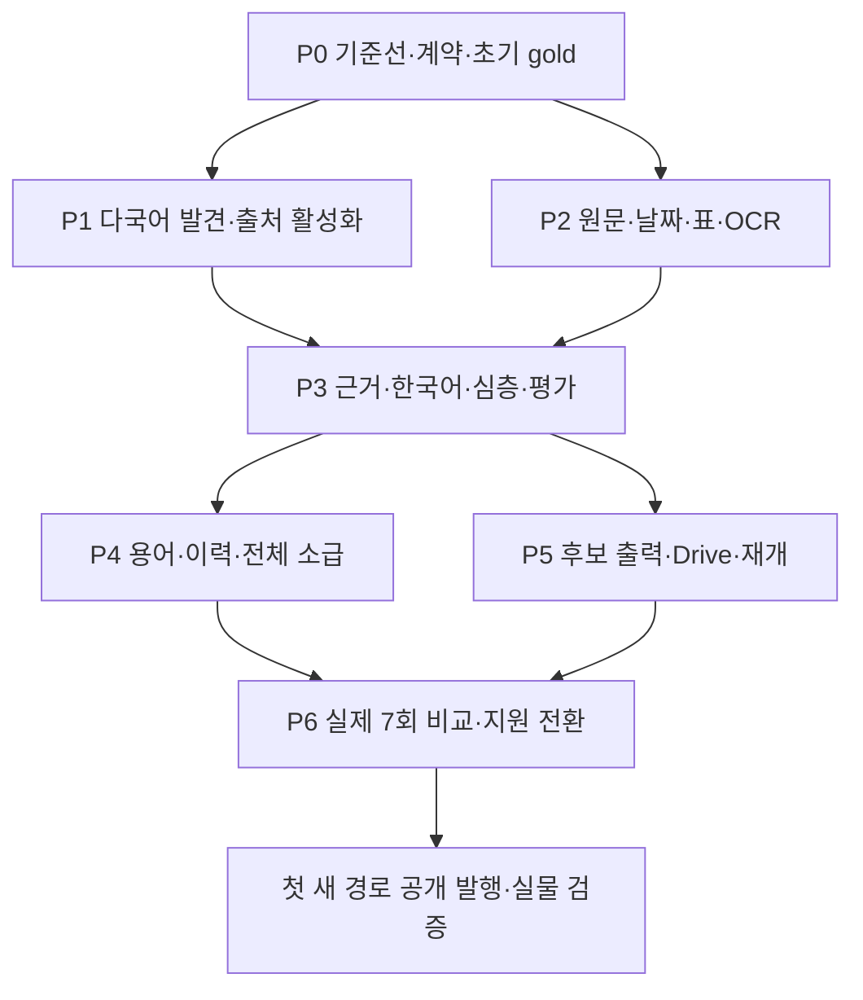

# 로컬 AI 뉴스 시스템 구현 계획

일일 반복 기사 수집과 편집·발행까지의 남은 순서는 [일일 뉴스 수집·편집·발행 구현 명세](DAILY_NEWS_INGESTION_IMPLEMENTATION.md)를 먼저 읽는다. 최신 현황은 로컬 전용 `npm run research -- status --format html`로 생성하며, 등록 출처·일일 활성 경로·실행 영수증·승인 대조·필수 WBS 완료도를 실제 파일에서 집계한다. 아래의 과거 단계별 수치는 실행 당시 기록으로 보존한다.

작성·갱신일: 2026-10-02

**편집·비공개 사본의 실행 지점:** [19.41절](#1941-재발견-후보의-기사-내용-변경-감지와-다음-관문)과 [현재 빌드 24절](LOCAL_AI_NEWS_CURRENT_BUILD.md#24-기사-내용-지문과-재검토-상태-전이)을 읽는다. ABB Dunia 고객 사례를 저장 원문부터 직접 판정해 9월 3일 회차의 비공개 사본에 추가했고, ABB 현대화 특집의 배경 자료 판정을 비공개 후보 장부에 연결했다. 이어 원본 HTML 장식 변경과 추출 기사 내용 변경을 구분하는 재검토 연결을 구현했다. 당시 승인 기사 run 27개·영향 회차 13개·지식 노트 18개·생성 파일 284개(HTML 258개)·digest 132개이며 RSS 40개 식별자는 보존됐다. 당시 비공개 후보 장부는 58건이었다. 이후 `daily-20260929-v4`는 83건, 추가 공식 RSS를 포함한 `daily-20260929-v5`는 후보 장부 85건이며, **새 2건과 앞선 23건을 기사 승인이나 새 비공개 사이트 생성으로 승격하지 않았다.** 어느 수치도 전체 기존 자료 재검토나 Drive·실제 공개·7회 운영 완료가 아니다. 아래의 과거 단계별 수량은 실행 당시 기록으로 보존한다.

이후 NASA Technology 공식 RSS를 수용한 `daily-20260929-v8`은 **9경로/18창**을 로컬에서 모두 수집했다. 등록 registry는 97경로·exact article profile은 40개, 후보 장부는 89건이고 NASA 새 4건은 `unreviewed`다. 조사 32칸 중 6칸만 `partial`, 26칸은 미시도다. 비공개 인계 45건은 사실 승인이나 발행 대상 확정이 아니다. 수집기와 원문 파서의 최신 변경·실제 실패/재개 검증은 [일일 구현 명세 4.6절](DAILY_NEWS_INGESTION_IMPLEMENTATION.md#46-2026-09-29-실제-실행과-자료-위치) 및 [런북 71절](LOCAL_AI_NEWS_RUNBOOK.md#71-nasa-technology-rss-도입과-아홉-경로-일일-수집)을 따른다. 다음 구현의 Drive 기준선·출처 확대·후보/승인 대조·편집·단일 08시 공개 순서는 [일일 구현 명세 7.3절](DAILY_NEWS_INGESTION_IMPLEMENTATION.md#73-다음-구현-묶음의-세부-계약)에 명시했다.

FDA 공식 발표 경로까지 수용한 `daily-20260929-v9`은 **10경로/20창**을 완료했다. 첫 FANUC 두 창의 실패 영수증을 보존하고 그 창만 재개해 최종 성공 20·실패 이력 2 receipt다. registry는 **98경로/41 profile**, 후보 장부는 **92건**이며 FDA 새 3건은 모두 `unreviewed`다. 32칸 중 7칸만 `partial`, 25칸은 미시도다. 비공개 인계 48건은 검토 위치이지 기사 승인 목록이 아니다. 구현 변경과 다음 수용 관문은 [19.43절](#1943-fda-발표-경로-도입-이후의-출처-확장과-편집-연결), 저장 원문·실패/재개의 실제 기록은 [런북 73절](LOCAL_AI_NEWS_RUNBOOK.md#73-fda-공식-발표-경로와-열-경로-일일-실행)에 있다.

이후 인증된 Drive 181개 원문 대조를 입력에 묶은 `daily-20260929-v10`은 10경로/20창 중 **18성공·KUKA 정책 확인 실패 2창**으로 부분 완료됐다. 기존 08시 예약 하나의 지침에는 매번 새 Drive 조회·비공개 수집 단계가 저장됐으나 수정 후 실제 예약 실행은 미검증이다. NVIDIA 공식 보도자료 RSS의 개별 두 창은 원문·날짜·이전 경계까지 완료해 registry **99경로/42 profile**과 활성 **11경로**로 확장했다. `daily-20260929-v11`은 11경로/22창의 **로컬 계획만** 생성했다. 이 상태는 새 기업·운영 칸의 일일 완주나 기사 승인이 아니다. 새 경로의 데이터 계약·시험은 [출처 명세 38절](SOURCE_ACQUISITION_SPEC.md#38-nvidia-newsroom-공식-보도자료-rss의-기간-수집), 다음 단계는 [일일 명세 4.12·7.3절](DAILY_NEWS_INGESTION_IMPLEMENTATION.md#412-기업-동향-원천-추가와-실제-실행의-경계)에 기록한다.

전체 구현의 기본 실행 계약은 [19.25절](#1925-현재-코드에서-전체-서비스까지의-상세-납품-계약), 현재 재개 우선순위와 완료 경계는 [일일 명세 7절](DAILY_NEWS_INGESTION_IMPLEMENTATION.md#7-구현-작업을-나눈-구체적인-순서)이다. Admin plugin·Jalapeño 두 사건을 판정했을 당시 사본은 **17기사/18노트/10과거회차**, 생성 파일279/digest132, RSS40 GUID·발행 시각 보존이었다. 그 판본과 권위 `vault/` 181개·원 HTML 두 개의 SHA 검사는 당시 증거로 보존한다. 이후 비공개 사본의 27기사/13영향회차/18노트 기준도 당시 판본이다. **전체 소급·독립 품질 평가·일일/Drive/공개 전환·신규7회는 계속 남아 있다.** [한 사건의 최소 실행 경로](#19199-한-사건으로-연결할-최소-실행-경로)는 CLI 선행 조건을, [가이드50](LOCAL_AI_NEWS_RUNBOOK.md#50-admin-pluginjalapeño-기사와-의존-지식의-비공개-재검토)은 Admin·Jalapeño 당시의 실제 증거를 설명한다.

- 문서 상태: 상세 구현 계획과 부분 구현 진척. 아래 WBS의 목표 전체와 현재 실행 범위를 구분한다.
- 신규 비공개 경로는 부분 구현됐다. 실제 모듈·CLI·런타임·시험은 [현재 구현과 실행 가이드](LOCAL_AI_NEWS_RUNBOOK.md)를 따른다. 임의의 전체 완료율은 사용하지 않는다.
- 실제 FANUC/UR 원문, 세 심층, Google 두 과거 사건, Microsoft·Model Connect·NemoClaw·NVIDIA 추론 구성과 DeepMind 평가 연구의 작성·정정·비공개 승인을 진행했다. OpenAI/Hugging Face 사고와 Admin/Jalapeño까지 통합한 **당시** 전체 비공개 사본은 17기사/10과거회차/18노트였다. 신규 전문용어 v2 생성·교체와 이중 블라인드 평가 용어의 기사/이력 연결도 비공개로 검증했다. 원문 판본·갱신 날짜·집필 입력 범위와 의존 주제 교훈을 다시 확인했다. Markdown 숫자 범위·논문/릴리스 날짜·혼합 실패 재파싱·분류 프롬프트·기술 문자 보존과 과거 회차의 부분 전환도 구현·시험했다. 공개 원본 수정·신규 경로 Drive 업로드·발행·예약 전환은 미실행이다.
- HTML MathML 보존·미해결 수식 quote 차단과 PPE v1 지정 profile, 일반 뉴스의 논문 참조 승인/공개 전달을 구현·회귀 검증했다. PPE의 직접 사실 검토·실제 로컬 집필·정정·최종 비공개 승인과 과학 발견 AI 노트의 원문 재검토를 완료했다. 통합 중 드러난 사용하지 않는 출처의 잔존을 수정하고 미검토 기사 인용 번호를 보존하는 부분 소급 계약을 추가했다. [19.12절](#1912-수식-근거와-일반-기사의-논문-식별자-연결)은 논문 계약, [19.13절](#1913-ppe-통합과-부분-소급의-출처-보존)은 실제 결과와 다음 작업을 설명한다.
- 구현·직접 원문 검토는 Codex가 수행했다. 사람의 독립 평가, 운영 전환 판단과 담당자는 별도로 확정한다. 명령 실행·설정 저장·부분 시험만으로 WBS 전체를 완료 처리하지 않는다.
- 과거 Node407/45suites 및 12기사/8과거회차/15노트 검증은 [39절](LOCAL_AI_NEWS_RUNBOOK.md#39-url-논문-식별자학생-기사rct-용어의-실제-통합)의 당시 기록이다. 이번 최신 통합의 Node 검증은 `npm run test:garden` **273pass/0fail/0skip**, Python 전체60pass, TypeScript exit0다([가이드50](LOCAL_AI_NEWS_RUNBOOK.md#50-admin-pluginjalapeño-기사와-의존-지식의-비공개-재검토)). 이전 단계의 시험 수치나 미승인 모델 후보를 현재 사실 승인으로 혼합하지 않는다. 권위 Drive 원본의73verified/14unreviewed 상태와 기존 08시 예약은 이 작업으로 바꾸지 않았다. 초기14개 중 **private 추가 판정 14개**를 모두 마쳤지만 이는 전체92회차/801구간의 최종 판정이 아니다.
- 상위 설계: [로컬 AI 뉴스 시스템](LOCAL_AI_NEWS_SYSTEM.md).
- 수집 상세 계약: [소스 확보 명세](SOURCE_ACQUISITION_SPEC.md).
- 기존 편집·보관 규칙과 충돌하면 충돌을 먼저 기록하고 합의된 규칙을 확정한다.

## 현재 진척과 다음 완료 증거

기준일 2026-10-02. `부분`은 해당 코드 또는 일부 시험이 있으나 작업의 모든 수용 조건을 충족하지 않은 상태다. 아래 진행표가 과거 문서의 0%·전부 미구현 설명을 대체한다. 본문의 체크박스는 전체 목표의 세부 완료 조건이다. 상태 화면은 이 표의 22개 필수 WBS 항목을 전체 완료 기준으로 집계하며, `부분`은 완료 분자에 포함하지 않는다.

작업 중 같은 원인을 반복 시도하며 1시간 이상 진척이 없으면 비공개 실행 기록에 막힌 작업·시작 시각·시도와 결과·현재 가설·독립적으로 진행할 다음 항목을 남긴다. 장애 기록 때문에 나머지 구현을 멈추지 않는다. 실제로 발생하지 않은 장애나 시간을 소급해 기록하지 않는다.

| WBS                         | 현재 상태·확보한 증거                                                                                                                                                                                                                                                                                                                                                                                                                                                                                                                                                                                                                                                                                                                                                                                                                                                                                                                                                                                                                                                                                                                                                                                                                                                                                 | 다음 완료에 필요한 작업                                                                                                                                                      |
| --------------------------- | ----------------------------------------------------------------------------------------------------------------------------------------------------------------------------------------------------------------------------------------------------------------------------------------------------------------------------------------------------------------------------------------------------------------------------------------------------------------------------------------------------------------------------------------------------------------------------------------------------------------------------------------------------------------------------------------------------------------------------------------------------------------------------------------------------------------------------------------------------------------------------------------------------------------------------------------------------------------------------------------------------------------------------------------------------------------------------------------------------------------------------------------------------------------------------------------------------------------------------------------------------------------------------------------------------- | ---------------------------------------------------------------------------------------------------------------------------------------------------------------------------- |
| P0-01                       | 부분: Drive 네 작성 폴더 193개 raw-byte 재조회와 로컬 193/193 bytes 일치, 9개 하위 폴더·부모 경로 검증; 이전 188개 스냅샷 대비 추가 5·수정 3·삭제 0; 현재 배포 원본 193개 경로·SHA와 모두 일치. 최신 소급 inventory는 108 사건(94 verified·14 검토 필요), 구형 85회차/752 단위, 27개념/36작성 관계, Signals25·주제16·RSS40. 96개 미확정 후보의 exact URL로 998개 과거 source run을 재검증한 뒤 빠진 13 URL을 기존 collector로 보충했다. 현재 pinned receipt는 94후보/516판본/739parse를 연결하고 2개는 차단 상태, 수집 무결성 실패는 0이다. 2026-10-01 Reuters Agency 대체 공식 원문에서 별도 14-block parse·2 verified facts·정정 sample·private article approval·same-event candidate link까지 완료(candidate_published=false)했고, 대체 page published_at은 null로 보존했다. KERI 공식 목록/detail fetch는 blocked다. 9 parse는 완전 추출, 2는 partial이며 9개 중 4개만 현재 fingerprint 조건을 충족한다. 120개 과거 parse 참조는 후보 본문 지문과 같지만 parse ID가 달랐고, 다른 내용 지문 연결 17개를 별도 검토한다. 약 51분 지난 Drive snapshot은 신규 계획 입력에서 제외. Palladyne 후보 1건은 원문 8사실·고정 source version/parse·Drive 9/9 회차 원본 SHA 검증 후 historical-addition 승인 및 4기사 비공개 preview에 연결(RSS40 GUID/pubDate 동일, 공개 미반영). 비공개 영수증은 런북112~120 ; 14개 날짜 검토 사건은 현재 작성본 원본 SHA와 일치하는 source-reviewed approval 14개를 확인하고, 7회차·14사건 private preview 및 RSS GUID/pubDate 40쌍 보존을 검증했다. RCT의 미등록 concept ID는 새 approval에서 제거했고 기존 승인은 보존했다; manifest SHA 0152f4afe6e5e028142e4ebbfad2a66302219db82684be0b1ada79a691cec85b, Drive/public 변경 없음| 96개 후보 사건 정체성 검토, blocked KERI 원문·partial 2건·fingerprint 미생성 5건 검토, 다른 기사 내용 17참조 판정, 남은 구형 회차·지식 의존성 집계 |
| P0-02                       | 완료: claim 모델 출력과 저장 envelope 구분을 문서 예시·런타임 extractionSchema 회귀로 고정; fetch/parse/candidate/claim-review/article-review 상태와 candidate 전이를 하나의 fixture에서 런타임 정의와 대조; article_records·중첩 객체의 알 수 없는 필드 거부; 공개 metadata allowlist에서 next_check·운영 메모 제외; GET/POST 재시도와 blocked/parse 실패의 새 관측·재파싱 규칙 문서화                                                                                                                                                                                                                                                                                                                                                                                                                                                                                                                                                                                                                                                                                                                                                                                                                                                                                                               | P0-03 평가 원문·사람 검토 gold를 40개 개발/20개 보류로 확장                                                                                                                  |
| P0-03                       | 부분: 실제 16개 고유 development 원문 snapshot·104사실·21원URL; 6언어/8분야; 로봇·제조 7건·연구 사업화 2건; Frontiers 142블록 실제 재실행과 evaluation-review provenance/구조/coverage 판정 구현; OpenAI-Hugging Face 공식 사고 PDF 38쪽·504 block에서 사이버보안 7사실, KAIST RAIBO2 원문에서 교원창업·제품화 6사실 및 Qwen 3.8 27B 실추출(source adjudication full 1/partial 3/missing 2, pass false), Universal Robots 합의 기사에서 발언자 귀속 3사실 및 Qwen 3.8 27B 실추출(4 claims·구조 4·coverage full 2/partial 1·pass false) 추가. MIT News robot article에서 7개 원문 사실을 고정하고 Qwen 3.8 27B 실출력 6 claims(구조 4/6·semantic full 4/partial 3·raw pass false)을 source-adjudicate. 추출·작성 프롬프트에서 발언자와 claim subject 분리 지시를 보강하고 같은 원문 재실행 시 발언자 facts full 3/3, 기사 초안 발언자 보존; 테마 불일치와 회사명 한글화는 정정 경로에서 수정. 독립 human gold·heldout 0                                                                                                                                                                                                                                                                                                                                                                                                                                                                                                                                                                                                                                                                                                                                                                                                                                    | 보안·AI논문·한국어 교수/고객 사례·독립 검토 →40개발/20보류                                                                                                                   |
| P1-01                       | 부분: 기존 채널/추적 목록 통합 114경로·일일 29경로·수집 프로필 30개·기사 프로필 71개·공통 날짜 페이지네이션·SK RSS→아카이브 경계 대체 실제 검증; 두산로보틱스 국문 뉴스의 공식 Total 41/41 목록과 2026-06-22 상세 원문을 실제 날짜창으로 확인하고 국내·기업 운영 route를 일일 범위에 추가; 현황판에서 등록 114·활성 29·일일 범위 밖 85·수집 증거 30·등록만 84 구분; 기업/IR/연구/사업화 유형을 전 114경로에 명시하고 미분류 0건 검증; Doosan 국·영문 2026-06-22 후보를 동일 비공개 사건으로 각각 연결해 다국어 중복 검토 완료; Universal Robots 공식 PageDefaultService의 robots-checked JSON pagination 계약 확인·`route-ur-news-en` bounded scanner 연결; 194건/17페이지 metadata와 실제 page 2 응답 확인; Gen 7 2026-09-14 상세 원문 1건 추출 및 2026-09-23~10-02 기간 0건의 이전 경계 완료; 일일 29경로에 baseline 등록; HD현대로보틱스 공식 공시 bdSeq=54 JSON 0건 응답을 1페이지 scan으로 확인하고 route-hd-disclosure-ko 일일 baseline 완료; `daily-20261001-current29-integrated-v1` current fingerprint 기준 29/29 routes 완료·58창 계획 중 57개 신규 receipt, 기존 verified NLR 창 1개 skip·실패/재시도 0·약 12분; coverage 32칸은 18 partial/14 not_attempted                                                                                                                                                                                                                                                                                                                                                                                                                                                                                                                                                                                                                                                                                                                                                                                                                                                                                                                                                                                                            ; NLR 동일 원문 동시 수집 2창 실물 재검증(window_scanned 2/2), 과거 창 후보 1건 supplemental coverage 반영, 당일 창은 미경과로 coverage 미반영; 신규 UR 2026-10-01 detail profile 누락을 공통 profile로 복구, 실물 window_scanned·후보1·unreviewed 병합 및 Gen7 중복 match 없음 검증; UR 2026-10-01 합의 보도 원문·게시일·기존 공개 사건 대조, 기사/후보 동일 ID 승인 및 handoff 단일화(비공개·미발행; 런북184절)| 기업 운영 IR 경로와 다른 제조사 원문/첨부의 기간·상세 검증                                                                                               |
| P1-01 최신 보강(2026-10-01) | Yaskawa 기존 글로벌 혼합 경로 ID·주소 보존; 공식 News/New Product/IR 카테고리를 공통 날짜 목록 스캐너에 연결; 뉴스 44건(일반 43+통합 전략 PDF 1)·제품 44건·IR 결과/설명회 PDF 26건의 날짜/링크 및 기간 경계 검증; HC12·Vision 2035/Dash 35·2026년 1분기 결과/설명회 원문 상세 추출. PDF 안의 발행일이 모호할 때 IR 공식 목록 날짜와 목록 원문 판본을 발행일 근거로 보존. 당시 일일 활성 26, 등록 113, profile 26/66. ABB Destination Zukunft 추가 후 당시 설정은 27/67이었다. 두산 국문 경로를 잇고 난 당시 설정은 acquisition profile 28개·article profile 70개·일일 route 27개였다. 이후 추가 경로 수치는 로컬 현황판 current snapshot을 기준으로 한다.                                                                                                                                                                                                                                                                                                                                                                                                                                                                                                                                                                                                                                                                                                                                                               | Yaskawa 기존 혼합 글로벌/일본어 상세 profile, 전체 활성 경로 통합 일일 실행 및 후보 검토                                                                                     |
| P1-02                       | 부분: 분야32+제조사30의62질의·v2검증·재개;682관측/642고유후보·일부 엔진 오류; Mwmbl·Yahoo 무키 영어 보조 검색을 메인 월간 검색과 분리 연결, 실행 receipt에 성공·실패 엔진 기록; 실물 질의에서 기본 후보 25개 중 22개 중복·신규 source URL 3개 확인; Qwant probe는 CAPTCHA; 전체 후보 미검토                                                                                                                                                                                                                                                                                                                                                                                                                                                                                                                                                                                                                                                                                                                                                                                                                                                                                                                                                                                                                                                                                                                                 | 다국어별 검색 공급자 추가·고객/공급사 후속 질의·페이지네이션·원출처 확인과 전체 검색 실패 복구                                                                              |
| P1-03                       | 부분: 현재 후보 169건(69 verified/9 deferred/1 rejected/90 unreviewed·승인 receipt 13건, backlog SHA-256 `990c936c258197786592d911d9d322abf080e63078228d220e0b8b66cdcca22c`; 같은 본문 중복 관계는 게시일이 달라도 검토 대기로 연결; 같은 공식 호스트·게시일의 서로 다른 조사 언어 후보 1쌍을 비공개 `samePublisherDayCrossLanguageCandidate` 검토 신호로 연결하며 동일 사건 판정은 하지 않음)·23경로/46창 통합 실행 전부 `window_scanned`·SK 공식 아카이브 fallback 검증·읽기 전용 후보 온톨로지 연결(후보 153·원문 148·사건 59·판본 91·연결 관계 61)·ASEC 원문 정정 제목 반영·32칸 중 17 partial/15 미시도; 등록부에 29개 보완 검색 영수증 연결(17 partial·12 failed, 후보 81행/고유 URL 79개·중복 URL 행 2개); 삼성SDS exact-source 로컬 추출·편집대기 초안과 후보 발견→수집/parse→batch intake→source-selection 단일 workflow 실물 실행·중단 재개·blocked 후보 격리 구현; pinned handoff 96후보의 저장 원문 검증 및 13 exact URL 보충 수집(94후보의 과거 source/parse, 2차단, 9 extracted/2 partial); KUKA FSW 공식 원문 10블록·직접 검토 6사실·비공개 승인 및 후보 링크 완료; ABB Destination Zukunft의 공통 Next.js page-data 파서 실물 재파싱 23블록·검증 8사실·후보 링크 완료; 998개 과거 run integrity 0 실패; Frontiers 전문 142 blocks 추출·11 verified/9 deferred·비공개 기사 승인과 후보 exact identity link, 동일 backlog SHA 재실행                                                                                                                                                                                                       ; 2026-10-01 Doosan CEO 한 사건의 연합뉴스·공식 영문 원문 검증, 서로 다른 게시일 보존, 동일 승인 기사에 후보 2개 연결 및 handoff 1건 중복 억제(비공개·미발행; 런북180절); UR 분쟁 합의 공식 원문 1건의 fact/editorial/candidate 승인과 traceable private ontology 연결(런북184절)| 등록 출처 전반 수집 증거 확대·검색 실패 12건 공식 대체 경로·96건 사건 정체성 검토·KERI 공식 본문 blocked, partial/fingerprint 미생성 후보 및 다른 내용 지문 17참조 검토      |
| P2-01                       | 부분: DNS/IP·예산·조건부 요청·버전·직접/브라우저 robots 확인·동일 source 동시 요청 직렬화·소유 확인형 stale lock 복구·GET의 일시 네트워크 오류 제한 재시도·교차 프로세스 host request pacing; live 2026-10-02 GitHub 301 허용·Nature 303 IDP 차단 확인| 등록 출처 실물 redirect·robots 실패율·재시도 영향 및 다중 host 제한 확인                                                                                                   |
| P2-02                       | 부분: HTML/표·PDF/OCR·Markdown 줄 근거·28기사 profile(두 OpenAI 발표 포함)·명시 날짜 실패/offset 없는 metadata 차단·공통 Article JSON-LD 및 의미 있는 `time[itemprop=datePublished]` 추출과 근거 보존·원문 재파싱 3건의 날짜 복구·MathML/정의 목록 보존·Frontiers JATS 및 복합 표 5개 재파싱·미지원 MathML 원형 XML 비공개 보존·논문 claim 연결·한국어 scan-PDF PP-OCRv5 고정 모델 라우팅 및 이미지 PDF 회귀(문자 오인식 1건 후속 기록)·ABB Next.js `__NEXT_DATA__` 공통 parser와 실제 23블록 재파싱                                                                                                                                                                                                                                                                                                                                                                                                                                                                                                                                                                                                                                                                                                                                                                                                  | 장문 메모리 예산·구간 재개, 다국어 OCR 회귀셋·숫자/표 검증, Qwen/Vestas partial 본문 보정과 날짜 없는 원문 추가 확인                                                         |
| P2-03                       | 부분: 과거10개 snapshot 가져오기·199버전 정정 목록·824파일 ZIP 바이트 대조·수동 공식 HTML 두 판본의 SHA 검증 편입                                                                                                                                                                                                                                                                                                                                                                                                                                                                                                                                                                                                                                                                                                                                                                                                                                                                                                                                                                                                                                                                                                                                                                                     | 사건/검토→원문→Drive 왕복 추적·원격 복구                                                                                                                                     |
| P3-01                       | 부분: 설치 메타데이터·지원 think·Schema·실제 호출·신규 원 요청/응답 보관                                                                                                                                                                                                                                                                                                                                                                                                                                                                                                                                                                                                                                                                                                                                                                                                                                                                                                                                                                                                                                                                                                                                                                                                                              | 설정 외부화·서버 로컬 정책·장기 실행 재현                                                                                                                                    |
| P3-02                       | 부분: 직접 검토·승인 재검사·분할/재개·6예산; 논문15요청 완주·8기준 대조/누락 확인; 삼성SDS exact-source 로컬 추출 실물 검증(claim 6개 검토: 6 verified/1 rejected)                                                                                                                                                                                                                                                                                                                                                                                                                                                                                                                                                                                                                                                                                                                                                                                                                                                                                                                                                                                                                                                                                                                                    | 역할별 중요 근거·묶음간 조건 통합·60건 의미 검토                                                                                                                             |
| P3-03                       | 부분: FANUC/UR·세 심층·Google2·Microsoft/Model Connect/NemoClaw/NVIDIA/DeepMind/PPE/AWS/Nature/HF 및 삼성SDS 실제 집필·직접 정정·private 승인/편집대기 초안·SkinAxis 실제 JATS 논문 7 claim·6 role 심층 검토 및 Qwen draft 교정                                                                                                                                                                                                                                                                                                                                                                                                                                                                                                                                                                                                                                                                                                                                                                                                                                                                                                                                                                                                                                                                       | 잔여 Admin/Jalapeño 정정과 독립 평가·다양한 원고 검증                                                                                                                        |
| P3-04                       | 부분: UR 검토 사실의 같은 입력 Qwen/Gemma 작성 비교; 두 원출력 미합격                                                                                                                                                                                                                                                                                                                                                                                                                                                                                                                                                                                                                                                                                                                                                                                                                                                                                                                                                                                                                                                                                                                                                                                                                                 ; 같은 두산 공식 원문 Qwen3.8:27b fact extraction의 think medium/false 동일입력 실측 185,704ms/142,528ms(23.3% 단축), 구조 통과 2/6→3/6; 단일 표본이라 기본 정책은 유지(런북179절) | 60건·여러 역할/추론 비교·보류 평가·메모리/처리량                                                                                                                             |
| P4-01                       | 부분: 공통 DOI/arXiv/HTTPS URL identity·status null·일반/심층 검토→canonical·실제 PPE/RCT 채널 일치                                                                                                                                                                                                                                                                                                                                                                                                                                                                                                                                                                                                                                                                                                                                                                                                                                                                                                                                                                                                                                                                                                                                                                                                   | 전체 판본·기업 별칭·동명이인 실제 검토 확장                                                                                                                                  |
| P4-02                       | 부분: RCT 신규 생성·Agent Evaluation 교체와 보안/추론 의존 지식을 포함한16노트 private 통합·이유/근거 보존                                                                                                                                                                                                                                                                                                                                                                                                                                                                                                                                                                                                                                                                                                                                                                                                                                                                                                                                                                                                                                                                                                                                                                                            | 나머지 노트 실제 축적·정정 전파·권위 원본 반영                                                                                                                               |
| P4-03                       | 부분: 전체 의존 목록·날짜 정정·초기 미검토 중12사건 private 판정·과거 회차 부분 전환·사본 대조                                                                                                                                                                                                                                                                                                                                                                                                                                                                                                                                                                                                                                                                                                                                                                                                                                                                                                                                                                                                                                                                                                                                                                                                        | 잔여2사건/92회차·의존 지식·권위 자료 반영·제외 전파                                                                                                                          |
| P5-01                       | 부분: 원자 저장·lock·stage 재개·변경 입력 거부·전체 private preview·실제 ENOSPC 후 재개; 독립 완료 scan의 증거 검증·backlog 병합·coverage 재개 및 동일 창 resume 재호출 방지; 편집 승인 checkpoint 불변 재시도; 창당 자동 시도 2회 제한·blocked 새 관측 대기·비공개 실패 큐/현황판; 수집·검증·후보 병합별 ms 계측·재개 누적 집계; daily source-selection ID와 별도 모델 run의 document/parse SHA-256 결합·교차 날짜 중복 방지; 로컬 content publish 단일 lock·중복 차단; Git push 응답 영수증과 원격 SHA readback·응답 유실 후 재개 시험                                                                                                                                                                                                                                                                                                                                                                                                                                                                                                                                                                                                                                                                                                                                                              ; stale lock는 `recover-lock --lock --expected-owner`로 PID 종료·UUID를 확인한 경우만 복구, active/malformed/mismatched 보존; 최신 개발: 일일 scan은 서로 다른 경로 최대 4개 병렬, 같은 경로 창·후보 병합은 직렬 처리하고 receipt/coverage를 창별 저장; 재개·순서·동시성 회귀 23/23; 실물 28경로 55/55 receipt 완료·receipt wall 977,122ms→701,522ms(28.2% 감소)·coverage cell 동일; --resume에서 추가 scan 0; 2026-10-02 current-fingerprint run은 29 routes·58 planned/57 receipts(NLR 보완 창 1개 생략)·14분 14.7초·retry 0; --resume receipt set SHA 동일·linked model run 0·candidate/Drive/public 검증 false| 실측 분포를 반영한 일일 예산 설정·발행 전체 단계 잠금/기존 08시 경로와 공유·Drive 원격 단계 복구·오전 8시 공통 lock·배포/RSS/Drive readback·전체 재개 감사              ; 다음: 기존 08시 lock 공유·Drive 원격 단계 복구 및 배포/RSS/Drive readback 연결 검증|
| P5-02                       | 부분: 기존 08시 자동화에 daily collector·Research package/upload/readback 절차 추가; connector 시험과 Yaskawa bytes 왕복은 확인, 실제 예약 실행·독립 OAuth·토큰 갱신은 미검증                                                                                                                                                                                                                                                                                                                                                                                                                                                                                                                                                                                                                                                                                                                                                                                                                                                                                                                                                                                                                                                                                                                         | 실제 08시 실행 receipt에서 수집/Drive 경로 확인, 자격 증명 갱신·재연결 또는 독립 실행이 필요할 때 명시 동의 기반 OAuth 검증                                                  |
| P5-03                       | 부분: 기존 181 원본 일치; run archive 원문 SHA 검증·private ZIP 생성; Yaskawa Research 같은 ID 업데이트와 bytes SHA readback 통과                                                                                                                                                                                                                                                                                                                                                                                                                                                                                                                                                                                                                                                                                                                                                                                                                                                                                                                                                                                                                                                                                                                                                                     | collector upload/revision/conflict recovery의 공통 연결                                                                                                                      |
| P5-04                       | 부분: 최신15기사/9과거회차/16노트 private 사이트·RSS40·기사/용어·1440/390px·클릭/키보드 검증                                                                                                                                                                                                                                                                                                                                                                                                                                                                                                                                                                                                                                                                                                                                                                                                                                                                                                                                                                                                                                                                                                                                                                                                          | 전체 지식 정정·Drive 연결·실제 첫 발행                                                                                                                                       |
| P6-01                       | 미완료: 기존 발행 비교 관문은 있으나 새 수집·승인 경로의 실제 비교 회차 없음                                                                                                                                                                                                                                                                                                                                                                                                                                                                                                                                                                                                                                                                                                                                                                                                                                                                                                                                                                                                                                                                                                                                                                                                                          | 서로 다른 새 경로 7회에서 기존 공개본·원문 범위·중복·품질을 증거로 대조                                                                                                      |
| P6-02                       | 미완료: 현행 GPT 발행과 로컬 후보 작업은 존재하나 지원 운영 전환 조건 미충족                                                                                                                                                                                                                                                                                                                                                                                                                                                                                                                                                                                                                                                                                                                                                                                                                                                                                                                                                                                                                                                                                                                                                                                                                          | 승인·Drive 재읽기·공개 검증이 연결된 한 경로, 복구 시험 및 7회 품질 판정                                                                                                     |
| P6-03                       | 미승격: 무인 발행은 필수 지원 운영 완료율에서 제외                                                                                                                                                                                                                                                                                                                                                                                                                                                                                                                                                                                                                                                                                                                                                                                                                                                                                                                                                                                                                                                                                                                                                                                                                                                    | 별도 평가·운영·사용자 전환 판단                                                                                                                                              |

이전 심층 계약·재파싱 검증에서는 JS312개·worker10개와 TypeScript·validate·build/site를 통과했다. 이후 원문 보관 정정·묶음 추출·예산 제어·빈 분석 생략·출처별 파서를 보강했다. 이번 변경까지의 실행 결과는 [실행 가이드10](LOCAL_AI_NEWS_RUNBOOK.md#10-테스트와-로컬-검증)과 후속 절에서 구분한다. 현재 실제 기준11사례는 Codex 직접 검토 후보이며 독립 사람 gold는0이다. 이는 P0 실제60건 평가나 P6 실제 운영 횟수를 대신하지 않는다. 이번 코드·문서 변경은 아직 commit·push·배포하지 않았다.

## 1. 완료할 결과와 유지할 조건

로컬 모델이 다양한 출처를 탐색하는 도구를 이용하고, 읽은 원문에서 사실을 추출해 한국어 기사와 설명을 작성한다. 검증한 결과만 기존 서비스의 기사·브리핑·RSS·GitHub 정리에 반영한다.

- 기존 8개 분야와 기술·제품/기업·운영 두 축, 국내외 조사 기회를 유지한다.
- HD현대로보틱스와 국내외 산업용·협동로봇 제조사 조사는 기존 범위에 포함한다.
- 기업 전략·논문·교수 창업 추적을 유지하며 기사 수를 채우려고 근거를 낮추지 않는다.
- 육하원칙 2~4문장은 리드다. 이해에 필요한 작동 방식·조건·집행 대상은 근거 있는 설명으로 이어 쓴다.
- 분석할 근거가 없으면 해당 문단·섹션·탭을 생략한다. 독자에게 생략 이유를 설명하지 않는다.
- 뉴스·브리핑 화면에는 연결지도를 넣지 않는다. 전문용어 지도와 회사·분류 태그를 구분한다.
- 공개용 원본은 기존 Editions, Knowledge, Signals, TrendTopics를 사용한다.
- Google Drive를 최종 원본 위치로 유지하고 로컬 vault는 작업·검증 사본으로 사용한다.
- 기사 ID·기존 URL·RSS GUID·회차 날짜를 보존한다. 소급 수정으로 오늘의 신규 건수를 늘리지 않는다.
- 정상 정기 실행은 기존 오전 8시 경로 하나만 유지한다. 별도 중복 예약과 추가 유료 API를 도입하지 않는다.
- 무오류를 보장한다고 표현하지 않는다. 알려진 핵심 오류를 차단하는 검증 기준과 실패 처리로 품질을 관리한다.

## 2. 착수 시 재확인할 현재 구조

다음은 기존 운영에서 재사용할 파일을 읽어 확인한 범위다. 신규 코드와 실행 범위는 위 진행표 및 실행 가이드에 따로 기록한다. 기존 파일의 존재가 새 경로의 운영 성공이나 배포 완료를 의미하지 않는다.

| 기존 파일·구조                                 | 재사용 역할                                | 이번 계획에서 보완할 경계                       |
| ---------------------------------------------- | ------------------------------------------ | ----------------------------------------------- |
| `scripts/research-window.mjs`                  | 7일 중첩 탐색, 미수록 후보, 과거 사건 분기 | 실제 검색·수집 실행과 지속 가능한 작업 상태     |
| `scripts/source-diversity.mjs`                 | 고유 사건의 첫 원문 도메인 분포            | 조사한 경로·언어·원출처 계열의 별도 기록        |
| `scripts/prepare-drive.py`                     | 알려진 URL과 원고의 보관 묶음              | 새로운 사건 발견, 원문 변경 감지, 긴 문서 처리  |
| `scripts/editorial.mjs`                        | 기사 구조, 본문 일치, 출처 URL 포함 검사   | 주장과 근거의 의미 일치, 수치 조건, 한국어 품질 |
| `scripts/garden.mjs`, `scripts/briefings.mjs`  | 웹·RSS·GitHub 생성                         | 승인 결과를 기존 계약으로 넘기는 어댑터         |
| `scripts/pull-drive.py`, `scripts/publish.mjs` | Drive 검증·생성·배포 관문                  | 독립 실행기의 인증과 재시작·중복 방지           |
| `vault/Knowledge`, `Signals`, `TrendTopics`    | 지식·변화 이력                             | 검증된 사건에 한정한 근거 연결과 정정 전파      |

`prepare-drive.py`의 성공 캐시는 원문 해시를 확인한 뒤 재사용한다. 이 동작만으로 정정·수정된 최신 원문을 찾았다고 판단하지 않는다. 현재 수집의 5 MiB 한도와 HTML/PDF 처리 범위도 새 수집기와 분리해서 검토한다.

기존 검증기는 URL이 기사 출처에 포함되는지 확인하지만 그 URL의 문장이 해당 주장을 입증하는지까지 증명하지 않는다. 교수 창업의 URL 수 검사도 대학과 회사 각각의 명시적 창업 근거 확인을 대신하지 않는다.

## 3. 작업 방식과 데이터 경계

- JavaScript/TypeScript의 기존 발행기와 Python 수집·보관 코드를 우선 재사용한다.
- 검색·원문 추출·모델 호출·검증·발행을 각각 교체 가능한 작은 모듈로 나눈다.
- 다중 에이전트 프레임워크, 외부 벡터 DB, 새 웹 프레임워크 도입은 기본 작업에 포함하지 않는다.
- 초기 작업 상태는 기존 backlog JSON과 원자적으로 저장하는 실행 journal·lock으로 관리한다.
- SQLite는 규모·성능상 필요가 입증될 때 비공개 큐·lock·캐시 색인용으로만 검토한다. 지식의 두 번째 원본으로 만들지 않는다.
- 기존 `.local/research/candidate-backlog.json`은 유지한다. 신규 로컬 실행 자료는 `.local/research/local-ai/` 아래에 두고 저장 방식 변경 시 기존 후보를 읽고 되돌릴 수 있어야 한다.
- Node 실행기와 Python 문서 worker의 입출력은 JSON-lines 계약으로 나눈다. 현재 Python 3.12.14 venv에서 Trafilatura·PyMuPDF·RapidOCR를 시험했으며 큰 문서·복잡한 표의 추가 수용 조건은 P2에 둔다.
- 모델은 승인된 읽기 도구와 원문 데이터만 받는다. 임의 셸 실행·자격 증명 읽기·Git push 권한을 주지 않는다.
- 외부 페이지에 있는 지시문은 수집한 본문으로 취급한다. 시스템 규칙이나 발행 권한으로 해석하지 않는다.
- 발행기는 모델 답변을 직접 커밋하지 않는다. 승인된 공개 원고만 입력으로 받는다.

| 데이터    | 최소 필드                                                             | 보관 위치                             |
| --------- | --------------------------------------------------------------------- | ------------------------------------- |
| 발견 후보 | `candidate_key`, 발견 URL·시각·언어·검색 경로, 후보 상태              | 비공개 Research                       |
| 원문 버전 | `source_id`, 버전·해시, 원 URL·최종 URL, 발표·관측 시각, 본문 구간 ID | 비공개 Sources                        |
| 사실      | `claim_id`, 원문 구간, 주체·행위·대상·수치·단위·조건·계획 여부        | 비공개 Research                       |
| 사건      | 고정 `event_id`, 원문 목록, 사건 날짜, 검토 날짜, 중복·버전 연결      | 비공개 기록 및 승인된 공개 메타데이터 |
| 공개 기사 | 기존 `article_records`, `article_reviews`, `explanations`             | 공개용 Editions                       |
| 작업 실행 | `run_id`, 입력 해시, 모델·프롬프트 버전, 단계·오류·재개 위치          | 비공개 Research                       |

## 4. 품질 판정과 측정 계약

### 핵심 오류와 출고 관문

핵심 오류는 기업·인물 오식별, 날짜 왜곡, 계획의 완료 전환, 숫자·단위·조건 왜곡, 출처 없는 사실·인과 주장, 타 사건의 근거 연결, 유료 본문 미열람 내용 생성, 비공개 자료 노출이다.

- 고정 평가와 보류 평가에서 핵심 오류 0건을 출고 관문으로 사용한다.
- 이 기준은 평가한 표본에 대한 판정이며 앞으로 모든 기사에서 무오류라는 보장이 아니다.
- 핵심 오류가 있으면 평균 점수와 무관하게 해당 버전을 통과시키지 않는다.
- 두 모델의 동의, 높은 자체 신뢰 점수, JSON 파싱 성공은 사실 검증의 대체 증거가 아니다.
- 원문 직접 확인과 최종 원고 읽기를 요구하는 기존 편집 규칙은 유지한다.
- 자동 발행 전환은 수집·작성 자동화와 별도 판정한다. P6의 추가 조건을 만족하기 전에는 자동 승인하지 않는다.

### 읽기 품질 평가표

| 항목          | 0점                         | 1점                           | 2점                                     |
| ------------- | --------------------------- | ----------------------------- | --------------------------------------- |
| 사건 이해     | 주체·행위가 틀리거나 불명확 | 이해되지만 핵심 조건 부족     | 제목과 리드로 주체·행위·시점 명확       |
| 설명의 정보량 | 원문에 없는 추론·홍보 문구  | 리드를 반복하거나 일반론 중심 | 작동·적용·비교 조건 중 필요한 정보 제공 |
| 한국어 정확성 | 이름·용어 오역, 의미 왜곡   | 어색한 표현이나 과도한 직역   | 자연스럽고 고유명사·용어 일관           |
| 편집의 절제   | 빈 분석·안내·변명·반복 포함 | 일부 중복 또는 불필요한 문장  | 근거 있는 내용만 간결하게 구성          |
| 근거 추적     | 주장과 원문 연결 불가       | URL은 있으나 구간 확인 어려움 | 주요 사실을 원문 구간에서 추적 가능     |

초기 통과 목표는 항목별 1점 이상, 총 9/10 이상으로 제안한다. P0에서 평가자와 사례로 기준을 고정하고, 결과를 통과시키기 위해 사후 완화하지 않는다. 분석이 필요 없는 기사는 분석 생략 자체로 감점하지 않는다.

### 처리 성능은 별도로 기록

- 모델 로드, 입력 처리, 생성, 재검토, 전체 작업의 실제 시간을 나누어 측정한다.
- 최대 메모리, 메모리 압박·스왑, 입력 길이, 동시 작업 수, 캐시 사용 여부를 기록한다.
- 하루 후보·기사·심층 처리량은 실제 표본에서 산정한다. 한 기사 속도로 40건 처리 완료를 추정하지 않는다.
- 정확성 통과와 처리 시간 목표 통과를 별도 결과로 보관한다. 속도를 맞추기 위해 근거 검사를 생략하지 않는다.
- 오전 8시 실행의 완료 시각 목표는 실제 측정 후 확정한다. 8시 시작을 8시 발행 완료로 표현하지 않는다.

## 5. P0 — 계약·평가 원문·복구 기준선

담당: 현재 코드 구현·직접 원문 검토 Codex / 독립 품질 검토 담당 미지정. 선행 의존성: 없음.

### P0-01 기존 상태와 전체 분모 확정

- [x] 기사·회차·원문·전문용어·관계·RSS 식별자 목록을 만든다. 목록 작성과 항목별 최종 판정은 구분한다.
- [x] 새 형식과 구형 원고를 각각 집계하고 중복 사건·제외 사건을 구분한다.
- [x] Git 상태, Drive 원본 목록·수정 시각, 로컬 차이를 읽기 전용으로 대조한다.
- [x] 기존 사용자 수정과 진행 중 작업을 분리하고 원고·식별자 복구본을 확보한다.
- 수정 예정 기존 파일: 필요 시 `scripts/garden.mjs`의 목록 출력 기능. 원본 변환은 이 단계에서 하지 않는다.
- 코드·시험 대상(현재 존재 여부는 실행 가이드 참조): `.local/research/local-ai/baselines/<baseline-id>/inventory.json` 및 `vault/` 복구 사본. 경로별 해시는 inventory 안에 저장한다.
- 입력: 로컬·Drive 원고, 기존 catalog, RSS. 출력: 전체 분모와 차이·충돌 목록.
- 테스트: 같은 입력의 재집계 일치, 누락 폴더 탐지, 중복 사건과 여러 회차 등장 구분.
- 완료 증거: 원본 해시·집계 기준·검토 시각이 있는 inventory와 복구 방법.
- 완료 금지: 구형 회차를 제외한 집계를 전체 자료라고 보고하거나 최신 Drive를 읽지 않은 상태를 동기화 완료로 표시.

전체 목록의 후속 실행은 `research.mjs inventory`를 사용한다. 기존 `research-baseline/v1` 복구본을 덮어쓰지 않고 `research-retrospective-inventory/v1`을 별도 run에 저장한다. 2026-09-27 실물은87사건/87등장·구형92회차/801검토 구간·27원자 개념/36작성 관계·Signals17/주제13·원고181SHA·RSS40을 포함한다. URL619개는 정규화 그룹618개이며 같은 URL 그룹을 사건 중복으로 자동 판정하지 않는다. 구형801개 구간에는 제목·출처 목록·빈 섹션도 포함되므로 뉴스801건이라는 뜻이 아니다. 실제 명령·필드·재개/변조 거부·남은 날짜 정정은 [실행 가이드22](LOCAL_AI_NEWS_RUNBOOK.md#22-전체-소급-목록과-목록각주날짜-파싱)를 따른다.

### P0-02 생성·검증 계약 확정

- [x] 위 최소 필드를 기존 `article_records`와 대조하고 공용 식별자·상태 전이를 확정한다.
- [x] 후보 미검토, 원문 수집, 사실 검토, 편집 검토, 발행 검증을 별도 상태로 정의한다.
- [x] 세 설계 문서의 계약 설명을 대조했다. JSON code block은 `LOCAL_AI_NEWS_SYSTEM.md`의 claim 요청 예시 하나뿐이라 이 예시를 런타임 `extractionSchema`·parse block 근거까지 직접 검사하고, 나머지 실행/집필 계약은 공통 상태 fixture와 연결했다. 원문 위치는 추출물의 block을 단일 기준으로 삼는다.
- [x] 원문 부재·차단·파싱 실패·근거 불충분의 내부 상태와 재시도 조건을 정한다.
- [x] 운영 기록이 공개 frontmatter·검색 데이터에 섞이지 않는 공개 필드 허용 목록을 정한다.
- [x] 런타임을 다시 확인한다. Node 26.4.0·Ollama 0.34.4·기존 Python 3.9.6·worker Python 3.12.14와 고정 의존성의 설치/시험을 기록했다.
- 기존 수정 예정: `scripts/editorial.mjs`, `docs/EDITORIAL_RESEARCH.md`의 계약 설명.
- 코드·시험 대상(현재 존재 여부는 실행 가이드 참조): `scripts/research/contracts.mjs`, `tests/research-contracts.test.mjs`.
- 입력: 현재 편집 규칙과 실제 기사. 출력: 스키마·상태 전이·호환 어댑터 계약.
- 완료 증거: 기존 원고를 변경하지 않는 계약 테스트와 잘못된 상태 전이 거부 사례.
- 복구: 새 필드를 무시해도 기존 발행기 입력이 유지되는 읽기 호환성을 확인한다.

### P0-03 평가 원문과 정답 기록 구성

- [ ] 실제 원문 10건으로 초기 평가를 구성하고 사람 검토로 핵심 사실·금지 변형·기대 설명을 작성한다.
- [ ] 60건 평가 세트를 마련한다. 초기 개발·회귀용 고정 세트 40건, 조정에 사용하지 않는 보류 세트 20건을 기본안으로 한다.
- [ ] 한국어·영어·일본어·중국어·독일어, HTML·PDF·표·스캔 OCR·차단·정정 사례를 포함한다.
- [ ] 기업 전략·제품·논문 전문/초록·교수 역할·동명이인·논문 버전·보도자료 재전재를 포함한다.
- [ ] 모든 조합의 건수를 억지로 같게 만들지 않고 범주별 포함 여부와 부족한 범위를 기록한다.
- [ ] 평가 원문을 개발 중 발견한 모호한 사례와 분리하고 보류 세트의 정답 열람 이력을 기록한다.
- 코드·시험 대상(현재 존재 여부는 실행 가이드 참조): `.local/research/local-ai/evaluation/{fixtures,gold,runs}/`.
- 입력: 접근 가능한 실제 원문과 보관 권한. 출력: 해시로 고정한 원문·정답·평가 규칙.
- 완료 증거: 원문별 사람 검토 기록, 평가 분할, 핵심 오류 정의, 한국어 품질 기준.
- 복구: 모델·프롬프트를 바꿔도 같은 원문으로 재실행 가능하게 보존한다.
- 완료 금지: 모델 답변을 그대로 정답으로 삼거나 보류 세트로 반복 조정한 뒤 독립 평가라고 표시.

현재 진행 집계는 `.local/research/local-ai/evaluation/fixtures/*/manifest.json`과 무결성 확인된 고정 gold/source snapshot에서 읽기 전용으로 산출한다. 기준안 revision은 표시하되 같은 documents/parses SHA를 가진 원문 묶음은 개발·보류 건수에서 한 번만 센다. 2026-10-01 현재 15 revision·13 고유 실제 원문(개발 13/40, 보류 0/20), Codex 검토 13 고유 원문, 독립 human gold 0이다. 원문은 HTML 15개·PDF 2개(고유 URL 17개), table block 포함 사례 5개, OCR page 기록 사례 0개다. 사이버보안 사례를 더해 분야 8개 모두 최소 1개 사례가 있다. dashboard 요약은 [19.63](#1963-p0-03-평가-세트-커버리지-계측), [19.64](#1964-p0-03-원문-매체와-파서-커버리지-계측), [19.65](#1965-사이버보안-공식-사고-pdf-개발-평가-사례) 참조.

## 6. P1 — 소스 등록과 다양한 사건 발견

담당: 현재 코드 구현·직접 원문 검토 Codex / 독립 품질 검토 담당 미지정. 선행 의존성: P0-01, P0-02.

### P1-01 경로 등록과 조사 상태

- [x] 기존 watchlist와 추가 경로를 병합하지 않고 역할을 유지하면서 식별자를 연결한다.
- [ ] 각 경로에 출처 종류, 국가·언어, 분야, 기술/기업 축, RSS·목록·공시·검색 접근법을 등록한다.
- [ ] 등록됨·접근됨·본문 확인됨·사건 선정됨을 구분한다.
- [ ] 고객·부품사·시스템 통합사·협회·학회·연구실·TLO를 포함한다.
- 기존 수정 예정: `data/research-watchlist.json`, `data/research-source-channels.json`.
- 코드·시험 대상(현재 존재 여부는 실행 가이드 참조): `scripts/research/contracts.mjs`, `scripts/research/discovery.mjs`의 등록 경로 검증부, `tests/source-registry.test.mjs`.
- 입력: 기존 등록 경로와 [수집 명세](SOURCE_ACQUISITION_SPEC.md). 출력: 실행 가능한 경로 목록.
- 테스트: 중복 경로, 잘못된 URL, 국가·언어 누락, 지역별 기업 별칭 처리.
- 완료 증거: 실제 접근 상태와 설정만 존재하는 경로를 구분한 목록.
- 복구: 기존 JSON 원본과 추가 필드 변경 이력 보존. 등록 제거로 과거 근거를 삭제하지 않는다.

추가 실제 진척: 기업32·기관16을 유지하고 제조사15·27경로를 등록했다. 기존71경로의 ID/URL을 보존했고 전체92경로다. `tests/source-registry.test.mjs`는 동일 회사의 그룹 중복, URL 중복, 언어/지역 구분, 잘못된 route 계약, 배열 재정렬 뒤 고정 ID를 검증한다. 제조사27경로의 실제 실행은23partial·4failed·166미검토 후보이며, HD목록은 별도 profile 재검증에서3개 개별 기사주소/목록 날짜를 얻었다. 시작 페이지가 홈페이지로 이동하거나 동적 목록이 빈 경우도 기록했다. 전체 활성화나 본문 검토로 승격하지 않는다.

### P1-02 다중 발견 경로

- [ ] RSS/Atom과 날짜별 공식 발표 목록을 우선 처리한다.
- [ ] 공시·IR·학회·대학 경로 및 현지어 검색을 연결한다.
- [ ] 기존 명단 밖 회사·연구·고객 도입을 찾는 사건·공정 중심 질의를 만든다.
- [ ] 검색 엔진·메타검색의 접근 제한과 결과 부재를 구분한다. 한 검색 공급자 실패로 전체 탐색을 성공 처리하지 않는다.
- [ ] 검색 결과의 제목·스니펫은 후보 발견용으로만 저장한다.
- [ ] 새로운 도메인은 원출처·소유 주체·발행 날짜·접근 방식 확인 후 경로 목록에 제안한다.
- 코드·시험 대상(현재 존재 여부는 실행 가이드 참조): `scripts/research/discovery.mjs`의 경로별 발견·질의 계획부.
- 입력: 조사 범위·이전 cutoff·검색 예산. 출력: 원문 확인 전 후보와 발견 경로.
- 테스트: 여러 언어의 같은 사건, 재전재, 날짜 없는 결과, 빈 응답·차단 응답.
- 완료 증거: 각 조사 칸의 실제 실행 URL·시각·언어와 원문 확인 대기 후보.
- 완료 금지: 검색 공급자가 답을 주었다는 이유로 원문 검증 또는 분야 조사 완료로 표시.

추가 실제 진척: SearXNG의 private 설정·owner/PID/설정 해시 준비 확인·검색·정상/실패 종료를 연결했다. 최초 영어 관리형 시험17후보·엔진 실패0, 모델32질의517후보·29질의 일부 엔진 오류, 혼합 언어 보완 실패는 이전 실행으로 보존했다. 이후 언어별 보완5질의 통과·37.342초, 검증 계획과 질의별 checkpoint를 구현했다. 새32질의 검색은420후보·1질의 실패·31질의 일부 엔진 오류다. 최신 실행은32칸을 보존하고 제조사별30질의를 추가한62개 v2계획이다.682관측/642고유key·요청실패0·62질의 일부 엔진 오류이며 모든 후보는미검토다. 원출처 검토·사건별 후속 질의·실패 대체 경로·페이지 종료가 다음 완료 조건이다. 후보 수와 서비스 종료는 전 출처 조사 완료 증거가 아니다.

2026-10-01 보강: SearXNG 설치본의 키 없는 Mwmbl 및 Yahoo 엔진을 영어 일반/제조사 검색에서 별도 `!engine` 요청으로 연결한다. 두 보조 요청은 기본 월간 필터를 보내지 않으며 각 5초 한도다. 기본 검색 결과는 보조 요청 실패와 분리해 유지한다. query receipt는 실제 결과 엔진과 supplemental engine을 보존한다. Brave는 live `too many requests`, Qwant는 `CAPTCHA`를 반환해 allowlist에서 제외했다. `20261001-yahoo-mwmbl-parallel-v1`에서는 후보 25개 중 기본 전용 `20261001-mwmbl-en-index-v1`와 22개 URL이 중복되고 source URL 3개가 추가됐다. 원문 수집·날짜 확인·backlog 승인·발행은 하지 않았다. 영어 보조 검색 확대는 다국어 탐색과 62 query의 기존 일부 엔진 오류 해소를 완료하지 않는다. 실제 실행 근거는 [현재 빌드 66절](LOCAL_AI_NEWS_CURRENT_BUILD.md#66-무료-영어-보조-검색과-엔진별-증거기록)과 [런북 176절](LOCAL_AI_NEWS_RUNBOOK.md#176-mwmbl-보조-검색과-엔진별-실행-증거)이다.

### P1-03 후보 backlog와 우선순위

- [x] 기존 `research-candidates/v1` 및 `researchWindow` 결과와 연결한다.
- [x] 미수록 후보를 실제 event ID·원문 URL과 대조하고 중요 후보를 날짜 경과로 자동 폐기하지 않는다.
- [ ] 조사 누락 칸을 다음 실행의 우선 탐색으로 연결하되 발행 건수 할당량으로 바꾸지 않는다.
- [ ] 중복 발행 방지와 검토 보류 이유를 비공개로 보존한다.
- 기존 수정 예정: `scripts/research-window.mjs`, `scripts/source-diversity.mjs`.
- 코드·시험 대상(현재 존재 여부는 실행 가이드 참조): `tests/discovery-backlog.test.mjs`.
- 테스트: 중단·재시작, 동일 후보 재발견, 과거 사건, 원문 주소 수정, 다수 발행 사건으로 잘못 합쳐진 후보.
- 완료 증거: 같은 입력으로 반복 실행해도 후보·사건 수가 부풀지 않는 비교 기록.
- 복구: 큐 저장 방식을 바꿔도 기존 JSON backlog로 내보낼 수 있게 한다.

현재 `search.mjs:buildSearchContext`는61개 고정 조사 주체, 최대16개 미해결 후보,32개 실패/미시도/부분 칸을 제공한다. 최초 실제 연결의13개 미해결 후보는 모두 포함했다. 분야별 후보를 배려하며 입력 밖 후보는 원래 큐에 남긴다. 같은 run의 재개에서는 관측 상한을 고정한다. 기존 사건 ID와 URL의 publication 대조를 재사용하며 제목 유사도만으로 발행 여부를 판단하지 않는다. `tests/research-search.test.mjs`의 실제 계약 회귀는 과거 중요 후보, 발행/거절 제외,8개 분야,16개 예산, 큐 보존, 고정32칸과 언어/identity를 확인한다. 이전 run의 실패 이월과 일일 실행 연결은 남아 있다.

## 7. P2 — 원문 수집·문서 파싱·버전 보관

담당: 현재 코드 구현·직접 원문 검토 Codex / 독립 품질 검토 담당 미지정. 선행 의존성: P0-02, P1-02.

### P2-01 안전한 원문 취득

- [x] 같은 root를 쓰는 여러 collector 프로세스 사이에서 host 단위 요청 간격을 lock과 영속 시각으로 공유하고 회귀로 검증한다.
- [x] 각 redirect 단계에서 채널 허용 host와 대상 robots 정책을 검사하고, 거부·확인 실패 때 redirect 본문을 받지 않는다.
- [x] robots.txt 자체의 redirect도 해당 채널 허용 host에 제한한다.
- [x] 실제 source URL에서 허용된 same-host 301과 allowlist 밖 303을 각각 재검증하고, 본문 SHA 또는 destination 미요청을 확인한다.
- [x] 직전 인접 단일 페이지 창이 성공한 경우 설정·원문·parse·15분 freshness를 검사해 목록만 재사용하고, 상세 기사는 날짜 창별로 다시 취득·검증한다.
- [x] 공개 HTTP URL·리다이렉트·응답 크기·도메인별 요청 간격·시간 제한을 검사한다.
- [x] HTML 200 응답이라도 로그인·차단·빈 본문을 내용 확인으로 인정하지 않는다.
- [x] ETag/Last-Modified 조건부 요청과 원문 변경 해시를 이용해 새 버전을 보관한다.
- [x] 이전 스냅샷을 덮어쓰지 않고 수집 시점과 발표 시점의 차이를 유지한다.
- [ ] PDF/IR의 허용 크기와 시간 예산을 별도로 정하고 초과 자료의 대체 공식 경로를 찾는다.
- [ ] 원문 내 지시문·스크립트·링크가 실행기 권한을 늘리지 않도록 처리한다.
- 기존 수정 예정: `scripts/prepare-drive.py`의 수집·보관 연결부. 공개 URL 검증 기능 재사용 여부 검토.
- 코드·시험 대상(현재 존재 여부는 실행 가이드 참조): `scripts/research/fetch.mjs`, `scripts/research/browser.mjs`, `tests/research-fetch.test.mjs`. Python worker는 확보된 로컬 파일만 파싱하며 네트워크 취득과 분리한다.
- 테스트: 리다이렉트, 차단, 큰 문서, 중간 실패, 수정 원문, 같은 본문의 URL 변경.
- 완료 증거: 원문 버전·해시·HTTP 상태·최종 URL과 실패 상태가 재현 가능한 기록.
- 복구: 새 원문이 실패해도 마지막 유효 원문의 해시와 과거 검토 결과를 보존한다.

### P2-02 본문·표·PDF 추출

- [ ] 제목·본문·표·각주·그림 설명·문단 위치를 구분해 추출한다.
- [ ] PDF 페이지 번호와 문단/표 ID를 보존한다. 전 문서를 하나의 무구조 텍스트로만 넘기지 않는다.
- [ ] OCR은 스캔 또는 텍스트층이 손상된 페이지에 조건부 적용하고 숫자·단위·표 구조의 확인 수준을 별도 기록한다.
- [ ] 발표일·수정일·행사일을 구분하고 추출 실패 시 날짜를 임의 생성하지 않는다.
- [ ] 본문 일부만 추출된 문서는 전문 열람으로 승격하지 않는다.
- 코드·시험 대상(현재 존재 여부는 실행 가이드 참조): `integrations/research-worker/worker.py`의 HTML/PDF/OCR 기능, `integrations/research-worker/requirements.txt`, `tests/test_research_worker.py`.
- 입력: 원문 버전. 출력: 구간 ID가 있는 정규화 문서와 접근·추출 상태.
- 테스트: 다단 PDF, 병합 셀, 각주 조건, 음수·통화·백분율, OCR 오인식, 본문과 메뉴 구분.
- 완료 증거: 평가 원문의 핵심 사실·표 조건을 사람이 원문 위치에서 다시 확인할 수 있는 출력.
- 완료 금지: 텍스트가 일부 나왔다는 이유로 논문 전문 검토 또는 수치 검증 완료로 표시.

### P2-03 보관·재수집 연결

- [x] 최초 capture를 덮지 않고 동일 버전의 검증 관측·등록 URL로 메타데이터 정정 목록을 만든다.
- [x] 원문 본문 SHA·ID·URL·관측일·정정 근거를 검사하고 미결 버전을 따로 보고한다.
- [x] 로컬 source-versions ZIP의 원본 바이트와 정정 참조 해시를 대조한다.
- [ ] 수집기 캐시와 기존 Drive Sources 보관 목록을 연결한다.
- [ ] 원문 URL·버전·관련 사건·검토 기록을 왕복 추적할 수 있게 한다.
- [ ] 원문 정정 알림은 공개 기사를 자동 수정하지 않고 재검토 큐에 넣는다.
- 기존 수정 예정: `scripts/prepare-drive.py`, `docs/DRIVE_STORAGE.md`.
- 테스트: 같은 원문의 여러 버전, 날짜별 ZIP/manifest, 해시 불일치, 백업 복원.
- 완료 증거: 임의 사건의 기사 → 주장 → 원문 버전 → Drive 보관 파일 추적.
- 복구: 캐시 삭제 시 보관 원문으로 재구축할 수 있어야 하며 검토 이력을 지우지 않는다.

`source-register`와 `prepare_local_ai_sources`의 고정 v3보관 묶음은199개 저장 버전을 검사했고 미결0이다.135개 최초 정상 기록·동일 버전 관측1개·URL 표기 정정63개를 구분한다.824개 원본 파일의 ZIP 바이트 대조에서 변경/누락0이었다. 기사 검토 상태는 모두 `unreviewed`다. robots와 브라우저 자원도 포함된 원문 버전 수이므로199개 기사나199개 조사 완료로 세지 않는다. 이후 ETRI/AWS/CXMT/ESA/Siemens 취득본은 이 고정 묶음의 수량에 소급 포함하지 않고 다음 archive에서 검사한다. 정정 근거·실제 명령·복구는 [실행 가이드17.5](LOCAL_AI_NEWS_RUNBOOK.md#175-원문-보관-레지스트리-정정과-실제-staging)에서 확인한다. Drive 업로드·원격 재읽기는 아직 별도 완료 조건이다.

## 8. P3 — 로컬 모델·근거 검증·한국어 편집

담당: 현재 코드 구현·직접 원문 검토 Codex / 독립 품질 검토 담당 미지정. 선행 의존성: P0-03, P2-02.

### P3-01 로컬 모델 어댑터와 재현성

- [ ] 설치된 모델의 실제 태그·다이제스트·양자화·런타임 버전·지원 기능을 읽어 기록한다.
- [ ] 서버 주소·모델·입력 길이·생성 한도·타임아웃을 설정으로 분리한다.
- [ ] JSON Schema 출력을 요청하고 파싱·필수 필드·열거형을 프로그램으로 검사한다.
- [ ] 불완전 JSON, 타임아웃, 모델 미가동을 빈 기사나 성공으로 반환하지 않는다.
- [ ] 같은 입력·프롬프트·설정으로 재실행 가능한 요청 해시와 결과를 비공개로 보관한다.
- [ ] Qwen 계열의 추론 켜기/끄기는 실제 모델·런타임 지원을 확인한다. Codex의 `high`를 로컬 옵션으로 그대로 쓰지 않는다.
- 코드·시험 대상(현재 존재 여부는 실행 가이드 참조): `scripts/research/ollama.mjs`, `tests/research-ollama.test.mjs`.
- 입력: 정규화 원문과 작업별 스키마. 출력: 구조화 결과 또는 명시적 내부 실패.
- 완료 증거: 정상·비정상 응답 계약 테스트와 실제 로컬 호출 기록. 모형 응답만으로 실제 호출 완료를 주장하지 않는다.
- 복구: 모델별 설정과 프롬프트를 버전 고정하고 이전 버전으로 되돌릴 수 있게 한다.

### P3-02 사실 추출과 근거 적합성

- [x] 입력 전체를 호출 전에 문단 경계로 나누고 실제 request/schema 문자 한도를 검사한다.
- [x] 각 묶음에 허용된 block key만 반환하게 하고 실패 후 완료된 묶음을 재사용한다.
- [ ] 장문 결과의 중요 사실 누락·반복·여러 구간에 나뉜 조건을 실제 원문 기준으로 평가한다.
- [x] 실제 논문 둘째 묶음의 300초 실패를 기준으로 호출별 입력·출력·문맥·사실 개수와 단계 전체 시간 예산을 분리했다. CLI/어댑터의 범위 검사·호출 metadata 시간 포함·완료 묶음 보존/재개를 회귀검증했다.
- [x] 새 설정의 새 run에서349문단·15요청이2,131.333초에 완료됨을 확인했다.56주장의33개가 구조 검사 통과했고 고정8사실 대조는1충분/4일부/3누락이었다. 원출력과 직접 판정은 별도 보존하며 정확성 합격으로 표시하지 않는다.
- [ ] 기사 종류별 문제/방법/비교 조건/결과/범위의 필요 근거를 추출 계획에 포함한다. 원문 범위와 우선 처리/전체 처리 여부를 기록하고, 여러 묶음에 나뉜 조건을 사실별로 통합·대조한다.
- [ ] 역할별 핵심 사실의 누락·과도한 세부 사실·중복을 차단하고 실제 평가 세트에서 의미 정확성을 확인한다. 15호출 완주나 구조 검사만으로 승인하지 않는다.
- [ ] 사실마다 근거 구간과 정확한 원문 인용을 연결한다.
- [ ] 인용 문자열 존재 검사와 주장 의미 일치 검사를 구분한다.
- [ ] 회사·제품·인물의 정규 표기를 사전과 원문으로 대조한다. FANUC 등의 고유명사를 임의 번역하지 않는다.
- [ ] 숫자·통화·배수·분모·비교 기준·실험 조건·예정/완료 상태를 추출하고 원문과 대조한다.
- [ ] 회사 주장, 독립 취재, 편집 분석을 각각 구분한다.
- [ ] 논문 전문 여부와 교수의 창업·자문·공동저자·기술이전 역할을 별도로 확인한다.
- [x] `recordFactReview` 직접 호출에서도 verified에 nonempty parse·원문 버전·구간·인용 재검사를 강제한다. CLI에서 실제 보관 바이트와 canonical parse를 확인한다. 빈 parses나 오래된 `structural_pass`로 승인하지 못하게 한다.
- [x] 주장·원 발표·관측·검토 날짜의 실제 달력 유효성·시간 순서를 확인한다. 날짜 문자열 모양이나 앞10자 일치만으로 승인하지 않는다.
- [x] 최종 기사 승인에서 사실 검토 때 사용한 parse/block/quote를 재검사하고 정확한 사실/참조 parse 검토 해시와 대조한다.
- 코드·시험 대상(현재 존재 여부는 실행 가이드 참조): `scripts/research/claims.mjs`의 사실 추출·근거 검증부.
- 입력: 원문 구간과 후보 사건. 출력: 근거 연결 사실 및 검토 보류 항목.
- 테스트: 실제 평가 원문과 의도적으로 바꾼 날짜·주체·단위·계획 상태.
- 완료 증거: 핵심 오류가 검증 단계에서 차단되는 실패 사례와 사람 검토 결과.
- 완료 금지: 인용이 원문에 존재하거나 별도 모델이 동의했다는 이유만으로 사실 승인.

### P3-03 한국어 작성과 최종 읽기

- [x] 내부 claim ID가 제목·리드·설명에 출력된 실제 Gemma 실패를 재현하고 최종 승인에서 차단한다.
- [x] 세 심층 형식의 필수 근거 역할과 원문·논문·인물 관계 검토를 `deep-dive.mjs`에 정의하고 `deep-review` → `draft --deep` → `approve` 경로에 연결한다.
- [x] 심층 문단별 근거 역할·내부 ID 누출·검토 해시·사건 발표일·역할 오인·초록만 있는 입력의 차단을 합성 회귀8건으로 확인한다. 합성 자료는 실제 조사·gold·발행 실적으로 세지 않는다.
- [x] 실제 기업 전략·논문 전문·연구 사업화에서 기준 사실을 먼저 작성하고 로컬 원출력과 직접 읽기 결과를 각각 남겼다. source-first annotation을 모델 추출 정확도에 산입하지 않는다.
- [x] 한 설명에 여러 근거 역할을 묶도록 심층 작성 계약을 보완했다. 역할별 모든 배정 사실이 설명에 포함됐는지 검사하며 역할마다 별도 소제목을 강제하지 않는다. 기존 단일 역할 문자열은 호환 보존한다.
- [ ] 승인된 사실만으로 제목·2~4문장 리드·필요한 설명을 작성한다.
- [ ] 기술은 입력·처리·출력·적용 공정, 기업은 자원 배분·계약·실행, 연구는 방법·조건·결과를 구체적으로 쓴다.
- [ ] 기사의 의미를 늘리지 않는 홍보·일반론·리드 반복을 제거한다.
- [x] 새 검증 원고의 `analysis=null`은 공개 분석 문단·웹 심층 분석 탭·RSS/Markdown 심층 섹션을 생략한다. 상세 설명은 분야 기사에 유지하며 이유는 출력하지 않는다. 작성→승인→기존 회차 추출→탭/RSS/digest 회귀를 확인했다.
- [x] `article_reviews` 배열의 존재와 개별 기사 verified를 구분한다. 미검토 기사도 빈 분석으로 통과하던 회귀를 재현하고 기사별 상태에서만 허용하도록 수정했다.
- [x] 새 context·역할 통합 계약에서 세 심층을 순차 생성하고 원출력·자동 문제·직접 읽기 결과를 보존했다. 원출력의 누락·반복은 [실행 가이드18.8](LOCAL_AI_NEWS_RUNBOOK.md#188-역할-통합빈-분석-계약의-새-실제-작성)에 남겼다. 이후 원문을 다시 읽어 세 원고를 별도 정정·비공개 승인하고 전체 웹/RSS/digest와 대조했다. 정정 명령·과거/현재 draft ID·최종 검증은 [실행 가이드20](LOCAL_AI_NEWS_RUNBOOK.md#20-비공개-정정승인전체-사이트-검증)을 따른다. 수동 정정본을 모델 원출력의 합격이나 독립 사람 평가로 계산하지 않는다.
- [ ] 실제 원고·모바일/데스크톱 화면에서도 반복 설명·빈 분석·운영 안내가 없는지 직접 확인한다.
- [ ] 웹·RSS·GitHub에 같은 리드·설명·원문 URL을 공급한다.
- [ ] 최종 원고 직접 읽기와 원문 대조 결과를 별도로 기록한다.
- 기존 수정 예정: `scripts/editorial.mjs`, `scripts/briefings.mjs`의 승인 입력 연결부.
- 코드·시험 대상(현재 존재 여부는 실행 가이드 참조): `scripts/research/editor.mjs`, `tests/research-editor.test.mjs`.
- 입력: 검토한 사실 묶음. 출력: 기존 형식의 공개 원고 초안과 비공개 편집 평가.
- 완료 증거: P0 품질표 통과, 원문 대비 핵심 오류 0, 실제 생성 화면의 설명 노출 확인.
- 복구: 이전 승인 원고를 유지하고 새 초안은 발행기 입력에서 분리한다.

### P3-04 모델 선택과 처리 예산 확정

- [ ] 10건으로 파이프라인 결함을 먼저 고치고 40건 고정 세트에서 프롬프트를 조정한다.
- [ ] 보류 20건은 후보 설정을 고정한 뒤 평가하고 실패를 분석한다.
- [ ] 프롬프트와 모델을 동시에 바꾼 시험을 통제된 모델 성능 비교로 표시하지 않는다.
- [ ] 사실 추출·분류·정리의 기본은 추론 비활성 후보, 모순·전략 비교는 추론 활성 후보로 시험한다.
- [ ] 두 번째 모델 검토의 오류 탐지율·추가 시간·메모리를 측정하고 실익이 있을 때만 채택한다.
- [ ] 생성 모델과 임베딩 모델의 동시 적재가 메모리·처리량에 미치는 영향을 측정한다.
- [ ] 결과가 부족하면 모델 규모·입력 분할·작업 분리를 조정한다. 품질 관문을 낮추지 않는다.
- 코드·시험 대상(현재 존재 여부는 실행 가이드 참조): `scripts/research.mjs`의 평가 모드, `.local/research/local-ai/evaluation/runs/<evaluation-id>/`.
- 완료 증거: 모델·프롬프트별 정확성, 편집 점수, 시간·메모리의 분리된 비교표.
- 완료 금지: 태그 이름·파라미터 수·단일 성공 사례만으로 운영 모델 또는 하루 처리량 확정.

## 9. P4 — 지식 축적·키워드·전체 소급 검토

담당: 현재 코드 구현·직접 원문 검토 Codex / 독립 품질 검토 담당 미지정. 선행 의존성: P0-01, P3-02, P3-03.

### P4-01 사건·인물·논문 식별

- [ ] 기업 별칭, 법인·브랜드·사업부, 과거 소속, 동명이인을 분리한다.
- [ ] 논문의 사전공개·정식 출판 연결은 저자·공식 식별자·본문 근거를 확인한다.
- [ ] 같은 사건의 다국어판·재전재와 새로운 후속 사건을 구분한다.
- [ ] 자동 중복 후보는 검토 대상으로 만들고 기존 event ID를 임의 재발급하지 않는다.
- 기존 수정 예정: `scripts/editorial.mjs`, 기사 검토·식별자 처리부.
- 코드·시험 대상(현재 존재 여부는 실행 가이드 참조): `scripts/research/claims.mjs`, `scripts/research/knowledge-links.mjs`의 식별 검토부, `tests/research-identities.test.mjs`.
- 테스트: 이름이 같은 교수, 기업 인수 전후 명칭, 같은 논문의 후속 출판, 제목만 비슷한 별개 사건.
- 완료 증거: 합친 사례와 분리한 사례 각각의 근거 기록.
- 복구: 잘못 합친 식별자를 되돌리고 영향을 받은 기사·이력을 재생성할 수 있어야 한다.

### P4-02 전문용어와 변화 이력

- 현재 구현 증거: `note-review`는 기존 노트·검증 사실·원문/parse와 최종 전체 교체를 결합하고 원본 바이트를 보존한다. VLA 설명1개와 기업/연구/사업화 주제3개를 실제 원문부터 정정한 승인본을 `preview --knowledge-run`으로 전체 사본에 적용했다. 현재 설명은 재검토일을 반영하며 과거 회차의 판단·날짜는 보존한다. [실제 계약과 명령](LOCAL_AI_NEWS_RUNBOOK.md#21-전문용어누적-주제의-근거-검토와-비공개-정정)을 따른다. 이 네 노트로 전체 지식 또는 Signals 검토 완료를 표시하지 않는다.

- 추가된 현재 코드: `knowledge-draft`가 기존 concept ID·원본 SHA·선택한 검증 사실과 원문 제목/URL을 받아 비공개 설명 초안을 생성한다. 구조/입력/변조/재개/원본 보존의6개 집중 시험과 별개로 실제 Qwen 작성3회를 실행했다. 원출력의 의미 오류를 직접 정정한 두 기존 용어를 비공개 승인하고 두 기사에 개념을 명시 배정했다. 지도 생성에서 배정 ID가 누락되던 결함과 검증기의 고정 뉴스 링크/강조 뒤 한국어 조사 처리를 고쳤다. [초안 계약](LOCAL_AI_NEWS_RUNBOOK.md#25-로컬-모델의-전문용어-설명-초안-계약)과 [실제 실행·회귀·완료 경계](LOCAL_AI_NEWS_RUNBOOK.md#26-두-용어의-실제-작성정정기사지도-연결)를 따른다. 원 모델 출력의 무인 발행 품질 합격이나 전체 지식 재검토 완료는 아니다.

- [ ] 전문용어의 정의·작동 원리·정확한 별칭·근거를 기존 Knowledge에 연결한다.
- [ ] 검증한 사건만 concept ID와 날짜별 이력에 연결한다.
- [ ] 회사·제품·일반 단어를 용어 노드로 자동 추가하지 않는다.
- [ ] 공동 등장·기사 빈도를 개념 관계·기술 성장·시장 성과로 해석하지 않는다.
- [ ] 기업의 목표와 투자·인력·계약·성과를 기존 Signals/TrendTopics에서 비교한다.
- [ ] 정정·제외 사건에 의존한 정의·분석·관계를 역추적해 재검토한다.
- 기존 수정 예정: `scripts/knowledge.mjs`, `scripts/garden.mjs`, 관련 추세 생성부.
- 코드·시험 대상: `scripts/research/knowledge-editor.mjs`, `scripts/research/knowledge-links.mjs`, `scripts/research/note-review.mjs`, `scripts/research/preview.mjs`, `scripts/trends.mjs`, `scripts/briefings.mjs`, `scripts/reader-views.mjs`; `tests/research-knowledge-editor.test.mjs`, `tests/research-notes.test.mjs`, `tests/trends.test.mjs`.
- 테스트: 빈 설명·관계 숨김, 근거 없는 노드·선 제외, 정정 전파, 사건 날짜와 검토 날짜 분리.
- 완료 증거: 용어 → 사건 → 원문 및 기업 이력 → 과거 판단 추적 화면.
- 복구: 이전 검토 판단을 삭제하지 않고 정정 사건·검토 시점으로 보존한다.

### P4-03 최근 자료부터 전체 소급 전환

- 현재 구현 증거: 원문의 최초 게시일과 날짜가 명시된 업데이트 사건을 검토 사실/본문/DOM으로 구분한다. 이전 null·정확한 회차 바이트·전체 등장·변경 이유를 비공개로 보존하고 모든 기존 회차를 대조한다. TimesFM-3와 Google 검색 확대 두 사건을 실제 로컬 모델 작성 → 원문 기반 정정 → 승인 → 전체 private 사이트로 검증했다. 원래 vault의14미검토 상태와 Drive는 그대로이며 private 승인2개를 권위 자료 완료로 계산하지 않는다. [계약·실제 결과](LOCAL_AI_NEWS_RUNBOOK.md#23-원문-날짜-정정과-업데이트-사건의-소급-처리)를 따른다.

- [ ] P0 inventory의 전체 분모를 기준으로 최근 회차부터 작은 묶음으로 검토한다.
- [ ] 미검토·검증 완료·공개 제외 판정을 모든 사건에 기록한다.
- [ ] 미검토 자료는 기존 상태를 유지하되 새로운 용어 분석·변화 이력의 근거로 사용하지 않는다.
- [ ] 기존 회차·ID·RSS GUID·pubDate를 유지하고 오늘의 신규 회차로 재발행하지 않는다.
- [ ] 잘못 기록한 원문 발표일은 근거로 정정하고 이전 값·변경 이유·검토 시점을 보존한다. 기사 발표일 정정과 회차 RSS pubDate 보존을 구분한다.
- [ ] 제외 사건은 모든 공개 원고·검색·RSS·GitHub·용어·지도에서 제거하고 주소에는 간결한 상태만 남긴다.
- 기존 수정 예정: 원문 재확인 후 해당 `vault/Editions`, `Knowledge`, `Signals`, `TrendTopics`.
- 비공개 경로: 기존 `.local/retrospective/`와 Drive Research/Archive.
- 테스트: 여러 회차에 등장한 동일 사건, 링크·GUID 보존, 제외 자료의 모든 공개 산출물 잔존 검사.
- 완료 증거: inventory 전 항목의 판정, 묶음별 검증 결과, 공개 제외와 연관 자료 재검토 목록.
- 완료 금지: 최근 묶음만 처리하고 전체 소급 검토 완료로 표시하거나 분모를 사후 축소.

## 10. P5 — 실행기·Drive·기존 발행 연결

담당: 현재 코드 구현·직접 원문 검토 Codex / 독립 품질 검토 담당 미지정. 선행 의존성: P3, P4-01·02. 전체 소급 완료는 별도 추적한다.

### P5-01 재시작 가능한 실행기

- 현재 구현 증거: `preview`는 승인 입력·원문·작성 원본·렌더러 해시를 고정하고 workspace/refresh/knowledge/validate/build/verify/consistency/outputs를 재개한다. `research-daily.mjs`는 입력 해시를 고정한 plan, route별 영수증, 원자 저장·잠금·resume·handoff를 수행한다. 독립 완료 scan 재조정과 동일 창 재요청 방지를 추가했다. 같은 입력의 완료 단계 재사용과 private 파일 추가·본문/작성 원본 변경 거부 시험이 있다. 전체 일일 발행기의 완료를 뜻하지 않는다.
- [x] 발견 → 수집 단계 체크포인트를 구현하고 실패 영수증과 검증된 독립 수집 증거를 재개 경로에서 대조한다.
- [ ] 사실 검토 → 편집 → 승인 → Drive → 배포 → 공개 검증까지 연결하는 체크포인트를 완성한다.
- [ ] `run_id`, 회차, 입력 해시, 발행 대상 버전으로 멱등성을 관리한다.
- [x] 수집 실행에 단일 잠금을 적용한다. 단계별 publication ownership과 중복 발행 방지는 전체 발행 경로를 연결할 때 완료한다.
- [ ] 제한된 재시도·도메인별 대기·실패 큐를 구현한다. 오류를 삼키고 성공 상태로 넘기지 않는다.
- [x] 수집의 절전·네트워크 단절은 검증된 receipt부터 재개한다. 모델·편집·원격 저장·배포 단계의 복구는 미완료다.
- [ ] 자동 복구가 충돌한 원고·인증 실패·승인 미완료를 우회하지 않게 한다.
- 코드·시험 대상(현재 존재 여부는 실행 가이드 참조): `scripts/research.mjs`, `scripts/research/run-state.mjs`, `.local/research/local-ai/runs/`.
- 테스트: 각 단계 직후 프로세스 중단, 겹친 실행, 동일 입력 재실행, 배포 응답 유실.
- 완료 증거: 두 번 실행해도 기사·Drive 파일·RSS 회차·Git 커밋이 불필요하게 중복되지 않는 기록.
- 복구: 새 실행기를 중지하고 기존 승인된 발행 경로를 사용할 수 있어야 한다.

### P5-02 실행 방식과 Drive 인증

- [ ] 1차는 기존 Codex 오전 8시 실행이 로컬 수집·모델 작업을 호출하는 연결안을 검증한다.
- [ ] 이 상태를 Mac 단독 완전 자율 운영이라고 표현하지 않는다.
- [ ] 독립 실행기가 필요하면 Google 인증·토큰 보관·갱신·최소 권한·해지·재연결을 별도 구현한다.
- [ ] 기존 Codex Drive 연결의 인증을 로컬 프로그램에서 재사용할 수 있다고 가정하지 않는다.
- [ ] 읽기용 Apps Script 내보내기가 원고·Research 업로드를 해결한다고 가정하지 않는다.
- [ ] 인증에 사용자 동의가 필요한 실제 화면과 범위를 구현 단계에서 설명하고 해당 동의 전에 의존 작업을 실행하지 않는다.
- 기존 수정 예정: `docs/DRIVE_STORAGE.md`, `docs/DRIVE_GITHUB_SYNC.md` 및 검증된 인증 연결부.
- 코드·시험 대상(현재 존재 여부는 실행 가이드 참조): `scripts/research/publish-adapter.mjs`의 보관 연결부. 독립 인증의 구체적 라이브러리·파일은 방식 확정 후 정하며 현재 구현된 것으로 취급하지 않는다.
- 완료 증거: 실제 대상 폴더 읽기·쓰기·재읽기·해시 대조·토큰 갱신 시험.
- 완료 금지: OAuth 화면 진입·설정 저장·로컬 manifest 생성만으로 Drive 연결 완료 표시.

### P5-03 원격 보관과 충돌 방지

- [ ] 매 발행 전 Drive 수정 시각·해시와 직전 receipt를 대조한다.
- [ ] 원격 수정이 있으면 내려받아 비교하고 충돌을 자동 덮어쓰지 않는다.
- [ ] 승인된 공개 원본 네 폴더와 비공개 Sources/Research를 구분해 저장한다.
- [ ] 비공개 비교 운영의 후보는 Research에만 보관하고 공개용 네 폴더를 바꾸지 않는다. 독립 인증 쓰기 시험도 지정된 비공개 시험 경로에서 수행한다.
- [ ] 업로드 후 ID·부모·크기·수정 시각·가능한 checksum을 검증한다.
- [ ] 최신 Drive에서 새로 읽은 완전한 스냅샷으로 발행 입력을 검증한다.
- 기존 수정 예정: `scripts/prepare-drive.py`, `scripts/pull-drive.py`, Drive receipt 처리부.
- 테스트: 파일 중복 이름, 원격 동시 수정, 부분 업로드, 해시 불일치, 누락 폴더, 큰 삭제 차단.
- 완료 증거: 로컬 입력 → Drive 원본 → 발행 스냅샷의 연결된 해시·receipt.
- 복구: 부분 업로드 목록을 보존해 재개하고 검증되지 않은 원고는 공개 발행하지 않는다.

### P5-04 웹·RSS·GitHub 실물 검증

이 작업은 전환 전 연결 검증과 전환 후 실제 공개 검증으로 나눈다. P6 비교 운영의 선행 조건은 전환 전 검증이며, 새 경로의 실제 배포 완료 증거는 P6-02 첫 발행에서 확보한다.

- 2026-09-27 실제 부분 증거: 세 심층을 기존 세 회차에 반영한 private 전체 사이트에서 251 HTML·249 검색·87 기사·16 개념·17 관계·RSS40을 검사했다. 정정한 본문 전체와 출처를 각 뉴스/회차/RSS/digest에서 대조하고 탭·키보드·태그·공유 URL·뒤로/앞으로·390px 무넘침을 Chrome으로 확인했다. 일반 viewport 검증과 실물 모바일·터치 검증은 구분한다. [실행 가이드20](LOCAL_AI_NEWS_RUNBOOK.md#20-비공개-정정승인전체-사이트-검증)의 private receipt는 공개 배포 또는 Drive 검증이 아니다.
- [ ] 전환 전에는 새 후보를 비공개 작업 사본에서 생성·검증·미리보기하고 기존 경로의 공개 결과와 비교한다. 후보가 실제 배포됐다고 표시하지 않는다.
- [ ] 기존 생성·검증 명령을 통과한 원고만 발행 대상으로 삼는다.
- [ ] 기사·원문·GitHub 정리 링크, 날짜, 요약·설명, RSS GUID를 배포본에서 대조한다.
- [ ] 모바일·데스크톱의 탭, 태그, 공유 URL, 뒤로 가기, 키보드 이동을 실제 화면에서 확인한다.
- [ ] 빈 분석 탭·운영 안내·뉴스 페이지의 지도·비공개 메타데이터가 없는지 확인한다.
- [ ] 배포 후 WebsiteData를 수집하고 새 배포본과 일치하는지 확인한다.
- 기존 수정 예정: 필요한 경우 `scripts/verify-site.mjs`, `scripts/export-website-data.py`와 관련 테스트.
- 전환 전 증거: 후보 로컬 출력·화면 검증과 기존 경로 공개 결과의 비교 기록.
- 최종 완료 증거: P6-02에서 새 경로가 발행한 GitHub 작업 성공, 공개 URL 직접 확인, RSS·GitHub Markdown·Drive 해시의 연결 기록.
- 완료 금지: 로컬 빌드·push 성공만으로 배포 또는 공개 검증 완료 표시.

## 11. P6 — 실제 7회 비교 운영과 전환

담당: 현재 코드 구현 Codex / 최종 전환 판단 담당 미지정. 선행 의존성: P5-01~03 및 P5-04의 전환 전 연결 검증. P5-04의 새 경로 실제 공개 검증은 P6-02에서 완결한다.

### P6-01 비공개 비교 운영

- [ ] 기존 정상 발행 경로를 유지하고 로컬 결과를 비공개 비교 후보로 만든다.
- [ ] 비교 실행은 별도 정기 예약을 만들지 않고 기존 08:00 실행 안의 단계로 운영한다.
- [ ] 같은 수집 범위에서 놓친 중요 사건·출처 편중·중복·한국어 품질·처리 시간을 대조한다.
- [ ] 모델 버전·프롬프트 변경과 원문 변경을 분리해 기록한다.
- [ ] 원문 확인과 최종 읽기 결과, Drive·배포·RSS·GitHub 검증 상태를 회차별로 보관한다.
- [ ] `published_by=legacy`, `candidate_validated`, `candidate_published=false`를 기록한다. 기존 경로의 공개 검증을 새 경로의 배포 성공으로 승계하지 않는다.
- 기존 수정 예정: `scripts/research-audit.mjs`, 기존 `.local/research/runs/` 기록 계약.
- 완료 증거: 실제 실행된 서로 다른 7회차의 비교·검토·공개 결과 기록.
- 완료 금지: 시작만 한 실행, 접근 실패를 숨긴 실행, 배포 미확인 실행, 같은 회차 재실행을 성공 횟수로 계산.

### P6-02 지원 운영 전환

- [ ] 60건 평가의 핵심 오류 0과 편집 기준 통과를 확인한다.
- [ ] 실제 7회 운영에서 중요한 누락·오류·충돌·중복 발행을 재검토한다.
- [ ] 사람이 직접 확인해야 하는 단계와 도구가 수행하는 단계를 화면·로그에 명확히 구분한다.
- [ ] 정상 오전 8시 실행의 호출 경로를 하나로 확정하고 이전 호출과 겹치지 않게 한다.
- [ ] 실패 시 기존 승인 원고·발행 경로로 복귀하는 절차를 실제로 시험한다.
- [ ] 검토한 첫 새 경로 원고를 단일 발행 경로로 배포하고 P5-04의 Drive·웹·RSS·GitHub 실물 대조를 완료한다. 공개 검증 실패 시 전환 완료로 표시하지 않는다.
- 완료 증거: 전환 판정서, 단일 실행 설정, 복구 시험, 남은 미완료 목록.
- 완료 금지: 로컬 모델 교체만으로 수집·검증·보관·배포 전 과정 전환 완료 표시.

### P6-03 무인 자동 발행의 별도 승격 조건

- [ ] 직접 원문 검토·최종 읽기라는 현재 규칙을 대체할 수 있는 검증 범위와 제외 범위를 먼저 합의한다.
- [ ] 사람 검토 없이 처리 가능한 기사 유형과 반드시 검토 대기할 유형을 구분한다.
- [ ] 기업 전략·논문 표/OCR·교수 창업·정정·모순 자료 등 고위험 유형의 별도 평가를 완료한다.
- [ ] 잘못된 근거 연결을 넣은 시험과 실제 보류 사례에서 발행 차단이 작동하는지 확인한다.
- [ ] 무인 전환에 맞는 독립 평가 세트·연속 운영 기간·표본 감사 빈도를 사전에 확정한다.
- [ ] 이 조건을 충족한 뒤 별도의 명시적 전환 판단을 남긴다. 모델 간 동의만으로 승격하지 않는다.
- 완료 증거: 변경된 운영 계약, 해당 범위 평가, 실패 차단·복구 증거, 전환 승인 기록.
- 완료 금지: 초기 60건 평가나 지원 운영 7회를 모든 유형의 완전 무인 발행 증명으로 확대.

## 12. 구현에 사용할 모델과 추론 수준

다음은 구현 작업 배분을 위한 권고다. 모델 실행·다운로드·설정 변경을 자동 승인하는 지시가 아니다. 실제 이용 가능한 모델과 비용·구독 조건을 착수 시 확인한다.

| 작업                                      | 권고 모델·추론     | 판단 기준                                     |
| ----------------------------------------- | ------------------ | --------------------------------------------- |
| P0 계약, 데이터 경계, 상태 전이·복구 설계 | GPT-6 Astra / high | 여러 모듈의 불변 조건과 실패 경로를 함께 검토 |
| P1~P5 일반 구현과 회귀 테스트             | GPT-6 Sol / high   | 기존 코드 재사용과 실행 가능한 작은 변경      |
| 사실 검증 설계, Drive 충돌·중복 발행 문제 | GPT-6 Astra / high | 데이터 손상·허위 성공 가능성을 분석           |
| 구현 후 독립 리뷰와 누락 점검             | GPT-6 Astra / high | 실제 diff·테스트·실패 증거 중심으로 검토      |
| 사소한 문서·이름·설정 정리                | GPT-6 Sol / medium | 이미 확정된 계약 안의 제한된 수정             |

개발용 Codex 추론 수준과 운영용 로컬 모델의 추론 옵션은 별개다. 로컬 운영 모델은 P3 실측 후 결정하며, 설치된 모델 이름이나 파라미터 수만으로 품질을 확정하지 않는다.

이 표의 작업 배분은 프로젝트 권고다. 공식 문서는 Sol을 복잡한 코드·도구 실행 작업에, Astra를 코드·앱·연구를 아우르는 복잡한 작업에 설명한다. 실제 계정의 선택 가능 여부는 별도로 확인한다. [OpenAI 모델 안내](https://learn.chatgpt.com/docs/models#recommended-models)

`high`는 복잡한 진단·계획·검토의 시작값으로 삼고, `xhigh`는 같은 대표 작업에서 오류 감소가 추가 시간·사용량을 정당화할 때만 올린다. 문서의 추천을 곧바로 자동 라우팅이나 계정 설정으로 적용하지 않는다. [공식 추론 수준 안내](https://developers.openai.com/api/docs/guides/reasoning#reasoning-effort)

## 13. 검증 명령과 실행 순서

아래는 현재 파일·package 설정에서 확인한 검증 명령이다. 실행 가이드에 실제 실행 결과를 기록했다. 향후 변경 뒤에도 해당 범위에 맞춰 다시 검증한다. 로컬 검증과 Drive·공개 배포·운영 승격은 별도다.

```bash
node --test tests/research-runtime.test.mjs tests/research-projection.test.mjs tests/research-review.test.mjs tests/research-search.test.mjs
.local/research/local-ai/runtime/venv/bin/python -m unittest discover -s tests -p 'test_research_worker.py'
node --test tests/briefing-quality.test.mjs tests/editorial.test.mjs tests/source-diversity.test.mjs
node --test tests/article-review.test.mjs tests/connections.test.mjs tests/trends.test.mjs
node --test tests/drive-exporter.test.mjs
python3 -m unittest discover -s tests -p 'test_drive_sync.py'
npm test
npm run validate
npm run build
node scripts/verify-site.mjs
```

- 새로 작성하는 테스트 파일의 명령은 파일이 실제 생긴 뒤 검증 목록에 추가한다.
- `scripts/research.mjs`, `scripts/research/*`, `integrations/research-worker/*`는 실제 존재한다. 실행 가능한 명령은 실행 가이드의 CLI 목록을 따른다. 평가·전체 발행·정정 전용 CLI 등 아직 없는 명령을 사용할 수 있다고 안내하지 않는다.
- 가까운 단위·회귀 테스트를 먼저 실행하고 변경 범위에 맞춰 전체 테스트·생성·링크 검증으로 넓힌다.
- `npm run build`는 생성 파일을 바꿀 수 있으므로 사용자 수정·생성 전 상태를 확인한 작업 사본에서 수행한다.
- 기존 실패와 이번 변경의 실패를 분리하되 발행 결과를 무효화하는 실패는 차단 조건으로 유지한다.
- `npm run publish`는 commit·push를 수행하므로 로컬 검증 명령으로 사용하지 않는다. 승인된 실제 발행 단계에서만 실행한다.
- 테스트를 통과시키려고 기대값·원문·평가 기준을 무근거로 바꾸지 않는다.

## 14. 진행 보고·복구·최종 완료 판정

각 작업은 담당자, 시작/검토 시각, 입력 버전, 변경 파일, 실행한 검증, 관찰한 결과, 미완료·다음 재개 위치를 기존 프로젝트 기록 방식에 남긴다. 별도 기억 DB나 공개 운영 대시보드를 만들지 않는다.

복구는 코드 버전, 원고 버전, 모델·프롬프트, 큐 상태, Drive receipt, 공개 배포 상태를 구분한다. Git을 되돌렸다는 이유만으로 Drive나 공개 페이지도 복구됐다고 표시하지 않는다.

- [ ] P0~P6의 필수 작업 및 실제 검증 증거가 모두 존재한다.
- [ ] 기존 8개 분야·로봇·전략·연구·창업 조사 범위가 유지된다.
- [ ] 다양한 발견 경로와 현지어 자료가 실제 조사 기록으로 확인된다.
- [ ] 원문 사실·한국어 설명·전문용어·변화 이력의 근거 연결이 작동한다.
- [ ] P0 전체 inventory의 모든 자료에 재검토 판정이 있고 제외 자료가 공개 산출물에 남지 않는다.
- [ ] 기존 기사 주소·RSS 식별자·과거 날짜가 유지된다.
- [ ] 비공개 원문·검토·오류 기록이 공개 저장소·웹·RSS에 노출되지 않는다.
- [ ] Drive 실제 보관·재읽기, 공개 배포, RSS·GitHub·WebsiteData 일치를 확인했다.
- [ ] 재시작·중복 실행·충돌·접근 실패·복구를 시험했다.
- [ ] 실제 성공 7회 운영과 지원 운영 전환을 확인했다.
- [ ] 완전 무인 운영을 주장할 경우 P6-03의 별도 승격 조건도 충족했다.

최종 보고는 구현 완료, 로컬 검증, 자료 전체 재검토, Drive 보관, 배포, 운영 검증을 구분한다. 일부 단계만 끝났다면 남은 단계와 차단 이유를 명시하고 전체 완료라고 보고하지 않는다.

## 15. 실행 가능한 작업 묶음과 의존성

WBS는 23개 작업의 최종 수용 조건이다. 아래는 다음 구현자가 파일과 증거를 바로 찾아 진행하기 위한 작은 작업 묶음이다. 새 CLI·파일 이름은 **개발 대상**이며 이미 실행 가능하다는 안내가 아니다. 각 묶음 완료 뒤 전체 진행표를 갱신한다.



출처 경로 보강과 실제 gold 준비는 독립적으로 진행할 수 있지만, 미검증 파싱 결과를 이용해 최종 모델 점수를 확정하지 않는다. 전체 소급은 최신 회차의 작은 묶음부터 검증·보관·발행하되 전체 잔여 목록은 보존한다. 실제 날짜가 다른 7회 비교는 소급 자료를 여러 번 실행해 대신하지 않는다.

### 15.1 다음 묶음 A — 현지어 질의와 출처 날짜

| 항목              | 구현 내용·경로                                                                  | 검증·완료 증거                                                                                   |
| ----------------- | ------------------------------------------------------------------------------- | ------------------------------------------------------------------------------------------------ |
| 언어 보완         | 구현: `search.mjs`의 언어별 입력·stage; slot ID·의미 보존                       | 실제 de2/zh2/ja1 보완·37.342초; 실패/중복/누락 회귀 통과. 더 많은 실제 질의 품질은 계속 평가     |
| 질의 우선순위     | 구현: 기존 watchlist·15제조사·기존 backlog와 같은 run의32칸 상태 연결           | 61주체·미해결13후보 입력/고정32칸; 실제 질의 의미·실패 이월은 남음                               |
| 제조사 개별 질의  | 구현: 제조사15×2축의30질의·5언어 키워드 순환·v2전체 manifest 검사               | 실제62질의·682관측/642고유key; 누락/변조/v1호환/실패 재개 회귀. 원문·고객 후속 검토는 남음       |
| 검색 기록         | 구현: search-plan/search 상태 공간·run lock·입력/산출물 해시·query별 checkpoint | 실패 뒤 오래된 파일 거부·완료 질의 재사용·실패만 재개 회귀 통과. 강제 종료/재부팅 실물 검증은 P5 |
| 추가 날짜 profile | 구현: Universal Robots Gen7 정확한 URL/dateline profile                         | 새parse2026-09-14·DOM 근거, 정상/누락/충돌 회귀 통과. 다른 발표·사실/편집 검토는 남음            |
| 출처 활성화       | 등록15제조사·27경로; HD onclick 목록의 비실행 URL/제목/날짜 추출                | 27경로 실제 요청·23partial/4failed; HD후속3주소. 상세/첨부/페이지 종료 검토는 남음               |

이전 실패 입력은 `runs/20260927-full-model-search-native/queries-localization.json`에 보존했다. 현지어 실제 검색은 `runs/20260927-native-language-groups-v1/`, 날짜 재검증은 `runs/20260927-ur-gen7-dateline-v1/`이다. 제조사 경로/새 질의 입력은 `runs/20260927-robot-manufacturer-routes-v1/`, HD후속은 `runs/20260927-hd-news-profile-v2/`, 제조사별30칸을 더한 실행은 `runs/20260927-manufacturer-inclusive-plan-v1/`이다. 같은 프롬프트를 근거 없이 반복하거나 language 필드만 바꾸지 않는다. 다음은 제조사 상세/첨부/페이지 종료, 실패 대체 경로, 고객/공급사 후속과 이전 실패 이월, 실제 gold 원문 검토다. 새 profile이나 모델/규칙 입력은 새 run/parse로 검증하고 과거 실패는 보존한다. [제조사별 도입 목록](SOURCE_ACQUISITION_SPEC.md#34-산업용협동로봇-제조사별-도입-목록)에 실제 시작 경로와 미검증 범위를 기록했다.

### 15.2 다음 묶음 B — 초기 gold·장문·심층

| 항목          | 구현 내용·경로                                                                                                           | 검증·완료 증거                                                                        |
| ------------- | ------------------------------------------------------------------------------------------------------------------------ | ------------------------------------------------------------------------------------- |
| 평가 저장     | 구현: `gold-case`, private `evaluation/{fixtures,gold,runs}/`에 원문/parse 사본·기대 사실·금지 변형·설명·검토 provenance | 활성11사례/71사실/15원URL 직접 기준 후보; 독립 gold·초기10 지정 유형·60건 필요        |
| 장문 분할     | claims 입력 전 제목·문단·표·각주 경계별 청크 구성                                                                        | 입력 초과에서 조용한 절단 없음; 전 블록 범위와 제외 범위 보존                         |
| 근거 병합     | 원 parse/block ID를 유지한 claim 중복/모순 후보                                                                          | 한 청크의 조건을 다른 수치에 잘못 결합하지 않음                                       |
| 기업 전략     | 목표·투자/인력/계약·이전 발표·성과의 비교 입력                                                                           | 최소 비교 근거가 있을 때만 분석; 계획/집행/성과 구별                                  |
| 논문 해설     | 전문 상태·방법·baseline·결과/조건·적용 범위 입력                                                                         | 초록-only를 전문 해설로 생성하지 않음; 논문 수치를 제품 성능으로 전환 금지            |
| 연구 사업화   | 대학/회사·연구자 당시 소속·역할·제품/고객/투자 사건 입력                                                                 | 공동저자/자문/창업/기술이전 역할을 혼동하는 출력 차단                                 |
| 편집 수정 CLI | 구현: `correct --review JSON`으로 이전 draft ID·검토자·이유·정정 전체 원고 연결                                          | 원출력 바이트 보존·새 ID·같은 정정 재사용·낡은 승인/원문 손상 거부; 세 실제 원고 확인 |

세 심층 형식은 기존 `article_records.kind`, papers/relations/topic_ids 계약을 확장·연결했다. 실제 세 작성의 원출력 판정과 직접 정정·비공개 승인까지 수행했으며 독립 평가·추가 사례는 남아 있다. 근거 묶음·명령·공개 필드 변환은 [실행 가이드16](LOCAL_AI_NEWS_RUNBOOK.md#16-심층-세-형식의-구현-계약과-실행), 최신 실물 결과는 [실행 가이드20](LOCAL_AI_NEWS_RUNBOOK.md#20-비공개-정정승인전체-사이트-검증)에 기록한다. 지식의 다른 저장소를 새로 만들지 않는다. 회사 전망을 메우는 추론이나 필수 “한계/중요성” 문장을 만들지 않는다. 사실인 실험 조건·계획 시점·회사 귀속은 필요한 본문에 유지한다.

### 15.3 다음 묶음 C — 출력·지식·소급

| 항목                  | 구현 내용·경로                                                                                | 검증·완료 증거                                                                              |
| --------------------- | --------------------------------------------------------------------------------------------- | ------------------------------------------------------------------------------------------- |
| private 전체 미리보기 | 구현: `preview --approved-run ID --knowledge-run ID`로 기사/노트 승인과 기존 생성기를 연결    | 원본181 SHA·세 기사/네 노트 실제 출력·40 GUID/pubDate 보존·변조 거부; 나머지 지식 정정 필요 |
| 고정 식별자           | 소급 회차 전체 기사를 보존해 editionProjection                                                | 전체 event ID·회차 pubDate·cutoff·RSS GUID 비교                                             |
| 전문용어              | 기존 Knowledge를 note-review로 원문/사실/별칭/지도 판정과 함께 승인; 실제 VLA1개 private 정정 | 일반어/기업/제품 노드 없음·빈 섹션 제외; 나머지 용어/관계 전부 원문 재검토 필요             |
| 누적 이력             | 실제 기업/연구/사업화 주제3개 정정·현재/과거 snapshot 분리·source-events/v1 사건 이력         | 사건일·검토일·이전 판단 보존; Signals 실제 재판정·전체 정정/제외 전파 필요                  |
| 전체 소급             | 원본 미검토14사건 중 private4판정·잔여10, 구형92회차를 inventory로 계속 처리                  | 각 항목 verified/excluded/명시적 최종 판정; 중복 사건은 모든 등장에 반영                    |
| 제외 전파             | article-review 및 생성 데이터/검색/피드/용어/지도/digest 대조                                 | 본문 없는 기존 주소 유지, 제외 본문·운영 이유 공개 없음                                     |

미검토 자료는 기존 상태로 유지하되 새 키워드 설명/분석의 근거로 사용하지 않는다. 공개 제외 판단은 파싱 실패와 구별하고 대체 공식 자료를 확인한 기록을 비공개로 보관한다. Git 이력은 재작성하지 않는다.

### 15.4 다음 묶음 D — 보관·재개·운영 전환

| 항목            | 구현 내용·경로                                                   | 검증·완료 증거                                                   |
| --------------- | ---------------------------------------------------------------- | ---------------------------------------------------------------- |
| Drive 보관      | prepare-drive의 새 source/version/run 묶음을 private 경로에 보관 | 실제 file ID·parent·크기·내용/해시 재읽기                        |
| 독립 Drive 인증 | 지원 OAuth/Drive 연결, 필요한 범위·토큰 private 관리             | 새 인증이 필요한 실제 동의 단계, 시험 쓰기/갱신/재읽기·만료 오류 |
| 충돌            | 읽은 Drive 버전과 쓰기 직전/직후 상태 비교                       | 다른 편집자의 수정 덮어쓰기 거부·불완전 snapshot 차단            |
| 재개            | 공통 실행/발행 잠금·입력 fingerprint·원격 receipt                | 강제 종료·Mac 재시작·모호한 업로드/배포 이후 원격 확인           |
| 기존 08시 연결  | 단일 호출 경로에서 비교→검토 지원형으로 전환                     | 중복 예약 없음, 후보 private/기존 publisher 구분                 |
| 운영 평가       | 서로 다른 실제 7회차의 candidate와 legacy 대조                   | 누락·반복·언어·내용·시간·근거·원격/공개 검증 기록                |
| 첫 새 발행      | 승인한 단일 스냅샷을 기존 publish 관문으로 전달                  | Drive·실제 웹·RSS·GitHub·WebsiteData 내용과 ID 일치              |

독립 인증이 준비되지 않아도 자료 평가·파싱·private 출력·전체 소급 조사 등 독립 작업은 진행한다. 인증된 커넥터의 단발 실행을 독립 자동화로 표시하지 않는다. 새 예약·유료 API·토큰 추출로 제약을 우회하지 않는다.

## 16. 실제 자료 평가 세트의 구성·판정

### 16.1 초기 10건 선정안

아래 10건은 **선정 범주**다. 실제 원문 URL·해시·확정 gold가 없는 행을 평가 완료 수에 포함하지 않는다. 초기 10건은 이후 개발 세트 40건에 포함되며 60건에 더해 별도 10건을 요구하는 것은 아니다.

| 범주           | 분야·언어/유형                          | 검증할 핵심 위험                                 | 현재 확보 수준                                                              |
| -------------- | --------------------------------------- | ------------------------------------------------ | --------------------------------------------------------------------------- |
| 제품 발표      | 로봇·제조 / 영어 HTML                   | 발표/출하 계획, 회사 주장, 본문 dateline         | UR20구간·6개 기준 사실; 원출력/편집 비교, 독립 gold 미완료                  |
| 다국어 발표    | 로봇·제조 / 일본어+영어 HTML            | 언어판 동일 사건, 회사명, 카메라 역할, 데모/출하 | FANUC英23/日22구간·6개 기준 사실; 독립 gold 미완료                          |
| 실적 자료      | 로봇·제조 / 일본어 PDF·표               | 분기/누적·기간·단위·각주·계획 수치               | FANUC10p/12표·시각 대조·6개 기준 사실; 독립 gold 미완료                     |
| 현지 기업 투자 | 반도체·컴퓨팅 / 중국어 공식 자료        | 계획/집행, 생산능력의 단위·비교 시점             | CXMT9블록/6사실·Gb·반피치·8Gb환산/이전세대 비교; 투자/집행 사례 추가 필요   |
| 보안 사건/차단 | 사이버보안 / 영어                       | 접근 실패와 사건 사실, 원출처 귀속               | 정상 원문+실제 실패 사례 선정 필요                                          |
| 연구 논문      | AI / 전문 PDF·초록-only 대조            | 지표·baseline·실험 조건, 전문 여부               | 바이오RamanOmics 전문349블록/8사실 별도 확보; AI/PDF 대조 추가 필요         |
| 교수 사업화    | 바이오·의료기술 / 한국어 대학+회사      | 창업/자문/공동저자·동명이인·기술이전             | 영어Envisagenics/CSHL/About7사실 별도 확보; 한국어 사례 추가 필요           |
| 기술 출시      | 소프트웨어·클라우드 / 공식 문서+release | 발표·실제 제공·버전 차이·고유명사                | AWS R9g/R9gd26블록/2표/8사실·원 발표/수정일; 모델 평가 필요                 |
| 고객 도입      | 에너지·기후기술 / 독일어                | 파일럿/계약/가동, 용량·효율 비교 조건            | Siemens 개발/인력 소개50블록/5사실 별도 확보; 실제 고객 도입 사례 추가 필요 |
| 실험/관측      | 우주·기초과학 / 공식 보고·표/이미지     | 사건일/발표일·관측 조건·과장된 결과              | ESA CCT10블록/6사실·발표/관측/교육예정·seeing조건; 이미지/모델 평가 필요    |

스캔 OCR·정정·삭제·API 페이지·동명이인·논문 버전은 실제 사례로 40건 개발/회귀 세트에 확장한다. 모든 조합을 기사 수 비율로 강제하지 않되 5개 언어·8개 분야·세 심층 유형과 주요 실패 위험의 포함 여부를 기록한다. 실패 화면은 정상 뉴스로 요약하지 않는지 시험하는 자료이며 게시할 기사가 아니다.

### 16.2 평가 한 건의 저장 계약

| 구분            | private 저장 내용                                                        |
| --------------- | ------------------------------------------------------------------------ |
| 자료 identity   | case ID, 원 URL·source/version/parse ID, 원문 SHA, 실제 확보 시각        |
| 원문 검토       | 제목·발표일·사건일·주체·행위·대상·숫자/단위/기간/조건·귀속·계획 단계     |
| gold 근거       | 각 핵심 사실의 실제 block/page/table/quote, 필요한 설명, 금지 변형       |
| 유형·범위       | 분야·지역·언어·문서 유형·전문 여부·필수 첨부·부분 확보 영향              |
| 검토 provenance | 검토자·직접 읽은 시각·수정 이력·독립 검토 여부                           |
| 모델 실행       | prompt/schema/input 해시, 모델 digest, think/context/temperature, 원출력 |
| 결과            | 파싱/사실/한국어/배포 계약의 별도 점수·핵심 오류·시간·메모리             |

합성 오류 fixture는 실제 gold를 교체하지 않는다. gold를 모델의 답변으로 자동 작성해 같은 모델을 채점하지 않는다. 직접 검토와 독립 평가의 범위를 각각 기록한다. 원출력을 사람이 수정한 최종 기사와 모델 자체 정확성은 따로 채점한다.

현재 저장 계약은 [evaluation.mjs](../scripts/research/evaluation.mjs)의 `evaluation-spec/v1`와 fixture/gold envelope다. `saveEvaluationCase`는 exact source body·canonical parse·기대 사실/금지 변형/설명·날짜·검토 provenance를 고정하며 동일 case 재등록은 새 사례로 세지 않는다. `supersedes`로 기존 기준을 보존한 수정 버전을 등록한다. Codex 직접 기준은 `source_reviewed_candidate`, 독립 미노출 사람 검토를 명시한 기준은 `independent_gold`, 합성 오류는 `synthetic`으로 분리한다. 실제 독립 읽기 행위를 boolean만으로 증명하지 않는다.

최초 실제 개발 기준은3범주·18사실·원문4URL이었다. 전략·논문·사업화의3범주/21사실/6원문을 더해6범주·39사실로 확장한 뒤, 논문 주체 사실1개와ETRI/AWS/CXMT/ESA/Siemens의5사례31사실을 추가했다. 현재 활성11사례·71사실·15원URL이다. saved13개 중 대체된FANUCv1·논문v1은 중복 집계하지 않는다.5언어·7분야에 실제 원문이 있으나 사이버보안·AI논문/PDF·한국어 교수/회사·독일어 고객 도입·독립 사람 평가 등 지정 범주의 수용 조건은 미완료다. 독립 gold·heldout 완료는0이다.

UR 원출력은5사실 중 단위 구조 오류3개와 두 핵심 기능 누락을 보였으며 한국어 원출력에서도 물리량/비교 범위/회사 귀속 오류가 있었다. 지침 강화 뒤160.312초의 새 초안도 같은 의미 오류와 회사명 오표기를 보여 미합격으로 보존했다. 직접 수정한 승인 기사로 raw 모델 합격 수를 늘리지 않는다. 최초 실행은 [실행 가이드15](LOCAL_AI_NEWS_RUNBOOK.md#15-실제-원문-평가-자료-고정과-재현-실행), 새 심층 개발 기준과 추가 원문 사례는 [실행 가이드18](LOCAL_AI_NEWS_RUNBOOK.md#18-장문-추출과-심층-평가-기준-확장)에 기록한다. 자동 종합 채점·전체 언어/유형·heldout 노출 감사는 후속 범위다.

같은 검토 사실·prompt·schema·추론/문맥/온도의 Gemma 작성은83.080초였고 면적·초과 표현을 유지했지만 내부 사실 ID와 일부 귀속 오류가 있었다. 알려진 ID를 제목·리드·설명에 출력하면 승인을 거부하는 회귀를 추가했다. [실제 비교 결과](LOCAL_AI_NEWS_RUNBOOK.md#155-같은-작성-입력의-qwengemma-비교와-본문-id-차단)는 한 작성 사건에 한정되며 모델 선정·60건 평가·독립 평가의 완료 증거로 사용하지 않는다.

### 16.3 설정 선택과 보류 평가

1. 초기 10건에서 파서·근거·스키마 결함을 먼저 고친다.
2. 동일 입력·prompt·schema·문맥·온도로 Qwen3.8 false와 설치된 비교 후보를 실행한다. think 지원 타입이 다른 후보의 차이를 명시한다.
3. 충분한 근거가 있는 비교 작업만 low/medium을 별도로 시험한다. medium의 300초 timeout 기록을 유지하고 시간 예산과 정확성을 함께 비교한다.
4. 40건 개발 세트에서 수정한 뒤 모델/prompt 설정을 고정한다. 20건 보류 세트는 튜닝에 사용하지 않고 그 설정으로 평가한다.
5. 핵심 사실 오류 0건, 고정 읽기 기준, ID/출력 일치, 시간/메모리 결과를 개별 기록한다. 속도나 평균 점수로 핵심 오류를 상쇄하지 않는다.
6. 보류 평가를 보고 설정을 바꿨다면 해당 세트는 개발 자료가 된 것으로 기록하고 새로운 독립 평가 자료로 다시 판정한다.

모델 결과가 부족할 때 입력 분할·역할 분리·비교 후보 변경을 검토한다. 추론 수준을 높여 없는 근거를 채우거나 평가 기준을 낮추지 않는다. 주력 모델과 임베딩을 처음부터 동시에 상주시킨다는 가정도 두지 않는다.

## 17. 단계별 완료 증거와 인계 점검

| 완료 축   | 남겨야 하는 실제 증거                                  | 불충분한 증거                                  |
| --------- | ------------------------------------------------------ | ---------------------------------------------- |
| 구현      | 실제 호출 가능한 코드·실패 경로·관련 회귀·diff         | 계획 문서·가짜 응답·파일 존재                  |
| 원문 확보 | URL·정책·응답·바이트 SHA·파싱 구간/표·부분 범위        | 검색 스니펫·HTTP 200·경로 시도                 |
| 사실/편집 | 근거 대조·정정 이력·정확한 draft의 최종 읽기           | JSON 성공·모델 자신감·boolean만 작성           |
| 지식/소급 | 전체 inventory 판정·용어/관계/이력과 제외 전파         | 최신 기사 한 건·구형 분모 제외                 |
| 보관      | 실제 Drive parent/ID·내용 재읽기·snapshot/충돌         | 로컬 ZIP·업로드 요청 시작                      |
| 발행      | 배포 완료·실제 URL/RSS/digest 본문·링크·ID 대조        | 로컬 build·CI 시작·커밋만 생성                 |
| 운영      | 실제 서로 다른 회차·후보/기존 출력 대조·복구·전환 기록 | 같은 회차 재시도·기존 5회 운영을 새 7회로 계산 |

다음 구현자는 README의 문서 진입점 → 이 문서 진행표 → 해당 WBS → 실행 가이드 실제 명령 → private 실행 evidence 순서로 확인한다. stale checkpoint의 오류 목록이 최신 코드에서 해결됐는지 테스트와 대조한다. 이미 해결한 결함을 다시 구현하거나 최신 실패를 삭제해 성공 수치를 만드는 방식으로 재개하지 않는다.

## 18. 요구사항·구현·검증의 추적표

R번호는 [시스템 요구사항](LOCAL_AI_NEWS_SYSTEM.md#12-반드시-보존할-사용자-요구사항)을 가리킨다. 기존 코드·새 비공개 코드·실제 운영 증거를 함께 확인하며 파일 존재만으로 요구사항 완료를 표시하지 않는다.

| 요구사항                  | 구현·연결 위치                                            | 확인할 테스트·실제 증거                                          | 남은 완료 조건                                   |
| ------------------------- | --------------------------------------------------------- | ---------------------------------------------------------------- | ------------------------------------------------ |
| R01/R02 분야·국내외       | researchSlots/buildSearchContext, discovery coverage      | search/registry 회귀;32칸 보존·국내16/해외16                     | 추가 제조사 포함 후 조사시간·원문 확인 편중 점검 |
| R03/R04 두 축·제조사      | watchlist, manufacturerSearchQueries, v2 plan 검증        | 15제조사×2축 실제 검색·62칸 누락/변조 회귀                       | 회사별 상세·IR·고객/공급사 근거 검토             |
| R05 논문·교수 창업        | knowledge-links, editor/claims 후속 확장                  | 버전/DOI·동명이인 회귀 + 실제 대학/회사/논문                     | 세 심층 형식·관계 의미의 실제 평가               |
| R06 정확한 기사·설명      | claims/editor/publish-adapter, 기존 editorial             | 원문→claim→문장→출처 추적; 고정 읽기 품질표                      | 실제10→60건 평가·독립 최종 읽기                  |
| R07 근거 없는 분석 제외   | editor/draftProblems, 공개 변환 허용 필드                 | 빈 설명·안내·허위 주장 차단 회귀                                 | 실제 기업 전략 비교·빈 탭/운영 안내 노출 확인    |
| R08/R09 탭·태그·지도 경계 | 기존 briefings/news/knowledge 생성과 reader UI            | 실제 모바일·키보드·공유 URL·뒤로 가기                            | 후보 작업 사본의 웹/RSS/digest 통합 확인         |
| R10 전문용어 선정         | 기존 map_review·knowledge-links                           | 회사/제품/일반어 노드 차단·정확한 alias 회귀                     | 실제 정의·작동 원리·관계 근거 재검토             |
| R11 지식 이력             | 기존 Knowledge/Signals/TrendTopics                        | 사건일≠검토일·과거 판단/반박 보존 회귀                           | 로컬 승인 결과의 실제 누적·정정 전파             |
| R12 고정 주소·GUID        | baseline·event review·editionProjection                   | 전체 event ID·회차 날짜·cutoff·RSS 대조                          | 원문/제목 수정 및 소급 묶음의 실제 배포 확인     |
| R13 전체 소급             | baseline inventory·retrospective review                   | v2잔여14사건/구형92회차 분모·최종 판정                           | 전체 항목 재검토·중복 사건의 모든 등장 갱신      |
| R14 제외 전파             | 기존 article review·garden projection                     | 검색/추천/RSS/digest/용어/지도/생성파일 검사                     | 기존 주소의 본문 없는 상태 페이지·정정 의존 관계 |
| R15 Drive 보관            | archive·prepare-drive·pull-drive·publish gate             | remote parent/ID/내용 SHA·충돌·재읽기                            | 새 묶음의 실제 왕복·독립 인증·복구               |
| R16 비공개 운영           | .local 저장·허용 필드·archive 범위                        | 원문/프롬프트/검토 이유의 public projection 차단                 | 실제 발행 파일·저장소·검색 index 점검            |
| R17 비용·단일08시         | 로컬 Ollama·private SearXNG·기존 실행 경로                | 유료 키 없이 실제 호출·소유 프로세스 종료                        | 기존08시 안의 단일 일일 실행 연결·복구           |
| R18 원문 검증             | source-policy/fetch/parser/claims/dates/evaluation/review | source/version/parse/block/quote·실제 바이트·날짜/검토 해시 회귀 | 실제60건 의미/주체/조건·독립 gold 평가           |

이 표는 완료율 산식이 아니다. 기능의 코드·시험 통과와 전체 자료 판정, 원격 보관, 공개 발행, 운영 전환은 각 WBS에서 따로 닫는다. 독자에게 출력되는 내용에는 이 추적표나 운영 상태를 넣지 않는다.

## 19. 실행 단위와 완료 판정

### 19.1 다음에 착수할 작업과 의존성

다음 순서는 기존 WBS를 수행할 실제 작업 묶음이다. 새 프로젝트·새 예약·새 지식 저장소를 만들지 않는다. 날짜 정정과 비공개 통합처럼 이미 구현한 부분은 재사용하고 미완료 조건을 채운다.

| 순서                 | 작업 묶음                                       | 수정·연결 위치                                                                           | 산출물                                                    | 이 묶음의 종료 조건                                                                                    |
| -------------------- | ----------------------------------------------- | ---------------------------------------------------------------------------------------- | --------------------------------------------------------- | ------------------------------------------------------------------------------------------------------ |
| 완료한 수직 슬라이스 | Drive inventory와 일일 handoff의 사건/원문 대조 | approved-inventory-reconcile, 고정 Drive readback, 소급 inventory, 저장된 main23 handoff | 입력 SHA에 묶인 비공개 대조 receipt·분류별 테스트         | 자동 병합/승인 없이 100개 후보 분류; 오래된 snapshot의 신규 계획 사용 차단; 권위/공개 반영은 후속 단계 |
| 완료한 작은 묶음     | 승인한 두 과거 기사와 용어 연결                 | Knowledge 기존 두 노트, note-review, publish-adapter/preview                             | 원문 검토·기존 ID 교체본·사본v4                           | 비공개 연결 검증 완료; 권위/공개 반영은 후속 운영 단계                                                 |
| 2                    | 남은 사건과 구형 회차의 소급 판정               | retrospective inventory, Editions, Knowledge/Signals/TrendTopics 의존 목록               | 각 사건/구간의 검토·수정·공개 제외 및 영향 목록           | 원본 전체 항목의 최종 판정; 제외 근거가 파생 공개 자료에 남지 않음                                     |
| 3                    | 제조사 상세·첨부·목록 종료                      | acquisition 설정, discovery, parser/worker                                               | 실제 사이트별 정상/과거/정정/실패 원문과 fixture          | 목록 후보와 상세·IR·고객 자료 지원 범위를 구분해 활성화                                                |
| 4                    | 조사 빈칸·이전 실패 이월                        | search, discovery, research-window/backlog                                               | 고객·공급사 질의, 마지막 성공 위치, 다음 실행 계획        | 기존 32칸과 제조사 범위 유지; 실패가 새 소식 없음으로 사라지지 않음                                    |
| 5                    | 중요 사실·문서 간 조건 통합                     | claims, deep-dive, editor, evaluation                                                    | 근거 역할·중복/상충·누락 판정과 실제 장문 결과            | 수치·조건·주체를 다른 표/청크에 잘못 결합하지 않음                                                     |
| 6                    | 독립 기준과 모델 선정                           | evaluation 고정 자료, ollama 설정, 실제 실행 기록                                        | 40개 개발·20개 보류 자료의 별도 평가와 품질/시간/메모리표 | 핵심 사실·한국어·구조·근거·자원 기준을 모두 판정                                                       |
| 7                    | 새 원문 보관 묶음과 Drive 왕복                  | archive, prepare-drive, 기존 Drive 연결                                                  | 새 manifest·원격 파일/parent·재읽은 bytes·receipt         | 충돌·부분 업로드·갱신/만료·모호한 결과 복구 시험                                                       |
| 8                    | 단일 08시 실행기 연결                           | run-state, 기존 자동화의 호출 경로, publish 관문                                         | 전체 단계 journal·잠금·입력 fingerprint·재개 기록         | 기존 예약 하나, 강제 종료 뒤 중복 발행/덮어쓰기 없음                                                   |
| 9                    | 실제 비교 운영과 첫 발행                        | 기존 publisher, 연구 감사, 공개 결과 검증                                                | 서로 다른 새 7회차 비교와 첫 새 경로 발행 증거            | Drive·웹·RSS·GitHub·WebsiteData 대조와 지원 운영 전환 판단                                             |

작업 3~6의 원문·평가 준비는 작업 2의 전체 소급을 기다리지 않고 독립적으로 진행할 수 있다. 같은 파일을 동시에 수정하는 방식은 피한다. 인증이 필요한 작업 7과 실제 운영 9를 비공개 사본이나 단위 테스트로 대신 완료하지 않는다. 위 순서는 완료 기준을 줄이는 우회가 아니다.

### 19.2 각 구현 작업의 인계 계약

| 기록      | 필수 내용                                                               |
| --------- | ----------------------------------------------------------------------- |
| 요구사항  | 해당 R번호·WBS, 사용자에게 달라지는 결과, 보존할 기존 동작              |
| 입력      | 실제 원문/원본의 범위와 SHA, 명시 설정, 코드·schema/profile 버전        |
| 변경      | 수정 파일·공개 함수·데이터 계약, 선택한 이유, 호환/변환 경계            |
| 실패 처리 | 실패 상태·누락 구간·재시도 가능 여부·변경 승인 무효화·재개 위치         |
| 시험      | 재현 fixture, 집중 회귀, 실제 원문 재생, 필요한 채널/브라우저/원격 확인 |
| 증거      | 명령·종료 상태·로그·산출물 manifest/hash·직접 확인 범위                 |
| 남은 범위 | 부분/미검증/차단 항목과 다음 정확한 작업; 전체 완료로 확대하지 않음     |

기존 `CODEX_TASK_STATE.md`와 private run 기록을 사용한다. 별도 기억 DB를 만들지 않는다. 공개 개발 문서는 구조·결정·지원 범위를 설명하고, 취재 실패 이유·원출력·제외 자료·원문 인용 묶음은 private에 둔다. 문서의 목표 JSON과 현재 실행 가능한 schema는 명확히 구분한다.

### 19.3 처리 시간과 자원 예산을 확정하는 작업

모델 한 건의 생성 시간이 하루 처리 시간을 대표하지 않는다. 추출·집필뿐 아니라 발견·다운로드·파싱·원문 대조·정정·원격 읽기·사이트 생성·공개 확인을 포함해 측정한다.

1. 짧은 HTML, 표 있는 IR, 장문 논문, 스캔 문서를 같은 유형끼리 측정한다.
2. 모델 cold/warm load, 입력/출력 토큰, think, context, 전체 시간, 최대 메모리·스왑을 기록한다.
3. 동일 source/profile/prompt/schema의 완료 산출물을 재사용했을 때와 처음 취득한 때를 구분한다.
4. 일일 발견·취득·파싱·추론·검토 예산을 실제 분포에서 결정한다. 현재 개별 호출 예산을 일일 상한으로 표현하지 않는다.
5. 예산이 끝나면 미처리 후보와 마지막 성공 단계가 남도록 구현한다. 시간에 맞추기 위해 근거·검토·다른 분야 조사를 성공 처리하지 않는다.
6. 실제 운영 7회에서는 기사 수, 원문 유형, 실패/재시도, 독서 품질, 사람이 수정한 양과 함께 시간을 비교한다.

현재 large-paper 시험은 349블록·15요청을 완주했지만 핵심 사실 누락이 남았다. 완주 시간의 개선과 중요한 근거를 놓치지 않는 개선을 별도로 평가한다. 이 측정 전에는 ‘08시 전에 모든 작업을 항상 완료’ 같은 운영 보장을 두지 않는다.

### 19.4 문서 완료와 시스템 완료

- **문서화 완료:** 요구사항·모듈 책임·원문 경로·크롤링/파싱·데이터 계약·모델 추천·WBS·시험·복구·현재 미완료를 실제 파일과 대조하고 내부 링크를 확인한다.
- **비공개 구현 완료:** 승인 원문으로 전체 작업 사본을 만들고 기사·용어·이력·채널·실패/재개를 검증한다. 전체 소급 판정과 모델 평가를 각 분모로 끝낸다.
- **서비스 적용 완료:** Drive 보관·재읽기, 기존 공개 배포, 웹·RSS·GitHub 실물 대조를 수행한다. commit·push·배포는 승인 범위에서만 실행한다.
- **운영 전환 완료:** 단일 08시 호출·실제 새 7회 비교·복구·첫 발행을 확인한다. 검토 지원형과 무인 자동형의 승격 조건은 별도로 유지한다.

문서가 상세해졌거나 한 단계의 시험이 통과한 사실은 나머지 단계의 완료 증거가 아니다.

### 19.5 두 용어와 기존 기사 연결을 완료하는 실행 명세

이 작업은 P4-02에서 실행한 작은 완료 단위다. 대상은 기존 `Time-Series Foundation Models`와 `AI Content Access`의 두 노트, 이미 비공개 승인된 TimesFM-3/Google 검색 확대의 두 사건이다. 아래는 재현·검토 절차이며 전체 소급·모델 선정·공개 전환의 완료 단위로 확대하지 않는다.

1. **입력 고정:** 두 기존 노트의 현재 SHA, 개념 ID, 이름·정확한 별칭, 유효 관계, 지도 판정과 해당 두 기사 ID/날짜/모든 등장 회차를 확인한다. 원문8개와 Google2개에서 필요한 검증 사실만 선택해 노트별 input JSON을 만든다. 배경 원문의 관측일을 사건일로 쓰지 않는다.
2. **배경 사실 정정:** Prometheus·vLLM 기술 문서의 주체 표준 표기를 재확인하고 원래 검토 기록을 보존한 새 검토 버전으로 고친다. Chronos HTML에서 빠진 수식·변수를 확인한다. 수식을 설명에 사용할 경우 실제 원문 위치·표현과 렌더링을 확인한 뒤 새 parse/근거를 연결한다. 필요한 근거가 확보되지 않은 설명은 작성 범위에 넣지 않는다.
3. **실제 로컬 작성:** 노트마다 별도 `knowledge-draft` run을 실행한다. 모델/digest/runtime, 실제 요청·응답, 입력/출력 토큰, 호출 시간, 원문 파일 hash를 저장한다. 기존 fixture 시험을 실제 모델 결과로 계산하지 않는다. 같은8개 섹션 구조에서 정의·원리·예시·혼동 개념의 정보량을 확인한다.
4. **최종 편집:** 원문과 문단을 직접 대조한다. Chronos 한 모델의 토큰화를 시계열 파운데이션 모델 전체의 공통 구조로 쓰지 않는다. TimesFM의 다변량 입력·미래 공변량과 Chronos 예측 방식을 구분한다. 콘텐츠 크롤러 접근, Google 생성 검색 사용, MCP 도구/리소스 접근을 각각의 범위로 설명하고 MCP를 결제·콘텐츠 라이선스 규격으로 표현하지 않는다. 근거 없는 기존 날짜별 변화와 깨진 출처를 제거한다.
5. **노트 승인:** 원 초안은 보존하고 기존12개 섹션·frontmatter·정확한 출처·관계/별칭 검토·사건 이력을 담은 전체 교체본을 `note-review`에 전달한다. 고정 ID/경로를 보존하며 Time-Series의 확인한 관계와 AI Content Access의 지도 제외를 유지한다. source 관계와 편집적 inference를 구분한다.
6. **사건 연결:** 두 기사에 각각 기존 concept ID를 수동 검토로 배정한다. 기존 기사 승인본은 덮어쓰지 않고 새 승인 run을 만들며 원출력·정정·소급 이력을 보존한다. 기사 날짜·원문·제목이 아니라 `event_id`를 연결 기준으로 삼는다.
7. **전체 사본 검증:** 기존 다섯 승인 기사·네 노트와 새 두 노트를 fresh `preview` run에 넣는다. 정의→관련 기사→사건 날짜→원문을 따라가고, 노드/기존 관계/RSS40 GUID·pubDate와 과거 회차가 유지되는지 검사한다. 데스크톱/모바일·키보드·공유 URL, 웹/RSS/GitHub 본문·원문 일치를 확인한다. 원본181개의 SHA는 이전 기준선과 계속 같아야 한다.

2026-09-27 실제 산출물은 두 첫 원초안과 지침 수정 후 시계열 초안1개, 원문 대조/수정 이력, 두 노트 승인v2, 두 기사 연결 승인v3, 전체 사본v4의 검증이다. `timeseries` 노드에서 고정 기사 ID로 연결되고 `content-access`는 읽기 페이지·사건 이력을 제공하면서 지도 제외를 유지한다. 원본181개와 RSS40 식별자를 보존했다. 명령·파일·세 결함의 회귀·브라우저 범위는 [실행 가이드26절](LOCAL_AI_NEWS_RUNBOOK.md#26-두-용어의-실제-작성정정기사지도-연결)에 있다.

두 용어의 **비공개 정정·기사 연결·전체 사본 검증**을 완료했다. 권위 원본과 공개 서비스에 반영한 상태는 아니다. 이 묶음 종료 당시 남은12사건에서 추가2사건을 판정했으며 최신 잔여10개와 다음 실행은19.6절을 따른다. 전체 Knowledge/Signals/TrendTopics·구형92회차/801검토구간, 독립 평가60건, Drive 왕복과 실제 운영 전환은 여전히 남는다. 별도 새 예약·유료 API를 만들지 않는다.

### 19.6 Markdown 후속 사건 검토와 회차 전환의 실행 명세

P2-02/P3-03/P4-03/P5-01의 다음 작은 묶음이다. 지금까지 Markdown20구간·17개 기사 profile·혼합 실패 run의 오프라인 재파싱, Microsoft/Model Connect의 직접 정정·승인을 구현했다. 최신 whole preview는6기사/5과거회차/6노트이며 Model Connect의 동회차 전환은 완료하지 않았다. 실제 입력·실패·회귀는 [실행 가이드27절](LOCAL_AI_NEWS_RUNBOOK.md#27-markdown과-혼합-실패-원문-재파싱추가-소급-검토)에 보존한다.

| 순서 | 작업·실제 수정 위치                                                                | 입력과 산출물                                                             | 회귀·완료 증거                                                                                          |
| ---- | ---------------------------------------------------------------------------------- | ------------------------------------------------------------------------- | ------------------------------------------------------------------------------------------------------- |
| 1    | GitHub 릴리스 날짜 profile: `data/research-acquisition.json`, worker/profile tests | 저장한 v0.0.115 HTML → 헤더 발표 시각/DOM·새 parse                        | 릴리스 시각만 선택; 서명 팝업 시각 충돌·누락 fixture; 원 SHA/관측일 보존                                |
| 2    | NemoClaw 원문 판정: 기존 inventory/claims/editor/review                            | 고정 릴리스와 현재 문서 → 원문 단위 사실·2~4문장 리드/필요 설명·정정 이력 | 버전별 제공 범위·소유 자원 복구 조건·계획/완료·title/tag 귀속 직접 대조; 근거 없는 문장은 생성하지 않음 |
| 3    | 기존 사건 승인: retrospective review/publish-adapter                               | `bab0e1718e7e0799`와 모든 등장 회차·원 bytes/SHA → private 승인           | 기존 ID/URL/RSS 유지; 발표일/검토일 구분; 동회차 다른 기사·coverage·기사 수 보존                        |
| 4    | 의존 지식 판정: 기존 Knowledge/Signals/TrendTopics·note-review                     | 수정 두 기사와 실제 의존 목록 → 유지/정정/제외 판정·필요 교체 노트        | 용어 정의·관계 근거를 별도로 읽음; 기사 승인만으로 의존 노트를 승격하지 않음                            |
| 5    | 전체8월29일 회차 전환: preview/reader/consistency                                  | 기존6기사+현재 Model Connect v2+새 NemoClaw 승인 → fresh 전체 사본        | 웹/RSS/GitHub 요약/날짜/원문·6기존노트·RSS40 대조; 빈 분석/안내/뉴스 지도 없음                          |
| 6    | 실물과 인계: browser·기존 문서·증거 receipt                                        | 새8월29일 브리핑/두 뉴스 → 실제 desktop/mobile/keyboard/URL 검증          | 직접 확인한 페이지 범위 명시; 원본181SHA 대조; 코드·사본·Drive·배포 상태를 구분                         |

날짜 profile은 현재17개 이후의 개발 작업이다. GitHub 페이지를 확보했다고 이미 구현된 profile이나 승인 기사로 표시하지 않는다. 상호 독립인 원문 확인과 fixture 준비는 분리할 수 있지만 같은 데이터/worker 파일을 동시에 수정하지 않는다. 현재 공간이 약970MiB이므로 큰 모델/전체 사본 실행 전 여유와 예상 쓰기량을 확인한다. 증거 파일을 임의 삭제하는 방식으로 계속하지 않는다.

집필은 이번 실제 시험과 같은 Qwen3.8:27b/`think=false` 설정에서 시작한다. 기존 Model Connect 원고는 다시 추론하지 않고 정확한 v2 승인본을 재사용한다. 실제 발표일·릴리스 범위가 없는 입력을 높은 추론 설정으로 보충하지 않는다. 개발용 모델은 파서/어댑터/회귀에 Sol/high, 소급 ID·원격 충돌·운영 전환의 구조 검토에 Astra/high를 권고하고 xhigh는 같은 대표 작업의 오류/비용 비교 후 선택한다. 역할별 운영 모델의 최종 선정은 동일 고정 자료 평가 뒤에 한다.

이 묶음 뒤에도 최신 원문부터 잔여 사건·구형 회차를 이어 판정한다. PDF2건은 실제 전문·비교 조건을 읽고 공식 발표일 근거를 추가한다. 차단된4URL은 다른 공식 경로·공개 논문·상대 당사자 자료를 확인하되 원 실패 기록은 남긴다. 대체 근거가 핵심 사건을 뒷받침하지 못하면 공개 제외 판정을 기록하고 모든 파생 결과에서 제거한다. 현재 원문이 과거 기사 이후 수정됐으면 현재 판본의 정보를 과거 판단으로 덮어쓰지 않는다.

19.6의 종료는 **정확한 두 기사로 과거 회차를 전환하고 의존 판정·전체 사본·실물 확인을 증거로 남긴 상태**다. 전체 소급·독립40개발/20보류 평가·Drive 인증/왕복/충돌·기존08시 단일 연결·새7회 운영·첫 실제 발행의 완료를 대신하지 않는다. 이후 작업과 복구 계약은19.1~19.4 및 기존23개 WBS를 그대로 따른다.

### 19.7 두 기사·용어 통합 이후의 구체적인 재개 계약

19.6의 두 기사·의존 용어·같은 회차 전환은 비공개 사본에서 수행했다. 고정 릴리스 날짜와 시간대 포함 날짜의 검증, 사건 행동에 따른 분류 프롬프트, 두 용어/Signals의 원문 재검토, 명령의 `--` 표기와 모바일 원문 URL까지 [가이드28](LOCAL_AI_NEWS_RUNBOOK.md#28-고정-릴리스분류용어기사의-실제-통합)에 연결한다. 19.6 표의 시작 상태·실패는 이전 증거로 보존하며, 현재 남은 계약은 아래와 같다.

| 다음 작업                  | 입력·실제 수정 위치                                                                                             | 산출물                                                                         | 완료 판정과 실패 시 처리                                                                                                       |
| -------------------------- | --------------------------------------------------------------------------------------------------------------- | ------------------------------------------------------------------------------ | ------------------------------------------------------------------------------------------------------------------------------ |
| 잔여 사건·PDF 원문 판정    | inventory의 미검토14개 중 private 완료5개를 대조한 잔여9개; 기존 `retrospective`·`parser`·`claims`·`event-date` | 사건별 직접 확인 사실·발표일 근거·원고/보류/제외 결정                          | PDF 전문의 실험·표·각주까지 읽고 발표일을 공식 페이지로 확인; 차단4경로는 대체 공식 근거를 찾되 원 실패 기록 보존              |
| 의존 누적 주제 정정        | `agent-runtime`, `performance-path`와 연결된 다른 날짜의 기사 원문; 기존 `TrendTopics`·`note-review`            | 주제별 현재 판단·찬성/반대 사건·판단 변경 시점·private 승인                    | NemoClaw/Model Connect 두 발표만으로 다른 날짜의 주제 판단 전체를 승격하지 않음; 근거가 없는 분석/관계는 새 공개 결과에서 생략 |
| 구형92회차·801구간 판정    | 전체 legacy inventory·발견541URL·원문 수집/실패 기록                                                            | 중복 사건 연결·고정 ID·시점별 검토·원본 보존·묶음별 전환                       | 구간/URL 수를 기사 수로 세지 않음; 기존 주소/RSS 유지; 모든 등장 회차에 같은 정정 결과 연결                                    |
| 원문·파서 확대             | `data/research-acquisition.json`, Python worker, 원문/목록 fixture                                              | 실제 상세·첨부·페이지 종료·복잡한 표/각주·MathML·다국어 OCR·실패 이월          | 목록 발견→원문 확보→파싱→사실 확인을 구분; 추출 누락·정상 빈 목록·접근 차단·예산 소진을 각각 검증                              |
| 분류·주체 역할과 독립 평가 | 고정 40개발/20보류 원문·사실·설명; `editor`·`evaluation`                                                        | 제목·날짜·수치·계획/완료·명시된 주체·기술 설명의 평가, 모델/추론별 시간·메모리 | 현재 프롬프트 비교1건과 Codex 직접 검토를 독립 gold로 세지 않음; 회사/기관과 제품/플랫폼의 역할을 별도 검토                    |
| Drive·단일08시 통합        | 기존 `archive`·`drive`·`orchestrator`·발행 경로와 실제 원격 최신 원본                                           | 인증·private 시험 쓰기/재읽기·hash/parent·동시 수정 충돌·복구·실행 상태        | 새 수집물/후보/검토 자료와 공개 작성 원본을 구분해 보관; Drive 확인 전 공개 발행 차단; 별도 예약·유료 API 없음                 |
| 실제7회 비교와 첫 발행     | 위 품질·보관/복구 관문을 통과한 서로 다른 신규 회차                                                             | 기존 경로와 같은 날짜의 내용/링크/실패 비교·Drive 원격 검증·배포 결과          | 소급6회차·모델 호출·단위 시험을 신규 운영7회로 세지 않음; 실행하지 못한 날 제외; 웹/RSS/GitHub 실물 대조                       |

각 묶음은 이전 입력의 SHA·원문 관측일·모델 설정·편집 전후·전체 사본의 단계 상태를 유지한다. 예산 오류·다른 노트 형식 오류·렌더링 문자 변화가 발견되면 그 단계에서 원인을 고친 새 입력/사본을 만들고 기존 실패 로그를 남긴다. 승인본과 공개 적용본의 상태를 합치지 않는다. 전체 완료는 위 작업과 P0~P6의 수용 조건을 모두 충족한 뒤 판정한다.

### 19.8 원문 판본 변경을 기사·용어에 전파하는 구현 명세

이 작업은 R11·R12·R13·R18과 P2/P3/P4/P5의 원문 버전·날짜·편집·검증 계약에 속한다. 실제 NVIDIA 성능 자료에서 **같은 최초 게시일과 URL인데 이전판의 35배가 9월 15일 갱신본의 45배로 바뀌는 사례**를 확인했다. 두 값은 서로 다른 판본의 회사 주장이다. 단순 증감률·최초 발표 당시 수치·독립 검증 완료로 해석하지 않는다. 실제 원문·날짜·SHA와 현재 수행한 오프라인 편입 범위는 [수집 명세17](SOURCE_ACQUISITION_SPEC.md#17-같은-원문-주소의-수치-갱신과-과거-자료)에 있다.

#### 현재 실행 단위

1. 기존 수집 영수증과 원문을 함께 확인하고 불완전·잘린 자료를 성공 처리하지 않는다.
2. 같은 URL의 최신/이전 body SHA, 수집 관측일, 현재 편입일과 서로 다른 immutable parse를 보존한다.
3. 59·30·29블록을 직접 읽고 역할 분담, 고객 도입 계획, 네트워크·서비스 구성, 모델/워크로드 조건, 최신 수치와 명시적 갱신 날짜를 별도 사실로 검토한다.
4. 같은 13사실·모델/digest/runtime·schema·context·추론 설정으로 집필 프롬프트 변경 전후를 비교한다. 원문이나 검토 사실까지 바꾸고 프롬프트 효과라고 발표하지 않는다.
5. 모델이 최신 문단에 이전판의 검토 상태를 붙이는지, 갱신 수치를 최초 발표 리드에 넣는지, 조건·회사 귀속·날짜를 누락하는지 직접 판정한다. 이번 두 원출력은 오류가 남아 미합격이다. 현재 발표·갱신본의 10사실만 집필 입력으로 선택한 세 번째 시험은 별도 실행으로 보존하며 프롬프트 개선 점수로 합산하지 않는다. JSON/구조 검사 통과만으로 승인하지 않는다.
6. 최종 원고에서는 8월 구성 발표와 날짜를 밝힌 9월 성능 갱신을 구분한다. 불필요한 이전판 보관 안내·추측·변명은 독자 본문에 넣지 않는다. 원초안·정정·승인은 각각 private 기록으로 남긴다.
7. 기존 추론 인프라 용어의 정의·확인된 관계·정확한 별칭을 보존하고 날짜별 변화를 연결한다. 기존 `performance-nvidia` 관측과 사건 ID를 유지한다. 현재 `performance-path` 요약은 두 확인한 사건의 구성·조건으로 다시 쓰고 오래된 근거 교훈을 생략한다. 다른 날짜의 사건·주제 전체 판단은 재승인하지 않는다.
8. 기존 승인 기사/노트를 함께 넣은 fresh 전체 사본을 만들고 웹/RSS/GitHub에서 같은 문장·날짜·조건·원문을 확인한다. 과거 회차·coverage·RSS GUID/pubDate·원본 181개 SHA를 보존한다.

#### 운영 경로로 일반화하는 후속 작업

현재 보관본 편입은 private helper이며 범용 운영 CLI가 아니다. 아래 작업은 기존 모듈의 책임에 맞춰 구현한다. 이 표의 필드·명령 추가는 승인된 구현 범위의 계획이며 이미 존재하는 API로 취급하지 않는다.

| 단계                | 수정 대상                                                         | 입력과 처리                                                                                  | 산출물·완료 조건                                                                                                                                         |
| ------------------- | ----------------------------------------------------------------- | -------------------------------------------------------------------------------------------- | -------------------------------------------------------------------------------------------------------------------------------------------------------- |
| 1. 보관본 편입 계약 | `research.mjs`, `parser.mjs`, `archive.mjs`, `contracts.mjs`      | 원문 bytes·수집 영수증·관측시각·정확한 URL·MIME·완전성 검사; 파일 크기/경로 제한과 해시 대조 | 별도 import 시각과 원 관측시각, 공식 source ID/body SHA/version; 손상·누락·잘림·시간대 오류 거부; 새 HTTP/robots 확인으로 기록하지 않음                  |
| 2. 판본 목록        | 기존 source 저장·manifest                                         | 같은 source ID의 모든 body SHA와 원문/파서 버전 구분; ETag/304 재사용의 실제 참조 확인       | 원문이 같은 재파싱과 원문이 바뀐 새 취득 구분; 기존 바이트·실패 영수증 유지; 재실행으로 동일 판본 중복 생성하지 않음                                     |
| 3. 변경 후보 추출   | worker·`parser.mjs`·`claims.mjs`                                  | 본문/표/각주/헤더에서 변경 후보를 찾되 숫자·단위·모델·비교 대상·기간·조건을 같이 보존        | 자동 diff는 검토 후보만 생성; 표 행/열이나 다른 모델을 잘못 결합하지 않음; 의미 변경이 없는 문장/메타 변화와 구분                                        |
| 4. 시점 검토        | `dates.mjs`, `event-date.mjs`, 사실 검토 schema                   | 최초 게시일·수정일·본문의 명시 갱신일·적용 기간·수집/검토일 대조                             | 수정일만으로 사건일 확정 금지; 최초 게시 당시 bytes 확보 여부 기록; 후속 사실의 명시 날짜를 유지하며 기존 기사 ID는 보존                                 |
| 5. 편집과 역할      | `editor.mjs`, `publish-adapter.mjs`                               | 검토한 판본별 사실을 한국어 기사에 전달; 당사자/제품/플랫폼의 역할과 회사 주장을 구분        | 이전 검토 상태의 최신판 전이·최신 수치의 과거 소급·임의 증감/인과 해석 없음; 내부 판본/검토 안내는 독자 화면에 출력하지 않음                             |
| 6. 승인 영향        | `run-state.mjs`, `preview.mjs`, `note-review.mjs`, 기존 inventory | source/version/parse/claim→기사→용어/Signals/TrendTopics 의존 목록 조회                      | 변경과 관련된 승인·현재 판단을 stale 후보로 식별하고 재검토; 변경 없는 unrelated 승인은 보존; 입력 fingerprint가 다르면 과거 완료 단계를 재사용하지 않음 |
| 7. 날짜 이력        | 기존 Knowledge/Signals/TrendTopics                                | 같은 사건에 속한 실제 갱신과 독립 신규 발표 구분; 사건일과 판단일 저장                       | 기존 관측/사건 ID·과거 판단 보존; 같은 URL/같은 사건의 여러 판본을 기사 수·성장률로 계산하지 않음; 근거 없는 설명/관계는 생략                            |
| 8. 발행 전파        | 기존 archive/Drive/publisher                                      | 새 판본·검토 결과·수정 원고를 먼저 private Drive에 보관·재읽기; 권위 원본 충돌 확인          | 검증된 새 원격 상태를 기준으로 웹/RSS/GitHub 생성; 기존 URL/GUID/pubDate 유지; 부분 업로드나 충돌이면 공개 전파 차단                                     |

#### 반드시 재현할 회귀와 실제 판정

- **같은 최초 게시일, 다른 본문 수치:** 이번 35/45 사례에서 9월 갱신 날짜와 비교 조건이 붙는다. 과거 리드는 최신 수치로 바뀌지 않는다.
- **이전 검토 상태와 최신 문장 혼합:** 이전판의 검토 대기 문구를 최신판의 확인된 상태로 옮기지 않는다. 원초안에서 이 오류를 실제로 재현했으므로 수동 정정 여부와 프롬프트 변경 전후를 기록한다.
- **수정 metadata만 존재:** 새 사건일·수정 이유를 추측하지 않고, 원문 전체/명시 문구/공식 대체 자료의 확인 상태를 남긴다.
- **원문 같음, 파서 다름:** body SHA는 같고 parse/profile/worker hash만 다를 때 출처가 사실을 정정했다고 표시하지 않는다.
- **측정 조건만 달라짐:** 수치가 같아도 다른 모델·전력·평가 데이터·기간이면 같은 비교라고 가정하지 않는다.
- **보관본의 수집 이후 내용만 증명:** 9월 13일 확보한 판본이 8월 24일 최초 bytes라는 증거로 사용되지 않는다.
- **뒤늦은 검토:** 새 검토일은 실제 날짜다. 과거 회차의 기록을 당일 실시간 판단으로 만들거나 현재 판단을 당시 판단으로 덮어쓰지 않는다.
- **새 기사로 중복 발행:** 소급 수정과 후속 설명은 기존 회차/GUID에 반영한다. 독립 신규 발표가 확인될 때만 별도 사건과 실제 신규 회차로 다룬다.
- **승인/원문 변경 뒤 재개:** 구버전 승인이나 오래된 stage 완료 파일을 그대로 사용하지 않는다. 변경된 입력과 직접 연결된 산출물만 새로 검토한다.

독립 평가 60자료에서는 이러한 유형을 실제 원문 사례에 포함하되 같은 NVIDIA 기사 두 판본을 두 개의 독립 사건으로 세지 않는다. 개발 자료에서 규칙을 고친 뒤 보류 20자료로 일반화를 평가한다. 단일 프롬프트 재생의 개선을 무인 자동 발행 합격으로 확대하지 않는다. 모델별 실제 추론·작성·검토 시간과 사람이 고친 양을 같이 측정한다.

#### 현재 결과와 다음 재개 입력

최종 `20260927-nvidia-current-integrated-private-site-v2`는 9기사/7과거회차/11노트와 9생성 단계의 private 대조를 완료했다. 최초 v1은 수정된 Signals에 의존한 기존 교훈의 검토 날짜가 낡아 실패했고, 검증을 완화하지 않고 현재 요약·교훈을 다시 판정했다. 실제 파일·승인·CLI·실패·UI와 남은 상태는 [가이드29](LOCAL_AI_NEWS_RUNBOOK.md#29-원문-판본과-작성-입력-범위기사용어누적-주제-통합)를 따른다.

v2 미검토 14사건 중 private 판정 6개 이후 **8사건**이 남았다. 최신 authority 스냅샷과 `20260927-whole-retrospective-inventory-v2/retrospective/inventory.json`을 대조한 뒤 다음 묶음을 진행한다. 당일 신규 기사로 재발행하거나 같은 사건의 판본을 독립 건수로 계산하지 않는다.

| 묶음                 | 기존 사건 ID       | 다음 입력과 필수 확인                                                                           |
| -------------------- | ------------------ | ----------------------------------------------------------------------------------------------- |
| 8월 28일 회차·논문   | `068cf5b2747d434f` | arXiv v1 전문과 abs의 제출일·v2 날짜·비교 모델·실험 조건; 날짜 없는 HTML에는 abs 근거 연결      |
| 8월 28일 회차·논문   | `7a7d38500197da71` | DeepMind 공식 발표와 8페이지 PDF 전문·문제/방법/비교/한계; PDF 생성일을 발표일로 사용하지 않음  |
| 8월 28일 회차·논문   | `de0d8b99a9cda9c5` | OpenAI 49페이지 PDF 전문·공식 대체 발표일·실험 조건; 차단 발표 URL의 상태 보존                  |
| 8월 27일 회차·보안   | `34e62ff4c7cf4def` | OpenAI 차단 원문 외 공식 조사·상대 당사자 경로로 핵심 사건을 확인한 뒤 판정                     |
| 8월 27일 회차·연구   | `8bc2cce05a4ccf4a` | Nature CrysVCD 전문·8월 26일 헤더·방법/대상/조건과 후속 설명 근거                               |
| 8월 27일 회차·기업   | `9f43a79e9c23b1f3` | AWS/NVIDIA 공급 계획·기간·주체·규모; 시간대 없는 metadata를 추측하지 않고 명시 발표일 근거 확보 |
| 8월 26일 회차·제품   | `33eae878317d27dc` | OpenAI 관리 기능의 다른 공식 자료·실제 제공 범위·발표일; 차단을 새 소식 없음으로 바꾸지 않음    |
| 8월 26일 회차·반도체 | `b9406ae170bd9133` | OpenAI Jalapeño 공식 대체 경로·모델/비교/전력/측정 조건; 회사 시험과 상용 성과 구분             |

각 묶음은 확보 → 실제 전문 검토 → 사실/날짜/조건 판정 → 원출력 기록 → 직접 정정/승인 또는 공개 제외 → 의존 지식 판정 → fresh 사본 대조 순서를 따른다. 제외는 다른 공식 근거까지 찾은 뒤 판정하고 기존 주소·전체 등장 회차·RSS와 제거 영향을 확인한다. 그 뒤 구형 92회차/801구간, 전체 용어·관계·Signals·TrendTopics, 독립 평가·Drive·운영·공개 전환을 계속한다.

## 19.9 연구 발표·PDF 제목과 과거 회차 부분 전환

2026년 9월 27일 추가 구현이다. P2의 원문 profile, P3의 실제 원고 작성/검토, P6의 과거 기사 부분 전환을 연결했다. 상세 실행·실패·모델 원출력·최종 검증은 [가이드30](LOCAL_AI_NEWS_RUNBOOK.md#30-이중-블라인드-평가-소급-기사와-연구-pdf-파서), 수집 계약은 [명세18](SOURCE_ACQUISITION_SPEC.md#18-여러-본문-구역과-날짜-없는-연구-pdf)에 있다.

### 구현한 동작과 판정

| 범위             | 실제 변경                                                             | 현재 완료의 범위                                                                             |
| ---------------- | --------------------------------------------------------------------- | -------------------------------------------------------------------------------------------- |
| 여러 구역의 HTML | DeepMind의 main/rich-text 구역과 보이는 dateline을 읽는 exact profile | 동일 원본 7→13블록, 뒤쪽 방법/보고서 연결 복구; 모든 동적 사이트의 완전성 판정 아님          |
| 연구 PDF         | DeepMind/OpenAI PDF의 native 1쪽 제목 profile                         | metadata 제목 대체·제목 누락/중복 거부, 생성일은 발표일 null 유지; OpenAI 전문 검토는 미완료 |
| 직접 사실+작성   | DeepMind 발표13블록/보고서8쪽100블록+시각3쪽,9사실, 실제 Qwen 호출    | 빠뜨린 예비 세트 조건을 직접 정정한 일반 사건 기사 승인; 독립 gold/자동 발행 아님            |
| 과거 부분 전환   | existing projection·기사 추출·editorial 적용·RSS/digest fallback      | 승인 기사만 record/분류 적용; 다른2기사 본문/review/ID/출처/desk 보존                        |
| 실제 생성        | 최종 v4 전체 비공개 사본                                              | 10기사/8과거회차/11노트·9stage·RSS40·채널 일치; Drive/public/new7 미완료                     |
| 회귀와 화면      | 새 부분 전환6tests와 기존 tests·worker/typecheck·Chrome               | Node375/worker25, 집중29/type0, 두 경로5viewport 관측; 실제 휴대전화/전체파일 시각검사 아님  |

### 부분 전환의 데이터 계약

`article_records`는 기존 회차 안의 승인된 기사에만 추가한다. 일부 기사에 아직 이 기록이 없으면 회차 전체에 `editorial_format: six-w/v1`을 표시하지 않는다. 제목과 기존 `article_reviews.event_id`로 연결하고, per-article `editorialMeta`는 변환된 기사의 육하원칙 정보를 생성한다. 일반적인 날짜 이후의 새 회차는 전체 계약을 계속 요구한다.

- 적용 조건: 기존 `tech-ai-magazine/v2`, 날짜2026-09-14 이전, 전체 editorial 형식 미선언, 최소1개 승인 record. 새 회차나 모호한 record에 대한 우회 경로로 사용하지 않는다.
- preserved 기사: 원문 URL 배열·원 본문·제목·desk·review를 정확히 대조한다. 분류·설명·날짜·용어 배정을 추정하지 않는다. 바뀐 preserved 입력은 거부한다.
- reviewed 기사: 기존의 육하원칙/설명/출처/논문/연구자/심층 validators를 적용한다. partial record를 가진 기사의 review는 verified여야 한다. 중복·없는 제목·출처 밖 설명은 거부한다.
- source marker: 기존 S번호를 보존하고 새 원문만 뒤에 추가한다. Source List의 사용/연속성/중복 검사는 그대로 유지한다.
- reader output: 승인된 발표일·태그·설명·원문을 RSS/digest에 전달한다. 미검토 기사는 기존 표현을 유지하고 새 지식 분석의 근거에 넣지 않는다. 일부만 변환했다는 운영 안내는 독자에게 표시하지 않는다.
- 전체 전환: remaining record를 모두 승인한 뒤 기존 전체 six-w/sector/theme 형식으로 생성한다. 현재 소급 브리핑을 새 일일 회차나 RSS 항목으로 추가하지 않는다.

첫 preview 실패2건과 집중 회귀의 빈 회차 실패1건은 [가이드30.3/30.4](LOCAL_AI_NEWS_RUNBOOK.md#303-과거-회차의-일부-기사만-전환하는-구현)에 보존했다. 커버 스토리 검증이나 날짜/사실 승인 규칙을 완화하지 않고 출력 역할을 맞췄다. 권위 원본181파일과 기존 RSS40 식별자는 유지했다.

### 다음 작업과 전체 완료 경계

비공개 추가 판정은7개이며 초기14미검토 사건의 잔여는7개다. 바로 다음은8월28일 PPE `068cf5b2747d434f`, 학생 RCT `de0d8b99a9cda9c5`와 이전 표의 나머지5개다. 두 기사는 final v4에 기존 본문/review 그대로 들어 있고, 8월28일 브리핑에는 승인된 DeepMind 기사만 AI 분류를 새로 적용했다.

DeepMind의 새 전문용어 설명·날짜별 사건 이력·관계는 별도 검토해야 한다. 일반 모델의 기밀 평가를 현재 에이전트 전용 평가 개념에 자동 배정하지 않았다. 신규 용어 생성/승인 계약과 `기밀 컴퓨팅`·`원격 증명`·`벤치마크 오염`의 정확한 정의/별칭/관계를 기존 Knowledge 구조에서 구현한다. 기사 공동 등장으로 네 개념을 모두 지도 노드로 만드는 방식은 사용하지 않는다.

구형92회차801구간·전체지식/관계/누적 기록의 판정, 상세/첨부/페이지/실패이월·표/MathML/OCR·예산, 독립40개발20보류·Drive 인증/왕복/충돌/복구·기존08시 통합·서로 다른 실제 신규7회·첫 공개 발행은 남아 있다. 이번 partial conversion 구현과8과거회차는 전체 목표 또는 신규7회 운영의 완료가 아니다.

## 19.10 신규 전문용어 등록·기사 연결·이력의 구현 명세

해당 요구사항: R06·R10·R11·R12·R16·R18. 해당 WBS: P4-01·P4-02·P4-03 및 P5-04. **v2 생성/교체와 v1 호환 계약은 구현됐고, 신규 용어 한 건의 비공개 원문·모델·전체 사이트·브라우저 검증을 완료했다.** 기존 교체는 원본 SHA를 대조하며 생성은 명시적 null과 목적지 부재를 검사한다. 임시 빈 원본을 만들지 않는다. 권위 원본/Drive/공개 발행은 별도 미완료 상태다. 실제 결과는 [가이드32](LOCAL_AI_NEWS_RUNBOOK.md#32-신규-전문용어-등록-검증)에 기록한다.

### 19.10.1 구현할 결과와 보존할 동작

목표는 원문을 검토한 전문 개념 하나를 기존 `Knowledge` 구조에 추가하고, 고정 ID를 가진 승인 기사와 날짜별 사건으로 연결하는 것이다. 기존 기사·용어·RSS 주소는 유지한다. 새 용어는 독립적으로 설명할 수 있는 학습 단위여야 하며 회사·제품·광범위한 테마를 용어로 바꾸지 않는다.

최초 구현 사례는 DeepMind 평가 사건 `7a7d38500197da71`에서 나온 이중 블라인드 AI 평가다. 이름·경계·정의·정확한 별칭은 발표문과 기술 보고서에서 다시 확인해 확정한다. 기사 검토 사실만으로 일반 정의를 충분히 설명할 수 없다면 필요한 원문 구간을 추가 검토한다. 기존 `Agent Evaluation`은 에이전트 평가 범위이므로 자동 대체하거나 별칭으로 등록하지 않는다.

### 19.10.2 수정 위치와 책임

| 위치                                   | 설계 당시 동작                                        | 구현할 변경                                       | 유지할 불변 조건                                         |
| -------------------------------------- | ----------------------------------------------------- | ------------------------------------------------- | -------------------------------------------------------- |
| `knowledge-editor.mjs`                 | 기존 path/SHA와 선택한 검토 사실로 8개 설명 영역 작성 | 신규 identity를 명시한 v2 입력; 기존 v1 입력 유지 | 모델은 ID·별칭·관계·지도 판정을 확정하지 않음            |
| `note-review.mjs`                      | 기존 Knowledge/Signals/TrendTopics 전체 교체 승인     | Knowledge 생성과 교체를 구분한 v2 결정·승인       | 기존 v1 승인과 fingerprint를 일괄 재작성하지 않음        |
| `knowledge-links.mjs`와 기존 개념 조회 | canonical ID/정확한 이름의 조회                       | 전체 기존 개념+같은 묶음 신규 개념의 충돌 검사    | 유사도·공동 등장으로 동일성 확정 금지                    |
| `run-state.mjs`의 경로/저장 경계       | private 루트·잠금·원자 저장                           | 신규 목적지 부재와 심볼릭 링크 검사에 필요한 보강 | 신규 생성으로 기존 파일을 덮어쓰지 않음                  |
| `preview.mjs`                          | 기존 원본을 복사하고 승인 교체본 적용                 | 생성 노트의 stage·해시·원문·링크·지도를 검증      | 권위 원본 불변; 중복 경로/승인 변조 거부                 |
| `publish-adapter.mjs`와 기사 승인      | 승인 기사와 고정 event ID로 회차 생성                 | 새 concept ID를 명시한 별도 기사 승인 run 연결    | 이전 승인본을 직접 수정하거나 두 승인본을 함께 넣지 않음 |
| 기존 `knowledge.mjs`·독자 생성기       | 12개 원본 섹션·색인·지도·관련 기사 생성               | 신규 노트와 이력의 실제 생성 결과 검사            | 지도 선정 규칙·빈 섹션 숨김·뉴스의 지도 제외             |

새 schema의 reader를 추가해도 이전 approval을 신규 schema로 자동 변환해 저장하지 않는다. 이전 입력은 이전 출력 형식으로 검증하고, 새 형식은 버전을 명시한 새 run에 저장한다.

### 19.10.3 초안 입력과 승인 계약

구현된 `knowledge-draft-input/v2`에는 `operation`, `path`, `previous_sha256`, `evidence`를 명시한다. 생성에는 검토자가 선택한 `note_metadata`도 필요하다. `operation:create`는 `Knowledge/`의 새 원자 개념에만 적용하고 `previous_sha256:null`을 명시한다. 누락된 필드를 null로 추정하지 않는다. `replace`는 현재 v1처럼 기존 path·ID·SHA를 보존한다.

`note_metadata`는 기존 `tech-encyclopedia/v2`에 맞춘 title/type/entry_type/schema_version, concept ID·label·domain/group, created/updated/last_reviewed, 정확한 aliases, verified_sources, map_review 및 비어 있을 수 있는 분류/관계 필드다. 허용 키를 정하고 unknown 필드를 거부한다. metadata를 모델이 자유롭게 작성하게 하지 않는다. 기존 노트의 `keywords`와 분류 태그가 뉴스 매칭·지도 노드를 자동 생성하지 않는 규칙을 유지한다.

승인 결정은 `knowledge-note-review/v2`, 결과는 `approved-knowledge-notes/v2`로 분리한다. 현재 CLI는 두 버전을 지원한다. 다음 JSON은 **전문과 근거를 생략한 계약 예시이므로 그대로 제출하면 거부된다.** 실제 원문/최종 전문을 읽기 전에는 true 검토값이나 승인 파일을 생성하지 않는다.

```json
{
  "schema": "knowledge-note-review/v2",
  "reviewer": "reviewer-id",
  "reason": "신규 개념의 정의·별칭·기사 이력을 원문과 대조한 실제 검토 사유",
  "reviewed_at": "2026-09-27",
  "source_read": true,
  "final_prose_read": true,
  "aliases_checked": true,
  "connections_checked": true,
  "histories_checked": true,
  "notes": [
    {
      "operation": "create",
      "path": "Knowledge/AI Systems/Double-Blind AI Evaluation.md",
      "previous_sha256": null,
      "content": "검토를 마친 frontmatter와 12개 섹션을 포함하는 전체 Markdown",
      "evidence": [
        {
          "run_id": "source-reviewed-run",
          "claim_ids": ["source-claim-id"]
        }
      ]
    }
  ]
}
```

출력의 생성 항목에는 `operation:create`, `previous_sha256:null`, `before_content:null`, 승인 전문·SHA와 사용한 근거를 보관한다. 교체는 실제 before 전문/SHA를 보존한다. 생성·교체 모두 source/version/parse/block/quote를 다시 검사하고 최종 검토 시점이 취득/사실 검토보다 앞서지 않게 한다. null을 기존 파일의 임의 덮어쓰기 권한으로 해석하지 않는다.

### 19.10.4 생성 경로·충돌·재개 검사

1. 명시적인 상대 경로만 허용한다. 절대 경로, `..`, 빈 경로 성분, 제어 문자, 다른 원본 폴더와 생성 산출물 경로는 거부한다.
2. 목적지와 모든 부모를 `lstat` 기반으로 확인한다. 끊어진 심볼릭 링크도 기존 항목이며 부재로 취급하지 않는다. `existsSync:false`만으로 생성 가능하다고 판단하지 않는다.
3. 승인 시와 approval을 다시 읽을 때 목적지가 계속 부재인지 확인한다. 다른 작업자가 같은 경로를 만들면 충돌로 종료하고 새 파일을 보존한다.
4. 새 concept ID·basename·title·label·정확한 aliases를 기존 canonical 개념과 같은 묶음의 신규 개념 전체에 대조한다. NFKC/대소문자 정규화 뒤 충돌과 동일 ID를 거부한다. 의미가 다른 약어는 억지 별칭으로 등록하지 않는다.
5. 검토 근거의 bytes/parse/claim이나 최종 전문이 바뀌면 같은 승인으로 stage하지 않는다. 같은 run 재개는 동일 입력·출력 SHA일 때만 재사용한다.
6. private workspace에서는 생성과 교체의 기대 상태를 따로 검증한다. 생성 대상이 예상치 않게 존재하면 `atomicWrite`로 덮어쓰지 않는다. 전체 사본 입력 fingerprint와 잠금을 사용하고 원자적·덮어쓰기 없는 등록 방법을 선택해 경쟁 실패를 시험한다.
7. 처음 생성된 파일과 최종 렌더링을 승인 전문/SHA로 대조한다. 권위 vault에는 preview가 직접 쓰지 않는다. 후속 Drive/발행 단계가 승인 스냅샷을 별도로 반영한다.

### 19.10.5 본문·사건·연결의 저장 규칙

원본은 기존 12개 섹션 계약을 유지한다. 설명 초안의 8개 영역을 검토한 뒤 용어 카드·관련 개념·최근 변화·출처를 결합한다. 한 문장 정의는 한 사건의 홍보 문장을 반복하지 않고 개념 자체를 설명한다. `왜 중요한가` 등 기존 원본 섹션은 자료가 없으면 `없음`으로 두며 독자 화면에서는 숨긴다. 분석 부족을 해명하는 문장은 넣지 않는다.

새 노트의 created/updated/last_reviewed는 실제 작성·검토일이다. 사건 이력은 원 사건의 날짜를 유지한다. 예를 들어 9월27일에 만든 노트에 8월27일 사건을 연결할 수 있으며, 이를 9월27일 새 뉴스로 바꾸지 않는다. 이력의 공개 문장은 확인한 기술/적용 사건과 고정 기사·원문으로 연결하고, 검토 시점과 근거 판본은 비공개 검토 provenance에 따로 보존한다.

기사 연결은 기존 기사 승인 파일을 고치는 대신 같은 event ID의 새 승인 run에서 `concept_ids`를 명시한다. 미리보기에는 두 승인 중 최종 하나만 전달한다. 정확한 이름·별칭 매칭과 명시 배정 규칙을 유지하고, 기업·제품 태그는 기사 필터로 남긴다.

지도 포함은 `map_review`의 학습 가치 검토 결과로 결정한다. 관계는 target concept ID와 확인한 이유로 기록하며 기존 typed relations·근거를 보존한다. 새 개념에 확인된 관계가 없으면 빈 배열을 허용한다. 보기 좋은 밀도를 위해 선을 추가하거나 `기밀 컴퓨팅`·`원격 증명`·`벤치마크 오염`을 한꺼번에 자동 등록하지 않는다.

### 19.10.6 검증 순서와 묶음 완료 기준

| 순서      | 필요한 검증                                                      | 통과 증거                                           |
| --------- | ---------------------------------------------------------------- | --------------------------------------------------- |
| 계약      | v1 교체 승인 유지, v2 생성/교체 구분, 필수 null·unknown key 거부 | 기존 fixture와 새 계약 회귀 통과                    |
| 자료 보존 | 기존 파일 충돌·부모/끊어진 symlink·source 변조·동시 생성         | 충돌 거부와 기존 bytes 불변                         |
| 동일성    | 기존/신규 ID·별칭 중복, 같은 묶음 신규끼리 충돌                  | 전체 개념 registry 검사 결과                        |
| 근거      | 정의·작동 원리·각 문단과 원문 구간 대조                          | 실제 읽은 자료와 최종 원고의 private 검토           |
| 이력      | 고정 기사 ID·사건일·검토일·원문·과거 회차 보존                   | 기존 RSS GUID/pubDate와 source SHA 대조             |
| 생성      | `preview`의 전체 stage·기존 validators·링크/노드 검사            | 새 작업 사본의 웹/RSS/digest 결과 일치              |
| 독자 흐름 | 기사 전문용어 태그 → 정의 → 관련 기사 → 원 브리핑                | desktop/mobile·Enter·공유 URL·뒤로 가기 확인        |
| 종료 보고 | 원본/공개 미변경과 실제 변경 범위 구분                           | 신규 노트 비공개 구축 완료; 전체 목표는 계속 미완료 |

코드 변경 뒤 관련 `research-knowledge-editor`, `research-notes`, `knowledge-news-links`, `connections`, `research-projection` 테스트부터 실행한다. 새 테스트 파일명은 구현할 때 확정한다. 전체 Node/worker/typecheck와 fresh 전체 사본을 변경 범위에 맞춰 검사한다. 독립 gold·Drive·공개·실제7회 운영은 이 묶음의 성공으로 대신하지 않는다.

### 19.10.7 구현·실제 검증 결과

신규 전문용어 `double-blind-ai-evaluation`을 v2 입력으로 로컬 모델에 작성시키고 원문과 문단별로 대조했다. v2 생성 승인 한 건과 같은 기사 ID의 새 연결 승인본을 사용한 `20260927-double-blind-new-concept-private-site-v2`는 생성9단계·10기사/8과거회차/12승인노트·RSS40식별자 대조를 통과했다. 이 사본의 실제 브라우저에서 Enter로 기사 태그 → 용어, 변화 이력/지도 관련 뉴스 → 같은 기사, 뒤로 가기와 원 브리핑, 모바일 분야 탭의 공유 URL을 확인했다. 경로 검사를 추가한 뒤의 v3 재생성은 knowledge-check 단계에서 디스크 공간 부족으로 중단됐으므로 완료 결과로 사용하지 않는다. 마지막 코드의 전체 Node388회귀는 통과했다.

처음 전체 생성은 신규 용어가 canonical 색인에 빠져 실패했다. 검증기를 유지하고 `conceptIndexProjection`으로 승인된 새 용어의 링크만 기존 색인 본문에 추가하도록 보완했다. 색인의 작성일과 기존 설명을 보존하며 사본의 수정일·before/after SHA를 기록한다. 원본 색인은 변경하지 않는다. 생성 파일은 덮어쓰기 없는 hard-link 방식으로 등록하고, 중단된 workspace에서 이전 생성 영수증의 path/SHA/전체 run input hash가 일치하는 경우에만 같은 파일을 재사용한다. 영수증 없이 이미 있는 목적지는 동일 bytes라도 거부한다.

검증은 Node 전체388건, Python35건, TypeScript, 전체 private build/link 검사를 통과했다. 모델 원고의 번역 오류와 과도한 보안 보장 표현을 직접 수정했으므로 무인 작성 품질의 합격 증거로 사용하지 않는다. 세부 계약·실패 run·명령·원고 provenance·실물 결과는 [가이드32](LOCAL_AI_NEWS_RUNBOOK.md#32-신규-전문용어-등록-검증)에 있다.

이번에 완료한 것은 Knowledge 생성/교체의 비공개 경로와 실제 학습 용어 하나의 등록·기사/이력 연결이다. 신규 Signals/TrendTopics 생성, 전체 지식의 재검토, 권위 원본/Drive 반영, 일일 실행·실제 신규7회·첫 공개 발행은 계속 남아 있다. 전체 구현 완료로 표시하지 않는다.

## 19.11 일일 실행기와 발행 인계의 구현 명세

해당 요구사항: R01~~R18의 운영 통합. 해당 WBS: P1-03·P3-01·P5-01~~P5-04·P6-01~P6-03. 이 절의 최초 작성 시점과 달리 현재 `scripts/research-daily.mjs`가 계획·수집·coverage·재개·편집 handoff를 수행한다. 독립 완료 스캔도 일일 상태로 재조정할 수 있다. 이 실행기는 전체 사실·편집 검토, 승인, Drive 저장, 배포와 공개 검증을 한 번에 수행하지 않으며, 아래 나머지 요구는 전체 운영 파이프라인의 미완료 계약이다.

### 19.11.1 실행 입력과 모드

| 입력        | 반드시 담을 내용                                      | 검사                                                 |
| ----------- | ----------------------------------------------------- | ---------------------------------------------------- |
| 조사 범위   | KST 실행일·이전 cutoff·최근7일 중첩·기존 backlog      | 이전 coverage 손실·잘못된 미래 cutoff 거부           |
| 경로/질의   | 기존8분야·국내외·기술/기업32칸·제조사 추가 경로       | 누락 칸·언어·이전 실패를 별도 기록                   |
| 코드/모델   | 구현·schema·prompt·profile SHA, 모델 digest/think     | 재개 중 입력 버전 변경 시 기존 run 덮어쓰기 금지     |
| 작업 예산   | 요청·페이지·bytes·모델 호출·전체 시간·저장공간·동시성 | 시작 전 유효성 확인; 실제 사용과 잔여량 journal 기록 |
| 자료 기준선 | 네 원본 폴더·원격 Drive 스냅샷·기존 RSS               | 원격 최신 상태·로컬 수정·충돌 확인                   |
| 실행 모드   | 비공개 비교 또는 검토를 거친 지원 운영                | 동일 회차의 공개 발행 주체는 항상 하나               |

기본은 순차 대형 모델 실행이다. 모델별 메모리 상주·호출 종료·스왑과 저장공간을 실측해 자원 정책을 확정한다. 호출300초/추출900초를 일일 전체 한도로 오인하지 않는다. 재개할 때 이전 시도의 시간·bytes·호출 비용을 합산하고 새 작업으로 한도를 초기화해 무한 재시도하지 않는다.

### 19.11.2 전체 stage와 재개 단위

| stage         | 재사용 코드/결과                                | 완료 기록                                     | 중단·오류 때의 다음 행동                              |
| ------------- | ----------------------------------------------- | --------------------------------------------- | ----------------------------------------------------- |
| 기준선        | inventory·기존 context·Drive 목록               | 입력 원본/coverage/RSS 해시·충돌 판정         | 원본이 달라지면 새 검토, 임의 덮어쓰기 없음           |
| 탐색 계획     | registry·queries·제조사 질의·이전 실패          | 칸/주체/언어·예산·질의 plan                   | 완료한 질의만 재사용; 누락/실패 보존                  |
| 발견          | RSS/목록/API/search                             | 후보와 페이지 cursor·engine 오류              | 정상 빈 결과와 접근 실패를 구분해 이월                |
| 취득/파싱     | fetch/parser/worker                             | source version·parse·첨부·처리/누락 범위      | 완료 bytes/parse 검증 뒤 재사용, 필요한 범위만 보완   |
| 사건/사실     | identity·extract/review                         | 고정 event ID·reviewed claims·누락 조건       | 미검토 claim은 집필 입력에서 제외                     |
| 작성/편집     | draft/deep-review/correct/approve               | 원출력·최종 문장·claim 연결·검토 provenance   | 검토가 필요하면 private 대기; 가짜 승인으로 진행 금지 |
| 지식 축적     | knowledge-draft/note-review·Signals·TrendTopics | 용어·사건 이력·현재 판단·기존 관측 ID         | 필요한 신규 노트 계약 완성 전 임시 빈 원본 사용 금지  |
| 회차/미리보기 | editionProjection·preview                       | 승인 네 원본·웹/RSS/digest·검증 로그·UI       | 오류가 있는 스냅샷은 원격/공개 단계로 전달 금지       |
| Drive 보관    | archive·prepare-drive·지원 연결                 | 원격 file/parent·revision/hash·재읽기 receipt | 불명확한 업로드는 원격 확인 후 재개; 이중 생성 금지   |
| 발행          | 기존 publish·GitHub 배포                        | 검토한 스냅샷·commit/배포 identity            | 외부 상태 확인 후 재개; 무조건 재push하지 않음        |
| 공개 대조     | 실제 웹/RSS/GitHub/WebsiteData                  | 본문·원문·날짜·ID·공개 제외·운영 결과         | 차이 발생 시 이전 검증 상태 유지·정정/복구            |

신규 Signals/TrendTopics 생성은 19.10의 Knowledge 생성과 별도 identity 규칙이 필요하다. Signals는 새 회차·날짜·고정 관측 ID와 승인 event의 관계를, TrendTopics는 고정 topic ID와 검토 근거를 명시한다. 기존 교체에서는 이전 관측 ID와 과거 판단을 보존한다. 이 계약을 완성하기 전 일일 지식 축적을 구현 완료로 표시하지 않는다. 분석할 자료가 없으면 새 판단·교훈을 생성하지 않는다.

### 19.11.3 잠금·외부 작업·스냅샷의 일관성

일일 실행 잠금은 기존 오전8시 호출의 발행 주체와 연결하고 두 경로가 같은 회차를 발행하지 못하게 한다. run·source 잠금은 현재 개별 단계에 존재하지만 일일 발행 잠금과 같지 않다. 소유 PID/시작/입력 fingerprint를 저장하고, 프로세스가 죽었다는 증거 없이 잠금을 자동 삭제하거나 다른 프로세스를 종료하지 않는다.

stage 결과에는 입력 fingerprint, 실제 산출물 SHA, 시작/종료 시각과 상태를 보관한다. 완료된 파일이 변조되거나 input이 바뀌면 기존 완료 상태를 재사용하지 않는다. 새 원문·정정·새 모델은 별도 run과 영향 목록을 만든다. 미완료 artifact와 정상 결과를 분리하고 작업 실패를 빈 기본값으로 처리하지 않는다.

Drive에는 승인된 네 원본과 private Sources/Research/Archive를 공개 범위에 맞춰 나눈다. file ID·parent·revision/modified time·원격 내용 해시를 실제로 확인한다. 네트워크 단절 뒤 업로드 성공 여부가 불명확하면 원격 identity와 내용을 읽고 다음 행동을 결정한다. 로컬 쓰기 성공·ZIP 생성·파일명 일치만으로 보관 완료라고 하지 않는다.

원격 스냅샷과 로컬 승인 원본이 같을 때만 기존 publisher에 넘긴다. Git commit·push·배포 요청 성공과 공개 내용 확인은 별도 stage다. 이미 발행된 회차의 정정은 기존 URL/RSS GUID/pubDate를 유지하며 새 오늘 회차로 만들지 않는다. 공개 저장소의 과거 Git 이력 재작성은 포함하지 않는다.

### 19.11.4 장애·복구의 수용 시나리오

| 시나리오              | 기대 동작                                                     | 실제 확인할 증거                       |
| --------------------- | ------------------------------------------------------------- | -------------------------------------- |
| Mac 수면/실행 누락    | 실행하지 못한 날은 성공 집계 제외; 다음 실행의 조사 범위 보존 | 이전 cutoff·실행 시각·누락 구간        |
| 검색 엔진 일부 실패   | 성공 후보 보존, 실패 경로/언어를 다음 탐색으로 이월           | 엔진 오류와 후속 대체 탐색 기록        |
| 모델 중간 timeout     | 완료된 사실 묶음만 재사용; 미처리 범위와 비용 합산            | request/response·완료 묶음·잔여 예산   |
| 파서/OCR 누락         | 누락 근거로 수치·전문 해설을 작성하지 않음                    | missing page/block·대체 또는 보류 판정 |
| 디스크 부족           | 미완성 산출물 격리; 이전 승인/공개 상태 유지                  | 실패 코드·원본 SHA·안전한 재개         |
| Drive 인증 만료       | 원격 쓰기/발행 중단; 로컬 검토 결과 보존                      | 지원 인증 경로의 실제 오류·미검증 상태 |
| 원격 수정 충돌        | 양쪽 원본 보존·차이 검토; 오래된 사본으로 덮어쓰지 않음       | base revision/hash·원격 현재 내용      |
| 업로드/배포 결과 불명 | 원격 상태를 확인한 뒤 중복 없는 재개                          | file/commit/배포 identity와 읽기 결과  |
| 공개 정정/제외        | 기사·검색·피드·추천·용어/지도·digest에 동일 판정 적용         | 실제 기존 URL과 모든 파생 채널 대조    |

### 19.11.5 운영 전환 판정과 순서

1. 현재 단계별 경로를 재사용해 비공개 전체 실행기를 완성하고 장애/재개를 시험한다.
2. 출처·사실·읽기 품질의 독립40개 개발/20개 보류 평가와 전체 자료 최종 판정을 진행한다. 평가에 사용한 원출력과 직접 편집한 승인본의 성적을 분리한다.
3. Drive private 시험에서 실제 업로드·재읽기·충돌·부분 완료·복구를 확인한다.
4. 기존 오전8시 예약의 실행 경로 하나에 연결하고, 서로 다른 실제 신규7회 결과를 기존 발행과 비교한다. 과거 회차8개를 생성한 결과는 이 횟수에 넣지 않는다.
5. 첫 새 경로의 승인 원고를 발행해 Drive·웹·RSS·GitHub를 대조한다. 빈 결과의 정상 조사 완료, 실제 새 회차 발행, 접근 실패는 따로 집계한다.
6. 지원 운영 전환을 판정한다. 사람 검토 없는 무인 승격은 P6-03의 별도 계약과 평가를 충족해야 한다.

이 순서는 별도 예약·유료 API·새 관리 DB를 추가하는 계획이 아니다. 검토/원격/발행 관문을 생략해 완주 시간을 줄이지 않으며, 실제 측정 뒤 하루 후보/기사/심층 처리량과 완료 시각을 확정한다.

## 19.12 수식 근거와 일반 기사의 논문 식별자 연결

이 묶음은 R05·R06·R11·R12·R18과 P2-02/P3-03/P4-01/P4-03/P5-04를 연결한다. 2026-09-28 MathML 보존·미해결 quote 차단과 일반 기사 논문 참조 승인/공개 전달을 구현·시험했다. 아래 `article-paper-review/v1`은 현재 지원 계약이다. 작성 당시 다음 작업이었던 PPE 승인·의존 지식 정정·새 전체 사본과 실제 채널 대조는 [19.13절](#1913-ppe-통합과-부분-소급의-출처-보존)의 비공개 결과로 이어졌다. 아래 입력 표와 시험 수는 그 이전 단계의 기록이다.

### 19.12.1 현재 입력과 보존할 자료

| 대상           | 현재 확인한 입력                                     | 보존 조건                                                           |
| -------------- | ---------------------------------------------------- | ------------------------------------------------------------------- |
| PPE 사건       | `068cf5b2747d434f`; 2026-08-28 회차의 기존 기사      | 제목·원문·날짜를 정정해도 사건 ID와 등장 회차 보존                  |
| 지정 원문      | arXiv abs/html `2608.26088v1`; 고정 bytes와 새 parse | v2의 결과를 v1의 과거 기사에 합치지 않음                            |
| 발표일         | v1 abs의 제출일2026-08-26; HTML 날짜null             | 현재 재검토일9월28과 기사/회차 날짜 분리                            |
| 작성 입력      | 직접 확인한8사실; 실제 Qwen 1회 작성                 | 자동 사실 추출 시험이나 독립 gold로 집계하지 않음                   |
| 정정본         | 원문 기관 식별 사실을 더한9검토 사실·새 draft        | 원출력·이전 claim·정정 이력 보존                                    |
| 의존 지식      | 기존 `AI for Scientific Discovery`의 PPE 이력 등     | 기존 노트 전체 근거를 함께 확인; 한 기사만 읽고 전체 노트 승인 금지 |
| 기존 통합 입력 | 완료된10기사/8과거회차/12노트 사본과 승인 runs       | 과거 승인 결과·권위 원본181개·RSS40 identity 불변                   |

이 단계의 `20260928-ppe-approved-editorial-v2`에는 `editorial-review.json`과 `approved-article.json`이 없다. 이후 최종 승인은 새 `20260928-ppe-science-linked-editorial-v5`에 기록했다. 파일명이나 `problems:[]`를 최종 승인으로 해석하지 않는다.

### 19.12.2 일반 기사 논문 참조의 승인 입력

일반 기사에는 논문 참조만 선택적으로 추가한다. `deep_context`와 분석 문단을 만들 필요가 없다. 기존 검토 입력에 선택적인 별도 논문 검토 객체를 붙이는 방식으로 설계하고, 새 객체가 없을 때 기존 승인 출력·fingerprint·재읽기 의미를 유지한다.

다음은 현재 지원하는 `editorial-review.json.paper_review` 객체의 **형식 예시**다. `fixture-*`와 0으로 채운 hash는 가상 값이므로 실제 승인 입력으로 실행하지 않는다. 완전한 editorial review의 기존 필수 필드는 별도로 필요하다.

```json
{
  "schema": "article-paper-review/v1",
  "reviewer": "fixture-reviewer",
  "reviewed_at": "2026-09-28",
  "papers": [
    {
      "work_id": "fixture-paper",
      "identifiers": ["arxiv:2609.12345v1"],
      "access": "전문",
      "scope": "full_document",
      "status": "사전공개",
      "evidence_url": "https://arxiv.org/html/2609.12345v1",
      "source_version_id": "00000000000000000000:0000000000000000000000000000000000000000000000000000000000000000",
      "parse_id": "0000000000000000000000000000000000000000000000000000000000000000",
      "claim_ids": ["fixture-reviewed-claim"],
      "checks": {
        "source_read": true,
        "identity_and_version_checked": true,
        "access_scope_checked": true,
        "publication_status_checked": true
      }
    }
  ]
}
```

배치는 `review.paper_review`로 확정됐다. 해당 객체가 없으면 기존 기사 승인 결과가 유지되며 `null`, 빈 객체, 알 수 없는 필드는 거부한다. `papers`는 1~20개다. source version ID는 `20자리 source hash:64자리 body SHA`, parse ID는64자리 hash다. 형식만 맞는 가상 hash도 실제 보관된 bytes·parse·claim과 일치하지 않으면 승인되지 않는다.

`access:초록`은 `scope:abstract_only`, `access:전문`은 `scope:full_document`와 대응한다. 전문은 `status:extracted`, `required_fields_present:true`, 페이지·수식 누락0을 요구한다. 각 논문의 claim은 최종 원고가 실제 사용하는 verified 사실이어야 하고, 지정 source version과 parse를 직접 근거로 가져야 한다. 알려진 다른 기사나 모델 입력에 있던 사실만으로 참조를 추가하지 않는다.

arXiv는 abs/html/pdf URL에 판본 `vN`이 있어야 하며 metadata 식별자도 그 판본과 정확히 일치해야 한다. 초록 URL을 전문으로 표시하거나 `v1`을 `v12`의 부분 문자열로 일치시키지 않는다. arXiv에 `status:동료심사`를 붙이는 경우 `publication_source_version_id`를 추가한다. 해당 출판 원문은 별도로 확보돼야 하고 arXiv 호스트가 아니어야 하며, 같은 DOI가 명시되고 최종 기사에서 사용하는 검토 사실이 있어야 한다. 출판 상태의 의미 판단은 직접 원문 검토로 확인한다.

| 검사          | 승인 조건                                                    | 거부할 경우                                             |
| ------------- | ------------------------------------------------------------ | ------------------------------------------------------- |
| 입력 구조     | 알려진 필드·명시 reviewer/검토일·비어 있지 않은 papers       | unknown key·누락·중복 work ID·임의 default              |
| 원문 identity | 고정 bytes/SHA·source version/parse 대조                     | 다른 파일·다른 parse·변조 또는 불명확한 URL             |
| 논문 ID       | DOI/arXiv ID와 판본을 지정 원문 URL/본문에서 확인            | 검색 결과만 존재·v1본문에 v2 ID·다른 연구 ID            |
| 기사 근거     | 연결한 claim은 verified이며 최종 원고가 사용                 | 알려졌지만 기사가 사용하지 않는 claim·deferred/rejected |
| 참조 URL      | `evidence_url`은 해당 기사의 검토된 원문 URL                 | 관련 홈페이지나 다른 판본을 임의 추가                   |
| 접근 범위     | 초록/전문을 실제 원문 유형과 직접 검토로 확인                | 초록을 전문으로 승격·누락 범위 은폐                     |
| 출판 상태     | 사전공개/동료심사 상태의 공식 근거 확인                      | arXiv 등록만으로 동료심사 완료 처리                     |
| 중복·별칭     | `reconcilePaperVersions`와 전체 public paper map의 충돌 검사 | 같은 arXiv work/DOI가 서로 다른 work ID로 분리          |
| 날짜          | 사건/원문 발표일과 실제 검토일의 기존 관문 유지              | 재검토 날짜를 과거 발표일로 사용                        |

체크 true는 검토자의 진술이다. 원문 identity와 ID 검사를 함께 통과해야 하며, 모델의 자기 평가로 true를 생성해 승인을 대신하지 않는다. 모든 `identifiers`는 선택한 본문/URL에서 확인돼야 한다. DOI가 HTML에 없으면 확인한 arXiv ID만 사용하거나 DOI가 실제 명시된 원문/parse를 선택해 새로 검토한다. 다른 문서에 DOI가 있다는 이유로 선택한 HTML의 ID 검사를 우회하지 않는다.

### 19.12.3 코드 변경 단위와 호환 조건

1. `deep-dive.mjs`와 `knowledge-links.mjs`의 기존 논문 ID·버전·공개 필드 변환을 먼저 읽는다. 공통 identity 검사를 재사용하고 심층의 전문·역할 필수 조건은 유지한다.
2. 일반 기사 참조 검토의 입력·source/parse·claim 대조를 구현한다. 필요한 공통 검사를 분리하더라도 기존 deep-context/v1 승인과 출력이 달라지지 않게 한다.
3. `publish-adapter.mjs`의 일반 기사 `papers:[]` 기본값에 **검토한 경우만** 공개 5필드 `work_id/identifiers/access/status/evidence_url`을 전달한다. 검토자·체크·claim·source version·parse ID는 public record에 넣지 않는다.
4. `scripts/research.mjs`의 기존 approve 호출에 연결한다. 새 유료 서비스·지식 DB·독립 논문 발행기·중복 저장소를 만들지 않는다.
5. `editorial.mjs`, 기사/브리핑/RSS/digest 생성의 기존 논문 metadata 경로를 대조한다. 누락된 연결만 고치고 ordinary article을 심층으로 분류하지 않는다.
6. `tests/research-review.test.mjs`, `tests/research-deep-dive.test.mjs`, editorial/reader 관련 회귀에 정상·오류·기존 승인 호환을 추가한다. 요구를 충족하지 못하는 fixture를 바꿔 통과시키지 않는다.

새 schema 없이 기존 승인 run을 읽었을 때 출력이 그대로여야 한다. optional 입력이 생겼다는 이유로 모든 v1 승인 파일을 재작성하지 않는다. 새로운 논문 검토가 추가된 사건만 새 승인 run으로 기록한다.

이 변경 단위는 현재 코드에 반영됐다. `publicPaperMetadata`는 공개5필드를 공통 변환하고, 일반 기사 검토와 기존 `deep_context`의 심층 검토는 구분한다. 일반 기사에 별도 논문 참조와 deep context를 동시에 넣는 것은 거부한다. 실제 승인 CLI도 원문 bytes/parse를 먼저 대조하고, `loadCurrentApproval`은 같은 입력으로 승인 결과를 재계산해 저장본과 비교한다.

`tests/research-paper-reference.test.mjs`의6개 시험은 일반 기사 projection, 선택 입력 부재 호환, 잘못된 ID/판본/근거/날짜, 초록·불완전 전문, 별도 출판 근거, 실제 승인 CLI·재읽기·변조 차단을 확인한다. 집중36개와 전체395개 시험, TypeScript 검사가 통과한 기존 로그를 보존했다. 실제 이전10개 승인도 현재 코드에서 다시 읽었다. 새 PPE의 실제 승인·사이트 검증은 이 수에 포함하지 않는다.

### 19.12.4 실제 PPE 기사와 의존 지식의 전환

1. 현재 정정본의 제목·육하원칙 리드·3개 설명과 모든 claim을 원문 위치에서 다시 확인한다. 파서 `extracted`를 전문 의미 검토로 대신하지 않는다.
2. 확인한 arXiv v1 ID와 사전공개 상태를 논문 참조로 승인한다. 조건을 지키는 일반 뉴스로 남기고 분석은 추가하지 않는다.
3. 기존 모든 등장 회차의 before bytes·event ID·RSS identity와 현재 검토 결정을 대조해 최종 article review를 작성한다. 이전 null 발표일의 정정은 기존 retrospective 계약을 따른다.
4. 의존 노트·Signals·주제의 해당 사건 이력을 확인한다. 기존 정의 전체를 교체하려면 그 정의의 다른 원문도 읽는다. 현재 문서가 지지하지 않는 설명과 관계는 남기지 않는다.
5. 신규 전문용어가 필요하면 독립 정의·정확한 별칭·작동 원리·근거·학습 가치로 판단한다. `PPE`라는 프로젝트명이나 일반적인 지리공간 단어를 지도 노드로 강제하지 않는다.
6. 이전10기사/12노트 승인과 새 승인만 묶어 별도 preview를 만든다. 같은 사건의 이전·새 승인을 동시에 넣지 않는다. 현 코드 fingerprint가 바뀌면 과거 ENOSPC 사본을 무리하게 재개하지 않고 새 run을 사용한다.
7. 기사·브리핑·용어 이력·검색·RSS·GitHub를 대조한다. 최종 승인과 사본 검증이 끝난 뒤에만 private 미결 사건 수를 줄인다. Drive·공개 반영의 수량은 별도로 유지한다.

### 19.12.5 검증과 완료 증거

| 범위      | 반드시 확인할 시험                                                       |
| --------- | ------------------------------------------------------------------------ |
| 파서      | TeX alt/annotation·namespace·분수/첨자·복합 base·표 셀·h6·본문 밖 수식   |
| 실패      | unknown/잘못된 구조·상충 TeX·예산 초과·벡터/분수 속성·미해결 quote       |
| 논문 참조 | 일반 기사 full text/abstract·사전공개/출판·ID와 URL/판본 일치·claim 사용 |
| 오연결    | DOI 충돌·arXiv 판본 차이·다른 source/parse·동명 연구·미검토 사실         |
| 호환      | 논문 참조 없는 v1 승인 출력 불변·기존 deep_context 승인 재읽기           |
| 생성      | 일반 기사에 papers 유지·빈 심층 탭 없음·내부 검토값과 수식 진단 미노출   |
| 보존      | 원본181개 SHA·기존 event URL·RSS GUID/pubDate·기존 승인 불변             |
| 실제 독서 | desktop/mobile·논문 원문 링크·태그/관련 기사·키보드·뒤로가기·공유 URL    |

수식 표지 차단은 이미 Node 회귀로 확인했다. 현재 논문 연결의 완료 증거로 사용하는 것은 이후 실제 승인·통합·채널 대조 결과다. 일반 기사 연결 구현을 마쳤더라도 전체 MathML/PDF/OCR 지원, 학생 RCT와 다른 잔여 사건,92구형회차/801구간,독립40dev/20heldout,Drive와08시·실제 신규7회·첫 발행은 각 작업의 완료 조건으로 남는다.

## 19.13 PPE 통합과 부분 소급의 출처 보존

이 작업은 P3-03/P4-01/P4-02/P4-03/P5-04의 일부 실제 수용 조건을 확인했다. 전체 WBS를 완료로 전환하지 않는다. 사용 원문·명령·실패·고정 ID·논문 metadata·원본 보존과 실제 화면은 [실행 가이드35](LOCAL_AI_NEWS_RUNBOOK.md#35-ppe-기사과학-발견-용어출처-표기의-실제-통합)에 있다.

| 변경 단위      | 구현·확인 결과                                                           | 후속 구현 시 보존 조건                                                  |
| -------------- | ------------------------------------------------------------------------ | ----------------------------------------------------------------------- |
| 일반 논문 기사 | PPE 고정 사건의 최종 비공개 승인; 논문 v1 전문·최초 공개일 연결          | 분석 없이도 paper5필드 전달; v2와 v1의 결과를 섞지 않음                 |
| 기존 용어 교체 | science의 정의·원리·관계·PPE 이력을 원문부터 정정                        | 같은 concept ID/경로; broad topic의 지도 제외; 과거5행의 원본 기록 보존 |
| 출처 투영      | 실제 본문에서 쓰는 인용만 Source List에 출력                             | 미검토 기사 bytes·인용 번호 유지; 누적 섹션이 인용하는 이전 URL 유지    |
| 부분 소급 계약 | 번호가 띄엄띄엄 남으면 명시 형식 표기와 제한 검사                        | 새 회차/전체 전환의 연속 번호 규칙 유지; 미정의·미사용·중복 차단        |
| 전체 사본      | 승인11기사·8과거회차·13노트;9생성 단계·278웹파일·132digest               | RSS40 GUID/pubDate·같은 사건 URL·이전 미검토 기사 보존                  |
| 화면·회귀      | 모바일390×844 overflow0·Enter·분야 탭 URL·뒤로가기; Node397/Python47/tsc | 물리기기·Drive·공개 발행·독립 모델 품질 평가와 구분                     |

새 분석 근거로 사용하지 않기로 한 기존 science 이력5행은 이 노트의 비공개 검토 기록에 보존했다. 해당 과거 기사 전체를 검증 완료나 공개 제외로 판정한 것은 아니다. 전체 재조사는 계속 원문부터 수행한다.

권위 원본은73 verified/14 unreviewed 그대로다. 초기14개 중 비공개 추가 판정8개를 반영하면 잔여는6개다. 다음 묶음은 학생 RCT `de0d8b99a9cda9c5`, OpenAI 사건 `34e62ff4c7cf4def`, CrysVCD `8bc2cce05a4ccf4a`, AWS `9f43a79e9c23b1f3`, OpenAI 관리 기능 `33eae878317d27dc`, Jalapeño `b9406ae170bd9133`다. 사건별 원문·날짜·조건·의존 노트와 모든 등장 회차를 확인한 뒤에만 같은 방식으로 승인/제외를 결정한다.

그 다음 구형92회차/801구간과 나머지 용어·관계·Signals·TrendTopics, 출처별 상세/첨부/페이지 종료·실패 이월·표/OCR·예산, 독립60자료 평가, Drive 쓰기/재읽기·충돌/복구, 기존08시 단일 실행기, 실제 신규7회 비교와 첫 새 경로 공개 발행을 완료해야 한다. 날짜가 다른 과거 사본8개를 실제 신규 운영8회로 계산하지 않는다.

## 19.14 날짜 없는 연구 문서와 URL 논문 식별자 보완

해당 WBS는 P2-02·P3-02·P3-03·P4-01·P4-03·P5-04다. 현재 개발 중인 학생 RCT 사례를 이용해 일반 기사와 심층에서 같은 논문을 식별하고, PDF 본문과 공식 발표일 근거를 나눠 연결한다. 자료 확보·날짜 의미·수치 조건·승인·공개 적용을 각각 확인한다. 상세 수집 규칙은 [수집 명세21](SOURCE_ACQUISITION_SPEC.md#21-날짜-없는-연구-pdf와-공식-발표문의-결합)에 있다.

### 19.14.1 현재 입력과 차단 사항

| 입력/상태      | 실제 확인한 범위                                          | 다음 판단                                                         |
| -------------- | --------------------------------------------------------- | ----------------------------------------------------------------- |
| 연구 PDF       | 49페이지/540블록·방법/결과/부록의 사용 사실 직접 검토     | 최종 문장의 주체·수치·측정 조건을 다시 대조                       |
| 대학 발표문    | exact profile·날짜/본문 회귀 통과;2026-08-27/17블록       | 기사에 실제 사용한 발표문 사실로 날짜를 연결                      |
| 다른 공식 경로 | 같은 수집 run의 실패 기록 보존                            | 성공 문서와 분리; 유료/제한 우회 없이 적합한 근거 사용            |
| 논문 URL ID    | `paperKey`와 일반/심층 검토에 구현;참고문헌 URL 거부 회귀 | 실제 논문 metadata로 승인/재읽기/채널 대조                        |
| 최신 집중 시험 | 21pass/0fail                                              | 코드 관문 통과와 실제 기사 통합 완료를 분리                       |
| 최신 전체 시험 | Node401·Python48·TypeScript exit0                         | 기존 실행 로그를 읽어 확인; 문서 작업의 새 시험으로 집계하지 않음 |
| 로컬 집필      | Qwen3.8/false의 실제 초안 생성;`editorial_review`         | 기관 표기 정정·최종 읽기·승인·의존 노트/회차 적용                 |

이전 실패 로그는 `.local/research/local-ai/student-rct-url-identity-focused-20260928-v1.log`다. 관련 URL 거부 시험이 URL 오류에 도달하기 전에 `Block text hash mismatch`로 실패했다. 현재 fixture는 원문과 참고문헌 URL을 먼저 구성한 뒤 해시·parse·claim을 생성하며, 본문 변조 거부 시험도 별도로 유지한다. 검증기를 느슨하게 하지 않았다. 새 `student-rct-url-identity-focused-20260928-v2.log`는21pass/0fail이며 이전 실패 로그를 보존한다.

PPE 통합 당시 Node397/Python47 결과와 이후 Node401/Python48 결과를 구분한다. 최신 결과는 URL ID와 대학 profile 수정 뒤의 로그이며, 학생 기사 승인·노트·전체 사이트 결과의 합격을 대신하지 않는다. 정확한 파일·상태는 [실행 가이드37](LOCAL_AI_NEWS_RUNBOOK.md#37-상세-문서의-최신-구현-대조와-인계)에 기록한다.

### 19.14.2 변경 위치와 구현 작업

| 순서 | 수정 대상                                                                                          | 입력 → 출력                                                   | 필요한 회귀/실물 확인                                          |
| ---- | -------------------------------------------------------------------------------------------------- | ------------------------------------------------------------- | -------------------------------------------------------------- |
| 1    | `tests/research-deep-dive.test.mjs`                                                                | 일관된 문서/parse/claim fixture → 정확한 URL 거부 분기        | 참고문헌 URL·원문 변조를 서로 다른 시험으로 유지               |
| 2    | `scripts/research/knowledge-links.mjs`, `deep-dive.mjs`, `tests/research-paper-reference.test.mjs` | DOI/arXiv 없는 선택 문서 → 검토한 HTTPS URL key               | 경로 대소문자·판본 query·호스트 정규화·별 work 충돌·잘못된 URL |
| 3    | `data/research-acquisition.json`, `tests/test_research_worker.py`                                  | 대학 보관 HTML → 제목·해당 날짜·본문 블록                     | 관련 카드 날짜 제외·누락/충돌·같은 bytes의 새 parse            |
| 4    | `scripts/research/parser.mjs`, 기존 review CLI                                                     | PDF+발표문+사용 구간 → 검토한 날짜/본체 근거                  | 원문 SHA·parse ID·선택 블록의 일치; 파일 생성일 사용 거부      |
| 5    | 기존 draft/correct/approve                                                                         | 검토 사실·분류·논문 metadata → 한국어 원출력/정정/비공개 승인 | 일반 기사에 분석 강제 없음; 조건·귀속·날짜·URL ID 일치         |
| 6    | 기존 note-review/preview                                                                           | 승인 기사·검토한 의존 노트 → 전체 private 결과                | 고정 기사 주소·용어 이력·RSS GUID/pubDate·세 채널 대조         |

URL ID는 선택 원문의 `original_url`/`final_url`과 일치할 때만 받는다. 텍스트 안에 URL이 있는지 확인하는 검사만으로 대체하지 않는다. URL-only와 DOI/arXiv가 같은 work인지는 명시적으로 검토하며 자동 alias 병합을 추가하지 않는다. 현재 DOI/arXiv 판본 검토와 기존 paper metadata5필드는 유지한다.

현재 일반 논문 참조의 전문 접근 계약은 추출 품질과 사용 사실에 묶여 있다. 그 계약을 ‘페이지가49개 있음’만으로 충족했다고 판단하지 않는다. 논문 설명에 쓰는 표·부록·평가 조건을 실제로 확인하고 사용하지 않은 영역도 읽은 것처럼 기록하지 않는다.

### 19.14.3 사실·편집·의존 지식의 검토

- 연구 제목·저자·공식 발표문 관계·출판 상태를 확인하고 사용 가능한 식별자만 기록한다.
- 실험 시점·공개 발표일·기존 회차 발행일을 따로 저장한다. 공식 대학 날짜를 해당 연구의 발표 근거로 쓰려면 문서 동일성도 확인한다.
- 대상 수와 분석 표본, 집단/개인 배정, 사용 모델, 과제·시간·평가자·척도·통제 조건을 확인한다.
- 결과 표의 회귀 계수·원평균·표준편차·상호작용을 서로 바꾸지 않는다. 중요한 조건은 리드 또는 설명에 남긴다.
- 기존 `Agent Evaluation` 연결이 실제 사건과 정의에 맞는지 재검토한다. 학생 업무 과제라는 이유만으로 AI 에이전트 평가 사건으로 연결하지 않는다.
- 용어를 새로 만들 경우 독립 정의와 원리·일차 근거가 있어야 한다. 논문 제목·연구자·대학명을 지도 노드로 늘리지 않는다.
- 원출력, 직접 정정본, 최종 승인본과 각 판단 시점을 따로 보관한다. 분석이 필요하지 않으면 문단·섹션·탭을 생략한다.

### 19.14.4 검증 순서와 묶음 완료 증거

```bash
node --test tests/research-paper-reference.test.mjs tests/research-deep-dive.test.mjs
.local/research/local-ai/runtime/venv/bin/python -m unittest discover -s tests -p 'test_research_worker.py'
npm test
.local/research/local-ai/runtime/venv/bin/python -m unittest discover -s tests -p 'test_*.py'
npx tsc --noEmit
```

위는 이후 변경 검증에도 사용할 현재 명령이다. 현재 집중 회귀·보관 원문 재생·직접 사실 검토·실제 초안 작성까지 진행했으며, 정정 → 승인 재읽기 → 의존 지식 → 전체 preview → 실제 화면/채널 확인이 남았다. 이번 상세 문서 보강은 기존 결과를 대조하며 새 모델 실행이나 기사 승인을 수행하지 않는다.

묶음 완료 receipt에는 새 profile/parse·claim 검토·model digest/설정·원출력/정정·paper URL ID·공식 날짜 근거·승인 입력·고정 기사 `de0d8b99a9cda9c5`·기존 회차·RSS 목록의 전후 대조를 포함한다. 변경 전11기사/8과거회차/13노트와 원본181개는 보존하며 새 결과를 덮어쓰지 않는다. 이 묶음은 나머지5사건·전체 구형 자료·Drive·첫 공개 발행의 완료를 대신하지 않는다.

## 19.15 상세 문서 이후의 실행 우선순위

아래는 기존23개 WBS를 대체하는 새 계획이 아니다. 현재 코드·검토·자료의 다음 작업을 기존 WBS와 연결한 재개 순서다. 각 묶음은 안전한 비공개 입력·원출력·완료 증거를 먼저 만들고 이후 원격 보관·공개 전환으로 연결한다. 한 사례의 속도로 전체 완료 시간을 약속하지 않는다.

| 순서 | 작업 묶음과 의존성                             | 실제 산출물                                          | 완료를 판정할 증거                                      |
| ---- | ---------------------------------------------- | ---------------------------------------------------- | ------------------------------------------------------- |
| A    | 19.14의 URL/날짜 코드 관문 통과;이후 기사 통합 | fixture·23번째 profile·선택 원문 key·실제 초안       | 현재21pass·실물 재파싱;최종 승인/채널 대조는 B에서 진행 |
| B    | A 이후 학생 기사와 남은5사건의 원문 재검토     | 기사별 사실 검토·원출력·승인/제외·의존 노트          | 고정 ID·모든 등장 회차·근거·채널 대조                   |
| C    | B와 병행 가능한 구형92회차의 자료 판정         | 801구간을 실제 사건/제목/출처/빈 구간으로 분류       | 구간 전수 판정·중복 원문 재사용·전체 보존/제외 전파     |
| D    | 출처 상세/첨부/페이지 종료와 실패 이월         | 제조사/부족 분야의 실제 adapter·fixture·지원 receipt | 등록/목록/본문/검토 성공을 분리한 지원 판정             |
| E    | 현재 추출/작성/용어 모듈의 모델 정책           | 역할별 실제 옵션·digest·프롬프트·예산 검증           | 같은 입력 Qwen/Gemma·추론 수준의 원출력 비교            |
| F    | 실제 자료 평가와 장문/표/OCR 확장              | 40개발/20보류·핵심 사실/금지 변형·원문 위치          | 독립 검토·핵심 오류0·읽기 기준·시간/메모리 별도 판정    |
| G    | 승인 데이터·D/E/F를 일일 실행기로 연결         | 기존08시 경로 한 개의 단계 journal/lock/재개         | 실패 이월·동일 회차 중복 차단·하루 총비용·재시작        |
| H    | G 이후 Drive·공개 발행·실제 운영 전환          | 원격 보관/재읽기·동일 승인본 발행·실제 신규7회       | parent/revision/hash·충돌/복구·공개 웹/RSS/digest       |

#### 제조사와 나머지 분야의 지원 완료 범위

HD현대로보틱스·FANUC·KUKA·ABB·두산로보틱스를 포함한 기존15개 제조사 명단을 유지한다. 각 회사의 기술/기업 경로에서 상세 원문을 한 건 이상 확보해 파싱·검토하고, 목록·첨부·날짜·페이지 종료의 실패 사례를 함께 확인한다. 단일 제품 기사 profile 통과를 뉴스룸/IR 전체 지원으로 세지 않는다.

나머지8개 분야도 같은 판정 단위를 사용한다. 출처 확장은 부족한 분야의 현지어 공식 자료·고객/공급사·산업지·협회·대학으로 이어지고, 조사 범위와 기사 발행 수를 별도로 집계한다. 원출처를 전재한 도메인 수로 독립 근거 다양성을 평가하지 않는다.

#### 성능·자원 정책을 확정할 자료

현재16,384문맥·출력4,096·호출300초·추출 시도900초의 실행 설정을 기준으로 실제 입력 길이, 문서/표/페이지 수, 호출 횟수, 완료/누락 구간, 모델 로드/처리/생성 시간, 전체 wall-clock, 메모리 압박·스왑·저장량을 수집한다. 재개로 완료한 경우 이전 실패 시도의 시간·다운로드·토큰 비용까지 포함한다.

합산 전에는 기사당 속도나 하루40건 처리 가능 여부를 추정값으로 확정하지 않는다. 원문 확보·직접 검토·Drive·배포 시간이 포함된 실제 신규 회차에서 시작/완료 시각을 측정한다. 처리량 때문에 원문·조건·최종 읽기 관문을 낮추지 않는다. 디스크 부족은 삭제 승인이 아니며 캐시·보관·복구 자료 정리는 참조와 보존 범위를 확인한 별도 작업이다.

#### 개발 모델과 검토 역할

일반 구현은 GPT-6 Sol/high, 데이터 식별·Drive 충돌·전환/복구 설계는 GPT-6 Astra/high, 명확한 문서·UI 변경은 Sol/medium을 시작 권고로 유지한다. 지원 수준은 공식 모델 문서와 실제 클라이언트 목록을 확인했다. 모델별 역할 배분은 이 프로젝트의 작업 복잡도에 대한 권고이며 자동으로 다른 모델·에이전트를 실행하라는 지시가 아니다. [GPT-6 Sol](https://developers.openai.com/api/docs/models/gpt-6-sol), [GPT-6 Astra](https://developers.openai.com/api/docs/models/gpt-6-astra), [코딩 안내](https://developers.openai.com/api/docs/guides/code-generation).

운영용 Qwen의 `think`와 개발용 Codex 추론 수준은 별도다. 추가 유료 LLM API를 운영 경로에 넣지 않는다. 기존 Codex 구독의 개발 사용량, 로컬 실행의 전력·저장공간, 무료 검색 서비스의 가용성도 서로 다른 비용·제약으로 기록한다.

## 19.16 다음 개발의 입력·변경·검증 명세

이 절은19.15의 A~H 순서를 실제 변경 단위로 나눈다. 새 작업 관리 체계를 만들지 않고 기존23개 WBS와 각 run의 journal·receipt를 사용한다. 아래 변경은 **앞으로 수행할 계획**이며 이번 상세 문서 보강에서는 실행하지 않는다.

### 19.16.1 먼저 마칠 학생 기사와 의존 지식

1. `20260928-student-rct-source-reviewed-editorial-v1`의 기존 `draft.json`·10개 reviewed claim·PDF/발표문 parse를 다시 읽는다. 원출력과 직접 정정본을 분리한다.
2. 현재 정정본 `43ee634b1e063334ca69a8e002f5ab8721bf5f01d6eae3d818b6f6a1b3a8e31b`를 확인한다. 원문에서 익명으로 표기한 실험 대학을 저자의 소속 대학으로 단정하지 않는다. 배정 단위·GPT 접근/실제 사용·회귀 추정치/원평균·두 다양성 지표를 대조하고, 조합 효과의 검정 결과는 자문 제안 점수에 한정한다. 문장의 사실과 내부 작성 지시를 구분한다.
3. 기존 event `de0d8b99a9cda9c5`와2026-08-28회차의 원본 SHA·이전 날짜 null·모든 등장 경로를 소급 packet에 담는다. 원문 발표일2026-08-27과 검토일을 구별한다.
4. 일반 기사의 `paper_review`에 정확한 PDF HTTPS URL identity·source version·parse·실제 사용 claim을 연결한다. DOI/arXiv·동료심사 상태를 추측하지 않는다.
5. `correct` → `approve` → 승인 재읽기를 수행한다. 아직 없는 승인 receipt를 만들어 성공처럼 기록하지 않는다.
6. 학생 사건의 `Agent Evaluation` 연결을 재검토한다. 기존 용어 정의와 맞지 않는 학생 과제 사건은 해당 이력/연결에서 제거하고 의존 설명을 함께 확인한다.
7. RCT를 새 전문용어로 채택할 경우 원문 기반 독립 정의·작동 원리·정확한 별칭·학습 가치 검토부터 수행한다. 배경 run `20260928-evaluation-rct-background-source-v1`의 J-PAL 세 자료를 실제 본문부터 읽고 일반 연구 설계의 정의·무작위 배정/표집·집단 배정 범위를 확인한다. 함께 수집한 Anthropic·OpenAI tracing·Prometheus 자료는 기존 Agent Evaluation의 별도 검토 입력이다. NCI0블록과 NCATS4블록을 검토 완료로 승격하지 않는다. v2 생성 계약으로 등록하며 단순 공동 등장 관계를 추가하지 않는다.
8. 기존11기사·13노트 승인 입력과 함께 새 private preview를 생성한다. 세 채널의 요약·발표일·원문·논문 metadata·용어 이력·고정 URL/RSS GUID·pubDate와 원본181개를 대조한다.

완료 증거는 원출력/정정 이력·실제 승인 receipt·기사/용어/회차/세 채널 결과·브라우저 확인이다. 기존 초안의 생성 완료와 코드401개 시험 통과만으로 이 작업을 닫지 않는다.

### 19.16.2 소급·출처·평가의 구체적인 변경 단위

| 작업                  | 재사용/수정할 위치                                           | 입력 → 산출물                                        | 수용 시험                                                   |
| --------------------- | ------------------------------------------------------------ | ---------------------------------------------------- | ----------------------------------------------------------- |
| 학생 이후 잔여5사건   | `retrospective.mjs`, 기존 collect/review/editor 경로         | 원문/보관 판본·기존 ID → 승인/제외·모든 등장 회차    | 현재 원문이 갱신됐을 때 과거 사실과 분리; 기존 URL/RSS 유지 |
| 구형92회차/801구간    | inventory·기존 edition projection·private 검토 기록          | 제목/출처/실제 사건 판정 → 중복 사건 연결·전수 상태  | 빈/출처만/기사 구간 구분·제외 본문 전파·중복 재발행 없음    |
| 제조사 상세/IR/첨부   | `discovery.mjs`, `parser.mjs`, `worker.py`, acquisition 설정 | 실제 공식 경로 → 본문/표/날짜/첨부와 지원 receipt    | 목록/본문/검토 분리·현지어·회계/사양 조건                   |
| 페이지 이동/실패 이월 | discovery/search context·`RunState`                          | cursor·이전 실패·잔여 예산 → 재개 가능한 후보 목록   | 반복 cursor·중간 실패·종료 이유·기간/언어/축 보존           |
| 공통 수집 정책 보강   | `fetch.mjs`, `source-policy.mjs`, `browser.mjs`              | redirect/하위 요청·호스트 정책 → 허용/차단 기록      | 최종 호스트·호스트별 지연·일시 오류·정책 실패 보존          |
| 신규 API adapter      | 기존 discovery; 새 adapter는 개발 대상                       | 공식 API 계약·인증/무료 범위·cursor → 원문 후보      | 실제 공식 요청·fixture·pagination·메타데이터/전문 구분      |
| 복잡한 표/실물 OCR    | worker와 문단별 추출/검토                                    | 실제 페이지/표/각주 → 위치/단위/누락/검토 사실       | 행/열 제목·기간·부등호·OCR 숫자 원 페이지 대조              |
| 원문 정정 전파        | source version·claims·note-review·preview                    | 변경 블록/claim 의존 목록 → 필요한 기사/노트 재검토  | 기존 판단/판본 보존·영향 없는 승인본 유지                   |
| 독립60자료 평가       | `evaluation.mjs`·고정 private 자료                           | 40개발/20보류·독립 정답 → 역할별 오류/읽기/자원 결과 | 핵심 오류0·원출력/편집본 분리·보류 자료 오염 없음           |

학생 사건은 현재 직접 검토 사실과 초안이 있는 **개발 사례**다. 독립 평가의 정답 수를 늘린 것으로 계산하지 않는다. 나머지5사건 역시 공식 원문과 과거 판본을 읽은 뒤 판정하며, 현재 접근 실패만으로 곧바로 공개 제외하지 않는다.

### 19.16.3 역할별 모델 정책의 구현 단위

개발 대상 `scripts/research/model-policy.mjs`는 CLI·Ollama·editor·knowledge-editor의 옵션을 한곳에서 해석한다. 다음 JSON은 **설계 예시**이며 현재 읽히는 설정 파일이나 지원 CLI 형식이 아니다.

```json
{
  "schema": "model-execution-policy/v1",
  "roles": {
    "search_plan": {
      "model": "qwen3.8:27b",
      "think": false,
      "num_ctx": 16384,
      "num_predict": 4096
    },
    "fact_extract": {
      "model": "qwen3.8:27b",
      "think": false,
      "num_ctx": 16384,
      "num_predict": 4096
    },
    "article_write": {
      "model": "qwen3.8:27b",
      "think": false,
      "num_ctx": 16384,
      "num_predict": 4096
    },
    "concept_write": {
      "model": "qwen3.8:27b",
      "think": false,
      "num_ctx": 16384,
      "num_predict": 4096
    },
    "evidence_compare": {
      "model": "qwen3.8:27b",
      "think": "medium",
      "num_ctx": 16384,
      "num_predict": 4096
    }
  }
}
```

실제 호출 전 설치 모델 digest와 `/api/show`의 지원값·타입을 검사한다. `false`를 문자열로 바꾸거나 미지원 추론 수준을 서버의 기본값으로 넘기지 않는다. 현재 writer가 강제하는 false 동작을 바꿀 때는 같은 claim 묶음의 전후 원출력을 평가한다.

정책 입력에는 원문/claim과 prompt/schema fingerprint, 입력 예산, 남은 시간, 이전 시도 비용도 포함한다. 출력은 실제 request options와 fingerprint다. 기준값을 고정한 뒤 Qwen/Gemma, 필요한 low/medium 비교를 별도 실행하고 핵심 오류·읽기 품질·시간/메모리를 함께 판정한다. 높은 추론이 더 좋은 결과라는 가정으로 기본값을 변경하지 않는다.

회귀는 역할별 실제 요청 값·boolean false 보존·미지원 값 거부·digest 변경 시 재사용 차단·남은 예산0에서 요청 차단·출력 잘림·기존 승인/정정 경로 호환을 확인한다. 모델 이름·추론·문맥·프롬프트를 동시에 바꾼 시험은 통제된 모델 비교로 계산하지 않는다.

### 19.16.4 일일 통합과 완료 판정

일일 실행기 `scripts/research/daily.mjs`는 아직 개발 대상이다. 기존 개별 stage를 호출하고 오전8시 발행 주체를 하나로 유지한다. 계획 입력에는 조사 기간/cutoff, 모드, 기존 실패 후보, source/모델 예산, 권위 원본/Drive 기준 SHA를 포함한다. 실행 결과는 단계별 입력 SHA·산출물 SHA·비용·상태와 재개 위치를 기록한다.

첫 구현은 private 전체 실행과 중단/재개다. 그 다음 실제 Drive 시험 저장·재읽기/충돌, 기존 발행 경로 인계, 공개 웹/RSS/GitHub 대조를 연결한다. 실제7회 운영은 서로 다른 신규 회차의 조사·편집·보관·공개 결과를 기준으로 세고, 과거 회차 생성이나 실행 누락일을 포함하지 않는다.

이 묶음의 완료는 일일 script의 존재가 아니라 실제 수집부터 공개 확인까지의 일관된 결과다. 전체 소급 판정·독립 평가·Drive·첫 발행·7회가 남으면 전체 구현 goal을 완료 처리하지 않는다.

## 19.17 공개 문장에 내부 작성 지시가 남는 문제의 회귀 계획

이 작업은 P3-03의 독자 문장 검증에 속한다. 아래19.17.1~19.17.2는 문제 발견 당시의 재현·구현 계획이다. 이후 코드 회귀와 실제 정정은 수행했으며 결과를19.17.3에 기록한다. 학생 최종 승인·전체 비공개 채널 통합은19.18.5에서 완료했고, 독립 품질 평가·Drive·공개 전환은 미완료다.

### 19.17.1 재현할 입력과 기대 동작

현재 초안의 마지막 설명 문단에는 “두 지표를 합쳐 ChatGPT가 모든 아이디어 다양성을 높이거나 낮췄다고 표현하지 않는다.”라는 문장이 있다. 독자에게 전달할 실험 결과와 편집자에게 내리는 지시가 한 문단에 섞인 사례다. 이 문장을 공개 설명으로 승인하지 않는다.

반면 “참가자 사이의 다양성에서는 ChatGPT 단독 효과가 0과 통계적으로 구분되지 않았다.”는 확인한 측정 결과다. 부정 표현이나 유의하지 않은 결과라는 이유로 지우지 않는다. 사용자가 요구한 것은 근거 없는 분석과 운영 해명의 생략이며, 사실로 확인한 실험 결과의 생략이 아니다.

| 검사 입력                                                       | 기대 결과                                                   |
| --------------------------------------------------------------- | ----------------------------------------------------------- |
| 기사 문단에 작성·표현·게재·서술 등에 대한 내부 지시가 남음      | 공개 승인 전에 차단하고 private 편집 기록으로 분리          |
| 근거 부족·취재 실패·분석 생략의 독자 대상 해명                  | 기존 `operational_or_generic_prose` 차단 유지               |
| 통계적으로 구분되지 않은 효과, 발표되지 않은 조건을 정확히 기술 | 적절한 근거와 기사 맥락이 있으면 허용                       |
| 내용이 없는 설명/심층/분야                                      | 원고에서 비우고 독자 화면의 해당 섹션·탭 숨김               |
| 검증기의 `problems:[]`                                          | 구조 관문 통과로만 해석하고 최종 원문·문장 검토를 계속 요구 |

### 19.17.2 변경 위치와 검증 순서

1. [editor.mjs](../scripts/research/editor.mjs)의 `draftProblems`와 기사 승인 경로를 읽고 위 실제 실패를 고정 회귀로 재현한다. 초안 전체의 부정문을 막는 규칙은 사용하지 않는다.
2. 기존 운영 문구 검사에 작성 지시의 제한된 표현을 추가한다. 실제 조사 내용과 독자에게 필요한 수치 조건을 남기며, 예외를 무조건 통과시키는 목록으로 문제를 숨기지 않는다.
3. 내부 지시·정당한 부정 결과·기존 운영 해명·최종 승인 차단을 각각 확인하는 집중 테스트를 작성한다. 같은 표현을 가진 문장들의 의미 차이는 직접 읽어 확인한다.
4. 실제 학생 초안의 해당 문장을 `correct`로 제거한다. 원래 모델 출력과 첫 정정본을 보존하고 새 draft ID를 승인 입력에 반영한다.
5. 기존11개 승인 기사의 재읽기와 Node 전체 시험을 수행해 이전 정상 승인 결과를 깨뜨리지 않는지 확인한다. 다른 코드도 수정했다면 Python·typecheck·전체 preview의 해당 회귀를 함께 실행한다.
6. 새 전체 사본에서 학생 기사·브리핑·RSS·GitHub Markdown을 대조한다. 내부 지시를 검증 파일에 보존하되 공개 본문/메타데이터에 남기지 않는다.

완료 증거는 실패 재현→수정 후 통과 로그, 원출력/정정 이력, 실제 승인 receipt, 네 독자 경로에서의 문장 대조다. 이 검사만으로 원문과 주장 사이의 모든 의미 오류를 자동 검증한다고 보고하지 않는다.

### 19.17.3 실제 구현과 남은 관문

- `scripts/research/editor.mjs`의 `draftProblems`에 실제 작성 지시의 제한된 패턴을 추가했다. `tests/research-projection.test.mjs`는 제목·리드·설명 제목·설명 문단에 해당 지시를 각각 넣고, 해시를 일관되게 갱신한 승인 입력도 거부되는지 확인한다.
- 수정 전 집중2시험은1pass/1fail, 수정 후2pass/0fail이다. 통계적 부정 결과와 기술적 부정 설명은 별도 허용 사례로 보존했다. 문장의 의미 전체를 정규식으로 검증하는 기능은 아니다.
- 실제 학생 원고를 두 번째 `correct`로 정정했다. 최종 초안 ID는 `5d83deaff22821872b1d85aae8dd892788a0496cb0f7666aa3d82bf3e7f2e64a`다. 원출력과 첫 정정본을 보존했고 공개 승인은 아직 없다.
- 기존11개 기사 승인을 현재 코드로 재읽었다. 전체 Node403/Python49/TypeScript 검증을 통과했다. 당시 로그와 현재 상태는 [RUNBOOK38](LOCAL_AI_NEWS_RUNBOOK.md#38-편집-차단목록-파싱용어-승인의-현재-구현-명세)에 있다.
- 다음 관문은19.18의 논문 메타데이터 계약을 수정·검증한 뒤 학생 기사를 승인하고 새 노트2개와 함께 전체 private preview를 검증하는 것이다. 이번 문서 갱신은 이 후속 코드를 실행한 증거가 아니다.

## 19.18 URL 논문 식별자와 출판 상태의 전체 발행 계약

이 작업은 일반 기사와 논문 해설이 동일한 논문을 정확하게 가리키도록 P0-02·P4-01·P5-04를 연결한다. 검토 단계와 canonical 원고 사이의 식별자 불일치, URL 대소문자 병합, 출판 상태 이분 선택을 실제 수정했다. 19.18.1~4는 수정 전에 확정한 계약이며 19.18.5는 구현·승인·통합 결과다.

### 19.18.1 실제 불일치와 기대하는 결과

| 항목                      | 수정 전 코드                                                                                  | 구현할 결과                                                      |
| ------------------------- | --------------------------------------------------------------------------------------------- | ---------------------------------------------------------------- |
| 검토 단계의 URL-only 논문 | `deep-dive.mjs`·`knowledge-links.mjs`는 selected source와 정확히 일치하는 HTTPS URL ID를 처리 | 이 검사를 유지하고 canonical 기사 검증까지 같은 identity 전달    |
| 공개 원고의 논문 검사     | `scripts/editorial.mjs`는 DOI/arXiv 정규식만 허용                                             | 검토를 통과한 URL ID도 전체 원고 파싱·검증에서 허용              |
| 전체 회차 중복 검사       | `validateIdentities`는 식별자 전체를 소문자로 변환                                            | DOI 대소문자와 arXiv 버전만 정규화; URL 경로·query 대소문자 보존 |
| 출판 상태                 | 검토 스키마와 canonical 검증 모두 `사전공개`/`동료심사` 중 하나를 요구                        | 직접 확인했으나 원문에 명시되지 않은 경우 `status:null` 허용     |
| 독자 표시                 | 출판 상태를 채우도록 강제                                                                     | 확인한 상태만 표시하고 null의 배지·해명·빈 문구 생략             |

학생 연구 PDF는 전문과 실험 조건을 읽었지만 사전공개·동료심사 상태를 명시하는 근거를 확인하지 못했다. 기관 CDN에 PDF가 있다는 사실만으로 사전공개라고 지정하지 않는다. 파일 생성일, 대학 소개일, 연구 실시일도 서로 다른 날짜다.

### 19.18.2 변경 파일과 책임

| 위치                                                              | 구체적인 변경                                                                             | 보존 조건                                                             |
| ----------------------------------------------------------------- | ----------------------------------------------------------------------------------------- | --------------------------------------------------------------------- |
| [scripts/paper-identifiers.mjs](../scripts/paper-identifiers.mjs) | 의존성 없는 공통 `paperKey` 구현을 두고 DOI/arXiv/HTTPS URL 정규화와 검증을 공유          | Node 기본 `URL` 사용; 자격 증명·fragment·비HTTPS 거부; 새 패키지 없음 |
| `scripts/research/knowledge-links.mjs`                            | 기존 `paperKey` export를 호환 재노출하고 버전 대조에서 공통 함수를 사용                   | 기존 import 경로와 arXiv 판본 연결 유지                               |
| `scripts/editorial.mjs`                                           | papers 필드 검증과 `validateIdentities`에 동일한 공통 key 사용; status null의 명시적 분기 | work_id 유일성·전문 접근·기사 원문 포함 검사 유지                     |
| `scripts/research/deep-dive.mjs`                                  | 검토용 paperSchema의 status 타입과 공개 metadata 변환을 조정                              | 전문 해설 자격·선택 parse/source·사용 claim·동료심사 근거 관문 유지   |
| `tests/research-paper-reference.test.mjs`                         | 일반 기사 승인부터 edition projection·`extractArticles`까지 검증                          | 승인 단계만 통과한 것으로 canonical 전체 검증을 대체하지 않음         |
| 실제 출력 모듈                                                    | papers.status를 사용하는 웹·RSS·digest 경로를 찾아 null 렌더링 처리                       | 문자열 `null`·미확인 배지·빈 구분자·운영 해명 없음                    |

공통 함수는 `garden.mjs`·editorial·research를 import하지 않는 작은 순수 모듈이어야 한다. 현재 `knowledge-links.mjs`가 garden을 가져오기 때문에 editorial이 이를 직접 import하면 순환 의존을 만들 수 있다. 공통 파일을 실제 구현하고 research의 기존 export를 유지했다. editorial은 공통 파일만 가져오므로 garden과의 순환 의존을 추가하지 않는다.

### 19.18.3 null 계약과 승인 입력

아래는 **현재 검토와 canonical 원고가 허용하는 공개 metadata 예시**다. metadata만으로 승인되는 입력은 아니며, 정확한 source/parse/claim과 필수 검토를 함께 대조한다. 기존5필드와 이미 승인된 known-status 출력의 바이트/필드 순서를 유지하며, 확인하지 못한 상태만 null로 저장한다.

```json
{
  "work_id": "novices-rct-202608",
  "identifiers": ["url:https://cdn.openai.com/pdf/novices-and-llm-august-2026.pdf"],
  "access": "전문",
  "status": null,
  "evidence_url": "https://cdn.openai.com/pdf/novices-and-llm-august-2026.pdf"
}
```

비공개 검토에는 사용 source version·parse ID·claim ID·실제 검토일·검토자와 기존 검사 항목을 유지한다. `publication_status_checked:true`는 출판 상태를 확인하는 절차를 수행했다는 뜻이며 동료심사가 확인됐다는 뜻으로 사용하지 않는다. null의 판단 이유는 비공개 검토 기록에만 둔다.

`access`와 `status`는 독립 필드다. 전문을 읽었지만 출판 상태가 null일 수 있고, 동료심사 논문이라도 초록만 읽었을 수 있다. 후자의 일반 기사와 전문 기반 심층 자격을 구별한다. 기존 arXiv 동료심사 판정의 출판사 근거 요구를 제거하지 않는다. 향후 상태 근거를 별도 claim 필드로 구조화할 때는 기존 승인 자료를 함께 재검토하는 별도 전환으로 명세한다.

### 19.18.4 수용 시험과 실행 순서

1. URL-only 논문을 승인한 뒤 `editionProjection`→`parseNote`→`extractArticles`까지 읽는 회귀를 먼저 실패 재현한다. 출판 상태 null은 검토 스키마와 canonical 검증을 별도로 재현한다.
2. 동일 URL의 호스트 대소문자는 하나로 처리하되 `/Study.pdf`와 `/study.pdf`, `?version=1`과 `?version=2`를 임의로 합치지 않는다. 다른 work_id에 동일 identity가 배정되면 거부한다.
3. HTTP·자격 증명·fragment·공백/오형식·선택 원문과 다른 참고문헌 URL을 거부한다. 공통 key 검사가 source 선택의 근거 검사를 대체하지 않게 한다.
4. null/두 기존 상태만 허용한다. 잘못된 문자열은 거부하고, 전문 접근/필수 검토/peer-review 출판사 증거 실패는 계속 차단한다.
5. 기존11기사·모든 노트 승인을 재읽고 기존 known-status 승인 결과가 달라지지 않았는지 확인한다. 집중 시험→Node 전체→TypeScript를 수행한다. worker를 바꾸지 않았다면 Python 시험을 이유 없이 반복하지 않는다.
6. 학생 approval 입력의 stale draft ID를 현재5d83…로 바꾸고, `status:null`·명시적 RCT concept ID·기존 event ID·원본 소급 SHA를 사용한다. 실제 승인 receipt를 만든 뒤 재읽는다.
7. 기존11기사+학생1기사, 기존13노트+새2노트, 과거8회차를 새 run의 private preview에 통합한다. 기존181작성 원본 해시·RSS40의 GUID/pubDate·URL을 대조한다. 과거 보완을 오늘 신규 회차로 발행하지 않는다.
8. 데스크톱/모바일에서 기사→RCT 태그→정의/원리/관련 기사→동일 과거 브리핑, 탭 URL·뒤로가기·키보드를 실제 확인한다. 뉴스/브리핑 지도와 빈 분석 탭, 작성 지시·상태 해명이 없어야 한다.

완료 증거는 전후 회귀 로그, 공통 identity와 status 계약, 실제 학생 승인, 새15노트/12기사 private 결과, 동일 출처/본문/날짜의 웹·RSS·GitHub 대조와 브라우저 관측이다. 이 묶음도 Drive 보관·공개 배포·전체 소급·독립 평가·7회 운영을 대신하지 않는다.

### 19.18.5 실제 구현과 검증 결과

2026-09-28에 위 계약을 코드·실제 승인·전체 비공개 사이트까지 구현했다. 기존 의존성 없는 `paperKey`를 [공통 모듈](../scripts/paper-identifiers.mjs)에 두고 research의 이전 export를 유지했다. canonical 기사 검증과 전체 회차 중복 검사도 같은 함수를 사용한다. URL의 경로와 query 대소문자를 유지하며, DOI의 대소문자와 arXiv의 버전만 기존 정책대로 정규화한다. URL의 자격 증명·fragment·HTTP·공백·잘못된 타입은 거부한다. 선택한 원문과 일치해야 하는 승인 관문은 유지한다.

`status`는 필수 필드이며 `사전공개`, `동료심사`, 명시적 null만 받는다. 전문 접근·검토 완료·동료심사 출판사 근거 검사를 약화하지 않았다. 공개5필드의 이름·순서와 이미 승인된 결과도 유지한다. 일반 기사를 논문 해설로 바꾸거나 분석을 채울 필요 없이 논문 판본 정보를 연결한다.

| 관문             | 실제 결과                                        | 증거·남은 범위                                                  |
| ---------------- | ------------------------------------------------ | --------------------------------------------------------------- |
| 실패 재현        | 집중25시험 중6실패·19통과                        | URL canonical 거부·null 스키마 거부·URL 대소문자 병합·공백 검증 |
| 수정 후 회귀     | 집중25통과·전체407통과·TypeScript exit0          | 전체45suites/0fail/0skip; worker 변경 없어 직전 Python49 유지   |
| 기존 승인 재읽기 | 기존11기사·7노트 묶음 읽기 성공                  | 당시 노트 v1도 보존; 새 전체 사본은 연결 이유 보완 v2 사용      |
| 학생 기사        | 최종5d83…·고정ID `de0d8b99a9cda9c5` 비공개 승인  | 연구 방법·조건·수치·귀속·논문 metadata 직접 검토                |
| 새2노트          | RCT 생성·Agent Evaluation 교체 승인 v2           | 첫 전체 생성에서 빠진 연결 이유3개를 실제 수정; 검증기 유지     |
| 전체 사본        | 12기사/8과거회차/15노트·9단계 완료               | public279/digest132/source437·RSS40 GUID/pubDate 보존           |
| 독자 경로        | 1280/390px 무넘침·탭 URL/back·키보드·접근성 클릭 | Chrome 임시 viewport; 실물 모바일·공개 배포는 별도 미검증       |

정확한 run ID·승인 입력·원문/parse·실패 로그·실행 명령은 [RUNBOOK39](LOCAL_AI_NEWS_RUNBOOK.md#39-url-논문-식별자학생-기사rct-용어의-실제-통합)에 기록한다. 새 브라우저 검증은 불변 preview manifest를 수정하지 않고 별도 receipt로 보관한다. 원본181개는 그대로이며 초기14미검토 사건 중 private 추가 판정은9개, 잔여는5개다.

다음 작업은 잔여5사건을 최신 실제 원문에서 확인하고 의존 노트를 함께 재검토하는 것이다. 이후 구형92회차/801구간·전체 지식 판정·출처 도입의 상세/IR/첨부/페이지 이동·모델 정책·독립40개발/20보류·일일 통합·Drive 왕복·첫 새 경로 발행·실제 신규7회를 이어간다. 이 묶음 완료를 전체 WBS나 운영 전환 완료로 승격하지 않는다.

## 19.19 잔여 원문 검토부터 운영 전환까지의 상세 개발 계약

기준일2026-09-28. 이 절은 사용자에게 제공할 기사·설명·키워드와 운영 결과를 실제 개발 작업으로 연결한다. 현재 완료/미완료의 기준은 [시스템19절](LOCAL_AI_NEWS_SYSTEM.md#19-현재-구현과-개발-범위의-종합-명세), 수집 입력과 오류는 [수집23절](SOURCE_ACQUISITION_SPEC.md#23-남은-실제-원문의-처리-계약), 최신 실제 구현/수집/문서 인계는 [가이드41절](LOCAL_AI_NEWS_RUNBOOK.md#41-날짜-파싱-구현과-문서-인계-기준의-갱신)이다. 작업 A의 파서/재파싱은 구현했고 B~F의 전체 관문은 아직 완료하지 않았다.

### 19.19.1 개발 기준선과 의존 순서

보존할 현재 입력은 다음과 같다.

- 권위 작업 사본181개와 Drive 기준 snapshot. 원본73verified/14unreviewed 상태를 private 추가9판정과 합산하지 않는다.
- 기사12개·노트15개·과거8회차의 최종 private preview `20260928-student-rct-integrated-private-site-v2`와9단계 receipt.
- 기존40개 RSS GUID/pubDate, 고정 기사 URL과 등장 회차, 현재 원문/검토/모델/승인 이력.
- 최초 수집 `20260928-retrospective-final-five-source-v1`의5요청·2확보/parse·3blocked와 후속 `20260928-final-five-date-reparse-v2`의 동일 source version/새 parse. 새 기사/지식 승인은 없다.
- 별도 `20260928-hf-official-incident-report-source-v1`의 공식 PDF38p/504블록. 확정 발표일은null이며 사실 검토 전이다.
- 이전 전체 Node407/45suites/0fail/0skip·TypeScript exit0와 최신 날짜 관련 Node45·worker40·Python 전체55. 문서만 바꾼 검증을 새 제품 회귀 시험으로 계산하지 않는다.

순서는 **날짜/접근 범위 보완 → 남은 v2사건과 의존 지식 → 구형/전체 지식 판정 → 출처 경로 완주와 모델 품질 → 일일 private 통합 → Drive 왕복/공개 전환 → 실제 신규7회**다. 독립적인 fixture·출처 검토는 나눠 진행할 수 있으나 같은 원문·모델 설정을 바꾸면서 비교 시험의 기준 입력을 변경하지 않는다.

### 19.19.2 작업 A — AWS 날짜와 혼합 실패 자료 재파싱

| 항목        | 상세 계약                                                                                                                                      |
| ----------- | ---------------------------------------------------------------------------------------------------------------------------------------------- |
| 해결할 문제 | offset 없는 AWS timestamp가 검토 날짜 계약에 들어감. 본문이 확보됐다고 날짜까지 검증된 것은 아님                                               |
| 입력        | 고정 source version `9f43a79e9c23b1f329d8:a20f94c76fb87cb0e38eff67d672a9b9bd670b702aeeac0eeb5f7cfec44679b5`, 실제 표시 날짜/DOM, 기존5문서 run |
| 수정 파일   | `data/research-acquisition.json`, `tests/test_research_worker.py`; 재현 결과상 필요한 경우에만 `worker.py`의 명시 날짜 선택 처리               |
| 유지할 코드 | `dates.mjs`의 timestamp offset·달력·미래/관측/발표 순서 검사, source/parse SHA 계약                                                            |
| 산출물      | 새 exact profile·전후 회귀·같은 bytes의 새 parse/config fingerprint·날짜 근거 재읽기                                                           |
| 범위 밖     | 다른 AWS 발표에 광범위 적용, 시간대 추정, 기존 source/parse 덮어쓰기, article ID 재계산                                                        |

구현 절차:

1. 새 private checkpoint에 설정·worker·관련 시험·181원본 SHA·새 수집 manifest를 보존한다.
2. 실제 정상 DOM과 메타데이터를 축소한 fixture, 날짜 누락/중복/불가능한 날짜/충돌/다른 URL을 먼저 시험한다. 실패가 어느 기존 계약에서 재현됐는지 남긴다.
3. 정확한 URL의 표시 날짜를 `2026-08-26`/day와 DOM basis로 파싱한다. offset 없는 발표/수정 메타데이터는 근거 없는 시각으로 승격하지 않는다.
4. profile missing/ambiguous/conflict 상태가 검토 단계에서 자동 fallback 성공으로 바뀌지 않는지 확인한다. 실패가 남으면 명시 날짜 분기만 수정한다.
5. 기존 source-run을 새 run으로 재파싱한다. 원문 SHA 동일·parse ID 변경·두 확보 문서 처리·세 blocked 유지와 오류 전파를 확인한다.
6. Python worker 집중/전체 회귀와 Node source-date/정정/승인 회귀를 수행한다. worker가 바뀌면 이전 시험 기록을 새 통과 수로 사용하지 않고 실제 실행 결과를 기록한다.

완료 기준은 새 parse의 날짜뿐 아니라, 같은 입력을 실제 `review`/`approve` 계약까지 읽고 고정 사건 ID가 유지되는 것이다. 핵심 사실과 한국어 편집은 작업 B에서 별도로 검토한다.

**현재 결과:** exact25번째 profile, 명시 날짜 선택자 실패의 metadata fallback 차단, offset 없는 발표/수정 timestamp 후보 보존,6개 신규 worker 회귀를 구현했다. 새 run에서 두 확보 원문만 재파싱하고 세 blocked·기존 bytes/version을 유지했다. AWS2026-08-26/day/DOM basis와 수정일null, Nature2026-08-26/168블록을 확인했고 저장 SHA/날짜 검토 경계를 통과했다. 파서·재파싱 관문은 완료했으며 실제 사실 `review`·기사 `approve` 관문은 작업 B와 함께 남아 있다. 기존의 최초 parse/실패 로그는 유지한다.

### 19.19.3 작업 B — 다섯 사건의 사실·기사·판본 검토

| 사건              | 직접 검토할 내용                                                                         | 읽은 범위에 맞는 공개 결과                                                                    |
| ----------------- | ---------------------------------------------------------------------------------------- | --------------------------------------------------------------------------------------------- |
| AWS/NVIDIA        | 추가 GPU 수량·2027~2028 계획·세대/인프라·현재 제공과 미래 계획·Amazon Robotics 적용 범위 | 계획 상태와 회사 귀속을 보존한 일반 기사/구체적 설명; 한 발표만으로 실행 성과를 분석하지 않음 |
| CrysVCD           | 정식 초록의 방법·85% 조건·68% 지표·DOI·발표일·동료심사 근거·arXiv 판본 차이              | 초록 기반 일반 기사와 정확한 판본 metadata; 전문 해설은 실제 전문을 추가 검토한 경우만        |
| Hugging Face 사고 | 공식 보고서·독립 조사·사고/발견/대응/공개 날짜·모델/시험 환경·회사 주장                  | 확인된 사고 사실과 필요한 설명; 근거 없는 보안 전망·운영 안내 생략                            |
| Admin Plugin      | 발표 당시 기능·워크스페이스 권한·승인 흐름·회사의 운영 수치 범위                         | 출시/제공 상태를 확인한 기사; 도움말의 최신 기능을 과거 기능으로 소급하지 않음                |
| Jalapeno          | 모델/장비·전력·지연/처리량·정규화 기준·부분 block와 전체 성능·계획/출시                  | 비교 조건이 확보된 수치만 설명; benchmark를 모든 워크로드에 일반화하지 않음                   |

세 blocked 원문은 공식 발표의 실제 첨부/공개 문서를 후보로 탐색한다. Hugging Face 사고의 공식 기술 보고서는 별도 확보/파싱했으므로 이제 그 페이지별 사실과 실제 날짜 근거를 검토한다. 검색 도구의 내용을 로컬 확보 bytes로 가장하지 않는다. 확보한 공식 대체 자료와 원래 발표의 관계를 기록하고, 핵심 사실이 계속 확인되지 않을 때만 직접 공개 제외를 판정한다.

각 기사의 구현/검토 단위는 다음과 같다.

1. **원문 선택:** 모든 인용은 특정 source version·parse에 연결한다. 실패·초록·전문의 실제 상태를 유지한다.
2. **사실 목록:** 사건일·발표일·검토일을 구별하고 이름·법인/사업부·수량/기간/단위·주장 귀속·계획 상태를 직접 확인한다. 포함하지 않는 사실의 이유는 private에 둔다.
3. **로컬 작성:** 검토한 claim만 선택해 Qwen3.8/false로 제목·리드·설명을 작성한다. 추론 수준을 높여 누락된 원문/날짜를 보충하지 않는다.
4. **정정:** 원출력과 문장별 claim을 보존한다. 번역투·조건 누락·계획 오인·제목 반복을 실제 원문에 맞게 고치고 새 draft fingerprint를 만든다.
5. **승인:** 현재 draft ID, 고정 사건 ID, 원문/parse/claim, 소급 원본 SHA, 필수 검사와 검토자를 명시한다. 논문 identity/access/status는 별도 근거로 판정한다.
6. **등장 회차:** 한 사건의 모든 과거 등장 회차에 정정/제외 결과를 연결한다. 승인된 사건만 부분 전환하고 미검토 기사·출처 번호·기존 cutoff를 보존한다.
7. **공개 설명:** 설명이 필요한 기술/조건/사업 범위를 전달한다. 빈 분석, 생략 이유, 조사 실패, 한계 변명 문구를 만들지 않는다.

완료 산출물은 각 사건의 source-first 검토 기록, 원출력/정정 이력, 최종 승인 또는 직접 제외 판정, 모든 등장 회차 대응, 새 승인 재읽기다. 다섯 URL을 다운로드한 것만으로 이 작업을 완료하지 않는다.

### 19.19.4 작업 C — 의존 지식·누적 판단·전체 소급 전환

현재 승인 노트의 내용을 잃지 않도록 **개념/주제 ID별 최신 승인본**에서 새 사실을 반영한다. 앞선 승인 run에 다른 노트가 함께 들어 있을 수 있으므로 run 전체를 무조건 교체하지 않는다. 같은 노트의 두 교체본이 충돌하면 기존 preview의 중복 검사를 유지하고 명시적인 하나의 최신 입력 묶음으로 정리한다.

| 대상               | 구현·검토할 변화                                                     | 금지하는 지름길                                         |
| ------------------ | -------------------------------------------------------------------- | ------------------------------------------------------- |
| 전문용어 정의/원리 | 새 사건의 사용 방식이 기존 정의를 보강/수정하는지 배경 원문에서 검토 | 기사 표현만으로 포괄 정의 생성                          |
| 기사·변화 이력     | 승인 event ID·발표일·사건 종류·원문 연결                             | 검토일을 사건일로 표시, 과거 정정을 당일 신규 발행      |
| 기업 전략          | 목표·투자/인력/계약·집행·성과·수정의 날짜별 근거                     | 투자 목표를 집행 실적/시장 점유 성과로 서술             |
| 연구 주제          | 논문 identity·판본·비교 조건·후속 검증의 이력                        | 두 판본의 숫자/조건을 하나로 결합                       |
| 연구 사업화        | 교수/기관/회사 역할·기술이전·제품/고객/투자 사건                     | 공동저자/자문을 창업자로 자동 연결                      |
| 관계·지도          | 구체적인 연결 이유·관련 원문·정확한 개념 ID                          | 공동 등장·일반어·기업/제품을 신규 노드/선으로 자동 등록 |
| 과거 판단          | 당시 원본과 현재 검토 결과의 별도 보존                               | 최신 판단으로 과거 시점의 내용을 덮어씀                 |

원본 inventory를 기준으로 구형92회차/801구간의 중복 사건·출처·누적 노트 의존성을 직접 판정한다. 최신부터 작은 묶음으로 전환하되 전 항목의 최종 상태를 확정한다. 원문의 상장/인수/제품/계약 등 서로 다른 사건을 제목이나 회사명으로 합치지 않는다.

공개 제외는 비공개 원문/판단 기록을 먼저 보존한 뒤, 뉴스·브리핑·검색·RSS·digest·추천·용어 이력·지도·생성 파일의 의존 결과를 함께 제거한다. 기존 기사 URL에는 내용을 재노출하지 않는 간결한 상태 페이지를 둔다. 웹에서 숨겼다는 이유로 공개 저장소의 원본이 비공개가 됐다고 표시하지 않는다. Git 이력 재작성은 범위에 없다.

완료 기준은 원본181개 SHA의 보존/승인된 전환 기록, 전체 inventory 판정, 최신 정의/확인된 관계, 중복/동명이인/논문 판본 회귀, 제외 자료의 채널 전체 제거, 모든 고정 ID/주소/GUID 보존이다.

### 19.19.5 작업 D — 출처 확장·크롤링·파싱의 실제 완주

기존32칸과 로봇15개 제조사 추가30질의를 계속 사용한다. 첫 상세/IR 도입은 HD현대로보틱스·FANUC·KUKA·ABB·두산로보틱스로 하고, 다른 분야/고객/공급사/지역 전문지/대학/TLO 경로를 유지한다. [수집22절](SOURCE_ACQUISITION_SPEC.md#22-출처-도입을-구현-작업으로-전환하는-절차)의 실제 URL·공식 계약을 기반으로 구현한다.

- **목록:** RSS/Atom GUID와 상세 URL·정적 목록·onclick URL·동적 더보기/커서를 파싱한다. 각 페이지의 후보/날짜/다음 주소/종료 근거를 저장한다.
- **종료:** 명시적인 마지막 페이지/커서와 실제 정렬을 확인한다. 반복 cursor/URL은 오류, 실패·예산 소진은 partial로 유지한다.
- **상세:** 제목·유일한 본문·발표/수정일·원문 첨부·단위를 추출하고 HTTP200 challenge/빈 shell을 분리한다.
- **IR/공시:** 법인/사업부·회계 기간·연결/별도·통화/단위·목표/집행·전년/전분기 조건과 표 각주를 보존한다.
- **논문:** metadata 검색과 실제 전문/보충자료 확보를 구별하고 DOI/arXiv/version·출판/접근 상태를 기록한다.
- **교수 창업:** 대학 창업원/TLO·연구실·회사 원문에서 역할과 기술/회사 관계를 확인한다. 기관 링크 한 개를 창업 확인으로 계산하지 않는다.
- **후속:** 고객·공급사·현지어/후속 발표를 실제로 읽고 동일 발표의 언어별 전재와 독립 근거를 구별한다.

수정은 기존 `discovery.mjs`·`api.mjs`·`fetch.mjs`·worker와 `data/research-acquisition.json`을 우선 활용한다. 필요한 전용 API method는 공식 현재 계약·무료 범위·인증·cursor를 확인한 뒤 추가한다. 등록 JSON에 주소/adapter 이름만 넣어 지원 완료로 표시하지 않는다.

출처 한 곳의 완료 receipt에는 정상/실패 fixture, 실제 목록/상세/첨부 원문, 날짜/표/본문 근거, 페이지 이동/재개 결과, 지원 범위·미완료 경로를 담는다. 도메인 수나 검색 건수는 조사 편중의 추가 탐색 신호이며 기사 선정/조사 완료의 자동 기준이 아니다.

### 19.19.6 작업 E — 모델 정책·정보 품질·처리 예산

`model-policy.mjs`와 정책 JSON은 생성 CLI·RunState에 연결됐다. 기존 정책10개와 CLI10개가 포함된 집중53개 시험은 통과한다. [19.21.1](#19211-역할-정책의-구현과-남은-실물-평가)에 구현된 연결과 남은 독립 품질 평가를 구분한다. 기존 Ollama adapter·CLI·article writer·knowledge writer가 같은 역할별 설정을 해석하며 설치 이름/digest·지원 추론값·prompt/schema·입력/출력/시간 예산을 fingerprint에 포함한다. boolean false를 문자열로 변환하지 않는다.

운영 시작 후보는 Qwen3.8:27b/false·temperature0·문맥16,384·출력4,096이다. 이것은 모델/역할별 평가 시작 설정이며 모든 원문의 적정 예산으로 확정한 값이 아니다. 실제 긴 원문은 문단/표의 의미 단위와 겹치는 문맥을 보존해 나누고, 전체 누락/완주와 호출별 비용을 측정한다. CLI에서 현재 외부화된 추출6예산과 writer의 고정값을 구별한다.

평가는 초기10개 대표 범주로 오류를 먼저 잡은 뒤 고정 개발40개/보류20개를 사용한다. 초기10개는40개 안에 포함한다. 현재 직접 편집한11사례의 통과를 독립 사람 gold 또는60개 통과로 계산하지 않는다.

| 평가 항목   | 저장할 결과                                                  |
| ----------- | ------------------------------------------------------------ |
| 핵심 사실   | 정답/누락/변형·회사/연구자·발표/시행·계획/완료·주장 귀속     |
| 숫자/조건   | 수량·분모·단위·부등호·기간·장비/데이터·비교 baseline·표 각주 |
| 근거        | 정확한 source/parse/block·인용 의미·제목/메뉴/참고문헌 오인  |
| 설명 품질   | 사건 이해·필요한 기술/사업 설명·반복·번역투·근거 없는 추론   |
| 키워드      | 학습 가치·정확한 별칭·회사/제품 제외·확인된 관계/변화 이력   |
| 자원/안정성 | 호출/전체 시간·토큰·메모리·timeout/잘림·재시도/재개 비용     |
| 결과 단계   | 원출력·직접 정정·최종 승인·발행 결과의 서로 다른 판정        |

Qwen/Gemma와 필요한 false/medium 비교에서는 자료·prompt·schema·판정자를 고정한다. 모델·추론·문맥·prompt를 동시에 바꾼 결과는 통제 비교로 집계하지 않는다. 설치 metadata가 있다고 높은 추론 설정을 기본값으로 올리지 않는다.

완료 증거는 역할별 실제 request 검증, 미지원 값 거부, digest/prompt/예산 변경에 따른 재사용 차단, 입력/출력 누락과 예산 소진 시험, 고정 평가 결과와 최종 모델/예산 선택 이유다. 모델 다운로드·유료 API·독립 평가자 확보 여부는 실제 상태로 기록한다.

### 19.19.7 작업 F — 일일 실행기·Drive·발행 인계

`daily.mjs`는 [19.11절](#1911-일일-실행기와-발행-인계의-구현-명세)에 정한 개발 대상이다. 새 예약을 만들지 않고 기존 오전8시 실행의 유일한 발행 주체가 호출한다. 개별 stage의 실제 receipt·잠금·fingerprint를 조합한다.

입력은 실행 모드, 조사 기간/컷오프,32칸/제조사 추가 범위, 미처리 실패 후보, source/모델 예산, 원본/Drive 기준 SHA와 기존 승인 정보다. 출력은 단계별 입력/결과 SHA·관측·비용·실패/잔여 범위·재개 위치·Drive/배포 receipt다. 아직 확보하지 않은 사실이나 승인되지 않은 초안을 발행 입력으로 사용하지 않는다.

1. **private 전체 실행:** 조사→수집/파싱→검토/작성→지식→전체 미리보기를 실제 입력으로 연결한다. 검토가 필요한 부분은 대기/미완료로 보존한다.
2. **재시작:** 완료된 동일 fingerprint 결과만 재사용한다. 원문/모델/설정이 바뀌면 영향을 받은 단계부터 검토한다. 두 실행이 같은 회차를 동시에 작성/발행하지 못하게 한다.
3. **Drive 기준 대조:** 실제 최신 원본을 읽고 로컬 기준과 비교한다. 다른 작업자의 변경이 있으면 충돌을 기록하고 덮어쓰지 않는다.
4. **Drive 쓰기/읽기:** 승인된 작성 원본과 private 연구 보관을 구별해 저장한다. 실제 원격 identity/내용을 재읽는다. 업로드 timeout 뒤에는 원격 상태부터 확인한다.
5. **기존 publisher 인계:** 승인된 Drive snapshot과 로컬 원본이 같은지 확인한 기존 gate를 유지한다. 과거 정정을 새 회차 또는 새 RSS pubDate로 만들지 않는다.
6. **실제 공개 확인:** 배포 성공 상태와 공개 기사·과거 브리핑·RSS·GitHub·WebsiteData의 본문/날짜/원문·GUID를 대조한다. 로컬 preview를 공개 검증으로 대신하지 않는다.
7. **운영 기록:** 서로 다른 실제 신규 회차의 성공만7회에 포함한다. 소급/재시도/미실행일은 새 성공 회차로 더하지 않는다. 무인 발행은 별도 승격 조건을 따른다.

복구는 코드·로컬 원고·Drive revision·GitHub commit/배포·RSS 상태를 각각 확인한다. 업로드/배포 요청 결과가 불명인 상태에서 같은 쓰기를 무조건 재시도하지 않는다. 공개 결과와 보관 결과가 다르면 실패 상태를 유지하고 실제 정정/복구 뒤 재확인한다.

### 19.19.8 변경별 검증과 인계 파일

| 변경 묶음           | 우선 검증                                              | 확대 검증과 실제 결과                                               |
| ------------------- | ------------------------------------------------------ | ------------------------------------------------------------------- |
| 날짜/profile/worker | 실제 축소 fixture·정상/누락/중복/충돌·기존 worker 회귀 | Python 전체·Node 날짜/파싱/검토·동일 bytes 재파싱                   |
| 기사/논문 판본      | 정정/승인/논문 ID·초록/전문·상태·소급 원본 SHA         | canonical 재읽기·모든 등장 회차·웹/RSS/digest 일치                  |
| 지식/관계/제외      | 기존/신규 노트·별칭/ID·연결 이유·변화 이력·중복 승인   | 전체 knowledge/garden 검사·검색/추천/지도/생성 파일·채널 제외       |
| 출처 adapter        | 정상/실패 응답·cursor/페이지 종료·첨부·정책            | 실제 출처 완주·현지어/독립 계보·부분 실패 재개                      |
| 모델 정책           | boolean false·역할별 request·예산·digest/prompt 변경   | 고정40/20 평가·잘림/timeout/중단 재개·실제 품질/시간                |
| 일일/보관/발행      | stage 재개·실행 잠금·Drive 충돌·불명 응답              | private E2E·실제 Drive 왕복·공개 대조·신규7회                       |
| 문서 보강만         | 링크/앵커/JSON·명령/실제 파일·구현/계획 구분           | 문서 전후 diff·관련 코드/원본 SHA 보존; 실행하지 않은 시험은 미실행 |

모든 산출물은 기존 `.local/research/local-ai/` 아래 해당 작업 receipt에 보관하며 새 관리 DB를 만들지 않는다. 인계에는 변경 전후 파일, 실행한 정확한 argv, 입력/산출물 SHA, 관측한 결과, 미구현/미검증과 다음 재개 위치를 기록한다.

개발 코드 추천은 일반 구현 Sol/high, 설계·식별·Drive 충돌/복구·독립 리뷰 Astra/high, 제한된 문서/설정 수정 Sol/medium이다. xhigh는 같은 대표 작업에서 필요성과 추가 비용을 확인한 경우에 선택한다. 로컬 모델의 `think`와 서로 바꿔 쓰지 않는다. [12절](#12-구현에-사용할-모델과-추론-수준)의 공식 링크와 실제 계정 선택 가능 여부를 확인한다.

이 묶음의 문서 완료는 명세와 현재 사실의 일치로 판정한다. 전체 구현 완료는 작업 A부터F뿐 아니라 P0부터P6의 남은 필수 관문과 실제 보관/공개/운영 결과까지 충족해야 한다.

### 19.19.9 한 사건으로 연결할 최소 실행 경로

첫 세로 경로는 **확보 가능한 원문 한 건 → 검토 사실 → 한국어 기사 → 관련 전문용어 → 기존 회차/웹/RSS/digest 사본**으로 한다. 이는 초기 연결 확인 단위이며 전체 조사·소급·운영 완료 범위를 축소하지 않는다. 아래는 개발자가 값과 검토 JSON을 준비해 실행할 명령 예시이며 문서 보강 과정에서 자동 실행하지 않았다. `<…>`는 실제 값으로 치환한다. 각 수집/편집/preview run은 고유 ID를 사용한다.

```bash
node scripts/research.mjs model-info --model qwen3.8:27b
node scripts/research.mjs collect --run <source-run> --url <original-url>
node scripts/research.mjs extract --run <editorial-run> --source-run <source-run> --model qwen3.8:27b --think false
node scripts/research.mjs review --run <editorial-run> --review <fact-review.json>
node scripts/research.mjs draft --run <editorial-run> --model qwen3.8:27b
node scripts/research.mjs correct --run <editorial-run> --review <draft-correction.json>
node scripts/research.mjs approve --run <editorial-run> --review <editorial-review.json>
node scripts/research.mjs note-review --run <note-run> --review <note-review.json>
node scripts/research.mjs preview --run <preview-run> --approved-run <approved-run-1> --approved-run <approved-run-N> --knowledge-run <latest-note-set>
```

`correct`는 실제 오류가 있을 때만 수행한다. 새 용어 초안이 필요하면 기존 `knowledge-draft --review <explicit-input.json>`을 사용한 뒤 직접 정정·`note-review`한다. 논문 전문/기업 전략/연구 사업화의 심층은 `deep-review`로 역할별 근거를 먼저 검토하고 `draft --deep`로 작성한다. 초록 접근만 있는 일반 기사에 이 심층 경로를 적용하지 않는다. 위 경로의 writer는 현재 `think:false`를 강제하며 추출 CLI는 명시하지 않으면medium이므로 예시에false를 적었다.

| 준비물·관문        | 최소 내용과 실패 시 처리                                                                                                                                                                                 |
| ------------------ | -------------------------------------------------------------------------------------------------------------------------------------------------------------------------------------------------------- |
| 원문 run           | 저장 bytes·source version·parse·날짜 basis를 재읽는다. blocked를 포함한 혼합 run은 strict extraction 입력으로 바로 넘기지 않는다. 확보된 검토 대상만 가진 별도 입력이 필요하다.                          |
| 사실 검토 JSON     | 검토자/검토일, `claims`의 각 claim ID·사유·verified/deferred/rejected·직접 원문/의미/identity/숫자/시간 검사. 문장 또는 schema 성공만으로verified를 채우지 않는다.                                       |
| 정정 JSON          | 현재 `draft_id`·검토자·사유·교체 `draft`. 최종 정정 이후 ID가 바뀌므로 이전 승인 입력을 재사용하지 않는다.                                                                                               |
| 편집 승인 JSON     | `status:approved`, 정확한 draft ID·고정16자리 event ID·day 발표/검토일·지역·직접 원문/최종 문장/제목/날짜/수치/분석 검사. 소급이면 등장 회차·SHA·이전 원본·날짜 변경·부속 문구 검토를 추가한다.          |
| 논문 참조          | 일반 기사의 `paper_review`에는 work ID·실제 DOI/arXiv/HTTPS 식별자·access/scope/status·source version/parse·claim ID·판본/접근/출판 상태 검토를 넣는다. URL 대소문자와 원문 판본을 임의 병합하지 않는다. |
| 전문용어/누적 노트 | 기존 note ID·경로·SHA 또는 승인된 신규 concept ID, 배경 원문 근거·정의/원리·정확한 별칭·실제 사건·확인된 연결. 같은 승인 run의 다른 노트를 누락시키지 않는다.                                            |
| 전체 preview       | 기사와 노트의 ID별 최신 승인 묶음을 모두 명시한다. 같은 ID의 서로 다른 교체본이 중복되면 검사를 완화하지 않고 입력을 정리한다. 모든 등장 회차·원문 번호·cutoff·URL/GUID/pubDate를 대조한다.              |
| 다음 발행 관문     | 승인된 preview 이후 최신 Drive 원본 대조→저장→재읽기→기존 publisher→공개 결과 확인이다. 현재 `approve`/`preview` 성공을 이 관문의 성공으로 표현하지 않는다.                                              |

각 단계의 입력이 변경되면 기존 stage의 완료 표시를 믿지 않고 fingerprint와 결과 SHA를 재검증한다. 회복 가능한 부분 실패는 해당 범위만 남기고 이미 확보한 원문과 검토 결과를 보존한다. 모델의 새 답변으로 기존 사실 판정을 덮어쓰지 않는다. 남은 범위가 있는 작업은 `complete` 수량을 전체 목표의 완료율로 바꾸지 않는다.

구체적인 개발 순서는 날짜 경로 A의 실제 결과를 시작점으로 B의 확보된 AWS/Nature와 PDF를 먼저 검토하고, C의 의존 노트·구형 자료, D의 출처 경로, E의 평가·모델 정책, F의 일일/원격/공개 연결로 이어간다. 가용 저장공간·기존 모델·한 번의 호출 예산을 먼저 확인하며 처리량 추정만으로 완료 시각이나 비용을 확약하지 않는다.

## 19.20 개발 작업 단위와 착수 조건

아래는19.19의 A~F를 실제 코드 작업으로 나누는 인계표다. 작업 이름과 목표 파일은 개발 계획이며 파일 존재·단위 시험·실물 확인·운영 편입을 각각 기록한다. WBS의 미체크 항목은 전체 수용 조건이 남았다는 의미이고, 일부 구현이 없는 것이라고 단정하지 않는다. 현재 코드/시험의 사실은 RUNBOOK의 해당 실행 기록을 우선한다.

| 작업             | 선행 입력                                       | 구현·검토 위치                                               | 검증과 납품물                                           |
| ---------------- | ----------------------------------------------- | ------------------------------------------------------------ | ------------------------------------------------------- |
| 원문 날짜·범위   | source version·실제 표시 날짜·초록/전문 접근    | acquisition profile·worker·dates/event-date                  | 날짜 정상/누락/충돌·offset·같은 bytes 재파싱·근거 위치  |
| 사건 소급 판정   | 확보 원문·기존 event ID·등장 회차 SHA           | claims/editor/publish-adapter·실제 검토 JSON                 | 직접 사실 판정·원출력/정정/승인·모든 과거 등장 대응     |
| 의존 지식 재검토 | 승인 사건·배경 원문·현재 최신 노트 승인         | knowledge-editor/knowledge-links/note-review                 | 정의·원리·별칭·변화 이력·관계 이유/근거·중복/동명이인   |
| 구형 전체 전환   | 구형92회차/801구간 inventory·private 복구본     | retrospective·기존 generator·검토 ledger                     | 전체 항목 판정·ID/URL/RSS 보존·제외 전파·원본 대조      |
| 출처 패키지 도입 | 실제 목록/기사/IR/첨부/실패 샘플                | discovery/api/browser/parser/worker·registry                 | SOURCE24 패키지·페이지 종료·정정·실제 완주·잔여 이월    |
| 역할별 모델 정책 | 설치 digest/지원값·고정 평가 원문·prompt/schema | 기존 `scripts/research/model-policy.mjs`와 Ollama/CLI/editor | 구현 회귀 보존; 독립 실물 평가·비교 명령·하루 전체 예산 |
| 일일 통합        | 각 단계 receipt·32칸/제조사 범위·cutoff/backlog | 새 `scripts/research/daily.mjs`와 기존 CLI/RunState          | 동일 fingerprint 재사용·중단 재개·실행 잠금·private E2E |
| Drive·공개 인계  | 최신 remote 기준·승인 SHA·충돌 목록             | archive/prepare-drive·기존 Drive/publisher                   | 실제 저장/재읽기·불명 응답 복구·공개 채널 대조·신규7회  |

`model-policy.mjs`와 정책 JSON·생성 CLI·RunState 연결은 후속 구현에서 검증됐고 재개2시험 결함도 수정됐다. 현재 상태와 증거는19.21/가이드44를 따른다. `daily.mjs`는 현재 존재하지 않는다. 다른 단계는 기존 구현을 확장하며 별도 프레임워크나 중복 지식 저장소를 만들지 않는다. 착수 순서는 확보된 사건의 정확한 기사/지식 연결, 전체 소급, 출처·모델 평가, 일일·원격·공개 통합이다. 출처 fixture와 평가 입력 준비처럼 기존 기준선을 바꾸지 않는 작업은 독립적으로 진행할 수 있다.

### 19.20.1 검증 대상과 현재 실행 명령

| 변경                | 우선 실행할 현재 시험 파일                                                                                                                       |
| ------------------- | ------------------------------------------------------------------------------------------------------------------------------------------------ |
| 문서 worker·profile | `tests/test_research_worker.py`, `tests/source-registry.test.mjs`                                                                                |
| 근거·날짜·사실 검토 | `tests/research-extraction.test.mjs`, `tests/research-review.test.mjs`, `tests/research-event-date.test.mjs`                                     |
| 논문·심층·기사 변환 | `tests/research-paper-reference.test.mjs`, `tests/research-deep-dive.test.mjs`, `tests/research-projection.test.mjs`                             |
| 용어·기존/신규 노트 | `tests/research-knowledge-editor.test.mjs`, `tests/research-notes.test.mjs`, `tests/knowledge-news-links.test.mjs`, `tests/connections.test.mjs` |
| 과거 회차·전체 사본 | `tests/research-retrospective.test.mjs`, `tests/research-legacy-projection.test.mjs`, `tests/reader.test.mjs`, `tests/reader-cards.test.mjs`     |
| 수집·검색·보관·평가 | `tests/research-runtime.test.mjs`, `tests/research-search.test.mjs`, `tests/research-archive.test.mjs`, `tests/research-evaluation.test.mjs`     |

역할 정책의 현재 시험은 `tests/research-model-policy.test.mjs`와 `tests/research-model-policy-cli.test.mjs`이며 관련 집중53개가 통과한다. 비교 명령·일일 실행기의 새 입력/장애에는 해당 회귀를 추가한다. 기존 시험 통과를 새 외부 adapter의 실물 완료로 대신하지 않는다. 실패는 변경 결함·기존 결함·환경 문제로 구별하며 같은 실패를 근거 없이 재시도하지 않는다.

현재 전체 Node 회귀는 `npm run test:garden`, TypeScript는 `./node_modules/.bin/tsc --noEmit`이다. worker 회귀는 `.local/research/local-ai/runtime/venv/bin/python -m unittest discover -s tests -p 'test_research_worker.py'`, 관련 Python 전체는 같은 Python의 `-m unittest discover -s tests -p 'test_*.py'`를 사용한다. 코드 변경 범위에 맞게 실행하고 정확한 시점·로그·결과를 남긴다.

생성 검사 `refresh`·`validate`·`build`는 원본과 생성 파일에 영향을 주므로 원문 승인 이후 private preview 또는 보존·대조한 작업 사본에서 수행한다. 문서 보강 검사는 링크·앵커·JSON·Prettier·diff와 보호 파일 SHA를 대상으로 하며 새 제품 시험·배포 실행으로 집계하지 않는다.

### 19.20.2 모델 추천과 평가 착수

운영 후보는 설치된 Qwen3.8:27b/Q4_K_M를 우선 사용하고 질의·사실 추출·집필은 `think:false`를 명시한 비교 기준으로 시작한다. 현재 추출 CLI의 기본 medium을 문서만으로 변경하지 않는다. 복잡한 근거 비교는 같은 입력에서 false/medium을 비교하고 품질 개선과 실제 시간으로 선택한다. Qwen3.6/Gemma는 동일한 원문·schema·prompt·판정 조건의 대체 후보로만 비교한다.

개발은 Sol/high, 복잡한 식별·판본·보관 충돌/복구 설계와 리뷰는 Astra/high를 추천한다. xhigh는 대표 결함에서 개선 근거가 있을 때 검토한다. 개발용 Codex 사용과 서비스 운영용 로컬 추론을 분리하고 추가 유료 API를 필수로 두지 않는다. [Sol 공식 안내](https://developers.openai.com/api/docs/models/gpt-6-sol), [Astra 공식 안내](https://developers.openai.com/api/docs/models/gpt-6-astra).

초기10개 대표 범주를 개발40개 안에 포함하고 보류20개는 후보 설정 고정 후 사용한다. 독립 정답 기록에는 이름/날짜/계획 상태/수치 조건/근거/필수 설명/용어 적합성을 포함한다. 평가자가 직접 고친 승인 원고의 합격과 모델 원출력의 합격을 구별한다. 실제 처리 시간·메모리·잘림·누락·재시도 비용을 측정한 뒤 일일 예산과 운영 전환을 확정한다.

## 19.21 현재 코드에서 이어갈 상세 구현 순서

2026-09-28 정책 연결 시점의 코드 대조 결과를19.19/19.20의 작업과 연결한다. 해당 문서화는 후속 구현을 설명하며 새 서비스 코드를 추가하지 않았다. 정책10개·CLI10개 포함 집중53개, 당시 전체Node264개와 TypeScript 검사가 통과했다. Nature 초안의 모델 호출 완료·원고 검사 거부·당시 미승인을 구분한다. 이후의 AWS/Nature 직접 정정·비공개 승인은 [계획19.22](#1922-현재-승인본에서-전체-운영까지의-실행-계획)와 [가이드45](LOCAL_AI_NEWS_RUNBOOK.md#45-awsnature-기사와-의존-노트의-비공개-통합)를 따른다.

### 19.21.1 역할 정책의 구현과 남은 실물 평가

| 순서 | 수정 위치·입력                                        | 구현 행동                                                         | 상태와 수용 증거                                                               |
| ---- | ----------------------------------------------------- | ----------------------------------------------------------------- | ------------------------------------------------------------------------------ |
| M1   | `model-policy.mjs`; 선택적 provenance가 없는 응답     | 즉시 반환/저장/cache 재읽기의 JSON 계약 일치                      | 구현·기존2실패 통과; token 통계 누락을0으로 꾸미지 않음                        |
| M2   | `research.mjs`; 정책 파일·명시 CLI 옵션               | 선택적 `--model-policy` 해석과 역할 대응; 생성 명령만 허용        | 구현·생성 외 명령 사전 거부·typed false·명시 override·유효 예산 검증           |
| M3   | extract/queries/localize/draft/knowledge-draft        | fact_extract/search_plan/article_write/concept_write wrapper 연결 | 구현·HTTP fixture 요청/schema 검사; 기사 실물1호출, 전체 역할 품질 평가 미완료 |
| M4   | CLI·`search.mjs`·`knowledge-editor.mjs`·RunState 입력 | 정책 identity를 외부 실행과 stage fingerprint에 함께 반영         | 구현·설정/모델/런타임 변경의 재사용 거부·정정/승인 초안 덮어쓰기 차단          |
| M5   | 정책 ledger·기존 run lock                             | 호출 전 예약·완료/실패 비용·원자 저장·중단 재개                   | 구현·미완료 예약/timeout/오류·hash변조·예산소진 fixture 검증; 무인 운영 별도   |
| M6   | 고정 원문 평가·직접 검토 레코드                       | 실제 모델 역할 호출·원출력/정정 구분·설정 비교                    | 미완료·개발40/보류20 독립 정답과 사실/한국어/누락/시간/메모리 판정 필요        |

정책 없이 호출하는 기존 CLI 동작은 보존한다. 정책 적용 시 파서의 default 값과 실제 사용자 override를 구별한다. `--model-policy`는 현재 생성 명령5개에 사용할 수 있다. 현재 예산 CLI 옵션6개는 extract에만 지원하며 다른 역할의 예산은 JSON으로 설정한다. `evidence_compare` 전용 명령은 없으므로 실행 예시에 넣지 않는다. 비교 근거·schema·판정 계약을 먼저 구현하고 평가한 뒤 연결한다.

현재 판정 함수와 schema는 그대로 사용하며 모델 wrapper가 사실 내용·prompt·근거·schema를 바꾸지 않는다. 운영 자동 승인 여부는 독립 평가 결과와 명시적인 전환 조건으로 정한다. 체크 필드를 자동 true로 채우는 방식은 구현 대상이 아니다.

### 19.21.2 실제 자료 편집과 지식 연결

1. AWS의 기존9개 직접 검토 사실과 초안을 읽어 이름·발표/배치 예정일·2M GPU 계획·CPU/네트워크/모델·로봇 협업의 진행 상태를 원문과 대조한다. raw 초안을 보존하고 필요한 직접 정정 후 고정 event `9f43a79e9c23b1f3`로 승인한다.
2. Nature의7개 직접 검토 사실로 생성한 일반 논문 초안을 직접 정정·재검토한다. 원고 검사가 거부한 기술 부등호 표기를 의미가 같은 한국어로 편집하고 반복 설명을 정리한다. 초록 접근을 유지하고 DOI `10.1038/s43588-026-01037-2`와85% metastability/68% phonon stability의 서로 다른 조건을 확인한다. 전문 해설·합성 성공·상용 성능으로 표현하지 않는다. 고정 event `8bc2cce05a4ccf4a`를 유지한다. 원출력은 별도 보존한다.
3. 두 사건의 모든 등장 회차와 원문/이전 본문 SHA·발표/검토일을 대조한다. 관련 ancillary 문구·의존 노트는 실제 원문을 읽은 대상만 정정한다. 미검토 기록에 자동 태그를 붙이지 않는다.
4. 기존 최신15노트 승인 묶음을 기준으로 필요한 용어/과학·추론 이력을 수정한다. 다른 승인 노트를 잃지 않고 exact concept ID·별칭·관계 이유/근거를 검증한다.
5. 기존12기사 승인에 새 승인만 추가한 전체 private preview를 만든다. 기사·날짜·원문·용어·RSS GUID/pubDate·기존 회차/cutoff와 웹/RSS/digest 일치를 확인한다.
6. 남은 HF/Admin/Jalapeno의 실제 과거 snapshot/공식 대체 원문을 검토하고 판정한다. 이후 구형92회차/801검토 구간·전체 개념/관계까지 빠짐없이 이어간다.

이 순서는 소급 검토 작업이다. 과거 자료를 당일 새 뉴스로 발행하지 않으며, 원문 확보·사실 판정·기사 승인·지식 승인·preview·원격/공개 완료 수량을 각각 기록한다.

### 19.21.3 출처·평가·일일 실행의 개발 묶음

| 묶음      | 착수 입력                                            | 변경할 위치                                   | 납품·완료 기준                                                          |
| --------- | ---------------------------------------------------- | --------------------------------------------- | ----------------------------------------------------------------------- |
| 반복 출처 | SOURCE25의 실물 목록/본문/첨부/실패 fixture          | registry·discovery/API/browser·profile/worker | 기술/IR/고객/논문/TLO 지원 범위와 기간/페이지 완주; 다른8분야 범위 보존 |
| 독립 평가 | source version·prompt/schema·모델 설정·개발40/보류20 | evaluation/gold manifest·직접 검토 결과       | 독립 정답·핵심 사실 오류/누락·읽기 품질·원출력과 정정 분리              |
| 일일 실행 | 앞 단계 receipt·최신Drive·cutoff/backlog·정책·예산   | 신규 daily와 기존 CLI/RunState                | 단일 실행·동일 입력 재개·원문/모델 변경 차단·실패 이월·private E2E      |
| 원격 보관 | 승인 원본/public-private archive·remote revision     | archive/prepare-drive·기존 Drive 경로         | 실제 업로드/재읽기·SHA 일치·충돌/불명 응답 재개                         |
| 공개 전환 | Drive 검증본·전체 채널 consistency·기존 publisher    | 기존 publish/verify-site·웹/RSS/digest        | 실제 공개 주소/원문/요약/용어 일치·과거 GUID 보존                       |
| 실제 운영 | 공개·보관 관문 통과 신규 회차                        | 기존8시 실행·research-audit                   | 서로 다른 신규7회; 미실행/실패/과거 정정은 횟수 제외                    |

구현 모델의 시작 권고는 일반 코드 Sol/high, 구조·identity·Drive/전환·독립 리뷰 Astra/high, 작은 확정 문서 수정 Sol/medium이다. 로컬 실행은 Qwen3.8:27b의 false를 추출/집필 기준으로 비교하며 복잡한 근거 비교의 medium은 별도 평가한다. 높은 추론값으로 출처·표·실험 조건의 누락을 대체하지 않는다.

### 19.21.4 검증·복구·최종 인계

정책10개·CLI10개와 관련 search/knowledge/extraction 회귀53개가 통과했고 현재 `npm run test:garden`264개·TypeScript도 통과했다. 이후 수정은 관련 시험부터 재실행하고 변경한 worker/API의 Python 회귀를 추가한다. source 경로별 실제 요청·모델 호출·전체 preview·화면/키보드/공유 URL과 Drive/공개 채널은 해당 단계에서 별도로 검사한다.

각 묶음은 시작 입력·보호 파일 SHA·변경 파일·실행 결과·미결·다음 재개점을 기존 상태 문서와 private receipt에 남긴다. 같은 실패를 근거 없이 반복하지 않고 새 정책/profile/모델에는 새 run을 쓴다. 복구 시 과거 raw source/parse/모델 출력/승인/배포 receipt를 덮어쓰지 않는다. 기존 Git 이력을 재작성하지 않는다.

전체 완료는 UI 반영·모든 과거 자료 판정·검토된 전문용어/이력/관계·출처 반복 수집·독립 평가·기존8시 전체 실행·Drive 실제 보관·웹/RSS/GitHub 실제 일치와 신규7회 운영으로 판정한다. 이번 상세 문서화와 작은 모듈/fixture의 완료를 전체 서비스 완료로 표시하지 않는다.

### 19.21.5 다음 구현자가 수행할 작업과 납품물

기존 작업 A~~F를 재사용한다. A의 날짜 파싱·실물 재파싱과 E의 정책 연결 M1~~M5는 구현됐다. 아래 B/C 입력·수용 설명은 당시의 구현 명세다. **두 기사 직접 정정/승인 → 의존 노트 → 전체 비공개 생성은 이번 후속 작업에서 실행됐다.** 현재 남은 범위와 다음 순서는 [19.22절](#1922-현재-승인본에서-전체-운영까지의-실행-계획)을 따른다. 같은 사건·노트를 동시에 수정하지 않는다.

**B: 확보된 원문의 기사 완성**

- 입력: AWS9검토 사실·Nature7검토 사실, 해당 source/version/parse, 모델 원출력, 기존 사건/모든 등장 회차 SHA. Nature는 초록·서지 범위다.
- 편집: AWS의 GPU 계획·CPU/연결·모델 제공·로봇 협업을 구체적인 설명으로 구분하고 중복을 제거한다. Nature의 방법·준안정성/포논 안정성 조건·조건부 후보 생성을 설명하되 연구 결과를 제품 성능으로 확대하지 않는다.
- 실제 변경 경로: 기존 `correct`/`approve`의 private JSON. 독자 원문에서 분석이 없으면 explanations의 확인 사실만 남기고 빈 분석을 추가하지 않는다. 제목·발표일·태그·문장별 claim_ids를 다시 읽는다.
- 납품: 이전 draft/모델 출력, correction_review, 정확한 최종 draft_id의 editorial-review/approved-article, 논문 access/status/identifier 검토, retrospective-review의 모든 등장/전후 SHA·ancillary 정정.
- 수용: 핵심 이름/숫자/조건/시제와 원문 일치; 고정2개 event ID 유지; 원고 검사 통과; 미승인 모델 초안을 승인 자료로 혼용하지 않음.

**C: 두 기사와 지식의 연결 및 전체 소급 확장**

- 입력: B의 승인 기사와 최신12기사/15노트 승인 묶음, 현재 Knowledge/Signals/TrendTopics, 전체 inventory.
- 첫 변경: 기존 `inference`와 `science` 노트의 배경 정의·검토 관계를 보존하며 실제 AWS/CrysVCD 사건과 원문·날짜 이력을 추가한다. 회사/제품명을 새 지도 노드로 만들지 않는다.
- 승인 묶음: 동일 노트를 이전 approval과 새 approval에 중복 포함하지 않는다. 영향을 받은 묶음은 다른 노트의 내용/근거를 보존한 새 묶음으로 통합한다. 기존 원본의 previous_sha256와 명시 evidence를 검증한다.
- 수용: 기사→용어→날짜 이력→기사/원문이 왕복 연결됨; 나머지 승인 노트 소실 없음; source가 바뀐 정의/관계와 ancillary 문구를 함께 검토함; 원본181개 보존.
- 다음 묶음: HF/Admin/Jalapeno의 실제 과거 snapshot·공식 대체 근거를 판정하고 구형92회차/801검토 구간·개념/관계/주제 전 항목으로 확대한다. 초록/표본 원문으로 전체 자료를 완료 처리하지 않는다.
- 제외: 핵심 근거 확인이 끝내 불가능하면 내부 판정을 보관하고 모든 공개 등장·검색·추천·피드·digest·용어/지도·생성 파일에서 제거한다. 기존 주소는 간결한 비공개 상태를 유지한다.

**D: 반복 조사할 출처의 활성화**

- 입력: [SOURCE25.6~25.9](SOURCE_ACQUISITION_SPEC.md#256-실제-출처를-늘리는-착수-목록)의 실제 시작 주소·목록/상세/첨부/실패 표본·정책 상태.
- 변경: `data/research-acquisition.json`, 기존 watchlist/source channels, `discovery.mjs`, 필요한 `api.mjs`/browser/worker profile. 실제 템플릿/API별 최소 변경을 한다.
- 첫 납품:5제조사의 기술/IR 출처 패킷, 실제 RSS 경로, 공시/논문 경로, 고객/TLO 보완. 등록되지만 사용되지 않는 method와 미검증 시작 페이지는 내부 목록에 구분한다.
- 수용: 실제 기간/페이지/상세/첨부 receipt와 종료 근거; 빈 결과/접근 실패/parser 실패 구분; 정정·다국어 중복·다음 run 재개; 기존32칸과 제조사30질의 보존.
- 회귀: source-registry/runtime/search 시험과 worker/Python 회귀. 구조 변경은 새로운 fixture/profile 판본으로 대응하며 잘못된 기본 날짜·빈 본문으로 성공시키지 않는다.

**E: 로컬 모델의 품질 평가와 비교 기능**

- 입력: 실제 판본 고정 자료60건과 독립 정답. 개발40/보류20을 구분하고 한국어/영어/일본어/중국어/독일어, 기술·IR·고객·논문·창업·표/PDF 사례를 포함한다.
- 고정 항목: source/parse SHA, prompt·schema·프로그램·모델 digest·런타임, 역할/think/문맥/출력/예산. 비교할 설정 외의 입력은 같게 유지한다.
- 모델 시작값: 보유 Qwen3.8:27b의 false로 질의·추출·한국어 작성. 복잡한 근거 비교는 false/medium을 동일 자료에서 비교한다. Qwen3.6/Gemma 등 대체 후보는 설치/지원값 확인 후 같은 기준으로 평가한다.
- 판정: 이름·발표/시행일·수치/조건·계획/완료·주장 귀속·인용 적합성·핵심 누락·한국어·반복·용어 적합성. 모델 원출력과 직접 정정된 승인본을 따로 평가한다.
- 수용: 고정 평가의 핵심 사실 오류0건과 출처 추적, 읽기 품질·누락 기준, 실패/잘림/timeout 재개, 시간/메모리/저장 비용. 이를 무오류 보장이나 모델 자가 검토의 독립성으로 표현하지 않는다.
- 비교 기능: `evidence_compare`에는 동일 회사/기간/범위와 비교 가능한 claim을 입력한다. 공통 조건·차이·근거가 있는 비교 후보만 반환하고 원문 대조 후 공개한다. 관련 없거나 불충분하면 공개 분석을 만들지 않는다.

**F: 하루 실행·원격 보관·발행의 통합**

- 선행: D의 지원 출처 범위/잔여, E의 평가 결과, 검토 승인 원고/노트, 기존 Drive 최신 revision과 실제 publisher 계약. 별도 예약을 만들지 않는다.
- 변경: 새 `daily.mjs`와 기존 CLI/RunState의 단계 연결. 승인 receipt를 요구하고 정책 역할별 비용에 수집/OCR/검색을 더한 하루 전체 예산·이월을 구현한다.
- 상태: 기준선 고정→조사/확보/파싱→사실/원고/지식 검토→전체 생성/검증→Drive 저장/재읽기→기존 발행→공개 채널 확인. 잠금·input fingerprint·단계 receipt를 유지한다.
- 실패 주입: 중복 실행, source/profile/policy 변경, 모델 timeout, Drive 충돌/성공 여부 불명, GitHub 실패, RSS 불일치. 각 단계의 재개 위치와 이미 성공한 쓰기 여부를 판별한다.
- 수용: 동일 승인 내용의 웹/RSS/digest·기존 event URL/GUID/pubDate/cutoff, Drive 실제 원격 ID/revision/SHA·재읽기, 모바일/데스크톱·탭/태그/키보드/공유 URL. private 연구물·제외 본문·운영 안내가 공개되지 않음.
- 운영 완료: 기존08시 실행의 서로 다른 실제 신규7회와 `research-audit.mjs` 결과. 설정 변경·과거 정정·실패/미실행일을 완료 횟수에 포함하지 않는다.

각 작업의 구현용 모델은 일반 코드/파서/시험에 **Codex Sol/high**, 상태 전이·식별·충돌·여러 모듈의 설계/검토에 **Astra/high**를 시작값으로 권고한다. 작은 확정 문서 수정은 Sol/medium으로 처리할 수 있다. xhigh는 재현을 좁힌 복잡한 작업에서 실제 시간/결함 감소를 비교한 후 선택한다. 이 권고는 로컬 Qwen의 think와 다른 개발 도구 설정이며 새 유료 API나 자동 모델 변경을 요구하지 않는다.

납품마다 기존 상태 문서에 완료/미완료·검증 명령/결과·다음 재개점을 갱신한다. 전체 구현 완료 전에는 체크리스트를 문서화했다는 이유로 전체goal을 완료 처리하지 않는다.

## 19.22 현재 승인본에서 전체 운영까지의 실행 계획

기준일 2026-09-28. 19.21.5의 AWS/Nature 기사 승인·의존 노트·전체 미리보기 작업은 실행됐다. 현재 비공개 결과는 [가이드45](LOCAL_AI_NEWS_RUNBOOK.md#45-awsnature-기사와-의존-노트의-비공개-통합)의 `20260928-aws-nature-integrated-private-site-v1`이다. **14승인 기사/9영향 회차/15승인 노트/RSS40 identity 보존**은 검증됐지만 작성 원본181개와 Drive·공개 결과는 바뀌지 않았다. 이 사본은 실제 일일 조사·발행의 대체물이 아니다.

### 19.22.1 완료 관문과 불변 조건

전체 목표를 하나의 “완료”로 묶지 않고, 다음 관문을 순서대로 통과한다. 독립 실행이 가능한 부분은 조사할 수 있지만 발행 승격은 앞 단계의 실물 receipt를 요구한다.

| 관문                  | 현재 상태                                                 | 필요한 완료 증거                                                                              |
| --------------------- | --------------------------------------------------------- | --------------------------------------------------------------------------------------------- |
| 원문별 기사·의존 지식 | AWS/Nature까지 비공개14기사·15노트                        | 잔여3사건·전체 과거 자료의 원문 직접 판정, 모든 등장 회차·의존 기록 업데이트, 제외 전파       |
| 조사 범위·수집기      | 이 절 작성 당시 92경로 모두 HTML 목록; 25 article profile | RSS/API/공시/논문·로봇 제조사 기술/기업 두 축의 실물 등록·기간/페이지 종료·접근 실패 이월     |
| 로컬 모델 품질        | 역할 정책과 일부 실물 호출·직접 정정 존재                 | 독립40개 개발+20개 보류 입력, 사실/누락/수치/한국어/설명 평가와 역할/추론별 비용·시간 비교    |
| 단일 일일 실행        | stage/lock·개별 명령·preview 존재                         | 기존8시 경로의 end-to-end 실행, cutoff·backlog·예산·중단/재개·중복 방지·실패 상태             |
| Drive 보관            | 기존 원본 대조와 사본 생성까지                            | 새 승인 자료의 private/public 분리 실제 업로드·원격 재읽기/SHA·revision 충돌과 응답 불명 복구 |
| 독자 발행             | 전체 비공개 사본·로컬 화면 검사                           | 실제 웹/RSS/GitHub 공개 readback, 기존 주소/GUID/pubDate·검색/지도/태그/제외 전파 검증        |
| 운영 점검             | 이 신규 경로의 운영 횟수0                                 | 서로 다른 **신규 성공7회**의 국내외·8분야·제조사·출처·품질·실행 시간 점검                     |

항상 고정 사건 ID/기존 URL/RSS GUID·pubDate와 과거 cutoff를 보존한다. 새 검토일을 원발표일로 바꾸지 않는다. 회사 발표와 편집 해석, 연구 초록과 전문, 계획과 집행, 회사 수치와 독립 검증을 구분한다. 공개 글에는 조사 실패·검증·분석 생략 해명을 쓰지 않는다. 회사·제품·일반어를 전문용어 노드로 자동 승격하지 않는다.

### 19.22.2 B: 잔여 사건과 전체 소급 자료의 판정

**입력:** 기존 `inventory`의 회차/사건/지식/원문/RSS 식별자, 현재 source version/parse/review 원본, 공식 대체 자료, [출처 확보 범위](SOURCE_ACQUISITION_SPEC.md#23-남은-실제-원문의-처리-계약). 최신 비공개 승인은14건이다. 당초 잔여5건 중 AWS·CrysVCD는 끝났으므로 **OpenAI/Hugging Face 사고·OpenAI 관리 발표·Jalapeño 연구의3사건**이 아직 승인되지 않았다. 공식 사고 보고서 PDF는 별도 확보됐지만 기사 승인/발표일 판정은 남았다.

1. 세 사건은 원문/첨부/대체 공식 문서를 실제 읽고 발표·사건·탐지·수정 날짜를 각각 고정한다. HTML403은 실패 상태로 보존한다. PDF 생성일을 발표일로 쓰지 않는다. 초록만 읽은 논문은 일반 기사 범위만 허용한다.
2. `scripts/research.mjs`의 `collect`/`reparse`→`extract`→명시 `review`→`draft`→`correct`→`approve`로 각 사건을 처리한다. 제목/회사·연구자/수치/계획·완료, 회사 귀속 주장과 인용 블록의 **의미**가 맞는지 직접 확인한다. 모델 원출력과 정정·승인을 분리한다.
3. 전체92회차/기존801구간은 사건별 고정 ID·등장 회차를 목록에서 찾고 같은 사건은 원문 조사를 한 번 수행한다. 미검토 상태를 검증 완료로 추정하지 않는다. 수정/제외 사실이 의존하는 Knowledge·Signals·TrendTopics 및 검색/추천/지도/RSS/digest를 역으로 찾아 함께 판정한다.
4. 공개 제외는 다른 공식 근거까지 확인한 뒤 판단 이유를 private로 남긴다. 승인된 정정은 원래 회차에 넣고 오늘의 새 사건 수와 신규 운영 횟수에 더하지 않는다. 원본181개/Drive와 비공개 preview의 차이를 보존한다.

**변경 위치:** 기존 `scripts/research/retrospective.mjs`, `claims.mjs`, `editor.mjs`, `note-review.mjs`, `publish-adapter.mjs`, 사건별 `.local` run. 새 스키마나 중복 지식 DB보다 기존 ID·review 계약을 우선한다. **수용:** 모든 사건에 `verified`/`excluded`가 있고 모든 등장 위치·의존 설명/관계가 정정되거나 제외되며, 고정 URL/GUID와 원본 복구 SHA가 유지된다. 실제 3사건/대량 소급의 통과 결과 없이 이를 완료로 표시하지 않는다.

### 19.22.3 C: 출처 다양화와 반복 수집

**첫 세로 경로:** [수집 패키지25.10](SOURCE_ACQUISITION_SPEC.md#2510-다음-출처-도입의-수집파싱-검증-패키지)의 제조사5곳을 기술/제품과 기업/재무·인력·고객 두 축으로 실행한다. 목록→상세→첨부→표/날짜→검토 사실까지 한 경로를 완주하고 같은 방식으로 나머지10제조사·기존8분야와 국내외 조사 기회를 유지한다. 전문지·지역 매체는 후보 발견에, 회사/공시/연구·고객 원문은 해당 주장 검증에 사용한다.

| 입력/결함                             | 구현할 위치                                                                              | 수용 시험·결과                                                                                      |
| ------------------------------------- | ---------------------------------------------------------------------------------------- | --------------------------------------------------------------------------------------------------- |
| 실제 RSS/Atom 발견 링크, 빈/단축 피드 | `data/research-source-channels.json`, `discovery.mjs`, `api.mjs`                         | 피드 XML·최종 URL·GUID/날짜·상세 permalink fixture; feed-only를 원문 검토 완료로 표시하지 않음      |
| HTML 목록 페이지/동적 상세/redirect   | `discovery.mjs`, `fetch.mjs`, `browser.mjs`, `source-policy.mjs`                         | 페이지 next/cursor 종료·반복 hash 차단·robots/host/예산 적용·shell/challenge 식별                   |
| SEC/DART·학회/Crossref/arXiv 식별자   | `api.mjs`, registry, 공식 경로별 profile                                                 | 법인/CIK·접수번호/DOI/arXiv 판본·older/cursor와 첨부 연결; metadata를 본문으로 승격하지 않음        |
| 본문 날짜·표·수식·PDF/OCR             | `data/research-acquisition.json`, `parser.mjs`, `integrations/research-worker/worker.py` | first/last 핵심 문단, 발표/수정 날짜 basis, 헤더/단위/각주, 페이지·좌표/OCR 기여, 누락 실패 fixture |
| 재실행과 실패                         | `run-state.mjs`와 신규 반복 수집 실행/receipt                                            | 동일 source/parse identity 재사용, 설정/원 bytes 변경 감지, 미처리 cursor·접근 실패 이월            |

데이터 계약은 `channel_id → candidate/permalink → source_version/raw_sha → parse/block_id → reviewed_claim`이다. 동명이인/기업 별칭/논문 버전은 이름 문자열만으로 자동 병합하지 않는다. 실제 기간·페이지·상세·첨부를 모두 처리한 경로만 완료로 기록한다. 예상치 못한 403·인증·구조 변경은 `미확인/차단`으로 남기며 기사 발행 건수를 맞추려고 오래된 후보를 넣지 않는다.

### 19.22.4 D: 로컬 모델과 편집 품질의 독립 평가

현재 보유 장비는 Apple M4 Pro/64GiB, Ollama0.34.4이며 기본 보유 모델은 `qwen3.8:27b` Q4_K_M이다. 역할 정책 시작값은 `data/research-model-policy.json`: 검색 계획/사실 추출/기사/용어는 `think:false`, 두 시점의 근거 비교 후보는 `medium`, 문맥16,384·출력 상한4,096·온도0·호출 상한300초다. `evidence_compare`는 설정/wrapper만 있고 독립 CLI·일일 연결은 미구현이다. 설정/모델 digest·prompt·원문 판본·review ID를 함께 고정한다. 더 높은 추론 수준을 쓰면 **같은 고정 자료**에서 오류·누락/읽기 품질이 개선되는지 시간·메모리·실패 비용과 비교한다.

평가용40개 개발·20개 보류 원문은 기사 종류/언어/표·날짜·수치/로봇·기업·논문·창업/접근 실패를 분리해 사전에 잠근다. 정답은 원출처 블록·페이지와 사람의 독립 판정을 가진다. 형식/링크 존재만 아니라 핵심 사실 오류, 근거의 의미 적합성, 숫자 분모·단위·시제, 중요 사실 누락, 한국어 문장/중복, 설명이 리드에 실제 정보를 더하는지 평가한다. 보류20개는 prompt·규칙 조정에 반복 사용하지 않는다. **핵심 사실 오류0**과 독립 품질 판정 전에는 자동 승인을 도입하지 않고 직접 `review`/`correct`/`approve`를 유지한다.

**변경 위치:** `evaluation.mjs`, `model-policy.mjs`, `ollama.mjs`, 품질 fixture/비공개 gold, 필요한 경우 별도 compare 명령. **수용:** 모델/추론/역할마다 같은 입력의 결과·비용·latency·실패 사유가 저장되고, 모델 원출력과 편집 정정본을 별도로 채점한다. 현재 Nature 초안의 거부와 직접 정정 사례는 평가 설계 입력이지 보류 평가 합격이 아니다.

### 19.22.5 E: 단일 오전8시 실행과 Drive 승격

기존 예약 **하나**에서 신규 `daily` 조정기를 호출한다. 시작 시 최신 Drive 권위 원본 revision/SHA와 지난 성공 cutoff·미해결 후보·최근7일 탐색 범위·경로 registry/profile/모델 정책 fingerprint·총 시간/메모리/요청 예산을 고정한다. 조사 경로별 완료/부분/실패와 승인 기사·노트를 receipt로 묶는다. 원문 오류·모델 timeout·품질 미승인은 공개 발행의 성공으로 승격하지 않는다. 같은 run/입력의 재개는 lock·hash·원격 상태를 확인하고, 모델/원문/설정이 바뀐 경우 새 검토를 요구한다.

다음 순서는 `사전 원본/원격 충돌 확인 → 승인 결과를 비공개 전체 preview에 반영 → 기존 검증기/생성기 검사 → Drive private/public 분리 저장 → 원격 metadata와 bytes 재읽기 → 기존 publisher → 공개 readback`이다. Drive 응답을 잃으면 file ID/revision/SHA를 먼저 재읽고 중복 쓰기를 피한다. 실패 후 원본/이전 공개 판본을 복구 가능하게 두며 cutoff와 신규 성공 횟수는 **모든** 필수 관문을 통과한 뒤 갱신한다.

**변경 위치:** 새 `scripts/research/daily.mjs`와 기존 `run-state.mjs`, `archive.mjs`, `scripts/prepare-drive.py`, Drive/publish 관문; 별도 새 예약·유료 API는 추가하지 않는다. **수용:** 비공개 한 회차 end-to-end, 각 실패/재개/중복/원격 충돌 시험, 실제 Drive 시험 쓰기·재읽기/SHA, 비공개 검토 파일이 공개 Git에 없는지 확인한다. 인증/Drive 접근이 없는 환경의 fixture 성공을 운영 완료로 보고하지 않는다.

### 19.22.6 F: 공개 검증과 신규7회 운영 점검

승인 원고 하나에서 뉴스 카드·분야 탭/#태그·용어 페이지/사건 이력과 브리핑·RSS·GitHub Markdown을 생성한다. 뉴스/브리핑의 본문·원 발표일·원문 링크/설명은 같아야 하며, 지도를 뉴스/브리핑에 삽입하지 않는다. 전문용어 지도는 검토된 어려운 개념과 확인된 관계만 포함한다. 분석 근거가 없으면 문단/섹션/탭을 출력하지 않는다. 기존 제목/URL 변경에서도 과거 사건 ID·RSS GUID/pubDate를 유지하고, 공개 제외는 검색·피드·지도·추천·생성 파일 및 기존 주소의 상태 페이지까지 전파한다.

비공개 preview의 HTML·XML·Markdown·링크/키보드/모바일 검증이 끝난 뒤 Drive에서 다시 읽은 승인 SHA와 실제 공개 파일·GitHub commit/deployment identity를 대조한다. 이어 성공한 **서로 다른 신규7회**를 운영 감사에 집계한다. 매회 국내외 조사 노력, 기존8분야/제조사 기술·기업 두 축, 출처 계보·접근 실패, 심층 근거, 반복 기사/독서 분량, 실행 시간·누락·정정 반영을 점검한다. 실패·휴일·과거 기사 소급만 한 날은 신규 성공 횟수에 넣지 않는다.

### 19.22.7 구현 순서와 복구 지점

지금은 **B의 잔여3사건/의존 자료**와 **C의 실제 반복 출처 한 경로 완주**를 다음 검사 단위로 둔다. 그 뒤 B 전체 inventory를 닫으며 C의 범위를 넓히고 D의 잠근 평가를 수행한다. D가 통과해야 E의 자동 승인 범위를 결정한다. E의 Drive readback이 통과해야 F의 첫 공개 승격을 실행한다. 각 단계는 이전 source bytes·parse·review·승인·권위 원본·공개 파일의 SHA를 보존하고 시험 fixture와 실제 원격 증거를 따로 남긴다. 과정 중 실패를 발견하면 같은 요청을 무차별 반복하지 않고 원인을 고친 뒤 해당 단계부터 재검증한다.

현재 AWS/Nature 승인과 노트 재검토/preview는 B·지식 연결의 **한 묶음 완료**다. 나머지 세로 경로·전체 과거 자료·일일/Drive/공개/신규7회가 남아 있으므로 전체 계획을 완료로 표시하지 않는다. 추가 기능은 아래20절의 후보로 유지한다.

### 19.23 OpenAI·Hugging Face 사건 통합 후 실행 상태와 다음 묶음

19.22의 AWS·CrysVCD 완료에 이어 기존 기사 `34e62ff4c7cf4def` 한 건을 공식 PDF·METR 독립 원문으로 다시 검토했다. [수집 명세25.11](SOURCE_ACQUISITION_SPEC.md#2511-실제-htmlpdf-대체-원문과-저장-run-결합-사례)의 **날짜 profile·저장 source bundle**이 새로 구현됐고, [runbook46](LOCAL_AI_NEWS_RUNBOOK.md#46-openaihugging-face-사고의-원문-묶음기사지식-통합)에 직접 사실 8개, 실제 로컬 모델 집필, 정정·승인, 용어/Signal 통합, 최종 비공개 웹 검사 경로를 기록했다. 이 사례의 선별 사실은 수작업이며 모델 추출 품질 평가 수치가 아니다.

| 관문                | 이번 산출물·검증                                                                                                                    | 아직 필요한 것                                                                                                                      |
| ------------------- | ----------------------------------------------------------------------------------------------------------------------------------- | ----------------------------------------------------------------------------------------------------------------------------------- |
| B: 기존 사건 재검토 | HF 사건 고정 ID/게시일/근거 2원문, AI Agent Security 이력과 8월27일 Signal 재검토. 기존 AWS·CrysVCD와 합쳐 비공개 승인15기사/16노트 | Admin plugin·Jalapeño 2건의 원문 및 의존 지식 판정; 구형 전체 회차와 801구간·관계/검색/RSS 제외 영향의 전수 판정                    |
| C: 수집 다양화      | METR exact HTML profile 1개와 공식 PDF+독립 조사 저장 bundle 구현; 원문 SHA·parse 동일성 검사                                       | 92개 등록 route의 실제 경로/페이지 종료, 제조사 기술·기업 양축, RSS/IR·공시/논문/TLO adapter 각각 실물 반복 조사                    |
| D: 로컬 품질        | 27B `think:false`로 검토된 8사실→원고 1건 실제 호출. 오류 인과 문구를 직접 교정. 266 Node/43 worker 회귀와 `tsc` 통과               | 독립 40 development/20 held-out 원문·사실/날짜/수치·한국어 독서 품질/추론시간·메모리·호출비용 비교; 긴 PDF/HTML 자동 추출 완주 평가 |
| E/F: 보관·배포      | 승인 기사15건/과거 회차9개/노트16개/HTML279/digest132 비공개 생성, RSS40 GUID/pubDate 보존, 화면 1440/390px 검사                    | 권위 Drive 최신 원본 확인·원격 쓰기/재읽기, 기존 단일 오전8시 daily 경로, 실제 GitHub/사이트/RSS 공개 readback과 신규 성공7회       |

**다음 검증 묶음**은 Admin plugin·Jalapeño 두 사건이다. 원 URL 403을 그대로 남기고 공식 대체 원문과 표기된 발표 날짜를 먼저 확보한다. 접근 가능한 문서의 실제 본문 범위가 제품 발표/연구 결과를 직접 뒷받침할 때에만 claim·육하원칙 기사·의존 노트를 검토한다. 다른 공식 자료까지 확인해도 핵심을 확인할 수 없다면 기존 ID의 공개 제외 상태와 검색/지식/RSS/요약 영향까지 한 번에 검증한다. 오래된 자료를 오늘 새 회차로 재발행하지 않는다. 두 사건이 닫혀도 B 전수 판정·C 반복 경로·D 독립 평가·E/F 운영 검증을 완료로 승격하지 않는다.

이후 C에서 **한 실제 경로**를 목록→상세→첨부/판본→기간 종료/cursor→실패 재개 receipt까지 먼저 완주하고 다른 언어·제조사·공시/논문으로 확장한다. D는 후보 원고와 무관하게 잠근 별도 자료로 채점한다. E는 기존 예약을 유지하며 모든 입력/출력 fingerprint와 Drive 원격 revision을 고정하고 실패 후 재개가 중복 발행하지 않음을 시험한다. F는 현재 비공개 preview의 15/9/16·RSS40 기준과 실제 공개 결과를 대조한 뒤 신규7회 운영을 별도로 집계한다. 가장 최근의 상세 구현·미완료 상태는 이 절과 runbook46을 우선해 읽는다.

### 19.24 Admin plugin·Jalapeño 두 사건의 원문 편입과 기사 재구축

기준일 2026-09-28. [수집 명세25.12](SOURCE_ACQUISITION_SPEC.md#2512-공식-html에-접근-경로별-결과가-다른-경우)의 두 공식 URL은 Python HTTPS로 각각 200/HTML을 비공개 확보했지만, 기존 Node 수집기는 같은 URL에서 403이다. 두 HTML을 별도의 불변 원문 버전으로 편입·파싱했다. **원문 접근/파싱 성공과 기사·반복 수집기·발행의 완료는 다르다.** 두 문서는 `article_review_status:unreviewed`이며 기존 비공개 승인15기사/16노트/9과거회차에 포함되지 않는다. 다음 작업은 원본을 덮어쓰지 않고 아래 의존 순서로 수행한다.

| 단계                           | 입력·구현 위치                                                                                                                          | 만들어야 하는 결과                                                                               | 종료 시험과 실패 처리                                                                                                                           |
| ------------------------------ | --------------------------------------------------------------------------------------------------------------------------------------- | ------------------------------------------------------------------------------------------------ | ----------------------------------------------------------------------------------------------------------------------------------------------- |
| 1. 수동 확보본 무결성 **완료** | `openai-source-recovery-20260928-v1/capture-manifest.json`와 두 HTML; `scripts/research/archive.mjs`, `research.mjs`의 `import-capture` | 원 URL/관측/방법/HTTP/MIME/SHA를 가진 두 immutable source version. 이전 blocked 시도는 별도 보존 | SHA/크기/URL·공개 host·파일 경로·중복 판본·변조 거부; `latest.json`/기존403 불변. fixture4개 및 실제 원문2개 재검사 통과                        |
| 2. 날짜·본문 profile **완료**  | `data/research-acquisition.json`, `worker.py`, `parser.mjs`; Admin/Jalapeño exact URL                                                   | `2026-08-25/day` 기사 머리 DOM 근거, Admin21/Jalapeño77 인용 블록; Appendix/캡션 포함            | 관련 기사 날짜 오선택, TOC/Author/Keep reading 제외, 본문 끝/Appendix 문자열, 날짜 실패 fixture 통과. 수치 의미 검토는 3단계                    |
| 3. 직접 사실 검토              | 보관 HTML·블록과 8월26일 원고; `claims.mjs`, `review.mjs`의 기존 계약                                                                   | 주체·발표일·읽기/쓰기·권한·수치/모델/전력 조건·계획/집행을 개별 claim으로 기록                   | 모든 공개 사실의 block/quote와 의미 대조. 45% IT 사례를 plugin 효과로, 제품 발표를 실제 배포로, 회사 benchmark를 독립 성능으로 바꾸면 보류/거부 |
| 4. 기사·의존 지식              | `editor.mjs`, `retrospective.mjs`, `note-review.mjs`, 기존 고정 ID `33eae878317d27dc`·`b9406ae170bd9133`                                | 육하원칙 리드+구체 설명, 출처/발표일, 확인된 관계만 남긴 노트·이력                               | 기존 회차 2026-08-26의 모든 등장 위치와 Knowledge/Signals/TrendTopics 대조; 불필요한 분석·운영 안내·일반어 지도 노드 제거                       |
| 5. 전체 비공개 사본            | `preview.mjs`와 기존 승인 run 전체; 새 run ID                                                                                           | 최신15기사/16노트에 충돌 없이 두 승인 또는 명시 제외를 합친 전체 사본                            | 원본181 SHA·뉴스 URL·RSS40 GUID/pubDate·웹/RSS/digest 요약/원문 링크·검색/지도/태그·모바일/키보드 검사                                          |
| 6. 권위 원본과 공개            | 기존 Drive/발행 절차; 독립 원격 상태 확인                                                                                               | Drive private/public 구분, 원격 SHA/revision readback, 실제 공개 결과                            | 권한/충돌/불명 응답이면 이전 원본·공개 상태 유지. 로컬 preview나 작업 종료 코드만으로 발행 성공 처리 금지                                       |

첫 두 단계는 **원문 수입을 자동 검증·저장하는 재사용 가능한 기능**으로 구현했다. 이번 두 HTML을 `documents.json`에 수기로 끼워 넣거나 403 레코드를 200으로 덮어쓰지 않았다. `import-capture`는 네트워크를 재요청하지 않고 저장된 bytes와 manifest를 확인한 뒤 기존 `sourceId`/`sourceVersionId`/`atomicCreate`/`safePath` 계약을 사용한다. `RunState`는 manifest·blocked run·profile registry·worker·importer의 SHA를 고정한다. 설정·파서 변경은 새 run/parse ID로 재생하고, 과거 수입 관측의 발표일과 수입일을 혼합하지 않는다. 다른 공식 HTML/PDF 수동 복구에는 같은 검사를 재사용할 수 있지만, 해당 경로의 실물 수용 시험 없이 동작 범위를 넓혀 표시하지 않는다. 일반 운영 경로는 여전히 사이트별 반복 발견·수집·페이지 종료를 별도로 구현해야 한다.

검토는 **Admin plugin 한 건과 Jalapeño 한 건을 각각 분리**한다. Admin의 권한 확인/관리 쓰기/승인 절차는 기사에 나온 지원 범위만 쓴다. OpenAI IT Slack workflow의 약45% 티켓 수치는 회사 사례이며 plugin 자체 효과 수치로 인용하지 않는다. Jalapeño는 수치별 비교 모델·TDP/실측 전력·입출력 조건·지표를 표로 대조한 뒤 기사 문장에 필요한 범위만 적는다. 인용 가능한 원문·그림 근거가 모자란 수치는 삭제하고 숫자 없는 정확한 설명을 우선한다. 기존 노트의 장기 전망은 원문보다 강하면 해당 문장만 정정하며, 이전 판단/검토 시각은 보존한다.

이 두 사건을 닫는 조건은 `verified` 또는 공식 대체 근거까지 조사한 `excluded`의 **명시적 판정**, 해당 판정의 모든 기존 등장 회차와 의존 지식 반영, 비공개 사본 검증이다. 이것으로 전체 소급·로봇 제조사 반복 수집·독립40/20 평가·단일08시 경로·Drive/공개 readback·새7회 운영까지 완료됐다고 판단하지 않는다. 다음 전체 실행은 [19.22](#1922-현재-승인본에서-전체-운영까지의-실행-계획)의 C→F 관문을 따른다. 실제 수입/파싱 명령과 결과는 [실행 가이드48](LOCAL_AI_NEWS_RUNBOOK.md#48-두-공식-html의-오프라인-편입과-실제-파싱)에 있다.

### 19.25 현재 코드에서 전체 서비스까지의 상세 납품 계약

이 절은 앞의 23개 WBS와 19.22 A~F 계획을 **현재 실행 가능한 단위**로 묶는다. 기존 비공개 preview는 승인 기사15건·영향받은 과거 회차9개·노트16개이며 웹 HTML279개/digest132개/RSS40 식별자를 검사한 사본이다. 새 수입 원문 두 건은 이 사본의 기사나 노트가 아니다. 권위 있는 Drive 작성 원본과 공개 웹/RSS/GitHub는 아직 이 사본으로 갱신하지 않았다. 상태 용어는 `발견 → 원문 확보 → 파싱 → 사실 검토 → 원고 정정 → 비공개 승인 → Drive 원격 보관 → 실제 발행 → 운영 회차 검증` 순서로 사용한다. 한 단계의 성공이 다음 단계를 암묵적으로 승인하지 않는다.

| 납품 단위                 | 선행 입력                                                                                 | 코드·원본 변경 위치                                                                                                             | 실행 산출물과 수용 조건                                                                                                                                                                                                                                                         | 실패·재개 지점                                                                                                                                 |
| ------------------------- | ----------------------------------------------------------------------------------------- | ------------------------------------------------------------------------------------------------------------------------------- | ------------------------------------------------------------------------------------------------------------------------------------------------------------------------------------------------------------------------------------------------------------------------------- | ---------------------------------------------------------------------------------------------------------------------------------------------- |
| 1. 잔여 두 사건 검토      | 이번 두 HTML의 source version/parse, 기존 8월26일 사건 ID와 승인된15기사                  | `claims.mjs`, `editor.mjs`, `publish-adapter.mjs`, 해당 private review run                                                      | Admin 권한/관리 작업/IT 운영 사례를 별도 claim으로, Jalapeño 세 모델/비교 시스템/전력·토큰 조건을 개별 claim으로 확인한다. 2~4문장 육하원칙 리드와 검증된 설명을 기존 ID로 정정하고, 무근거 분석은 생략한다.                                                                    | 인용 블록이 주장과 다르면 해당 claim을 거부한다. 원본 HTML/403 관측과 이전 preview를 보존하고 새 review ID로 재개한다.                         |
| 2. 의존 지식과 과거 등장  | 승인 또는 명시 제외된 사건, `inventory`의 전체 등장·관계                                  | `retrospective.mjs`, `knowledge-editor.mjs`, `note-review.mjs`, `vault/Knowledge`·`Signals`·`TrendTopics`의 private 제안        | 개념 정의·작동 원리·관계·시간순 기록을 확인된 사실로 정정한다. 모든 등장 회차와 기사→용어→이력 링크를 검증한다. 사건 ID·원래 발행일·RSS GUID/pubDate 보존.                                                                                                                      | 이름/별칭 충돌, 동명이인, 논문 판본/근거 불충분이면 자동 병합하지 않는다. 미검토는 새 지식의 근거가 될 수 없다.                                |
| 3. 전체 자료 소급         | 92개 과거 회차·801개 구형 구간·87사건 inventory, Drive 원본 및 181개 복구 SHA             | 같은 review/projection 경로; 공개 제외 시 기존 주소의 상태 페이지와 검색·지도·RSS·digest                                        | 사건별로 중복 조사는 한 번, 등장한 모든 회차는 각각 반영한다. 모든 사건에 `verified` 또는 `excluded`의 최종 판정을 private로 남기고 공개 제외 전파를 검사한다. 과거 정정을 신규 회차로 집계하지 않는다.                                                                         | 공식 대체 자료까지 못 읽었으면 접근 실패/미확인으로 보존한다. 게시 불가 자료를 근거 없이 승인하지 않는다.                                      |
| 4. 출처 반복 수집         | 기존 92개 경로/8분야/로봇 제조사 기술·기업 두 축, 무료 공개 자료                          | `data/research-source-channels.json`, `discovery.mjs`, `api.mjs`, `fetch.mjs`, `source-policy.mjs`, `worker.py`, 출처별 profile | FANUC·HD 두 경로의 기간 목록→상세 완료를 기반으로 첨부→페이지/cursor 종료→재개 receipt를 나머지 제조사에 확장한다. 이어 RSS/Atom, HTML, 동적 페이지, IR·SEC/DART, Crossref/arXiv/학회, 대학/TLO·고객/공급사 경로를 확장한다. 후보/원발표/재인용 계보·언어·접근 실패를 기록한다. | 403/robots/인증/깨진 RSS/표 누락은 `새 소식 없음`이 아니다. 재시도 상한과 다음 cursor를 남기고 원문이 없는 후보는 기사 작성 입력에서 제외한다. |
| 5. 모델·독립 평가         | 고정 개발40/보류20 실물 원문·사람의 독립 근거 표기, 현재 Qwen3.8:27b 정책                 | `model-policy.mjs`, `ollama.mjs`, `claims.mjs`, `editor.mjs`, `evaluation.mjs`                                                  | 역할별 동일 입력/모델 digest/prompt/profile/예산을 고정해 사실 오류·중요 누락·수치 조건·문장 품질·시간/메모리/실패를 비교한다. 보류20개는 조정에 재사용하지 않는다. 핵심 사실 오류0의 검증 표본 결과와 독립 독서 품질 판정을 기록한다.                                          | 모델 출력만으로 발행 승격하지 않는다. 미승인 원고·timeout은 실패 receipt로 남기고 검토/정정을 다시 수행한다.                                   |
| 6. 단일 일일 실행과 Drive | 최신 Drive 권위 revision/SHA, 성공 cutoff, 미해결 backlog, 고정 경로/모델 정책, 승인 원고 | 신규 `daily` 조정기와 기존 08시 예약·`prepare-drive.py`·Drive/publish 관문                                                      | 한 실행에서 탐색→검토→전체 preview→로컬 검증→Drive private/public 구분 저장→원격 bytes/SHA/revision 재읽기→기존 발행기로 전달한다. 같은 입력 재개는 중복 회차/쓰기/발행이 없어야 한다.                                                                                          | 원격 충돌·응답 불명은 조회 후 복구한다. 필수 관문 실패 시 cutoff·신규 성공 횟수를 올리지 않고 이전 공개 판본을 유지한다.                       |
| 7. 공개와 7회 점검        | Drive에서 재읽은 승인 SHA와 private preview 비교 결과                                     | 기존 사이트/RSS/digest 생성·검증, 운영 감사                                                                                     | 실제 URL·GitHub commit·RSS GUID/pubDate·원문 링크·모바일/키보드·검색/지도/태그/제외 전파를 읽어 확인한다. 서로 다른 신규 성공7회에서 국내외·분야·제조사·출처 다양성·품질/분량/실패/시간을 감사한다.                                                                             | 로컬 fixture/preview는 실제 배포 증거가 아니다. 실패한 날·소급만 한 날은 7회에 넣지 않는다.                                                    |

#### 19.25.1 공통 데이터·ID·승격 불변 조건

- `source_id`는 요청 원 URL identity, `source_version_id`는 source ID와 본문 SHA, `parse_id`는 저장 원문 bytes와 선택자·worker 입력을 고정한다. `event_id`는 승인 원고에서 고정하며 원문 제목/URL의 후속 정정으로 바꾸지 않는다. 논문 DOI/arXiv/출판판본, 기업/법인 별칭, 교수 동명이인은 별도 확인 뒤 연결한다.
- 원문 `observed_at`, 원 발표일 `published_at`, 회차 발행일, 재검토일은 서로 다른 필드다. URL 경로·PDF 생성일·관련 기사 날짜를 발표일의 대용으로 쓰지 않는다. 계획/집행/성과, 회사 주장/독립 검증, 초록/전문, 공동저자/자문/기술이전/공동창업을 구분한다.
- 공개 승격은 검증된 claim과 그것을 실제로 뒷받침하는 원문 블록에 의존한다. `quality.reviewed`가 false이거나 `article_review_status`가 `unreviewed`인 원문 버전만으로 최종 기사를 만들지 않는다. 공개 검토 이유와 내부 실패 메시지는 reader prose로 투영하지 않는다.
- 기사·브리핑·RSS·GitHub Markdown은 동일 승인 원고에서 생성한다. 분야·테마·기업/제품 태그는 탐색/필터, 전문용어는 검토된 정의·원리·관계가 있는 경우에만 지식 지도 노드다. 뉴스/브리핑에는 지도를 넣지 않는다.
- Drive는 최종 작성 원본, `.local/research/local-ai`는 private 취재/검토/복구, `vault`는 작업·생성 사본이다. private 원문·검토 이유는 공개 저장소 파일에 넣지 않는다. 권위 원본 revision/SHA와 로컬 preview가 다르면 발행을 막고 원인을 판정한다.

#### 19.25.2 각 묶음의 필수 검증

새 파서/profile/원문 수입은 손상·경로탈출·동일 버전 충돌·날짜 오선택·본문/표/캡션 누락 fixture와 실제 저장 bytes 재파싱을 통과시킨다. 기사/지식 변경은 원문 블록→claim→공개 문장·용어·날짜를 역추적하고 해당 사건의 모든 등장 위치를 검사한다. 전체 preview마다 기존 ID/URL/GUID/pubDate·공개 제외 전파·웹/RSS/digest 내용/출처 링크를 비교한다. 마지막으로 관련 Node/Python 회귀, TypeScript, 생성·링크 검증과 1440/390px 화면·키보드/공유 URL을 확인한다. Drive와 공개는 각각 원격 readback이 있어야 수용한다. 검사 수와 로컬 녹색 상태를 사람의 독립 평가나 운영 성공으로 바꾸지 않는다.

다음 재개점은 **두 OpenAI 사건의 원문 블록별 직접 사실 검토**다. 수입·파싱은 이미 완료했으므로 같은 403 수집을 반복하는 대신, 기존 고정 기사 ID와 원문을 대조해 잘못된 인과·수치 조건을 정정해야 한다. 그 뒤 지식/과거 회차와 전체 사본을 갱신한다. 로봇 제조사·공시/논문 반복 경로, 독립 평가, Drive/공개 승격은 위 의존 관계에 따라 별도 검증한다.

### 19.26 현재 실행 입력과 상세 개발 명세의 기준

19.24~19.25의 **수입·파싱 다음**에 원문 분리와 모델 후보 추출이 추가됐다. `select-source`는 합본 run에서 Admin/Jalapeño 원문을 URL별로 1문서/1파싱씩 고정한다. 두 선택 run과 별도의 실제 `fact_extract` run은 [실행 가이드 49절](LOCAL_AI_NEWS_RUNBOOK.md#49-저장-원문-분리와-로컬-주장-후보의-현재-상태)에 적었다. 12개 주장 후보 중 10개만 구조 검사에 통과했으며 **사실 승인 0개**다. 기존 기사 ID·회차·15기사/16노트 비공개 사본은 변하지 않았다.

| 바로 수행할 단위            | 고정 입력                                                                       | 납품물과 코드 경계                                                  | 수용/거부 판정                                                                                                                                   |
| --------------------------- | ------------------------------------------------------------------------------- | ------------------------------------------------------------------- | ------------------------------------------------------------------------------------------------------------------------------------------------ |
| A1. Admin 직접 사실 판정    | `20260928-openai-admin-source-v1`의 21블록, 기존 사건 `33eae878317d27dc`        | `claims.mjs` 인용/수치 구조, `reviewed-claims.json`, 사실 판정 파일 | 관리 읽기·쓰기/현재 역할/승인/Slack IT 지원 사례를 나눠 원문 문장과 일치시킨다. 약45%를 plugin 자체 효과로 쓰면 거부한다.                        |
| A2. Jalapeño 직접 사실 판정 | `20260928-openai-jalapeno-source-v1`의 77블록, 기존 사건 `b9406ae170bd9133`     | 세 모델·비교 시스템·전력 기준·지표별 개별 claim, source block/quote | InferenceX의 공개 방법과 OpenAI 시험, 정격/실측 전력, peak/watt/지연/상호작용 성능, 선택 블록/전체 모델을 섞으면 거부한다. 연말 배치는 계획이다. |
| A3. 두 기사 재작성          | 승인 claim, 2026-08-26 기존 회차 원고·모든 등장 위치                            | `editor.mjs` 초안/정정, `publish-adapter.mjs` 승인 입력             | 2~4문장 육하원칙 리드와 필요한 설명, 2026-08-25 발표일, 기존 고정 ID/URL, 근거 없는 분석·운영 문구 없음                                          |
| A4. 의존 지식·사본          | 두 사건 최종 판정, 기존 `Knowledge`/`Signals`/`TrendTopics`, 이전 승인 run 전체 | `note-review.mjs`와 새 `preview.mjs` 전체 run                       | 개념 정의/관계/이력과 기사·원문 연결, 기존 15기사/16노트 보존, RSS40 GUID/`pubDate`·웹/digest/검색/지도 대조                                     |

**다음 큰 묶음은 A만으로 끝나지 않는다.** 구형 92회차/801구간의 전수 판정, 제조사·IR·공시·논문·대학/TLO 출처의 목록→상세→첨부→기간 종료, 독립 40개 개발/20개 보류 평가, 단일 08시 조정기, Drive의 실제 원격 readback, 공개 웹·RSS·GitHub 검증, 서로 다른 신규 성공 7회가 [현재 구현·남은 개발 계약](LOCAL_AI_NEWS_CURRENT_BUILD.md)의 B~F다. 그 문서는 코드별 책임·데이터 식별자/시계·출처 유형별 파싱·모델 예산·수용 증거를 한곳에 정리한다. 완료 기준을 줄여 A의 비공개 승인이나 모델 구조 검사를 전체 서비스 완료로 표시하지 않는다.

### 19.27 두 OpenAI 사건의 비공개 승인 이후 남은 작업

2026-09-28 기준 A의 두 사건은 닫았다. 직접 검토한 Admin 사실 8개와 보류 1개, Jalapeño 사실 15개, 로컬 모델을 사용한 집필·직접 정정, 고정 사건 ID·원발표일, Enterprise/Inference 용어와 8월26일 Signal, 전체 private preview v5 및 RSS40 identity가 [가이드50](LOCAL_AI_NEWS_RUNBOOK.md#50-admin-pluginjalapeño-기사와-의존-지식의-비공개-재검토)에 있다. 최종 사본 17기사/10과거회차/18노트는 Drive와 공개 사이트에 아직 승격하지 않았다. 다음 단계에서 이 17건을 다시 새 뉴스로 발행하지 않는다.

**B — 전체 소급 판정.** [기준 inventory](../.local/research/local-ai/baselines/20260927-initial/inventory.json)는 Git에 없는 비공개 파일이므로 다른 호스트에서 재개할 때는 새 Drive 권위 원본에서 같은 inventory를 재생성한다. 92개 구형 회차/801구간과 87개 당시 기사 출현을 **사건 ID별로 묶되**, 같은 URL의 다른 사건과 한 사건의 여러 원문을 자동 병합하지 않는다. 각 미검토 단위에 `event_id`, 등장 회차, 원본 SHA, 원 URL/대체 공식 자료, 게시일 근거, 원문 블록·수치 조건, 판정 상태를 남긴다. 최신 회차부터 작은 묶음으로 원문을 다시 읽고 `review`→`correct`→`approve`→의존 노트 `note-review`→전체 preview를 수행한다. 원문 접근 실패는 보류·재시도 목록이며 `excluded`가 아니다. 공식 대체 자료까지 살펴 핵심 내용을 확인할 수 없을 때만 기존 주소의 비공개 상태 페이지와 검색/추천/키워드/지도/RSS/digest 제거를 함께 검증한다. **완료:** 전체 단위가 검증/제외/명시적 접근 보류로 정리되되 접근 보류가 남으면 “전수 완료”로 부르지 않는다. 각 수정의 기존 ID·주소·RSS GUID·원래 수록 회차 날짜를 보존한다.

**C — 반복 출처 완주.** 24개 발견 채널·92개 등록 경로는 목록이 존재한다는 증거이고 모두 실제 완주한 채널은 아니다. 최초 얇은 실물 단위는 한 로봇 제조사의 공식 새 소식 목록이다. 날짜 경계/언어/목록·상세 URL, 다음 페이지 또는 cursor, 상세 본문·표/그림/첨부, HTTP 상태·robots·재시도 상한·접근 실패와 마지막 실제 도달 지점을 남긴다. `FANUC/KUKA/ABB/두산로보틱스/HD현대로보틱스` 중 실제 공개 경로 한 곳의 **목록 시작→기준일 이전 종료→중단 재개**를 시험한 다음 같은 유형의 다른 제조사, 국내외 IR/공시, RSS/Atom, 학회/논문, 대학/TLO·스타트업 경로로 확장한다. 각 경로에 정상·빈 목록·중복 URL·변경 날짜·테이블 열 밀림·부분 PDF/OCR·403/429/503 fixture를 두고 실제 원문 1건의 version/parse/claim까지 추적한다. **완료:** 등록 숫자가 아니라 8분야 × 기술/기업 동향, 국내외 취재 기회, 후보/원발표/재인용 계보와 실제 기간 종료/실패 이월이 실행 영수증으로 확인된다.

**D — 모델 품질.** 현재 `qwen3.8:27b`의 역할별 `think:false`(검색 계획·사실 후보·기사/개념 원고)와 상충 근거 비교의 `medium`은 시작 정책이다. 이미 직접 고친 17개 원고를 독립 정답으로 가장하지 않는다. 실제 자료40개 개발/20개 잠금 보류 세트를 분야·국내외·언어·출처 유형·PDF/표·논문 판본·숫자/계획 경계로 층화하고 제3자가 원문 블록과 필수 사실/귀속/날짜를 작성한다. 같은 문서·사건·판본의 누출을 피한 뒤 후보 추출, 구조 통과, 직접 사실 정확도, 중요 누락, 한국어 독서 품질, 1건/일일 총 처리 시간과 RAM/timeout을 함께 비교한다. 문제를 고쳐도 잠금20개는 튜닝에 사용하지 않는다. **완료:** 보류 세트의 오류와 시간 비용을 실제 수치로 보고하고, 무검토 자동 공개는 핵심 사실 오류가 없는 결과와 운영 통제가 확인되기 전까지 열지 않는다.

**E — 단일 오전8시와 권위 보관.** 현재 예약 `tech-ai-briefing-08` 하나의 맥락에서만 Drive revision/SHA, 전일 성공 cutoff, 미해결 후보, 조사 경로/모델 정책을 읽는다. 새 조정기는 실행 ID와 단계별 입력 fingerprint/산출물 SHA를 고정해 탐색→실제 원문 검토→기사·용어·Signal→전체 검증→Drive 권위 `Editions/Knowledge/Signals/TrendTopics` 및 비공개 근거 구분 저장→원격 재읽기→기존 게시기로 전달한다. 원격 충돌·응답 불명은 원격 조회로 판정하고 같은 실행 재개 때 중복 회차/쓰기/발행을 만들지 않는다. 실패 시 성공 cutoff를 올리지 않는다. **완료:** 신규 하루 실물 실행에서 Drive 최신 원본과 로컬 SHA를 일치시킨 뒤 원격 bytes/parent/revision을 다시 읽고, 기존 단일 예약의 호출 경로와 중단·재개를 증명한다. 별도 5분 예약·유료 API·로봇 전용 대체 브리핑은 만들지 않는다.

**F — 실제 공개와 첫 7회.** Drive에서 다시 읽은 승인 bytes로 기존 `refresh/validate/build/verify-site/publish`를 거치고 실제 GitHub commit/Actions, 웹 기사·브리핑·용어·연결 지도, RSS GUID/pubDate·상세/원문/GitHub digest를 원격에서 읽어 일치시킨다. 모바일·데스크톱·키보드·필터 공유 URL, 공개 제외 전파와 오탈자/숫자 표기까지 확인한다. 같은 원문을 과거 회차에 수정한 것은 신규 성공 일일 실행에 세지 않는다. 7개의 서로 다른 새 성공 회차에서 국내외 조사 편중, 8분야·로봇 제조사, 수집 실패, 원문 종류, 무근거 심층, 반복 사건/독서 분량과 비용을 감사한다. **완료:** 7회 각각의 Drive readback·공개 채널·독자 화면·RSS/GitHub 확인 영수증이 있고, 실행하지 못한 날은 성공 수에 없다.

이 순서는 B의 모든 회차 판정이 끝날 때까지 C/D 개발을 멈추라는 뜻은 아니다. 독립 실물 입력을 분리해 병행할 수 있지만 **발행 승격에서는** 승인 기사·의존 지식, 원문 판본, Drive 권위 revision과 단일 실행 경계를 다시 합친다. 주요 중단 지점은 전체 소급의 접근 보류, 반복 경로의 기간 미종료, 모델 보류 세트 오류, Drive 충돌, 원격 공개 readback 실패다. 어느 중단도 `새 소식 없음`이나 성공으로 치환하지 않는다.

### 19.28 실제 두 제조사 경로 완주 이후의 출처 확장

2026-09-28 현재 `scan-list`는 **FANUC 영문 단일 전체 목록과 HD현대로보틱스 공개 JSON 목록**을 지정 기간에 한해 완주했다. 코드·명령·실제 69건/150건의 목록 수치와 비공개 저장 경로는 [가이드 51절](LOCAL_AI_NEWS_RUNBOOK.md#51-두-제조사-공식-목록의-기간-완주와-재개)에 있다. 두 목록의 네 상세 원문은 모두 미검토다. 이 작업으로 C단계의 첫 실물 경로 두 개가 생겼지만, 전 출처 완주·뉴스 발행·D/E/F 완료로 판정하지 않는다.

| 다음 묶음                    | 선행 입력·코드 위치                                                                                                     | 실제 구현/판정                                                                                                                                                                          | 수용 증거                                                                                                                             |
| ---------------------------- | ----------------------------------------------------------------------------------------------------------------------- | --------------------------------------------------------------------------------------------------------------------------------------------------------------------------------------- | ------------------------------------------------------------------------------------------------------------------------------------- |
| C1. 기존 두 경로의 사건 검토 | 저장 `documents.json`·`parses.json`·`candidates.json`, 기존 기사/사건 inventory, `review`·`editor`·`note-review`        | FANUC 세 발표와 HD 한 발표의 본문/수치/계획·완료/법인 귀속을 직접 확인한다. 동일 사건의 다른 언어/재게시를 자동 병합하지 않는다. 기사화 가치가 있는 사건만 고정 ID·원발표일로 승인한다. | 승인된 claim의 블록/인용, 누락/중복 판정, 육하원칙 원고·원문 링크, 의존 용어/기업 이력과 비공개 preview. 후보 4건 모두 발행 강제 금지 |
| C2. 제조사 확대              | KUKA·ABB·두산로보틱스·FANUC 일본어/IR·HD IR 및 고객/공급사 경로, `research-watchlist.json`, `research-acquisition.json` | 실제 공개 목록·피드/API/HTML 형식을 먼저 캡처하고 언어·분야·기술/기업 축을 연결한다. 경로별 정확한 URL/제목/날짜/다음 페이지 규칙과 상세 profile을 등록한다.                            | 각 출처의 원응답/헤더/robots·허용 범위, 기간 종료/페이지 수·중복·재개 영수증, 최소 한 상세의 원 bytes/parse/날짜·본문 대조            |
| C3. 출처 유형 확대           | RSS/Atom, DART/해외 공시, 기업 IR, 논문 DOI/arXiv·학회, 대학/TLO·회사 공지                                              | 공시의 제출일/보고기간, 논문의 초록/전문·판본, 교수의 저자/자문/기술이전/공동창업, RSS의 GUID/permalink를 분리한다. 피드/메타데이터에서 본문 없는 기사를 만들지 않는다.                 | 정상·빈·깨진/변경 피드, 정정 공시, 동일 논문의 판본, 본문/표/첨부 누락, 403/429/503·부분 성공의 fixture와 실물 종료 receipt           |
| C4. 반복 실행 통합           | C2~C3에서 검증된 profile, 기존 `RunState`, 하루 탐색창과 미해결 후보 backlog                                            | 기준일별 커서/완료 구간, 이전에 못 읽은 원문, 같은 URL의 새 source version을 구분한다. 페이지 예산 초과·중간 변경은 incomplete로 남기고 해당 경로를 다음 실행에 이월한다.               | 같은 입력 재개에서 중복 원문/후보 없음, 변경된 입력은 새 run, 조사 완료와 접근 실패의 별도 집계, 8분야×기술/기업 축의 실제 커버리지   |

경로를 추가할 때마다 [출처 명세 26절](SOURCE_ACQUISITION_SPEC.md#26-제조사-목록-완주의-구현-사례와-일반화-조건)의 목록/상세/실패/원문 보관 계약을 재사용한다. 현재 HD 경로는 사이트가 공개 화면에서 쓰는 JSON endpoint를 읽는다. 내부 응답 구조에 장기 안정성 보장은 없으므로 endpoint나 페이지 계약이 달라지면 조용히 빈 결과로 처리하지 않고 새 캡처·profile·시험을 요구한다. FANUC는 단일 전체 목록일 때만 `single-page`를 유지하며 목록이 분할되면 다음 페이지/cursor 종료 구현이 필요하다.

C의 확대는 B의 전체 소급, D의 독립40/20 평가, E의 단일 08시·Drive 원격 승격, F의 실제 공개·7회 감사와 분리해 진행할 수 있다. 그러나 E/F로 넘길 때는 **이번 수집 후보가 아니라 검토·승인된 기사**, 최신 Drive 권위 SHA, 이전 공개판과 RSS 식별자, 실패 이월 목록을 다시 합쳐 검사한다. 구현 완료 판정은 [현재 빌드 11절](LOCAL_AI_NEWS_CURRENT_BUILD.md#11-실제-반복-수집의-첫-두-경로와-남은-범위)의 상태 구분을 따른다.

### 19.29 두 FANUC 기사 이후의 사건 중복·과거 보완 경로

51절에서 수집한 네 상세 원문은 [실행 가이드 52절](LOCAL_AI_NEWS_RUNBOOK.md#52-fanuc-사건-두-건의-원문-검토와-과거-회차-보완)의 검토를 거쳤다. 영문 FANUC AI 에이전트는 기존 일본어 기사와 같은 사건, 9월 14일 HD 공식 글은 기존 9월 11일 투자 기사와 같은 사건으로 판정했다. **새로 승인한 것은 FANUC의 서로 다른 용접 시스템 개발 두 건**이다. 로컬 비공개 9월 13일 회차에 사건 ID `0107f0fb7dbbd8f9`와 `c55a004d1f2a2193`을 추가했고 기존 6기사·원고 주소와 RSS GUID/발행 시각을 보존했다. 이 판정은 해당 네 후보에 한정되며 전체 제조사 소식·과거 자료의 전수 판정이 아니다.

| 납품 단위      | 현재 구현·입력/출력                                                                                                  | 다음 확장과 실패 조건                                                                                                                                                                | 수용 증거                                                                                         |
| -------------- | -------------------------------------------------------------------------------------------------------------------- | ------------------------------------------------------------------------------------------------------------------------------------------------------------------------------------ | ------------------------------------------------------------------------------------------------- |
| 사건 동일성    | 수집 URL/게시일/주체·행위/원문을 기존 `event_id` 및 후보 inventory와 직접 대조. 중복 두 건은 새 기사로 만들지 않음   | `mergeBacklog`의 URL 중복만으로 다른 언어·공식 재게시를 같은 사건이라 단정하지 않음. 동일 사건 결정과 다른 사건 결정을 사람이 이유와 함께 남기는 재사용 가능한 identity receipt 필요 | 새 ID가 기존 AI·투자 사건과 충돌하지 않음; HD 9월14일 원문을 9월13일 취재 근거로 소급하지 않음    |
| 원문→사실      | 분리 source run·`extract` 후보·`review.additions`의 원문 블록 직접 추가·모델 raw 출력 보존                           | 제조사 외 IR/공시/PDF/논문에서도 누락 핵심을 드러내는 평가. 인용 존재뿐 아니라 뜻·시제·수치 분모·회사 귀속을 사람이 검사                                                             | 철골 7 verified, 배관 6 verified/2 deferred; 근거 없는 quote·다른 후보 키·검토 누락 회귀 실패     |
| 기사 원고      | 검증 claim만 넣은 `draft`→`correct`→`approve`. 시스템 개발과 로봇 자체 출시, 전시 예정과 고객 실적을 분리            | 다음 제조사에서는 기술 발표/기업 전략/재무·인력·계약을 혼동하지 않도록 분류와 비교 범위 확대. 근거 없는 심층은 만들지 않음                                                           | 육하원칙 리드, 원문/발표일, FANUC 기업 필터 통일, 새 두 고정 뉴스 주소·출처 링크                  |
| 과거 회차 보완 | `historical_addition_review`가 목표 회차 SHA/게시일의 달력 범위/중복·사람 검토를 묶고 `preview`에서만 새 사건을 붙임 | Drive 최신 revision과 로컬 `vault` 일치 확인 전에는 권위 원본 교체 금지. 기간 첫날의 **시각**이 없으면 정확한 08시 경계 통과를 주장하지 않음                                         | 기존 회차 6→8기사, 기존 기사·헤드라인·coverage/URL·RSS 40 `(GUID,pubDate)` 유지, 검토 이유 비노출 |
| 독자 채널      | private preview의 뉴스·9월13일 브리핑·RSS·GitHub digest 문장과 원문 링크를 검사                                      | 실제 모바일·키보드·공개 URL·Drive/GitHub 결과는 별도 검증. 기존 자료 및 의존 지식 전체와 합칠 때 충돌·만료 출처를 다시 확인                                                          | 19승인 기사/11영향 회차/18지식 노트/공개파일281(HTML255)/digest132의 로컬 생성, RSS40 식별자 유지 |

**다음 실제 구현 순서:** ① 9월 13일 기존 기사·FANUC/HD 관련 누적 지식의 원문별 미검토/검증/제외 판정과 새 기사에 필요한 전문용어만 선별한다. ② KUKA·ABB·두산로보틱스의 기술/제품과 기업 IR·공시·인력/고객을 서로 다른 탐색 축으로 등록하고, 출처별 실제 기간·페이지 종료와 상세/첨부 본문까지 시험한다. ③ 논문·대학/TLO/회사 관계를 별도 자료군으로 확장하고 사전공개/정식판 및 교수 역할을 분리한다. ④ 독립 개발40/잠금20 사례로 검색 누락·잘못된 인용·날짜/수치·한국어 읽기 품질·처리 시간을 측정한다. ⑤ 이미 있는 오전8시 예약 하나의 실행에서 Drive 권위 revision 재확인→승인 사본→원격 SHA readback→기존 발행기를 연결한다. ⑥ 실제 사이트/RSS/GitHub와 신규 성공7회를 각각 확인한다. 각 단계의 차단 실패를 후속 단계의 성공으로 덮지 않는다.

현재의 두 기사와 비공개 회차 보완은 C1의 **4후보 사건 판정/2기사 승인** 및 B의 작은 소급 단위일 뿐이다. 전체 B(92회차/801구간), 나머지 C 경로, D 독립 평가, E 단일 일일/Drive, F 공개/7회가 끝나야 전체 목표의 완료를 판정한다. 이때 새 기사와 기존 승인 사본은 최신 Drive 원본에 동일하게 존재한다고 가정하지 않는다.

### 19.30 9월 13일 세 기사 재검토 이후의 정확한 재개 순서

이번 구현은 [현재 빌드 13절](LOCAL_AI_NEWS_CURRENT_BUILD.md#13-9월-13일-기존-기사-세-건의-원문-재검토와-최신-비공개-사본)의 세 기존 사건을 **비공개로** 정정했다. Drive의 작성 원본 181개는 경로·파일 ID·크기·수정 시각이 수신 영수증과 일치했고, 목표 회차 1개는 전문이 로컬과 같았다. 이것은 전체 원격 bytes 재읽기, 권위 원본 교체, 공개 서비스 배포의 승인이 아니다. `20260928-sep13-three-reviewed-private-site-v4`는 22개 승인 기사 run과 7개 지식 run을 합친 재현 가능한 작업 사본이며, 이전 preview와 달라진 회차가 9월 13일 하나인지·기존 RSS40 식별자가 그대로인지부터 검사한다.

| 단계                | 현재 고정 입력과 수정 위치                                                                                                            | 구현할 다음 세부 작업                                                                                                                                                                                                                                                                                                | 수용 증거·중단 조건                                                                                                                                                                                                   |
| ------------------- | ------------------------------------------------------------------------------------------------------------------------------------- | -------------------------------------------------------------------------------------------------------------------------------------------------------------------------------------------------------------------------------------------------------------------------------------------------------------------- | --------------------------------------------------------------------------------------------------------------------------------------------------------------------------------------------------------------------- |
| B1. 9월 13일 나머지 | 원본 회차 SHA와 OpenAI Habitat·HD현대로보틱스 투자·기존 FANUC AI 에이전트 3기사, `Signals/2026-09-13`, 해당 `TrendTopics`·`Knowledge` | 원 발표일의 공식/당시 읽을 수 있던 보도 근거를 분리 수집한다. 각 원문 version/parse/block→claim을 검토하고 기존 사건 ID로 `retrospective_review`한다. 이후 기사에 의존한 용어 정의·변화 이력·신호 판단을 **같은 기준 시점과 근거**로 재검토한다. 9월 14일 나온 HD 공식 글을 9월 13일 당시의 출처로 소급하지 않는다.  | 모든 등장 위치와 원문 URL·날짜·수치/계획 표현 일치. 용어·관계에 근거를 잃은 문장 없음. 접근 실패는 보류로 남기고 원문 확인 없이 검증 완료하지 않음.                                                                   |
| B2. 전체 과거       | 구형 92회차/801구간 inventory, 이미 검토한 승인 run과 Drive 권위 원본                                                                 | 사건 ID별로 출처 버전을 묶되 같은 URL의 서로 다른 사건/논문 판본은 병합하지 않는다. 최신 회차부터 `select-source`→`extract`→원문 직접 `review`→`draft/correct`→`approve`→의존 `note-review`를 수행한다. 같은 사건의 여러 등장 회차를 모두 투영한다.                                                                  | 전체 항목의 검증/공개 제외/접근 보류 상태와 이유를 비공개로 기록. 보류가 남으면 전수 완료 아님. 공개 제외는 주소의 비공개 상태·검색/RSS/digest/지도/키워드 이력 제거까지 검증. 기존 기사 URL·RSS GUID/발행 시각 유지. |
| C1. 제조사 기술     | 현재 완주한 FANUC 영문·HD 한국어 기간 목록과 두 FANUC 승인 사건                                                                       | KUKA·ABB·두산로보틱스의 공개 목록/상세를 `scan-list` 또는 새 adapter에 등록하고 실제 날짜창을 끝까지 순회한다. 일본어 FANUC·한국어 HD/두산의 제품 발표와 같은 회사 IR·고객 발표를 별도 채널로 추적한다. 그림·사양표·첨부·언어별 중복을 확인하고 시연/판매/고객 설치를 분리한다.                                      | 회사별 목록 페이지/커서·기간 종료·상세/첨부 원 bytes/parse·실패 이월 receipt. 이름 등록이나 URL 개수만으로 수집 완료 처리하지 않음.                                                                                   |
| C2. 기업·연구       | 제조사/주요기업 IR·공시, 국내외 논문·대학/TLO/회사 자료                                                                               | RSS/Atom, 공개 HTML/JSON, PDF·표/각주, SEC/DART, arXiv/DOI·학회, 대학·회사 창업 관계의 유형별 adapter를 추가한다. 사업 목표와 실제 투자·인력·계약·성과, 논문 초록/전문, 교수의 공동저자/자문/기술이전/공동창업을 별개 claim과 식별자로 저장한다.                                                                     | 각 유형에 정상·빈·중복·정정·손상·403/429/503·부분 PDF fixture 및 실물 날짜창/원문1건/중단 재개. 접근 제한을 새 소식 없음이나 완전 조사로 바꾸지 않음.                                                                 |
| D. 모델 품질        | 현행 Ollama `qwen3.8:27b`의 역할별 `think:false`; 상충 근거 비교 `medium`은 시작 설정                                                 | 서로 다른 실물 40개 개발·20개 보류 자료를 분야/국내외/언어/원문 유형/표·수식/회사 주장으로 층화한다. 독립 근거·정답과 사람 검토를 준비하고 사실 누락, 잘못된 수치/단위/시제/귀속, 근거 없는 분석, 한국어 독서 품질, wall-clock·메모리·실패/재개를 측정한다. 현재 직접 고친 세 기사를 잠금 보류 정답으로 쓰지 않는다. | 보류20개를 조정에 재사용하지 않고 모델·추론 수준별 오류/시간·근거를 비교. 핵심 사실 오류나 처리 예산 실패 시 무검토 승격 금지. 모델 출력의 구조 통과는 사실 검증 아님.                                                |
| E. 오전 8시·Drive   | 기존 예약 하나, 최신 Drive 원본, 승인 run, `preview`와 기존 발행기                                                                    | 한 run의 조사 범위·이전 성공 cutoff·미결 backlog·원본 revision을 고정한다. 동일 입력 재개와 변경 입력의 새 run을 구분해 웹/RSS/digest를 생성한다. 검증된 작성 원본과 private 검토 파일을 분리 업로드하고 revision 조건·원격 bytes SHA/부모/시각을 **업로드 뒤** 읽어 확인한다. 실패하면 cutoff를 올리지 않는다.      | 새 중복 예약·유료 API 없음. 원격 동시 수정/불명 응답/부분 업로드에서 공개를 막고 readback으로 실제 상태 판정. 로컬 사본 성공을 Drive 성공이라 부르지 않음.                                                            |
| F. 실제 공개·운영   | E의 원격 승인 bytes, 기존 GitHub Pages/RSS/GitHub digest 경로                                                                         | 검증된 작성 원본에서 기존 배포를 실행하고 실제 뉴스 URL·브리핑 탭/태그/용어·RSS와 GitHub Markdown의 문장/날짜/원문 링크를 원격에서 다시 읽는다. 서로 다른 신규 실행 7회 동안 8분야×기술/기업, 국내외, 로봇 제조사, 원출처 다양성, 미결/실패 이월, 심층 근거, 반복 기사, 독서 분량을 감사한다.                        | 실제 원격 응답과 7개 성공 receipt. 과거 자료 수정이나 한 로컬 preview의 반복 생성은 7회에 포함하지 않음. 실패 회차를 성공으로 표시하지 않음.                                                                          |

**수집과 파싱 변경을 먼저 검증하는 방법:** 새 channel/profile마다 registry 설정과 실제 원문 bytes를 보존하고 [출처 명세 25~27절](SOURCE_ACQUISITION_SPEC.md#25-출처-다양화와-반복-수집의-구현-명세)의 날짜·본문/첨부·페이지 종료·identity 계약을 검사한다. 이번 `github.blog`에서는 공개 `192.0.66.2`를 잘못 차단한 결함을 특수 IP 범위에 맞게 수정했고, 본문/날짜 profile과 반복 관측 parse 불변을 회귀 시험에 넣었다. 동일 URL의 재요청 `observed_at`만 달라져도 이전 parse 원본을 덮어쓰면 기존 run 검토 근거가 바뀌므로, 전역 parse 내용과 run별 관측 시각을 분리한다.

**편집과 발행의 한 번짜리 검사 묶음:** 각 사건의 실제 원문 블록·숫자 조건·시제·행위자를 직접 대조한 다음 독자에게 필요한 육하원칙 리드와 근거 있는 설명만 승인한다. 새로운 전체 preview는 원본 회차 bytes SHA·기존 모든 사건 ID·현재 승인 run과 노트 run을 먼저 읽고 생성한다. 이전 preview와 작성 회차/기사 변화 목록을 비교하고 웹/RSS/GitHub Markdown·원문 URL·게시일·지도 비노출·390/1440px·키보드/공유 URL을 시험한다. 그 다음에만 최신 Drive revision 재확인→원격 쓰기/readback→공개 원격 검증으로 진행한다. 내부 판정 사유, 근거 없는 분석, 비어 있는 탭은 공개 원고에 싣지 않는다. 한 단계의 성공을 뒤 단계의 성공으로 표현하지 않는다.

복구는 원본 `vault/`와 이전 승인 run·preview를 그대로 두고 새 run ID로 다시 시도하는 방식이다. source/parse/claim/draft/승인 및 사본은 SHA와 입력 fingerprint에 묶여 있으므로 실패를 숨기려고 기존 run을 덮거나 테스트의 기대값을 느슨하게 바꾸지 않는다. 현재 단계의 실행 영수증과 실제 검증 결과는 [실행 가이드 53절](LOCAL_AI_NEWS_RUNBOOK.md#53-9월-13일-기존-기사-세-건의-원문-재검토와-비공개-사본)에 고정한다. B~F는 아직 전체 목표의 미완료 항목이다.

### 19.31 현재 구현에서 전체 완료까지의 단일 실행 명세

[로컬 AI 뉴스 시스템 구현 명세와 완료 계획](LOCAL_AI_NEWS_EXECUTION_SPEC.md)은 이 계획의 P0~P6 및 19.30의 작업을 현재 코드·run 단위로 다시 연결한다. 고정해야 할 객체/시간, 각 모듈의 입력·산출물·중단 조건, RSS/뉴스룸/공시/논문/창업의 수집·파싱 수용 사례, 역할별 모델/추론 평가, B1·B2·C1·C2·D·E·F의 납품물과 시험을 한 경로로 읽는다. 단계별 설계의 과거 기록은 위 절에 그대로 보존한다.

현재 B1의 추가 재개 입력은 FANUC 일·영문 공식판 합본과 6개 미검토 모델 주장, HD 당시 보도 2건의 저장 원문과 수정된 6·7블록 parse다([현재 빌드 14절](LOCAL_AI_NEWS_CURRENT_BUILD.md#14-문서화-시점의-추가-원문파싱과-다음-판정)). 이는 세 남은 기사 중 둘의 **자료 확보·파싱**이며 사실 판정, 기사·의존 지식 승인 또는 v4 이후 새 전체 preview가 아니다. Habitat 403은 여전히 보류다. 다음 사건별 수용 결과는 source/parse/block→검토 claim→기존 ID 정정→의존 노트→전체 preview diff를 순서대로 채워야 한다. B 전체92회차/801구간, C 나머지 출처, D 독립40/20, E Drive/일일, F 원격 공개/신규7회는 계속 미완료다.

### 19.32 두 기존 사건 정정 이후의 미완료 관문

[현재 빌드 15절](LOCAL_AI_NEWS_CURRENT_BUILD.md#15-fanuchd-기존-사건의-원문-판정과-독자용-출처-표시)은 19.31의 당시 미검토 FANUC·HD 입력을 원문 대조→사실 검토→한국어 교정→기존 ID 승인으로 진행한 결과다. `20260928-sep13-fanuc-hd-clean-citations-private-site-v8`은 앞선 승인본을 모두 합친 **비공개** 사본이며 승인 기사 run 24개·영향 회차 11개·지식 노트 18개·공개 파일 281개(HTML 255개)·digest 132개·기존 RSS 40개 식별자 보존을 확인한다. 정정된 두 사건은 9월 28일 신규 뉴스가 아니다. 뉴스 독자 화면의 `[S번호]`는 문단별 원문 링크로 바꾸고, 개념 ID가 제거된 기사에 의존한 회차 메타데이터의 낡은 링크만 제거했다. 이 변경은 작성 원본과 Drive·실제 공개 사이트에는 아직 없다.

| 관문              | 현재까지 확보한 것                                                                                                 | 다음 실제 수정·조사                                                                                                                                                                  | 완료 증거 / 중단 조건                                                                                                                 |
| ----------------- | ------------------------------------------------------------------------------------------------------------------ | ------------------------------------------------------------------------------------------------------------------------------------------------------------------------------------ | ------------------------------------------------------------------------------------------------------------------------------------- |
| B1 9월 13일       | RubyGems/GitHub 3건, FANUC/HD 2건은 고정 ID 원문 검토·승인; 의존 `AI Agents` 링크 제거; 9월 13일 private 회차 유지 | Habitat `46fcf5bb7b99520f`의 원문 bytes를 공식 대체/허용 수집 경로에서 확보하거나 접근 보류로 남긴다. 그 사건에 의존하는 `Knowledge/Signals/TrendTopics`의 사실·시간을 다시 판정한다 | 웹에서 보이는 렌더링 텍스트를 미확인 원 bytes로 위장하지 않음. HTTP403만으로 검증/공개 제외를 선언하지 않음                           |
| B2 전체 소급      | 최신 사본과 고정 ID·기존 RSS identity 검사가 있다                                                                  | 구형 92회차/801구간과 아직 미검토 v2 사건을 원문별로 묶고 모든 등장 회차·용어/신호/주제 의존성을 사건 날짜와 검토 날짜를 구분해 승인 또는 보류/제외한다                              | 모든 항목 상태와 비공개 이유, 공개 제외의 주소·검색·RSS·지도·digest 제거, 기존 URL·GUID 유지; 보류가 남으면 전수 완료로 표시하지 않음 |
| C 반복 수집       | FANUC 영문·HD 공식·KUKA 독일어·두산 영문 목록의 지정 기간 종료와 34개 article profile                              | ABB·두산로보틱스/일문 FANUC/KUKA·기업 IR 및 RSS·SEC/DART·논문·대학/TLO 유형의 목록→상세→첨부→정정→재개를 실물 경로별로 구현                                                          | 각 경로 종료 cursor·실제 원 bytes/날짜/본문/표·오류 fixture; 도메인 등록이나 RSS 제목 수만으로 완료하지 않음                          |
| D 모델 평가       | Qwen3.8 27B 역할 정책, 모델 후보·사람 교정 판본의 재현 사슬                                                        | 독립 40개 개발/잠금 20개 평가 자료를 층화하고 사실 오류·누락·수치/시제/회사 귀속·한국어 품질·벽시계 시간을 비교                                                                      | 잠금 자료를 조정에 재사용하지 않음; 품질·시간 실패 시 무검토 발행 금지                                                                |
| E 단일 08시·Drive | 비공개 24기사/18노트 사본, 작성 원본 181개 메타데이터 대조와 목표 1회차 전문 비교                                  | 기존 예약 하나에서 최신 Drive revision과 승인 입력을 재대조하고 검증된 작성 원본·비공개 자료를 분리 보관, 원격 bytes/부모/revision readback                                          | 원격 동시 수정·부분 업로드·불명 응답 시 cutoff·발행 진행 금지; 181개 전량 readback 미확인을 완료로 표시하지 않음                      |
| F 공개·운영       | 로컬 HTML/RSS/digest와 1440/390px 브라우저 점검                                                                    | 실제 웹·RSS·GitHub 원격 응답을 승인 SHA와 대조하고, 서로 다른 신규 성공 7회에 분야·국내외·출처·반복·심층 근거·분량을 감사                                                            | private preview나 과거 정정을 신규 성공으로 세지 않음; 공개 URL/실기기·원격 피드가 로컬과 다르면 완료 아님                            |

위 표의 구현 위치·입력/출력·실패 복구와 명령은 [단일 실행 명세 8~10절](LOCAL_AI_NEWS_EXECUTION_SPEC.md#8-남은-개발-작업-입력-수정-위치-납품물-중단-조건) 및 [런북 55절](LOCAL_AI_NEWS_RUNBOOK.md#55-9월-13일-두-기존-사건의-원문-승인과-출처-표시-검증)을 따른다. 자료/코드가 다른 작업자의 변경과 충돌하면 Drive·vault·승인 run의 최신 SHA를 먼저 재조정한다. B~F의 통과 전에는 로컬 사본의 품질을 운영 완료로 승격하지 않는다.

### 19.33 KUKA 목록 완주 이후의 조사·발행 관문

[현재 빌드 16절](LOCAL_AI_NEWS_CURRENT_BUILD.md#16-kuka-독일어-공식-목록의-기간-완주)은 19.32의 C단계 중 KUKA 독일어 공식 뉴스 한 경로를 실제 지정 기간에 실행한 결과다. `20260928-kuka-de-sep-window-v2`의 **두 URL 후보는 `unreviewed`**다. 목록/상세 저장은 기사 승인이나 9월 28일 신규 뉴스 발행이 아니다. 이전 FANUC·HD 비공개 승인본 `v8`과 작성 원본 `vault/`를 바꾸지 않았다.

| 남은 단위           | 작업 입력과 판정                                                                                                                                                                        | 완료 증거                                                                                                                                                                                         |
| ------------------- | --------------------------------------------------------------------------------------------------------------------------------------------------------------------------------------- | ------------------------------------------------------------------------------------------------------------------------------------------------------------------------------------------------- |
| KUKA 후보 편집      | 9월 24일 로봇 보조 마찰교반용접 연구 플랫폼과 9월 10일 자율 팔레트 운반 로봇의 원문 block·원 발표일·제품 주문/출하 상태를 직접 읽는다. 기존 기사/영문·한국어판과 사건 동일성을 확인한다 | 승인 또는 보류/제외 이유를 비공개 fact review에 남기고, 기사화하면 고정 사건 ID·원문 링크·해당 과거 회차 및 의존 지식을 비공개 preview에 연결한다. 오래된 소식을 오늘 신규 뉴스로 발행하지 않는다 |
| 제조사·기업 축 확대 | ABB·두산로보틱스·FANUC 일본어/IR·HD IR, KUKA IR/고객 도입을 실제 현지어 목록/API/RSS/공시로 각각 확인한다                                                                               | 경로별 원 bytes/상세/첨부/날짜·페이지 종료/중단 재개 receipt. 제품 발표와 고객 설치·회사 실적의 근거를 분리한다                                                                                   |
| 자료 유형 확대      | SEC/DART/IR/PDF, 논문 학회·저장소, 대학/TLO·회사 창업 관계                                                                                                                              | 정정 판본·표 각주·논문 preprint/출판본·교수 역할/동명이인의 정상·실패 fixture와 실제 자료                                                                                                         |
| 전체 서비스 관문    | B2 전체 과거 자료, D 독립 40/20 모델 평가, E 단일 오전 8시·Drive 원격 readback, F 웹/RSS/GitHub 원격 결과·신규 성공 7회                                                                 | [통합 구현 명세 8~11절](LOCAL_AI_NEWS_EXECUTION_SPEC.md#8-남은-개발-작업-입력-수정-위치-납품물-중단-조건)의 상태·실패·복구·채널 일치 기준 모두 통과                                               |

KUKA 폼은 공식 화면의 현재 구현을 따른 공개 읽기 경로다. 다른 제조사에 그대로 복사하지 않고 각 사이트의 실제 응답 구조·정책·날짜·종료 방법을 새 profile로 검사한다. 92개 등록 경로 중 현재 기간 종료와 상세 원문까지 확인한 것은 세 경로이며, 성공한 경로의 숫자로 전체 C·B~F 완료를 계산하지 않는다.

### 19.34 두산 영문 뉴스 경로 검증 이후의 적용 순서

[현재 빌드 17절](LOCAL_AI_NEWS_CURRENT_BUILD.md#17-두산로보틱스-영문-뉴스의-경로-오류-수정과-구간-검증)은 19.33의 제조사 확대 중 두산 **영문 뉴스 한 경로**를 실제 구현한 결과다. 9월 창은 목록 총35/35·페이지1/1·이전 날짜35개로 후보0건, 6월 창은 두 상세의 원문과 게시일을 확인했다. 이 두 결과를 합쳐 네 번째 등록 경로의 지정 구간 검증으로 기록한다. 6월 기사와 이전 `/view/116`은 파싱 사례이며 승인 기사가 아니다. 후속 단계는 다음 입력과 수용 조건을 지킨다.

| 남은 단위              | 입력과 변경 위치                                                                                                                                                                    | 통과·중단 기준                                                                                                                                                |
| ---------------------- | ----------------------------------------------------------------------------------------------------------------------------------------------------------------------------------- | ------------------------------------------------------------------------------------------------------------------------------------------------------------- |
| ABB Robotics 공식 뉴스 | 공식 Robotics 뉴스 아카이브에서 실제 목록/필터/다음 페이지·날짜·상세 URL을 확보하고 `data/research-watchlist.json`, `data/research-acquisition.json`, 전용 또는 공통 scanner에 연결 | 로봇 부문 발표와 ABB 그룹 전체·외부 전재를 분리한다. 원 bytes와 전체 기간 cursor·상세 날짜/본문/첨부를 확인하기 전에는 경로 완료로 세지 않는다                |
| 두산 회사 운영 축      | 기존 `route-doosan-ir-en`의 분기 IR 자료·PDF 링크, 한국어 뉴스/공시의 별도 실제 URL을 확인한다                                                                                      | 재무 기간/연결 범위·회사 계획/집행을 구분하고 영어 재게시와 국문 원발표의 사건 동일성을 원문으로 판정한다. IR 목록 링크만으로 재무 분석을 승인하지 않는다     |
| KUKA·두산 미검토 후보  | KUKA 9월 두 건, 두산 6월 두 건의 저장 원문/목록 계보와 기존 기사 inventory                                                                                                          | 중복·원발표/재게시·제품 시연/출하/고객 설치·수치 조건을 직접 검토한 후 승인/보류를 기록한다. 과거 사건을 9월28일 새 기사로 넣지 않는다                        |
| B~F 전체               | 92회차/801구간의 나머지 사실·의존 지식, IR/공시/논문/대학/TLO 출처, 독립 40/20 모델 평가, Drive/발행 실행                                                                           | [단일 명세 8~11절](LOCAL_AI_NEWS_EXECUTION_SPEC.md#8-남은-개발-작업-입력-수정-위치-납품물-중단-조건)의 모든 수용 증거와 원격 readback·신규 성공7회로 판정한다 |

`SourceFetcher`는 요청 URL의 경로 철자를 보존한다. 목록 하나에서 전체 건수를 표시하면 parse가 읽은 링크 수·페이지1/1·시작일 이전 항목을 함께 확인한다. 이 조건은 다른 사이트의 페이지/필터 의미를 대신하지 않으며, 각 경로의 실제 종료 규칙은 개별 profile로 정의한다. 현재 article profile은34개, 지정 구간 종료가 확인된 등록 경로는4개/92개다. 코드 회귀 Node288·Python67·TypeScript 통과는 자료 승인·Drive 보관·실제 공개를 증명하지 않는다.

### 19.35 ABB Robotics 피드 완주 이후의 편집·조사 순서

[현재 빌드 18절](LOCAL_AI_NEWS_CURRENT_BUILD.md#18-abb-robotics-영문-피드의-기간-수집)에서 ABB Robotics 영문 뉴스 한 경로의 `[2026-09-01, 2026-09-28)` 목록·상세가 통과했다. 전체 305건 가운데 첫 20건으로 그 기간의 이전 경계에 도달했고, 3건의 날짜·본문을 저장했다. 이 결과는 `candidate_published:false`이며, 고객 사례·특집을 포함한 세 **후보**의 사실·사건 동일성·원고 승인은 아직 없다. 다음에는 세 원문을 유형별로 직접 판정하고 나머지 등록 경로를 확대한다.

| 다음 단위               | 입력·구현 위치                                                                                                                                                                                                                                                                 | 통과·중단 기준                                                                                                                                                                                     |
| ----------------------- | ------------------------------------------------------------------------------------------------------------------------------------------------------------------------------------------------------------------------------------------------------------------------------ | -------------------------------------------------------------------------------------------------------------------------------------------------------------------------------------------------- |
| ABB 후보 3건 판정       | `20260928-abb-en-sep-window-v2`의 `list-pages.json`, `documents.json`, `parses.json`, `candidates.json`을 함께 읽고 기존 사건 inventory와 대조한다. E-Device는 제품 발표·인증 표기, Dunia는 고객이 제시한 연구 속도와 실제 조건, 현대화 특집은 일반 안내와 새 사건을 구분한다. | 원문 블록·수치 기준·주체·시제·재게시/언어판 중복을 검토해 각 후보를 승인/보류/제외한다. 근거 없는 분석을 붙이거나 9월 2·21일 건을 오늘 새 소식으로 재발행하지 않는다.                              |
| ABB 회사 운영 축        | Robotics 부문 공식 제품·고객 피드와 그룹 공시/IR·분할/매각 발표를 별도 route와 entity 범위로 추적한다.                                                                                                                                                                         | 같은 `ABB` 이름만으로 그룹 전체 재무 수치를 Robotics 제품 사건의 성과로 연결하지 않는다. 실적 기간·회사/사업부 범위·계획/집행·원문 판본을 보존한다.                                                |
| 더 오래된 Robotics 기간 | 같은 피드의 page cursor를 지정 기간까지 읽고, `count` 변화·중복·새 상세 템플릿·첨부를 확인한다.                                                                                                                                                                                | 시작일 이전 항목 또는 실제 목록 끝에 도달하고 선택 상세의 게시일·본문이 모두 맞아야 `window_scanned`다. 첫 페이지/도메인 등록/검색 결과만으로 과거 구간을 완료하지 않는다.                         |
| 나머지 출처와 운영      | 두산 한국어·IR, FANUC 일본어/IR, KUKA IR, 기타 제조사, 8분야의 공시·논문·대학/TLO를 실제 원문별로 수집한다. 이어 B2 전수 재검토, D 독립40/20, E 단일 오전 8시/Drive readback, F 원격 공개·신규 성공7회를 수행한다.                                                             | 각 유형의 목록 종료·첨부/표·사건/지식 의존성·독립 사실 평가·원격 bytes를 [단일 실행 명세](LOCAL_AI_NEWS_EXECUTION_SPEC.md)에 따라 증명한다. 한 제조사 추가를 전체 C 또는 B~F 완료로 합치지 않는다. |

현재 article profile은 **35개**, 지정 기간을 확인한 등록 경로는 FANUC 영문·HD현대로보틱스 보도자료·KUKA 독문·두산 영문·ABB 영문 **5개/92개**다. 상세 수집의 실패/재개와 원본 bytes는 [출처 명세 30절](SOURCE_ACQUISITION_SPEC.md#30-abb-robotics-영문-뉴스의-공개-피드상세-경로) 및 [런북 58절](LOCAL_AI_NEWS_RUNBOOK.md#58-abb-robotics-영문-뉴스의-공개-json-기간-수집)을 따른다. 이번 Node291·Python68·TypeScript 통과는 비공개 수집·파싱 검증이다.

## 20. 추가 기능의 개발 후보

핵심 품질·보관·발행이 안정된 뒤 아래 후보를 기존 데이터에서 확장한다. 현재 구현 범위에 이미 포함됐다고 표시하지 않는다.

| 우선순위 | 기능                       | 재사용할 데이터/모듈                               | 도입 전 확인                                                      |
| -------- | -------------------------- | -------------------------------------------------- | ----------------------------------------------------------------- |
| 1        | 주간·월간 변화 모음        | 승인 사건·Signals·TrendTopics·기존 digest/RSS 생성 | 신규/정정/반박 근거 구분; 기사 빈도로 성장·시장 성과 추론 금지    |
| 1        | 기업 전략 실행 이력        | 기업 태그·전략 목표·투자/인력/계약·고객 사건       | 계획/집행/성과와 법인/사업부 범위 보존                            |
| 1        | 원문 정정 영향 알림        | source version·claim·event·concept/topic 의존 목록 | 근거 변경과 파서 변경 구분; 알림은 기존 승인 전파를 대체하지 않음 |
| 2        | 기업·분야·전문용어별 구독  | 동일 승인 원고·필터·RSS 생성                       | 기존 GUID와 공유 URL 유지; 별도 LLM 재작성 없이 생성              |
| 2        | 근거가 있는 과거 자료 질문 | 승인 Knowledge/Signals/TrendTopics·로컬 검색 후보  | 답변마다 실제 기사·원문 링크; 미검토/제외 자료 사용 금지          |
| 2        | 출처 보강 추천             | 실제 조사 로그·실패·언어·원발표 계보               | 도메인 수와 독립 취재 수 구분; 유료 API 자동 도입 없음            |
| 3        | 북마크·읽기 기록·음성      | 공개 승인 원고와 개인 설정                         | 개인 기록 비공개, 정확한 원고를 음성화, 새 지식 원본 생성 없음    |

이 후보는 이후 선택할 제품 기능이다. 추가 예약·외부 DB·유료 API 없이 가능한 범위부터 검토하고, 핵심 완료를 늦추는 별도 UI/플랫폼 구축은 후속 결정으로 남긴다.

### 19.36 ABB E-Device 비공개 승인 이후의 완료 관문

[현재 빌드 19절](LOCAL_AI_NEWS_CURRENT_BUILD.md#19-abb-e-device의-비공개-기사-승인과-과거-회차-투영)의 E-Device는 원문→모델 후보→직접 검토→정정→과거 회차 사본의 **한 건**을 끝냈다. 이 경로로 ABB 전체 전략·시장 성과나 기존 브리핑 전체 검토를 완료한 것은 아니다. 아래 표의 한 행마다 입력·산출물·승격 금지 조건을 구분한다.

| 순서                   | 구체적인 구현·판정                                                                                                                                                                                                                                                                                                                                                                          | 통과 증거와 중단 조건                                                                                                                                                                                                                         |
| ---------------------- | ------------------------------------------------------------------------------------------------------------------------------------------------------------------------------------------------------------------------------------------------------------------------------------------------------------------------------------------------------------------------------------------- | --------------------------------------------------------------------------------------------------------------------------------------------------------------------------------------------------------------------------------------------- |
| 1. Dunia 고객 사례     | `20260928-abb-en-quote-reparse-v1`에서 정확한 URL만 `select-source`하고 로컬 추출과 직접 사실 검토를 한다. ABB의 GoFa 셀·METTLER TOLEDO 계측기·분주/분산 자동화의 실제 설치 범위, 한 실험의 목표 20회 관측과 기존 순차 방식 `200회 이상`이라는 Dunia 추정, 미래 3셀/AMM/최대 60셀 Gigalab 계획을 각각 구별한다. Dunia 원문이나 실험 자료를 확인하고 고객 입장과 ABB의 전재 관계를 기록한다. | 같은 방법·조건의 독립 비교 근거가 없으면 제목의 `up to 10x`를 일반 성능 실적으로 쓰지 않는다. 기사 가치가 충분하면 원 발표 시각과 당시 회차 범위를 확인해 새로운 고정 ID로 소급하고, 부족하면 원문·검토 기록만 보존한다.                      |
| 2. 현대화 특집         | 9월 2일 ABB 글의 `Feature articles` 분류와 33블록을 원문 직접 재확인해 신규 계약·출시·고객 성과가 있는지 판정한다.                                                                                                                                                                                                                                                                          | 사건성이 없으면 뉴스·브리핑·RSS 후보에서 제외하되 원문을 삭제하지 않는다. 기술 배경으로 사용하더라도 RobotStudio/AVR/ISO 설명을 각 일차 자료와 대조하고, `up to 90%` 조건을 모르면 성과 문장을 쓰지 않는다.                                   |
| 3. 제조사·기업 운영 축 | ABB Robotics 영문 피드의 다른 기간·현지어와 ABB 그룹 IR/공시를 별도 entity 범위로 조사한다. 두산 국문·IR, KUKA IR, FANUC 일문·IR 및 나머지 제조사 기술/기업 경로를 RSS/API/HTML/PDF/표별로 도입한다. 기존 일곱 분야의 언론·공시·논문·대학/TLO 경로도 병렬 범위로 유지한다.                                                                                                                  | 등록된 92경로 중 현재 지정 기간 실증은 5개다. 각 경로에서 목록 종료·상세 bytes·날짜/첨부/정정·중복·접근 실패를 검증하며 도메인 등록·검색 후보 수를 경로 완료로 세지 않는다. 그룹 재무 수치를 Robotics 제품 실적으로 자동 귀속하지 않는다.     |
| 4. 소급·지식 자산      | 새 승인 후보와 기존 92회차/801구간의 출처·고정 ID·모든 등장 회차를 대조한다. 수정·공개 제외 사건이 의존 용어 정의·관계·Signals·TrendTopics에 미치는 변화를 같은 승인 묶음에서 처리한다.                                                                                                                                                                                                     | Drive 작성 원본과 다른 작업자의 변경을 먼저 합치고 불변 원문·이전 승인판을 보존한다. 과거 발표를 오늘 새 회차로 만들지 않으며 기존 URL/RSS GUID·발행 시각을 유지한다.                                                                         |
| 5. 모델·운영·배포      | 개발 40건/잠금 보류 20건에서 원문 충실성·한국어·시간/비용·중단/재개를 평가해 역할 정책을 확정한다. 기존 오전 8시 실행 하나에서 조사→검토→Drive 원격 bytes readback→웹/RSS/GitHub 생성·원격 검증을 연결한다.                                                                                                                                                                                 | 독립 평가 미달·검토되지 않은 사실·원격 충돌·Drive readback 불일치·공개 링크 차이는 발행 중단이다. 실제 신규 성공 실행 7회를 분야·국내외·출처 편중·반복·심층 근거·분량으로 감사한다. 비공개 preview는 성공 실행이나 공개 검증으로 세지 않는다. |

ABB E-Device 사본은 `20260928-abb-edev-historical-private-site-v1`이고 기존 RSS 40개 식별자를 보존하며 9월 22일 기사·원문 연결을 검증했다. 입력 순서, 직접 사실 판정과 로컬 채널 비교의 재현 명령은 [런북 60절](LOCAL_AI_NEWS_RUNBOOK.md#60-abb-e-device-원문-직접-검토와-과거-회차-비공개-보완)에 있다. `vault/`·Drive·공개 웹/RSS/GitHub·예약은 아직 이 승인본으로 갱신되지 않았다.

### 19.37 FANUC 공시 기간 수집 이후의 편집과 자료 확장

[현재 빌드 20절](LOCAL_AI_NEWS_CURRENT_BUILD.md#20-fanuc-날짜별-ir-공시의-기간-수집)은 `기업·운영` 축의 일본어 공식 공시 한 경로를 실제 원문 목록→PDF→발표일 대조까지 연결했다. registry 기준 등록 경로는 **94개**, 기사 profile은 **36개**, 지정 기간을 끝까지 확인한 경로는 **6개**다. 이전 문서의 92경로는 오래된 스냅샷이므로, 새 한 route 때문에 두 개가 늘었다고 해석하지 않는다. 이는 9월 자기주식 공지 두 건의 **미검토 후보** 확보이며 기업 전략이나 독자 기사의 완료가 아니다.

| 순서                 | 입력과 구현·검토 단위                                                                                                                                                                                                                                                | 통과 조건과 실패 보존                                                                                                                                                                                |
| -------------------- | -------------------------------------------------------------------------------------------------------------------------------------------------------------------------------------------------------------------------------------------------------------------- | ---------------------------------------------------------------------------------------------------------------------------------------------------------------------------------------------------- |
| 1. PDF 사실 검토     | `20260928-fanuc-ir-disclosures-sep-window-v2`의 두 `documents`/`parses`, PDF 첫 페이지·표·각주, 목록 날짜와 기존 기사 inventory를 함께 읽는다. 결의·취득 기간, 계획 수량/한도, 실제 취득 수량/금액, 완료 시점, 발행 법인을 서로 구분해 claim 근거 페이지를 기록한다. | 발표일 9월 3일·18일을 확인하되 URL 날짜를 증거로 삼지 않는다. 회사 자기주식 공지와 Robotics 사업 실적을 자동 연결하지 않는다. 중복 사건·정정판이면 기존 ID에 연결하고 과거 회차만 보완한다.          |
| 2. 편집 가치 판정    | 공식 공시의 사건성이 일반 독자·기업 전략 이력에 유의미한지 결정한다. 상세 기사라면 계획/실행/해석을 다른 문단으로 쓰고, 원문을 직접 가리키는 육하원칙 리드·근거 문장만 승인한다.                                                                                     | 숫자의 단위·기간·발행 주체·계획/집행이 확인되지 않으면 해당 주장과 분석을 생략한다. 공시 존재 자체가 심층 분석의 근거를 채우지 않는다. 뉴스 가치가 부족하면 비공개 근거/기업 이력 후보에만 보존한다. |
| 3. 공시 route 일반화 | 다음 실제 FANUC 공시가 생기면 목록 `h2/h3`와 링크 범위, 단일 페이지 여부, PDF 제목/날짜 양식을 재확인한다. 자기주식 외 공시는 URL/제목/본문 exact profile을 별도로 추가한다.                                                                                         | 새 링크의 parse 실패·URL 변경·날짜 충돌·예산 초과가 있으면 `incomplete`와 원본 bytes를 보존한다. 144링크를 영구 총수로 가정하지 않고 같은 run fingerprint·재실행 SHA·중단/재개 fixture로 검사한다.   |
| 4. 분기 IR·타 기업   | 날짜가 목록에 없는 FANUC `/ja/ir/announce/`는 PDF별 공식 게시일·실적 발표일·회계기간을 분리하는 scanner를 설계한다. 두산/KUKA/HD/ABB 및 DART·SEC는 실제 API/HTML/PDF 구조별 route를 구현한다.                                                                        | 개별 문서의 성공으로 아카이브 전체 완료를 선언하지 않는다. 그룹·자회사/사업부, 회계기간, 통화·표 단위와 정정판을 실제 원문으로 확인한다.                                                             |
| 5. 전체 B~F 연결     | 기존 92회차/801구간과 의존 지식의 전수 판정, 독립 모델40/20 평가, 단일 오전 8시 조정기, Drive 원격 원본 검증·승인본 업로드/readback, 웹/RSS/GitHub 실제 공개 및 새 성공7회를 차례로 수행한다.                                                                        | `candidate_published:false`인 공시 scan을 기사·Drive·공개 완료로 승격하지 않는다. 작성 원본과 다른 작업자의 변경을 먼저 대조하고, 비공개 preview와 운영 증거를 별개로 보관한다.                      |

수집 구현의 선택자·정책·실물 결과는 [출처 명세 31절](SOURCE_ACQUISITION_SPEC.md#31-fanuc-날짜별-기타-공시자료의-목록pdf-경로), 재현 명령은 [런북 61절](LOCAL_AI_NEWS_RUNBOOK.md#61-fanuc-날짜별-ir-공시의-원문-수집과-재현)에 있다. 이번 신규 route는 기존 목록 scanner를 재사용했고 공개 reader/UI와 Drive 원본은 변경하지 않았다.

### 19.38 FANUC 기업 운영 사건 승인 이후의 관문

19.37의 첫 두 항목은 FANUC 자기주식 매입 프로그램 **한 사건**에 한해 수행했다. [4월 결의](https://www.fanuc.co.jp/ja/ir/announce_other/pdf/2026/notice20260424-01.pdf)·[9월 3일 진행](https://www.fanuc.co.jp/ja/ir/announce_other/pdf/2026/notice20260903.pdf)·[9월 18일 종료](https://www.fanuc.co.jp/ja/ir/announce_other/pdf/2026/notice20260918.pdf)를 묶고, 최초 계획/월별 집행/종료 공지 시점을 구분했다. 원문 판정 사실 8개와 한국어 원고를 검토해 사건 ID `45b47c5d0f0f0a04`로 비공개 승인했다. 기존 9월 20일 회차의 SHA·날짜 범위·중복을 검사한 소급 추가이므로 9월 28일 새 회차가 아니다. `20260928-fanuc-buyback-historical-private-site-v4`은 승인 기사 run 26개·영향 회차 12개·지식 18개·공개 파일 283개(HTML 257개)를 생성했고 RSS 40개 `(GUID,pubDate)`를 보존했다. 이는 로컬 승인·생성 검증이며 원본 vault/Drive/웹 공개 상태는 그대로다.

| 다음 단위             | 입력과 필요한 작업                                                                                                                         | 완료 증거                                                                                                                                 |
| --------------------- | ------------------------------------------------------------------------------------------------------------------------------------------ | ----------------------------------------------------------------------------------------------------------------------------------------- |
| 같은 공시의 후속 정정 | FANUC 날짜별 공시의 새 링크/정정 문서가 나오면 동일 매입 프로그램·별도 결의인지 먼저 판정하고 원문 bytes·게시일·표 단위를 대조한다.        | 기존 사건 ID를 유지할지 새 ID가 필요한지 근거를 남기고, 정정 전후 문장·영향 회차·RSS identity를 검사한다.                                 |
| 나머지 기업 운영 경로 | FANUC 분기 실적 목록은 문서별 게시일 증거를 추가하고, ABB/두산/KUKA/HD 및 국내외 공시를 각 법인·사업부·회계기간별로 수집한다.              | 기간 종료와 본문/표·원문 SHA·날짜·단위·계획/실적의 각 실물 fixture가 있다. 기업 이름이 같아도 그룹 수치를 로봇 사업 성과로 옮기지 않는다. |
| 누적 전략 이력        | 기업별 목표·자원 배분·실행 결과를 서로 다른 날짜로 기록하되, 이번 자기주식 사건을 연구개발/판매 성과나 사업 전략 변경으로 단정하지 않는다. | 두 시점 이상 공식 근거가 있고 판단 변화가 검증될 때에만 `TrendTopics`/`Signals` 승인본을 만들고 의존 기사와 시점을 역추적할 수 있다.      |
| 전체 B~F              | 남은 기존 회차·구간/지식 전수, 출처별 반복 수집, 독립 모델 평가 40/20, 단일 08시/Drive readback, 실제 공개·신규 성공 7회를 이어 수행한다.  | 각 단계의 실행·검토·운영 영수증을 따로 남긴다. 이번 사본의 GUID 보존과 Node/Python 통과를 운영 완료로 환산하지 않는다.                    |

최신 재현 명령·모델 초안에서 정정한 내용과 공개 채널 비교는 [런북 62절](LOCAL_AI_NEWS_RUNBOOK.md#62-fanuc-자기주식-공시-3건의-직접-검토와-비공개-소급)에 있다. 기사 내용에 기업이 밝히지 않은 매입 종료 이유나 로봇 사업 효과를 덧붙이지 않는다.

### 19.39 ABB 고객 사례 소급 이후의 구현과 완료 순서

ABB Dunia 고객 사례를 공식 원문 HTML의 게시 날짜·시간, GoFa 셀의 실제 작업, 한 실험의 결과, 고객의 가상 비교 추정, 향후 확장 계획으로 분해해 직접 검토했다([출처 명세 32절](SOURCE_ACQUISITION_SPEC.md#32-abb-고객-사례의-게시-시각현재-작업추정-성능-분리)). 모델 후보 6개 중 4개를 확인하고 핵심 GoFa·시료 작업·데이터 순환 3개를 직접 추가했다. `200회 초과` 추정과 별도 전극 프로젝트는 이번 기사에서 보류했다. 한국어 원고는 `AI/연구·기술` 오분류를 고쳐 `로봇·제조/사업·고객/고객 도입`으로 승인했다. ABB HTML의 `scheduledPublishDate`가 9월 3일 회차의 KST 시간 범위에 드는 것을 확인했지만 이를 실험실 설치일로 표현하지 않았다. 사건 ID `368b46197845ce07`을 기존 회차에만 더한 사본 `20260928-abb-dunia-historical-private-site-v1`은 승인 기사 27개·영향 회차 13개·지식 18개·생성 파일 284개(HTML 258개)·digest 132개, RSS40 identity 보존이다. 로컬 기사·브리핑 1440/390px와 분야 탭/뒤로 가기까지 확인했다. 작성 vault·Drive·공개 채널은 바꾸지 않았다([런북 63절](LOCAL_AI_NEWS_RUNBOOK.md#63-abb-dunia-고객-사례의-직접-검토와-비공개-소급)).

| 우선 작업                    | 실제 입력과 수정 경계                                                                                                                                                                                                                                        | 검증 가능한 완료 증거                                                                                                                                                                                                                                                                 | 중단·복구 기준                                                                                                                                        |
| ---------------------------- | ------------------------------------------------------------------------------------------------------------------------------------------------------------------------------------------------------------------------------------------------------------ | ------------------------------------------------------------------------------------------------------------------------------------------------------------------------------------------------------------------------------------------------------------------------------------- | ----------------------------------------------------------------------------------------------------------------------------------------------------- |
| B1. ABB 나머지 특집 **완료** | 현대화 글 33블록과 Robotics feed의 `Feature articles` 종류를 읽었다. 신규 계약·제품·고객 성과가 없고 RobotStudio `up to 90%`의 비교 조건도 이 글에 없다.                                                                                                     | `.local/research/local-ai/abb-modernization-direct-review-20260928/disposition.json`에 원문 판본·블록·배경 자료 판정을 보존했다. 최신 비공개 public/digest와 기존 vault의 해당 URL 등장 0건을 확인했다([런북 63.1절](LOCAL_AI_NEWS_RUNBOOK.md#631-abb-현대화-특집의-배경-자료-판정)). | 이 자료를 훗날 기술 배경으로 쓸 때는 제품·표준 원문에서 날짜와 적용 범위를 다시 확인한다. 새 뉴스 사건으로 자동 승격하지 않는다.                      |
| B2. 과거 전체                | 현재 `vault/`·Drive의 최신 SHA/원격 revision을 재대조한다. 구형 **92회차/801구간**, v2 미검토 사건, `Knowledge/Signals/TrendTopics` 의존성을 사건 ID별로 묶고 최근 자료부터 원문·대체 공식 근거를 읽는다. 모든 등장 회차를 같은 판정에 연결한다.             | 각 사건의 `verified`/`excluded`/접근 보류와 날짜별 검토 이유·원문 버전, 승인/제외의 뉴스·검색·RSS·digest·키워드·지도 전파, 기존 주소/GUID 유지.                                                                                                                                       | 원문 403만으로 제외하거나 보류를 ‘새 소식 없음’으로 바꾸지 않는다. Drive/로컬 동시 수정 때 해당 묶음을 중단하고 병합한다.                             |
| C1. 제조사·기업 운영         | ABB/KUKA/두산/HD/FANUC의 현지어 뉴스·IR·공시, DART/SEC와 고객·공급사 경로를 **route별** 목록/API/RSS→상세→첨부로 도입한다. 같은 회사의 발표와 재게시를 사건 계보로 묶는다.                                                                                   | `data/research-watchlist.json`·`data/research-acquisition.json`의 exact route/profile, 실제 구간 종료 cursor·원 bytes SHA·목록/상세 날짜·본문/표 fixture와 재개 시험.                                                                                                                 | 등록 route 숫자만 늘거나 목록만 읽은 경로는 완료 아님. PDF 표·단위·법인 범위가 불명확하면 사실 승인 금지.                                             |
| C2. 연구·사업화              | DOI/arXiv/학회/대학 원문과 대학 TLO·연구실·회사 자료를 찾는다. 논문 초록/전문, preprint/출판본, 공동저자/자문/이전/공동창업을 각각 판별한다.                                                                                                                 | 같은 연구의 판본 연결과 페이지/표/수식/비교 조건, 교수 동명이인 차단, 창업 관계의 기관·회사 이중 근거가 실제 사례와 실패 fixture에 남는다.                                                                                                                                            | 초록만으로 전문 성능·한계를 해설하거나 논문 저자만으로 창업을 확정하지 않는다.                                                                        |
| D. 모델 품질·자원            | 현재 Qwen 역할 정책을 유지해 `fact_extract`, `article_write`, 전문용어 초안의 각 출력과 사람 교정 차이를 쌓는다. GoFa 누락/오분류와 FANUC 날짜·분야 오류를 고정 사례로 편입한다. 독립 개발 **40개**와 잠금 **20개**를 출처·언어·분야·실패 유형별로 층화한다. | 치명 오류(주체·일자·계획/완료·숫자/조건·출처 오용) 0을 게이트로 하고 누락·한국어 품질·벽시계·메모리/시간을 모델·추론 수준별로 비교한다. 잠금 자료는 튜닝에 사용하지 않는다.                                                                                                           | Schema 통과/두 모델 일치를 사실성으로 승격하지 않는다. 품질·자원 기준 미달이면 무검토 자동 발행을 막는다.                                             |
| E. 단일 08시·Drive           | 최신 Drive 네 작성 폴더의 revision/전문 SHA, 마지막 성공 cutoff, 실패 backlog, 승인 run과 모델 정책을 하나의 일일 입력 snapshot으로 묶어 기존 오전 8시 예약에만 연결한다. 비공개 Sources/Research와 공개 원고를 분리한다.                                    | 중단/동시 실행/부분 업로드/원격 충돌을 재현하고, 각 업로드의 **원격 bytes SHA·부모·revision**을 다시 읽어 일치시킨 뒤 cutoff를 옮긴다.                                                                                                                                                | 일부 자료만 성공했거나 remote readback이 불명확하면 기존 권위판/마지막 성공 cutoff를 유지하고 stage에서 재개한다. 별도 예약·유료 API를 만들지 않는다. |
| F. 공개·7회                  | 승인 snapshot의 `npm run refresh`, `npm run validate`, `npm run build`, `node scripts/verify-site.mjs`와 기존 발행 경로를 사용한다.                                                                                                                          | 실제 웹·RSS·GitHub digest 원격 응답에서 제목/리드/발표일/원문/기사 링크와 GUID를 승인 SHA와 비교하고 모바일/데스크톱·탭 URL·키보드를 확인한다. **서로 다른 신규 성공 7회**의 국내외·8분야·출처 편중·반복·심층 근거·읽기 분량을 감사한다.                                              | 로컬 preview, 과거 소급, 같은 run 재실행, GitHub Actions 성공만으로 공개/운영 완료를 선언하지 않는다.                                                 |

이 표의 B/C/D 조사·구현은 서로 독립적인 작은 묶음으로 진행할 수 있지만 E/F의 입력으로 승격할 때는 **최신 Drive revision과 모든 승인 판본을 다시 합쳐** 검증해야 한다. 원문·목록/parse·모델 후보·사람 검토·한국어 원고·용어/이력·전체 사본·원격 보관·실제 공개의 각 단계는 서로 다른 산출물과 오류 상태를 가진다. 진행 기록은 [현재 빌드](LOCAL_AI_NEWS_CURRENT_BUILD.md), 실제 명령과 실패 복구는 [런북](LOCAL_AI_NEWS_RUNBOOK.md), 단일 운영 수용 계약은 [실행 명세](LOCAL_AI_NEWS_EXECUTION_SPEC.md)를 갱신한다. 전체 목표는 B2/C/D/E/F와 첫 7회 검증 후에만 완료다.

### 19.40 배경 자료 판정의 후보 장부 연결과 다음 관문

B1의 ABB 현대화 특집은 원문을 읽어 배경 자료로 판정했지만, 그 검토 JSON만으로는 다음 실행의 발견 후보 장부에 상태가 전달되지 않았다. [`candidate-disposition.mjs`](../scripts/research/candidate-disposition.mjs)를 추가해 최초 발견 run의 후보와 인용문 보강 parse run의 **동일 원문 version**을 확인한 다음 비공개 장부에 한 건만 `rejected`로 기록했다. 기존 55건은 보존했고 결과는 56건(verified 42/deferred 13/rejected 1)이다. 반복 실행은 장부 바이트를 바꾸지 않았고 기존 `vault/`·Drive·웹/RSS/GitHub·예약도 바뀌지 않았다. 실제 인수 인계 명령은 [런북 64절](LOCAL_AI_NEWS_RUNBOOK.md#64-배경-자료-판정의-후보-장부-기록), 입력/상태/실패 계약은 [실행 명세 23절](LOCAL_AI_NEWS_EXECUTION_SPEC.md#23-읽었지만-새-사건이-아닌-자료의-비공개-판정-계약)에 둔다.

다음 구현은 성격에 따라 아래 순서로 분리한다.

| 단위             | 선행 입력                                                             | 완료 증거                                                                                                                      | 주의할 실패                                                                                                     |
| ---------------- | --------------------------------------------------------------------- | ------------------------------------------------------------------------------------------------------------------------------ | --------------------------------------------------------------------------------------------------------------- |
| B2 사건 전수     | 최신 Drive 원본 revision/전문 SHA와 구형 92회차·801구간 inventory     | 동일 사건의 모든 등장 회차와 의존 Knowledge/Signals/TrendTopics를 검토·제외·명시 보류로 연결하고, 현재/과거 판단의 시점을 보존 | 접근 실패를 제외로 바꾸지 않고, 원본과 다른 Drive revision이면 해당 묶음 중단                                   |
| C 반복 수집      | ABB/KUKA/두산/HD/FANUC 외 국내외 기업·연구기관 공식 route와 실패 목록 | 등록 숫자가 아닌 날짜 창 종료·다음 페이지·상세 원문/첨부·법인·수치 조건·실패 이월을 route별 receipt로 확인                     | 같은 URL의 추출 기사 내용 변경은 과거 `rejected` 판정과 별도로 재검토; 목록·HTML 장식만 변경된 경우는 종결 유지 |
| D 모델·편집 품질 | 지금까지 확인한 오분류·누락·숫자/날짜 사례와 새 출처                  | 독립 개발 40건/잠금 20건의 한국어 사실성·누락·시간/메모리 시험과 편집 확인                                                     | schema 통과·모델 간 일치를 진실이나 무검토 자동 발행으로 보지 않음                                              |
| E–F 운영·공개    | 승인된 전체 private snapshot, 최신 Drive revision, 기존 08시 예약     | 원격 bytes/부모/revision readback→발행 성공→실제 웹/RSS/GitHub 일치→서로 다른 신규 성공 7회                                    | 일부 업로드·로컬 preview·과거 소급·Actions 성공을 운영 완료로 계산하지 않음                                     |

이번 후보 종결은 이후 일일 조사에서 동일 배경 글을 미해결 기사로 반복 처리하지 않도록 하는 **국소적 상태 연결**이다. 동일 URL의 새 원문에서 추출 내용이 바뀌었을 때 비공개 `deferred`로 올리는 경로는 [19.41절](#1941-재발견-후보의-기사-내용-변경-감지와-다음-관문)에서 구현했다. 실제 일일 조정기의 실패 이월·수집 경로 전체 연결과 편집 판단은 E 단계에 남아 있다.

### 19.41 재발견 후보의 기사 내용 변경 감지와 다음 관문

**구현된 국소 경로.** 목록 날짜 창의 `scan-list --merge-backlog`은 원본 상세 기사를 저장·파싱한 후보만 비공개 장부에 병합한다. [`parser.mjs`](../scripts/research/parser.mjs)의 `articleContentFingerprint`는 제목·발표일·순서 있는 본문 블록의 SHA-256을 만든다. [`list-scan.mjs`](../scripts/research/list-scan.mjs)가 원본 source version·parse ID·관측 시각과 함께 후보에 실어 보낸다. [`discovery.mjs`](../scripts/research/discovery.mjs)는 종결 판정의 지문과 비교해 본문이 달라졌을 때만 기존 근거를 `disposition_history`에 넣고 `deferred`로 올린다. [`candidate-disposition.mjs`](../scripts/research/candidate-disposition.mjs)는 최신 관측보다 오래된 서로 다른 내용을 다시 종결하지 못하게 하고, 새 근거로 종결할 때 변경 경고를 제거한다. 지문 이전 ABB 판정은 동일 근거 재실행으로 보강했다. 지문이 없는 옛 판정을 동일 원본의 다른 parse ID로 다시 읽을 때는 누락 블록 위험 때문에 재검토 대기로 올린다. 정확한 입출력·상태표·실패 조건은 [실행 명세 24절](LOCAL_AI_NEWS_EXECUTION_SPEC.md#24-기사-본문-변경에-따른-후보-재검토-계약)에 둔다.

**현장 증거.** KUKA 독일어 기사 두 건을 다른 시점에 네 번 수집했을 때 각각 원본 HTML SHA는 모두 달랐지만, 제목·발표일·본문 10/12블록 지문은 기사별로 같았다. 최종 run `20260928-kuka-de-content-fingerprint-final-v1`은 9월 날짜 창을 다시 완주했고 후보 두 건을 합쳐 전체 장부 **58건: verified 42·deferred 13·rejected 1·unreviewed 2**다. 같은 run 반복은 `changed:false`와 동일 장부 SHA를 반환했다. ABB 현대화 특집 종결은 지문만 보강됐고 여전히 `rejected`다. 기사·지식·브리핑의 공개 생성물은 만들거나 바꾸지 않았다. [런북 65절](LOCAL_AI_NEWS_RUNBOOK.md#65-후보-재발견과-기사-내용-지문의-실제-검증)에 백업·명령·해시·복구를 기록한다.

**다음 검증 가능한 단위.** (1) KUKA 두 후보의 원문 블록·기존 기사·다른 언어판을 대조해 신규 사건/중복/보류를 직접 판정한다. (2) ABB·KUKA·두산 등 반복 경로의 `scan-list --merge-backlog`를 현재 기사 inventory와 대조하고, 이미 승인·공개한 URL이 미검토 중복 후보로 남지 않도록 사건 ID 연결을 검증한다. (3) 이 후보 장부를 기존 단일 오전 8시 실행의 조사 입력으로 연결하면서 실패 이월·읽기/쓰기 잠금·Drive 최신 revision·중복 발행을 통합 시험한다. 각 경로에서 접근 실패는 빈 뉴스로 바꾸지 않고, 본문 지문은 직접 원문 검토를 대체하지 않는다. B2의 92회차/801구간·의존 지식 전체, C의 국내외 출처 완주, D의 독립 40/20 평가, E–F의 Drive readback/공개/신규 7회 완료 기준은 그대로 남는다.

### 19.42 KUKA 동일 사건 연결 이후의 편집과 전체 완료 순서

**완료된 작은 단위.** KUKA 독일어 `KMF 1500P-CB` 재게시를 영문 공식 원문과 별도 저장·재파싱했다. 독문/영문 발표일, 모델, 하중, 주문·인도 시제와 근거 블록을 직접 대조한 비공개 검토로 독문 후보를 기존 검증 사건 `2fa2d03292bbcc0d`에 연결했다. `candidate-identity`는 실제 Editions inventory와 양쪽 bytes/parse를 확인하며 새 기사·RSS 항목을 만들지 않는다. 영문 exact profile의 날짜·본문 추출, 중복 연결의 동일 실행 반복, 원문 내용 변경에 따른 재검토 대기와 다시 연결하는 회귀를 추가했다. 후보 장부는 58건 중 verified 43·deferred 13·rejected 1·unreviewed 1이다. 작성 vault/Drive/공개 서비스는 변경하지 않았다([현재 빌드 25절](LOCAL_AI_NEWS_CURRENT_BUILD.md#25-kuka-독일어-재게시와-기존-사건의-명시적-연결), [실행 명세 25절](LOCAL_AI_NEWS_EXECUTION_SPEC.md#25-다국어-원문의-기존-사건-연결-계약)).

**다음 독립 산출물과 수용 관문.** 순서는 의존 관계다. 작은 묶음의 조사·시험은 병행할 수 있어도 승인·발행은 같은 최신 Drive 원본과 기존 변경을 다시 대조한 뒤 합친다.

| 단계                   | 입력·실제 수정 위치                                                                                                                                  | 완료 증거                                                                                                                                                                  | 중단·보류 조건                                                                                                                                                                   |
| ---------------------- | ---------------------------------------------------------------------------------------------------------------------------------------------------- | -------------------------------------------------------------------------------------------------------------------------------------------------------------------------- | -------------------------------------------------------------------------------------------------------------------------------------------------------------------------------- |
| B1. KUKA FSW 편집      | 9월 24일 KUKA 저장 원문 10블록, 기존 사건 inventory, 가능하면 별도 확보한 대학 원문; `extract`→직접 fact review→한국어 draft/correct→private preview | 연구 **셀** 신설의 주체·장소·날짜·장치·용접/밀링 통합·예정/실제 구분이 원문 블록에 대응. 고정 사건 ID와 적절한 회차가 중복 없이 결정됨                                     | 대학 수집의 robots 실패를 보조 원문 성공으로 표시하지 않음. 교수 창업·고객 판매·성능·시장 효과를 추론해 채우지 않음. 원 발표일 이후 회차의 cutoff/Drive 원본 불명확 시 편입 보류 |
| B2. 기존 자료 전수     | Drive 권위 4작성 폴더의 최신 revision/bytes, 92회차·801구간 inventory, 의존 Knowledge/Signals/TrendTopics와 RSS GUID                                 | 동일 사건 모든 회차의 재검토 상태(검증/제외/명시 보류), 과거/현재 판단 시점, 출처·설명·용어/관계 일치가 작은 묶음별 receipt로 남음                                         | 원문 접근 실패는 내용 부재나 제외가 아님. 어느 회차의 Drive 변경도 무시하고 소급 사본을 덮어쓰지 않음                                                                            |
| C. 반복 탐색/원천 확대 | 8분야×기술·제품/기업·운영×국내외, 로봇 제조사/IR·공시/고객·공급사/전문지/논문/대학·TLO의 실제 RSS/API/HTML/PDF 경로                                  | 경로마다 날짜 창 끝/페이지·cursor, 원 bytes/첨부/표/숫자 조건, 차단/중단 재개, 후보→본문→중복 계보 receipt. 같은 공시의 법인·회계기간과 논문 버전·교수 역할 구분           | 등록 URL 개수나 목록 제목만으로 취재 완료 처리 금지. 403/robots/429·OCR 누락은 다른 근거를 구하거나 미확보로 이월                                                                |
| D. 모델 품질           | 실물 오분류·숫자·시제·누락 사례와 출처별 평가 케이스; 기존 역할별 로컬 모델 정책                                                                     | 독립 개발 40/잠금 20에서 누락/잘못된 인용/숫자·날짜·한국어 읽기/벽시계·자원 사용을 모델·추론 수준별로 측정. 잠금 세트에는 조정하지 않음                                    | JSON Schema 통과, 모델끼리 동의, 일부 편집 사례 성공은 자동 발행 안전성 증거가 아님                                                                                              |
| E. 단일 08시·Drive     | 기존 예약 하나, 최신 Drive revision/bytes, 승인 원고+비공개 원문/검토+후보 장부, 마지막 성공 cutoff                                                  | 충돌/중단/재개 시험과 Drive 각 파일의 원격 bytes SHA·부모·revision readback. 성공한 원고만 검증된 snapshot으로 넘기고 cutoff 이동                                          | 업로드 일부 성공·원격 확인 실패·다른 작성자 변경이면 cutoff와 기존 권위판 유지. 새 예약/유료 API 없음                                                                            |
| F. 실제 배포·첫 7회    | 위 승인 snapshot, 기존 `refresh/validate/build/verify-site/publish` 경로                                                                             | 웹 뉴스/브리핑·RSS·GitHub digest의 제목/리드/날짜/원문/고정 ID·기존 GUID 원격 대조, 모바일·키보드·URL 탭 확인. 서로 다른 **신규** 성공 7회의 출처·균형·분량·심층 근거 감사 | 로컬 preview·과거 회차 소급·같은 run 재실행·Actions 성공만으로 공개/일일 성공을 선언하지 않음                                                                                    |

**B1 진행 결과 (2026-10-01):** KUKA 공식 원문 10블록을 `qwen3.8:27b`로 추출한 뒤 원문 블록을 직접 대조해 사실 6개를 검증했다. 모델의 디지털 트윈 시제 오판, `마찰접합` 번역, 제품 공급으로 읽히는 제목, 의미 없는 반복 설명과 비통제 태그를 정정했다. 고정 사건 ID `496ab0bfbcdb42a4`의 비공개 승인 기사와 후보 연결은 완료했고 후보는 `verified`, `candidate_published:false`다. 9월 24일자 로컬 회차가 없으며 최신 Drive 작성 원본도 확인하지 않아 회차 편입은 보류했다. 세부 증거는 [현재 빌드 30절](LOCAL_AI_NEWS_CURRENT_BUILD.md#30-kuka-fsw-원문에서-비공개-후보-승인까지)과 [런북 127절](LOCAL_AI_NEWS_RUNBOOK.md#127-kuka-fsw-원문-사실검토와-비공개-기사-승인)에 있다.

**재개 순서:** FSW의 원문 검토·고정 사건 ID·비공개 후보 연결까지는 완료했다. 이어서 13개의 기존 `deferred` 중 출처 접근 가능한 묶음을 처리한다. 다음은 다른 제조사·기업 IR/공시와 논문·대학 경로의 실제 날짜/본문/첨부 완주를 넓히면서 B2의 회차/의존 지식을 전수 판정한다. 그 결과를 잠금 평가에 쓰기 전 개발/잠금 경계를 확정한다. E의 Drive 권위와 단일 예약을 입출력 시험으로 연결한 뒤에만 F의 공개 검증 및 서로 다른 신규 7회를 시작한다. 각 단계의 산출물과 복구 명령은 [런북](LOCAL_AI_NEWS_RUNBOOK.md)에 남기며 한 국소적 성공으로 전체 B2~F를 완료로 표시하지 않는다.

### 19.43 FDA 발표 경로 도입 이후의 출처 확장과 편집 연결

FDA 공식 발표의 최근 목록과 상세 원문을 한 경로로 수용했다. `data/research-source-channels.json`의 `fda-press-announcements`, `data/research-acquisition.json`의 단일 목록·상세 exact profile, `integrations/research-worker/worker.py`의 목록 제목 선택과 Drupal 메타데이터 날짜 해석, `data/research-daily-routes.json`의 baseline이 변경 위치다. 실제 9월 22~29일 창의 목록 10개에서 기간 안 3개·이전 7개를 확인했고 상세 3개가 원문 날짜·본문을 갖춘 **미검토 후보**가 됐다. 관측 당시의 다음 빈 창도 과거 경계를 갖는다. 첫 날짜 충돌 실패는 보존하고 새 run에서 고쳤다. 세 발표 중 의료 기술과 직접 관계가 약한 규제·집행 자료가 있으므로, 경로의 분야 표지를 세 기사의 확정 태그로 복사하지 않는다. 실제 선택자·원본·날짜·예산과 실패 조건은 [출처 명세 37절](SOURCE_ACQUISITION_SPEC.md#37-fda-공식-발표-목록과-상세-원문의-기간-수집)을 따른다.

이 추가로 registry는 **98경로/상세 41 profile**, 개별 날짜 창을 검증한 활성 경로는 **10개**다. 열 번째 경로의 일일 통합은 `daily-20260929-v9`의 계획·receipt·후보 장부·편집 인계에서 따로 확인해야 한다. `window_scanned`는 해당 목록이 시작일 이전에 도달하고 선택 상세가 파싱됐다는 뜻이다. FDA 이외의 규제 출처, 국내 의료기술, 논문/임상 결과, 회사의 연구개발·매출 성과를 확인했다는 뜻이 아니다. 다음 운영 묶음은 아래 순서로 진행한다.

| 묶음           | 입력과 수정 위치                                                              | 수용할 증거                                                                                                    | 완료를 막는 조건                                                                                                  |
| -------------- | ----------------------------------------------------------------------------- | -------------------------------------------------------------------------------------------------------------- | ----------------------------------------------------------------------------------------------------------------- |
| 통합 실행 고정 | 기존 9경로 coverage, FDA baseline, `research-daily.mjs`의 20개 날짜 창        | 모든 경로의 저장 원문·parse와 receipt 대조, 실패 창만 새 attempt로 재개, 당일 frontier를 다음 날로 올리지 않음 | robots/HTTP/시간 초과를 빈 창으로 바꾸거나 성공한 창을 지워 재실행하지 않음                                       |
| 후보 편집      | FDA 3개 원문과 `candidate-backlog.json`, 승인 사건 inventory                  | 먼저 주제·기사 가치를 직접 판정하고, 보도할 사건만 사실 블록·발표일·조건·회사/규제기관 주장에 묶음             | FDA의 발표를 독립 임상 효과·매출·사업화 성공으로 추론하지 않음                                                    |
| 출처 다변화    | 아직 미시도인 국내·해외 및 기업·운영 칸; 공식 IR/공시·논문·대학/TLO·독립 보도 | 원천별 별도 등록, 실제 정상/빈/차단 창, 목록 종료와 상세/첨부 버전, 사건 중복 계보                             | FDA 한 경로 또는 제조사 발표 수로 분야 전체의 조사 완료를 주장하지 않음                                           |
| 권위·발행      | 최신 완전 Drive 내보내기, 기존 승인 ID/GUID, 단일 오전 8시 예약               | 원격 최신 revision/bytes 대조, 승인 결과의 Drive readback, 같은 snapshot의 웹·RSS·GitHub 원격 확인             | 오래된 내보내기, 다른 작성자의 새 revision, 미검토 후보, 일부 채널 실패가 있으면 cutoff와 공개 완료를 올리지 않음 |

한 번의 FDA 기간 수집과 로컬 일일 실행은 전체 출처 다양화·기사 품질·전수 소급·모델 독립 평가·실제 공개·신규 성공 7회를 완료하지 않는다. 특히 FDA 목록이 최근 10개만 보여 준 관측 조건에서 다음 주에 7일 이전 항목이 보이지 않으면 현재 `single-page` 경로는 **미완료**로 멈춰야 한다. 그때는 공식 다음 페이지나 아카이브의 종료 증거를 새 profile/fixture/실물 실행으로 수용한 뒤 복구한다.

### 19.44 MIT 연구 RSS 이후 논문·사업화 원천의 구현 단위

2026-09-29에 MIT Robotics와 AI의 공식 RSS 두 경로를 기간 수집기로 연결했다. 설정은 [`research-source-channels.json`](../data/research-source-channels.json)의 `mit-robotics`·`mit-ai-research`, [`research-acquisition.json`](../data/research-acquisition.json)의 두 bounded-feed profile과 `mit-news-article-v1`, [`research-daily-routes.json`](../data/research-daily-routes.json)의 두 baseline이다. 실제 이전 7일 창, 근거 있는 빈 창, 당일 관측 창 네 개가 완료됐고 원본 재검증도 통과했다. 이는 **대학 보도 발견·본문 수집의 완료**이며 논문 원문·연구 성과 검증·교수 창업 자동 판정의 완료가 아니다. 구현 계약과 관측 수는 [출처 명세 39절](SOURCE_ACQUISITION_SPEC.md#39-mit-news-연구-rss의-기간-수집과-논문-검증-경계), 재실행/복구 방법은 [런북 77절](LOCAL_AI_NEWS_RUNBOOK.md#77-mit-roboticsai-공식-rss의-네-창-검증과-일일-설정)에 둔다.

| 다음 작업 단위             | 실제 입력·수정 위치                                                                                                                                         | 수용 기준과 실패 처리                                                                                                                                                                                                                                                                                                                                              |
| -------------------------- | ----------------------------------------------------------------------------------------------------------------------------------------------------------- | ------------------------------------------------------------------------------------------------------------------------------------------------------------------------------------------------------------------------------------------------------------------------------------------------------------------------------------------------------------------ |
| A. 논문 발견 원천 1개 수용 | 공식 학회·저널 또는 허용된 저장소의 날짜 목록, `data/research-source-channels.json`, `data/research-acquisition.json`, 자료형별 `scripts/research/` adapter | 목록 원본·페이지/과거 경계·고유 논문 ID·수정 시각을 보존한다. 정상/빈/중복/누락/페이지 증가를 fixture와 실물 창에서 시험한다. arXiv API는 현재 robots 거부라 우회하지 않으며, 단편 `recent` 목록은 발견만 허용한다.                                                                                                                                                |
| B. 학술 원문과 판본        | 학회/저널 상세 HTML 또는 허용된 PDF, 기존 worker parser, profile·원본 SHA·parse ID                                                                          | 초록과 전문을 분리한다. DOI/arXiv/학회 ID와 저자·기관, v1/v2·정식판 연결의 명시 근거를 남긴다. 방법·비교군·조건·표/그림·한계가 원문에서 읽히지 않으면 전문 분석을 생성하지 않는다. 선택자 0개/복수·OCR 불확실 수치는 `incomplete`나 검토 대기다.                                                                                                                   |
| C. 교수·연구실 사업화      | 기존 MIT TLO·국내 대학 기술이전 조직·회사 발표의 dated archive/상세 profile, `research-watchlist.json` 및 승인 사건 관계 기록                               | 공동저자·자문·기술이전·공동창업·운영 역할을 각각 대학/회사 근거와 날짜에 연결한다. 이름 유사성이나 뉴스룸의 `Startups` 태그로 공동창업을 확정하지 않는다. 분야가 넓은 목록은 조사 영역을 검증하기 전 32칸의 자동 완주 경로로 활성화하지 않는다.                                                                                                                    |
| D. 국내외·두 축 보강       | 32칸 조사표에서 미시도 또는 공식 자료 한 종류뿐인 칸, 로봇 제조사 IR·공시·고객·공급사/협회와 독립 보도                                                      | 각 원천은 등록→원본 fixture→날짜/페이지 종료→상세 profile→실물 정상·빈 창→정정/차단 복구→baseline 순으로 추가한다. 국내외 조사 기회를 같이 늘리고 한 회사 피드의 기사를 여러 분야 성과로 중복 계산하지 않는다.                                                                                                                                                     |
| E. 편집·축적               | Drive 승인 사건 inventory, 원문별 `source_version_id`·claim block, `vault/Editions`·`Knowledge`·`Signals`·`TrendTopics`                                     | 9개 MIT 후보를 기존 사건/논문/회사와 대조한다. 육하원칙 리드·구체적 설명·근거 있는 심층만 승인한다. 연구 보도 수를 기술 성장이나 고객 도입으로 해석하지 않는다. 과거 자료는 기존 ID/URL/GUID와 사건 날짜를 보존해 재검토한다.                                                                                                                                      |
| F. 운영 승격               | 새 인증 Drive 네 폴더 조회·새 snapshot, 기존 `tech-ai-briefing-08`, RSS/digest/site                                                                         | 당시 `daily-20260929-v13`은 로컬 계획일 뿐이다. 현재 14경로 계획은 19.45절에 기록한다. 첫 실제 활성 경로 실행의 receipt·미완료 창을 재읽고, 승인 원고를 Drive에 저장한 뒤 원격 bytes/revision, 웹/RSS/GitHub의 제목·요약·원문 링크를 각각 확인한다. KUKA 같은 정책 차단을 전체 성공으로 숨기지 않는다. 신규 7회 실제 실행으로 분량·편중·중복/정정·품질을 점검한다. |

실행 순서는 A와 B로 논문의 **실제 원문 경로**를 한 개 완주하고, C·D를 분야별 결손에 맞춰 반복한 뒤, 매일 E의 검토와 F의 권위/공개 관문을 적용하는 것이다. A~D의 발견·파싱은 비용 없는 공개 경로를 우선한다. 모델은 저장된 원문으로 사실 추출과 한국어 문장 후보를 만들지만 출처 탐색 정책·본문 날짜 판정·논문 판본 병합·창업 관계 승인·발행을 대체하지 않는다. 각 단위 완료는 해당 입력 원본/해시, 통과·실패 fixture, 실물 run ID, 저장 재검증, 미완료 이유를 비공개 실행 기록으로 남길 때만 인정한다.

### 19.45 학술 출판물 경로 수용 뒤의 구현·편집 관문

19.44절 A의 **공식 저널 목록 한 경로**를 [Frontiers in Robotics and AI](https://www.frontiersin.org/journals/robotics-and-ai/articles)로 실물 수용했다. 두 날짜 창의 목록·상세·해시/parse 재읽기가 통과해 `frontiers-robotics-papers`를 14번째 일일 route로 등록했다. 공개 HTML에서 Published/Accepted 상태를 구분하고, 여덟 과거 창 항목과 두 당일 관측 항목을 `unreviewed`로 얻었다([출처 명세 40절](SOURCE_ACQUISITION_SPEC.md#40-frontiers-in-robotics-and-ai-출판-목록과-전문-html), [런북 78절](LOCAL_AI_NEWS_RUNBOOK.md#78-frontiers-저널-출판-목록의-두-창-수집과-복구)). 이는 19.44절 B의 **논문 판독 완성**, C의 **교수 사업화 관계**, F의 **발행**을 완료한 뜻은 아니다. `daily-20260929-v14`는 Drive 입력 없는 28창 계획만 만들어졌고 첫 통합 실행의 영수증은 없다.

| 후속 단위      | 구현 위치·입력                                                                                                                                                                                                                                                                | 수용 시험                                                                                                                                                                                     | 실패와 복구                                                                                                                                            |
| -------------- | ----------------------------------------------------------------------------------------------------------------------------------------------------------------------------------------------------------------------------------------------------------------------------- | --------------------------------------------------------------------------------------------------------------------------------------------------------------------------------------------- | ------------------------------------------------------------------------------------------------------------------------------------------------------ |
| 논문 구조 판독 | Frontiers JATS `/xml`의 허용된 원 bytes를 `SourceFetcher`로 보관하고 `integrations/research-worker/`에 **별도 JATS parser**를 추가한다. DOI·기사 유형·출판일·수정일, Abstract/Methods/Results/Discussion, `table-wrap`·`fig`·MathML·보충자료 링크를 block locator로 추출한다. | 같은 논문의 HTML/JATS를 DOI·제목·출판일로 맞추고 표 셀/단위/수식 원문 위치를 보존하는 fixture. 실제 수치·비교 조건 세 사례를 원문 화면과 대조한다.                                            | XML의 식별자·본문 구조가 HTML과 충돌하거나 문서가 초록만 제공되면 전문 해설 입력으로 승격하지 않는다. 원문 수정은 새 source version/parse ID로 남긴다. |
| 판본·정정 연결 | DOI를 구조화 식별자로 확인하고 preprint URL/arXiv ID와 출판 DOI, 저자·기관·버전·정정/철회 표시를 **근거별 관계**로 저장한다. 기존 `Knowledge`/`Signals`/`TrendTopics`를 사용한다.                                                                                             | 동일 판본과 다른 연구, 동명이인, 접수 후 출판, Erratum/Retraction의 긍정·부정 fixture. 새 정정이 기존 기사·용어 설명에 미치는 의존 목록을 계산한다.                                           | DOI 문자열 유사성, 공동저자, 같은 제목만으로 병합하지 않는다. 보존된 이전 판단과 새 검토 날짜를 분리한다.                                              |
| 학술 원천 확대 | 국내 학회·학술지/대학 저장소와 해외 학회·공식 출판사의 robots·이용 조건을 각각 확인한다. 학술 RSS/API가 빈 날에도 이전 날짜 경계를 제공하는지 시험한다.                                                                                                                       | 한 경로마다 실제 정상/빈/경계 부족 창, 상세 HTML/JATS/PDF, 페이지 증가와 정정 재관측을 검사해 baseline을 붙인다. 32칸 중 기존 미시도 분야에 우선 배치한다.                                    | 현재 arXiv API의 robots 거부를 우회하지 않는다. 0항목 arXiv RSS는 7일 완료가 아니며, 오래된 항목에 닿지 않으면 경로를 활성화하지 않는다.               |
| 편집·전략 연결 | 후보 장부를 Drive 승인 사건 ID와 대조한다. 논문 원문 claim, 회사 IR·제품 발표, 교수/TLO·회사 발표를 **별도 출처 역할**로 인계한다.                                                                                                                                            | 방법·비교군·표·한계가 있는 논문 해설, 기업의 목표와 실제 자원 배분, 교수의 공동저자/자문/이전/창업 역할을 각 원문 block/page로 확인한다. 분야·축이 다른 후보도 하나의 사건으로 중복 처리한다. | Editorial/Review를 원저 결과로 보도하지 않는다. 숫자·단위가 HTML에서 빠지면 JATS/PDF 대조 전 승인하지 않는다. 근거가 없으면 분석 섹션을 생략한다.      |
| 운영·공개      | 현재 14 route를 기존 오전 8시 실행에서 새로운 인증 Drive snapshot으로 재계획·실행하고 승인본만 Drive 원격 저장→readback→웹/RSS/GitHub 공개한다.                                                                                                                               | route별 성공/실패 receipt와 32칸 시도 장부, 후보→승인 사건 ID, 원격 bytes/부모/revision, 공개 링크/요약, 기존 URL/GUID 보존, 첫 7회 실제 발행의 별도 기록.                                    | `plan-only`·개별 `scan-list`·로컬 preview를 전체 실행이나 공개 완료로 세지 않는다. KUKA/출처 실패·작업 트리 충돌은 해당 창과 발행 관문에서 드러낸다.   |

즉시 재개할 때는 새 자료를 무작정 다시 받지 않고, 저장된 Frontiers 두 run의 `verifyStoredListScan`부터 실행한다. 다음 코드는 `JATS table/math`의 **정확한 원문 재현**에 집중하고, 그 결과를 논문 해설 1건의 실제 원문·표·조건 대조로 검증한다. 같은 시기에 기업 IR·대학/TLO 경로를 32칸의 결손에 맞춰 한 경로씩 추가한다. 목록 수집기가 가져온 항목 수를 논문의 기술적 성과나 로봇 시장 성장의 지표로 해석하지 않는다.

### 19.46 Frontiers JATS 원문 파싱 수직 슬라이스

P2-02의 학술 원문 parser를 실제 Frontiers 논문 한 편으로 연결했다. `frontiers-frobt-jats-v1`은 `/xml` 주소만 허용하는 정확한 profile이며 기존 `/full` HTML profile과 분리돼 있다. 수집은 `SourceFetcher`/`fetchWithPolicy`를 거쳤고 `frontiers-jats-20260930-skinaxis-v1`에서 XML 원문을 비공개 보관했다. 같은 원문 bytes를 최종 코드로 재파싱한 `frontiers-jats-20260930-skinaxis-reparse-v6`에서 DOI `10.3389/frobt.2026.1937934`, 제목, 출판일 2026-09-23, 저자·기관, Abstract와 본문, 표 5개, 그림 10개, 수식 224개, 본문 블록 74개를 추출해 `extracted` 상태를 얻었다. 최초와 중간 partial parse도 보존돼 있고 현재 결과는 최신 parser hash와 parse ID를 쓴다.

저장된 기존 HTML parse와 DOI·제목·출판일을 대조해 같은 논문임을 확인했다. HTML과 JATS 모두 표 5개와 행/셀을 추출하며, JATS는 표 번호·캡션과 XML 위치를 함께 보존한다. 실제 표에서 단위와 비교 조건을 읽을 수 있음을 확인했으며, HTML/JATS가 모두 보이는 핵심 결과(44.66% peak-force 감소, 18.95% transmitted-energy 감소, 1.11 MPa 최대 압력)는 각 문맥과 조건을 포함한 본문에 함께 기록돼 있다. 이는 논문 사실 추출·편집 검토 입력의 확인이지 기사 후보 승인이나 공개 완료가 아니다.

JATS worker는 외부 entity/network를 비활성화하고 본문 크기·요소 수·블록·표·링크 수에 상한을 둔다. 테스트는 namespace 없는 JATS와 namespace 포함 JATS, DOI/기사유형, 발행·수정 및 불완전 날짜, 이름·기관, 표 셀/단위·각주, 목록 문단, 그림·보충 링크, MathML·TeX, 미지원 수식 partial, 외부 파일 entity 비확장을 확인한다. 지원되지 않는 의미 표기나 수식은 임의로 평탄화하지 않고 parse를 partial로 남긴다.

실물 실행은 모두 후보 미발행이다(`candidate_published:false`). 같은 문제를 반복하며 한 시간 이상 멈춘 항목은 없었다. 다음 세부 단계였던 수치·단위·비교군 대조는 `skinaxis-numeric-review-20260930-v1`에서 완료했다. DOI·제목·발표일이 일치하는 기존 HTML과 JATS 저장 parse를 한 비공개 source bundle로 묶고, Table 4의 D2 대 D1-gel peak-force reduction, transmitted-energy reduction, D2 대 D1-dragon maximum pressure 세 claim을 기존 사실 검토 경로로 추가해 모두 `verified` 처리했다. 표준편차와 1.0 m/s 조건은 JATS table-wrap XML locator를 기준으로 확인했고 HTML 본문은 point estimate 교차 확인에만 사용했다. source bytes·parse·claim review fingerprint를 재검증했으며 기사 후보·심층 원고·공개물은 만들지 않았다. 재현과 locator는 [런북 108절](LOCAL_AI_NEWS_RUNBOOK.md#108-skinaxis-수치-주장의-htmljats-교차-검토)에 둔다.

후속 논문 해설 수직 슬라이스도 `skinaxis-paper-deep-dive-20260930-v1`에서 이어 수행했다. 저장된 두 parse로 직접 검토 claim 7건을 만들고 문제·방법·조건·비교·결과·제약 6개 역할과 DOI/전문 판본을 deep-review 계약으로 확인했다. 로컬 `qwen3.8:27b` 초안은 약 197초 뒤 필수 문제 설명 역할을 빠뜨려 실패했고, 해당 원문 사실과 표기·claim 연결을 직접 교정해 최종 `problems: []`를 얻었다. 원출력과 correction history는 모두 보존했다. 해설·모델 측정·수정 기록은 [런북 109절](LOCAL_AI_NEWS_RUNBOOK.md#109-skinaxis-논문-해설의-비공개-작성과-검증)에 둔다. 초안은 여전히 `editorial_review`, `public_approved:false`, `candidate_published:false`다.

남은 P2-02 범위는 장문 메모리 예산·구간 재개와 다국어 OCR이다. 이 두 연구 슬라이스는 수집기 가져온 수나 논문 성과 해석을 늘리지 않고 저장 원문에서 검토된 claim과 근거 연결된 한국어 심층 원고까지 확인했다. 기사 승인·RSS/GitHub·Drive/웹 발행을 수행하거나 HTML parse를 폐기하지 않는다.

### 19.47 JATS 병합 셀과 표 각주 참조

P2-02의 복합 표를 읽을 수 있도록 JATS `rowspan`/`colspan`을 확장한 `grid`와 셀별 `cell_layout`을 추가했다. 기존 `rows` 원본 셀 배열은 유지해 하위 소비자의 입력 계약을 보존한다. 각 펼쳐진 셀에는 원본 XML 경로, 시작 행·열, span, continuation 여부가 따라간다. 표 각주는 ID·레이블·문단별 XML 경로로 저장하며 `xref ref-type="fn|table-fn"`은 대상 표 각주에 연결한다. 잘못된 span, 범위 밖 rowspan, 겹침, 펼친 셀 budget 초과 및 미해결 footnote `rid`는 `quality`에 남고 parse를 `partial`로 낮춘다. 표 본문의 각주 marker는 셀 텍스트에서 구분하되 별도 provenance 연결을 제공한다.

검증 fixture 두 건은 그룹 헤더/병합 행의 5열 격자와 셀 provenance, 표 각주 `rid` 해소를 검사하고, 잘못된 `colspan` 및 미해결 참조가 추정 없이 `partial`이 되는지 확인한다. 저장된 SkinAxis 원문은 재수집하지 않고 다음 새 run으로 재파싱했다.

- Run: `frontiers-jats-20260930-skinaxis-complex-tables-v1`; source run `frontiers-jats-20260930-skinaxis-v1`
- 원문 판본 SHA-256: `923e55d563950480bc7a776e00ff28a90151de39d53f221d68f3daf31bb8276a` (기존과 일치)
- Parse ID: `4b6fa793891ea8a75dff98db7b478f324908a454bc780b49a5f1e534f610b4c8`; 74 blocks, 5 tables, expanded row widths 3/7/6/9/7, malformed span 0, unresolved table footnote 0, status `extracted`
- 실제 Table 2의 세 그룹 헤더와 2행 `Model rowspan=2`, Table 4의 두 3열 metric group이 각각 반복된 논리 열로 정렬됐다. 논문 원문에는 명시적 표 각주 참조가 없어 fixture에서 resolved/unresolved 양쪽을 검증했다.
- `.local/research/local-ai/runs/` 아래 원본·parse를 보존한다. 이 재파싱은 후보 승인·기사 재발행·Drive·웹/RSS/GitHub 공개로 이어지지 않는다.

전용 Python worker 회귀 `tests/test_research_worker.py`는 65/65 통과했다. 같은 문제를 반복하며 1시간 이상 진행을 막은 항목은 없었다. 다음 P2-02 슬라이스는 장문 입력의 메모리 budget과 구간 재개 또는 OCR 언어/숫자 검증으로 이어간다. 전체 P2-02 및 전체 구현 계획 상태는 계속 `부분`이다.

### 19.48 미지원 MathML의 원형 보존

JATS publisher TeX 또는 지원 범위 내 MathML에서 의미 있는 표현식을 만들지 못한 수식은 기존처럼 본문에서 `[수식 원문 확인 필요]`로 표시하고 parse를 `partial`로 유지한다. 이에 더해 해당 inline/display formula의 원본 XML 문자열과 SHA-256, 기존 XML locator를 private parse의 `quality.missing_math`/`math_expressions` 항목에 보존한다. 공개 본문에는 원형 XML이나 새로 추정한 수식 표기를 렌더링하지 않는다. 저장 원문은 fetcher의 기존 불변 source version에 그대로 남긴다.

기존 미지원 `<math><mystery/></math>` 회귀가 placeholder 유지, XML 원형·hash 일치, formula XML locator를 확인한다. 저장된 SkinAxis 원문은 `frontiers-jats-20260930-skinaxis-safe-math-v2`로 다시 파싱해 현재 worker의 output parse를 만들었다. 이 원문은 지원 가능한 수식 224개를 유지했고 `missing_math: []`, parse `extracted`다. 이는 오류 fixture의 보존 경로와 정상 실제 문서의 무변경 parse를 각각 확인한 것이며 다국어 OCR/구간 재개 완료를 뜻하지 않는다.

### 19.49 후보 근거 대조와 완료 진척 현황 연결

비공개 개발 현황 화면에 세 가지 재검토 receipt를 연결했다. 고정된 Drive snapshot과 발행 inventory의 사건/원문 identity 대조, 후보별 저장 source version·parse 무결성 확인, 과거 후보 URL과 보관 source run의 대조를 분리해서 보여준다. HTML 상단 집계와 `승인·발행` 탭에는 후보 원문과 내부 검토 이유를 노출하지 않고 receipt 상태와 집계만 표시한다. 각 receipt는 읽기 전용이며 승인·발행·Drive 쓰기·공개 검증을 완료로 표기하지 않는다. 잘못된 최신 receipt는 정상 수치로 간주하지 않고 `invalid_*_receipt`로 표시한다.

최신 현황 화면 기준 Drive 대조 100건, 후보 원문 근거 확인 96건 중 62건, 과거 원문 연결 96건 중 94건·516 source version이다. 서로 다른 receipt의 범위로 유지해 같은 96건을 모두 처리했다고 합산하지 않는다. 전체 WBS는 **0/22 완료, 19 부분, 3 미착수**이며 새 운영 지표는 완료 분자에 포함하지 않는다. 등록 출처 113개와 일일 활성 26개도 날짜 창을 실제 완주한 경로 수와 별도로 표시한다.

관련 receipt/현황 시험 11개, `npm run test:garden` 429/429, 격리 로컬 모델 환경의 `tests/test_research_worker.py` 70/70을 통과했다. `node scripts/research.mjs status --format html`로 private 화면을 다시 생성했다. 한 시간 이상 같은 문제로 정체한 항목이 없어 장시간 장애 기록은 추가하지 않았다. 다음은 14개 과거 사건·96개 후보의 내용/정체성 검토와 남은 blocked/partial 원문이다. 차단된 묶음이 있어도 독립된 작업을 계속한다. 이 화면은 과거 전수 판정·Drive 쓰기·실제 공개·첫 7회 운영 검증을 완료시키지 않는다.

### 19.50 동일 원문 URL 후보의 발행 사건 대조

발행된 기사의 exact URL이 날짜 창 수집에서 다시 후보로 들어오면 cross-language identity 검사와 일반 승인기 어느 쪽도 안전하게 연결할 수 없었다. 기존 승인기는 이미 발행된 URL의 후보 승인을 거부하고, 다국어 연결기는 동일 URL을 이전에 거부했다. `candidate-identity`에 `same_published_source_revision` 결정을 추가해 이 틈을 닫았다.

연결은 저장 후보와 기존 발행 기사 사이의 canonical URL·source article fingerprint·parse 제목·원 발표일이 일치하고 대상 기사 event ID가 현재 Edition에서 `verified`인 경우로 제한한다. 두 claim aspect의 excerpt도 parse 블록에서 재확인하며 기존 disposition·더 최신 후보 내용·다른 사건 연결은 덮어쓰지 않는다. 이 입력은 새 기사·발행·Drive 쓰기를 만들지 않고 후보 원장에만 기존 사건 ID와 검토 receipt를 연결한다.

실제 삼성 AI-RAN 재발견 후보를 같은 원문 bytes/parse와 기존 9월 30일 발행 기사에 대조했다. 후보의 source version, parse ID, source date와 article fingerprint가 저장 원문과 일치했고 현재 기사에는 동일 원문 URL 및 verified event `461333ec2270a664`가 있었다. 검토 run `20261001-samsung-ai-ran-source-identity-v1`은 후보를 해당 ID로 연결했다. 재실행은 동일 장부 SHA를 반환했고 후보는 `researchWindow.pending`에서 사라졌다. 장부는 146건이며 verified 58·deferred 12·rejected 1·unreviewed 75다. 원문, 기사, 발행 회차·RSS·공개 출력은 수정하지 않았다.

검증은 `tests/research-candidate-identity.test.mjs`의 exact-source 성공·변경 본문 차단을 포함해 전체 Node 회귀에서 확인한다. 실행 receipt와 로컬 백업 경로는 [런북 123절](LOCAL_AI_NEWS_RUNBOOK.md#123-같은-url-재발견-기존-사건-연결)이다. 이 한 후보 연결은 미확정 14사건·나머지 95후보의 identity 검토나 전체 소급 완료를 뜻하지 않는다.

### 19.51 게시일과 사건일이 다른 검색 후보의 중복 차단

동일한 Helix 투자 사건이 삼성 Global에서는 2026-09-29, 삼성SDS에서는 2026-09-30 게시로 저장돼 후보 승인 경로에서 새 사건으로 분리될 수 있었다. 기존 삼성SDS 본문은 실제 발표일이 9월 29일임을 직접 적고 있었다. `candidate-identity`를 보강해 discovery `candidates.json`이 없는 source-selection 기반 후보도 backlog의 정확한 key·URL·source version·parse ID를 검증한 뒤 입력으로 받는다. 게시일 불일치는 기본 거부하며 검토자가 양쪽 parse에서 직접 인용한 `event_date`와 그 날짜가 기존 발행 source date와 일치할 때만 동일 사건으로 연결한다. 검토 hash·source version·event ID가 동일한 재실행만 멱등 허용한다.

실제 후보 `source-46ed94332d3207862b56`를 이미 발행된 event `171333c4eead9c69`에 연결했다. 삼성SDS 원문은 계열사별 투자 배분 정보를 추가하지만, 이를 새 기사로 만들거나 공개 원고를 소급 수정하지 않았다. 적용 전 backlog 백업과 비공개 identity receipt를 보존했다. 원장은 146건(verified 59·deferred 12·rejected 1·unreviewed 74), 실행 결과 `candidate_published:false`다. 동일 검토 실행 재시도도 같은 원장 SHA로 끝났다. 회귀는 identity suite 7/7, 전체 Node 432/432, TypeScript 및 Python worker 96/96을 통과했다. 상세 명령과 artifact는 [런북 124절](LOCAL_AI_NEWS_RUNBOOK.md#124-삼성sds-helix-발표일-차이가-있는-동일-사건)이다.

이 묶음은 수집 후보의 사건 중복 1건을 닫은 것이며 승인 편집, 투자 배분 상세를 포함한 기사 정정, 나머지 pending 후보·과거 소급 검토, Drive 저장·공개 발행은 완료하지 않는다.

### 19.52 ABB E-Device의 최신 source version으로 비공개 승인 연결

후보 `source-5e467cdcb79271a9df04`는 9월 21일 발표 URL로 기존 비공개 승인본이 있었지만, 후보 장부는 `unreviewed`이고 승인 원고는 과거 source version에 묶여 있었다. 과거 parse 14 blocks와 현재 저장본 15 blocks를 비교해 현재 판본에 ABB Robotics 사장의 기대 효과 발언 661자리가 추가로 추출된 것을 확인했다. 예전 승인본을 새 후보에 강제 연결하지 않고 이미 수집한 현행 원문 run에서 정확한 URL만 새 `source-selection`으로 분리해 원문 byte를 재요청하지 않았다.

현재 판본을 로컬 `qwen3.8:27b`로 다시 추출하고 저장 parse 직접 대조로 4 claim을 검증, 인증 문구와 기업 인원 수치 2 claim을 보류했다. 이전 parse에 없던 CEO 발언은 실측 성과가 아닌 기대 효과로 제한해 별도 verified claim으로 기록했다. Qwen 초안은 겹치는 리드·설명 문장을 정정 입력으로 교체한 후 같은 fixed event ID `5e467cdcb79271a9`로 비공개 승인했다. `candidate-approval`은 후보의 최신 source version·parse·content fingerprint와 새 승인 원고가 모두 일치함을 확인해 backlog 후보를 `verified`로 연결했다. 결과는 146건(verified 60·deferred 12·rejected 1·unreviewed 73), 승인 연결 4건, `candidate_published:false`다.

실제 웹·RSS/GitHub·Drive·기존 vault는 변경하지 않았다. 이는 기사와 후보 장부 간 source-version mismatch를 해소한 한 건이며 과거 14사건/나머지 후보의 전수 판정이나 9월 22일 회차의 외부 수정까지 완료했다는 뜻은 아니다. runbook은 [125절](LOCAL_AI_NEWS_RUNBOOK.md#125-abb-e-device-최신-원문-판본으로-후보-연결)이다.

### 19.53 비공개 Drive 커넥터 쓰기·갱신·재읽기 검증

기존 Drive connector의 읽기 성공만 확인하던 P5-02에 실제 비공개 쓰기 시험을 추가했다. 공개 작성 루트와 분리된 Tech Knowledge `Research` 폴더에 무의미한 217-byte JSON 시험 파일을 생성하고, 같은 Drive file ID에 revision 2를 업로드한 뒤 두 번 모두 `fetch`한 원본 base64를 로컬 파일 base64와 직접 비교했다. 최초·갱신 판본의 크기는 217 bytes로 같았고 각각 SHA-256 `dd1733d5fca46157ab88f43048565df1a4ba575086a141cc276e81c78e74d803`, `33d7175c515b0d9360321d0b497d0c1c7f57599f3cd2e2a2075051a96d48be65`와 바이트가 일치했다. Drive 파일 ID와 부모 `11Mu9qSiR8Pk32k53-i032qSRPTdsozV7`도 갱신 후 유지됐다. 시험 직후 그 파일만 삭제하고 정확한 이름으로 다시 검색해 결과 0건을 확인했다.

원시 결과 receipt는 `.local/research/local-ai/drive-roundtrip/20261001-private-research-roundtrip-v1.json`, 재현 절차와 제한은 [런북 126절](LOCAL_AI_NEWS_RUNBOOK.md#126-비공개-research-drive-쓰기갱신재읽기-시험)에 기록했다. 이 시험은 연결된 Drive connector 권한으로 수행했으며 **독립 로컬 OAuth, 자격 증명 갱신·재연결, 예약된 08시 작업의 실제 실행은 검증하지 않았다.** P5-02는 이에 따라 부분 상태다. WBS는 0/22 완료·20 부분·2 미착수이며, 새 사건 승인·공개 발행이나 네 권위 작성 폴더 변경은 발생하지 않았다.

### 19.54 ABB Destination Zukunft의 공통 Next.js 파싱과 후보 승인 수직 슬라이스

ABB 공식 매거진의 Liebherr 절단 자동화 적용 사례를 사용해 공통 수집 원문에서 기사 근거·한국어 편집·후보 장부까지 한 번에 확인했다. 일반 HTML 본문 추출이 기사 말미 3문단만 반환하는 실제 실패를 재현했다. 원본 HTML의 `__NEXT_DATA__`에 전문 모듈이 있으므로 특정 기사 본문을 하드코딩하지 않고 공통 `nextjs-page-data` parser를 구현하고, URL-bound record selector와 지원 콘텐츠 모듈 매핑을 출처 profile로 선언했다. 이는 재사용 parser capability이며 ABB의 모듈 이름과 URI 경로만 profile 예외다.

| 단계           | 결과·완료 증거                                                                                                                                                                                                                                                                                                                                                   |
| -------------- | ---------------------------------------------------------------------------------------------------------------------------------------------------------------------------------------------------------------------------------------------------------------------------------------------------------------------------------------------------------------- |
| 수집·파싱      | 기존 저장 bytes를 다시 요청 없이 사용했다. `20261001-abb-liebherr-source-v1`은 HTTP 304를 기록했고 원본 source version을 보존했다. 재파싱 run `20261001-abb-liebherr-reparse-v1`은 ABB 공식 날짜 2026-09-03, 제목, intro 및 본문 모듈에서 provenance가 있는 23블록을 추출했다.                                                                                   |
| 추출·사실검토  | `qwen3.8:27b`가 6 claim을 추출했다. 원문 블록 대조로 여덟 사실을 검증했다: 설비 주체·위치·파트너, IRB 8700 두 대/두 절단 위치/최대 1.2t 조건, 19m IRT 710의 IRB 7600 이송, 자석 그리퍼, 설계부터 가동까지 1.5년, 계획된 추가 설비, 관계자가 보고한 비정량 오류 감소, 17 팔레트 위치. 별도 단위나 절감률을 추정하지 않았다.                                       |
| 편집·후보 연결 | 번역기가 회사·지명을 잘못 음역한 초안을 원 표기로 교정하고 사실 연결·생산 자동화 분류를 검토해 사건 `0bfcf38af1af9b18`로 비공개 승인했다. 후보 `abb-liebherr-saw`는 exact URL/date/source version/parse/content fingerprint가 맞아 `verified`로 연결됐다. 후보 장부는 146건(verified 62, deferred 11, rejected 1, unreviewed 72), `candidate_published:false`다. |
| 공개 경계      | 과거 9월 3일 회차의 권위 있는 Drive 원본과 cutoff를 재확인하지 않았다. 따라서 Edition, RSS, GitHub, 웹·Drive를 수정하지 않았고 새 공개 회차로도 세지 않았다.                                                                                                                                                                                                     |

파서 회귀는 실제 저장 원문과 fixture 양쪽에서 확인한다. 같은 Next.js shell에 모듈이 없거나 URI가 요청 경로와 다르고, 필수 날짜/제목/본문이 부정합이면 성공으로 반환하지 않는다. 지원 모듈은 `cmText`, `cmPictext`, `cmTextImages`, `cmQuote`이고 관련 링크/갤러리·다른 모듈을 기사 본문으로 섞지 않는다. 다음은 ABB 포맷의 다른 섹션·콘텐츠 모듈이 실제로 관측될 때만 새 fixture와 검토를 추가하는 일이며 추측으로 파서 범위를 넓히지 않는다.

재현 run과 사실검토 입력은 [런북 128절](LOCAL_AI_NEWS_RUNBOOK.md#128-abb-destination-zukunft-본문-모듈-파싱과-비공개-후보-승인), 현재 코드 경계는 [현재 빌드 31절](LOCAL_AI_NEWS_CURRENT_BUILD.md#31-abb-destination-zukunft-본문-모듈-파싱)이다. 이 슬라이스는 P2-02 공통 파서 경로와 후보 1건 처리를 완료했지만 WBS 완료 단위가 아니므로 전체 상태는 계속 0/22 완료·20 부분·2 미착수다. 동일 차단으로 1시간 넘게 반복 재시도한 단계는 없다.

### 19.55 진척 현황의 최신 설정·후보 원장 연결

ABB 파서 수직 슬라이스 직후 private 현황판을 실제 후보 원장과 대조하니 WBS 표의 verified/deferred·profile 숫자가 이전 run 기준으로 남아 있었다. 전체 완료율은 기존 WBS 수용 조건만으로 계산하되, **현재 운영 상태 수치는 현재 입력을 읽어 별도로 집계**하도록 `delivery-status.mjs`를 보강했다. 이 구분으로 새 기사 하나가 WBS 전체 완료도를 인위적으로 올리지 않으면서도 후보·profile의 최신 상태를 현황판에서 확인할 수 있다.

`current_snapshot`은 source acquisition profile 수·article profile 수, backlog의 검토 상태별 수·총 후보·승인 receipt 연결 수와 원장 SHA를 현재 파일에서 만든다. HTML 카드에는 profile 수를 `설정 프로필`로, 후보 분포를 검증·보류·기각·미검토로 표시한다. 원장이 없거나 schema가 불일치하면 0 완료로 위장하지 않고 snapshot 상태를 `missing`/`invalid`로 내보낸다. `overall_completion` WBS의 분자/분모에는 이 값들을 넣지 않는다.

실측은 수집 profile 27, 기사 profile 67, 후보 146(verified 62·deferred 11·rejected 1·unreviewed 72), 승인 연결 6이다. `summarizeCurrentSnapshot` 회귀는 정상과 invalid 입력을 검증한다. 현황판 재생성 후 HTML이 새 수치와 WBS 0/22·20 partial·2 not-started를 각각 보여야 한다. 구현은 [현재 빌드 32절](LOCAL_AI_NEWS_CURRENT_BUILD.md#32-현황판의-최신-profile과-후보-상태-분리), 실행·검증은 [런북 129절](LOCAL_AI_NEWS_RUNBOOK.md#129-현재-profile과-후보-분포를-현황판에-연결)에 기록한다.

### 19.56 미등록 Next.js 본문 모듈의 부분 상태 처리

공통 ABB page-data parser가 profile에 없는 module type을 조용히 건너뛰고도 `extracted`라고 표시할 수 있음을 검토했다. 이 상태는 독자가 받은 문장을 원문 전체로 오인하게 할 수 있다. 이제 출처 profile은 의미 있는 콘텐츠 모듈 mapping과 의도적으로 제외할 모듈을 각각 선언한다. 이번 ABB 원문에서 직접 확인한 갤러리와 관련 기사 모듈만 `ignored_module_types`로 분리하고 실제 index/type을 parse quality에 남긴다. 새 미등록 module은 기존 텍스트를 보존한 채 `partial`과 `unmapped_content_modules`로 기록하므로 허용 profile에서 검토하기 전에는 완전 parse로 취급하지 않는다. 알 수 없는 module type이나 깨진 profile은 구조 오류로 실패한다.

회귀 fixture는 (1) 명시 ignore된 gallery가 quality에 기록되고 known text parse는 `extracted`를 유지하는지, (2) 알 수 없는 content module 추가 시 기존 문장·provenance가 보존되고 status가 `partial`로 낮아지는지, (3) URI mismatch가 실패하는지 확인한다. 실제 ABB 원문 재파싱 `20261001-abb-liebherr-reparse-v2`는 원문 23 block과 `extracted`를 유지했고 index 4 `CmGallery`, index 9 `CmRelatedPosts`를 명시 기록했다. parser 변경은 기존 비공개 기사/후보의 내용 지문과 승인 ID를 바꾸지 않았으며 candidate는 계속 `candidate_published:false`다.

코드·fixture는 [현재 빌드 33절](LOCAL_AI_NEWS_CURRENT_BUILD.md#33-미등록-본문-모듈은-partial로-닫기), 전체 검증 입력은 [런북 130절](LOCAL_AI_NEWS_RUNBOOK.md#130-미등록-본문-모듈의-부분-처리와-명시적-제외)에 있다. 새 필드 profile 갱신과 세분화된 module별 의미 검토는 실제 미등록 publisher module이 나타날 때 진행한다.

### 19.57 막힌 exact-source 후보의 공식 대체 자료 same-event receipt

`reuters-cuttingroom-editing`의 exact Media Center 원문 요청은 막혔지만 Reuters Agency가 같은 9월 12일 Reuters MCP–CuttingRoom ShortCut 통합을 설명하는 공식 페이지를 수집기에서 확보했다. 저장 14 block → Qwen 후보 추출 → 원문 직접 검토 2개 verified fact → 한국어 draft → 잘못된 문장·날짜·반복을 제거한 correction까지 비공개 수직 슬라이스를 만들었다. 원주소는 바꾸지 않았으며 후보 event ID/approval/publication은 그대로 보류한다.

`candidate-source-alternative` CLI와 `research-candidate-source-alternative-resolution/v1`를 구현했다. 입력은 exact candidate key/original URL, 별도 captured alternate source run, manually reviewed decision, 그리고 정확한 대체 parse에서 직접 인용하는 verified claim ID들이다. receipt는 candidate URL/date·alternate URL/source version/body hash/parse ID/content hash·claim quotations·decision rationale·reviewer/date·입력 backlog/source run hashes를 함께 저장한다. 같은 사건 판정은 `candidate_published:false`, `backlog_written:false`, `drive_written:false`, `public_verified:false` 경계를 고정하고 backlog, event ID, approval을 수정하지 않는다. 동일 URL·같은 parse를 가리키지 않는 claim, non-unique candidate/source/parse, unacquired source, 중복 receipt 변경은 fail-closed다. 유닛 회귀 4/4 통과 후 실제 Reuters receipt를 생성했고 14-block official source의 통합/기능 사실 두 개가 포함됐다.

현황판도 `runs/*/candidate-source-alternative.json`을 읽어 receipt 수와 same-event/different-event/unresolved 분포를 표시한다. 공개/승인 gate를 의미하는 기존 WBS 분자에는 넣지 않고, 잘못된 flag나 hash가 발견되면 `partial_or_invalid`로 보인다. 현재 비공개 화면 SHA-256은 `3f925da16d2f065f58254d02aea447767a079a0d53edd1f575cdbc6d5c79a498`이며 표시 결과는 receipt 1, same-event 1, WBS 0/22 완료·20 부분·2 미착수다.

같은 collector run은 KERI 공식 목록과 기존 detail URL을 모두 `blocked`로 기록했다. 공식 검색 결과의 제목·목록 날짜만으로 본문 fact를 만들지 않았다. 한 시간 이상 동일 경로에 매달리지 않고 Reuters의 확보된 문서만 선택해 source→parse→local extraction→direct review→corrected sample→identity receipt 수직 슬라이스를 끝냈다.

**남은 다음 구현은 해당 receipt를 후보 승인 입력에 연결하는 별도 gate다.** 원 후보 URL을 공개 출처로 가장하지 않으면서 승인 기사 자체가 대체 URL에 근거하고, exact candidate date/event/date semantics와 same-event receipt를 모두 충족해야 한다. 원문 발표일과 alternate page의 게시일은 서로 다른 값으로 보존한다. 승인 연결을 추가할 때 후보 URL·기존 RSS GUID·published edition은 유지하는 회귀를 추가한다. KERI blocker는 접근 정책·실제 공식 본문 확보를 확인하는 새 근거가 생길 때 재개한다.

현재 Reuters/ShortCut 한국어 sample과 실행 기록은 [현재 빌드 34절](LOCAL_AI_NEWS_CURRENT_BUILD.md#34-reuters-공식-대체-원문-수집에서-정정-샘플), 재현 경로는 [런북 131절](LOCAL_AI_NEWS_RUNBOOK.md#131-공식-대체-원문으로-막힌-후보의-사실-추출정정-샘플)이다. 전체 WBS는 이 한 건으로 완료 처리하지 않는다.

### 19.58 공식 대체 원문을 기존 후보의 비공개 승인까지 연결

같은 사건으로 직접 검토한 공식 대체 URL을 단순 관계 receipt로 남기는 데서 멈추지 않고, 별도 승인된 한국어 기사와 후보 장부를 연결했다. `candidate-approval --source-alternative-run`은 원래 후보 URL을 유지하고, 대체 URL의 저장 source version·parse·본문 지문·same-event receipt를 다시 검증한다. 기존 후보의 원문 판본 식별자도 대체 URL 값으로 덮어쓰지 않고 `alternate_sources`와 `source_attempts`에 역할을 분리해 저장한다. 같은 승인 receipt 재실행은 최초 후보 장부 hash를 사용해 멱등 검증하고, receipt·review 입력·후보 identity가 바뀌면 장부를 쓰기 전에 거부한다. 이후 handoff, source-attempt review, historical reconciliation도 대체 URL을 별도 원문으로 탐색한다.

원문 parser의 page `published_at`은 `null`로 보존한다. 사건일은 본문 block의 `12 September`, `during IBC`와 같은 source parse의 `IBC2026` 연도 문맥, 이를 직접 인용하는 verified claim을 별도 `source-stated-event-date` 근거로 묶어 2026-09-12로 검토했다. 이는 페이지 게시 메타데이터를 발표일인 것처럼 채우지 않고, 날짜 표시 종류와 근거를 독자 투영에서 보존한다. 기존 `dated-update` 처리도 그대로 유지한다.

Reuters 후보 `reuters-cuttingroom-editing`은 event `ca034e971b056256`에 `verified`로 연결됐다. 원 후보 URL은 유지되고, 대체 원문은 Reuters Agency URL로 승인 기사와 provenance에 기록됐다. 기사는 비공개 승인 상태이며 `candidate_published:false`; Edition·RSS·GitHub·Drive·site는 생성·수정·배포하지 않았다. 후보 장부는 146건(verified 63·deferred 10·rejected 1·unreviewed 72), 승인 link receipt 7건이다. WBS는 여전히 0/22 완료·20 부분·2 미착수다.

대체 URL 통합 회귀, 변경 영수증 거부, 재실행 멱등, 후속 source evidence/historical reconciliation 회귀를 추가했다. 실제 `npm run test:garden` 445/445, `npx tsc --noEmit`, 변경 파일 Prettier, `git diff --check`가 통과했다. [현재 빌드 35절](LOCAL_AI_NEWS_CURRENT_BUILD.md#35-공식-대체-원문에서-기존-후보의-비공개-승인까지), 재현 command와 정확한 run IDs는 [런북 132절](LOCAL_AI_NEWS_RUNBOOK.md#132-reuters-대체-공식-원문에서-후보의-비공개-승인까지)이다. KERI 원문 접근과 나머지 소급 대조는 별도 작업으로 계속한다.

### 19.59 Frontiers 로봇 논문 원문부터 비공개 후보 승인까지

로봇·제조 분야의 Frontiers in Robotics and AI 논문 한 편을 기존 공통 경로로 끝까지 처리했다. 후보 `source-ba30558b2b9272b46fcc`의 원문 URL과 DOI가 일치하며 저장 parse는 2026-09-30 게시 메타데이터와 142개 source block을 가진 `extracted` 상태다. 이미 저장된 daily acquisition receipt에서 정확한 source version·parse를 선택했고 새로운 수집 요청을 반복하지 않았다.

로컬 `qwen3.8:27b`가 3개 체크포인트에서 18개 claim을 제안했다. 원문 전문과 숫자·단위·조건을 직접 대조해 9개를 verified, 9개를 deferred로 판정했다. 추출에서 빠진 역운동학 문제 설명과 10회 반복·동일 목적함수 등 비교 조건 2개는 원문 block을 직접 인용하는 claim으로 추가 확인했다. 최종 검토는 11 verified·9 deferred다. 인용을 요약해 원문 block과 맞지 않는 사실, 수식이 빠진 수치, 기사에 불필요한 세부는 사용하지 않았다.

한국어 기사는 문제·방법·동일 조건의 시뮬레이션·다른 로봇 플랫폼의 실측 평가를 구분한다. CBHA/Robotino® XT 자료는 2구간 공압식 로봇에서 얻었으므로 동일한 3구간 케이블 로봇의 하드웨어 시험으로 표현하지 않았다. 기사 event ID는 `ba30558b2b9272b4`, DOI는 `10.3389/frobt.2026.1935721`이다. 승인 후 candidate receipt 재실행도 같은 장부 SHA-256 `8573e5254d1809771b98771bedcfb0ca640e605cd25cd14fbb9ed56216f300ce`를 반환했다.

이 사례는 P0-03의 사람 검토 사례와 P1-03/P3-02/P3-03의 원문→claim→기사→후보 승인 경로를 보강하지만, 독립 gold 평가·정규 발행·Drive 보관·7회 운영 검증은 완료하지 않는다. 최신 private 현황판은 `.local/research/local-ai/delivery-status.html`, SHA-256 `5b4bfd22a8f9acbf55cc964ab96a0952bd36e37c7d9310a97776f967f20c6051`이다. 실행과 소요 시간은 [런북 133절](LOCAL_AI_NEWS_RUNBOOK.md#133-frontiers-연속체-로봇-논문-전체-본문-검토와-비공개-승인)에 기록한다.

### 19.60 Frontiers 실제 원문 개발 평가 fixture와 재실행 대조

Frontiers 논문 후보 처리에서 확인한 자료를 독립 정답처럼 쓰지 않도록 상태를 명시해 실제 개발용 평가 케이스로 고정했다. 케이스 `frontiers-continuum-20260930-dev-v1`은 공식 전문 142개 블록의 원문·parse를 별도 사본으로 복사하고, 이전 원문 직접 검토에서 verified인 11개 사실과 설명 조건·금지 변형을 함께 저장했다. 이 케이스는 이미 후보 Qwen 출력과 정정 기사를 본 뒤 작성했기 때문에 `development` / `source_reviewed_candidate`이며 independent gold나 heldout 건수에 포함하지 않는다. 누적 활성 케이스는 12개·82 facts, 독립 human gold는 0이다.

고정 fixture 안에서 `qwen3.8:27b` 추출을 새로운 run으로 한 번 재실행했다. runtime 0.34.4, 모델 digest `22130167c4c20e20c7b71454612966ca8e8171e9b3cc8ab6ce8aa6cbfec79643`, `think:false`, context 16384, batch당 사실 상한 6을 사용했다. 총 3개 묶음 642,603ms, 18 claims가 반환됐다. claims의 문장을 이전 원출력·직접 검토 기록과 대조했을 때 9개는 이미 검증된 문장, 9개는 이미 보류한 문장과 일치했다. 이번 직접 대조 기록의 gold coverage는 9 full·1 partial·1 missing이다. 다만 구조 근거 검사는 18개 중 7개만 통과했고, 실패 원인은 `condition_not_in_evidence` 10건, `unit_not_in_evidence` 4건, `quote_not_in_block` 2건이다. 문제 정의 1개가 빠졌고, 10회 반복 외에 공통 목표·목적함수·제약·중단 조건을 통합한 비교 프로토콜은 부분 누락됐다.

원문 검토 사실 11개는 새 source-first 사양으로 고정했으나 후보 출력에 노출됐으므로 이 결과는 모델 점수·무편향 정확도·독립 평가로 환산하지 않는다. raw model 통과와 공개 승인은 모두 false이며, 원문에서 직접 보완해 승인했던 두 설명도 원출력의 성능으로 계산하지 않는다. spec/manifest, frozen source, 실제 모델 예산·요청·응답, 구조 검사와 `source-review.json`은 모두 `.local/research/local-ai/evaluation/` 아래 비공개로 남겼다. 재현 실행과 판정은 [런북 134절](LOCAL_AI_NEWS_RUNBOOK.md#134-frontiers-실제-원문-개발-evaluation-fixture-재실행과-직접-대조)에 있다. 이 구현은 P0-03의 실제 개발 사례 및 P3-02의 오류 관찰을 늘리지만 heldout 20건, 독립 human review 또는 필수 WBS 완료를 대체하지 않는다.

### 19.61 평가 판정의 공통 CLI와 immutable receipt

수동 대조 JSON이 각자 계산한 claim 수·구조 통과·실행 시간·모델 출처를 그대로 받아들이지 않도록 `evaluation-review` 명령을 추가했다. 사용자는 frozen evaluation case와 해당 fixture 안에서 끝난 실제 `extract` run, source-review input을 지정한다. CLI는 fixture manifest/gold/source bytes를 다시 검증하고 run state의 완료 상태·`candidate_published:false`·claims checkpoint hash를 확인한다. Gold fact ID를 정확히 한 번씩 판정했는지, 각 판정이 실제 candidate claim ID를 가리키는지, full/partial/missing과 mapping이 모순되지 않는지를 검사한다.

모든 candidate claim의 `validateEvidence` 결과와 오류 유형, 구조 통과 수는 현재 frozen parse로 다시 계산한다. 모델명·digest·runtime·role policy·batch 횟수·모델 호출 시간·전체 stage 시간도 해당 run의 완료 예산과 state에서 읽는다. 입력은 사람이 직접 검토한 의미 coverage 및 raw pass 판정만 제공한다. 구조 실패나 full이 아닌 사실이 있는데 raw pass=true를 요청하면 거부한다. 출력 receipt는 `.local/research/local-ai/evaluation/runs/<run>/source-review.json`에 원자 생성하고, 동일 입력은 같은 SHA로 재사용하며 다른 입력은 기존 결과를 덮어쓰지 않는다. 모든 receipt는 `public_approved:false`이고 이 도구는 semantic review나 publish 승인으로 승격하지 않는다.

Frontiers 개발 case의 판정 input `.local/research/local-ai/evaluation/specifications/frontiers-continuum-qwen38-adjudication-v1.json`을 run `frontiers-continuum-qwen38-recheck-v2`에 처리했다. 18 claim 중 7 structural pass, source-reviewed coverage 9 full·1 partial·1 missing, raw model pass false가 계산되어 기록됐다. 동일 명령 재실행은 SHA-256 `d7323de2b3d9936d7876152384d6994bd7857daf25ab9751a784185df8a7eaf3`와 `idempotent:true`를 반환했다. `tests/research-evaluation.test.mjs`는 합성 fixture 기반 14/14 통과로 누락 사실·run 밖 claim·raw-pass 조작·Codex를 human으로 가장하는 입력을 거부하고 정상 provenance·멱등 저장을 확인한다. CLI 구현 및 재현은 [런북 135절](LOCAL_AI_NEWS_RUNBOOK.md#135-평가-판정-cli와-출처-기반-receipt)에 기록한다. P0-03은 실제 독립 human 사례와 heldout 20건이 없어 계속 부분이며 전체 WBS 완료 수는 증가하지 않는다.

### 19.62 실행 계약 fixture·공개 필드 경계 통합

P0-02에서 설계 문서의 claim 예시와 실제 로컬 추출 스키마가 달랐고, article record의 미지 필드는 검사되지 않은 채 `editorialMeta` 전체가 공개 News frontmatter에 전달될 수 있었다. 세 설계 문서 중 fenced JSON 예시는 `LOCAL_AI_NEWS_SYSTEM.md` 하나임을 확인하고 그 예시를 실제 `extractionSchema`로 검사하도록 바꿨다. `date_precision`·`subject_id`처럼 런타임에 없는 model fields를 제거하고 저장된 claim의 `schema/claim_id/candidate_key/event_id/review`는 모델 출력과 별도 envelope라고 명시했다. `LOCAL_AI_NEWS_EXECUTION_SPEC.md`의 상태/재시도 설명과 `EDITORIAL_RESEARCH.md`의 공개 필드 설명은 같은 fixture와 런타임 규칙에 연결했다.

`tests/fixtures/editorial-contract-v1.json`은 `article_records`와 공개 field allowlist, 원문·parse·candidate·claim review·article review의 서로 다른 상태를 고정한다. `tests/research-contracts.test.mjs`는 상태 목록과 candidate transitions를 코드에서 직접 대조하고 시스템 문서 예시가 현재 model schema에 맞는지 검사한다. 예시 claim의 quote는 실제 fixture parse block/source identity를 통과해야 한다. article record와 6W facts, explanation, paper, relationship의 미지 필드는 fail-closed다. 공개 `editorialMeta`는 허용 목록만 직렬화해 후속 확인 `next_check`와 임의 reviewer field가 News frontmatter/search projection으로 가지 않는다. `articleReview`는 기존 비공개 `reason`·`private_notes` 입력을 보존해도 출력 metadata에서는 제외하고, 그 밖의 미등록 review field는 거부한다.

상태·retry 경계를 실행 명세에 맞췄다. GET은 기본 3회로 429/5xx에 한해 재시도하고 Retry-After 대기를 최대 60초로 제한한다. POST는 1회다. 차단·not-found·파싱 오류는 동일 요청 즉시 재시도로 숨기지 않고 새 관측·공식 대체 경로·새 parse run으로 처리한다. `tests/editorial.test.mjs`, `tests/article-review.test.mjs`, `tests/research-contracts.test.mjs`, `tests/research-event-date.test.mjs` 관련 회귀는 22/22, 전체 `npm run test:garden`은 452/452, `npx tsc --noEmit`과 변경 문서/코드 포맷 검사는 통과했다. 비공개 대시보드는 WBS 1/22 완료·19 부분·2 미착수로 다시 생성했다. P0-03·과거 자료·Drive·발행·7회 운영은 완료로 간주하지 않는다.

### 19.63 P0-03 평가 세트 커버리지 계측

`auditEvaluationCases`가 evaluation fixture manifest/gold/source hash를 다시 검증하고 비공개 대시보드에 split 진행도와 범주별 커버리지를 집계한다. 같은 원문 snapshot에서 기준안 revision이 여러 개여도 평가 케이스 수는 한 건으로 세며, 서로 다른 split에 같은 snapshot이 들어가거나 무결성이 깨진 fixture는 `integrity_review_required`로 표시한다. 기사 내용·정답 문장·원문 URL은 요약 화면에 내보내지 않는다.

2026-10-01 기준 14 revision, 12 고유 actual-source snapshot이며 development 12/40, heldout 0/20이다. 독립 human gold와 heldout은 모두 0건이다. 실제 별도 검토자 부재는 코드로 만들 수 없는 남은 입력 조건이다. 따라서 P0-03은 부분 상태를 유지한다.

회귀는 같은 temporary source snapshot을 두 case ID로 등록해 revision 수와 unique 사례 수가 분리되고 부족한 개발/보류 목표가 올바르게 계산되는지 검증한다. 대시보드는 `npm run research -- status --format html`로 재생성한다. 이 계측은 자료를 추가하거나 평가를 실행·공개하지 않는다.

### 19.64 P0-03 원문 매체와 파서 커버리지 계측

기존 coverage는 언어·분야·기사 종류만 집계해 HTML/PDF, 표, 실제 OCR 적용과 같은 파싱 난이도 분포를 빠르게 확인할 수 없었다. `auditEvaluationCases`가 검증한 fixture의 MIME과 parse block kind, parser ID, `quality.ocr_pages`만 읽어 매체별 고유 원문 파일 수와 parse-feature별 고유 평가 사례 수를 private dashboard에 추가했다. 문서 URL·본문·gold 텍스트를 출력하지 않고, 누락 필드에서 OCR을 사용했다고 추정하지 않는다.

2026-10-01 고유 snapshot 12건은 HTML 원문 파일 15개, PDF 1개(대부분 다국어·다중 원문 사례라 문서 파일 수와 케이스 수는 다름), table block 포함 5건, 실제 `ocr_pages`가 기록된 0건이다. parser는 trafilatura 11건, PyMuPDF 1건이다. 이는 OCR 품질 검증이 끝났다는 뜻이 아니며, P0-03의 스캔/OCR 사례는 여전히 필요한 상태다. `node --test tests/research-evaluation.test.mjs`에서 MIME 분류와 중복 snapshot 기준을 확인한다.

### 19.65 사이버보안 공식 사고 PDF 개발 평가 사례

이미 보관된 OpenAI 공식 `OpenAI – Hugging Face Incident Technical Report` 38쪽 PDF를 고정 원문 run `20260928-hf-official-incident-report-source-v1`에서 재사용했다. 전체 504 parse block의 SHA를 검증해 `openai-hf-cyber-incident-2026-dev-v1` 개발 fixture로 저장했다. 새 네트워크 수집이나 재파싱은 하지 않았다. 원문은 2026-09-27 관측됐고 PDF의 published_at은 null이다. 검증되지 않은 PDF creationDate를 공개일로 채우지 않았다.

7개 사실 기준안은 내부 평가 환경, 인터넷 경계 우회, Hugging Face 침해 기간, OpenAI 탐지·통보·공개 날짜, OpenAI 고객 영향 범위, 모델 prototype/production safeguard의 구분, 초기 대응 수치를 각각 직접 인용 block에 연결한다. claim·단위·조건 구조 검증과 원문 저장 무결성이 통과했다. 기존 관련 분석을 이미 본 Codex가 작성했으므로 `source_reviewed_candidate` development 사례이며 독립 human gold나 heldout으로 집계하지 않는다.

2026-10-01 기준 전체 15 case revisions에서 13 unique actual-source snapshots·88 facts·17 unique source URLs로 갱신됐다. 개발 13/40, 보류 0/20, 독립 human gold 0이다. 사이버보안 분야 coverage는 1개다. 재현 입력은 `.local/research/local-ai/evaluation/specifications/openai-hugging-face-cyber-incident-2026-dev-v1.json`, frozen fixture와 gold는 해당 case ID의 `evaluation/fixtures/`·`evaluation/gold/`에 있다. 이 증가는 실제 개발 자료 1건이며 P0-03 완료 판정은 아니다.

### 19.66 KAIST RAIBO2 연구 사업화 평가 사례

이미 저장된 KAIST 공식 연구뉴스 원문(`20260929-kaist-robotics-sep22-window-v1`)의 상세 기사 문서 ID `208d13a4cdb0a3a40cb0`을 재사용했다. 보존 원문 SHA-256은 `c65577c362132d9a8b6321a4a34b8f3e6152cfdeae7b202116f239b71899b502`, parse ID는 `8b2d1ef7051f07d1a28dd74df1f9aa98cf40a793a940e6ed9f52e5bc5ce33703`이며, 23개 전체 블록을 확인했다. 네트워크 재수집이나 재파싱은 하지 않았다.

개발 fixture `kaist-raibo2-professor-spinout-2026-dev-v1`은 실제 마라톤 완주 결과와 2026-09-23 논문 게재일, KAIST 교원창업기업 라이온로보틱스의 제조 기여, 현재 제품화·양산 기술 개발 상태, 연구용 시제품에 남은 신뢰성 과제를 분리한 6개 원문 근거 사실을 담는다. required explanation은 시제품 성과와 제품 상태, 창업기업 관계의 표현, 사건·기사·논문 날짜를 구분한다. 판매·고객 도입을 추정하지 않도록 금지 변형도 고정했다.

같은 연구의 기존 후보/기사 분석에 노출된 Codex가 작성했으므로 manifest는 `source_reviewed_candidate`, split은 development다. 새 revision 16개·고유 actual-source snapshot 14개, development 14/40, heldout 0/20, 독립 human gold 0이다. 누적 사실은 94개, 고유 원문 URL은 19개다. 분야는 8개 모두 남아 있고, 한국어 3개 사례·로봇/제조 5개·연구 사업화 2개로 늘었다. 고정된 한국어 원문에서 Qwen 3.8 27B를 실제 실행해 6 claims를 얻었고, direct adjudication은 full 1·partial 3·missing 2, structural pass 4/6, raw pass와 public approval false로 저장했다. 무정책 첫 실행 timeout 및 무정책 성공 결과는 정책 receipt로 승격하지 않고, 저장소의 fact_extract role policy로 단일 상세 기사만 재실행했다(모델 호출 168,262ms). P0-03은 부분이며 독립 사람 검토나 heldout을 대신하지 않는다.

### 19.67 최신 26개 경로 통합 수집과 빈 월 아카이브 처리

일일 활성 경로가 23개에서 26개로 바뀐 뒤 실제 설정 전체의 통합 실행 증거가 없었다. `daily-20261001-main26-integrated-v1` 계획을 현재 26개 경로·52개 날짜 창으로 고정하고 순차 수집했다. 창 범위는 2026-09-23~~09-30과 2026-09-30~~10-02이며 발행 cutoff는 미대조 로컬 vault 기준이다. 49개 창은 `window_scanned`, 3개 창은 미완료로 남았다. 고유 발견 후보 77건 중 7건이 기존 후보 장부에 새로 추가되어 현재 153건(verified 64·deferred 10·rejected 1·unreviewed 78)이 됐다. 후보 자동 승인·공개는 없고 `candidate_published:false`, Drive·공개 검증도 false다. coverage는 15 partial·15 not attempted·2 failed이며 전체 WBS는 1/22 그대로다.

실행 중 GitHub Changelog의 2026/10 월 아카이브는 실제 HTML에 명시적 빈 상태(`Nothing to see here... yet!`)가 있었지만 기존 `content_block_xpath`가 월 제목만 요구해 parse failure가 났다. 출처 설정에 정규식으로 고정한 `empty_state.text_pattern`을 추가하고, 일반 월 제목이 없는 경우에도 이 명시적 문구와 0개 기사 URL이 함께 확인될 때만 `confirmed_empty:true`로 완전 처리한다. 빈 달은 상세 요청을 호출하지 않으며 후보를 만들지 않는다. 무표식 빈 문서, URL 패턴에 맞는 미분류 기사 링크, 페이지 형식 변경은 계속 incomplete다.

공식 저장 HTML bytes로 재현한 `20261001-github-empty-state-v3`는 2026-10-01~~10-02 창을 `window_scanned`, 0 후보, 해당 월 `confirmed_empty:true`로 끝냈다. 9월30일~~10월2일 창 별도 실행 `20261001-github-empty-state-v2`는 월 아카이브 두 개와 9월30일 상세 4건을 파싱했고 발행하지 않았다. `tests/research-monthly-scan.test.mjs` 4/4 통과. 나머지 KUKA 신규 창 `page_blocked`와 Google Cloud 상세 `detail_incomplete`는 그대로 남겼으며 같은 실패를 재요청하지 않았다. 실행·재현과 저장 원문 ID는 [런북 141절](LOCAL_AI_NEWS_RUNBOOK.md#141-26개-일일-경로-실행과-github-명시적-빈-아카이브-수용)에 기록한다. 한 시간 이상 반복 정체는 없었다.

HD현대로보틱스 공시 경로도 별도 확인했다. 공개 HTML은 client-side 목록만 제공했고, 페이지가 호출하는 JSON GET은 현재 `bdSeq=54`, `page=0`, `size=8`에서 `totalElements:0`을 반환했다. 따라서 빈 기간을 새 공시로 만들지 않았고, 상세 링크·항목 field가 실물로 확인되지 않은 경로를 일일 수집기에 등록하거나 활성화하지 않았다. 기존 HD 뉴스 경로는 26경로 실행에서 별도로 완료됐다.

### 19.68 Google Cloud 위협 분석 상세 제목 구분

26경로 통합 실행에서 Google Cloud Threat Intelligence의 2026-09-30 상세는 HTTP 200·공식 JSON-LD 날짜 `2026-09-30`·76개 본문 블록을 확보했으나 기존 `//article//h1` selector가 본문 안 비교용 `<h1>`까지 선택해 제목이 ambiguous가 됐다. 기존 상세 bytes를 보존한 채 profile 제목을 `//article/section[1]//h1`로 좁혔다. 같은 source version 재파싱은 `extracted`, 76 blocks로 끝났다. 새로운 `scan-list`의 `[2026-09-30, 2026-10-02)` 창은 `window_scanned`·후보 1건, `candidate_published:false`다. 후보 장부에 자동 병합하거나 승인하지 않았다. 상세 원문·parse IDs와 실행은 [런북 142절](LOCAL_AI_NEWS_RUNBOOK.md#142-google-cloud-위협-분석-기사-제목-파싱-보정)에 기록한다. 따라서 26경로 통합 run의 과거 3 incomplete receipt가 소급 수정되지는 않지만 별도 현재 profile 검증을 추가했다.

현재 남은 KUKA 경로는 endpoint 차단이 아니라 robots 사전확인의 단일 deadline 초과다. 사전 확인 실패 상태에서는 API 호출을 하지 않았다. 과거 `robots.txt` bytes는 현재 접근 허용 판정으로 재사용하지 않으며, 새 실행에서 정책 확인이 성공해야 수집을 다시 시도할 수 있다.

### 19.69 같은 본문·다른 날짜의 후보 관계 탐지

P1-03 후보 검토에서 날짜가 다른 재게시·신디케이션형 중복을 놓치지 않도록 `sameExtractedContentCandidate` 묶음 기준을 발표일과 본문 지문 조합에서 본문 SHA-256 단독으로 변경했다. 이는 편집 검토 링크만 추가하며 사건 병합, 자동 기각, 공개 제외로 이어지지 않는다. 두 후보의 날짜·원문·후보 ID를 보존하고 기존 편집 handoff가 관련 후보를 먼저 검토하도록 한다. 회귀는 [실행 가이드 143절](LOCAL_AI_NEWS_RUNBOOK.md#143-날짜가-다른-동일-본문-후보의-중복-검토-연결)에 기록한다. 구현 범위 통합 테스트 22/22와 전체 Node 455/455, TypeScript 검사가 통과했다.

### 19.70 두산로보틱스 IR archive 수집 전 날짜 근거 검증

P1-01 기업·운영 축의 실물 확인으로 등록된 IR HTML과 최신 영어 earnings PDF를 공통 collector로 확보했다. 목록은 분기 제목과 첨부 링크를 제공하지만 게시일은 없다. PDF page 3의 실제 이미지와 native text를 확인한 결과 `Chapter 1. 2Q 2026 Results`만 있는 구분 페이지였고, 공통 parser의 30자 기준이 이를 누락으로 오판했다. `sparse_page_patterns`에 페이지와 정규식이 모두 정확히 일치할 때만 sparse page를 인정하도록 공통 PDF parser와 해당 Doosan title profile을 추가했다. 기존 저장 bytes 재파싱 결과는 10쪽·138 blocks·missing page 0·`extracted`다. `published_at`은 null이며 metadata creation time을 게시일로 쓰지 않았다. 날짜 근거가 마련되기 전까지 이 route는 일일 후보 경로로 활성화하지 않는다. 테스트와 원문·run은 [실행 가이드 150절](LOCAL_AI_NEWS_RUNBOOK.md#150-두산로보틱스-ir-pdf-희소-구분-페이지-profile-재파싱)에 기록한다.

### 19.71 KUKA 공식 뉴스의 새 robots 관측과 정상 빈 창

26경로 실행에서 robots 요청이 timeout된 KUKA route를 새 run으로 다시 확인했다. 새 robots 관측은 `allowed`, 공식 POST 목록 API는 HTTP 200, 첫 페이지 20개, 최신 날짜 2026-09-24로 지정 기간 `[2026-09-30, 2026-10-02)`보다 오래된 경계에 도달했다. 결과는 `window_scanned`, 후보 0이며 이전 통합 실패 영수증과 분리돼 있다. 이는 해당 기간의 수집 완료지 다른 기간/언어/회사 자료의 완주나 후보 승인으로 확대하지 않는다. 저장 source version과 재현 조건은 [실행 가이드 145절](LOCAL_AI_NEWS_RUNBOOK.md#145-kuka-robots-정책-재확인-뒤의-정상-0건-창)에 기록한다.

### 19.72 독립 완료 스캔의 coverage 재개 경로

일일 통합 run이 실패한 뒤 별도 검증으로 완료한 동일 route/window scan을 공식 일일 상태로 가져오는 `research-daily.mjs --reconcile-scan` 경로를 추가했다. 원본 완료 scan의 listing/detail/parse/candidate 증거를 재검증하고, 활성 route만 허용하며, 후보는 기존 backlog에 미승인 상태로 merge한다. KST 재조정일을 넘는 날짜는 인정하지 않고, 미확인 잔여 구간은 unresolved로 분할한다. 과거 실패 영수증은 보존되고 재조정 증거는 별도 immutable receipt로 남으며, 중단 후 재호출은 멱등 처리한다. `resume`은 같은 route와 전체 요청 창이 새 완료 스캔과 일치할 때 재요청을 생략하고 별도 증거로 완료 처리한다. Google Cloud 1건, GitHub 4건이 후보 장부에 추가됐고 KUKA의 정상 빈 창도 coverage에 반영됐다. 코드·상태 회귀 13/13 통과. 이 수직 슬라이스는 재수집 반복을 줄이는 경로를 완성하지만 전체 미검토 후보 승인, 과거 기사 재조사, 실제 발행, 7회 운영 검증을 완료 처리하지 않는다.

### 19.73 편집 승인 체크포인트의 불변 재시도

`approve`는 run lock 안에서 동작하지만 기존 `editorial-review.json`과 `approved-article.json`을 덮어쓸 수 있었다. 이제 두 파일을 create-only로 저장하고, 동일한 결정·승인 기사 projection으로 재실행한 경우에만 기존 checkpoint를 재사용한다. reviewer 결정이나 승인 기사 내용이 달라지면 기존 승인 기록을 보존하고 새 run을 요구한다. 두 파일 중 하나만 남은 부분 checkpoint 역시 자동 복구하거나 덮어쓰지 않는다.

`node --test tests/research-article-approval.test.mjs tests/research-runtime.test.mjs tests/research-projection.test.mjs` 49/49, `npx tsc --noEmit`, `git diff --check`가 통과했다. 이번 구현은 사실 검토 이후의 로컬 승인 기록을 재시도에 안전하게 만들며 Drive 기록·회차 투영·RSS·GitHub·배포 단계 완료로 승격하지 않는다. 실행과 제한은 [런북 147절](LOCAL_AI_NEWS_RUNBOOK.md#147-편집-승인-checkpoint-불변성과-정확한-재시도)에 기록한다.

### 19.74 일일 수집 실패 큐와 제한 재시도

일일 창은 계획에 고정된 정책으로 최대 두 번만 자동 요청한다. `blocked` receipt는 즉시 재요청하지 않고 새 정책/원문 관측이 필요하도록 `awaiting_new_observation`에 남긴다. 미완료 창은 두 번 뒤 `exhausted`로 고정해 반복 `--resume`에도 추가 요청하지 않는다. 한 번만 시도한 실패는 `retryable`이며 남은 횟수를 표시한다. 별도 완료 스캔이 검증된 supplemental coverage로 반영된 창은 재시도 큐에서 제외한다.

일일 summary에 정책과 큐를 저장하고, 오래된 summary에는 저장된 plan·receipt·현재 supplemental coverage로 상태를 재계산해 비공개 현황판의 `조사 범위` 탭에서 확인한다. blocked 상태를 식별할 때도 summary의 명시적 status를 사용해 reason 문자열 표기 방식에 의존하지 않는다. retry cap, blocked hold, exhausted 재호출 차단 및 상태 회귀 29/29가 통과했다. 실행과 정책은 [런북 148절](LOCAL_AI_NEWS_RUNBOOK.md#148-일일-창-실패-큐와-재시도-상한)에 기록한다.

### 19.75 선택형 OpenAI 추론 경로와 로컬 기본값 유지

최근 실제 Qwen 기록에서 단일 추출·집필 호출은 약 155~157초였고, Frontiers 긴 논문 추출은 세 묶음에 총 643초가 걸렸다. 생성 시간이 호출 대부분을 차지해 추론이 중요한 지연 구간임을 확인했다. source fetch와 파싱 단계는 별도 실행 영수증에서 수 초로 기록되지만 모든 end-to-end 단계를 같은 run에서 재지 않았으므로 시스템 전체 시간의 비율로 일반화하지 않는다.

기존 `Ollama` 구조화 호출과 동일한 `metadata`/`structured` 인터페이스를 쓰는 `OpenAIResponses`를 추가하고, 역할 정책 `provider`를 선택적으로 받는다. 기존 정책에서 `provider`를 생략하면 `ollama`이며 tracked 기본 모델 설정은 바꾸지 않는다. OpenAI는 Responses API strict JSON Schema를 사용하고 `store:false`, 출력 상한, 기존 모델 시간 budget ledger와 usage provenance를 유지한다. `OPENAI_API_KEY`가 없으면 선택 호출이 사전에 실패하며, 키는 private 실행 환경에서만 제공한다. source text가 외부 API로 전송되고 별도 과금이 발생할 수 있어 사용자가 직접 OpenAI provider와 모델을 정책에 지정해야 한다. 이 구현은 구독/비용 승인이나 실제 API 호출을 대신하지 않는다.

OpenAI 요청이 timeout·연결 종료·schema/refusal 오류로 끝나면 같은 run에서 같은 fingerprint를 자동 재호출하지 않는다. 응답이 전달되지 않은 경우 provider 측 처리/과금 상태가 불확실할 수 있으므로 API 사용량을 확인한 후 새 run ID로 다시 실행한다. 원문·review·candidate·publication gate는 변경하지 않는다. 속도 주장은 실제 연결 실행 전까지 가설이다.

검증은 API mock의 strict schema payload, model ID, usage·budget receipt, key 비노출, complete 결과 캐시, 모호한 실패 재시도 차단과 기존 Ollama 역할·CLI 회귀로 한다. 현재 실제 키가 설정되어 있지 않아 원문 전송·과금·API 속도 벤치마크는 수행하지 않았다. 모델 품질 선택은 P0-03 고정 40개 개발/20개 보류 평가에서 동일 자료·원문 검토 기준으로 측정해야 하며 이 추가 경로 자체를 WBS 완료로 세지 않는다. 자세한 사용 경계는 [실행 명세 6절](LOCAL_AI_NEWS_EXECUTION_SPEC.md#6-모델추론-수준과-원고-품질), 재현 테스트와 private 정책 예시는 [런북 149절](LOCAL_AI_NEWS_RUNBOOK.md#149-선택형-openai-responses-추론-경로)이다.

### 19.76 일일 수집 단계별 처리시간 계측

이전 일일 receipt는 시작·종료 시각만 남겨 수집, 검증, 후보 병합 중 어느 단계가 지연을 만드는지 재개 후 분리하기 어려웠다. 각 새 receipt에 monotonic clock으로 측정한 `scan`, `verify`, `backlog_merge`, `total` 시간을 밀리초 단위로 저장한다. 실패해도 완료된 단계 시간은 남긴다. 일일 요약은 route별 시도·측정 수, 측정 합계, 구형 미계측 receipt 수를 고정적으로 집계하므로 동일 receipt를 재개해도 결과가 바뀌지 않는다. 구형 receipt에 시간을 역산하거나 임의로 채우지 않는다.

실제 새 운영자료가 없는 상태에서 일일 예산 한도를 임의로 설정하지 않았다. 다음 계측된 실행의 분포와 모델 receipt의 호출 시간을 함께 확인한 뒤 수집·검증·추론·병합 상한을 정한다. `tests/research-daily-scan.test.mjs` 16/16 통과; scan·async 검증·merge 각각의 지연 분리, resume 뒤 누적 집계와 기존 route 재시도 회귀를 확인했다.

후보 선택 run과 별도인 모델 추출 run도 `documents.json`·`parses.json`의 canonical JSON SHA-256 쌍으로 연결한다. 일치하는 selection이 하나일 때만 해당 `daily_run`에 귀속하고, 날짜가 다른 복수 selection이 같은 fingerprint를 가리키면 집계에서 제외한다. SHA 검증된 `model-budget/v1` receipt의 완료·실패·실행 중 호출 수, 모델 wall time, 남은 예약 시간, 역할·provider 집계를 현황판에 제공한다. 원문·프롬프트·모델 응답·후보 키는 현황판에 내보내지 않는다. 최신 daily run에 연결된 선택/추론 작업이 없으면 `no_linked_model_runs`로 구분한다. 이전 구현이 같은 run 안에 source-selection과 budget이 있다고 가정해 실제 분리 실행을 놓친 결함을 수정했다. 과거 두 실행에서는 Ollama 호출 합계가 각각 301초(2회)와 1,021초(5회)였으므로 추론이 유의미한 지연 구간임을 확인했지만, 아직 전체 실행시간 비율이나 OpenAI와의 상대 속도는 측정하지 않았다. API 경로는 코드에 있으나 `OPENAI_API_KEY`가 없는 현재 환경에서는 실제 API 호출과 외부 전송/비용 테스트를 하지 않았다. 회귀는 `tests/research-delivery-status.test.mjs`에서 분리 run 해시 연결과 교차 날짜 모호성 차단을 검증하고 전체 현황판 집계는 [런북 152절](LOCAL_AI_NEWS_RUNBOOK.md#152-일일-실행에-연결된-모델-추론-시간)을 따른다.

### 19.77 로컬 콘텐츠 발행의 단일 실행 잠금

`npm run publish`의 Drive 확인·빌드·사이트 검증·콘텐츠 commit/push 구간 전체에 `.local/research/local-ai/locks/content-publication.json` 배타 잠금을 적용한다. 두 번째 발행 프로세스는 사전 검사나 원격 쓰기에 도달하기 전에 `EEXIST`로 종료한다. 실행 중 오류가 나면 `finally` 경로에서 잠금을 해제하며, 프로세스 강제 종료로 남은 잠금은 PID를 확인하고 실제 소유 프로세스가 끝난 뒤에만 수동 복구한다. stale lock은 자동으로 훔치지 않는다.

실제 GitHub 배포나 Drive 쓰기는 수행하지 않았다. 겹친 작업을 제외한 뒤 lock 소유 작업의 정상 해제와 사전검사 실패 후 해제를 임시 저장소로 시험한다. 이 lock은 기존 `npm run publish` 단일 호스트 경로를 보호한다. Codex 08시 실행 및 원격 GitHub workflow와 공통 owner를 아직 공유하지 않고, 불명확한 push 응답의 원격 readback도 남아 있어 P5-01 완료로 올리지 않는다. 회귀는 `tests/publish-lock.test.mjs`에 기록한다.

이 단계는 전체 발행 lock이나 08시 연결을 완료하지 않는다.

### 19.78 Git push 결과 유실의 원격 SHA 재확인

`npm run publish`의 Git push 응답이 오류로 끝나도 곧바로 같은 push를 무조건 다시 시도하지 않는다. push 전 로컬 HEAD와 원격 branch SHA를 읽고, push 이후 다시 원격 SHA를 읽는다. 원격 HEAD가 로컬 commit과 같으면 정상 확인 또는 응답 유실 후 원격 확인으로 기록하고, 재개 실행에서는 원격이 이미 같은 commit일 때 push를 건너뛴다. 원격 확인이 불가능하거나 SHA가 다르면 시도 receipt를 보존하고 publish를 실패로 끝내 후속 확인을 요구한다. SHA, branch, 시각, status 외 원문은 receipt에 저장하지 않는다.

실제 원격 push는 실행하지 않았다. Git 경계 시험으로 정상 push, push 응답 유실 후 성공 확인, remote 미반영, 사후 readback 실패, 이미 반영된 commit의 재실행 생략을 확인한다. 이 receipt는 Git branch 반영만 검증하며 GitHub Actions 배포, 공개 사이트, RSS, Drive를 검증하지 않는다. 구현과 시험은 [런북 154절](LOCAL_AI_NEWS_RUNBOOK.md#154-git-push-응답-유실과-원격-sha-재확인)에 기록한다.

### 19.79 비공개 Research의 새 원문 보관 묶음

2026-09-30에 수집한 Yaskawa 「Vision 2035 / Dash 35」 공식 PDF, 원문 byte SHA-256, 수집 receipt, partial parse, run state/journal을 ZIP으로 묶었다. 원문은 `captured_unreviewed`이며 기사 승인·공개 회차가 아니다. 동일한 이름으로 Drive를 먼저 검색하고 0건을 확인한 뒤 비공개 `Research` 폴더 ID `11Mu9qSiR8Pk32k53-i032qSRPTdsozV7`에 새 파일로 올렸다. Drive metadata readback은 file ID, parent, 455,630 bytes, modified time을 확인했다. connector의 streamed fetch는 파일 참조만 반환했고 Drive metadata에 `md5Checksum`이 없어 원격 bytes의 SHA-256 대조는 완료하지 않았다. 비공개 receipt는 `.local/research/local-ai/drive-roundtrip/20261001-yaskawa-vision2035-drive-receipt-v1.json`이다.

### 19.80 archive manifest에 원문 body 무결성 연결

기존 run archive는 `runs/<run_id>` 안의 기록은 열거했지만 `documents.json`이 참조하는 불변 원문 body는 검증·열거하지 않았다. 이제 captured/not_modified 문서마다 source ID/version ID, SHA-256 및 안전한 root-relative body 경로를 검사하고, 해당 bytes를 `drive_root: Sources`, `public: false`인 private archive 항목으로 넣는다. body가 없거나 해시가 다르고 source-version identity/path가 맞지 않으면 명령을 실패시킨다. CLI는 검증된 source version 수를 출력한다. 이 manifest는 Drive 업로드 영수증으로 승격되지 않고 `drive_verified: false`를 유지한다.

검증: `node --test tests/research-review.test.mjs` 14/14. 원문 body 정상 포함과 바이트 변조 실패, 반복 archive에서 이전 manifest 자기 포함 방지를 확인했다. `20261001-yaskawa-business-plan-summary-probe-v1` 실제 collector run에 archive를 생성했고 7개 run 파일과 원문 source version 1개가 manifest에 들어갔다. collector에 자동 연결된 업로드·재읽기는 별도 미완료이며, 단일 Yaskawa 왕복 검증은 19.81절에 기록한다.

### 19.81 Drive 원문 묶음 bytes 재읽기

직전 Drive metadata는 ID·부모·크기·수정시각만 반환해 업로드 ZIP의 원격 SHA를 검증하지 못했다. 커넥터의 streamed `file_uri`에서 파일 bytes를 읽어 비공개 local readback으로 저장하고 ZIP 전체를 대조했다. Drive file ID `1kRdpPvBQuyHrB9wgujlA1K5nZldahIbo`, 부모 `11Mu9qSiR8Pk32k53-i032qSRPTdsozV7`, local/remote 모두 455,630 bytes, SHA-256 `0550b1e85aefa024324cf48edbc0821d1c06213b5f35e003aabf7c6272b19519`로 완전 일치했다. 확인 영수증은 `.local/research/local-ai/drive-roundtrip/20261001-yaskawa-vision2035-drive-readback-v1.json`이다. 이는 이 1개 private upload의 왕복 증거이며 일반 collector 업로드·revision/conflict recovery 통합은 남아 있다.

### 19.82 run 단위 private ZIP과 Drive 동일 ID 갱신

`archive --run <run_id>`는 run manifest를 검증한 뒤, private run files와 불변 source-version bytes를 한 ZIP으로 생성한다. ZIP 내부 package manifest는 원문·run 항목의 bytes/SHA를 기록한다. 고정 ZIP timestamp로 동일 입력 재실행을 결정적으로 만들고, 같은 run ID에 다른 archive bytes가 이미 있으면 덮어쓰지 않고 오류를 낸다. 현 Yaskawa run은 7개 run 파일·1개 source body·1개 package manifest(8 entries)로 456,622 bytes, SHA-256 `5935207e167a1c1e9aafc344ead4773f36d695df22a39bb072fdaab0de5c2412`다. 기존 Research 파일을 갱신하기 전 Drive modified time이 이전 readback과 같은지 확인했고, 같은 file ID/parent로 바이트를 교체했다. 이후 fresh readback에서 크기와 SHA-256이 로컬 ZIP과 일치했다. 이전 455,630-byte ZIP과 그 readback receipt도 당시 기록으로 보존한다. 최신 receipt는 `.local/research/local-ai/drive-roundtrip/20261001-yaskawa-vision2035-drive-readback-v2.json`; 수동 connector upload를 collector에 자동 호출하도록 연결한 것은 아니므로 P5-03은 부분이다.

### 19.83 기존 08:00 자동화에 비공개 package 보관 절차 연결

기존 `Daily Technology Briefing 08` 자동화 하나의 prompt에 후보 편집에 선택한 새 `source_run_id`의 `archive --run`·package receipt 확인·Research 업로드·중복/기존 SHA 충돌 차단·fresh bytes readback·비공개 receipt 저장 절차를 추가했다. Drive 파일명은 `research-source-bundle-<source_run_id>.zip`로 고정한다. 예약 시각(08:00 KST)·모델·프로젝트·ACTIVE 상태는 그대로 유지했다. 예약 prompt 설정이 반영된 것은 connector/설정 readback으로 확인했지만, 다음 실제 예약 실행의 결과는 아직 없다. 수동 test run의 실제 동일 ID 업데이트와 hash readback은 19.82에 기록했으며 이는 정기 실행 완료를 뜻하지 않는다.

### 19.84 supplemental coverage를 일일 편집 인계에 반영

2026-10-01 통합 수집의 52개 창 중 49개만 해당 run 자체 receipt에서 `window_scanned`였다. GitHub Changelog의 10월 공식 월간 페이지는 정확한 빈 상태 문구와 기사 링크 0개를 확인해 별도 scan으로 완료했고, Google Cloud는 원문 profile 수정 후 저장된 원문을 재파싱해 제목·발표일·76개 본문 block을 복구한 다음 해당 창 1건을 scan 완료했다. 별도 기존 KUKA supplemental receipt도 coverage에 존재했다. 세 reconciliation receipt는 모두 `research-supplemental-coverage/v1`이며 source run·channel·날짜창·candidate keys·병합 상태와 원문 무결성을 대조한다.

기존 `generateDailyHandoff`가 이 검증된 보완 coverage를 무시해 3개 창을 계속 미완료로 표시하던 경로를 수정했다. handoff는 이제 `route-coverage.json`과 supplemental scan의 저장 원문을 재검증해 정확히 일치하는 창만 완료 처리하고, supplemental 창과 coverage/receipt SHA를 private artifact fingerprint에 기록한다. 실패 receipt를 덮어쓰거나 보완 후보를 승인하지 않는다. 새 handoff는 52/52 완료·미완료 0이며 supplemental은 KUKA·GitHub·Google Cloud 세 창이다. 현재 backlog는 158건이고 후보 공개는 false다.

회귀는 daily scan/handoff 26/26 통과다. 이 수리는 해당 일일 인계 경계의 누락 수정이며, 기존 `summary.json`의 원래 49개 성공/3개 미완료 receipt를 성공으로 다시 쓰지 않는다. 전체 `npm run test:garden` 480/480, `npx tsc --noEmit`, 변경 파일 Prettier 검사, `git diff --check`, `python3 -m py_compile scripts/research/package-archive.py`가 통과했다. 독자 공개·Drive 기사 저장·예약 발행은 수행하지 않았다. [현재 빌드 51절](LOCAL_AI_NEWS_CURRENT_BUILD.md#51-보완-coverage의-인계-완료-판정), [런북 160절](LOCAL_AI_NEWS_RUNBOOK.md#160-보완-coverage와-일일-인계의-완료-판정).

### 19.85 로컬 추론 지연과 OpenAI API 비교 관문

2026-10-01 완료된 `qwen3.8:27b` 예산 receipt 14건에서 사실 추출 7회는 중앙값 183.5초·합계 1,249.9초, 기사 작성 7회는 중앙값 155.2초·합계 1,081.4초였다. 원문 수집 후의 추출·작성에는 로컬 추론이 큰 지연 요인이다. 그러나 `daily-20261001-main26-integrated-v1`은 26경로·52창의 수집 run이며 연결된 모델 receipt가 없다. 따라서 수집/검색/파싱의 지연을 LLM 탓으로 돌릴 수 없고, 이 두 시간 집합을 합쳐 end-to-end 비율로 말하지 않는다.

OpenAI Responses provider는 코드에 있으나 기본값은 Ollama다. 실제 성능 비교에는 같은 고정 입력·모델 역할·스키마·평가 기준으로 local/API wall time과 품질을 함께 측정한다. 현재 환경에는 `OPENAI_API_KEY`가 없으므로 API를 호출하거나 원문을 외부 전송하지 않았고, API가 빠르거나 품질이 같다는 결론은 없다. 비교 실행에는 비공개 환경의 키와 역할 정책의 명시적 provider/model 선택이 필요하며 그 요청은 API 비용과 원문 외부 전송을 수반한다. [런북 161절](LOCAL_AI_NEWS_RUNBOOK.md#161-로컬-추론-지연과-api-비교-관문).
### 19.86 일일 모델 추론의 내부 위상 집계

현황판은 이제 SHA-검증된 완료 budget receipt를 exact daily source selection으로 연결한 뒤, Ollama 추론의 load·prompt evaluation·token generation 시간을 분리 집계한다. Ollama 원 receipt의 나노초를 ms로 반올림하고, prompt/output token 수와 계측 attempt 수를 role/provider별로 합산한다. 위상 누락값은 추정하지 않으며 OpenAI receipt의 별도 usage/wall time을 Ollama 계측으로 오인하지 않는다. 원문·prompt·output은 노출되지 않고 기존 전체 wall time과 daily run 연결 기준도 유지한다.

테스트는 같은 입력을 고정한 receipt fixture에서 phase 합산과 provider projection, receipt 무결성 및 source fingerprint 연결을 검증한다. 기존 저장 자료를 재호출하지 않았고, 새 실행 receipt가 연결되기 전까지 최신 2026-10-01 통합 수집의 모델 위상은 여전히 미관측이다. API 성능 비교와 역할 provider 전환은 별도이며 `OPENAI_API_KEY`가 없는 현재 세션에서 외부 호출은 수행하지 않는다. [런북 165절](LOCAL_AI_NEWS_RUNBOOK.md#165-로컬-모델-추론-위상-계측).

### 19.87 최신 Drive 작성본과 일일 후보의 과거 원문 이력 대조

2026-10-01 fresh connector readback과 현재 작성본 inventory를 경로별 SHA로 비교해 193/193 일치, 진단 0을 확인한다. 신선 receipt의 file `parent_id` 누락은 원 receipt를 보존하고 관측된 단일 `parent_ids`로 보완한 private normalized derivative에서만 정규화한다. daily handoff는 최신 `daily-20261001-main26-integrated-v1`에 고정하고 canonical source URL 및 event ID의 exact 일치만 사용한다. 유사도 병합, 자동 승인, 작성본 수정 및 공개는 이 작업에 포함하지 않는다.

현재 대조 결과는 114개 handoff 후보 중 exact 검증 사건 연결 5, 신규 event identity 검토 109, 중복 source URL 그룹 0이다. 신규 사건 후보 109개 가운데 과거 source/parse를 107개에서 찾아 582개 source version·818개 parse 이력을 비교했으며, 2개 exact URL에는 저장 capture가 없다. 비교 행에서 동일 source version의 content 불일치 7건, 이전 source version과 내용 차이 23건 등은 원문 근거를 확인하기 전 승인할 수 없다. run validation failure는 0이다. 세 immutable reconciliation receipt는 Drive readback, 후보 정체성, 과거 source-history를 각각 보존하고 모두 승인·발행 상태를 false로 유지한다.

다음 작업은 불일치/미확보 evidence를 후보 단위로 좁혀 공식 원문을 재확인하고, 확인된 사건만 기존 승인·발행 경계에 연결하는 것이다. 이 evidence 연결만으로 P0-01의 과거자료 재검토, P5-01 실제 Drive/공개 검증 또는 7회 shadow operation 완료로 계산하지 않는다. 상세 실행 receipt는 [런북 166절](LOCAL_AI_NEWS_RUNBOOK.md#166-2026-10-01-최신-drive-원본-일일-후보-재대조)에 둔다.

### 19.88 소급 기사 승인에서 기존 회차 preview까지의 실제 투영

현재 Drive 작성본과 승인 산출물의 historical appearance SHA가 동일한 회차만 preview로 투영한다. 2026-09-01 회차의 TimesFM-3 및 Google 생성형 검색 업데이트 두 건은 모두 `20260927` source-reviewed approval에서 원문·기사 정정·발표일 근거를 갖고 있었고 현재 authoritative issue SHA에도 고정되어 있었다. 새 private preview는 원래 edition date·event ID·RSS GUID 및 발행일을 유지하면서 article record, 기사 페이지, 회차 HTML, GitHub digest를 한꺼번에 재생성했다. 최초 발표일과 후속 업데이트일은 date kind로 구분한다.

그 결과는 276 HTML·274 검색 문서·RSS 40건의 `(guid,pubDate)` 불변 검증을 통과했다. preview 파일과 manifest는 비공개 `.local`에만 존재한다. 승인되어도 Drive 원고에 자동 쓰거나 public deploy하지 않는 기존 gate를 유지한다. P0-01의 미검토 원본 집계, 나머지 자료 재조사, 실제 Drive roundtrip과 공개 발행은 이 사례로 완료 처리하지 않는다. [런북 167절](LOCAL_AI_NEWS_RUNBOOK.md#167-9월-1일-회차의-기존-두-기사-소급-재작성-미리보기)에 실행 ID·해시·검증 결과를 둔다.

### 19.89 날짜 검토 사건 14건의 묶음 재투영과 용어 연결 정합성

현재 Drive 작성본과 source-reviewed approval의 original appearance SHA가 일치하는 날짜 검토 사건 14개를 회차별 private preview로 투영한다. 기존 13개 approval과 별도로 RCT article ID `de0d8b99a9cda9c5`는 등록되지 않은 canonical concept ID `randomized-controlled-trial`을 참조했다. 원 승인 이력을 편집하지 않고 저장된 원문·claim·parse 및 기존 소급 등장 정보를 복사한 새 run에서 직접 재검토를 승인하며, 근거 있는 canonical concept가 없으므로 이 기사에는 개념 관계를 추가하지 않는다.

`20260825-20260831-retrospective-private-preview-20261001-v3`는 7회차·14사건을 생성하고 HTML 276·search 274·concept 16·news 108·linked news 22·nodes 16·relations 17·RSS 40 검증을 통과한다. 기존 event ID와 회차 URL 및 RSS GUID/pubDate 40쌍은 보존한다. manifest SHA-256 `0152f4afe6e5e028142e4ebbfad2a66302219db82684be0b1ada79a691cec85b`. 원본 vault·Drive·public output은 수정하지 않는다. 이는 한 날짜 검토 묶음의 소급 재구성과 taxonomy 오류 제거이며, 나머지 historical 자료 판정, Drive 반영·왕복, public deployment와 전체 P0-01 완료의 근거로 확대하지 않는다. [런북 168절](LOCAL_AI_NEWS_RUNBOOK.md#168-8월-25~31일-소급-기사-묶음과-잘못된-용어-id-제거).

### 19.90 로컬 LLM 병목 확인과 API 전환 조건

콘텐츠 처리와 뉴스 발견·수집은 분리해 측정한다. 2026-10-01의 14개 Ollama 완료 호출 집계는 `fact_extract` 7회 중앙값 183.476초·합계 1,249.895초, `article_write` 7회 중앙값 155.170초·합계 1,081.367초다. 이번 영·한 Doosan 세로 슬라이스에서 같은 로컬 정책의 추출은 166.122초, 작성은 138.680초였다. 따라서 추출·초안 단계의 로컬 추론은 실제 지연 병목이지만, 해당 26경로/52창 일일 수집 run과 모델 receipt가 연결되지 않아 collection 전체 병목으로 확대하지 않는다.

OpenAI Responses API provider와 role별 선택 정책은 구현되어 있다. 기본 모델은 Ollama이며 API는 역할 정책에 `provider: "openai"`와 model ID를 명시해야 한다. 현재 `OPENAI_API_KEY`가 없고 기존 계획은 유료 API 추가를 제외하므로 본 실행에서는 호출하거나 원문을 외부로 전송하지 않았다. API가 더 빠른지, 같은 한국어 품질·근거 정확도를 내는지는 아직 미확인이다.

다음 판정은 API key를 비공개 환경에서 제공하고 호출 비용을 명시 승인한 경우에만 수행한다. 새로운 private run ID를 만들고 동일 원문·claim schema·prompt·평가기준으로 Ollama/API를 비교하며 벽시계 시간·usage·비용·날짜/수치/고유명사/계획-완료 오류·사람 검토 품질을 함께 기록한다. timeout처럼 과금 여부가 불명한 실패는 같은 요청을 자동 재시도하지 않는다. 10개 이상 대표 원문으로 품질이 확인되기 전에는 API를 기본 provider로 바꾸지 않는다. 코드 보유나 mock test는 live benchmark, 키 보유, API 비용 승인으로 간주하지 않는다. 이번 Doosan bilingual event `cd6214ef65043caa`의 private approval과 candidate links는 이런 판단의 실물 vertical slice이며 전체 WBS 완료 수에는 반영하지 않는다. [현재 빌드 59절](LOCAL_AI_NEWS_CURRENT_BUILD.md#59-doosan-영한-원문을-하나의-비공개-사건으로-승인), [런북 169절](LOCAL_AI_NEWS_RUNBOOK.md#169-doosan-다국어-동일-사건-검토와-api-병목-판정).

### 19.91 중복 source request의 실물 동시 재검증

28경로·56창 통합 run에서 NLR 두 창이 같은 원문 source ID를 병렬 요청해 lock `EEXIST`를 기록했다. SourceFetcher에 root+source ID별 in-process queue를 넣고, 해당 URL을 대상으로 두 NLR `scan-list`를 같은 Node process에서 동시에 실행했다. 실행 전 이전 프로세스의 `robots.txt` 및 run lock은 소유 PID가 종료됐음을 확인하고 해당 UUID/PID가 유지되는 경우에만 수동 제거했다. 두 새 scan run 모두 `window_scanned`이며 9월 24일~10월 1일 창은 상세·후보 1건, 10월 1일~2일 창은 0건이다. 과거 창의 후보 1건은 supplemental coverage와 unreviewed backlog에 반영했고 공개하지 않았다. 당일 창은 하루가 끝나기 전이라 coverage를 당겨 반영하지 않는다. 기존 daily summary의 실패 영수증은 변경하지 않았다.

검증: source fetch/runtime 동시성 회귀와 route 실행 2/2, `node --test tests/research-runtime.test.mjs tests/research-cli-validation.test.mjs tests/research-ur-scan.test.mjs tests/research-daily-plan.test.mjs` 33/33. 새 코드로 전체 28경로 재실행은 계획 지문 불변성과 반복 수집 비용 때문에 하지 않았다. 따라서 route 회복과 coverage 연결은 실증했으나 28경로 전체 재실행은 미검증으로 남는다. 상세 수치·run ID는 [런북 172절](LOCAL_AI_NEWS_RUNBOOK.md#172-28경로-통합-실행의-지연-원인과-동시-source-lock-수정) 및 [현재 빌드 62절](LOCAL_AI_NEWS_CURRENT_BUILD.md#62-통합-수집-시간과-동일-원문-동시-요청-충돌)을 참조한다.

### 19.92 stale lock의 명시적 소유 확인 복구

실제 통합 run 복구 중 프로세스가 끝난 `robots.txt` 및 run lock을 수동으로 제거해야 했다. `recover-lock` CLI를 추가해 사용자가 lock basename과 expected owner UUID를 모두 제공하고, JSON 구조·PID·시작 시각·정확한 owner 일치와 PID 부재를 검증한 경우에만 lock을 제거한다. 살아 있는 PID, 잘못된 소유 UUID, malformed record, 검사 중 바뀐 owner는 fail-closed로 보존한다. fsync로 디렉터리 엔트리를 기록한다.

회귀: temporary root에서 stale/live lock의 helper와 실제 CLI를 모두 검증한다. `node --test tests/research-runtime.test.mjs tests/research-cli-validation.test.mjs` 27/27 통과. 이는 기존 프로세스 내부 stale-lock 자동 회수를 추가하는 변경이 아니다. 일일 acquisition resume 입력 fingerprint는 변경 시 새 run을 요구하며, 기존 실패 영수증은 보존한다.

### 19.93 28경로 통합에서 찾은 UR 상세 profile 누락의 복구

fresh daily plan의 유일한 incomplete는 Universal Robots 2026-10-01 신규 뉴스 상세였다. 공식 목록 JSON에서 제목·날짜·상세 주소가 확인됐지만 기존 article profile은 Gen 7 URL만 대상으로 해 detail parse 단계에서 차단됐다. 저장 원문 구조를 검증하고 뉴스센터 공통 title/content/time selector profile을 추가하되 기존 exact profile과 중복되지 않도록 보존했다.

fixture에서 제목·발표일·본문 추출을 검증한 뒤 같은 실제 날짜창의 새 `scan-list`를 실행해 `window_scanned`·상세 1·후보 1을 확인했다. 후보는 날짜·원문 판본·parse·profile이 연결된 unreviewed backlog에 한 번 편입됐다. 기존 immutable daily failure receipt는 그대로 남고 current-day handoff 창은 날짜가 지난 뒤 coverage로 닫힌다. full run은 55개 acquisition receipt·16분 16초, 27개 route complete, UR 하나 retryable이었으며 LLM 추론 없이 scan 약 975초가 걸렸다. 자세한 원문·ID·검증은 [런북 174절](LOCAL_AI_NEWS_RUNBOOK.md#174-ur-상세-profile-누락의-통합-실물-발견과-복구).

### 19.94 GET 원문의 일시적 네트워크 실패 제한 재시도

`SourceFetcher`는 GET 중 DNS `EAI_AGAIN`, 연결 재설정·거부, timeout, unreachable 및 명시된 fetch deadline만 기본 3회 한도 안에서 재시도한다. 기존 `retryDelay`의 지수 backoff를 사용하고 HTTP 429/5xx의 Retry-After 동작은 유지한다. POST는 읽기 전용 탐색이어도 요청 본문을 재전송하지 않도록 1회 정책을 유지한다. 인증서 오류, SSRF/policy 거부, 응답 크기 초과, 파싱 오류는 재시도하지 않는다. 이는 일시 오류가 route 하나를 즉시 미완료로 만드는 일을 줄이는 코드 변경이며 아직 실물 route의 전/후 실패율 측정은 아니다.

회귀는 ECONNRESET 뒤 200 회복, 인증서 실패의 즉시 종료, `BODY_TOO_LARGE`의 기존 `too_large` 분류·즉시 종료를 검증한다. `node --test tests/research-runtime.test.mjs` 26/26 통과. 전체 Node/TypeScript 확인은 아래 실행 결과에 기록한다. 이 변경만으로 P2-01이나 WBS 전체를 완료 처리하지 않는다. [런북 175절](LOCAL_AI_NEWS_RUNBOOK.md#175-get-원문의-일시적-네트워크-실패-제한-재시도).

### 19.95 무료 Mwmbl 영어 보조 검색과 engine provenance

Mwmbl은 소규모 영어 인덱스이며 언어·지역·시간 필터를 지원하지 않으므로 기존 일일 월간 검색을 대체하지 않는다. 영어이면서 원출처 제한 검색이 아닌 쿼리만 `!mwmbl`로 별도 검색하며, 별도 요청의 5초 실패는 기존 검색 결과를 무효화하지 않고 engine failure로 남긴다. `search.json`에는 응답 결과를 제공한 엔진, 보조 엔진, 요청 오류를 기록한다. 비공개 config의 기존 허용 엔진 5/6/7 구성은 loopback binding·file mode·secret을 지켜 새 allowlist로 마이그레이션한다. 실물 Brave probe에서 429를 확인해 Brave는 기본 목록에서 제거한다.

실제 `20261001-yahoo-mwmbl-parallel-v1`은 적격 source candidate 25개 중 기본 전용 `20261001-mwmbl-en-index-v1`와 22개 URL이 겹치고 3개 신규 URL을 추가했으며 검색 요청 오류는 없었다. 별도 엔진 probes에서 Yahoo는 7개 결과, Qwant는 CAPTCHA였다. 신뢰성은 network live call과 회귀 테스트에서 확인했지만 후보의 원문 기사·사건 중복·발행일을 검토한 것은 아니다. `node --test tests/research-search.test.mjs tests/research-runtime.test.mjs` 47/47 및 전체 검증은 [런북 176절](LOCAL_AI_NEWS_RUNBOOK.md#176-mwmbl-보조-검색과-엔진별-실행-증거)에 기록한다. 영어 한 질의는 P1-02 언어 전반 검색과 과거 62 query의 부분 엔진 오류를 해결하지 않는다.


### 19.96 다중 원문·다중 후보를 단일 비공개 승인 기사로 연결

연합뉴스(9월 18일)와 두산로보틱스 공식 영문 공지(10월 1일)를 직접 수집해 권영민 CEO 선임 한 사건의 근거로 묶었다. 각 페이지 게시일을 유지하고 승인 기사 사건일은 원 보도에 적힌 9월 18일로 검토했다. 기존 Yonhap 후보와 공식 사이트 후보 모두 동일한 private article run·event ID·article hash를 가리키도록 candidate-source-alternative 및 candidate-approval을 실행했다. 두 후보의 원래 URL과 게시일은 바꾸지 않았다.

후보 승인 경로는 verified same-event 대체 원문의 parse 게시일이 승인 사건 날짜와 일치하는 경우에만 discovery 게시일 차이를 허용한다. `researchWindow`는 동일 event/run/article hash의 approved-unpublished 후보를 하나의 edition-assembly 항목으로 묶고 관련 후보 키를 보존한다. 회귀는 두 후보가 각각 verified 연결되면서 handoff queue에는 기사 한 건만 남는지 검사한다.

검증: candidate approval/source alternative/editorial handoff/candidate identity 테스트 29/29 및 전체 `npm run test:garden` 497/497, `npx tsc --noEmit`, 변경 코드 Prettier와 `git diff --check` 통과. 비공개 현황판 SHA-256은 `02acf8f40d4dffd41ead49dc6378f8e63ba2bb395583ba32d53685b86d8c5fc3`이며 WBS 1/22(5%)다. 두 candidate receipts와 승인 기사만 private로 남겼으며 출판·Drive·RSS·GitHub 변경은 없다. 후보 장부 백업 및 정확한 run IDs는 [런북 180절](LOCAL_AI_NEWS_RUNBOOK.md#180-두산로보틱스-동일-사건의-다중-후보-비공개-승인과-중복-큐-방지) 및 [현재 빌드 70절](LOCAL_AI_NEWS_CURRENT_BUILD.md#70-두산로보틱스-ceo-보도와-공식-공지-후보의-단일-사건-처리)이다. P1-03 일부만 전진했으며 전체 수집원 후보 검토·기사 발행 및 WBS 전체 완료는 아니다.

### 19.97 HD현대로보틱스 IR·공시 목록의 공통 수집기 연결

기존 watchlist에만 있던 HD현대로보틱스 공식 공시 경로를 기존 HD JSON pagination scanner에 추가해 `filing-ir`·기업·운영 축의 일일 route로 등록했다. HTML 원문에서 `bdSeq=54` 및 JSON 필드·detail path를 확인하고, 빈 응답은 실제 목록 0건으로 검증했다. empty pagination에서 불필요한 추가 페이지 요청을 막는 공통 scanner 수정도 포함한다.

실물 7일 baseline scan은 `window_scanned`, total/candidate/detail 0이며 별도 승인·발행 상태는 없다. 회귀·전체 테스트·typecheck·format·diff 검증은 모두 통과했다. 기존 등록 source route를 daily collector에 활성화한 것으로 전체 registry는 114개, 일일 활성은 29개다. 이후 통합 daily receipt는 19.98에서 별도로 검증했다. 정확한 원문 hash·run ID·검증은 [런북 181절](LOCAL_AI_NEWS_RUNBOOK.md#181-hd-현대로보틱스-공시-경로의-일일-수집-연결)과 [현재 빌드 71절](LOCAL_AI_NEWS_CURRENT_BUILD.md#71-hd현대로보틱스-공시를-일일-기업운영-수집에-연결)에 있다. P1-01/P1-03의 한 route만 전진하며 WBS 전체 완료 수는 유지한다.

### 19.98 현재 설정 지문의 29경로 통합 scan 완주

`daily-20261001-current29-integrated-v1`에서 현재 설정 지문·일일 활성 29경로·58창을 실제 통합 실행했다. NLR 2026-09-24~10-01은 기존 verified coverage라 새 요청 없이 건너뛰어 57개의 새 receipt를 만들었다. receipt 57/57·route 29/29 모두 `window_scanned`, incomplete·retry queue 0이며 마지막 receipt까지 약 12분이 걸렸다. source execution은 최대 4개 route 병렬, 경로 내 window 및 backlog merge 직렬 처리였다.

이번 run이 확인한 조사 coverage는 32칸 중 18 partial·14 not_attempted로 직전 통합 run과 같다. 그러므로 설정된 29 source route를 한 번 실행했다는 사실이 국내외 8분야·기술/운영 축의 충분한 source diversity를 의미하지 않는다. `candidate_published`, `drive_verified`, `public_verified`는 false이고 cutoff는 Drive가 아닌 미대조 local vault다. run 중 LLM 추론 receipt는 없으며 12분 수집 시간은 API 전환 대상으로 삼지 않는다. 상세는 [런북 182절](LOCAL_AI_NEWS_RUNBOOK.md#182-현재-29개-일일-경로-통합-재검증)과 [현재 빌드 72절](LOCAL_AI_NEWS_CURRENT_BUILD.md#72-현재-29개-일일-경로-통합-재검증)에 있다.

### 19.99 Universal Robots 실제 원문에서 발언자 귀속 개발 평가

저장된 Universal Robots 공식 합의 발표의 원문 bytes·parse를 새 평가 fixture에 고정했다. 핵심 기대 사실은 합의 해결, 조건 비공개, Teradyne Robotics 법무책임자 Jette Withers가 말한 “Elite Robots의 책임/침해/지식재산권 유효성에 대한 인정이 아니다” 세 가지다. 기존 Qwen 출력과 정정 기사를 이미 확인한 뒤 기준안을 만들었으므로 `source_reviewed_candidate` development 사례로만 등록했다. 독립 human gold나 heldout에 포함하지 않는다.

frozen fixture `ur-settlement-attribution-20261001-dev-v1`의 Qwen 3.8 27B `think:false` 추출은 87,289ms에 claim 4개를 반환했다. 네 claim의 원문 인용·블록 구조는 4/4 통과했고, 세 core 사실 coverage는 full 2·partial 1·missing 0이다. 합의·비공개 사실은 충족했으나 모델은 비인정 문구를 인용하면서 원문 발언자를 추출하지 않아 귀속 사실을 부분 충족으로 판정했다. `raw_model_pass:false`, `public_approved:false`다. 별도 네 번째 R&D commitment 문구는 회사가 밝힌 약속이지 투자 집행 사실로 평가하지 않는다. 이전 생성 기사에서 발언자를 Elite Robots로 잘못 귀속한 현상은 기사 작성 관찰이며 추출 coverage와 합산하지 않았다.

재현 입력은 private 사양 `.local/research/local-ai/evaluation/specifications/ur-settlement-attribution-20261001-dev-v1.json`, fixture `evaluation/fixtures/ur-settlement-attribution-20261001-dev-v1/`, 추출 run `qwen38-27b-ur-attribution-dev-v1`, adjudication receipt `evaluation/runs/ur-settlement-qwen38-adjudication-v1/source-review.json`이다. receipt SHA-256은 `5125a2acf5ca308662671ea86566ff98e1121af9151df55a64b31099c5ee0ba5`다. 전체 평가는 17 revisions·15개 고유 원문 스냅샷·97 facts·20 URL이며 development 15/40, heldout 0/20, 독립 human gold 0이다. `research-evaluation`과 delivery-status 회귀는 27/27 통과했다. 사례 추가로 평가 수는 증가했지만 P0-03은 부분, WBS 완료 항목은 여전히 1/22다. [런북 183절](LOCAL_AI_NEWS_RUNBOOK.md#183-universal-robots-분쟁-합의-후보의-원문-검토와-로컬-추론-실측)과 [185절](LOCAL_AI_NEWS_RUNBOOK.md#185-universal-robots-발언자-귀속-개발-평가)을 참조한다.

### 19.100 발언자와 claim subject를 분리하는 편집 프롬프트

실제 분쟁 보도자료에서 모델은 “Elite Robots에 대한 비인정”의 `subject`는 얻었지만, Jette Withers(Teradyne Robotics 법무책임자)가 발언했다는 귀속을 추출하지 못했다. `claims.mjs`의 extraction 지침에 인용 발언자의 이름·직책·기관을 statement에 보존하고 claim `subject`와 혼동하지 말도록 추가했다. `editor.mjs`의 한국어 기사 작성 지침도 statement의 발언자를 subject와 분리해 그대로 귀속하도록 보강했다. 추출·작성 프롬프트 계약 회귀 23/23 통과.

동일 frozen source·`qwen3.8:27b`·`think:false`로 새 run을 실행했다. 추출은 98,063ms, claim 4개·구조 4/4, 세 core facts coverage full 3/3으로 바뀌어 개발용 `raw_model_pass:true`를 기록했다. 첫 run은 full 2·partial 1이었고, 고친 결과의 발언자 fact는 독립 사람 검증이나 heldout 성능을 뜻하지 않는다. 기사 작성은 79,838ms였고 초안 두 번째 문장은 Jette Withers를 이름·직책·Teradyne Robotics와 함께 정확히 발언자로 표시했다. 초안은 지식재산권 태그에 상위 theme을 잘못 결합하고 회사명을 일반 한글명으로 바꿔 `tag_theme_mismatch`로 중단됐다. 고정 원문·기존 분류에 맞게 정정 경로를 적용한 뒤 검증 문제 0개가 됐으며, fixture 안에만 보존했다.

재현 run은 `qwen38-27b-ur-attribution-prompt-v1`; private 추출 adjudication은 `evaluation/runs/ur-settlement-qwen38-prompt-adjudication-v1/source-review.json` SHA-256 `00685f17ad56a187e8aaad83234ab24a4bd401241e6f97e08d0b4bbac0c15bc9`다. 모델이 고친 발언자 내용을 보존한 사실은 이 수정의 실물 효과지만, 전체 기사 품질 자동 승인이나 로컬 추론 속도 개선으로 확대하지 않는다. P0-03은 15/40 development, 0/20 heldout, 독립 human gold 0이며 전체 WBS 1/22 완료다. [런북 186절](LOCAL_AI_NEWS_RUNBOOK.md#186-발언자-귀속-프롬프트-수정과-동일-원문-재평가)을 참조한다.

### 19.101 공유 승인 증거를 다국어 온톨로지 검토 신호에 반영

현재 후보 장부에서 두산로보틱스의 영문 `source-a5ead5deaabb73008f01`과 국문 `source-f2427764e1c6b15dd90e`은 이미 원문 검토를 마치고 하나의 승인 기사에 각각 연결되어 있었다. 양 후보는 같은 event ID `cd6214ef65043caa`, 승인 run `20261001-doosan-palletizhd-article-v2`, article SHA-256 `b4e7c8fded9efd55892cd555ae84ce408235f88bc3d7afa3ec9eabdabb88b548`를 가리키며, 각 source version·parse·article-content fingerprint도 개별 approval과 현재 후보 값이 일치한다. 그러나 읽기 전용 온톨로지 투영은 이 사실을 쓰지 않아 같은 게시일·출처의 국영문 관계를 계속 `review_required`로 표시했다.

`projectIntakeOntology`는 두 후보가 모두 `verified`이고 event ID와 approved run 및 기사 SHA가 같으며, 각 source version·parse ID·content fingerprint가 자기 approval에 정확히 결속되고 source revision alert가 없을 때만 관계의 `decision`을 `same_approved_event`로 바꾼다. 불완전하거나 서로 다른 승인, 단순 event ID 일치, 원문 변경 경고가 있으면 계속 `review_required`다. 관계는 후보 간 연결로 남고 자동 병합·승인·발행을 수행하지 않는다. 동일 추출 본문 중복은 서로 다른 게시일에도 계속 검토 신호로 잡는다.

회귀는 공유된 정확한 승인에서만 검토 신호가 해소되는지와 event ID만 공유한 후보가 미해결 상태인지 검증한다. `tests/research-intake-ontology.test.mjs` 8/8, 전체 `npm run test:garden` 503/503, `npx tsc --noEmit`, 관련 JS Prettier와 `git diff --check`가 통과했다. 최신 읽기 전용 status projection의 source SHA는 `52ddf75efa2200e77dbaedf41f4cf54efba7dfb17944365765160460a0e97c72`, 후보 169건, 다국어 관계 1건, review-required 0건이다. 비공개 현황판은 재생성했고 SHA-256은 `fc115d9d9095a4b81657ebdae4c47bac48ff02d4565e27b0ec2b5a21d603ed21`이다. WBS는 1/22 완료·19 부분·2 미착수 그대로이며 후보 장부, 기사, 공개 자료는 변경하지 않았다. [런북 187절](LOCAL_AI_NEWS_RUNBOOK.md#187-공유-승인-증거와-다국어-온톨로지-검토-신호-정합성)을 참조한다.

### 19.102 실제 원문에서 수집·LLM·출처검토·초안까지 한 수직 슬라이스

2026-09-29 MIT News의 muscle-cell swimming robot 원문을 기존 29경로 통합 수집의 선택 원문으로 추적했다. 최초에 listing과 상세 원문을 함께 전달한 추출은 제한 시간을 초과했고, 튜닝 후에도 여러 후보를 묶은 입력은 서로 다른 기사를 첫 후보에 귀속했다. 해당 결과는 폐기하고 후보 키가 지정된 단일 원문만 통과하도록 fail-closed 검사를 추가했다. 복수 parse에는 일치하는 source selection/bundle과 명시 candidate key가 필요하며 원문·parse manifest hash가 달라지면 중단한다.

고정된 단일 article parse는 28 blocks다. `qwen3.8:27b`, `think:false`, `num_ctx:16384`, `num_predict:1024`, 8192자 단위로 2회 추론하여 6개 사실을 얻는 데 총 211.5초가 걸렸다. 모델이 만든 첫 claim 중 speaker 오귀속 1건, quote 누락에 따른 구조 실패 2건, 뒷문장까지 합친 추측성 제안 1건을 저장 원문과 대조해 직접 수정했다. 수정 근거를 보존한 뒤 6개 사실 모두 원문·의미·고유명사·수치·시점을 검토 완료했다.

한국어 초안은 같은 Qwen 27B 로컬 추론 149.4초 후 `entity_translation_requires_review`로 멈췄다. 정확한 기관 표기와 `로봇·제조` 분류를 source-backed 교정 입력으로 정정하고 재검증해 구조 문제 0개인 비공개 preview를 만들었다. 최종 preview는 [MIT muscle robot sample](../.local/research/local-ai/runs/mit-muscle-robot-facts-selected-20261001-v2/preview.md)이다. 원문은 MIT News 기사이며 논문 전문 자체의 검토나 논문 결과의 독립 재현으로 표시하지 않는다. 승인·Drive·GitHub·RSS·공개 사이트에는 반영하지 않았다.

따라서 이미 확보된 원문 뒤의 사실 추출과 초안 생성에서 로컬 LLM 추론은 이번 표본에서도 실측 병목이다. 같은 실행은 각 단계별 약 2.5~3.5분으로, 전체 수집 run의 12분과 단순 합산하지 않는다. `scripts/research/openai.mjs`와 역할별 `provider: "openai"` 설정은 Responses API 경로 및 usage/time ledger를 지원하지만, 현재 `OPENAI_API_KEY`가 없어 실제 API 지연·품질·비용은 측정하지 못했다. API가 같은 품질로 더 빠른지도 미확정이다. 라이브 비교 전 원문 외부 전송과 API 비용을 분리해 명시하고, 같은 고정 입력의 로컬/API 응답을 독립 검토하는 절차를 완료 조건으로 둔다. 관련 회귀 이후 전체 Node 505/505, TypeScript, 관련 Prettier와 diff 검사가 통과했다. 1시간 이상 반복 정체는 없으며 WBS는 1/22로 유지한다. [런북 188절](LOCAL_AI_NEWS_RUNBOOK.md#188-mit-원문에서-로컬-추론-시간과-openai-api-경계-확인).

### 19.103 MIT 로봇 원문의 frozen 개발 평가 사례와 raw model 판정

MIT News 상세 원문을 `mit-muscle-robot-20260929-en-dev-v1` development fixture로 고정했다. 7개 source-backed gold facts는 설계·구동, 속도 비교, 얇은 2D 로봇 선행성, GelMa 지지, 홈이 있는 지느러미와 정렬 조직, 속도 최적화 목표, 환경 모니터링의 가정적 활용을 분리한다. 원시 모델 출력을 이미 확인한 Codex가 기준안을 작성했으므로 `source_reviewed_candidate`로 기록하며 heldout이나 독립 human gold에 넣지 않는다.

실제 첫 Qwen 3.8 27B 추출 6건을 평가했다. evidence structure는 4/6, 의미 커버리지는 full 4·partial 3·missing 0이며 raw model pass와 공개 승인은 false다. partial은 첫 사례의 발언자 오귀속과 GelMa·tissue 설명의 quote/수치 조건 누락이다. 별도 수동 source review로 정정한 6개 사실과 model raw adjudication은 각각 남겨 전처리 보정 성능과 모델 원출력을 합산하지 않는다.

Fixture는 `.local/research/local-ai/evaluation/fixtures/mit-muscle-robot-20260929-en-dev-v1/`, gold `.local/research/local-ai/evaluation/gold/mit-muscle-robot-20260929-en-dev-v1.json`, 재현 adjudication `.local/research/local-ai/evaluation/runs/mit-muscle-robot-evaluation-review-20261001-v1/source-review.json`이다. adjudication SHA-256은 `71e7387bdfdda8aaeac7e3edcd97b2ca707509083daa3207207b418c14941ed9`다. 현재 전체 평가는 18 revisions·16 unique snapshots·104 facts·21 URLs; development 16/40, heldout 0/20, independent human gold 0이다. evaluation/CLI targeted tests 17/17, 전체 Node 505/505, TypeScript 통과, invalid fixture 0이다. P0-03은 계속 partial, 전체 WBS는 1/22로 유지한다. [런북 189절](LOCAL_AI_NEWS_RUNBOOK.md#189-mit-원문을-개발-평가셋에-고정하고-모델-원출력을-판정).

### 19.104 ABB–Liebherr 과거 원문 파서 불일치의 증거 판정

P0-01 source reconciliation에서 `abb-liebherr-saw` 후보에 연결된 네 과거 `trafilatura` parse는 2026-09-30에 저장한 143,788-byte 원문과 동일한 `source_version_id`를 사용했지만, 각각 3 blocks만 보존했다. 승인된 `nextjs-page-data` parse의 23 blocks 중 과거 세 문단이 모두 정확히 일치하는 것을 저장 artifact에서 확인했다. 네 parse 모두 현 승인 parse보다 본문을 덜 추출한 parser truncation이며 원문 판본 변경이나 다른 사건이 아니다.

ABB–Liebherr의 raw `same_source_version_content_differs` 4행은 같은 source bytes에서 과거 `trafilatura`가 승인 parse보다 적은 본문과 다른 검색용 제목을 추출한 parser truncation이다. Palladyne–FANUC 1행은 과거 parse가 정확한 datePublished를 놓친 metadata gap, Doosan PalletizHD+ 1행은 기사 제목과 날짜를 본문 블록에 중복 저장한 representation 차이다. status projection은 source bytes SHA/크기, 실제 parse artifact SHA·fingerprint·ordered block 관계, exact approval bytes를 재검증해 세 후보의 6행을 별도 집계하며 raw reconciliation 7행은 보존한다. Immutable receipts: `.local/research/local-ai/adjudications/abb-liebherr-same-bytes-trafilatura-truncation-20261001-v1.json` (SHA-256 `068bfc829365d43ceea48aaf942cfbe49e6511f428b4874068a55f8276bc60bc`), `.local/research/local-ai/adjudications/palladyne-fanuc-same-bytes-date-metadata-gap-20261001-v1.json` (SHA-256 `82693e7418729db7dda47b784a30c83ea245ab245e62b918c3c9595c5db09cb3`), `.local/research/local-ai/adjudications/doosan-palletizhd-same-bytes-title-date-blocks-20261001-v1.json` (SHA-256 `31fb536e08653f0ada4157a32fcd0bb7170099a08f815b2e84adac7617baec21`). 현황판은 3 adjudications·6 rows·invalid 0을 표시한다. status 회귀는 13/13 통과했다. 남은 같은 판본 ESA 차이는 원문 verified approval이 없어 미결로 둔다. P0-01은 여전히 96개 후보 정체성, KERI/partial/지문 없는 자료, 나머지 mismatch, 구형 회차·지식 의존성 검토가 남아 partial이다. 상세 [런북 190절](LOCAL_AI_NEWS_RUNBOOK.md#190-과거-원문-parse-불일치-판정-사례).

### 19.105 same-event 승인 후 생성된 대체 원문을 과거 source attempt 검증에 반영

`daily-20261001-main26-integrated-v1`의 원래 source-evidence handoff는 source alternative 및 candidate approval receipt보다 먼저 생성됐다. 따라서 Reuters Agency 대체 URL을 원 후보의 URL allowlist에서 찾지 못해 exact 저장 source·parse가 `stored_source_or_parse_not_unique`로 잘못 분류됐다. 과거 handoff를 변경하지 않고 `candidate-evidence-review`가 승인 receipt를 검색해 정확한 candidate key/event ID/approved run, `same_event` resolution, original/alternative URL, resolution SHA, review SHA, source-run identity SHA, source version/parse/content fingerprint를 함께 검증하도록 보강했다. 불완전·변조 receipt 회귀는 대체 출처 관계를 허용하지 않는다.

같은 pinned handoff와 Drive reconciliation으로 새 evidence batch를 재생성했다. 109 후보, 73 source attempts 모두 exact source·parse, 36건은 source attempt 없음이다. Reuters는 `approved_same_event_alternative` identity basis로 source identity를 통과했다. 이 batch에 결속된 historical reconciliation은 782 source versions·1,037 parses, validation failure 0이다. 이전-source-version different-content 23행과 same-version different-content 7행은 그대로 남는다. Targeted test 6/6, 전체 Node 508/508, `npx tsc --noEmit`, 변경 JS의 Prettier, `git diff --check` 통과. 문서 전체 Prettier는 기존 장문 표의 줄바꿈 차이가 있어 재포맷하지 않았다. 후보 승인·Drive 저장·발행은 변경하지 않았고 P0-01 및 전체 WBS 1/22는 부분 상태 그대로다. 구현·receipts·재현 명령은 [런북 191절](LOCAL_AI_NEWS_RUNBOOK.md#191-검토된-공식-대체-원문을-과거-handoff의-출처-대조에-연결)에 기록한다.

### 19.106 승인 ABB 기사와 과거 source-version parse의 부분집합 관계를 판정

ABB E-Device의 현재 승인 parse 15 blocks와 두 과거 source version parse 14 blocks를 고정 원문 bytes·parse artifact 기준으로 비교했다. 두 과거 parse는 승인 parse의 exact ordered subset이다. 과거 원문 body hashes는 현재 approved source hash와 다르므로 원문 판본을 같은 것으로 합치지 않는다. 과거 원문 bytes에 JSON-escaped 상태로 남아 있는 Marc Segura 인용 식별 구절은 승인 parse에 나타나지만 두 과거 parse에는 빠져 있다. 이 증거로 “과거 parse의 본문 관계”만 `prior_version_parse_is_ordered_subset` receipt로 기록하며 원문 판본이 시간에 따라 전혀 변하지 않았다고 판정하지 않는다.

새 private receipt `.local/research/local-ai/adjudications/abb-edev-prior-version-parse-subset-20261001-v1.json` SHA-256 `588af54ae95ebc05fe5cd64ea2b54acadf4be6d3dc160e26f87d6a7fd5a1d58e`는 exact candidate event, approved parse/approval, 두 과거 source body와 parse artifact를 고정한다. Status verifier는 각 source version의 원문 bytes, parse SHA·fingerprint, exact block subset 및 omitted-text source excerpt를 다시 검사한다. Projection은 4 adjudication receipts·8 comparison rows·invalid 0이다. Raw reconciliation의 `prior_source_version_different_content=23`, `same_source_version_content_differs=7`은 그대로 보존하며 ABB의 나머지 parse와 ESA는 미결이다. 테스트·현재 상태·재현 지침은 [런북 192절](LOCAL_AI_NEWS_RUNBOOK.md#192-abb-e-device-과거-판본의-부분집합-관계-판정)에 기록한다.

### 19.107 다른 source version에서 날짜 metadata만 빠진 parse를 구분

`delivery-status`에 `prior_version_parse_metadata_gap` 검증 경로를 추가했다. 승인 parse와 과거 parse의 제목·본문 blocks가 같고 날짜 필드만 과거 parse에서 비어 있을 때, 양쪽 원문 판본에 고정한 date evidence excerpt가 실제 있는지 확인한다. 과거 source body SHA와 version identity는 따로 보존하며 같은 판본 parse 차이와 섞지 않는다. Generic fixture 검증은 통과했지만 조사한 FDA PMTA 후보에는 정확히 결속된 candidate-approval artifact가 없어 receipt count에 추가하지 않았다. 실제 raw count·WBS 1/22·P0-01 상태는 바뀌지 않는다. 상세는 [런북 193절](LOCAL_AI_NEWS_RUNBOOK.md#193-과거-원문-판본의-날짜-metadata-누락-분리)을 따른다.

### 19.108 Ollama 응답 시간을 모델 load·입력 처리·출력 생성으로 계측

`Ollama.structured`가 응답의 `prompt_eval_duration`을 다른 실행 통계와 함께 private model provenance에 저장하도록 했다. `delivery-status`에는 load·prompt evaluation·generation 각각의 누적 시간과 계측 시도 수를 포함한다. 보존된 74개 로컬 model call의 generation은 평균 125.8초였고 load는 중앙값 6.7ms, p90 9.4초였다. 신규 비공개 ABB E-Device 단일 원문 추출 1건으로 계측을 검증했다: 전체 129.2초, load 9.39초, prompt evaluation 13.03초, generation 106.76초. 과거 응답의 누락 값은 소급 복구하지 않는다. 이 한 건에서 주 지연은 generation이며 일일 discovery 시간과는 별도다. [런북 194절](LOCAL_AI_NEWS_RUNBOOK.md#194-로컬-모델-대기-시간을-load-입력-평가-출력-생성으로-분해)에 실측과 명령 경계를 기록했다.

### 19.109 collector 프로세스 간 host 요청 간격 공유

`SourceFetcher`의 기존 host queue와 요청 간격은 Node 프로세스 내부에서만 공유되어 동시 collector 실행이 같은 호스트에 나란히 요청할 수 있었다. 같은 private research root에서 host별 lock을 획득하고 마지막 요청 시각과 적용 간격을 원자적으로 기록하도록 변경했다. 다른 프로세스의 lock은 소유 프로세스가 실행 중이면 기다리고, 소유 프로세스가 종료된 stale lock은 자동 탈취하지 않고 기존 `recover-lock` 절차가 요구된다. 프로세스가 요청 전에 종료되더라도 예약 시각은 보존되어 과도한 재요청을 피한다.

두 개의 별도 Node 프로세스가 같은 host로 서로 다른 URL을 동시에 fetch하는 회귀에서 시작 간격 160ms를 확인했다. 한 프로세스가 더 짧은 30ms 간격을 지정해도 앞서 저장된 큰 간격을 낮추지 않는다. `node --test tests/research-runtime.test.mjs` 28/28 통과. 이 변경은 단일 저장소/root의 요청만 조정하며 서로 다른 root, Python worker, 다른 수집 프로그램까지 전역 제한한다고 주장하지 않는다. 실물 출처 지연·실패율은 아직 계측하지 않아 P2-01은 partial이다. 세부는 [런북 195절](LOCAL_AI_NEWS_RUNBOOK.md#195-collector-프로세스-간-host-요청-간격-공유).
### 19.110 redirect마다 목적지 host와 robots 정책 확인

`fetchWithPolicy`가 최초 URL의 robots만 확인한 뒤 redirect 목적지 robots는 확인하지 않던 경계를 닫았다. 각 redirect target은 public HTTP(S), pinned public DNS, channel `allowed_hosts`를 통과해야 한다. 허용 host여도 대상 path robots 정책이 거부하거나 정책 fetch가 실패하면 destination 본문은 요청하지 않고 source receipt를 `blocked`로 기록한다. Redirect chain에는 hop별 policy status와 robots source identity/version/time, matched rule 또는 내부 error를 저장한다. Channel allowlist가 없는 단일 URL은 원래 host만 허용한다. `robots.txt` fetch에도 같은 allowlist를 전달해 정책 파일 redirect가 등록되지 않은 host로 이동하지 않게 했다. Browser 하위 URL은 같은 `fetchWithPolicy` 경로를 사용한다.

회귀는 source→redirect→destination robots 순서, robots 거부, allowlist 밖 redirect 및 destination 본문이 호출되지 않는 것을 확인한다. `node --test tests/research-runtime.test.mjs tests/research-review.test.mjs` 46/46 통과. 전체 Node 회귀 `npm run test:garden` 512/512, TypeScript, 변경 파일 Prettier 및 `git diff --check`도 통과했다. 실물 검증은 2026-10-02 KST에 GitHub Changelog 301 허용(96,104 bytes, body SHA `cee6b8ea4ed1a7ef740ae4be9e337d0e82809f17af8f802addeeb87137fe059a`)과 Nature 303 IDP redirect 차단·목적지 미요청을 확인했다. 상세 receipt·robots body SHA는 런북 196절에 있다. 전체 route 분포·robots 실패율은 미측정이라 P2-01은 계속 partial이다. 상세는 [런북 196절](LOCAL_AI_NEWS_RUNBOOK.md#196-redirect-목적지의-host-및-robots-정책-검증).

### 19.111 29개 경로 최신 run과 재개 무결성 검증

현재 통합 실행의 실제 수집 및 receipt 기반 `--resume`을 추가 검증했다. `daily-20261002-protocol-validation-v1`은 29개 경로·58개 계획 창에서 prior supplemental coverage가 있는 NLR 창 하나를 생략해 57개 창을 실행했다. 57/57 `window_scanned`, 29/29 route complete, retry queue 0이며 coverage는 partial 18·not attempted 14다. 첫 receipt~마지막 receipt wall span은 854,721ms다. receipt 단계를 합친 scan 1,229,089ms·verify 189ms·backlog merge 782ms, 동시 대기 시간을 포함한 receipt elapsed 합계 3,396,586ms와 구분한다.

연결된 모델 run은 0이므로 이 14분대 source-collection wall span은 LLM 추론에서 발생하지 않았다. `--resume`은 수집 없이 기존 결과를 재구성했고 receipt-set SHA-256 `e2c78761dc21f942ff50d5d53408e4eb0f5131414aee1dd7165a835663356aab`가 유지됐다. 기사 승인·Drive·public 배포는 false다. P5-01의 동일 입력 재개·receipt 보존 실물 근거와 P1-01/P2-01 route 운영 근거가 추가됐으나 WBS는 1/22 완료, 19 partial, 2 미착수로 유지한다. 32칸 전수 coverage·Drive 공통 lock/readback·출처별 실패·robots 분포는 남아 있다. 상세 실행 receipt는 [런북 197절](LOCAL_AI_NEWS_RUNBOOK.md#197-2026-10-02-29개-경로-통합-수집과-재개-무결성)에 있다.

### 19.112 인접 single-page 창의 목록 fetch 중복 줄이기

같은 route에서 인접한 앞 창이 성공했을 때, 설정 fingerprint가 같은 `single-page` HTML 목록 원문/parse를 최대 15분 동안 후속 창에서 재사용하게 했다. 이전 run의 저장 body bytes, parse artifact, listing source/parse identity, 성공 상태와 창 경계를 검증한다. 목록을 재사용해도 후속 창마다 날짜 범위 assessment 및 상세 기사 취득과 날짜·제목 대조를 새로 수행하고 별도 receipt/candidate merge를 남긴다. 만료·설정 차이·증거 불일치 시 robots 정책을 따르는 기존 fetch로 되돌아간다. 구현은 `loadReusableSinglePageListing`와 `scanSinglePageRoute` 옵션, `executeDailyPlan`의 직전 성공 attempt 전달 및 `scan-list --reuse-listing-run` 경로로 연결했다.

`tests/research-list-scan.test.mjs`와 `tests/research-daily-scan.test.mjs`의 24개 테스트가 통과했다. live run은 하지 않아 실제 절감 시간이나 해당 경로별 성공률은 미측정이다. robots 간격을 낮추지 않고 listing 요청만 절감하며 상세 기사 요청은 그대로다. 현재 완료 WBS는 여전히 1/22이고 P2-01은 partial이다. 운영 조건과 경계는 [런북 198절](LOCAL_AI_NEWS_RUNBOOK.md#198-인접-단일-목록-날짜-창에서-원문-목록-재사용)을 따른다.

### 19.113 HTML 200 응답의 로그인·구독 벽을 기사로 오인하지 않기

원문 fetch는 비어 있는 응답을 `captured`로 보관하지 않고 기존 worker는 challenge 제목을 차단했지만, 로그인·구독 화면은 제목·본문 일부가 있으면 추출 성공처럼 보일 수 있었다. HTML parser가 로그인 페이지 제목과 인증 폼/로그인 안내 문구를 식별하면 status `blocked`, `quality.reason=authentication-page`를 반환하도록 했다. 인증 폼과 접근 안내 문구가 함께 있고 추출 텍스트가 짧을 때 차단하므로, 본문이 충분한 실제 기사에 로그인 안내 UI가 함께 있는 경우는 차단하지 않는다. PDF와 JSON/API payload 처리에는 이 HTML 규칙을 적용하지 않는다.

`tests/test_research_worker.py`에 제목 기반 로그인 화면, 짧은 구독 벽, 충분한 본문이 있는 실제 기사+로그인 CTA를 추가해 앞의 둘만 차단함을 검증했다. 전용 Python worker suite 76/76과 Node extraction/review 회귀 29/29 통과, Python compile 및 `git diff --check` 통과. 200 HTML 전부에 적용되는 publisher별 차단 완성 판정은 아니며, 이 신호에 없는 인증 페이지는 source profile 검토가 필요하다. P2-01은 다른 PDF 대체 경로·실행기 지시문 경계가 남아 partial 상태다. 재현 명령 및 경계는 [런북 199절](LOCAL_AI_NEWS_RUNBOOK.md#199-html-200-로그인·구독-벽-차단)에 기록한다.

### 19.114 교차 프로세스 host-lock 초기화 race

전체 회귀의 기존 child-process pacing test가 간헐적으로 실패했고 새 진단에서 source fetch receipt error가 `Unexpected end of JSON input`임을 확인했다. `acquireLock`은 lock path를 배타 생성한 뒤 owner JSON을 기록하므로 다른 collector가 파일 생성과 write 사이에 읽으면 JSON parse error가 발생한다. fetch layer는 최신 lock 파일의 parse 오류에 한해 최대 1초 동안 polling하며, 파일 삭제 경합은 다시 acquire를 시도한다. 1초 이상 지속된 malformed lock은 이전 동작대로 보존·오류 처리하며 자동 삭제하지 않는다. 따라서 stale lock recovery 경계를 바꾸지 않고 동시 정상 초기화만 허용한다.

수정 전 전체 Node regression은 513/514, 수정 후 재현 대상 test pass 및 전체 514/514다. TypeScript·Python compile·변경 파일 Prettier·`git diff --check`도 통과했다. 추가 live source 호출은 없고 host lock을 포함한 P2-01은 전체 실행 분포가 아직 미확정이라 partial이다. 자세한 근거는 [런북 200절](LOCAL_AI_NEWS_RUNBOOK.md#200-동시-host-lock-초기화-race-복구).

### 19.115 실제 일일 스캐너에 단일 목록 재사용을 연결하고 FDA redirect 제거

2026-10-02 최신 29경로 실행의 FDA 두 날짜 창은 450,682ms였다. 두 번째 창 영수증도 앞 창과 동일한 listing source version을 기록했지만 `listing_reused_from_run`이 없고, `listing-fetch.json`에는 구 URL→HTTP→HTTPS의 301 두 건과 conditional GET 304가 남았다. 원인은 `executeDailyPlan`이 앞 창 attempt ID를 세 번째 인자로 넘기는데, production `actualScan` callback이 두 인자만 받아 `--reuse-listing-run` 옵션을 만들지 못한 연결 오류였다.

생산용 callback을 `createDailySourceScanner`로 분리해 선행 attempt를 명시적으로 받고, `html-list`/`single-page`일 때만 `scan-list --reuse-listing-run`으로 전달한다. 직전 `executeDailyPlan`의 인접 성공 창 검증은 그대로 유지한다. 아울러 실제 redirect chain의 공식 목적지 `https://www.fda.gov/news-events/fda-newsroom/press-announcements`를 FDA listing의 시작 URL로 등록해 불필요한 두 번의 redirect를 제거했다. `tests/research-daily-scan.test.mjs`는 production callback의 flag 전달/미전달을 고정하고, 기존 `executeDailyPlan` 회귀는 이전 attempt를 후속 창에 연결하는지 확인한다.

새 direct-URL 실물 run `fda-canonical-url-live-20261002-v1`은 `[2026-10-01, 2026-10-03)`의 빈 창을 30,395ms 안에 200/no-redirect로 읽고 FDA의 30,000ms robots 간격을 그대로 기록했다. 날짜 경계 포함 10개 목록 항목과 더 오래된 경계를 확인해 `window_scanned`, 후보 0, 공개 false다. 비교 대상으로 이전 run의 같은 빈 날짜 창은 redirect/304 listing fetch와 함께 179,929ms였다. 두 실행의 네트워크 시점이 달라 절감량을 장기 성능 보장으로 해석하지 않으며, 이 결과는 canonical URL 경로의 실측이다. 재사용 연결은 fixture 회귀 25/25로 확인했으며 새 통합 daily-run에서의 15분 신선도 조건·실제 절감은 계속 검증 대상이다. 이 조치로 robots 정책을 낮추지 않는다. 상세 증거는 [런북 201절](LOCAL_AI_NEWS_RUNBOOK.md#201-fda-목록-재사용-연결과-redirect-제거)이다.

### 19.116 FDA 인접 창 목록 재사용의 실행기 연결 및 live 증거

19.115의 두 독립 단위 시험을 `executeDailyPlan`→production `createDailySourceScanner`로 연결하는 회귀를 추가했다. 첫 창은 `--reuse-listing-run` 없이 실행되고, 같은 route에서 첫 창 성공 receipt가 생긴 뒤의 인접 창만 그 정확한 attempt ID를 전달해야 한다. fake `scan-list` runner가 두 번째 결과에 같은 `listing_reused_from_run`을 기록하는지 함께 확인한다. 집중 daily/list-scan 회귀 25/25, 전체 `npm run test:garden` 515/515, TypeScript, 코드/data formatting과 `git diff --check`가 통과했다.

같은 route/profile의 실제 FDA 원문에서도 연속된 두 CLI 실행을 했다. 첫 run `fda-adjacent-reuse-first-20261002-v1`은 `[2026-09-30, 2026-10-01)`에서 목록을 fetch/parse하고 기사 하나를 저장해 `window_scanned`, candidate 1, `candidate_published:false`가 됐다. 바로 뒤 `fda-adjacent-reuse-second-20261002-v1`은 인접한 `[2026-10-01, 2026-10-02)`를 첫 run에서 재사용해 `window_scanned`, candidate 0으로 끝났다. 양쪽 `listing_source_version_id`는 `2de7e4891cf5543f498c:7802d85413d9373d07105df519c75f6b5161bf1282b9d8a349ef4b46f7aff9e8`, `listing_parse_id`는 `0c8d091f967fa94834564f1c724cc2e273ac3878ab42f40acc83f5c641357b36`로 동일하다. 후속 run은 `listing_reused_from_run`을 정확한 첫 run ID로 기록했고 `listing-fetch`/`listing-parse` stage, journal, fetch artifact가 없어 네트워크·목록 재파싱을 하지 않았다. 첫 목록 stage 30.174초, 후속 전체 호출 약 0.165초다.

이 live pair는 CLI가 실제로 원문 목록을 재사용하고 날짜 창을 각각 평가한다는 근거다. 일일 executor와 production callback의 결합은 fixture에서 검증했으며, full 29경로 daily run 안에서의 재사용 증거는 아직 없다. 후보 한 건은 비공개 수집 장부 외부로 보내거나 승인·발행하지 않았다. 전체 WBS는 1/22, P2-01/P5-01은 다른 잔여 조건 때문에 partial을 유지한다. 자세한 경로와 영수증은 [런북 202절](LOCAL_AI_NEWS_RUNBOOK.md#202-fda-인접-날짜-창의-목록-실제-재사용-실행).


### 19.117 29개 활성 출처 통합 수집과 무중복 재개 실증

2026-10-02 현재 활성 29개 route의 두 날짜 window씩, 총 58개 계획을 새 run ID `daily-20261002-continuation-plan-v1`로 실행했다. 58/58 receipt와 29/29 route가 `window_scanned`, retry queue와 incomplete window는 0이었다. 첫-to-마지막 receipt wall span은 8분 48초다. 실행 summary의 scan phase 합계는 811.2초이고 verify 0.198초, backlog merge 0.822초다. 이 값들은 동시 route 시간의 합이므로 실제 wall span과 구분한다.

실행 handoff는 pending 118건 중 68건을 이번 run에서 관측했다고 기록한다. 118개 key 전부 고유하고 관측 key 68개도 고유했다. 기존 후보 해소 5건을 기록했으며 후보 공개·Drive·public 검증은 수행하지 않았다. 실행 후 같은 ID로 `--resume`해도 새 네트워크 receipt가 없고 receipt file-set SHA-256 `aa6611fcb884e40620a35ee261ce07ca9e17ba6a547d241411bac40e6d2e4b55`가 보존됐다. 이 실증은 29개 출처 수집·후보 병합·재개 무결성을 입증하지만 32칸 분야/지역/축 coverage 전체나 편집 승인·배포를 완료로 승격하지 않는다. WBS는 1/22, P2-01/P5-01 partial을 유지한다. 재현과 run 경로는 [런북 203절](LOCAL_AI_NEWS_RUNBOOK.md#203-29개-출처-통합-수집에서-계획실행재개의-live-검증).
