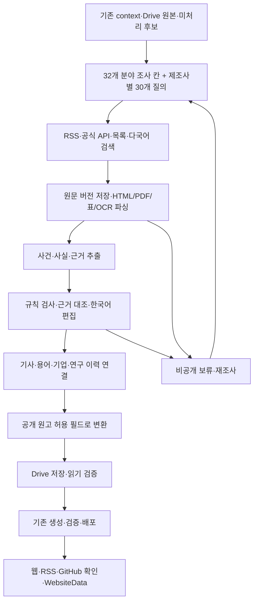
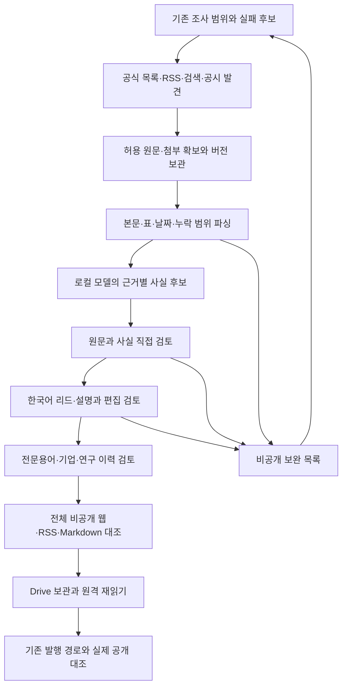

현재 운영 모델 전환(2026-10-04): 기본 정책의5역할과 CLI는 사용자 지정 Ollama `qwen3.8:27b-mlx`를 사용한다. 기존 문서의 GGUF 모델 표·실행 결과는 당시 판본의 기록이며 새 모델의 성능 근거가 아니다. safetensors/NVFP4/27.8B 설치 및 실제 호환성 검증·이전 정책 복구는 [런북361절](LOCAL_AI_NEWS_RUNBOOK.md#361-ollama-qwen38-27b-mlx-기본-모델-전환)을 따른다.

# 로컬 AI 뉴스 조사·브리핑·지식 축적 시스템 설계

작성·갱신일: 2026-09-28 · 문서 상태: 목표 설계와 부분 구현 기록 · 대상: 기존 Tech Knowledge Garden 확장

이 문서는 사용자가 합의한 조사·편집·공유 요구사항과 로컬 AI 전환 계획을 구현 가능한 계약으로 정리한다. **수집기·HTML/PDF/Markdown/OCR 파서·로컬 검색 서비스·Ollama 호출·사실 검토·한국어 작성·정정/승인·전체 비공개 사이트 생성 경로는 부분 구현됐다.** 실제 코드 계약·실행 명령·시험 결과는 [현재 구현과 실행 가이드](LOCAL_AI_NEWS_RUNBOOK.md)에 기록한다. 이 문서의 목표 계약과 아직 구현되지 않은 운영 연결을 현재 기능으로 혼동하지 않는다. 서비스 전환·새 경로 발행·무인 운영은 완료되지 않았다.

개발 착수 시에는 [최신 비공개 통합 상태](LOCAL_AI_NEWS_CURRENT_BUILD.md) → [데이터 인계 계약](#196-실제-모듈-사이의-입력과-산출물) → [남은 작업](LOCAL_AI_NEWS_IMPLEMENTATION_PLAN.md#1927-두-openai-사건의-비공개-승인-이후-남은-작업) → [실행 증거](LOCAL_AI_NEWS_RUNBOOK.md#50-admin-pluginjalapeño-기사와-의존-지식의-비공개-재검토) 순서로 읽는다. 제품 방향을 판단할 때는 요구사항·독자 결과·전체 완료 기준을 먼저 읽는다. 과거 실행 기록의 수량은 해당 실행의 증거이며 최신 상태표의 값으로 자동 승계하지 않는다.

## 문서 구성과 우선순위

| 문서                                                     | 책임                                                                             |
| -------------------------------------------------------- | -------------------------------------------------------------------------------- |
| 이 문서                                                  | 제품 요구사항, 시스템 경계, 사건·근거·기사 계약, 모델 운영, 지식 축적, 발행 원칙 |
| [원문 수집·파싱 명세](SOURCE_ACQUISITION_SPEC.md)        | 실제 출처 경로, 발견·다운로드·파싱, 원문 버전과 문단·표, 오류와 회귀시험         |
| [단계별 구현 계획](LOCAL_AI_NEWS_IMPLEMENTATION_PLAN.md) | 작업 순서·의존성·수정 대상·테스트·완료 증거·전환·복구                            |
| [현재 구현과 실행 가이드](LOCAL_AI_NEWS_RUNBOOK.md)      | 실제 모듈·런타임·CLI·검토 파일·측정 결과·미완료 경계                             |

필요한 내용부터 읽을 수 있도록 다음 진입점을 사용한다.

- 전체 서비스의 보존 조건: [요구사항 R01~R18](#12-반드시-보존할-사용자-요구사항).
- 원문 하나의 입력·처리·검증·결과: [처리 명세](#14-원문-하나가-기사와-지식이-되는-처리-명세).
- 빈약한 요약을 막는 원문·집필 기준: [기사와 설명의 정보 계약](#15-기사와-설명의-정보-계약).
- 어떤 출처를 어떻게 도입할지: [출처별 도입 작업 명세](SOURCE_ACQUISITION_SPEC.md#14-출처별-도입-작업-명세).
- 운영용 로컬 모델: [설치 메타데이터와 역할](#61-설치-메타데이터와-추천-역할). 구현용 Codex 모델: [개발 모델 권고](LOCAL_AI_NEWS_IMPLEMENTATION_PLAN.md#12-구현에-사용할-모델과-추론-수준).
- 다음 작업의 순서와 인계 산출물: [실행 단위와 완료 판정](LOCAL_AI_NEWS_IMPLEMENTATION_PLAN.md#19-실행-단위와-완료-판정).
- 실제 실행 명령과 최신 증거: [문서 사용](LOCAL_AI_NEWS_RUNBOOK.md#24-상세-문서의-사용과-현재-상태-재확인), [판본·모델 입력·기사·용어 통합](LOCAL_AI_NEWS_RUNBOOK.md#29-원문-판본과-작성-입력-범위기사용어누적-주제-통합).
- 구현 범위와 차기 변경을 한 번에 확인: [개발 인계 명세](#16-구현-범위와-개발-인계-명세), [새 전문용어 등록 계약](LOCAL_AI_NEWS_IMPLEMENTATION_PLAN.md#1910-신규-전문용어-등록기사-연결이력의-구현-명세), [일일 실행 통합](LOCAL_AI_NEWS_IMPLEMENTATION_PLAN.md#1911-일일-실행기와-발행-인계의-구현-명세).
- 논문 수식과 일반 기사의 판본 정보: [원문 근거의 보존과 비교](#17-원문-근거의-보존과-비교), [MathML 실제 구현](SOURCE_ACQUISITION_SPEC.md#20-html-수식의-보존과-논문-근거-범위), [현재 논문 참조 계약과 실제 자료 통합](LOCAL_AI_NEWS_IMPLEMENTATION_PLAN.md#1912-수식-근거와-일반-기사의-논문-식별자-연결).
- 개발자가 적용할 모델 설정과 입력 경계: [호출 설정의 현재 동작](#164-호출-설정의-현재-동작과-설정-외부화), [원문에서 독자 문장까지의 검토 단위](#165-원문에서-독자-문장까지의-검토-단위).
- 공식 발표문과 날짜 없는 연구 PDF를 연결하는 방법: [출처 조합 명세](SOURCE_ACQUISITION_SPEC.md#21-날짜-없는-연구-pdf와-공식-발표문의-결합).
- 개발자가 구현할 책임 분리와 예외 처리: [실행 책임과 산출물 계약](#18-실행-책임과-산출물-계약), [출처 도입의 구체적인 작업 순서](SOURCE_ACQUISITION_SPEC.md#22-출처-도입을-구현-작업으로-전환하는-절차).
- 최신 식별자·학생 기사·용어 승인·통합·남은 작업: [2026-09-28 실행 기록39절](LOCAL_AI_NEWS_RUNBOOK.md#39-url-논문-식별자학생-기사rct-용어의-실제-통합).
- 공개 문장에 내부 작성 지시가 남는 실제 사례와 개발 회귀: [계획19.17](LOCAL_AI_NEWS_IMPLEMENTATION_PLAN.md#1917-공개-문장에-내부-작성-지시가-남는-문제의-회귀-계획).
- DOI/arXiv 없는 논문과 출판 상태 null의 전체 발행 계약: [계획19.18](LOCAL_AI_NEWS_IMPLEMENTATION_PLAN.md#1918-url-논문-식별자와-출판-상태의-전체-발행-계약).
- 구현된 모듈·미완료 기능·모델 권고를 한 번에 확인: [현재 구현과 개발 범위](#19-현재-구현과-개발-범위의-종합-명세).
- 실제 남은 원문의 수집·날짜·논문 판본 문제와 다음 개발: [출처별 처리 계약](SOURCE_ACQUISITION_SPEC.md#23-남은-실제-원문의-처리-계약), [개발 작업19.19](LOCAL_AI_NEWS_IMPLEMENTATION_PLAN.md#1919-잔여-원문-검토부터-운영-전환까지의-상세-개발-계약).
- Admin plugin·Jalapeño 공식 HTML의 접근 경로 차이, 원본 SHA와 구현한 수입/파싱·남은 기사 계약: [수집 명세25.12](SOURCE_ACQUISITION_SPEC.md#2512-공식-html에-접근-경로별-결과가-다른-경우), [계획19.24](LOCAL_AI_NEWS_IMPLEMENTATION_PLAN.md#1924-admin-pluginjalapeño-두-사건의-원문-편입과-기사-재구축), [실행 기록48](LOCAL_AI_NEWS_RUNBOOK.md#48-두-공식-html의-오프라인-편입과-실제-파싱).

현재 운영 규칙은 [AGENTS.md](../AGENTS.md), [브리핑 품질](BRIEFING_QUALITY.md), [편집·재조사](EDITORIAL_RESEARCH.md), [출처 다양성](SOURCE_DIVERSITY.md), [Drive 동기화](DRIVE_GITHUB_SYNC.md)를 따른다. 이 설계는 그 요구사항을 로컬 실행으로 확장한다. 아직 구현하지 않은 설계가 기존 검사기나 예약을 이미 대체한다고 해석하지 않는다.

오래된 문서의 충돌은 다음과 같이 해석한다.

- 최종 보관 위치는 Google Drive `Projects / Tech Knowledge`이며 로컬 `vault/`는 작업·생성 사본이다.
- 오전 8시 KST 실행 하나를 사용한다. 과거 5분 주기 설명은 현행 운영 계약이 아니다.
- 육하원칙 2~4문장은 리드다. 필요한 구체적 설명을 생략하는 분량 제한이 아니다.
- 원문을 재확인한 과거 자료는 수정할 수 있다. 검토 없이 분류·설명을 추정해서 소급하지 않는다.
- 의미·한계·다음 질문을 채우기 위해 공개 분석을 만들지 않는다. 독자에게 필요 없는 운영 판단은 비공개 기록에 둔다.
- [기존 구현 상태](IMPLEMENTATION_STATUS.md)의 2026-09-13 수량·검증 결과는 당시 기록이며 현재 운영을 다시 검증한 증거가 아니다.

## 1. 목표와 완료 범위

### 1.1 목표

다양한 국내외 원문을 발견하고 실제 내용을 읽어, 짧고 명확한 기사와 충분한 설명을 작성한다. 기사에서 전문용어와 기업·연구 이력을 따라갈 수 있게 축적하고 동일한 승인 원고를 웹·RSS·GitHub로 배포한다. 일상 추론은 보유한 Mac과 로컬 모델로 수행하며 추가 유료 LLM API를 필수로 두지 않는다.

완료 범위는 다음 전체 흐름이다.

1. 고정 출처와 목록 밖 사건의 발견.
2. HTML·동적 페이지·API·PDF·표·OCR에서 검증 가능한 원문 확보.
3. 사실과 그 사실을 지지하는 문단·표의 연결.
4. 정확한 한국어 기사·설명과 근거 있는 경우의 심층 분석.
5. 전문용어, 기업 전략, 연구·사업화 이력의 누적.
6. 기존 자료 소급 검토와 고정 ID·주소 보존.
7. Drive 보관·읽기 검증, 실제 웹·RSS·GitHub 발행 검증.
8. 중단·실패·원문 정정·모델 변경 이후의 재개와 재검증.

“완벽한 정리”를 무오류 보장 문구로 사용하지 않는다. 고정 평가 자료의 핵심 사실 오류 0건, 출처 추적 가능, 실패를 성공으로 표시하지 않는 상태 관리, 실제 독서 품질 평가를 완료 조건으로 사용한다. 평가 통과 후에도 새 출처·새 모델·실제 운영의 오류를 계속 점검한다.

### 1.2 반드시 보존할 사용자 요구사항

| ID  | 요구사항                    | 구현상 의미                                                           |
| --- | --------------------------- | --------------------------------------------------------------------- |
| R01 | 기존 8개 분야 유지          | 로봇 뉴스 확장이 다른 분야를 대체하지 않음                            |
| R02 | 국내외 조사 기회 균등       | 32개 조사 칸의 실제 확인 상태를 기록하고 기사 수 비율은 강제하지 않음 |
| R03 | 기술과 기업 동향 동시 조사  | 기술·제품과 재무·투자·인력·생산·고객 경로를 별도 확인                 |
| R04 | 산업용·협동로봇 제조사 포함 | HD현대로보틱스·FANUC·KUKA·ABB·두산로보틱스 등을 로봇업계 조사에 포함  |
| R05 | 논문·교수 창업 추적         | 전문 접근과 연구자 역할·소속·창업 관계의 명시적 근거 확인             |
| R06 | 육하원칙 기사와 구체적 설명 | 제목·리드만 반복하지 않고 작동·조건·규모·집행 대상을 설명             |
| R07 | 근거 없는 분석·변명 제외    | 해당 문단·섹션·탭 자체 생략, 이유는 비공개                            |
| R08 | 탭과 태그 중심 화면         | 분야 탭, #태그 블록, 공유 URL, 키보드·모바일 사용                     |
| R09 | 뉴스·브리핑에 지도 없음     | 전용 지도와 전문용어 페이지에만 필요한 관계 표현                      |
| R10 | 학습 가치 있는 전문용어     | 회사·제품·일반어·공동 등장으로 노드나 관계 자동 생성 금지             |
| R11 | 지식과 사건의 시간 이력     | 현재 판단과 과거 판단, 사건 시점과 검토 시점 분리                     |
| R12 | 기존 주소·RSS 식별자 보존   | 제목·출처 변경으로 event_id 재생성 금지                               |
| R13 | 기존 자료 전체 재검토       | 최신 자료부터 진행하되 전체 inventory의 미결 항목을 추적              |
| R14 | 공개 제외 자료의 전파       | 본문·검색·RSS·digest·추천·용어·지도·생성 결과에서 제거                |
| R15 | Drive 최종 보관             | 로컬 작성 후 원격 보관·읽기 검증을 거쳐 발행                          |
| R16 | 운영 기록 비공개            | 원문·후보·제외 이유·모델 로그를 공개 Git에 넣지 않음                  |
| R17 | 무료 우선·08시 실행 하나    | 추가 유료 API·중복 예약 없이 운영 경로를 단계적으로 전환              |
| R18 | 출처부터 검증               | 검색 결과·다운로드·JSON 성공을 원문 검토 완료와 구분                  |

8개 분야는 AI, 소프트웨어·클라우드, 사이버보안, 반도체·컴퓨팅, 로봇·제조, 에너지·기후기술, 바이오·의료기술, 우주·기초과학이다. 정확한 분류와 태그는 [분야](SECTOR_BRIEFING.md)와 [테마](NEWS_THEMES.md), 기존 코드의 열거값을 재사용한다.

### 1.3 문서와 구현·운영의 구분

현재 코드가 수행하는 범위는 비공개 수집·검토·미리보기·승인 기사 JSON과 원문 고정 평가 자료 생성까지다. 원문·프롬프트·출력은 비공개 작업 경로에 남긴다. 실제 FANUC·Universal Robots 원문으로 수집·파싱·로컬 추론·직접 검토·한국어 작성·고정 기사 ID 변환을 시험했다. 공개 원본 네 폴더는 이 시험으로 수정하지 않았다.

이 문서의 JSON은 **목표 계약 예시**다. 현재 구현에서 더 작은 스키마로 시작한 필드는 실행 가이드의 실제 계약을 따른다. 심층 세 형식은 실제 로컬 초안·직접 편집·정정본의 비공개 승인·전체 사본 생성까지 수행했다. 이후 Google 두 과거 기사도 별도로 작성·정정·비공개 승인했다. 모델 원출력과 직접 고친 승인본은 다른 평가 대상이다. 원문부터 작성한 검토 사실을 입력한 집필 시험은 자동 사실 추출의 합격 증거가 아니다. 독립 Drive 인증, 전체 자료 소급 검토, 새 경로의 공개 배포와 7회 비교 운영은 남은 작업이다. 예약 변경·commit·push·배포를 문서 작성이나 로컬 시험만으로 완료 처리하지 않는다.

## 2. 2026-09-27 확인한 기준선과 구현 진행

공개 작성 원본 181개를 복구 사본으로 보존하고 Drive에서 같은 181개 파일을 새로 읽어 대조했다. 차이는 0개였다. 회차는 v2 26개·구형 92개이며, v2 고유 사건 87개 중 기존 검증 완료는 73개다. **v2 미검토 사건 14개와 구형 회차 92개는 남아 있다.** 네 원본 폴더에서 발견한 618개 URL은 전체 과거 Sources 보관 목록의 분모가 아니다. 서로 다른 목록의 수치를 합쳐 재조사 완료율로 사용하지 않는다.

신규 모듈의 실제 검증 범위와 미완료 사항은 실행 가이드와 구현 계획의 진행표에 둔다. 기존 운영 경로의 성공 기록을 새 로컬 경로의 공개 발행 성공으로 계산하지 않는다.

현재 비공개 검토에는 위 14개 중 Google 두 기사, Microsoft, Model Connect, NemoClaw, NVIDIA 추론 구성, DeepMind 평가 연구, PPE와 학생 RCT의 정정·승인이 추가로 있다. **권위 원본의 미검토14개와 비공개 추가 판정9개 이후 잔여5개를 구분**한다. 최신 완료 사본에는 승인 기사12개·과거 회차8개·노트15개를 반영했다. 신규 이중 블라인드 평가 용어는 [실행 가이드32](LOCAL_AI_NEWS_RUNBOOK.md#32-신규-전문용어-등록-검증), PPE의 원문·실제 작성은 [33절](LOCAL_AI_NEWS_RUNBOOK.md#33-논문-수식-보존과-ppe-원문-작성-검증), 최종 승인·science 정정·전체 사본은 [35절](LOCAL_AI_NEWS_RUNBOOK.md#35-ppe-기사과학-발견-용어출처-표기의-실제-통합)에 구분해 기록했다. 전체 소급 목록의 분모는 [22절](LOCAL_AI_NEWS_RUNBOOK.md#22-전체-소급-목록과-목록각주날짜-파싱)을 따른다. 과거 회차 사본 수는 서로 다른 날짜의 신규 운영 횟수가 아니다.

그 이후 학생 기사의 내부 작성 지시를 제거하고 해당 승인 차단 회귀를 구현했다. Anthropic 평가 원문의 누락 정의 목록을 보완해24번째 exact profile을 등록했다. RCT 배경·에이전트 평가 배경의14사실을 직접 검토하고, 실제 로컬 RCT 초안의 정정본과 기존 Agent Evaluation 재구축본을 새2노트로 비공개 승인했다. 후속 구현에서 학생 기사에 공통 HTTPS URL 논문 identity와 `status:null`을 연결해 최종 비공개 승인했다. 새2노트도 연결 이유와 근거를 보완한 승인 v2로 전체 사본에 통합했다. 이 단계의 전체 검증은 Node407/TypeScript exit0였다. 실제 채널·브라우저 검증과 비공개/공개 경계는 [39절](LOCAL_AI_NEWS_RUNBOOK.md#39-url-논문-식별자학생-기사rct-용어의-실제-통합)을 따른다.

이후 AWS 발표의25번째 exact profile과 명시 날짜 선택 실패/시간대 없는 metadata를 확정 날짜로 사용하지 않는 worker 처리를 구현했다. 동일 원문 bytes의 새 재파싱에서 AWS 발표일2026-08-26/day·DOM 근거, 두 captured/세 blocked 보존을 확인했다. Node 관련45개, worker40개, Python 전체55개가 통과했다. Python49는 이전 전체 suite 기록이며 worker 단독49개를 뜻하지 않는다. 공식 사고 보고서 PDF도38페이지/504블록으로 확보했으나 발표일·사실·기사 검토는 미완료다. 최신 구현과 실제 재파싱 증거는 [41절](LOCAL_AI_NEWS_RUNBOOK.md#41-날짜-파싱-구현과-문서-인계-기준의-갱신)을 따른다. 이 보완으로 기존 private 기사12개·노트15개·공개 서비스의 판정이 변경된 것은 아니다.

### 2.1 재사용하는 기존 구현과 보완 대상

| 영역             | 실제 확인한 구현                                                                                       | 추가 개발할 내용                                 |
| ---------------- | ------------------------------------------------------------------------------------------------------ | ------------------------------------------------ |
| 조사 범위        | [watchlist](../data/research-watchlist.json), [source channels](../data/research-source-channels.json) | 출처별 발견·다운로드·파싱 규칙과 최신 상태       |
| 날짜·미수록 사건 | [research-window.mjs](../scripts/research-window.mjs), 기존 JSON backlog                               | 실제 수집 실행기와 재개·전환 연결                |
| 출처 다양성      | [source-diversity.mjs](../scripts/source-diversity.mjs)                                                | 전재·원발표 계보와 실제 조사 로그 기반 진단      |
| 원문 보관        | [prepare-drive.py](../scripts/prepare-drive.py)                                                        | 새로운 URL 발견, 본문·표 파싱, 정정 재수집       |
| 편집 형식        | [editorial.mjs](../scripts/editorial.mjs)                                                              | 주장과 근거의 의미 대조, 고유명사·수치 조건 검증 |
| 기사·지식 생성   | [garden.mjs](../scripts/garden.mjs), [knowledge.mjs](../scripts/knowledge.mjs)                         | 검증한 로컬 결과를 기존 형식에 맞추는 어댑터     |
| 원격·발행        | [pull-drive.py](../scripts/pull-drive.py), [publish.mjs](../scripts/publish.mjs)                       | 독립 로컬 실행기의 인증·업로드·원격 읽기 연결    |
| 로컬 AI          | Ollama 메타데이터·스키마·분할 추출·한국어 집필·실제 요청/응답 보관                                     | 역할별 설정 외부화·독립 평가·메모리/일일 처리량  |

기존 `prepare-drive.py`의 URL 수집 경로는 응답 바이트·최종 URL·MIME·ETag·Last-Modified·SHA-256을 보관한다. 성공한 캐시를 재확인하지 않고 재사용하며 ETag 등을 조건부 요청에 사용하지 않는 기존 동작은 유지된다. 이 경로의 5 MiB 제한과 신규 `SourceFetcher`의 HTML 10 MiB·PDF 50 MiB 제한을 구분한다. 신규 경로는 조건부 요청·버전 저장·본문/PDF/OCR 파싱을 별도로 구현했다. `prepare-drive.py`에는 새 원문·실행 결과의 비공개 보관 묶음 연결을 추가했으나 실제 Drive 업로드·재읽기 검증은 남아 있다.

현재 편집 검증기는 필드·본문 일치·출처 URL 포함을 확인한다. URL 두 개가 있다는 사실만으로 대학과 회사가 각각 창업 관계를 증명한다고 볼 수 없고, 인용문이 존재한다고 해서 주장 전체를 지지하는 것도 아니다.

### 2.2 장비와 런타임

| 항목               | 확인값                      | 해석                                                  |
| ------------------ | --------------------------- | ----------------------------------------------------- |
| Mac                | Apple M4 Pro / 64 GiB       | 기존 장비 우선 사용                                   |
| Node               | v26.4.0                     | 현재 실행환경. package.json의 최소 요구는 >=22        |
| 기존 Python        | 3.9.6                       | 기존 보관 스크립트 환경 유지                          |
| 신규 worker Python | 3.12.14                     | 프로젝트의 비공개 venv에서 파싱 시험                  |
| Ollama 서버 API    | 0.34.4                      | `/api/version` 응답으로 확인                          |
| Ollama CLI         | 0.32.1                      | CLI 경고의 client version; 서버와 구분                |
| 주력 후보          | qwen3.8:27b                 | 추론 품질·하루 처리량 승인 아님                       |
| 비교 후보          | qwen3.6:27b, gemma4:31b-mlx | 동일 평가 자료로 비교 필요                            |
| 임베딩             | qwen3-embedding:8b          | 관련 기록 검색 후보. 관계·동일성 확정에 사용하지 않음 |

새 worker는 `.local/research/local-ai/runtime/venv`를 사용한다. Trafilatura 2.2.0·PyMuPDF 1.27.2.3·Playwright 1.63.0·RapidOCR 3.9.2·ONNX Runtime 1.30.0을 고정했고 HTML·표·선택적 OCR 시험을 실행했다. Docling은 도입하지 않았다. 실제 문서의 복잡한 표·다국어 OCR 정확도, 메모리 상한과 처리량은 평가 자료로 추가 확인한다. 시스템 Python은 교체하지 않는다.

### 2.3 기존 로컬 시험의 의미

비공개 기록 `.local/experiments/local-llm-2026-09-19/feasibility.md`에서 일본어 FANUC 발표 한 건을 확인했다. Qwen3.8 시험에는 한국어 지시에도 영어 출력과 계약 표현 과장이 있었고, Qwen3.6 시험에는 회사명 오표기·반복·부적절한 근거가 있었다. 두 초안 모두 자동 발행 적합 판정을 받지 않았다.

기록된 약 70.73초와 47.31초는 단일 탐색적 시험 결과다. 모델과 프롬프트가 함께 달라 모델 간 성능 비교가 아니며, 하루 40건의 소요 시간이나 무인 운영 안정성 근거로 사용하지 않는다.

2026-09-27의 신규 경로 시험에서는 Qwen3.8/추론 비활성으로 5개 사실 추출에 116.678초, 한국어 초안에 101.701초를 기록했다. 추출 수치 단위·일부 사실 표현과 초안의 반복·문장별 근거 참조를 직접 검토해 수정했다. 앞선 `medium` 시험은 300초 제한에 걸렸다. 이 결과는 **검토를 거친 단일 비공개 기사 흐름**의 증거이며 모델 원출력의 자동 발행 합격이나 통제된 모델 비교가 아니다.

후속 UR 시험은 모델 후보 이전에 실제 원문 기준6사실을 작성하고 같은 취득 바이트/parse를 재사용했다. 추출156.087초에5사실 중 단위 구조 오류3개, 플랜지·외부 AI 처리 설명 누락이 있었다. 직접 보강한 사실로 생성한 한국어 초안158.729초에서도 footprint→부피, 초과→이상, 회사 성능/인증 귀속 누락을 확인했다. 원출력과 직접 수정한 비공개 승인 원고를 별도로 보존한다. 모델 합격·생산성·전체 운영 성과로 해석하지 않는다.

실제 기준 자료는 UR·FANUC 발표/실적·현대차 전략·RamanOmics 논문·Envisagenics 사업화에서 ETRI/AWS/CXMT/ESA/Siemens로 확장했다. 현재 활성11사례·71사실·15원URL이며 원문 SHA·파싱 사본·핵심 사실·필요 설명·금지 변형·검토 provenance를 고정했다. 모두 Codex 직접 검토 후보이며 독립 사람 gold·heldout 완료는0이다. 영어/일본어/한국어/중국어/독일어와7분야의 일부를 포함한다. 사례 수11만으로 초기10건의 지정 위험·독립 검토나60건 평가를 완료 처리하지 않는다.

같은 검토 사실·작성 지침·스키마·설정의 Qwen/Gemma 비교도 실제 실행했다. Qwen160.312초·Gemma83.080초였으며 둘 다 원출력 편집 품질은 미합격이다. Gemma의 내부 사실 ID 본문 출력은 실제 원출력을 다시 검사하고 승인 차단 회귀로 연결했다. 단일 작성 결과로 역할별 운영 모델·60건 평가·처리량을 확정하지 않는다.

검토 함수는 원문/사실 버전과 달력·시점 검사를 강제하고 최종 승인에서 다시 확인한다. 검토 해시·boolean은 검토 행위 자체의 독립 증명은 아니다. 새 모델 호출부터 정확한 request/schema/options와 원 response content를 private에 보관해 프롬프트 변경 뒤에도 입력과 출력을 재구성할 수 있게 했다. 내부 reasoning 텍스트는 보관하지 않는다. 세부 명령·사본·실제 실패·회귀 증거는 [실행 가이드8.1](LOCAL_AI_NEWS_RUNBOOK.md#81-원문-버전검토-시점승인-재검사)과 [실행 가이드15](LOCAL_AI_NEWS_RUNBOOK.md#15-실제-원문-평가-자료-고정과-재현-실행)를 따른다.

### 2.4 Markdown과 추가 사건에서 확인한 보완

공식 기술 문서가 HTML에서 Markdown으로 이동하는 경우를 실제로 확인했다. 응답 MIME을 worker에 전달하고 문단·표·코드·링크와 원문 줄 범위를 보존한다. HTML 차단 화면과 Markdown의 HTML 코드 예시를 구분한다. 제목·날짜가 없으면 URL에서 추측해 채우지 않는다. arXiv의 과거 v1 제출일과 최신 v2 날짜, Nature 기사 헤더의 발표일도 정확한 원문 profile로 분리했다.

성공8개·차단3개가 섞인 원문 run은 실패 메타데이터를 보존하면서 성공 자료만 오프라인 재파싱할 수 있다. 이 허용은 `reparse`에만 적용하고 사실 추출·평가·승인의 본문 무결성 검사는 유지한다. source body·parse·관측일을 덮어쓰지 않는다. 고정 GitHub 릴리스의 헤더 날짜 profile까지18개·worker 회귀23개·Node369개를 검증했다. 전체 출처·문서 유형의 수용 조건은 여전히 별도다.

Microsoft와 Model Connect의 실제 한국어 작성은 각각118.601초·104.403초였다. 형식 검사 통과 뒤에도 회사 귀속·소개/출시의 차이·Python 준비/C++ 실행 조건·성능 태그를 고쳐야 했다. NemoClaw의 같은 입력·모델 설정 비교도164.858초/180.309초에 분류·기업 태그 개선을 확인했지만 문장 정정이 필요했다. 단순 JSON 성공을 독자 원고 승인으로 바꾸지 않는다. 이 묶음 당시 비공개 전체 사본은8기사/6과거회차/9노트와 RSS40 보존을 검증했다. Drive·공개 배포·운영 전환은 별도 미완료다. 실제 날짜·태그·용어/기사 연결·기술 문자·모바일 URL의 수정과 실물 범위는 [가이드28](LOCAL_AI_NEWS_RUNBOOK.md#28-고정-릴리스분류용어기사의-실제-통합)을 따른다.

### 2.5 원문 판본과 집필 입력 범위에서 확인한 보완

NVIDIA 성능 자료는 같은 URL·최초 게시일을 유지하면서 9월 15일에 수치를 갱신했다. 이전 보관본의 비용 비교는 최대 35배, 갱신본은 최대 45배다. 두 판본의 원본 SHA·관측일·수정일·parse와 명시적 갱신 날짜를 따로 보존하고 59·30·29블록에서 13사실을 직접 확인했다. 이전 보관본의 관측은 9월 13일이므로 최초 게시 당시의 바이트라고 쓰지 않는다.

같은 13사실과 Qwen3.8:27b 설정의 프롬프트 전후 집필은 195.842초·181.762초였고, 두 원출력 모두 구조 검사 통과 뒤에 이전판의 검토 대기 상태를 갱신본에 적용하는 오류가 남았다. 프롬프트만의 수정으로 해결한 사례가 아니다. 현재 발표와 날짜가 명시된 갱신본의 10사실로 입력을 좁힌 세 번째 작성은 163.623초였으며 이전 상태 혼합은 나타나지 않았다. 이 작성은 입력이 달라 통제된 프롬프트 비교가 아니고, 최종 문장은 직접 정정했다. 자동 추출·무검토 발행·독립 사람 평가로 계산하지 않는다.

이 구현 단계 당시의 비공개 사본은 `20260927-nvidia-current-integrated-private-site-v2`다. 승인 기사 9개·과거 회차 7개·노트 11개, 생성 9단계와 웹/RSS/GitHub Markdown 대조, RSS 40개 GUID·발행일 보존을 확인했다. 추론 인프라의 9월 갱신·8월 Model Connect·추론 구성과 기존 Signals를 연결했고 근거를 잃은 현재 주제 교훈은 보관본에 남긴 뒤 공개 사본에서 생략했다. 전체 주제의 다른 사건을 재승인한 것은 아니다. 실제 명령·모델 오류·사본 실패와 복구·브라우저 관측·잔여 8사건은 [실행 가이드29](LOCAL_AI_NEWS_RUNBOOK.md#29-원문-판본과-작성-입력-범위기사용어누적-주제-통합), 운영 일반화 계약은 [계획19.8](LOCAL_AI_NEWS_IMPLEMENTATION_PLAN.md#198-원문-판본-변경을-기사용어에-전파하는-구현-명세)에 기록한다.

### 2.6 연구 발표와 과거 회차의 일부 기사 전환

DeepMind 발표의 일반 추출은 제목·날짜가 정상이어도 뒤쪽 본문을 빠뜨렸다. 정확한 여러 본문 구역 profile로 동일 바이트의7블록을13블록으로 복구하고, 두 연구 PDF의 표지 제목을 native 1쪽에서 읽게 했다. PDF 생성일은 발표일로 쓰지 않는다. profile21개·worker25회귀에 반영했다. [수집 명세18](SOURCE_ACQUISITION_SPEC.md#18-여러-본문-구역과-날짜-없는-연구-pdf)에 입력과 실패 조건을 설명한다.

공식 발표13블록과 DeepMind 기술 보고서8쪽100블록을 읽어9사실을 검토한 뒤 실제 Qwen3.8:27b 원고를 작성했다. 모델이 빠뜨린 평가 문제의 사전 미처리 조건은 직접 보완했다. 과거 회차의 승인 기사만 `article_records`로 전환하고, 미검토 기사에는 분류·날짜·설명을 추정하지 않는 경로를 구현했다. 전체 전환 전에는 회차 전체의 six-w 형식을 선언하지 않으며 9월14일 이후 새 회차는 계속 전체 계약을 요구한다.

최종 비공개 사본은10기사/8과거회차/11노트·9단계이며 RSS40식별자를 보존했다. Node375·worker25·typecheck와 실제 브라우저5관측을 확인했다. 권위 원본의14미검토 사건은 바꾸지 않았고, 추가 비공개 판정7개 뒤 잔여7개다. 전문용어 추가·구형 전체 소급·Drive/08시/독립평가/실제 신규7회·첫 공개 발행은 남아 있다. 구현 상세와 재개 위치는 [계획19.9](LOCAL_AI_NEWS_IMPLEMENTATION_PLAN.md#199-연구-발표pdf-제목과-과거-회차-부분-전환), 실제 명령·실패·관측은 [가이드30](LOCAL_AI_NEWS_RUNBOOK.md#30-이중-블라인드-평가-소급-기사와-연구-pdf-파서)에서 구분한다.

## 3. 시스템 경계와 실행 구조



로컬 모델이 할 일은 검색 질의 제안, 문서에서 구조화된 사실 추출, 비교할 과거 기록 선택, 한국어 작성, 근거 대조 보조다. HTTP 요청·파일 접근·재시도·Drive·Git 조작은 정해진 프로그램이 수행한다. 원문에 적힌 지시문은 도구 실행 권한이 아니다.

### 3.1 현재 모듈 배치와 목표 책임

아래 경로는 실제 존재한다. 각 책임의 전체 목표와 현재 지원 범위는 다르므로 [모듈별 구현표](LOCAL_AI_NEWS_RUNBOOK.md#3-현재-모듈과-코드-경계)를 함께 확인한다. 특히 기존 형식 변환은 기사 JSON·비공개 회차 투영이며 직접 발행이 아니다.

| 경로                                                | 책임                                   | 경계                                                             |
| --------------------------------------------------- | -------------------------------------- | ---------------------------------------------------------------- |
| `scripts/research.mjs`                              | 실행·재개·비공개 미리보기 CLI          | 직접 모델 결과를 publish하지 않음                                |
| `scripts/research/contracts.mjs`                    | 스키마·ID·상태 전이                    | 기존 발행 열거값과 호환 검사                                     |
| `scripts/research/discovery.mjs`                    | 채널·RSS·API·검색 후보 탐색            | 기존 rss-parser 재사용 우선                                      |
| `scripts/research/search.mjs`, `search-runtime.mjs` | 고정 조사 칸·질의·private 검색 서비스  | 모델 질의와 실제 엔진 오류·원문 검토를 구분                      |
| `scripts/research/fetch.mjs`, `browser.mjs`         | HTTP 취득·동적 페이지 캡처             | 공통 외부 연결 정책·호스트 예산·버전 보관                        |
| `scripts/research/robots.mjs`, `source-policy.mjs`  | robots 보관·검사·요청 전 정책 확인     | 직접 수집과 브라우저 요청의 실패 차단                            |
| `integrations/research-worker/worker.py`            | 보관된 HTML·PDF·표·OCR 파싱            | 네트워크 취득 분리, JSON-lines 요청/응답, stdout은 프로토콜 전용 |
| `scripts/research/ollama.mjs`                       | 기능 확인·모델 호출·출력 검증          | 허용 모델·추론 설정·문맥·예산 강제                               |
| `scripts/research/claims.mjs`                       | 문단별 묶음 추출·사실·수치·근거 검토   | 문자열 존재와 의미 적합성 분리·완료 묶음 재개                    |
| `scripts/research/editor.mjs`                       | 검증한 사실로 한국어 집필              | 새 사실 생성·운영 안내 유입 방지                                 |
| `scripts/research/knowledge-editor.mjs`             | 검토한 근거로 기존 용어 설명 초안 작성 | 비공개 초안만 생성; 별칭·관계·지도·최종 승인·발행은 별도 검토    |
| `scripts/research/knowledge-links.mjs`              | 기업·논문·인물·전문용어 연결           | 확정 ID와 확인 관계만 채택                                       |
| `scripts/research/publish-adapter.mjs`              | 기존 원고 형식으로 변환                | 공개 필드 허용 목록·고정 ID 보존                                 |
| `scripts/research/run-state.mjs`                    | 잠금·체크포인트·재개                   | 중복 실행·중복 발행 방지                                         |

새 프레임워크나 벡터 DB를 기본 요구사항으로 추가하지 않는다. 초기에는 기존 JSON backlog와 원자적 실행 journal을 사용한다. 이후 성능·동시성 측정에서 필요가 확인된 경우에만 비공개 SQLite 큐·캐시 인덱스를 검토한다. 지식의 작성 원본은 계속 기존 Markdown 네 폴더다.

### 3.2 공개/비공개 저장 경계

| 위치                                                                 | 저장 내용                                             | 공개 여부              |
| -------------------------------------------------------------------- | ----------------------------------------------------- | ---------------------- |
| `data/research-watchlist.json`, `data/research-source-channels.json` | 공개 출처와 비밀값 없는 수집 설정                     | Git에 둘 수 있음       |
| `.local/research/candidate-backlog.json`                             | 기존 후보 상태                                        | 비공개, 기존 계약 유지 |
| `.local/research/local-ai/`                                          | 실행 journal, 원문 버전, 추출물, 주장 검토, 평가 결과 | 비공개                 |
| Drive `Research`·`Sources`·`Archive`                                 | 취재·원문·검토·복구 자료                              | 비공개                 |
| `vault/Editions`, `Knowledge`, `Signals`, `TrendTopics`              | 승인된 공개 작성 원고의 로컬 사본                     | 공개 투영 대상         |
| `vault/News`, `Briefings`, `digest`, 웹 산출물                       | 기존 생성기가 만든 결과                               | 공개                   |

검토 이유를 공개 frontmatter에 넣고 UI만 숨기지 않는다. `.local` 경로, 파일명, 비공개 원문 인용, 모델 로그, 인증값을 공개 출력에 포함하지 않는지 아티팩트 단위로 검사한다. 설계 문서는 공개 가능한 운영 설계만 기록하고 실제 비공개 취재 기록은 포함하지 않는다.

### 3.3 Node–Python worker의 목표 계약

Node는 수집과 작업 순서를 관리하고 Python은 보관된 문서를 파싱한다. 요청 한 줄에 JSON 객체 하나, 응답 한 줄에 JSON 객체 하나를 사용한다. 진행 로그는 stderr로 분리하며 worker가 stdout에 라이브러리 로그를 섞으면 프로토콜 오류로 처리한다.

현재 `research-worker/v1`은 요청 ID·원문 ID/버전·로컬 입력 경로/해시·관측 시각·options를 받고 추출물을 직접 반환한다. 아래의 run ID·출력 manifest·메모리 예산 등 확장 필드는 목표다. OS 차원의 메모리 제한과 페이지 단위 재개를 현재 지원한다고 표현하지 않는다.

요청에는 `schema_version`, `request_id`, `run_id`, `operation`, `source_id`, `source_version_id`, 입력 상대 경로·해시, parser ID·버전·설정 해시, 출력 상대 경로, 문서·페이지·시간·메모리 예산을 포함한다. 경로는 `.local/research/local-ai/` 안에서만 허용하고 심볼릭 링크·경로 탈출을 검사한다. 파싱 전에 입력 해시를 다시 대조한다.

응답에는 같은 request_id, `completed`/`partial`/`failed`의 작업 상태, 출력 manifest 경로·해시, 처리한 페이지와 누락 구간, 측정 시간, 정제된 오류 코드를 포함한다. worker 작업 completed는 parse 상태의 parsed 또는 기사 verified를 의미하지 않는다. 결과 manifest의 문서·파싱 상태와 품질을 별도로 확인한다.

오류는 `invalid_request`, `input_missing`, `hash_mismatch`, `unsupported_format`, `parse_error`, `resource_limit`, `worker_crashed` 등 복구 조치가 다른 종류로 나눈다. 오류 문자열에 비밀값·원문 전체를 넣지 않는다. 미완성 결과는 임시 경로에 두고 manifest와 출력 해시가 검증된 뒤에만 원자적으로 등록한다. worker 종료·타임아웃·일부 출력 수신은 성공이 아니다.

같은 원문·파서·설정의 작업은 동일 parse_id를 조회해 재사용하되 출력 무결성과 이전 작업 완료를 먼저 확인한다. 네트워크 취득이 필요한 새 첨부 링크는 작업 결과의 후보로 반환하며 worker가 스스로 다운로드하지 않는다. 이 경계는 단위 테스트의 로컬 원문 재생과 실제 네트워크 수집 시험을 분리할 수 있게 한다.

## 4. 조사와 선정

### 4.1 조사 칸과 출처 확장

8개 분야 × 기술·제품/기업·운영 × 국내/해외의 32개 칸에 실제 조사 URL, 검색 질의, 언어, 확인 시각, 상태를 기록한다. 상태는 확인·부분 확인·접근 실패·미실시를 구분한다. 한 자료를 여러 칸에서 발견하더라도 사건을 여러 번 발행하지 않는다.

기존 기업 32개 추적 자리와 국내외 각 8개 기관은 출발점이다. 고객·공급사·시스템 통합사·협회·공시·현지 언론·새 연구실을 검색해 명단 밖 사건을 발견한다. 전문지의 독립 취재도 근거가 될 수 있으나 회사 발표 전재는 원발표와 같은 계보로 묶는다. 도메인 수를 독립 증거 수로 취급하지 않는다.

일본 제조사는 일본어, 독일 제조사는 독일어 등 원발표 언어를 함께 탐색한다. 영어 번역판이 나중에 올라왔다는 이유로 새로운 사건으로 세지 않는다. 국가·지역은 도메인이나 문서 언어만으로 추정하지 않는다.

### 4.2 시간 범위와 검색 반복 예산

`npm run context`의 `publication_after`, `discovery_start`, `discovery_end`를 사용한다. 최근 7일을 겹쳐 탐색하며 운영 공백이 더 길면 마지막 확인 경계까지 포함한다. backlog의 보류 후보는 7일이 지났다고 버리지 않는다. 수집 완료는 발행 완료가 아니다.

한 후보의 추가 검색은 미확인 주장에 연결한다. 예를 들어 출시 시점이 없으면 제품 페이지·공식 사양서, 고객 도입이면 당사자 발표, 논문 조건이면 전문·부록을 찾는다. 검색 반복은 작업별 최대 단계·문서·시간 예산 안에서 수행한다. 정확한 상한은 최초 측정으로 확정하고 설정 파일과 실행 기록에 남긴다. 한 출처의 지연이 다른 분야의 조사를 전부 막지 않도록 분야별 진행 상태를 보존한다.

### 4.3 사건 선정과 분량

발표 규모, 기술·비용·성능의 구체적 조건, 실제 제품 제공, 고객 도입, 자원 배분, 연구 방법·사업화 진전을 기준으로 검토한다. 제목 자극성·기사 수·모델 점수만으로 선정하지 않는다. 기존 중요 미수록 사건과 새 후보를 함께 읽고 선정한다.

주요 사건 3~5개, 분야당 최대 5건, 전체 최대 40건, 심층 최대 1건의 기존 계약을 유지한다. 기사 수가 부족하면 억지로 채우지 않는다. 심층 사건을 일반 기사와 별도 사건으로 복제하지 않는다. 기존 `recent_event_ids` 참조는 정해진 날짜 범위와 합산 상한을 따른다.

## 5. 식별자와 데이터 계약

### 5.1 식별자 책임

| ID                                               | 의미                                    | 변경 원칙                              |
| ------------------------------------------------ | --------------------------------------- | -------------------------------------- |
| `publisher_id`                                   | 발표·취재 기관                          | 브랜드·도메인·전재 계보와 별도 관리    |
| `channel_id`                                     | 뉴스룸·IR·논문 목록 등 탐색 경로        | 주소 이동 이력을 보존                  |
| `source_id`                                      | 기존 URL 원문 문서                      | 기존 ID를 보존하고 URL 별칭을 추가     |
| `source_version_id`                              | 특정 시점에 확보한 원문 버전            | 원본 해시·수집 기록에 연결             |
| `parse_id`                                       | 특정 버전과 파서·설정으로 생성한 추출물 | 파서/설정 변경 시 별도 결과            |
| `block_id`                                       | 추출물 내 문단·표·각주                  | parse_id와 함께 위치 식별              |
| `candidate_key`                                  | 조사 대기 후보                          | 발견과 선정 상태를 연결                |
| `event_id`                                       | 독자에게 보이는 고정 사건               | 제목·출처 변경에도 기존 16자리 ID 유지 |
| `claim_id`                                       | 검증할 사실·비교 주장                   | 근거와 검토 버전 연결                  |
| `work_id`, `person_id`, `concept_id`, `topic_id` | 논문·인물·전문용어·누적 주제            | 단순 문자열 유사도로 합치지 않음       |

새로운 원문 URL은 새 사건의 충분조건이 아니다. 한 문서에 여러 사건이 있을 수 있고, 하나의 사건은 여러 언어·문서로 확인될 수 있다. URL 중복 제거와 사건 중복 검토를 분리한다. URL 정규화 시 추적 인자만 제거하며 게시글 ID·검색 파라미터·언어·버전 인자를 임의로 지우지 않는다.

### 5.2 원문·추출물 계약

세부 계약은 [수집 명세](SOURCE_ACQUISITION_SPEC.md)에 둔다. 상위 단계는 원본 버전, 본문 확보 범위, 문단·표 위치, 날짜의 출처, 누락된 첨부파일과 추출 품질을 함께 받는다. 단순 text 문자열만 입력받아 전체 문서를 읽었다고 가정하지 않는다.

불완전한 자료라도 그 자료만으로 직접 확인되는 제한된 사실을 사용할 수는 있다. 다만 미확보 부분에 의존하는 주장과 전문 접근이 필요한 논문 심층은 보류한다. 이는 파싱 실패를 감추는 예외가 아니며 주장별 필요한 근거 범위로 결정한다.

### 5.3 내부 주장 레코드 — 설계 예시

다음은 가상의 시험 문장으로 작성한 스키마 예시이며 실제 뉴스·회사·운영 결과가 아니다. 실제 수집 문장에는 원문 위치와 번역 여부를 기록한다.

```json
{
  "statement": "시험 기업이 새 장비를 2027년 1분기에 공급할 계획이라고 발표했다.",
  "claim_kind": "attributed_fact",
  "subject": "시험 기업",
  "event_state": "planned",
  "published_at": "2026-09-27",
  "effective_period": "2027-Q1",
  "numbers": [],
  "evidence": [
    {
      "source_id": "fixture-source",
      "source_version_id": "fixture-version",
      "parse_id": "fixture-parse",
      "block_id": "fixture-parse:paragraph-004",
      "quote": "새 장비를 2027년 1분기에 공급할 계획입니다.",
      "support": "direct"
    }
  ]
}
```

위 객체는 Ollama `extractionSchema`에 전달되는 **모델 출력**이다. 저장된 `research-claim/v1`에는 여기에 `schema`, `claim_id`, `candidate_key`, `event_id`, 계산된 `review`가 추가된다. 날짜 정밀도는 임의의 `date_precision` 필드에 복제하지 않고 parse의 날짜 근거에 둔다. 예시를 실제 런타임 schema로 검사하는 회귀는 `tests/research-contracts.test.mjs`가 담당한다.

수치 레코드는 `value_raw`, 정규화 값, 단위·통화, 기간, 기준 집단, 비교 대상, 실험 조건, 원문 block을 함께 가진다. 반올림·환산·계산값은 원 수치와 계산식을 남긴다. 비교 조건이 다르면 하나의 증감률로 계산하지 않는다.
근거의 실제 HTML/PDF 위치는 parse_id·block_id가 가리키는 불변 추출물에서 읽는다. 주장 레코드에 다른 형식의 locator를 복제해 서로 불일치하는 위치 원본을 만들지 않는다.

주장 종류는 직접 사실, 회사 등에 귀속된 주장, 비교 분석을 구분한다. `planned`/`in_progress`/`completed` 같은 내부 상태는 해당 표현의 근거가 있을 때만 지정한다. 계획·출시·출하·양산·고객 도입은 같은 상태가 아니다.

검토 상태 `unreviewed`/`supported`/`contradicted`/`insufficient`는 목표 계약이다. 현재 사실 검토는 `unreviewed`/`verified`/`deferred`/`rejected`와 `structural_pass`·검사 결과를 별도로 저장한다. 기사 공개 상태 `unreviewed`/`verified`/`excluded`와 구분한다. “모델이 지지한다고 답함”과 실제 근거 검토 결정은 별도다. 이후 확장 시 호환 변환을 구현하고 기존 기록의 의미를 바꾸지 않는다.

### 5.4 사실에서 공개 문장으로

편집 입력은 선정된 주장·표준 회사명·확인된 용어 설명·문체 규칙이다. 작성 모델이 검색 결과 요약이나 오래된 모델 지식을 새 근거로 사용하지 않도록 허용된 claim_id와 source 목록을 제공한다.

편집 결과에는 제목, 리드, 설명 문단, 각 문장의 claim_id 참조, 분야·테마·기업·전문용어 ID가 필요하다. 공개 변환 전에는 다음을 확인한다.

1. 제목의 핵심 주장도 본문과 같은 근거 검사를 받았는가.
2. 리드·설명 문장의 실질적 주장을 지원하는 claim이 있는가.
3. 주장에 붙어 있던 귀속·예정 시점·단위·실험 조건을 편집 과정에서 잃지 않았는가.
4. 비교·인과 표현이 사실들의 단순 공동 등장으로 생성되지 않았는가.
5. 수정된 문장은 다시 검사를 거쳤는가.

사실 참조는 문장의 `claim_ids` 배열에만 보관하고 독자 제목·리드·설명에 출력하지 않는다. 현재 구현은 알려진 claim ID가 그 본문에 나타나면 승인을 차단한다. 실제 Gemma 초안에서 발생한 누출을 재현·차단했으며 [실행 가이드의 동일 입력 비교](LOCAL_AI_NEWS_RUNBOOK.md#155-같은-작성-입력의-qwengemma-비교와-본문-id-차단)에 기록했다. 의미·회사 귀속·비교 조건은 이 문자열 검사와 별도로 원문을 대조한다.

### 5.5 기존 발행 계약으로의 변환

| 내부 정보            | 기존 공개 원고                                               | 비고                                             |
| -------------------- | ------------------------------------------------------------ | ------------------------------------------------ |
| 제목·종류·지역·리드  | `article_records`                                            | 제목과 본문이 정확히 일치해야 함                 |
| 확인된 육하원칙 사실 | `article_records[].facts`                                    | 공개 가능한 사실만 넣음. 비공개 작업 이유는 제외 |
| 구체적 설명          | `explanations[].heading/paragraphs/source_urls`              | 본문과 같은 문장·소제목 사용                     |
| 논문                 | `papers`의 work_id·identifiers·access·status                 | 초록/전문·사전공개/동료심사 구분                 |
| 확인된 인물 관계     | `relations`                                                  | 대학·회사 근거의 실제 기관 종류와 의미를 대조    |
| 사건 검토            | `article_reviews`의 title·event_id·review_status·concept_ids | 검토 완료일과 원 발표일 분리                     |
| 주요 사건            | `headlines`, 필요한 `briefing_highlights`                    | 중복 기사 생성 없음                              |
| 누적 관측            | 기존 `Signals`, `TrendTopics`                                | 실제 사건·검토 시점과 근거 보존                  |
| 보류·제외·생략 이유  | 공개 원고로 변환하지 않음                                    | `.local` 및 Drive Research에 보관                |

현재 검사기가 facts의 여섯 문자열을 요구하는 점을 숨기지 않는다. 원문에 없는 이유·장소를 모델이 채우지 않으며, 기존 계약에서 허용하는 사실상 미공개 표현은 공개 리드의 필수 문장으로 만들지 않는다. 공개 데이터에 운영 사유가 필요한 검사 조건은 private 기록 참조 방식으로 함께 변경·테스트해야 한다. 검사기만 통과시키는 가짜 질문·분석을 만들지 않는다.

### 5.5.1 최초 게시일·업데이트 사건일·회차 발행일

원문 최초 게시일은 `source-parse/v1.dates.published_at`, 수정일은 `modified_at`이다. claim의 `published_at`은 최초 게시일과 계속 일치해야 한다. 이후 배포 사건을 다루는 claim은 실제 적용일을 `effective_period`에 저장한다. 원문 전체를 수정일의 새로운 발표로 바꾸지 않는다.

기존 기사 계약의 `article_reviews[].published_at`은 독자가 읽는 사건 날짜를 유지한다. 원문 본문·각주에 날짜가 명시된 업데이트를 검토한 경우에만 `date_kind: dated-update`와 `source_published_at`을 함께 기록한다. 웹 카드·상세·브리핑·RSS·GitHub는 이 경우 `업데이트`를 표시하며 기본 기사의 `발표` 표기는 유지한다. 기존 URL과 RSS 회차 GUID/pubDate는 날짜 정정으로 바뀌지 않는다.

원문 수정 metadata만으로 업데이트를 승인하지 않는다. 현재 [event-date.mjs](../scripts/research/event-date.mjs)는 같은 원문 버전/parse, 수정 DOM 근거, 날짜가 포함된 본문/각주, 최종 원고가 사용하는 검토 사실, 적용일을 대조한다. 날짜가 없는 기존 기사에는 원본 바이트·이전 null·전체 등장 회차·검토자·정정 사유를 담은 비공개 `retrospective-article-review/v1` 결정이 필요하다. 정확한 계약과 제한은 [실행 가이드23](LOCAL_AI_NEWS_RUNBOOK.md#23-원문-날짜-정정과-업데이트-사건의-소급-처리)을 따른다.

### 5.6 심층 분석의 현재 근거 계약

세 심층 형식은 기존 기사 계약에 연결됐다. 실제 모듈은 [deep-dive.mjs](../scripts/research/deep-dive.mjs), 명령은 `deep-review` → `draft --deep` → `approve`다. 입력에 포함된 사실은 기존 근거 검사를 통과한 사실이어야 하며, 원문 바이트·parse와 검토 해시를 다시 검사한다.

| 종류        | 최소 입력                                                        | 작성·승인에서 보존할 경계                                       |
| ----------- | ---------------------------------------------------------------- | --------------------------------------------------------------- |
| 기업 전략   | 목표·자원 배분·발표일이 다른 원문2개 이상의 비교                 | 투자/인력/계약의 실제 단계; 계획을 집행·성과로 교체 금지        |
| 논문 해설   | 문제·방법·실험 조건·비교·결과, 실제 전문·논문 식별자             | 전문 읽기·원문 조건·사전공개/동료심사; 제품 성능으로 교체 금지  |
| 연구 사업화 | 연구·확인된 창업/기술이전 관계·제품화, 대학/연구기관과 회사 근거 | 자문/공동저자/소속과 창업 분리; 잠재 계약 대가와 받은 자금 분리 |

context는 원문 분류·범위·논문/인물 관계·검토 시점을 묶고4개 해시로 변경을 감지한다. 초안 ID에도 context를 포함하므로 검토 후 근거를 바꿔 이전 초안의 승인을 재사용하지 않는다. 기사 원 발표일은 해당 사건을 지지한 사실의 원문 날짜와 일치해야 한다. 회사 소개처럼 날짜가 없는 배경 문서의 관측일을 기사 발표일로 사용하지 않는다.

설명 항목의 내부 `role`은 기존 단일 문자열 또는 여러 역할의 배열을 받는다. 새 작성 지침은 관련 역할을 한 설명에 합치도록 요청한다. 역할마다 소제목을 강제하지 않지만, 각 역할에 배정한 **모든 사실 ID**가 해당 역할을 맡은 설명 문단에 포함됐는지 검사한다. 알 수 없는 역할·배열의 중복·허용 역할 밖 사실·필수 사실 누락은 승인을 차단한다. 이를 통해 비교와 결과를 한 번에 설명하면서 필요한 실험 조건을 보존한다. 사실 참조의 존재만으로 문장의 의미 적합성을 인정하지 않는다.

`analysis`는 비공개 초안에서 객체 또는 `null`이다. 새로운 비교 정보를 전달하지 못하면 `null`로 작성하며 공개 변환에서 `analysis_summary`와 “분석” 문단을 생성하지 않는다. 해당 기사의 근거 있는 상세 설명은 분야 기사에 남는다. 웹의 심층 분석 탭·RSS와 Markdown의 심층 분석 섹션은 실제 분석 요약이 있는 기사만 사용하며, 없으면 섹션 자체를 생략한다. 기존 미검토 원고의 필수 검증 조건을 이 변경으로 낮추지 않는다.

공개 결과에는 제목·리드·구체적 설명·있는 경우의 분석·원문·기존 논문/관계 메타데이터만 남긴다. 역할 이름·claim ID·검토 체크·모델 로그는 비공개다. `source_read` 등의 체크는 실제 검토자의 진술이며 자동으로 읽기·의미 적합성을 증명하는 점수가 아니다. 이전 계약의 실제 세 형식 초안은171.257·186.492·224.731초에 생성됐지만 이름 표기·조건부 지급·반복 설명이 남아 최종 승인하지 않았다. 새 계약의 실제 작성과 원문 대조는 별도로 확인한다. 상세 입력은 [실행 가이드16](LOCAL_AI_NEWS_RUNBOOK.md#16-심층-세-형식의-구현-계약과-실행), 실제 실패와 편집 판정은 [18절](LOCAL_AI_NEWS_RUNBOOK.md#18-장문-추출과-심층-평가-기준-확장)을 따른다.

## 6. 로컬 모델 실행과 추론 수준

### 6.1 설치 메타데이터와 추천 역할

아래 대체 모델의 지원값은 이전 확인 기록이다. 이번 문서 대조에서는 Qwen3.8만 metadata를 재확인했으며 다른 후보의 설치·지원값은 사용 시 다시 확인한다. 현재 역할 정책 파일과 적용 상태는 [21.2절](#212-역할별-모델-설정과-적용-범위)을 따른다.

| 모델                 | 확인한 think 지원값                              | 추천 시작 역할·설정                                            |
| -------------------- | ------------------------------------------------ | -------------------------------------------------------------- |
| `qwen3.8:27b`        | `false`, `low`, `medium`, `xhigh`; 기본 `medium` | 주 모델 후보. 추출·기사·탐색 false 시작, 근거 비교 medium 평가 |
| `qwen3.6:27b`        | `false`, `true`; 기본 true                       | 동일 평가 조건의 비교·회귀 기준                                |
| `gemma4:31b-mlx`     | `false`, `true`; 기본 true                       | 한국어 편집·근거 검토의 별도 후보, 품질 비교 후 선택           |
| `qwen3-embedding:8b` | 해당 없음                                        | 다국어 과거 기록 검색·중복 후보 탐색                           |

Qwen3.8 현재 digest: `22130167c4c20e20c7b71454612966ca8e8171e9b3cc8ab6ce8aa6cbfec79643`. 이름이 같아도 digest·설정이 바뀌면 재평가한다. `xhigh`는 충분한 자료의 복잡한 비교 일부에서만 평가하며 자료 부족을 해결하는 수단으로 사용하지 않는다. Ollama 모델에 Codex의 `high` 등 미지원 값을 전달하지 않는다.

모델 순위는 아직 확정하지 않았다. 품질·시간·최대 메모리를 함께 측정하고 주 모델 하나와 필요한 검토 모델을 순차 실행한다. 처음부터 여러 대형 모델을 동시 상주시킨다는 가정을 두지 않는다.

현재 CLI의 추출 기본값은 `medium`이지만 비공개 시험·실행 예시는 `--think false`를 명시한다. 검색 질의 생성과 한국어 작성도 현재는 false를 사용한다. `low`·`medium`·`xhigh` 활용은 비교 평가 후 결정할 역할 제안이다. 설치 태그와 `thinking.values`는 로컬 메타데이터에서 확인하며 최신 공개 모델 순위의 주장으로 사용하지 않는다.

### 6.2 Ollama 어댑터 계약

CLI의 기본 Ollama 주소는 `http://127.0.0.1:11434`이며 `TECH_KNOWLEDGE_OLLAMA_URL` 환경 변수 또는 모델 정책의 `runtime.ollama_url`로 로컬 포트 구성을 바꿀 수 있다. 허용 호스트는 `127.0.0.1`, `localhost`, `[::1]`뿐이며 인증 정보가 포함된 URL과 원격 서버는 거부한다. 환경 변수 설정은 모델 정책 지문에 반영되어 다른 endpoint에서 생성한 실행을 재사용하지 않는다. `model-info`도 같은 주소 설정을 사용한다.

1. 시작 시 `/api/version`, `/api/tags`, `/api/show`를 읽어 버전·digest·capabilities·thinking.values를 확인한다.
2. native `/api/chat`의 `think`를 사용한다. 값과 타입을 모두 검사하며 미지원 설정은 로컬 어댑터가 오류로 종료한다. 서버의 암묵적 기본값 대체에 기대지 않는다.
3. `format`에 JSON Schema, `stream: false`, 작업별 `options.num_ctx`, `options.num_predict`, `options.temperature`를 명시한다. 집필·분야 질의 생성은16,384문맥·온도0, 언어 보완은 어댑터 기본8,192문맥을 사용한다. 추출은CLI에서 문맥·입력 문자·출력 토큰·묶음당 사실·호출 시간·전체 추출 시간의6개 예산을 명시할 수 있다. 같은 원문 범위와 설정을 보관하고 실제 완주·정확성을 별도 평가한다. 문맥·온도는 정확성 보장 설정이 아니다.
4. 긴 자료는 제목·문단·표·각주 경계를 보존해 필요한 근거 단위로 나눈다. 초반 문맥만 잘라 전체 문서를 읽은 것처럼 처리하지 않는다. 근거가 문맥 예산을 넘으면 분할 추출과 원문 ID를 유지한 병합을 사용한다.
5. HTTP 오류, 응답의 error, 빈 content, JSON·스키마 오류, 종료 상태·출력 잘림을 검사한다. 구조화 출력 성공과 사실 검토를 별도 상태로 기록한다.
6. 요청 ID, 입력 해시, 모델 digest, 프롬프트·스키마 버전, think·문맥·온도, 처리 시간과 검증 결과를 비공개 실행 기록에 남긴다.
7. thinking 문자열은 원문 근거로 사용하지 않는다. 기본 기록·공개 데이터에서 제외하며, 진단 보관이 필요한 경우에도 별도 비공개 정책을 적용한다.
8. 연결 장애·일시적 과부하만 제한적으로 재시도한다. 설정 오류·잘린 답변·근거 부족에는 입력 분할·설정 수정·추가 조사 등 다른 조치가 필요하다. 형식 보정 결과도 스키마와 근거 검사를 처음부터 통과해야 한다.

도구 요청은 질의 생성, 허용 URL 읽기, 과거 기록 검색으로 제한한다. 수집기는 리다이렉트·공개 주소·용량·시간 제한을 강제한다. 모델은 임의 shell·인증값·Drive 폴더·Git push에 직접 접근하지 않는다.

추출 예산은 모델·원문 취득 전에 범위를 검사한다. 기본값은16,384문맥·문맥의2배 문자·4,096출력 토큰·묶음당6사실·호출300초·추출 시도 전체900초다. 각 호출의 기능/metadata 확인도 호출 시간에 포함되며 남은 시간만 `/api/chat`에 준다. 전체 단계 한도가 끝나면 새 호출을 막고 완료된 묶음을 보존한다. 같은 입력의 재개는 완료 묶음을 재사용하고 새 시도의 시간 예산으로 남은 묶음을 처리한다. 전후 실행 모두의 시간을 합친 일일 운영 예산이나 OS 자원 제한은 별도 미완료다. 정확한 범위·옵션·실패/재개는 [실행 가이드7.3](LOCAL_AI_NEWS_RUNBOOK.md#73-수집파싱사실-추출)을 따른다.

로컬 전용 정책은 `OLLAMA_NO_CLOUD=1` 또는 Ollama 설정으로 검토할 수 있으나 현재 활성 여부는 확인하지 않았다. 적용하면 Ollama의 클라우드 검색도 사용할 수 없으므로 기본 검색은 직접 수집과 별도 검색 경로로 제공한다.

### 6.3 검색과 과거 기록 조회

SearXNG는 확장 검색 후보이며 자체 웹 인덱스가 아니다. 공개 인스턴스 가용성·JSON API에 운영을 전적으로 의존하지 않는다. 무료 외부 검색을 추가하더라도 무료 한도·외부 전송 범위·중단 정책을 명시하고 유료로 자동 전환하지 않는다.

현재 private 서비스는 loopback에서 실행하고 자신이 시작한 프로세스의 owner·PID·설정 해시를 확인한 뒤 검색한다. 명령 종료 시 해당 프로세스를 종료한다. 최초 32질의 시험의 517후보·29질의 일부 엔진 오류와 혼합 언어 보완 실패는 과거 기록으로 보존했다. 이후 언어별 보완은 독일어 2·중국어 2·일본어 1질의에서 통과했다. 보완한 32질의의 새 검색은 420개 미검토 후보·1질의 실패·31질의 일부 엔진 오류를 기록했다. 두 실행의 후보 수 차이를 품질 향상/하락이나 새 기사 수로 해석하지 않는다.

언어별 호출, 검색 계획/실행의 상태 공간 분리, 질의별 checkpoint, 실패 뒤 오래된 질의 파일 거부를 구현했다. 기업32·기관16을 보존하면서 제조사15·공식 경로27개를 등록했다. 기존 같은 URL의 channel ID를 유지하며 새 경로는 `route-<route_id>`로 식별한다. 제조사 목록을 더한 전체 registry는92경로이고, 제조사27경로의 실제 시험은23partial·4failed·166미검토 후보였다. 이 결과는 기사 본문 검토나 제조사 전체 조사 완료가 아니다.

질의 입력은 같은 회사 ID를 합쳐61개 조사 주체의 별칭·분야·언어·watch group을 제공한다. 기존 `researchWindow`의 사건 ID/원문 URL 대조로 이미 발행·거절된 후보를 빼고, 미해결 backlog를 분야별로 배려해 최대16개 제공한다. 실제 연결 시험의 미해결13건은 모두 포함됐으며 과거 사건도 날짜를 보존했다. 같은 run의32칸 coverage에서 실패·미시도·부분 확인을 순서대로 제공한다. 입력에서 제외된 후보는 큐에 남긴다. run의 관측 상한은 재개 시 고정하고, 원본 목록/큐/coverage 변경은 다른 입력으로 검사한다.

제조사별 누락을 막기 위해 기존32개 분야 질의에15곳 × 기술/기업2축의30개 질의를 추가했다. 정규 계획은 `research-search-plan/v2`이며 총62질의다. 분야32칸은 모델이 계획하고, 제조사30칸은 등록된 정확한 이름·언어와 날짜별로 순환하는 조사 키워드로 프로그램이 구성한다. 한 목록에 이름이 들어갔다는 사실을 개별 검색 완료로 계산하지 않는다. 완성된 계획의 제조사 ID·축·언어·키워드를 다시 구성해 비교하고 누락·변조를 거부한다. 기존 v1의32칸 계획은 보존한다.

실제 `20260927-manufacturer-inclusive-plan-v1` 실행은62질의·682개 후보 관측·642개 고유 후보 key를 보관했다. 제조사 질의의 관측227개와 분야 질의의455개는 미검토 자료다. 질의 요청 실패는0이지만 모든62질의에 일부 엔진 오류가 있어 상태는 모두 `partial`이다. 기존32개 현지어 계획을 재사용했으며 이번62개 계획 구성에서 새 모델 호출은 하지 않았다. 이 결과를 사건 검증·새 기사 수·검색 엔진 전체 성공으로 해석하지 않는다.

국내외 균등 확인의 기준32칸은 국내16·해외16이다. 추가 제조사30칸은 국내3곳/해외12곳의 명단을 반영해 국내6·해외24다. 따라서 전체62질의가 국내외 균등하다고 표현하지 않는다. 조사 시간·원문 확인·미결 자료의 편중은 일일 실행 기록으로 따로 점검하고 기사 수를 맞추지 않는다. 이전 run의 실패 이월, 사건별 고객/공급사 후속 질의, 질의 의미 품질과 페이지 종료 확인은 남은 작업이다. 목록·뉴스룸 시작 페이지는 개별 기사와 구분한다. 자세한 계약은 [제조사 추가 질의](LOCAL_AI_NEWS_RUNBOOK.md#771-제조사별-추가-질의와-계획-검증)를 따른다.

과거 기록은 먼저 고정 ID·정확한 기업 별칭·논문 식별자·키워드로 조회한다. 필요한 경우 임베딩을 더해 다른 언어의 관련 기록을 찾는다. 유사도는 검색 후보 순서에만 사용하며, 동일 인물·동일 사건·개념 관계의 근거로 승격하지 않는다.

### 6.4 구현을 도울 Codex 모델

| 개발 작업                      | 권장 모델·추론      | 이유                             |
| ------------------------------ | ------------------- | -------------------------------- |
| 일반 구현·수집기·어댑터·테스트 | GPT-6 Sol / high    | 여러 모듈의 계약을 보존하는 구현 |
| 구조·ID·원격 동기화·전환 설계  | GPT-6 Astra / high  | 데이터 손실·중복·장기 상태 검토  |
| 명확한 UI·문서·설정 변경       | GPT-6 Sol / medium  | 범위가 작은 반복 작업            |
| 독립 코드·자료 보존 검토       | GPT-6 Astra / high  | 구현자와 별도의 영향 검토        |
| 어려운 다중 모듈 결함          | GPT-6 Astra / xhigh | 재현과 원인 분석이 필요한 경우   |

한 설정으로 시작한다면 Sol/high를 권장한다. 이는 개발용 권고이며 운영 로컬 모델 설정과 다르다. 이용 가능한 모델·추론 수준은 실제 클라이언트 목록을 확인한다. Codex 구독 사용량과 일상 운영의 LLM API 비용을 구분한다.

2026-09-27 공식 자료에서 Sol의 high/medium, Astra의 high/xhigh 지원과 코딩 역할을 다시 확인했다. 작업별 수준은 이 프로젝트의 데이터 보존·정정·구현 범위에 맞춘 편집 판단이며 모든 작업의 공식 기본값이라는 뜻은 아니다. [GPT-6 Sol 모델](https://developers.openai.com/api/docs/models/gpt-6-sol), [GPT-6 Astra 모델](https://developers.openai.com/api/docs/models/gpt-6-astra), [OpenAI 코딩 안내](https://developers.openai.com/api/docs/guides/code-generation).

## 7. 검증과 독자 편집

### 7.1 세 겹의 검증

| 층        | 검사                                                      | 실패 시 처리                       |
| --------- | --------------------------------------------------------- | ---------------------------------- |
| 원문·구조 | 문서 완전성, 날짜 근거, 문단·표·각주, schema              | 대체 경로·재파싱·보류              |
| 사실·의미 | 회사명, 단위·기간, 계획/완료, 귀속, 주장별 근거           | 문제 주장 제외·추가 조사·기사 보류 |
| 편집·배포 | 자연스러운 한국어, 구체적 설명, 반복·운영 문구, 출력 일치 | 수정 후 사실 검사를 포함해 재검토  |

같은 원문 URL의 판본도 구분한다. 2026-09-27 실제 NVIDIA 자료에는 최초 게시일은 같은데 이전판/9월 15일 갱신본의 비용 수치가 35배/45배인 사례가 있었다. 이전판의 검토 대기 상태를 최신판에 붙인 로컬 초안은 구조 검사를 통과했어도 승인하지 않는다. 사건 최초 발표, 후속 갱신, 원문 관측, 현재 검토를 별도 시점으로 유지하고 날짜별 문장과 근거를 대조한다. [판본별 수집·정리 계약](SOURCE_ACQUISITION_SPEC.md#17-같은-원문-주소의-수치-갱신과-과거-자료), [구체적 구현·회귀 계획](LOCAL_AI_NEWS_IMPLEMENTATION_PLAN.md#198-원문-판본-변경을-기사용어에-전파하는-구현-명세).

같은 모델의 자신감이나 두 모델의 동의는 최종 승인 근거가 아니다. 기존 원문 직접 검토·최종 화면 읽기 규칙을 유지한다. 자동화 수준을 높이는 판단은 고정 평가·독립 검토·실제 운영 증거를 남긴 뒤 별도 전환 단계에서 한다. 문서에서 그 검토를 이미 대체했다고 표시하지 않는다.

### 7.2 독서 품질 규칙

- 제목은 주체와 구체적 사건을 전달한다. 홍보성 수식어·근거 없는 최상급을 줄인다.
- 리드는 육하원칙을 자연스럽게 담은 2~4문장이다. 공개되지 않은 이유를 추측하지 않는다.
- 설명은 원문에 있는 작동 방식·적용 공정·사양·규모·조건·집행 대상 등을 추가한다. 리드를 길게 반복하지 않는다.
- 원문이 충분하면 필요한 설명을 충분히 제공한다. “간결함”을 이유로 핵심 조건을 삭제하지 않는다.
- 기업 전략은 밝힌 목표와 실제 투자·인력·계약·실행 결과를 비교한다. 계획을 실적처럼 쓰지 않는다.
- 논문은 문제·방법·실험 조건·결과와 적용 범위를 구분한다. 초록만 읽고 전문 해설로 표시하지 않는다.
- 교수 창업은 공동저자·자문·소속·기술이전·공동창업을 구분한다. 대학 지식재산 사용이 곧 교수 창업은 아니다.
- 내용 없는 분석, “분석할 수 없다” 등의 해명, 수집·검증·저장 안내는 공개하지 않는다.
- 비교 분석을 공개할 때는 분석임을 명시하고 실제 비교 자료를 연결한다. 사실의 일부인 실험 조건·예정 일정·회사 귀속은 보존한다.

### 7.3 화면과 공유

웹은 제목 → 원 발표일 → #태그 → 리드 → 필요한 설명·원문의 흐름을 따른다. 전체와 내용이 있는 분야 탭, 내용이 있을 때만 심층 탭을 제공한다. 선택 상태를 URL에 보존하고 뒤로 가기·키보드·모바일·JavaScript 없는 기본 접근을 확인한다.

분야·테마·기업 태그는 기사 필터, 전문용어 태그는 용어 페이지로 연결한다. 뉴스·브리핑에는 지도나 vault 트리를 넣지 않는다. RSS·GitHub Markdown은 같은 원고를 순차 제목 구조로 출력한다. 별도의 LLM 요약을 채널별로 다시 생성하지 않는다.

## 8. 전문용어와 누적 지식

전문용어는 학습 가치가 있는 개념으로 검토한다. 정의, 작동 원리, 혼동하기 쉬운 관련 개념, 근거를 제공하며 빈 부분은 숨긴다. 기업·제품 이름은 탐색 태그로 활용하고 그래프 노드로 자동 등록하지 않는다.

확인된 관계에는 대상 concept_id와 구체적 이유를 남긴다. 방향·참조 유형이 반드시 있어야 하는 것은 아니지만 공동 등장만으로 선을 만들지 않는다. 기사 연결은 정확한 별칭 또는 검증된 concept_ids로 한다. 기사 빈도를 기술 성장·시장 성과로 해석하지 않는다.

기업 전략은 기존 `company-...`, 연구는 `research-...`, 사업화는 `venture-...` 주제를 재사용한다. 주제는 실제 질문과 근거가 있을 때만 만든다. 첫 배경 자료를 오늘의 새 사건으로 발행하지 않는다.

원문 정정·기사 제외 시 의존 관계를 따라 관련 설명·Signals·TrendTopics·용어 관계를 재검토한다. 최신 판단을 갱신하더라도 과거에 어떤 근거로 무엇을 판단했는지 보존한다. 발표일, 사건 발생일, 처음 발견한 날, 검토한 날은 서로 다른 값이다.

현재 구현은 [실행 가이드21](LOCAL_AI_NEWS_RUNBOOK.md#21-전문용어누적-주제의-근거-검토와-비공개-정정)의 `note-review`와 `preview --knowledge-run`이다. 원본 해시·근거 사실·검토 시점을 검사한 기존 노트 전체 교체를 private 사본에 적용한다. 용어1개·기업/연구/사업화 주제3개를 실제로 정정했으며 원본 vault에는 쓰지 않았다. 전체 지식 구축, 새 개념 생성, Signals 재검토·자동 정정 전파·Drive 반영은 후속 수용 조건이다.

현재 주제 설명은 마지막 실제 검토일을 따른다. 과거 브리핑은 기존 회차 시점의 `trendSnapshot`을 유지하고 현재 허브/주제는 `currentTrendSnapshot`을 사용한다. 재검토 주제의 `source-events/v1`은 확인한 요약과 verified 사건·기사·원문만 표시하고 내부 확인 질문·검토 안내를 제외한다. 용어는 기존12개 작성 섹션을 유지하되 빈 섹션을 공개 화면에서 숨긴다. 재검토하지 않은 다른 주제를 새 원문 검토의 결과로 표시하지 않는다.

### 8.1 기사에서 키워드 자산으로 이어지는 처리

| 단계           | 입력                                  | 작성·연결 결과                          | 거부·보류 조건                                              |
| -------------- | ------------------------------------- | --------------------------------------- | ----------------------------------------------------------- |
| 후보 용어      | 검증된 기사·원문 블록                 | 전문 개념 후보와 등장 근거              | 회사/제품/일반 단어·홍보 표현은 분류 태그로만 사용          |
| 동일 용어 확인 | 정확한 표기·약어·별칭·기존 concept ID | 기존 정의를 재사용하거나 새 정의 검토   | 이름이 비슷하다는 이유만으로 서로 다른 개념 병합 금지       |
| 학습 설명      | 공식 사양·연구 원문·검증한 설명 근거  | 한 문장 정의, 입력→처리→출력, 적용 범위 | 모델 상식만으로 정의/비교를 승인하지 않음                   |
| 사건 배정      | 고정 event ID·원 발표일·검토일        | 관련 기사와 실제 변화 이력              | 미검토/제외 기사를 새 설명·변화 판단의 근거로 사용하지 않음 |
| 개념 관계      | 두 개념과 확인된 연결 이유            | 기존 지도에 검토된 연결                 | 공동 등장·임베딩 근접·기사 빈도만으로 선 생성 금지          |
| 정정 전파      | 변경된 source version·claim·event ID  | 의존 설명·이력·관계의 재검토 목록       | 과거의 판단 시점을 현재 판단으로 덮어쓰지 않음              |

예를 들어 협동로봇 발표에서 `impedance control`이 확인되면 회사명이나 제품 시리즈를 지도 노드로 만들지 않는다. 먼저 해당 용어의 기존 ID를 조회하고 공식 설명으로 정의·힘/위치 제어와의 관계를 검토한다. 기사에는 확인된 개념 ID를 배정하고, 날짜별 사건에는 그 발표가 실제로 설명한 기능만 남긴다. 한 제품 발표를 산업 전체의 성장·우위 판단으로 확대하지 않는다. 이 예는 처리 방식이며 현재 새 개념·관계를 공개 원본에 작성했다는 기록이 아니다.

### 8.1.1 현재 용어 초안 기능의 책임

`knowledge-draft`는 기존 `Knowledge` 노트의 ID와 수정 전 SHA-256, 사용할 source run과 검증 사실 ID를 명시적으로 받는다. 선택한 사실·원문 인용·원문 제목·URL을 로컬 모델에 전달해 **설명 초안**을 만든다. 실제 두 용어의 초안3회를 작성하고 원문과 문장을 대조했다. 직접 정정한 두 기존 노트를 비공개 승인하고 기존 두 기사에 concept ID를 배정해 전체 사본에서 검증했다. Drive 원본·공개 서비스·08시 실행 경로에는 아직 반영하지 않았다.

초안은 한 문장 정의, 범위, 중요성, 구성 요소, 작동 원리, 실제 예시, 한계, 혼동하는 개념의8개 작성 영역을 반환한다. 정의는 문단 하나, 다른 영역은0~3개이며 근거가 없는 영역은 빈 배열로 둔다. 현재 canonical 노트의12개 섹션과 메타데이터를 이8개로 대체하지 않는다. 용어 카드·관련 개념·사건 이력·출처와 지도 판정은 편집 검토에서 기존 계약에 맞춰 조립한다.

단계별 권한은 다음과 같다.

| 단계      | 수행하는 일                                             | 다음 단계에 넘길 결과                                 |
| --------- | ------------------------------------------------------- | ----------------------------------------------------- |
| 근거 선택 | 기존 개념·원본 SHA·검증한 사실·실제 보관 바이트 확인    | `knowledge-draft-input/v1`                            |
| 로컬 작성 | 선택한 사실만으로 설명을 쓰고 문단별 claim ID 참조      | `knowledge-draft.json`, 비공개 `knowledge-preview.md` |
| 문장 대조 | 원문과 의미·귀속·조건·개념 범위 확인, 수정 전 초안 보존 | 검토한 전체 Markdown 교체본                           |
| 지식 승인 | 별칭·연결·이력·검토일·원본·근거를 재검사                | `note-review`의 `approved-notes.json`                 |
| 기사 연결 | 검토된 사건에 기존 concept ID를 명시 배정               | 기존 기사 승인본의 `concept_ids`                      |
| 전체 사본 | 기사·용어·변화 이력·지도·RSS·GitHub 대조                | `preview` 결과와 검증 receipt                         |

초안의 `status: editorial_review`와 `problems: []`는 최종 승인 상태가 아니다. 실제3개 원출력은 구조 검사를 통과했지만 모델 간 원리 혼합·효과 일반화·조건 누락 등의 편집 오류가 있었다. JSON Schema·원문 바이트·ID 검사로 문장 의미를 자동 확정하지 않는다. 모델에게 새 별칭·회사 노드·연결 관계·기사 날짜·현재 시장 판단을 만들어 달라고 하지 않는다. 저장 위치와 schema는 [실행 가이드25절](LOCAL_AI_NEWS_RUNBOOK.md#25-로컬-모델의-전문용어-설명-초안-계약), 실제 입력·원출력·정정·승인·지도 연결의 검증은 [26절](LOCAL_AI_NEWS_RUNBOOK.md#26-두-용어의-실제-작성정정기사지도-연결)을 따른다.

기사의 검토된 `concept_ids`와 기존 경로형 `concepts`는 지도 생성 시 중복 없이 합친다. 검토되지 않은 기사의 새 ID 배정은 지도 연결에 사용하지 않고 `excluded` 기사는 지도 기사 목록에서 제외한다. 개념을 기사에 배정해도 `map_review`에서 제외한 넓은 활동 범주를 노드로 승격하지 않는다. 전체 사본 검증은 승인된 지도 용어의 직접 기사 연결이 생성 graph의 `matches`에서 `editorial`로 남아 있는지 확인한다.

### 8.2 기업·연구·사업화 이력의 근거 단위

| 이력        | 한 관측에 필요한 값                                                   | 비교할 때 유지할 값                                                           |
| ----------- | --------------------------------------------------------------------- | ----------------------------------------------------------------------------- |
| 기업 전략   | 기업 ID, 목표/투자/인력/계약/성과 종류, 사건 날짜, 귀속, 근거 사건    | 계획·승인·계약·집행·도입 단계를 구분; 기간·통화·연결 범위 유지                |
| 연구        | 주제 ID, DOI/arXiv와 버전, 방법, 실험 조건, 결과, 근거                | 데이터셋·평가 지표·baseline·계산/장비 조건이 다른 결과를 직접 순위화하지 않음 |
| 연구 사업화 | 연구자·기관·회사 ID, 당시 소속·역할, 관계 확인일, 기술/제품/고객 사건 | 공동저자·자문·창업·기술이전의 관계를 구분하고 변경 시점 보존                  |

이 정보는 기존 Signals의 관측과 TrendTopics의 근거 있는 판단으로 축적한다. 최초 소개 자료는 배경 기록이며 새 투자·제품·고객 사건과 구분한다. 한 사건만 있는 주제에는 그 사건만 표시하고 비교 결론을 채우지 않는다. 같은 회차의 여러 전재 기사로 관측이나 판단의 독립 근거 수를 늘리지 않는다.

## 9. 기존 자료 소급 전환

1. Drive 최신 원본과 현재 Git 상태를 확인하고 원고·사건·모든 등장 회차·출처·용어·관계·RSS GUID의 inventory를 만든다. 구형 형식도 별도 포함한다.
2. 원본·ID·본문 해시·복구 사본을 확보한다. 과거 문서에 기록된 수량을 현재 전체 분모로 사용하지 않는다.
3. 최근 자료부터 사건 단위로 재조사한다. 같은 사건이 여러 회차에 있으면 한 번 검토하고 모든 등장 원고를 일치시킨다.
4. 실제 근거를 확인한 경우에만 verified로 변경한다. 미검토 자료는 기존 상태를 보존하되 새 키워드 분석의 근거로 사용하지 않는다.
5. 확인되지 않는 핵심 주장은 다른 공식·독립 자료도 검토하고 제외 여부를 판단한다. 파싱 실패만으로 거짓 기사라고 판정하지 않는다.
6. 제외 자료의 본문·이유는 비공개 보관하고 공개 원고·출처 목록·검색·RSS·digest·용어·지도·생성 파일에서 의존 내용을 제거한다. 기존 주소는 본문 없는 간결한 상태 페이지로 유지한다.
7. 과거 수정은 과거 취재 구간에 적용하며 기존 ID·회차 URL·RSS GUID·회차 pubDate를 보존한다. 잘못 기록된 원문 발표일은 실제 근거로 정정하고 이전 값과 변경 이력을 남길 수 있다. 정정 때문에 회차 배치가 달라져야 하면 같은 사건 ID와 이전 등장 관계를 보존하며 영향 회차를 함께 검토한다. 현재 검토 사실을 과거 검토로 표시하지 않는다.
8. 모든 inventory 항목의 검토 판정과 전파 결과가 확정돼야 전체 재검토 완료다. 묶음별 완료는 전체 완료와 별도로 보고한다.

Git 이력 재작성은 범위에 포함하지 않는다. 현재 공개 파일에서의 제거와 기존 커밋에서의 완전 삭제를 혼동하지 않는다.

## 10. 실행·Drive·발행·복구

### 10.1 실행 모드

| 모드             | 허용 범위                                       | 발행                             |
| ---------------- | ----------------------------------------------- | -------------------------------- |
| 평가             | 고정 원문으로 parser/model 비교                 | 없음                             |
| 비공개 비교 운영 | 실제 조사·편집·기존 출력과 비교                 | 기존 경로만 공개 발행            |
| 검토 후 운영     | 새 경로 결과 검토 후 기존 발행 연결             | 검증한 한 경로만 발행            |
| 독립 로컬 운영   | 로컬 실행기·모델·별도 Drive 연결로 전 구간 수행 | 인증·평가·복구 조건 충족 후 전환 |

비공개 비교 운영의 후보는 Drive Research에 보관하며 공개용 네 폴더를 변경하지 않는다. 비교 7회는 기존 경로의 실제 공개 결과와 새 경로의 비공개 후보 검증을 함께 기록한다. `published_by=legacy`, `candidate_published=false`를 명시해 기존 경로의 배포 증거를 새 경로의 배포 성공으로 계산하지 않는다. 새 경로의 실제 첫 발행과 공개 검증은 비교 운영 후 전환 단계에서 별도로 완료한다.

현재 Codex가 시작하고 Drive를 보관하면서 로컬 모델만 호출한다면 “추론 로컬화” 상태다. Mac 단독 자동 운영 완료로 표시하지 않는다. Codex 커넥터 인증을 임의로 추출해 로컬 프로그램에 재사용하지 않는다. 독립 Drive 연결은 필요한 범위·보관 위치·토큰 관리·충돌 처리를 구현하고 실제 읽기/쓰기로 검증한다.

### 10.2 실행 상태와 재개

초기 journal은 원자적 파일 교체와 실행 잠금을 사용한다. 각 단계 완료는 입력 해시·산출물·검증 결과가 모두 기록된 경우에만 표시한다. 중단 시 마지막 검증된 단계부터 재개하고, 입력·파서·모델·규칙 버전이 바뀌면 영향받은 단계 이후를 다시 수행한다.

발견·파싱·기사 검토·Drive 저장·배포 상태는 서로 다른 축이다. 예를 들어 parsed는 verified를 의미하지 않고 Drive 업로드 성공은 웹 반영 완료를 의미하지 않는다. 필수 근거가 빠진 기사만 보류할 수 있으나 공통 상태 파일 손상·Drive 충돌·공개 데이터 오염·ID 충돌은 전체 발행을 막는다.

일일 실행 식별자와 회차 식별자를 분리한다. 동일 회차의 재시도는 새 RSS 회차를 만들지 않는다. 실제 공개 아티팩트와 journal을 대조한 뒤 재개하므로 응답이 끊긴 push·배포를 무조건 반복하지 않는다.

### 10.3 오전 8시와 발행 순서

08:00은 기존 작업의 실행 시각이다. 40건 수집·OCR·분석이 08:00 정각에 이미 완료된다는 보장은 아니다. 처리량·시간·메모리·자료 크기를 측정해 작업 예산을 정하고, 별도 사전 수집 예약이 필요하다는 이유로 임의의 예약을 추가하지 않는다. 절전·네트워크 장애 이후에는 미처리 후보와 마지막 실제 조사 범위를 재개한다.

발행 순서:

1. 최신 Drive 원본과 Git 변경을 확인하고 충돌 없이 작업 사본을 준비한다.
2. 비공개 근거·후보·원고를 만들고 검토·검증한다.
3. 공개용 네 폴더와 비공개 취재 자료를 각각 정해진 Drive 위치에 저장한다.
4. 원격 내용·해시·경로·완전한 스냅샷을 읽어 확인한다.
5. 기존 생성·검증·테스트·빌드를 통과한 동일 스냅샷을 기존 발행 경로로 전달한다.
6. 실제 웹·RSS·GitHub의 기사·원문 링크·본문·ID를 확인한다.
7. 공개 반영 확인 후 WebsiteData를 생성·Drive 보관한다.

Drive 내 최신 수정은 이전 입력 버전과 비교해 충돌을 탐지한다. 로컬 결과로 무조건 덮어쓰지 않는다. 가능하면 서버의 버전 전제 조건을 사용하고, 지원 범위가 제한되면 협력 실행기 잠금·전후 읽기·충돌 감지를 함께 둔다. 단계별 manifest로 다중 파일 적용의 불완전 상태를 탐지하고 완전한 스냅샷 전에는 발행하지 않는다.

### 10.4 복구 원칙

- 새 경로의 문제가 발생하면 마지막으로 검증한 공개 상태를 유지하고 새 발행을 보류한다.
- 기존 경로로 복귀해도 승인된 로컬 원고·후보·근거를 삭제하지 않는다. 동일 사건의 중복 발행을 확인한다.
- 원문이나 모델 출력 문제는 영향받은 기사·지식만 재검토한다. 전체 이력을 다시 만들지 않는다.
- 잘못 공개된 내용은 검증한 수정 또는 제외 절차를 통해 바로잡고 필요한 채널에 전파한다.
- 안전한 전환에는 실행 주체 하나, 잠금, 실제 원격 읽기, 정확한 재개 지점이 필요하다. 이 조건 없이 두 시스템을 동시에 발행자로 두지 않는다.

### 10.5 일일 실행기에서 연결할 입출력

아래는 **구현할 전체 일일 실행 계약**이다. 현재 `research` CLI의 개별 명령과 실제 단계 함수를 재사용하지만, 표 전체를 한 명령으로 수행하는 일일 실행기는 아직 없다. 명령이 존재하지 않는 단계는 함수/기존 발행 경로를 연결할 작업으로 표시한다.

| 단계              | 입력·재사용할 코드                                              | 저장할 결과                                             | 다음 단계 진입 조건                                        |
| ----------------- | --------------------------------------------------------------- | ------------------------------------------------------- | ---------------------------------------------------------- |
| 1. 기준선/충돌    | 최신 Drive 네 원본, 현재 Git, `baseline`·`pull-drive.py`        | 원본 snapshot/해시·RSS GUID·cutoff·기존 변경 목록       | 원격/로컬 충돌과 불완전 snapshot이 없어야 함               |
| 2. 조사 계획      | `context`, 고정32칸, 회사/기관/제조사, 실제 backlog와 실패 경로 | 검색 계획·route 작업 목록·관측 상한·입력 fingerprint    | 오래된 조사 상태를 오늘 확인으로 승계하지 않음             |
| 3. 후보 발견      | `discover`, `queries`, `search`, 공식 API/목록                  | 후보·발견 출처·원출처 계열 후보·coverage·페이지 커서    | 검색/수집 실패는 별도 상태; 신뢰 가능한 결과만 후보로 연결 |
| 4. 사건 선정      | 후보·기존 event/edition 목록·7일 중첩창                         | 신규/과거 보완/중복/보류의 사건 작업 목록               | 원발표 시점 확인; 과거 사건은 기존 회차에 연결             |
| 5. 원문 확보      | `collect`·fetch 정책·첨부 역할·필요한 제한 렌더                 | body/version·parse/block/table·날짜 후보·부분 확보 범위 | 주장에 필수인 자료가 실제 확보돼야 함                      |
| 6. 사실 검토      | `extract`, `review`, 원문 구간·직접 검토                        | 모델 원출력·검토 사실·정정 이력·미결 목록               | 주체/숫자/조건/시점/계획과 근거 의미 확인                  |
| 7. 기사/심층      | `draft`·편집 수정·심층 유형의 충분한 입력                       | 제목·2~4문장 리드·구체적 설명·태그·문장별 claim         | 반복/운영 문구/억지 전망 없음; 심층은 자료가 있을 때만     |
| 8. 지식 축적      | 기존 Knowledge/Signals/TrendTopics·검토한 term/relation         | 용어 설명·별칭·변화 사건·기업/연구 이력·정정 영향       | 전문용어/관계 근거 확인; 이전 판단과 시점 보존             |
| 9. 회차 승인      | `approve`·`editionProjection`·전체 사건 ID                      | 승인 회차와 private 네 원본 작업 사본                   | 모든 공개 문장은 승인 draft와 일치; 소급 시 다른 기사 보존 |
| 10. 전체 미리보기 | 기존 refresh/validate/build·후보 작업 사본                      | 후보 웹·RSS·digest·링크/ID/공개 제외 검사               | 세 채널의 본문/원문/ID 일치, UI와 공개 허용 필드 검사      |
| 11. 원격 보관     | `archive`·prepare-drive·지원 인증/커넥터                        | Drive file/parent·전문 또는 해시 재읽기·완전한 snapshot | 실제 원격 내용 일치·충돌 없음; 로컬 ZIP으로 대체하지 않음  |
| 12. 발행/확인     | 승인 범위의 기존 publish·Actions·실제 HTTP                      | 공개 URL·RSS/GitHub 대조·WebsiteData·운영 receipt       | 배포 성공과 실물 내용 확인 후 발행 완료                    |

비공개 비교 운영에서는 9~10단계의 후보 결과를 legacy 결과와 대조하며 기존 운영 발행자가 공개를 담당한다. 지원 운영으로 전환한 뒤에는 검토된 한 스냅샷만 기존 publisher에 전달한다. 어떤 모드에서도 두 경로가 같은 회차를 동시에 발행하지 않는다.

월간 추적 목록 점검과 주간 변화 요약은 기존 08시 실행에서 해당 날짜 조건에 따라 처리하도록 설계한다. 이를 이유로 별도 예약을 추가하지 않는다. Mac이 잠들어 실행하지 못한 날은 성공 횟수에 넣지 않으며, 재실행에서 실제 조사 상한과 이전 cutoff를 확인한다. 실행 한도까지 필수 근거를 읽지 못한 사건은 private backlog에 남기고 기사 수를 채우지 않는다.

무료 우선 운영의 비용 기록에는 다운로드/저장 공간, 전기·장비 점유, 사람의 검토 시간과 기존 구독 사용량을 포함한다. 신규 유료 LLM API 없이 운영하는 것과 운영 비용이 전혀 없는 것은 다르다. 처리량/발행 완료 시각은 전체 경로 실측 이후 확정한다.

## 11. 평가·운영 관측·확장

초기 10건으로 파서·프롬프트·모델 비교를 시작하고 약 60건의 다국어·문서 유형·실패 사례 평가로 확장한다. 동일 입력·프롬프트·스키마·문맥·모델 설정을 고정하며 개발용 자료와 최종 보류 평가 자료를 분리한다. 단일 성공 사례로 운영 승격하지 않는다.

평가 축은 발견 범위, 유효 원문 확보, 본문·표·각주 보존, 날짜·고유명사·수치·계획 상태, 주장-근거 적합성, 한국어 품질, 처리 시간·메모리, ID·출력 일치, 재시작·복구다. 파싱 품질과 작성 품질을 분리해 실패 원인을 추적한다. 치명적 오류를 평균 점수로 상쇄하지 않는다.

실제 7회 비교 운영은 실행 완료와 발행 확인을 구분해 기록한다. 새 경로의 비공개 결과는 검토할 수 있지만 공개 검증을 하지 않은 자체 실행을 배포 성공으로 세지 않는다. 운영 전환과 기존 자료 전체 재검토는 별도의 완료 축이다. 자세한 사례·승격 조건은 [구현 계획](LOCAL_AI_NEWS_IMPLEMENTATION_PLAN.md)을 따른다.

비공개 운영 화면에는 분야·지역·출처별 실제 조사 상태, 접근 실패, 파싱 변화, 근거 부족, 재시도, 대기 후보, 처리 시간, 모델 버전, Drive·배포 확인을 표시한다. 원문 수나 기사 수만으로 조사 완전성·산업 성장·품질 점수를 만들지 않는다.

선택적 확장은 핵심 운영 완성 후 순서대로 검토한다.

| 우선순위 | 확장                                    | 전제                                   |
| -------- | --------------------------------------- | -------------------------------------- |
| 높음     | 기업 발표 이후 투자·제품·고객 실행 추적 | 날짜·주장·후속 사건 연결               |
| 높음     | 원문 정정의 기사·용어 전파              | 문장/개념의 근거 의존 관계             |
| 높음     | 누락된 분야·출처 탐색 제안              | 실제 조사 실행 로그                    |
| 중간     | 주간 변화와 기업·용어별 RSS             | 기존 회차·ID 유지, 별도 예약 없는 처리 |
| 중간     | 근거가 연결된 과거 기록 질의응답        | 검색 결과와 답변 문장별 출처           |
| 이후     | 음성 브리핑·개인 읽기 피드백            | 원문 정확성·발행 안정성 검증 이후      |

## 12. 공식 참고 자료와 미확정 항목

2026-09-27 문서화 기준으로 공식 자료와 설치 메타데이터를 확인했다. 아래 문서는 기능 근거이며 특정 모델·파서가 본 프로젝트 평가를 통과했다는 증거가 아니다.

- [Ollama 도구 호출](https://docs.ollama.com/capabilities/tool-calling), [구조화 출력](https://docs.ollama.com/capabilities/structured-outputs), [Thinking](https://docs.ollama.com/capabilities/thinking), [모델 상세](https://docs.ollama.com/api-reference/show-model-details), [FAQ](https://docs.ollama.com/faq).
- [Qwen3.8-27B](https://huggingface.co/Qwen/Qwen3.8-27B), [Qwen3 Embedding](https://huggingface.co/Qwen/Qwen3-Embedding-8B), [Gemma4](https://ai.google.dev/gemma/docs/core/model_card_4).
- [GPT-6 Sol](https://developers.openai.com/api/docs/models/gpt-6-sol), [GPT-6 Astra](https://developers.openai.com/api/docs/models/gpt-6-astra), [Codex 모델 목록 계약](https://learn.chatgpt.com/docs/app-server#list-models-modellist).
- [SearXNG 검색 API](https://docs.searxng.org/dev/search_api.html), [Trafilatura](https://trafilatura.readthedocs.io/en/latest/corefunctions.html), [Docling](https://docling-project.github.io/docling/reference/pipeline_options/), [Playwright](https://playwright.dev/python/docs/network).

Python·파서 의존성·일부 취득 예산은 현재 실행 가이드의 버전으로 고정했다. 남은 항목은 출처별 페이지네이션·날짜·첨부 회귀검증, 현지어 질의·실제 원문 검토·검색 재개, 복잡한 표·다국어 OCR, 모델 비교·메모리·처리량, 독립 Drive 인증과 단일 운영 연결이다. 별도 유료 서비스나 추가 예약은 기본 선택지에 넣지 않는다. 미확정 사항을 임의 기본값으로 성공 처리하지 않는다.

## 13. 개발 결정과 재검토 조건

아래 결정은 현재 구조를 선택한 이유와 언제 다시 검토할지를 남긴다. 도구 이름 자체를 목표로 삼지 않는다.

| 결정      | 현재 선택·이유                                                       | 변경을 검토할 증거                                                         |
| --------- | -------------------------------------------------------------------- | -------------------------------------------------------------------------- |
| 작성 원본 | 기존 네 Markdown 폴더와 Drive를 유지; Obsidian·웹의 원고 분리를 피함 | 기존 형식이 필요한 근거/이력을 보존하지 못하는 재현 사례                   |
| 실행기    | 기존 Node CLI와 작은 Python JSONL worker; 기존 발행 경로와 연결      | 측정된 큐 규모·재개/동시성 문제가 파일 journal로 해결되지 않음             |
| 검색      | 고정 공식 경로 + 무료 private SearXNG; 목록 밖 사건도 탐색           | 실제 누락 분야·언어·출처의 반복 실패와 허용된 대체 경로                    |
| 원문 보존 | 원 URL ID와 바이트 버전, 별도 parse ID                               | 저장 비용·변경 탐지율 측정; 근거 버전/정정 이력 손실 금지                  |
| HTML/PDF  | Trafilatura·PyMuPDF·선택적 RapidOCR, 필요할 때만 브라우저            | 실제 복잡한 표/레이아웃 fixture 실패 시 Docling 등 후보를 같은 자료로 비교 |
| 로컬 모델 | 설치 Qwen3.8 false로 추출/집필을 시작해 평가                         | 같은 prompt/schema/input에서 정확성·한국어·시간·메모리가 더 좋은 후보      |
| 승인      | 원문 사실 검토와 정확한 초안의 편집 검토를 분리                      | 독립 평가·운영/실패 차단 증거를 갖춘 별도의 운영 계약                      |
| 배포      | 동일 승인 원고로 웹·RSS·GitHub 생성                                  | 채널별 요구가 달라도 별도 LLM 재작성 없이 기존 원고의 투영으로 해결        |

현재 무료 우선 범위는 추가 유료 LLM·검색 API 없이 기존 장비와 공개 경로를 사용하는 것이다. 전력·저장·운영 시간, 기존 구독 비용까지 0이라는 주장은 하지 않는다. 공개 인터넷 접근·API 인증 필요 여부·자료 이용 조건은 출처별로 확인한다. 비용이나 접근성이 달라져도 실패를 숨기거나 유료 대체를 자동 실행하지 않는다.

### 13.1 개발·운영 모델을 선택하는 절차

1. **개발:** 일반 모듈 구현은 현재 이용 가능한 GPT-6 Sol/high를 시작점으로 삼는다. ID·원격 충돌·정정 전파처럼 여러 불변 조건을 검토할 때 Astra/xhigh를 선택한다. 독립 검토는 같은 구현자의 자체 점검과 구분하고 별도 검토 기록을 남긴다. 모델 권고만으로 별도 작업·서브에이전트를 생성하지 않는다.
2. **운영:** 현재 설치된 Qwen3.8:27b의 `think:false`로 사실 추출과 한국어 집필을 평가한다. 문자열 스키마 성공, 한국어 출력, 직접 검토한 기사, 모델 원출력 정확성은 각각 측정한다.
3. **비교:** 초기 실제10건에서 파싱 오류부터 제거한 뒤 같은 입력·prompt·schema·문맥·온도로 Qwen3.6와 Gemma4 후보를 비교한다. 다른 think 타입과 양자화는 결과표에 명시한다.
4. **추론 수준:** 검색 질의 계획의 low, 근거가 충분한 비교의 medium은 별도 시험한다. 현재의 false 시험과 medium timeout을 지우지 않는다. xhigh는 비교 평가로 이득이 확인된 제한된 작업에만 적용한다.
5. **선정:** 핵심 사실 오류가 있는 후보는 한국어 점수나 속도가 높아도 탈락시킨다. 40개 개발 자료에서 설정을 고정한 후20개 보류 자료로 판정한다. 로드·생성·검토·전체 시간과 메모리를 함께 기록한다.
6. **전환:** 선택한 모델은 먼저 비공개 비교 경로에 넣는다. 실제7회 운영·보관·복구·공개 결과 확인을 거쳐 지원 운영으로 전환한다. 사람이 읽는 단계를 제외한 무인 승인은 별도의 계약과 평가가 필요하다.

설치값은2026-09-27에 `/api/version`, `/api/tags`, `/api/show`로 재확인했다. Ollama0.34.4와 Qwen3.8 digest·think 지원값은 앞 절의 기록과 같았다. [Ollama Thinking](https://docs.ollama.com/capabilities/thinking)은 모델별 지원값을 조회하도록 안내한다. [구조화 출력](https://docs.ollama.com/capabilities/structured-outputs)은 JSON Schema로 형식을 제한하는 기능이며 본 프로젝트의 원문 의미 검토를 대신하지 않는다.

### 13.2 원문부터 정정한 후보의 전체 검증 경계

2026-09-27의 `correct`·`approve`·`preview`는 원문부터 직접 정정한 기업 전략/논문/연구 사업화 세 원고를 기존 세 회차의 전체 private 사이트에 연결했다. 이 경로의 결정은 다음과 같다.

| 결정                        | 실제 이유·확인                                                                                             | 재검토할 조건                                                     |
| --------------------------- | ---------------------------------------------------------------------------------------------------------- | ----------------------------------------------------------------- |
| 원출력과 정정본 분리        | 모델의 누락/반복/조건 오류를 수동 수정 뒤 자동 품질로 집계하지 않기 위해 원 바이트·새 ID·판단을 보존       | 최종 독립 평가·자동 편집 경로를 추가해도 원출력 점수와 구분       |
| 현재 승인 재계산            | draft/사실/원문/parse/판단 중 하나가 달라진 뒤 낡은 승인 사용을 막음                                       | 원격 source version·부분 원문·새 승인 형식을 추가할 때 계약 회귀  |
| 전체 vault/렌더러 작업 사본 | 한 기사 교체로 같은 회차의 다른 기사·Knowledge·원 RSS/일자가 사라지는 실제 실패를 확인                     | 전체 소급·공개 제외·지식 정정에서 영향 범위를 확장                |
| 기존 작성 검증 유지         | 새 투영의 열 개 섹션/Sources 오류를 생성기에서 고쳐 원래 계약 통과                                         | 목표 기사 계약을 바꿀 때 이전 회차/reader와 함께 이관             |
| 웹/RSS/digest 내용 재읽기   | 빌드 성공과 같은 본문/날짜/원문 유지 여부는 별개이므로 생성 결과 직접 비교                                 | 요약 길이 정책·RSS 범위가 바뀌면 의도한 차이와 식별자 보존을 검사 |
| 브라우저 검증 별도 receipt  | 생성기는 화면을 읽지 않았으므로 `browser_verified=false` 유지, 실제 Chrome 결과는 manifest/HTML SHA와 연결 | 새 자산/반응형/키보드 변경 때 실제 화면을 다시 확인               |
| 원 발표일과 회차일 구분     | RamanOmics 상세 상단09-22가 실제 발표09-21과 달랐던 문제를 수정                                            | 날짜가 없는 구형 자료와 보도/공시 시행일 다중 날짜 수용           |

현재 private 사이트는 251HTML·249검색·87기사·16개념·17관계·RSS40을 생성/검증했고 정정 세 기사의 모든 설명 문단·날짜·출처를 대조했다. 기존40개 RSS GUID/pubDate와181 작성 원본 SHA를 유지한다. 실제 브라우저의 탭/태그/키보드/공유 URL·390px 무넘침은 확인했으며 실물 모바일·Drive 왕복·공개 새 발행·독립 사람 평가는 남아 있다.

뉴스/브리핑에는 지도를 넣지 않는다. 지도 전용 페이지에서 용어 검색·선택·관련 기사·정의 링크의 동작을 확인했다. 이후 VLA 설명과 누적 주제 세 개를 원문부터 비공개 정정했지만 다른 지식의 의미 품질을 이 기능 검증으로 승인하지 않는다. 구조적으로 연결된 것과 실제 설명/누적 이력을 재구축한 것은 다른 상태다.

세 실제 정정본·명령·단계 journal·바이트/목록 변조 거부·실패 복구는 [실행 가이드20](LOCAL_AI_NEWS_RUNBOOK.md#20-비공개-정정승인전체-사이트-검증), 전체 소급/지식/Drive/운영은 [현재 구현 계획](LOCAL_AI_NEWS_IMPLEMENTATION_PLAN.md#현재-진척과-다음-완료-증거)을 따른다.

## 14. 원문 하나가 기사와 지식이 되는 처리 명세

이 절은 구성 요소 사이의 책임과 인계를 정의한다. 각 모듈을 한 명령으로 모두 수행하는 일일 실행기는 아직 완성되지 않았다. 현재 단계별 CLI와 목표 운영 흐름을 연결하기 위한 개발 계약이다.

### 14.1 단계별 입력·산출물·다음 관문

| 단계           | 입력                                     | 산출물                                       | 다음 단계로 넘길 조건                       | 실패·변경 때의 처리                                 |
| -------------- | ---------------------------------------- | -------------------------------------------- | ------------------------------------------- | --------------------------------------------------- |
| 조사 계획      | context, 기존 사건, 추적 명단, 이전 실패 | 분야·지역·축·언어별 질의와 경로 목록         | 기존 32칸과 제조사 추가 범위를 보존         | 부족한 칸을 유지하고 다음 실행에 이월               |
| 발견           | 피드·목록·공시·논문·검색                 | 후보 URL, 발견 위치, 원발표 후보, 목록 커서  | 검색 제목만으로 사건을 확정하지 않음        | 실패 엔진과 정상 빈 목록을 구분                     |
| 취득           | 후보 URL, 출처 정책, 요청 예산           | 원문 bytes, URL, 응답 정보, SHA, 관측 시각   | 기사 본문 또는 필요한 원문을 실제 확보      | 로그인·차단·초과 응답을 기사로 취급하지 않음        |
| 파싱           | 보관 원문, parser/profile 버전           | 제목·날짜 후보·문단·표·각주·첨부·누락 구간   | 사용할 근거의 위치와 원문 버전 확인         | 새 profile/parse로 재실행; 이전 결과 보존           |
| 사건 식별      | 본문, 당사자, 발표/시행/업데이트 날짜    | 기존 event_id 또는 검토할 새 사건 후보       | 같은 발표의 언어판·전재·여러 회차 등장 확인 | 공통 URL만으로 서로 다른 사건을 병합하지 않음       |
| 사실 추출      | 근거 블록, 분할 계획, 모델 설정          | claim과 수치·기간·상태·귀속·quote            | 모든 처리/누락 범위를 기록                  | 완료 묶음 보존; 원문 초반만 읽고 전문으로 표시 금지 |
| 사실 검토      | claim, 정확한 원문·parse·block           | 검토한 사실과 수정·보류 기록                 | 인용이 문장 전체·조건·주체를 실제 지지      | 부분 지지면 주장 범위를 줄이거나 보류               |
| 집필           | 검토한 사실, 기사 종류, 분류             | 육하원칙 리드·구체적 설명·문장별 claim 참조  | 새 사실·일반론·내부 ID가 본문에 없음        | 원출력 보존 후 별도 정정본 작성                     |
| 편집 승인      | 최종 원고와 사용한 근거                  | approved article, 날짜 판단, 검토 provenance | 구조 검사와 최종 문장 직접 대조             | 사실/원문/원고 변경 시 낡은 승인 사용 금지          |
| 지식 연결      | 승인 사건, 검토한 용어·주제              | concept/topic 연결, 사건 이력, 관계 근거     | 전문용어와 분류 태그를 구분                 | 미검토 용어·공동 등장으로 지도 선 생성 금지         |
| 비공개 통합    | 승인 기사·노트, 전체 기존 원본           | 웹·RSS·digest 전체 작업 사본                 | ID·날짜·다른 기사·링크·비공개 경계 보존     | 영향 범위를 다시 생성해 채널별 대조                 |
| 원격 보관·발행 | 동일 승인 원본과 보관 manifest           | Drive receipt, 공개 산출물, 원격 검증 기록   | 원격 재읽기 후 기존 publisher 관문 통과     | 모호한 결과는 원격 상태를 확인한 뒤 재개            |

최종 문장에서 `event_id → claim_id → parse_id/block_id → source_version_id → 원문 SHA`를 역으로 따라갈 수 있게 한다. 독자는 기사·원문 링크를 보고, 개발자는 비공개 provenance로 정확한 근거를 재현한다. 내부 식별자와 운영 판단은 독자 문장에 출력하지 않는다.

### 14.2 실제 시험 사례를 개발 계약에 연결하는 방법

TimesFM 기사와 Google 검색 제어 기사는 같은 2026-09-01 회차를 정정하는 사례다. 두 사례는 날짜와 의미 검증의 회귀 기준이며 오늘의 신규 뉴스가 아니다.

| 사례      | 확인한 핵심 입력                                                  | 정정에서 보존한 것                                                                         | 다음에 연결할 작업                                          |
| --------- | ----------------------------------------------------------------- | ------------------------------------------------------------------------------------------ | ----------------------------------------------------------- |
| TimesFM   | 원문 발표일 8월 31일, 입력 변수·처리 방법·비교 조건·제공 계획     | 기존 사건 ID `09a390c59d8969e0`, 회차와 URL, 회사 귀속·계획 단계                           | 시계열 파운데이션 모델 정의·Chronos와의 구분·실제 사건 이력 |
| 검색 제어 | 최초 게시일 6월 3일, 날짜가 명시된 8월 31일 전 세계 확대 업데이트 | 기존 사건 ID `89b2997d0ccfa477`, 최초 게시일과 업데이트일, 제어 기능을 주체로 한 순위 설명 | 콘텐츠 접근 설명의 범위·관련 사건·기존 map 제외 판정 재검토 |

모델의 원출력에는 비교 조건 누락과 제어 기능/사이트의 주체 혼동이 있었다. JSON 형식 통과 뒤에도 의미 대조가 필요한 실제 사례다. 정정본의 승인으로 원출력의 오류를 없던 것으로 처리하지 않는다. 두 관련 용어는 이후 배경 원문과 함께 정정해 비공개 승인했고, 기사·용어·지도 연결을 작업 사본에서 확인했다. 실제 입력과 정정은 [실행 가이드26](LOCAL_AI_NEWS_RUNBOOK.md#26-두-용어의-실제-작성정정기사지도-연결)을 따른다. Drive·공개 반영은 별도 미완료다.

### 14.3 변경 전파의 단위

- **원문 변경:** 이전 bytes·parse를 남기고 새 버전을 취득한다. 변경된 근거를 사용하는 claim·기사·용어·주제만 재검토 대상으로 표시한다.
- **파서 변경:** 같은 원문 bytes를 새 parser/profile로 재생한다. 문단 위치가 바뀌면 기존 claim의 block 연결을 자동으로 옮겨 승인하지 않는다.
- **기사 정정:** 고정 event_id와 모든 등장 회차를 유지한다. 기사·브리핑·RSS·digest·관련 이력의 문장과 링크를 같은 승인본에서 재생성한다.
- **공개 제외:** 원문 대체 경로까지 조사한 판단을 비공개로 남긴다. 기사 본문·검색·추천·피드·용어 이력·지도 근거를 제거하고 기존 주소의 간결한 상태 페이지만 유지한다.
- **모델·prompt 변경:** 과거 요청·응답을 보존하고 고정 평가 자료를 다시 실행한다. 평가 기준 자체를 새 답변에 맞춰 수정하지 않는다.

## 15. 기사와 설명의 정보 계약

### 15.1 육하원칙을 자연스러운 기사로 만드는 규칙

내부 `facts`의 `who/when/where/what/how/why`는 조사 점검용이다. 독자에게 여섯 질문을 줄줄이 표시하지 않는다. 현재 일반 집필 스키마는 여섯 필드를 모두 요구하되 값은 `null`을 허용한다. 원문에 없는 이유·지역·방법을 완성하기 위해 추론하지 않는다.

| 항목   | 조사에서 확인할 내용                              | 독자 문장에 쓰는 기준                    |
| ------ | ------------------------------------------------- | ---------------------------------------- |
| 누가   | 실제 발표·계약·연구 주체, 법인/사업부 범위        | 제목과 첫 문장에 사건 주체를 명확히 표시 |
| 무엇을 | 제품 공개·계약·투자·채용·연구 결과 등 구체적 행위 | 모호한 ‘혁신’ 대신 행위와 대상을 전달    |
| 언제   | 발표일, 시행일, 출하 예정일, 관측/실험 시점       | 서로 다른 날짜의 역할을 유지             |
| 어디서 | 제공 지역, 적용 공정·고객, 실험 환경              | 확인한 지역/범위가 이해에 필요할 때 포함 |
| 어떻게 | 구조·방법·투자 대상·계약·실험 설정                | 필요한 설명 문단에서 구체화              |
| 왜     | 회사/연구자가 명시한 목적·문제                    | 출처의 설명으로 귀속; 미공개 동기는 생략 |

기사의 순서는 `구체적인 제목 → 발표/업데이트 날짜 → #태그 → 2~4문장 리드 → 필요한 설명 → 원문`이다. 첫 문장에서 사건을 이해하고 설명에서는 리드에 없는 새 정보를 얻어야 한다. 원문이 짧아 추가 정보가 없으면 설명을 억지로 늘리지 않는다. 현재 일반 집필 스키마의 설명 상한은 4개 묶음·묶음당 1~3문단이며, 충분한 근거가 필요하면 입력·기사 종류부터 검토한다.

### 15.2 자료 종류별로 확보할 설명

| 기사 종류        | 제목·리드 외에 확보할 내용                                      | 피해야 할 축약·변형                                   |
| ---------------- | --------------------------------------------------------------- | ----------------------------------------------------- |
| 신기술·제품      | 기존 방식과 달라진 구조, 입력/출력, 이용 조건, 실제 제공 범위   | 이름·홍보 표현만 반복; preview를 일반 제공로 표현     |
| 로봇 제품·도입   | 가반·도달거리·속도/정밀도의 조건, 적용 공정, 고객 단계          | 데모→운영, 제조사 주장→고객 검증, footprint→부피      |
| 기업 전략        | 밝힌 목표와 투자·인력·계약의 대상/시점, 이전 발표와 확인된 변화 | 계획을 집행 실적이나 매출 성과로 표현                 |
| 실적·재무        | 연결 범위, 회계 기간, 통화·단위, 비교 기준, 일회성 항목         | 사업부/그룹·분기/누적·수주/매출 혼동                  |
| 논문             | 문제, 방법, baseline, 지표·표본·실험 조건, 실제 확인 범위       | 논문 수치를 제품 성능으로 바꿈; 초록만 읽고 전문 해설 |
| 교수·연구 사업화 | 창업자의 확인된 역할·당시 소속, 기술이전, 제품·고객·투자 사건   | 공동저자/자문/창업을 같은 관계로 취급                 |
| 보안·규제        | 영향 대상, 실제 관측/신고, 수정/시행 시점, 공식 범위            | 취약점 공개를 모든 대상의 침해 사실로 표현            |

이 표는 문단 수를 채우는 템플릿이 아니다. 독자가 사건을 잘못 이해할 수 있는 조건을 지키고, 원문이 제공하는 구체적 정보를 전달하기 위한 입력 요구다. 분석 근거가 없으면 분석 문단·섹션·탭을 생성하지 않는다. 취재 실패와 생략 사유는 운영 기록으로만 남긴다.

### 15.3 전문용어가 지식 자산이 되는 경로

1. 승인된 기사에서 학습할 전문 개념 후보를 찾는다. 기업·제품·광범위한 활동명은 분류 태그 또는 기존 설명 페이지로 구분한다.
2. 원 논문·기술 문서에서 정의·구조·사용 범위를 읽는다. 기사에서 한 번 등장했다는 이유로 독립 용어를 만들지 않는다.
3. 기존 `Knowledge`의 고정 ID·정확한 별칭·노트 경로를 대조한다. 의미가 다른 약어·동명이인·유사 제품은 따로 판단한다.
4. 설명은 기존 12개 섹션 계약으로 저장한다. 내용이 없는 섹션은 독자 화면에서 숨기고 고정 질문을 채우기 위한 일반론을 넣지 않는다.
5. 사건 이력에 사건 날짜·검토 날짜·기사 ID·원문을 연결한다. 관련 사건이 하나면 그 사건 하나를 보여 준다.
6. 관계는 실제 확인한 연결 이유로 기록한다. 기존 근거와 `source`/`inference` 구분을 보존하며 공동 등장만으로 선을 만들지 않는다.
7. 정의·기사·이력·지도 판정을 함께 검토한다. 현재 `note-review`는 기존 v1 교체와 명시적인 v2 신규 생성/교체를 지원한다. 최종 전문과 원문을 직접 검토한 승인 입력이 필요하며 모델이 용어와 관계를 자동 확정하는 기능은 아니다. 실제 생성 계약은 [가이드32](LOCAL_AI_NEWS_RUNBOOK.md#32-신규-전문용어-등록-검증)를 따른다.

누적 기사 수는 읽을 거리의 양이다. 기술 성장·시장 점유율·기업 성과 지표로 해석하지 않는다. 새 사실이 이전 판단을 보강하거나 반박하면 현재 판단과 과거 기록을 함께 남긴다.

### 15.4 후속 기능의 우선순위

핵심 흐름이 안정된 뒤 **주간 변화 정리 → 기업 전략의 실행 이력 → 용어/기업별 구독 → 근거 링크가 있는 과거 기록 질의응답** 순으로 확장한다. 주간 정리는 새로운 사건·정정·반박 근거를 묶고 기사 빈도를 시장 성장으로 바꾸지 않는다. 개인 북마크·읽기 기록·음성 브리핑은 후순위다. 기존 데이터에서 생성할 수 있는 기능은 별도 수집 예약이나 두 번째 지식 저장소를 만들지 않는다.

## 16. 구현 범위와 개발 인계 명세

2026-09-27 문서 보강에서 실제 CLI, 파서 설정, 모델 메타데이터와 이전 검증 영수증을 다시 읽었다. 이번 보강은 문서 변경이며 모델 추론·크롤링·재발행을 새로 실행한 기록이 아니다. 아래 표의 `현재`와 `다음 개발`을 구분해서 사용한다.

### 16.1 기능별 코드·입출력·남은 연결

| 기능                    | 현재 코드·명령                                                               | 현재 입력 → 출력                                                     | 다음 개발의 필수 결과                                       |
| ----------------------- | ---------------------------------------------------------------------------- | -------------------------------------------------------------------- | ----------------------------------------------------------- |
| 전체 자료 목록          | `retrospective.mjs` / `inventory`                                            | 네 원본 폴더·RSS → 사건/등장 회차/용어/관계/구형 구간·해시 목록      | 모든 항목의 최종 판정과 의존 결과 반영                      |
| 경로 발견               | `discovery.mjs`, `search.mjs` / `discover`, `queries`, `search`              | 경로·32칸·제조사 추가 질의 → 원문 미검토 후보·엔진 오류              | 상세/첨부/페이지 종료, 실패 이월과 사건별 후속 질의         |
| 원문 확보               | `fetch.mjs`, `source-policy.mjs`, `browser.mjs` / `collect`                  | 허용 URL → HTTP/렌더 결과·원문 bytes·SHA·관측 시각                   | 전체 활성 출처의 접근 회귀와 일일 자원 상한                 |
| 원문 해석               | `parser.mjs`, `worker.py` / `reparse`                                        | 보관 원문·23개 기사 profile → 블록/표/날짜/첨부 후보·MathML·parse ID | 복잡한 셀/각주·미지원 수식·실물 OCR·누락 범위의 재개        |
| 사실 추출               | `claims.mjs`, `ollama.mjs` / `extract`                                       | 근거 묶음·지원 모델 설정 → claim·quote·처리/누락 범위                | 문서 간 수치 조건 통합과 독립 평가                          |
| 직접 사실 검토          | `claims.mjs` / `review`                                                      | 정확한 원문/parse/block·검토 결정 → reviewed claims                  | 전 범위의 의미 검토와 자동 검토 가능 범위 판정              |
| 기사·심층 작성          | `editor.mjs`, `deep-dive.mjs` / `draft`, `deep-review`, `correct`, `approve` | 검토 사실·분류·기사 종류 → 원출력·정정본·비공개 기사 승인            | 60건 평가와 실제 일일 원고 검토                             |
| 용어 설명 초안          | `knowledge-editor.mjs` / `knowledge-draft`                                   | v1 기존 노트 또는 v2 생성 metadata·선택한 검토 사실 → 설명 초안      | 다양한 정의/실제 사례의 의미 평가·작성 예산 외부화          |
| 전문용어 생성·노트 교체 | `note-review.mjs` / `note-review`                                            | v1 교체 또는 v2 명시 생성/교체·검토 전문·원문 → 비공개 승인          | 신규 Signals/Topics identity·정정 전파·권위 원본/Drive 반영 |
| 전체 독자 결과          | `publish-adapter.mjs`, `preview.mjs` / `preview`                             | 기사/노트 승인·기존 전체 원본 → 별도 웹/RSS/digest 사본              | 새 노트 연결·제외 전파·첫 실제 배포 대조                    |
| 보관 자료 구성          | `archive.mjs`, `prepare-drive.py` / `archive`                                | 원문·검토·실행 결과 → private 보관 manifest                          | Drive 실제 쓰기/재읽기·hash/parent·충돌/복구                |
| 일일 실행·발행          | 단계별 `RunState`와 기존 publisher                                           | 개별 단계 실행과 재개; publisher는 기존 Drive 관문 사용              | 단일 08시 실행기·전체 예산·원격 재개·실제 신규 7회          |

한 경로에서 `extracted`를 받았다는 사실이 표 전체의 성공을 뜻하지 않는다. 후보 수, 초안 수, 과거 회차 수와 실제 운영 성공 횟수는 각각 다른 분모로 집계한다.

### 16.2 모델 선택의 구체적인 시작 설정

| 단계                | 시작 후보와 설정                                              | 왜 이 설정으로 시작하는가                                    | 올리거나 바꿀 조건                                                          |
| ------------------- | ------------------------------------------------------------- | ------------------------------------------------------------ | --------------------------------------------------------------------------- |
| 검색 계획           | `qwen3.8:27b`, `think:false`; 분야 질의 문맥16,384            | 기존 실제 호출 경로와 비교 가능; 검색 실행은 프로그램 담당   | 누락 조사 축·현지어 품질을 같은 입력에서 개선하는 경우 `low` 비교           |
| 문단별 사실 추출    | 같은 모델, `think:false`, 문맥16,384·출력4,096·묶음6사실      | 수치·조건을 근거에 고정하는 기준 실행; 실패/재개 경로 존재   | 근거가 충분한 복잡한 표 비교에 `medium`을 별도 평가                         |
| 일반 기사·설명      | 같은 모델, `think:false`, 문맥16,384·온도0                    | 검토 사실을 명확한 한국어로 옮기는 작업; 새 추론 필요성 낮음 | Qwen/Gemma가 같은 근거·스키마에서 핵심 오류와 읽기 기준을 통과할 때 교체    |
| 기업 전략·논문 비교 | Qwen `medium` 평가 후보; 현재 운영 선정 아님                  | 두 자료의 주체·기간·측정 조건을 대조할 때만 평가             | `xhigh`는 제한된 어려운 사례에서 정확성 개선과 시간/메모리 상한을 모두 확인 |
| 용어 설명           | 현재 `knowledge-draft`의 Qwen/false 설정 재사용               | 정의·작동 원리는 선택한 검토 사실에서 작성                   | v2 계약과 별칭·관계 검토 유지; 높은 추론으로 원문 근거를 대신하지 않음      |
| 기록 검색           | 고정 ID·정확한 이름을 먼저 사용; 필요 시 `qwen3-embedding:8b` | 동일성 확인은 명시 근거로 수행                               | 실제 다국어 조회의 누락/오연결 측정 뒤 도입 범위 결정                       |

`extract` CLI 기본값은 여전히 `medium`이므로 위 기준 실행에는 `--think false`를 명시한다. `temperature:0`과 JSON Schema는 형식·변동을 관리하는 설정이며 사실 오류를 없애는 보증이 아니다. `/api/show`의 지원값을 읽고 타입까지 확인한다. 현재 Qwen digest와 지원값은 [6.1절](#61-설치-메타데이터와-추천-역할)에 있다. [Ollama 구조화 출력](https://docs.ollama.com/capabilities/structured-outputs), [추론 설정](https://docs.ollama.com/capabilities/thinking).

현재 HTTP 기본 한도는 요청20초·HTML10MiB·PDF50MiB·리다이렉트5회·최대3시도·호스트 요청 간격3초다. `extract`의 기본 한도는 호출300초·한 추출 시도900초이며 완료 묶음을 재개할 수 있다. 이는 하루 전체 한도나 모든 종류의 장애에 대한 3회 재시도 정책이 아니다. 실제 구현은 [fetch.mjs](../scripts/research/fetch.mjs), [claims.mjs](../scripts/research/claims.mjs)를 따른다. 일일 실행기는 이 상한을 합산하고 이전 재시도 비용까지 계산해야 한다.

개발 모델은 일반 구현 **GPT-6 Sol/high**, ID·원격 충돌·복구와 구조 검토 **GPT-6 Astra/high**, 정해진 문서·UI 변경 **Sol/medium**을 권장한다. `xhigh`는 같은 대표 작업에서 오류 감소가 시간·사용량 증가를 정당화할 때만 비교한다. 이 선택은 개발 작업의 권고이며 로컬 운영 모델의 `think` 값과 서로 바꿔 사용하지 않는다. 실제 client의 이용 가능 모델·지원 수준을 먼저 확인한다. 독립 에이전트의 동시 작업을 기본 조건으로 요구하지 않는다. 권고의 출처와 검토 조건은 [구현 계획12절](LOCAL_AI_NEWS_IMPLEMENTATION_PLAN.md#12-구현에-사용할-모델과-추론-수준)에 있다.

### 16.3 다음 개발이 만들어야 하는 독자 결과

첫째, 원문에서 확인한 새로운 전문용어 하나가 정의·작동 원리·관련 기사·사건 이력으로 이어져야 한다. 이중 블라인드 AI 평가 한 건으로 v2 입력/승인·전체 비공개 사이트·실제 브라우저 흐름까지 확인했다. 기존 `Agent Evaluation`을 대체하지 않고 회사·제품·공동 등장 보안어와 연결 선을 자동 추가하지 않았다. 권위 원본·Drive·공개 사이트에는 아직 반영하지 않았다. 실제 계약·실패·로컬 모델 정정·원고·해시·검증은 [실행 가이드32](LOCAL_AI_NEWS_RUNBOOK.md#32-신규-전문용어-등록-검증)를 따른다.

둘째, 제조사 조사 결과는 회사 발표 제목 목록에서 끝나지 않아야 한다. 제품 사양·적용 공정·고객 도입, IR의 회계 범위/기간/단위, 계획·계약·출하/운영 단계 중 실제 사건에 필요한 정보를 읽어 전달한다. HD현대로보틱스를 포함한 로봇업계 조사는 기존 8개 분야의 추가 조사 범위다. 수집 구현의 단위는 [경로 실행 계약](SOURCE_ACQUISITION_SPEC.md#19-경로별-실행-계약과-개발-검증)에 정의한다.

셋째, 승인된 동일 원고를 Drive에 보관하고 다시 읽은 뒤 웹·RSS·GitHub를 대조해야 한다. 새로운 일일 실행 경로는 [구현 계획19.11](LOCAL_AI_NEWS_IMPLEMENTATION_PLAN.md#1911-일일-실행기와-발행-인계의-구현-명세)을 따르며, 비공개 사본과 자동 테스트는 원격 발행 증거로 대신하지 않는다.

### 16.4 호출 설정의 현재 동작과 설정 외부화

이 절의 최초2026-09-28 문서화에서 로컬 `/api/version`, `/api/tags`, `/api/show`를 실제로 읽었다. 서버는0.34.4이며 CLI 실행파일은0.32.1과의 버전 차이를 경고했다. 당시 모델 다운로드·추론은 실행하지 않았다. 이후 역할 정책 연결과 실제 기사 호출의 현재 증거는21절/실행 가이드44를 따른다. 서버 메타데이터와 CLI 버전을 구분하고 문서 작업을 이유로 실행 환경을 업그레이드하지 않는다.

| 설치 이름            | 서버가 보고한 형식·양자화 | 실제 지원 추론 값                 | 이 프로젝트의 시작 역할               |
| -------------------- | ------------------------- | --------------------------------- | ------------------------------------- |
| `qwen3.8:27b`        | GGUF·Q4_K_M·27.3B         | `false`, `low`, `medium`, `xhigh` | 사실 추출과 한국어 집필의 기준 후보   |
| `qwen3.6:27b`        | GGUF·Q4_K_M·27.8B         | `false`, `true`                   | 같은 입력·같은 검토 기준의 비교 후보  |
| `gemma4:31b-mlx`     | safetensors·nvfp4·31.7B   | `false`, `true`                   | 한국어 편집의 비교 후보               |
| `qwen3-embedding:8b` | GGUF·Q4_K_M·7.6B          | 추론 설정 대상 아님               | 필요성이 확인된 다국어 과거 기록 검색 |

이 표는 설치된 모델의 메타데이터다. 이름의 `mlx`만 보고 실행 엔진·정밀도·품질을 추정하지 않는다. 주 모델의 digest는6.1절의 기존 값과 일치했다. 나머지 모델도 실제 실행 receipt에 digest를 저장하며 태그 이름만으로 이전 평가 결과를 재사용하지 않는다.

현재 호출 코드는 [Ollama 어댑터](../scripts/research/ollama.mjs), [CLI](../scripts/research.mjs), [기사 작성기](../scripts/research/editor.mjs)에 나뉘어 있다.

| 설정           | 정책 없는 기존 코드 동작                       | 평가·일일 통합에서 보완할 내용                                       |
| -------------- | ---------------------------------------------- | -------------------------------------------------------------------- |
| 모델 주소      | loopback Ollama만 허용하고 설치 digest를 확인  | 서버의 로컬 전용 정책과 재시작 뒤 설정 확인                          |
| `think`        | 미지원 값·타입을 거부; `extract` 기본 `medium` | 작업 역할별 시작 설정을 명시하고 변경 이력을 보존                    |
| `draft`의 추론 | 현재 CLI는 작성기에 `false`를 전달             | CLI에 `--think medium`을 넣어도 집필 비교가 실행됐다고 기록하지 않음 |
| 문맥·출력      | 어댑터 기본8,192/4,096; 집필 문맥16,384        | 프롬프트·스키마를 포함한 입력 예산과 출력 잘림을 점검                |
| 온도·형식      | 온도0, `format`에 JSON Schema, 비스트리밍      | 같은 설정의 반복 측정; JSON 성공 뒤 별도 사실·한국어 검토            |
| 모델 상주      | 현재 `keep_alive: "5m"`                        | 두 모델 비교 시 상주 시간과 최대 메모리를 측정한 뒤 정책 확정        |
| 시간 제한      | 호출 기본300초; 추출 시도 기본900초            | 재개 전 시도 비용도 포함하는 하루 전체 예산                          |
| 응답 수용      | 종료 상태·빈 본문·스키마·도구 호출을 검사      | 정상 형식이지만 사실이 누락되거나 뜻이 바뀐 응답의 별도 판정         |

역할 설정 외부화는 현재 `scripts/research/model-policy.mjs`와 정책 JSON·생성 CLI에 구현됐다. 입력은 역할 이름, 선택 모델, 설치 메타데이터, 사용자 설정과 남은 역할 예산이며 출력은 실제 호출 설정과 executionPolicy fingerprint다. 위 표는 정책 없는 기존 동작이고, 명시 `--model-policy`에서는21절의 유효 설정이 적용된다. 비교 전용 명령·하루 전체 실행은 아직 없으며 CLI가 받지 않는 옵션을 지원한다고 표시하지 않는다.

목표 역할은 `search_plan`, `fact_extract`, `article_write`, `concept_write`, `evidence_compare`다. 앞 네 역할의 기준은 Qwen/false이며 검색 계획의 low와 근거 비교의 medium을 고정 평가에서 비교한다. xhigh는 원문이 충분한 어려운 비교 사례에만 적용한다. 어느 설정도 원문 누락을 메워주는 방법으로 사용하지 않는다.

설정 모듈의 회귀 조건은 미지원 추론 값 거부, false의 boolean 보존, 역할별 실제 요청 값 일치, 모델 digest 변경 시 이전 결과 재사용 거부, 남은 시간이 없는 호출 차단이다. 기존 writer의 false 동작을 바꾸는 경우에는 같은 사실 묶음으로 전후 원출력을 보존하고 독립 평가한다.

Ollama의 모델별 추론 값 확인과 JSON Schema 전달 방식은 공식 문서에서 다시 확인했다. 이 프로젝트의 역할·예산·품질 관문은 자체 설계다. [Ollama 추론 설정](https://docs.ollama.com/capabilities/thinking), [구조화 출력](https://docs.ollama.com/capabilities/structured-outputs).

### 16.5 원문에서 독자 문장까지의 검토 단위

한 원문을 통째로 요약해 바로 발행하지 않는다. 실제 사실 추출·집필 모듈을 재사용하되 아래 단위가 끊기지 않도록 연결한다. 이 표 전체의 무인 운영 연결은 아직 완료되지 않았다.

| 단계      | 입력과 판단                                | 저장하는 산출물                                   | 다음 단계에서 거부할 사례                           |
| --------- | ------------------------------------------ | ------------------------------------------------- | --------------------------------------------------- |
| 원문 확보 | 목록·검색 후보의 개별 상세 URL과 접근 정책 | 원 URL·최종 URL·응답·bytes·관측 시각·SHA          | 검색 스니펫 또는 목록 제목만 확보                   |
| 구조 해석 | 같은 bytes와 선택한 profile                | 제목·날짜·문단·표·각주·페이지·누락 범위·parse ID  | 제목과 본문이 다른 기사; 관련 기사 날짜 혼입        |
| 사실 후보 | 위치가 있는 원문 묶음                      | 주체·행위·대상·수치·단위·기간·조건·계획 상태·인용 | 표의 다른 행·기간·단위를 섞은 사실                  |
| 사실 검토 | 인용뿐 아니라 주변 조건과 원문 범위        | 직접 검토한 claim과 검토 시각·원문 판본           | 문장 존재만으로 의미 일치를 승인                    |
| 기사 작성 | 사용 가능한 검토 사실·분류·기사 종류       | 제목·육하원칙 리드·구체적 설명·문장별 claim 연결  | 원문에 없는 원인·시장 효과·회사의 우위              |
| 최종 읽기 | 원출력과 원문을 대조                       | 원출력 보존·정정본·승인 또는 보류                 | 영어 원고·조건 누락·홍보 반복·내부 ID 노출          |
| 지식 연결 | 승인 기사와 독립 설명 가능한 개념          | 정확한 용어 ID·별칭·날짜별 사건·확인한 관계       | 회사명/제품명을 자동 노드화; 공동 등장 연결         |
| 채널 생성 | 같은 승인 원고·고정 사건 ID                | 웹·RSS·GitHub Markdown                            | 채널별 요약·출처·날짜 불일치; 정정을 새 회차로 생성 |

리드가 짧아도 독자가 핵심을 이해하는 데 필요한 조건은 설명에 남긴다. 예를 들어 제품 기사는 적용 공정·지원 범위·출하/시범 단계, 기업 기사는 법인/사업부·회계 기간·투자 계획/집행, 논문은 대상·방법·비교·측정 조건을 전달한다. 모두 같은 개수의 소제목을 갖추거나 분석 문단을 넣을 필요는 없다.

날짜는 역할별로 분리한다. 원문 최초 발표일, 원문 실질 업데이트일, 실험/계약/시행일, 수집일, 검토일, 회차 발행일을 서로 대신 사용하지 않는다. PDF 파일 생성일이나 본문 속 실험 날짜를 발표일로 삼지 않는다. 날짜 근거를 확보하지 못한 경우에는 내부 미결 상태를 보존하고 공개 문장에서 확인되지 않은 날짜를 쓰지 않는다.

설명을 풍부하게 만드는 방법은 추론량 증가보다 원문 범위 보완을 먼저 적용한다. 보충 자료·실적 각주·공식 Q&A·제품 사양·고객 발표가 필요한지 판단하고 실제로 확보한 부분만 쓴다. 여러 자료를 읽었더라도 계획과 성과, 저자의 시험 성능과 고객의 상용 성능, 자문과 공동창업을 합쳐 표현하지 않는다.

독자 화면에는 제목·사건 날짜·태그 블록·리드·설명·원문과 관련 전문용어를 표시한다. 모델 설정, 접근 실패, 검토 로그, 생략 이유는 private 기록에 둔다. 탭과 필터의 공유 URL, 뉴스/브리핑의 지도 제외, 내용이 없는 영역 숨김은 기존 독자 화면 계약을 유지한다.

## 17. 원문 근거의 보존과 비교

### 17.1 일반 논문 뉴스와 심층 해설의 구분

논문을 읽었다는 사실과 비교 분석을 게재할 수 있다는 판단은 별개다. 일반 기사에서도 무엇을 연구했고 어떤 조건으로 시험했는지 구체적으로 설명할 수 있다. 새 정보를 주는 분석이 없으면 일반 기사로 작성하고 분석 문단·심층 탭을 만들지 않는다. 논문 식별자는 기사 종류와 무관하게 보존해야 한다.

현재 일반 기사도 `editorial-review.json`의 선택적인 `paper_review`를 통해 검토한 논문 식별자를 전달한다. `article-paper-review/v1`은 [deep-dive.mjs](../scripts/research/deep-dive.mjs)에 구현됐고 [publish-adapter.mjs](../scripts/research/publish-adapter.mjs)의 기존 승인 경로에 연결됐다. `paper_review`가 없으면 기존 `papers:[]`와 승인 결과가 그대로 유지된다. 객체를 추가한 경우에는 정확한 원문 판본·parse·기사에서 실제 사용한 검토 사실·접근 범위·검토 날짜를 대조한다. 공개 결과에는 `work_id`, `identifiers`, `access`, `status`, `evidence_url`만 전달한다.

논문 참조는 기사 종류나 분석을 바꾸지 않는다. 일반 기사에는 `scope: abstract_only/full_document`와 `access: 초록/전문`의 대응을 검사하고, 전문 표시는 추출 완료·필수 필드·페이지/수식 누락 상태도 확인한다. arXiv 원문은 정확한 `vN` 판본을 유지한다. arXiv 자료에 동료심사 상태를 붙이려면 같은 DOI의 별도 출판 근거를 실제 기사에서 사용해야 한다. 이 검사는 출판사의 명성·논문의 결론·검토자의 진술이 참인지를 자동 판단하는 기능은 아니다.

이 경로의 합성 자료·실제 CLI 회귀와 기존 승인10건의 재읽기는 확인했다. 이후 PPE의 최종 기사 승인, 의존 지식 정정, 비공개 웹·RSS·GitHub Markdown 대조까지 완료했다. 권위 원본·Drive·공개 서비스에는 적용하지 않았다. 구현 계약은 [계획19.12](LOCAL_AI_NEWS_IMPLEMENTATION_PLAN.md#1912-수식-근거와-일반-기사의-논문-식별자-연결), 초기 코드 검증은 [실행 가이드34](LOCAL_AI_NEWS_RUNBOOK.md#34-일반-기사의-논문-참조-승인과-개발-인계), 실제 자료 통합은 [35절](LOCAL_AI_NEWS_RUNBOOK.md#35-ppe-기사과학-발견-용어출처-표기의-실제-통합)에 기록한다.

| 읽은 자료              | 기사에서 사용할 수 있는 정보                        | 추가 검토가 필요한 정보                                    |
| ---------------------- | --------------------------------------------------- | ---------------------------------------------------------- |
| 공식 연구 발표         | 발표 주체·발표일·확인된 연구 소개                   | 발표가 생략한 실험 조건·논문 전문의 세부 결과              |
| 논문 초록              | 초록에 직접 있는 문제·방법·결과, 사전공개/출판 상태 | 조건·표·보충 실험을 확인했다고 표현하는 해설               |
| 지정 판본 HTML/PDF     | 읽은 본문·표·각주·실험 조건과 그 근거               | 미확보 그림·보충 자료·누락 구간에 의존하는 주장            |
| 두 판본 또는 후속 연구 | 같은 조건의 확인된 수정·재현·반박                   | 다른 데이터·분모·baseline을 같은 성능 추세로 연결하는 판단 |

`access:전문`은 전문 자료에 접근했다는 정보이며 모든 그림·수식·실험을 검토했다는 자동 증명으로 사용하지 않는다. 필요한 근거의 직접 확인과 심층 필수 역할 검토를 별도로 수행한다. 초록 자료는 `access:초록`을 유지한다.

### 17.2 원문에서 설명으로 넘어가는 여섯 관문

| 관문      | 보존할 증거                                | 다음 단계로 넘길 조건                            | 실패 시 처리                                       |
| --------- | ------------------------------------------ | ------------------------------------------------ | -------------------------------------------------- |
| 원문 식별 | URL·고정 판본·bytes SHA·발행 주체          | 확인하려는 사건의 원문인지 판정                  | 검색 스니펫을 기사 근거로 대체하지 않음            |
| 위치·표기 | parse ID·block ID·DOM 또는 PDF 위치·수식   | 인용할 문장/셀/조건을 원문에서 다시 찾을 수 있음 | 누락 구간을 보완하거나 해당 주장 보류              |
| 의미      | 주체·행동·시점·계획/완료·귀속              | quote가 주장 전체를 지지함                       | 단어가 있다는 이유로 verified 처리하지 않음        |
| 수치      | 지표·단위·분모·기간·비교 대상·시험 조건    | 같은 조건의 수치만 비교                          | 다른 행/표/청크의 조건을 임의 결합하지 않음        |
| 편집      | 리드·설명·각 문장의 검토 사실 참조         | 한국어로 옮기며 조건과 회사/저자 귀속 유지       | 원출력 보존 후 직접 정정·재검사                    |
| 공개 변환 | 고정 사건 ID·원 발표일·원문·논문/용어 연결 | 동일 승인본을 모든 채널에서 대조                 | 사본 성공을 Drive/공개 적용 성공으로 승격하지 않음 |

수식은 숫자 옆 장식이 아니다. `R`과 `R²`, 하첨자, 분수의 분모, 벡터·행렬 표기가 달라지면 주장도 달라질 수 있다. 파서는 저자 제공 TeX와 지원하는 MathML 구조를 보존하고, 지원하지 않는 표현을 모델에게 복원하게 하지 않는다. 현재 구현은 [수집 명세20](SOURCE_ACQUISITION_SPEC.md#20-html-수식의-보존과-논문-근거-범위)의 범위에 한정한다.

### 17.3 누적 기록의 업데이트와 독자 결과

새 자료가 들어오면 기존 `source version → claim → event → Knowledge/Signals/TrendTopics` 의존 목록을 조회한다. 아래 작업은 목표 운영 경로이며 모든 항목의 자동 전파가 구현된 상태는 아니다.

1. 본문 bytes 변경과 parser 변경을 구분한다. 전자는 새 원문 버전, 후자는 같은 원문의 새 parse로 저장한다.
2. 기존 주장 중 영향을 받는 위치·수치·역할만 우선 확인한다. 근거가 달라졌는데 이전 승인 상태를 그대로 재사용하지 않는다.
3. 새 사실을 이전 사건 날짜의 판단으로 덮어쓰지 않는다. 사건 날짜와 현재 재검토 날짜, 이전 판단과 현재 수정 근거를 따로 보존한다.
4. 수정한 기사에 의존하는 용어 설명·변화 이력·주제 판단·연결을 함께 재검토한다. 기사만 정정하고 오래된 용어 설명을 남기지 않는다.
5. 원문이 철회·삭제됐더라도 다른 적절한 공식 근거를 확인한다. 확인할 수 없는 핵심 내용을 공개 제외하면 검색·RSS·digest·키워드·지도까지 같은 판정을 적용한다.
6. 공개 화면에는 확인한 정의·작동 원리·사건·원문만 표시한다. 접근 오류·파서 진단·분석 생략 이유는 비공개 검토 기록에 둔다.

독자는 논문 기사에서 연구 내용과 시험 조건을 읽고 원문 판본을 확인할 수 있어야 한다. 전문용어 태그에서는 정의와 실제 변화 이력으로, 기업·제품 태그에서는 같은 분류의 기사로 이동한다. 회사명이나 논문 제목을 학습 노드로 자동 추가하지 않는다.

### 17.4 설정과 품질을 판단할 증거

2026-09-28에 `model-info`를 다시 읽어 Qwen3.8:27b의 기존 digest, Ollama0.34.4와 지원값 `false/low/medium/xhigh`를 확인했다. 이는 다운로드나 새 추론을 수행한 결과가 아니다. 운영 시작 후보는 [16.2절](#162-모델-선택의-구체적인-시작-설정)을 유지한다. 개발용 Sol/high·Astra/high와 로컬 모델의 `think`는 다른 설정이다. xhigh의 추가 평가 조건은 구현 계획12절을 따른다.

PPE 작성 시험은 이미 직접 검토한 8개 사실을 입력해 실제 로컬 모델을 1회 호출했다. 정정본에는 원문에서 확인한 기관 식별 근거를 추가했다. 이 결과는 한국어 집필 경로와 근거 검사 동작의 증거이며 자동 추출·독립 60건 평가·무인 발행의 합격 근거로 사용하지 않는다. 원출력, 직접 정정본, 최종 승인본, 발행본은 각각 따로 평가한다.

개발 완료는 추가한 필드와 함수가 존재한다는 뜻으로 끝내지 않는다. 원문 재생, 실패 fixture, 기존 승인 출력 호환, 채널 결과, 원본 보존을 모두 확인하고 [구현 계획19.4](LOCAL_AI_NEWS_IMPLEMENTATION_PLAN.md#194-문서-완료와-시스템-완료)의 단계별 판정을 따른다.

### 17.5 구현자가 유지할 모델·근거·발행 경계

| 책임           | 프로그램이 수행할 작업                              | 로컬 모델이 수행할 작업                     | 승격 전에 필요한 증거                                               |
| -------------- | --------------------------------------------------- | ------------------------------------------- | ------------------------------------------------------------------- |
| 최신 정보 발견 | RSS/API/목록/검색 요청, 실패·페이지·시간 기록       | 조사 질문과 현지어 질의 후보 작성           | 실제 상세 원문 확보; 모델의 기억을 최신 사건으로 사용하지 않음      |
| 원문 해석      | bytes 저장, HTML/PDF/표/수식 위치와 누락 기록       | 확인된 블록에서 사실 후보 추출              | 주장과 정확한 원문 위치·기간·조건의 대조                            |
| 기사 작성      | 필수 필드·분류·고정 ID·참조·수치 형식 검사          | 검토 사실에서 한국어 리드와 설명 작성       | 최종 문장이 근거의 주체·계획 상태·귀속·수치 조건을 유지함           |
| 심층 비교      | 두 시점/문서·역할·비교 조건의 존재 검사             | 확인한 목표·자원·결과 또는 논문 방법을 비교 | 비교에 정보 가치가 있고 각 결론을 원문에서 확인함                   |
| 전문용어       | 기존 ID·정확한 별칭·노트/기사 연결·누적 날짜 검사   | 근거 있는 정의·원리·혼동 개념 설명          | 독립 학습 가치와 확인된 관계; 회사/제품/공동 등장으로 등록하지 않음 |
| 발행           | 승인본에서 웹/RSS/digest 생성, Drive·공개 결과 대조 | 별도 채널용 사실 재작성 없음                | 모든 채널의 같은 사건 ID·날짜·요약·출처; 실제 원격 읽기 결과        |

Ollama의 JSON Schema 출력은 `format`에 schema를 전달하는 기능이다. 프로그램은 그 출력의 구조와 근거를 다시 검사한다. [Ollama 구조화 출력](https://docs.ollama.com/capabilities/structured-outputs) 공식 문서의 형식 보장은 뉴스 사실의 정확성 보장이 아니다. `think` 지원값은 모델마다 달라 `/api/show`의 `thinking.values`를 읽어 사용한다. 이 저장소에서 확인한 `false/low/medium/xhigh`를 다른 모델에 그대로 적용하지 않는다. [Ollama 추론 옵션](https://docs.ollama.com/capabilities/thinking)

기본 후보는 실제 보유한 Qwen3.8:27b/Q4_K_M이며 사실 추출·일반 집필은 `think:false`로 시작한다. 복잡한 비교만 같은 입력의 `medium` 후보를 평가한다. 품질 차이가 확인되지 않은 높은 추론 설정은 처리 시간만 늘릴 수 있으므로 기본값으로 채택하지 않는다. `qwen3.6:27b`, `gemma4:31b-mlx`는 같은 자료·프롬프트·schema·판정자로 비교할 후보이고 임베딩은 관련 기록 탐색에만 사용한다. 개발 코드 작성의 Sol/high, 설계·독립 리뷰의 Astra/high 권고는 이 로컬 운영 설정과 별개다.

각 실행에는 원문 SHA, parse/설정 SHA, 선택 claim ID, 프롬프트/schema SHA, 모델 digest·runtime·think·context·출력 상한, 실제 시간·토큰 수, 원출력·정정·승인·발행 결과를 연결한다. 원문을 바꾸면서 프롬프트도 바꾼 시험은 통제된 모델 비교로 집계하지 않는다. 직접 고친 원고의 통과를 원출력의 자동 발행 통과로 집계하지 않는다.

PPE는 이 분리를 적용한 실제 사례다. 고정 논문 v1의9검토 사실로 정정한 일반 기사를 승인하고, 과학 발견 AI 노트는 Nature·Anthropic 원문에서 별도로 검토한4사실과 논문 방법 근거로 교체했다. 논문 전문을 읽었어도 심층 분석을 자동 생성하지 않는다. 관련 사건과 비교할 근거가 없으면 날짜별 사실과 출처만 연결한다. [실제 입력·승인·통합·회귀·독서 검증](LOCAL_AI_NEWS_RUNBOOK.md#35-ppe-기사과학-발견-용어출처-표기의-실제-통합)에 기록한11기사/8과거회차/13노트의 결과는 비공개 사본이며 권위 원본·Drive·배포 완료 상태와 별개다.

부분 소급에서는 정정 기사에서 쓰지 않게 된 출처를 제거하면서 미검토 기사의 인용 번호와 본문은 보존한다. 이를 위해 검토 원고에 명시적인 `preserved-retrospective/v1` 표기를 사용할 수 있다. 과거 날짜·부분 전환·명시적 검토 metadata 조건에서만 번호 간격을 허용하며, 정의되지 않은 인용·미사용 출처·중복 URL·개수 오류는 계속 차단한다. 새 회차와 전체 육하원칙 전환에는 기존 연속 번호 규칙을 적용한다. [원고 계약](magazine-and-encyclopedia-contract.md#required-metadata)과 [구현 계획19.13](LOCAL_AI_NEWS_IMPLEMENTATION_PLAN.md#1913-ppe-통합과-부분-소급의-출처-보존)을 함께 따른다.

## 18. 실행 책임과 산출물 계약

이 절은 개별 구현을 일일 서비스로 연결할 때 필요한 책임·입출력·중단 조건을 정의한다. 기존 모듈과 구현된 역할 정책을 재사용하며, 아직 없는 전체 실행기·추가 출처 adapter·비교 명령은 개발 대상으로 표시한다. 다음 구조가 문서에 있다는 사실만으로 자동 운영을 완료 처리하지 않는다.

### 18.1 프로그램과 로컬 모델의 호출 순서



검색 계획의 모델 출력은 `B`가 실행할 질의 후보다. 모델이 URL·제목·최근 사건을 기억으로 만들어 `C`의 수집 결과로 넘길 수 없다. `E`의 JSON이 정상이어도 `F`와 `G`의 의미 검토를 통과하기 전에는 공개 문장에 사용하지 않는다.

`H`에서는 새로운 용어나 판단이 필요하지 않으면 해당 생성만 생략할 수 있다. 검토 사실이 있는 일반 기사까지 버리지 않는다. 자료가 부족한 심층 분석도 생략하고, 독자 화면에는 그 사유·빈 탭을 출력하지 않는다. 같은 승인 원고를 각 채널로 변환하며 RSS용 새 사실 요약을 별도 모델 호출로 만들지 않는다.

### 18.2 데이터 한 건의 소유권과 변경 단위

| 데이터             | 작성하는 단계               | 다음 단계가 읽는 근거                        | 변경 시 다시 검토할 결과          |
| ------------------ | --------------------------- | -------------------------------------------- | --------------------------------- |
| 조사 경로          | registry·watchlist          | channel ID, 공식 URL, 주체/분야/축/언어      | 질의·지원 판정·실패 이월          |
| 수집 시도          | fetch/browser               | 요청/최종 URL, 상태, 관측 시각, 정책 결과    | 성공·실패 집계와 대체 경로        |
| 원문 판본          | 공통 private 저장           | source ID/version, bytes SHA                 | parse·claim·기사·노트의 의존 목록 |
| 파싱 결과          | parser/worker               | parse ID, 위치, 표/수식, 품질·누락           | 변경된 블록에 의존하는 claim      |
| 검토 사실          | extract/review              | claim ID, 정확한 인용 위치, 주체·조건·판정   | 사실을 사용한 문장·이력·관계      |
| 기사 초안/정정     | draft/correct               | 원출력과 정정본 ID, 문장별 claim             | 최종 승인·분류·출처·날짜          |
| 기사 승인          | approve                     | 승인본 SHA, 고정 event ID, 검토 기록         | 모든 등장 회차·독자 결과          |
| 전문용어/누적 기록 | knowledge-draft/note-review | 고정 concept/topic/관측 ID, 근거와 검토 날짜 | 설명·변화 이력·기사 연결·지도     |
| 생성 스냅샷        | preview/기존 generator      | 승인 입력 SHA, 웹/RSS/digest 결과 SHA        | Drive 대조·발행·공개 확인         |
| 원격/발행 결과     | 기존 보관·publisher         | 실제 file/revision/commit/배포 identity      | 읽기 검증·복구·운영 집계          |

원문 URL의 변경은 문서 판본과 identity 검토에 반영한다. 기존 기사의 event ID를 다시 해시하지 않는다. 현재 논문 URL ID는 HTTPS 원 URL 또는 최종 URL과 일치하는지 검사하며 검토·canonical 원고·전체 회차에 같은 공통 key를 사용한다. URL의 호스트는 정규화하고 경로/query 대소문자는 보존한다. 출판 상태를 확인했으나 명시 근거가 없으면 필수 `status`를 null로 저장하고 독자 해명이나 배지를 만들지 않는다. 이 검사가 기업 별칭이나 논문 판본의 자동 병합까지 허용하는 것은 아니다. [실제 계약과 회귀](LOCAL_AI_NEWS_IMPLEMENTATION_PLAN.md#19185-실제-구현과-검증-결과)를 따른다.

새 자료를 알게 된 날짜와 실제 사건 날짜를 분리한다. 현재 수정한 설명은 현재 검토 날짜를 가지며 과거 회차에 당시 이미 알았던 판단으로 삽입하지 않는다. 기존 판단을 반박하는 새 사실도 이전 판단과 근거를 보존한 채 추가한다.

### 18.3 빈약한 기사를 막는 입력 보완

| 사건        | 제목·리드 외에 원문에서 읽을 내용   | 공개 설명에 남길 핵심 조건                          |
| ----------- | ----------------------------------- | --------------------------------------------------- |
| 신기술/제품 | 사양·지원 문서·시험 방법·사용 사례  | 대상 공정/사용자, 제품 판본, 제공/시험 단계         |
| 로봇 제조사 | 제품 자료·고객/통합사 발표·IR       | 가반하중/도달거리/정밀도 조건, 공정, 설치/운영 여부 |
| 기업 전략   | 실적·사업보고서·투자·인력·계약 원문 | 회사/사업부, 회계 기간, 계획/집행, 실제 자원 배분   |
| 논문        | 문제·방법·표·비교·필요한 부록       | 표본/배정, 모델/데이터 판본, 지표/분모/통제 조건    |
| 교수 창업   | 당시 소속·대학/TLO·회사·투자자 원문 | 창업/자문/기술이전 역할, 제품/고객/투자 사건 날짜   |
| 보안/장애   | 영향 판본·권고·사고 경과·수정 기록  | 영향 범위, 대응/완화/해결의 실제 상태               |

같은 문장을 길게 바꾸는 방식으로 분량을 늘리지 않는다. 제목이나 발표문에 빠진 조건은 위 자료에서 보완한다. 해당 자료를 확보하지 못하면 확인된 사실만 쓴다. 의미 있는 비교는 이전 기록과 현재 원문의 대상·지표·기간이 일치하는지 확인한 뒤 추가한다.

학생 RCT의 실제 초안은 이 구분의 사례다. 대학 발표문은 공개 날짜를, PDF는 배정·도구·과제·점수·다양성 측정 조건을 제공한다. 답안 내부의 다양성과 참가자 사이의 다양성을 한 지표로 합치지 않는다. 이런 조건 검토를 거친10사실은 집필 입력으로 사용할 수 있지만, 아직 검토 중인 초안을 자동 발행 가능한 원고로 판정하지 않는다.

### 18.4 실행기에서 반드시 연결할 중단 조건

| 관측                          | 유지할 상태/자료                  | 다음 처리                                         |
| ----------------------------- | --------------------------------- | ------------------------------------------------- |
| HTTP200·본문0블록             | 원문 bytes와 파싱 실패/누락 이유  | 실제 DOM/profile 또는 정상 대체 공식 원문 확인    |
| 일부 표/페이지 누락           | 확보한 범위와 미확보 목록         | 필요한 구간만 보완; 누락에 의존하는 설명은 보류   |
| 사실 JSON 정상·의미 오류      | 원출력·인용·직접 검토 결과        | 사실 정정 또는 제외 후 작성 입력 재생성           |
| 초안의 회사명/조건 변경       | model artifact·문장/claim 연결    | 정정 이력 보존 후 최종 읽기와 승인                |
| 원문/모델 digest 변경         | 이전 승인본과 새 입력 fingerprint | 의존 결과만 새 검토; 이전 합격 무조건 재사용 금지 |
| 원격 업로드 결과 불명         | 요청 identity와 로컬 승인 SHA     | Drive의 실제 상태/내용 확인 후 재개               |
| 배포 요청 성공·공개 내용 차이 | 이전 공개 검증과 새 배포 identity | 차이의 원인 확인·정정/복구 후 공개 판정           |

이 표의 상태 이름은 기능의 책임을 설명한다. 새 공용 enum이나 자동 복구 adapter가 이미 존재한다고 해석하지 않는다. 현재 `RunState`, 단계별 receipt, 승인 재읽기와 private preview를 기반으로 [일일 실행기 명세](LOCAL_AI_NEWS_IMPLEMENTATION_PLAN.md#1911-일일-실행기와-발행-인계의-구현-명세)를 구현한다.

### 18.5 비용과 구현 선택의 기준

운영은 보유 Mac·설치 모델·무료 공개 출처·기존 GitHub Pages와 Drive를 우선한다. 추가 유료 LLM API를 필수 의존성으로 도입하지 않는다. 무료 API라도 인증·요청 제한·현재 이용 범위를 확인하고, 키가 필요한 경로는 키 없음/접근 실패를 정상 상태로 기록한다.

기본 구현은 Node가 요청·저장·ID·검증·생성을 담당하고 격리된 Python worker가 문서를 해석한다. 현재 Playwright 기반 브라우저 경로는 일반 HTTP/공개 문서로 부족한 허용 페이지에만 사용한다. 추론 모델과 브라우저가 대용량 작업을 동시에 실행하는 정책은 메모리 실측 전 기본값으로 삼지 않는다.

운영 추론은 Qwen3.8/false 기준을 유지하고, 같은 근거 입력의 Qwen/Gemma와 필요한 비교의 medium을 평가한다. 개발 작업은 Sol/high, 복구·식별·원격 충돌 설계는 Astra/high를 시작 권고로 사용하며 xhigh는 대표 작업의 오류 감소와 비용을 비교한 뒤 선택한다. 지원 추론 값은 [공식 OpenAI Sol 문서](https://developers.openai.com/api/docs/models/gpt-6-sol), [Astra 문서](https://developers.openai.com/api/docs/models/gpt-6-astra)를 다시 확인했으며 역할 배분은 이 프로젝트의 판단이다. 문서화가 다른 모델·외부 API·에이전트를 실행하는 승인으로 바뀌지는 않는다.

## 19. 현재 구현과 개발 범위의 종합 명세

기준일2026-09-28. 이 절은 기존 설계의 책임을 실제 코드·산출물·남은 작업에 대응시킨다. 상세 목표는1절부터18절, 개발 순서는 구현 계획 P0부터P6, 명령과 실제 실행 결과는 실행 가이드를 따른다. 여기의 `비공개 구현`은 공개 서비스 전환 또는 무검토 자동 발행을 뜻하지 않는다.

### 19.1 구현된 경로와 아직 연결할 경로

| 기능             | 현재 구현·검증 범위                                                                         | 핵심 위치                                                                                | 앞으로 완료할 부분                                                  |
| ---------------- | ------------------------------------------------------------------------------------------- | ---------------------------------------------------------------------------------------- | ------------------------------------------------------------------- |
| 조사 범위        | 8개 분야·국내외 기본32칸·제조사 추가30질의 계획과 일부 실제 검색                            | `discovery.mjs`, `search.mjs`, `data/research-watchlist.json`                            | 출처별 목록 종료·상세·IR·첨부·고객 확인을 포함한 실제 조사 완주     |
| 출처 발견        | 등록 경로·RSS·일부 목록·로컬 SearXNG·현지어 보완·실패 재개                                  | `discovery.mjs`, `search-runtime.mjs`, `integrations/research-worker/search.py`          | 공시·논문 API의 필요한 전용 adapter와 원출처 계보·누락 경로 보완    |
| 원문 확보        | 정책 확인·공개 주소 검사·크기/시간 제한·HTTP 결과·bytes SHA·판본 저장                       | `source-policy.mjs`, `robots.mjs`, `fetch.mjs`                                           | 출처 도입별 redirect/첨부 정책·실제 페이지 이동 관문 전체 확인      |
| 문서 파싱        | HTML·Markdown·PDF·표·필요 페이지 OCR·MathML·정의 목록·30개 기사 profile·명시 날짜 실패 차단 | `parser.mjs`, `integrations/research-worker/worker.py`, `data/research-acquisition.json` | 새 템플릿·IR 표·첨부의 회귀와 원문 누락 검토; 접근·사실 검토는 별도 |
| 사실 후보        | 블록 단위 구조화 추출·예산·중단 재개·근거 위치·수치/조건 검사                               | `claims.mjs`, `contracts.mjs`                                                            | 고정 평가 자료에서 의미 정확성과 핵심 정보 누락을 판정              |
| 직접 검토        | 정확한 원문/parse/claim을 지정한 사실 판정과 이력                                           | `claims.mjs`, `event-date.mjs`, `dates.mjs`                                              | 전체 신규/소급 사건의 실제 사실·날짜·귀속 검토                      |
| 한국어 기사      | 육하원칙 리드·구체적 설명·심층3형식·직접 정정·비공개 승인                                   | `editor.mjs`, `deep-dive.mjs`, `publish-adapter.mjs`                                     | 독립 평가와 반복/번역투/정보 누락 개선; 자동 작성 품질 확정         |
| 키워드·지식      | 기존 노트 정정·신규 전문용어 승인·정확한 별칭/사건 연결·변화 이력                           | `knowledge-editor.mjs`, `note-review.mjs`, `knowledge-links.mjs`                         | 전체 개념·관계·기업/연구/사업화 이력의 원문 재검토                  |
| 전체 비공개 생성 | 승인 기사12개·과거8회차·노트15개를 기존 생성기와 통합                                       | `preview.mjs`, `garden.mjs`, `reader-views.mjs`                                          | 새 승인 묶음 통합과 전체 소급 전환·실물 채널/화면 검증              |
| 원격 보관        | 기존 Drive 원본 대조 경로와 신규 private 연구 archive manifest                              | `archive.mjs`, `prepare-drive.py`, 기존 Drive 동기화                                     | 새 경로의 실제 업로드·재읽기·충돌/불명 응답 복구                    |
| 공개 발행        | 기존 서비스의 Drive 선행 검사·GitHub Pages·RSS·digest 경로                                  | 기존 `publish.mjs`, `verify-site.mjs`                                                    | 새 승인본을 기존 발행 주체에 인계하고 실제 공개 내용을 확인         |
| 역할 정책        | 명시 정책 CLI·역할별 model/think/예산·실패 비용·cache·stage identity 연결                   | `model-policy.mjs`, `research.mjs`, `search.mjs`, `knowledge-editor.mjs`                 | 독립 품질 평가·비교 역할 명령·하루 전체 예산                        |
| 일일 통합        | 개별 stage와 잠금·fingerprint·receipt·private 재개                                          | `run-state.mjs`, `scripts/research.mjs`                                                  | `daily.mjs`·오전8시 지원 운영·실제 신규7회                          |

현재 원본181개, 원본 상태의73검증 완료/14미검토, private 추가9판정과 잔여5사건은 분모가 다르다. 구형92회차/801구간도 별도 재검토 대상이다. 수집 원문 수·파싱 블록 수·생성 파일 수를 검증 완료 사건 수로 더하지 않는다.

### 19.2 한 사건의 상세 처리와 최종 독자 결과

1. **발견:** 기술/기업 축·분야·지역·언어를 가진 후보와 실제 발견 주소를 저장한다. 여러 매체가 같은 기업 발표를 전재하면 원발표 계열을 함께 기록한다.
2. **수집:** 요청/최종 URL·확보 시각·HTTP/정책 상태를 기록한다. 원문이 확보되면 bytes와 SHA를 고정한다. 접근 실패에는 읽은 본문이 존재한다고 표시하지 않는다.
3. **파싱:** 검증된 profile 또는 범용 후보로 제목·본문·표·첨부·날짜를 추출한다. 수식·각주·표의 단위와 문단 위치를 유지한다. 전문 접근과 초록 접근을 구별한다.
4. **사실 검토:** 주체·행동·사건 날짜·지역·수량/단위·방법·공개된 배경·계획/완료·주장 귀속을 원문 위치와 연결한다. 공개되지 않은 이유나 비교 성과는 채우지 않는다.
5. **집필:** 검토 사실로 제목과2~4문장 리드를 작성한다. 이해에 필요한 작동 방식·실험 조건·계약/투자 범위는 별도 설명으로 이어 쓴다. 원문 문장을 번역해 나열하거나 제목을 다시 설명하는 데 그치지 않는다.
6. **편집 승인:** 문장별 사실 연결, 발표/수정 날짜, 기업명, 논문 판본, 전문용어와 분류를 다시 대조한다. 원출력과 직접 수정본을 분리하고 정확한 최종 draft만 승인한다.
7. **축적:** 기존 용어·기업·연구 주제의 날짜별 사건에 연결한다. 해당 사건만으로 용어를 설명할 수 없으면 배경 원문을 별도로 검토한다. 학습 가치가 없는 일반어·회사·제품은 분류 태그로 남긴다.
8. **채널 생성:** 같은 승인 제목·리드·설명·날짜·원문으로 웹·RSS·GitHub Markdown을 만든다. 뉴스와 브리핑에서는 지도·운영 안내·빈 분석 탭을 출력하지 않는다.
9. **보관·발행:** Drive 현재 원본과 충돌을 확인하고 승인본을 저장·재읽은 뒤 기존 publisher로 공개한다. 공개 URL·RSS GUID/pubDate·GitHub 파일을 실제 확인한다.

독자는 카드에서 제목→발표일→#태그→리드→원문을 읽는다. 기사 상세에는 필요한 설명과 출처가 있고 전문용어 태그는 정의·원리·관련 기사·변화 이력으로 연결된다. 분야/테마/기업 태그는 기사 필터로 연결하며 선택 상태를 URL에 저장한다. 독자에게 내부 검토 단계를 설명하는 문구는 출력하지 않는다.

### 19.3 로컬 운영 모델과 개발 모델의 선정

2026-09-28에 현재 Ollama의 `/api/version`, `/api/tags`, Qwen의 `/api/show`를 다시 읽었다. Ollama0.34.4, `qwen3.8:27b`/Q4_K_M와 기존 digest, 지원 추론값 `false/low/medium/xhigh`를 확인했다. 후속 구현에서는 같은 모델을 실제 `article_write` 정책으로 호출해 Nature 일반 논문 초안을 생성했다. 호출 성공과 원고 승인·독립 품질 평가 통과는 별개다. [실제 실행 기록44](LOCAL_AI_NEWS_RUNBOOK.md#44-역할-정책의-실제-cli-연결과-상세-문서-갱신)에 시간·설정·미승인 이유를 보존한다.

| 역할                                | 우선 후보·설정                             | 채택 조건                                                                  |
| ----------------------------------- | ------------------------------------------ | -------------------------------------------------------------------------- |
| 조사 질문·현지어 질의               | 보유 Qwen3.8:27b, `think:false`            | 조사 범위·실제 현지어·회사명 보존; URL과 사건을 기억으로 창작하지 않음     |
| 사실 추출                           | Qwen3.8:27b, `think:false`, JSON Schema    | 핵심 사실 누락/변형·계획 오인·잘못된 인용이 평가 기준을 충족               |
| 한국어 기사·용어 설명               | Qwen3.8:27b, `think:false`                 | 원문 조건을 유지하며 자연스러운 문장과 충분한 설명 제공                    |
| 복잡한 근거 비교                    | 같은 Qwen의 false/medium 비교              | 고정된 두 시점·조건·근거 입력에서 오류 감소가 추가 시간을 정당화           |
| 대체 집필 후보                      | 이미 설치된 Qwen3.6:27b/Gemma4:31b-mlx     | 동일 자료·prompt·schema·판정 기준으로 비교; 모델별 지원값 별도 확인        |
| 관련 기록 탐색                      | 이미 설치된 Qwen3 embedding 또는 기존 검색 | 검토 완료 자료만 검색; 유사도 점수를 사실 확인/관계 확정으로 사용하지 않음 |
| 코드 구현                           | Codex GPT-6 Sol/high                       | 파서·어댑터·회귀·일일 통합의 실행과 검증                                   |
| 설계·식별·Drive 충돌·독립 코드 리뷰 | Codex GPT-6 Astra/high                     | 복수 모듈의 불변 조건 검토; xhigh는 대표 작업의 시간/오류 비교 후 선택     |

로컬 추론값과 Codex 추론 수준은 다른 설정이다. 위 선택은 프로젝트 권고이며 공개 벤치마크의 우열 주장이나 모델 자동 변경 지시가 아니다. 정책 없는 CLI의 추출 기본medium·writer false는 보존한다. 명시한 `--model-policy` 경로에서는 역할별 유효 설정이 적용된다. `evidence_compare`는 설정·wrapper 역할만 존재하며 비교 명령과 의미 판정은 아직 구현하지 않았다.

`format`의 schema와 낮은 temperature는 형식 재현성에 사용한다. 인용이 주장을 지지하는지, 비교 대상과 시점이 같은지는 별도로 검사한다. 모델별 추론값은 `/api/show`에서 읽고 미지원 값을 사전에 거부하도록 구현한다. [Ollama 구조화 출력](https://docs.ollama.com/capabilities/structured-outputs), [Ollama 추론 설정](https://docs.ollama.com/capabilities/thinking).

개발 모델의 실제 계정 선택 가능 여부를 확인하며 일반 구현에는 Sol, 복잡한 설계/연구/리뷰에는 Astra를 우선 검토한다. `high`·`xhigh`의 선택은 이 프로젝트의 작업별 권고다. [OpenAI 모델 안내](https://learn.chatgpt.com/docs/models#recommended-models), [추론 수준 안내](https://developers.openai.com/api/docs/guides/reasoning#reasoning-effort).

### 19.4 무료 운영의 범위와 자원 관리

뉴스 탐색은 무료 공개 웹과 등록 출처에 인터넷 요청을 보낸다. 요약 모델이 로컬이어도 검색 사이트·원문 서버·Drive·GitHub의 접속과 이용 조건은 필요하다. 기존 구독의 Codex 개발 사용량과 로컬 전력/저장공간을 추가 유료 API 비용과 구별한다.

기본값은 보유 장비·설치 모델·기존 저장소·기존 오전8시 실행을 재사용한다. 자동 유료 전환·새 모델 대량 다운로드·중복 예약을 넣지 않는다. 원문/parse/승인/검토 로그는 복구 자료이므로 저장공간 부족 시 임의 삭제하지 않는다. 필요한 입력과 첨부만 제한적으로 확보하고, 저장공간·호출 시간·문맥·출력 예산을 실행 전에 확인한다.

현재 정책은 역할별 설정·문맥/출력 상한·호출 제한·누적 시간·모델 digest·런타임을 identity에 포함하고 실패 비용을 보존한다. 다음 개발에서는 여러 역할·수집·OCR까지 포함하는 하루 전체 상한과 이월을 연결한다. 예산 소진은 완료로 표시하지 않고 완료된 묶음과 잔여 범위를 보존한다. 모든 source를 한 번에 긴 prompt로 넣거나 높은 추론으로 부족한 원문을 보충하지 않는다.

### 19.5 전체 시스템을 완료로 판정할 결과

| 완료 단위 | 필요한 실제 증거                                                                          |
| --------- | ----------------------------------------------------------------------------------------- |
| 수집/파서 | 등록 경로의 목록→상세→첨부와 종료/실패 재개, bytes·parse·날짜·표 위치의 일치              |
| 기사 품질 | 고정40개 개발/20개 보류 자료와 독립 검토, 원출력/정정/승인 결과 구분, 핵심 오류·누락 판정 |
| 기존 자료 | 원본 inventory 전 항목의 검토 판정, 의존 개념/관계/판단의 재검토, 제외 결과의 공개 전파   |
| 지식 축적 | 정의·작동·혼동 개념·관련 기사·실제 날짜별 이력, 확인된 연결과 ID/별칭 충돌 검사           |
| 채널·화면 | 승인본과 웹/RSS/digest 일치, 주소/GUID/pubDate 유지, 탭/태그/키보드/공유 URL 확인         |
| 보관·공개 | Drive 실제 업로드/재읽기·충돌/복구, 공개 배포 결과·RSS·GitHub·WebsiteData 대조            |
| 운영      | 기존 오전8시 실행을 통한 서로 다른 실제 신규7회, 실패·미실행일 제외, 무인 승격 별도 판정  |

현 단계에서 문서 작성·코드 시험·private preview가 완료됐다는 사실을 이 표 전체의 완료로 바꾸지 않는다. 다음 작업은 [상세 개발 계약19.19](LOCAL_AI_NEWS_IMPLEMENTATION_PLAN.md#1919-잔여-원문-검토부터-운영-전환까지의-상세-개발-계약)에 기록한 출처/날짜 보완과 남은 자료 검토다.

### 19.6 실제 모듈 사이의 입력과 산출물

다음 표는 현재 코드에 있는 명령·파일의 인계 경계다. 하나의 `run_id` 아래 자료를 모았다는 이유로 다음 단계의 검토까지 완료됐다고 표시하지 않는다. 파일 경로는 비공개 root `.local/research/local-ai/`에 상대적이다.

| 처리      | 실제 입력·구현                                                                         | 저장하는 산출물                                                      | 다음 단계가 확인할 조건                                                                             |
| --------- | -------------------------------------------------------------------------------------- | -------------------------------------------------------------------- | --------------------------------------------------------------------------------------------------- |
| 발견      | watchlist·source channels·acquisition registry, `discover`/`queries`/`search`          | 해당 run의 후보·coverage·검색 요청/응답                              | 상세 URL인지, 원발표 계열인지, 실패 엔진·언어·누락 조사 칸이 있는지                                 |
| 확보      | 후보의 실제 URL, `SourceFetcher`·정책/robots 검사                                      | `runs/<run>/documents.json`, `documents/<source_id>/<hash>/body.bin` | HTTP/정책·최종 URL·실제 bytes SHA·파일 유형; 차단 결과에는 본문 없음                                |
| 파싱      | 고정 source version·유형·profile·worker                                                | `runs/<run>/parses.json`, 고정 parse·block ID·원문 위치              | 제목/날짜 basis·본문/표/각주/수식 누락·초록/전문 범위; `quality.reviewed:false`는 직접 검토 전 상태 |
| 추출      | 확보된 문서·parse·블록별 문맥과 예산, `extract`                                        | `claims.json`·원 요청/응답·모델/설정 provenance                      | 주체·행동·계획/완료·날짜·수치·단위·조건과 실제 인용의 대응                                          |
| 사실 판정 | claim ID별 명시 판정, `review`/`recordFactReview`                                      | `reviewed-claims.json`                                               | 직접 읽은 근거, 의미 일치, 이름·숫자·시간 검사; verified/deferred/rejected를 구별                   |
| 집필·정정 | 검토된 claim, `draft`/`correct`                                                        | `draft.json`·`preview.md`·이전 draft/정정 기록                       | 문장별 `claim_ids`, 육하원칙 리드2~4문장, 필요한 설명, 출처 없는 내용·운영 문구 없음                |
| 기사 승인 | 정확한 draft ID·고정 event ID·발표/검토일·검사 결과, `approve`                         | `editorial-review.json`·`approved-article.json`                      | 최종 원고 직접 읽기, 최신 원문/parse/claim, 소급 SHA·모든 등장 회차와 일치                          |
| 지식 승인 | 기존 노트 또는 신규 전문용어의 배경 원문·명시 대상 ID, `knowledge-draft`/`note-review` | 비공개 초안·정정본·노트 approval                                     | 정의/원리·정확한 별칭·기사/이력·확인된 연결; 회사·제품·일반어의 지도 등록 금지                      |
| 전체 사본 | `preview --approved-run … --knowledge-run …`                                           | 별도 workspace·9단계 receipt·`preview-manifest.json`·consistency     | 기존 생성/링크 검사, 동일 승인 내용의 웹/RSS/digest, 주소·GUID·pubDate와 원본 보존                  |
| 원격 인계 | 승인 원본·private archive와 최신 Drive 기준                                            | 현재 archive manifest; 향후 Drive/발행 receipt                       | 실제 원격 저장·재읽기·충돌 처리 후 기존 publisher 사용; 현재 새 경로의 운영 연결은 미완료           |

원문 위치의 연결은 **source version → parse → block → claim → 공개 문장 → event/회차 → concept/topic**이다. 원문이 바뀌면 해당 근거에 의존하는 claim·문장·지식부터 재검토한다. 파서만 바뀌면 source version을 유지한 새 parse로 해당 위치와 추출 범위를 다시 검사한다. 회사의 별칭, 논문 판본, 교수 동명이인은 위 경로와 별도로 명시 identity 검토를 요구한다.

현재 일반 기사 초안의 `explanations`는최대4개 섹션이며 설명이 없으면 빈 배열이다. 각 섹션에는 문단1개부터3개까지 담는다. 설명 문단마다 근거 ID를 가진다. 공개되지 않은 육하원칙 값은 내부 초안에서 `null`로 둔다. 독자 화면에 미확인 항목·분석 생략 이유를 채우지 않는다. 심층 형식은 별도 검토한 역할별 근거가 있을 때만 사용하며 `analysis:null`도 유효하다. 코드의 상한은 이번 시작 계약이며 부족한 설명을 억지로 자르지 않도록 실제 독서 평가에서 보완 여부를 판단한다.

실행 journal의 단계 완료, 파싱 성공, verified claim, 기사 approved, Drive 검증, 실제 공개 확인은 서로 다른 상태다. 현재 `approve`와 `preview`는 Drive 쓰기·Git commit·push를 하지 않는다. `model-policy.mjs`와 생성 CLI/stage 연결·재개 회귀는 구현됐으며 명시 정책으로 사용할 수 있다. `daily.mjs`와 비교 전용 명령은 아직 없다. 구체적인 착수 명령·검토 파일·재개 조건은 [계획19.19.9](LOCAL_AI_NEWS_IMPLEMENTATION_PLAN.md#19199-한-사건으로-연결할-최소-실행-경로)를, 현재 정책 책임과 일일 연결 계획은 [21절](#21-모델-정책과-일일-실행의-상세-연결-명세)을 따른다.

## 20. 사용 시나리오별 개발 산출물

이 절은 상세 설계를 실제 이용 장면과 연결하는 개발용 계약이다. 아래 결과는 시스템 전체의 목표이며, 이미 구현된 모듈과 아직 연결할 기능은19.1절의 상태를 따른다. 독자 페이지에 이 운영 설명을 표시하지 않는다.

### 20.1 아침 브리핑 한 회차

| 처리 단위 | 구현할 행동                                                                              | 보관할 결과                                       | 독자 결과                                    |
| --------- | ---------------------------------------------------------------------------------------- | ------------------------------------------------- | -------------------------------------------- |
| 조사 시작 | 기존 cutoff와 최근7일의 발견 기간, 미수록 backlog를 읽고8분야·국내외·기술/기업 축을 배정 | 조사 계획·실제 확인 경로·미확인 범위              | 내용이 있는 분야와 주요 사건만 표시          |
| 사건 발견 | RSS·목록·현지어 검색·공시·논문·대학·고객 자료를 함께 확인                                | 발견 위치·원발표 계보·중복 사건 후보              | 같은 발표의 전재를 여러 뉴스로 나열하지 않음 |
| 원문 읽기 | 본문과 설명에 필요한 사양·표·첨부·당사자 자료를 확보                                     | 고정 원문·parse·날짜·접근 범위                    | 원문 조건에 맞는 사건과 구체적 설명          |
| 기사 작성 | 검토 사실로 제목·2~4문장 리드·설명을 만들고 정정/최종 검토                               | 원출력·정정본·문장별 근거·승인                    | 제목→발표일→#태그→리드→설명→원문             |
| 주요 소식 | 승인된 기사 중 중요 사건3~5개를 고르고 본 기사에 연결                                    | 선택 근거·기사 ID                                 | 상단에서 핵심 사건을 빠르게 파악             |
| 심층      | 기업 전략→논문→연구 사업화 후보 순환, 중대한 발표 우선                                   | 비교 가능한 과거/현재 근거·역할별 검토            | 근거가 충분한 경우 하루 최대1건              |
| 지식 반영 | 기존 전문용어·기업/연구/사업화 주제에 승인 사건을 연결                                   | 현재 판단과 이전 판단·근거·검토일                 | 정의·원리·관련 사건·최신순 변화 이력         |
| 보관·배포 | 최신 Drive 기준 대조→저장→재읽기→기존 publisher→공개 대조                                | 원격 revision·승인 SHA·배포 identity·검증 receipt | 웹·RSS·GitHub에서 같은 요약·설명·원문        |

분야당 최대5건·총40건은 상한이며 채우기 목표가 아니다. 심층이 당일 기사와 같은 사건이면 하나의 기사 ID를 공유한다. 국내외 균등 조사는 확인 노력과 조사 기회의 계약이며 기사 수를 맞추기 위해 오래된 사건을 넣는 규칙이 아니다. 자동 실행이 검토가 필요한 후보를 남기면 기존 승인 결과와 잔여 후보를 보존한다.

### 20.2 정보가 충분한 기사와 전문용어 설명

제목과 리드 다음에 독자의 이해를 실제로 넓히는 설명을 붙인다. 각 설명은 원문 근거를 가지고, 리드를 다른 표현으로 반복하지 않는다. 다음은 자료를 더 읽을 때 사용할 질문이며 기사에 고정 질문형 소제목으로 출력하지 않는다.

| 사건 종류       | 원문에서 확보할 구체적 정보                                           | 공개 글의 설명 대상                           |
| --------------- | --------------------------------------------------------------------- | --------------------------------------------- |
| 제품·기술       | 입력/출력, 작동 방식, 대상 사용자/공정, 지원 판본, 제공 단계          | 무엇을 어떻게 사용할 수 있게 됐는지           |
| 산업용·협동로봇 | 가반하중·도달거리·반복정밀도와 측정 조건, 제어기/도구, 실제 적용 공정 | 사양의 의미와 도입/시연/가동의 차이           |
| 기업 전략       | 목표 고객, 사업부, 투자/인력/계약, 회계 기간, 집행·성과               | 밝힌 목표와 확인된 자원 배분·실행             |
| 논문            | 해결 문제, 방법의 순서, 데이터/표본, 지표/분모, baseline·부록         | 기존 방법과 달라진 처리와 결과의 실제 조건    |
| 교수 창업       | 당시 소속, 회사/대학의 역할 명시, 기술이전, 제품/고객/투자            | 연구와 사업 사건 사이에 확인된 관계           |
| 보안·장애       | 영향 대상/판본, 사건·발견·공개 시점, 대응·완화·복구 상태              | 무엇이 어디에 발생했고 어떤 대응이 확인됐는지 |

전문용어의 한 문장 정의와 작동 원리는 별도로 검토한 배경 원문으로 작성한다. 제품 보도자료에 용어가 한 번 등장한 것만으로 정의를 확정하지 않는다. 변화 해설은 비교 가능한 두 기록이 있을 때 작성하며 사건 하나만 확인됐다면 그 사건만 보여준다. 기사 빈도·검색량·임베딩 유사도로 성장·시장 성과·인과관계·개념 연결을 판정하지 않는다.

### 20.3 과거 기사 정정과 새 사건의 구별

1. 기존 기사는 최초 전환에서 고정한 사건 ID와 모든 등장 회차를 기준으로 찾는다. 수정 제목·새 출처 URL로 ID를 다시 만들지 않는다.
2. 과거 사실을 정정할 때 원문 판본·이전 본문·이전 발표일·검토일·변경 이유를 private로 보존한다. 기존 회차·URL·RSS GUID/pubDate·cutoff는 유지한다.
3. 이후 실제로 발생한 후속 사건은 자신의 사건 날짜와 근거를 가진다. 이전 사건과의 연결을 기록하고, 현재 확인한 사실을 과거 시점의 판단으로 덮어쓰지 않는다.
4. 공개 제외를 판정하면 모든 생성 경로와 의존 설명/관계를 함께 확인한다. 기존 주소에는 기사 본문을 다시 노출하지 않는 상태 페이지를 둔다.
5. 미검토 자료는 기존 상태를 유지하되 새 키워드 설명·변화 해설의 근거에는 사용하지 않는다. 부분 전환 성공을 전체 소급 완료로 표시하지 않는다.

### 20.4 개발자가 전달할 완료 자료

한 작업 묶음의 인계에는 요구사항 ID, 실제 변경 파일, 사용한 원문/판본, 입력·산출물 SHA, 실행 명령과 결과, 원출력/정정/승인 구분, 미완료 범위와 재개 위치를 포함한다. 문서·코드·시험·private preview·Drive·공개·운영의 완료를 각각 기록한다.

현재 모델 권고는19.3절의 설치 메타데이터와 역할별 판단을 따른다. 구조화 출력은 형식 검증을 돕지만 사실의 의미를 승인하지 않는다. 지원 추론값을 조회한 뒤 명시적으로 설정한다. [Ollama 구조화 출력](https://docs.ollama.com/capabilities/structured-outputs), [Ollama 추론 제어](https://docs.ollama.com/capabilities/thinking).

## 21. 모델 정책과 일일 실행의 상세 연결 명세

2026-09-28 후속 구현과 실제 파일·CLI·설정·시험을 대조한 개발 계약이다. 현재 `--model-policy`는 생성 명령5개와 외부/내부 stage identity에 연결됐다. 이전 직렬화 결함2개는 기대값을 낮추지 않고 수정했다. 정책10개·CLI10개를 포함한 집중53개와 현재 전체Node264개, TypeScript 검사가 통과했다. `scripts/research/daily.mjs`와 비교 전용 명령·독립 품질 평가는 아직 없다. [실행 가이드44](LOCAL_AI_NEWS_RUNBOOK.md#44-역할-정책의-실제-cli-연결과-상세-문서-갱신)를 현재 상태로,43절은 이전 실행 기록으로 읽는다.

### 21.1 현재 구현 상태의 판독

| 관측한 대상          | 현재 사실                                                     | 개발·운영 판단                                                             |
| -------------------- | ------------------------------------------------------------- | -------------------------------------------------------------------------- |
| 출처 registry        | 실제92경로는 모두 `html-list`; 언어는 ko34/en46/ja5/de3/zh4   | RSS·공시·논문 변환 코드의 존재를 실제 등록 경로의 다양성으로 계산하지 않음 |
| 상세 article profile | 25개; exact URL에만 적용되는 profile도 포함                   | 지원 회사 수·반복 수집 성공 수와 구별                                      |
| Qwen metadata        | Ollama0.34.4, Qwen3.8:27b/Q4_K_M, 지원 false/low/medium/xhigh | 설치·지원값 확인; 품질 합격 아님                                           |
| 역할 정책            | 5개 역할 설정; 생성 CLI와 예산/재개 identity 연결             | 비교 역할은 wrapper만 존재; 하루 전체 예산·운영 품질은 별도                |
| 현 CLI               | 정책 없는 기존 동작 보존; 명시 정책에서 역할 설정 적용        | 자동 기본 정책 도입은 하지 않음; 명시 CLI override만 정책을 덮어씀         |
| AWS 자료             | 직접 검토9사실→정정·기사 비공개 승인; 의존 노트 승인          | 8월26일의 추가 GPU 배치 **계획**을 과거 회차와 용어 이력에 연결            |
| Nature 자료          | 초록·서지7사실→모델 초안 거부→정정·기사 비공개 승인           | 일반 논문 기사·과학 발견 AI 이력만; 전문 심층/합성 검증으로 승격하지 않음  |

92경로의 언어 비율은 등록 목록의 구성이다. 국내외 조사 시간이나 실제 원문 확인 비율을 증명하지 않는다. 회사 홈페이지·IR·기사 원문을 같은 종류의 수집 결과로 합산하지 않는다. 별도 신규 출처 도입 절차는 [수집 명세25](SOURCE_ACQUISITION_SPEC.md#25-출처-다양화와-반복-수집의-구현-명세)를 따른다.

### 21.2 역할별 모델 설정과 적용 범위

현재 명시 정책 파일의 시작 설정은 다음과 같다. 모두 보유 Qwen3.8:27b를 사용하고 문맥16,384·출력 상한4,096·temperature 기본0·호출 상한300,000ms다. **실제 CLI에서 선택할 수 있으나 일일 운영 전환과 품질 합격은 완료되지 않았다.**

| 역할 ID            | 입력                                | 출력                                 | think  | 전체 시간 예산   |
| ------------------ | ----------------------------------- | ------------------------------------ | ------ | ---------------- |
| `search_plan`      | 분야·지역·축·기간·backlog·기존 주체 | 현지어 검색 질의와 조사 계획         | false  | 1,800,000ms/30분 |
| `fact_extract`     | 고정 parse의 블록·표·조건           | 근거 위치를 가진 사실 후보 JSON      | false  | 900,000ms/15분   |
| `article_write`    | 검토 완료 사실·분류·필요 설명       | 제목·리드·사실·설명 원고             | false  | 600,000ms/10분   |
| `concept_write`    | 검토 배경 자료·관련 사건·기존 노트  | 정의·원리·정확한 별칭·이력 초안      | false  | 600,000ms/10분   |
| `evidence_compare` | 비교 가능한 두 시점의 검토 근거     | 공통 조건·차이·확인 가능한 비교 후보 | medium | 900,000ms/15분   |

`fact_extract`의 `input_char_budget:20000`, `facts_per_batch:6`, `extraction_timeout_ms:900000`은 배치와 추출의 추가 상한이다. 문자 수는 토큰 수가 아니므로 문맥 한도와 같다고 취급하지 않는다. 긴 문서를 단순히 잘라 끝부분의 단위·각주·조건을 잃지 않게 분할하고, 실제 입력 토큰·출력 토큰·누락을 측정한다. 역할 전체 예산과 호출 예산 중 남은 작은 값으로 제한하며, 기사·용어 입력의 별도 분할 계약도 평가 후 확정한다.

위 시간은 실행 제한의 초기안이며 실측 처리 시간이나 오전8시 발행 SLA가 아니다. 최초 구동/모델 적재·문서 길이·OCR·원문 수에 따라 실제 시간을 측정하고 하루 전체 예산을 별도로 설정한다. 모델을 여러 개 동시에 적재하지 않고 기존 장비에서 순차 추론을 우선한다.

형식은 native `/api/chat`의 JSON Schema와 `stream:false`를 사용한다. think 값은 `/api/show`의 정확한 값·타입과 대조하고 문자열 `"false"`를 boolean false로 오인하지 않는다. 현재 어댑터의 `keep_alive:"5m"` 계약도 보존한다. [Ollama API](https://docs.ollama.com/api/chat), [구조화 출력](https://docs.ollama.com/capabilities/structured-outputs), [추론 설정](https://docs.ollama.com/capabilities/thinking).

### 21.3 구현된 호출·예산·재개 불변 조건

1. **설정 해석:** 역할별 필수 model/think/num_ctx/num_predict와 지원 필드를 검증한다. 명시적으로 전달한 CLI 옵션만 설정을 덮어쓴다. CLI 기본 medium이 정책의 false를 조용히 덮어쓰면 실패다.
2. **실행 identity:** 역할·유효 설정·정책 SHA·모듈 SHA·모델 digest·런타임을 `executionPolicy`에 고정한다. 설정이나 모델이 바뀌면 기존 run의 결과를 섞지 않고 새 run으로 검토한다.
3. **기존 stage 연결:** 추출·검색 계획·용어 작성의 RunState 입력과 stage fingerprint에 정책 identity를 포함한다. 바깥 정책 검사를 피해서 stage cache가 과거 출력을 돌려주는 경로가 없어야 한다.
4. **호출 전 예약:** run 잠금 안에서 attempt ID·요청 fingerprint·시간 예약을 원자적으로 저장한다. 응답 전 프로세스가 죽어도 재개 시 예약 비용을 반영한다.
5. **완료/실패 기록:** done·종료 사유·JSON·schema 검사를 통과한 결과만 complete로 저장한다. timeout·잘린 출력·잘못된 JSON은 failed로 남기며 실제 소요 시간을 잃지 않는다.
6. **재사용:** 같은 모델·설정·prompt·schema의 완료 결과만 hash와 현재 metadata를 검사해 재사용한다. 이전 실패나 미완료 attempt는 성공 cache가 아니다.
7. **직렬화 일치:** 즉시 반환값과 JSON 저장/cache 재읽기를 동일한 JSON 값으로 정규화한다. 제공되지 않은 선택적 token 통계는 생략한다. 누락을0으로 바꾸지 않는다. 기존 재개2시험은 이 수정으로 통과한다.
8. **원출력 보존:** 모델 출력·정정·직접 승인과 비용 기록을 분리한다. metadata 조회·fixture HTTP 호출은 실물 모델 품질 평가로 세지 않는다.

실제 예산 파일은 `runs/<run>/model-policy/<role>/budget.json`에 비공개로 보존한다. ledger/성공 결과 hash를 검사하고, run lock을 가진 호출자가 policy wrapper를 사용한다. 정책·모델·런타임 변경 시 새 run을 요구하며 이전 성공이나 실패 비용을 섞지 않는다. 직접 정정되거나 기사 승인된 run의 `draft` 재호출은 거부해 검토 원고를 덮어쓰지 않는다. 여러 역할의 예산을 합친 일일 상한·성공 receipt 인계는 일일 실행기에서 추가로 구현해야 한다.

### 21.4 정보가 충분한 원고의 작성·검토 계약

집필 입력은 원문 전체를 무조건 붙인 큰 prompt가 아니라 검토 완료 사실과 해당 근거·조건·귀속을 포함한 묶음이다. 제목은 구체적인 주체·행동·대상을 담고, 리드에는 사건을 이해하는 핵심 시간·지역·규모·방법을 자연스럽게 배치한다. 리드 다음 설명은 작동 순서·제품 제공 단계·계약 대상·실험 조건 등 독자의 이해를 더하는 정보가 있을 때 작성한다.

원고 검사에서는 다음을 별도로 판정한다.

| 검사           | 확인할 증거                                   | 실패 시 처리                                              |
| -------------- | --------------------------------------------- | --------------------------------------------------------- |
| 사건 사실      | 문장과 연결된 claim·원문 블록                 | 해당 문장 정정 또는 삭제; 전체 핵심이 확인 안 되면 미승인 |
| 수치·조건      | 분모·단위·기간·비교 대상·실험 조건            | 무조건적 우위/성과 표현을 넣지 않음                       |
| 계획·진행·완료 | 발표문 시제·출하/계약/가동/연구 단계          | 단계에 맞는 동사로 수정                                   |
| 정보량         | 방법·대상·조건 등 리드에 없는 확인 정보       | 근거가 있으면 설명을 보강; 빈약함을 전망으로 채우지 않음  |
| 한국어         | 표준 회사명·짧은 문장·중복/번역투·모호한 주어 | 의미와 숫자를 유지한 편집 후 원문 재대조                  |
| 분석           | 비교 기록·동일 조건·해석과 회사 주장 구별     | 증거가 없으면 문단·섹션·탭 생략                           |
| 운영 문구      | 원고/HTML/RSS/digest의 실제 출력              | 집필 지시·검증 과정·생략 변명을 private로 분리            |

동일 모델의 재검토 응답으로 직접 원문 확인을 대체하지 않는다. 독립40개 개발/20개 보류 평가에는 사실 정확성뿐 아니라 핵심 정보 누락·설명 반복·한국어 읽기 품질을 포함한다. 자동 판정의 범위는 평가 결과로 정하며 현재 승인 인터페이스의 직접 검토 체크를 자동으로 true로 채우지 않는다.

### 21.5 일일 실행기의 입출력과 승격

일일 실행기는 기존 오전8시 흐름에서 사용하도록 개발한다. 새로운 예약이나 독립 발행 경로를 만들지 않는다. 입력은 최신 Drive 원본의 revision/SHA, 마지막 성공 cutoff, 최근7일 발견 기간, 미해결 backlog,32칸/제조사 조사 계획, 출처 registry/profile fingerprint, 모델 정책, 이전 receipt다.

| 단계   | 실행 책임                                           | 다음 단계에 넘길 내용                         |
| ------ | --------------------------------------------------- | --------------------------------------------- |
| 기준선 | 최신 원본·cutoff·보호 범위·단일 실행 잠금           | 고정 실행 fingerprint·작업 사본·복구 위치     |
| 조사   | 목록/RSS/검색/API·원출처·필요 첨부 확인             | 경로별 성공/부분/차단/실패와 후보·이월 위치   |
| 작성   | 확보/파싱→사실 검토→집필→정정/승인                  | 승인된 사건/노트와 미결 자료; 원출력 별도     |
| 생성   | 기존 generator·링크·RSS·digest·공개 제외 검사       | 같은 승인 SHA의 전체 사본과 채널 consistency  |
| 보관   | Drive revision 대조·private/public 분리 저장·재읽기 | 원격 파일 ID/revision/SHA와 실제 보관 receipt |
| 발행   | 기존 publisher로 승인된 입력 전달                   | 배포 identity와 웹/RSS/GitHub 실물 검사       |
| 완료   | 각 관문과 채널 결과 대조                            | 성공 시 cutoff/발행 횟수 갱신; 실패/미결 이월 |

Drive 충돌이나 응답 불명 상태에서는 재읽기로 실제 결과를 먼저 판별한다. 성공 여부를 알 수 없다는 이유로 같은 쓰기·발행을 무조건 반복하지 않는다. Drive 저장 완료·사이트 배포 완료·독자가 보는 세 채널 일치는 별도 상태로 보관한다. 과거 정정은 기존 회차/GUID/pubDate를 유지하며 신규 운영 횟수를 늘리지 않는다.

### 21.6 개발에 사용할 모델과 추가 기능의 경계

개발 시작값은 일반 구현·회귀 시험에 Codex Sol/high, 식별자·상태 전이·Drive 충돌·독립 리뷰에 Astra/high, 확정된 작은 문서 수정에 Sol/medium을 권고한다. 복잡한 문제도 먼저 재현·입력·불변 조건을 좁히고, 같은 대표 작업에서 비용 대비 개선이 확인될 때 xhigh를 선택한다. 개발용 설정과 운영 Qwen think는 서로 다른 값이다. [Sol 공식 문서](https://developers.openai.com/api/docs/models/gpt-6-sol), [Astra 공식 문서](https://developers.openai.com/api/docs/models/gpt-6-astra).

추가 기능은 기존 지식 저장소를 확장한다. 기사→회사 전략 이력, 논문 판본/후속 검증, 교수·연구실·회사 역할, 전문용어 설명/사건 이력, 관련 기록 검색을 우선한다. 임베딩·유사도·기사 빈도는 탐색 보조이며 사실·관계·시장 성과의 증거로 쓰지 않는다. 출처 상태·누락·모델 비용 화면은 비공개 운영 도구다. 독자별 즐겨찾기·메일·알림 등 별도 채널은 이번 필수 구현 범위에 자동 추가하지 않는다.

## 22. AWS·Nature 기사와 의존 지식의 현재 통합 상태

기준일 2026-09-28. 21절의 모델 정책·역할 표는 현 코드의 호출 계약이며, 당시의 “두 기사 미승인” 설명은 이번 후속 검토 이전 상태다. 실제 새 원고·노트·전체 사이트는 모두 `.local/research/local-ai/`의 **비공개 승인/미리보기**이며 Google Drive 권위 원본, 공개 저장소, 오전 8시 예약을 바꾸지 않았다. 구체적인 실행 ID와 검증은 [가이드45](LOCAL_AI_NEWS_RUNBOOK.md#45-awsnature-기사와-의존-노트의-비공개-통합)에 있다.

| 사건                   | 고정 ID와 원문                                                                                                                                                                               | 승인된 기사에서 지키는 조건                                                                                                                           | 연결된 지식                                                                                 |
| ---------------------- | -------------------------------------------------------------------------------------------------------------------------------------------------------------------------------------------- | ----------------------------------------------------------------------------------------------------------------------------------------------------- | ------------------------------------------------------------------------------------------- |
| AWS·NVIDIA 인프라 확대 | `9f43a79e9c23b1f3` · [AWS 발표](https://press.aboutamazon.com/aws/2026/8/aws-and-nvidia-to-deliver-2-million-additional-gpus-and-next-generation-infrastructure-for-agentic-and-physical-ai) | 2026-08-26 발표, 2027~2028년 GPU 200만 개 **추가 배치 계획**. CPU·NVLink·로봇 협력의 진행 상태를 GPU 집행 실적으로 바꾸지 않음                        | 기존 `inference` 용어 설명·2026-08-26 사건 이력. 회사/제품명을 새 지도 노드로 추가하지 않음 |
| CrysVCD 논문           | `8bc2cce05a4ccf4a` · [Nature 정식 출판 페이지](https://www.nature.com/articles/s43588-026-01037-2)                                                                                           | 2026-08-26 출판. 확보한 본문 범위는 **초록·서지**이며 화학 조성→결정 구조 생성, 원자당 Ehull 0.1eV 미만에서 준안정성 85%, 별도 포논 안정성 68%를 구분 | 기존 `science` 설명·논문 사건 이력. 넓은 응용 주제의 지도 제외 결정을 유지                  |

원출력의 통과/실패와 최종 공개 후보를 분리한다. Nature의 실제 `article_write` 출력은 독자 원고 검사에서 거부됐고, 편집자의 직접 원문 대조·한국어 정정과 다시 묶은 claim 근거를 거친 승인본을 새 후보로 사용했다. AWS도 원문9사실을 바탕으로 중복·시제를 정정했다. 양쪽 기사에는 과거 회차의 기존 사건 ID, URL, 날짜와 모든 등장 위치를 붙였다. 과거 회차의 혼합 추론·운영성 문단은 검토 입력에서 비웠고 새 사실로 재발행하지 않았다.

두 기사에 의존하는 용어는 **기존 승인 묶음과 합쳐서** 다시 승인했다. `AI Inference Infrastructure`에는 AWS 계획을 실제 예시·8월26일 이력·출처에 추가하고 이전 vLLM/Prometheus/Model Connect/NVIDIA 설명과 8월25일·29일 Signals를 보존했다. `AI for Scientific Discovery`에는 Nature의 생성 방법·서로 다른 안정성 기준·8월26일 이력을 추가하고 AlphaFold/PPE 근거와 기존 지도 제외를 유지했다. 기사 텍스트에서 회사나 논문 모델명을 보고 노드·관계를 자동 생성하지 않았다.

전체 비공개 사본의 검증된 범위는 승인 기사 **14건**, 영향받은 과거 브리핑 **9개**, 승인 지식 노트 **15개**, 기존 RSS GUID와 pubDate **40개 보존**, 웹 파일279개·digest Markdown132개다. 두 새 기사에서 `#AI추론인프라`/`#과학발견AI`→용어 페이지→사건 이력→기사의 링크를 1440×900·390×844 화면에서 실행해 가로 넘침이 없음을 확인했다. 이 시험은 공개 배포·Drive 원격 재읽기·실제 기기/사용자 평가가 아니다. 작성 원본181개와 두 사건의 보호 원문 파일10개 SHA는 이전과 같다.

현재 파이프라인의 책임은 다음처럼 구분한다.

1. `data/research-source-channels.json`과 `data/research-acquisition.json`은 조사 경로·본문 profile을 정의한다. 이 절 작성 당시 등록된92경로는 모두 HTML 목록 방식이며 반복 수집이 완료되지 않았다. 이후 두 실제 목록 경로의 별도 기간 완주 결과는 [26절](#26-목록에서-원문까지-이어지는-첫-반복-수집-경로)에 있다.
2. `scripts/research/discovery.mjs`, `fetch.mjs`, `browser.mjs`, `api.mjs`, `parser.mjs`와 격리 `integrations/research-worker/`가 원 bytes/상태/판본·본문 블록·날짜/표/수식/OCR 범위를 만든다. 목록 성공과 상세 원문 확보를 분리한다.
3. `claims.mjs`, `editor.mjs`, `deep-dive.mjs`는 검토 사실·원고·심층 근거를 관리한다. Qwen 역할 설정은 [21.2](#212-역할별-모델-설정과-적용-범위)처럼 검색 계획/사실 추출/기사/용어 작성은 `think:false`, 근거 비교 후보는 `medium`이다. JSON 구조 성공은 의미 승인이나 자동 발행이 아니다.
4. `note-review.mjs`는 기존 용어·Signals·TrendTopics의 고정 ID와 원문 SHA를 대조한다. `preview.mjs`는 **같은 승인본**에서 웹·RSS·digest를 만들고 ID·날짜·원문·용어 링크를 검사한다. 생성물은 private workspace에 남긴다.
5. Drive 보관·재읽기·충돌 복구와 실제 공개/오전8시 실행은 아직 별도 완료 관문이다. 정정된 과거 기사는 성공한 신규 회차 수에 포함하지 않는다.

남은 구현은 [출처 수집의 다음 패키지](SOURCE_ACQUISITION_SPEC.md#2510-다음-출처-도입의-수집파싱-검증-패키지)와 [단계별 계획19.22](LOCAL_AI_NEWS_IMPLEMENTATION_PLAN.md#1922-현재-승인본에서-전체-운영까지의-실행-계획)에서 입력·변경 파일·시험·완료 증거로 정의한다. 승인 기사 2건이 추가됐더라도 전체 과거 사건/의존 지식 판정, 다양한 원문 채널의 기간 완주, 독립 품질 평가, Drive/공개 검증과 신규7회 운영은 미완료다.

## 23. 공식·독립 원문을 함께 읽는 기사 경로의 현재 사례

22절의 결과에 2026-09-28 OpenAI/Hugging Face 사건 `34e62ff4c7cf4def`를 추가했다. 원 소개 HTML의 403을 유지하면서 OpenAI 공식 기술 보고서 PDF와 METR 독립 조사 HTML을 각각 원문 SHA·parse ID로 확보했다. METR 게시일은 정확한 페이지 DOM profile을 추가해 동일 원 bytes를 다시 파싱했고, 두 저장 run을 새 `bundle` 명령으로 비공개 결합했다. 이는 한 사건에 회사 설명과 독립 관찰을 같이 싣되 **독립 조사가 확인한 범위보다 회사의 전체 사후 보고서를 넓게 검증한 것처럼 쓰지 않기** 위한 입력 구조다. 날짜·source version·명령/회귀는 [수집 명세25.11](SOURCE_ACQUISITION_SPEC.md#2511-실제-htmlpdf-대체-원문과-저장-run-결합-사례)를 따른다.

원문에서 직접 검토한 8사실은 수동 추출로 기록했다. 로컬 `qwen3.8:27b`의 `article_write/think:false` 호출은 그 검토 사실로 한국어 기사 초안을 쓰는 데 사용됐다. 구조상 통과한 모델 원고라도 ‘주된 원인’ 같은 미확인 인과 표현을 기사로 승인하지 않고, 두 차례 직접 정정·최종 문장/수치/귀속 검사를 거쳤다. 따라서 이번 사례는 **로컬 모델의 집필 실행**과 **편집자 승인**의 증거이지 긴 PDF·HTML 자동 전수 추출이나 무인 발행 성공의 증거가 아니다. 여덟 사실과 역할 정책 실행값·원고 이전판은 [runbook46](LOCAL_AI_NEWS_RUNBOOK.md#46-openaihugging-face-사고의-원문-묶음기사지식-통합)에 남겼다.

이 기사는 기존 8월27일 브리핑·사건 ID를 유지하며 `agent-security` 용어의 8월26일 변화 이력과 해당 Signal에 연결된다. AWS·Nature를 포함한 전체 비공개 사본은 기사 **15건**, 과거 회차 **9개**, 지식 노트 **16개**, HTML **279개**, digest **132개**이고 기존 RSS40개 GUID/pubDate가 같다. 390/1440px 로컬 화면에서 기사→용어→과거 기사 이동과 두 발행처 원문 링크를 확인했다. 권위 vault, Google Drive, 공개 GitHub/웹, 오전8시 예약은 바꾸지 않았다. 현재 남은 사건과 운영 관문은 [계획19.23](LOCAL_AI_NEWS_IMPLEMENTATION_PLAN.md#1923-openaihugging-face-사건-통합-후-실행-상태와-다음-묶음)에 구분한다.

## 24. 수동 원문 복구를 정식 연구 계약에 연결한 현재 구조

2026-09-28의 두 OpenAI 발표는 **같은 공식 URL의 Node 수집 HTTP403과 별도 HTTPS 수동 취득 HTTP200**이 공존한 사례다. 새 오프라인 `import-capture`는 정상 수집기의 실패를 성공으로 바꾸지 않고 별도의 출처 관측을 만든다. manifest/원 bytes/기존 policy-allowed blocked run을 입력으로 검증하여 불변 `source_id`/`source_version_id`에 저장한 뒤, URL별 exact profile을 적용해 인용 블록과 날짜 근거를 생성한다. 입력 manifest, 실패 run, profile registry, worker, importer의 SHA가 run identity에 포함된다. 재실행 시 다른 입력을 같은 완료 결과로 읽지 않는다.

```text
기존 수집기 blocked/403 ──────────────┐
                                     ├─> import-capture 검증 ─> 원문 버전/수동 관측 ─> exact profile/worker ─> parse/block/date
별도 원문 bytes + manifest/200 ───────┘                                                       │
                                                                                                 └─> 직접 claim 검토 [미완료]
```

현재 확인된 결과는 Admin21블록, Jalapeño77블록, 각각 `2026-08-25/day`다. 본문 선택 범위는 TOC/Author/Keep reading을 제외하고 Jalapeño Appendix/캡션을 포함한다. 인용 블록을 확보한 것만으로 숫자 조건의 의미가 검증되지는 않는다. 두 문서의 `article_review_status`는 `unreviewed`, 수입 run의 `candidate_published`는 `false`이며, 기존 15기사/16노트 비공개 사본의 수량은 바뀌지 않았다. 수입·파싱의 실제 명령/시험은 [실행 가이드48](LOCAL_AI_NEWS_RUNBOOK.md#48-두-공식-html의-오프라인-편입과-실제-파싱), 이 다음의 사실→기사→지식→전체 사본/Drive/발행은 [계획19.24~19.25](LOCAL_AI_NEWS_IMPLEMENTATION_PLAN.md#1924-admin-pluginjalapeño-두-사건의-원문-편입과-기사-재구축)에 따른다.

이 복구 경로는 일시적 접근 차이에 대응하는 **검증 가능한 수입 수단**이다. 다양한 뉴스의 자동 발견·목록 페이지 종료·상세 원문/첨부 수집·실패 이월은 별도의 반복 경로 구현 과제다. 8개 분야와 산업용/협동로봇 제조사, 기술/기업 동향, 기업 IR/공시, 논문/대학·기술이전 자료의 조사 범위는 유지한다. 기사 승인과 Drive/실제 웹·RSS·GitHub 배포가 완료되기 전에는 두 사건을 신규 성공 회차로 세지 않는다.

## 25. 두 사건의 저장 원문 분리와 모델 후보 추출

수동 수입 run의 두 출처가 한 원고에 섞이지 않도록 `research.mjs select-source`와 `parser.mjs selectStoredSources`를 구현했다. 원 run의 저장 bytes와 parse를 먼저 재검증하고, 정확히 일치하는 원 URL 1~8개를 선택한다. 각각의 결과 run은 원 source version/parse ID를 보존하며 별도 `source-selection.json`에 입력 run과 선택 URL, 문서·파싱 SHA를 고정한다. 선택 단계는 새 네트워크 요청·파싱·추론을 수행하지 않는다. Admin과 Jalapeño에 각각 하나의 실제 선택 run을 만들었고, 누락/중복 URL·변조된 원문·동일 run의 다른 입력을 거부하는 집중 회귀 2개가 통과했다.

원문 수입 두 건을 합친 실제 `fact_extract` 호출도 완료했다. `qwen3.8:27b`, `think:false`, 두 배치에서 주장 후보 12개가 나왔고 구조 검사는 10개만 통과했다. 실패 2개에는 근거 인용에 없는 단위/조건 metadata가 포함된다. 통과 10개도 모두 `unreviewed`이며 회사 발표의 귀속과 수치 조건을 직접 확인해야 한다. 특히 Admin의 약45% 티켓 수치는 더 넓은 OpenAI IT Slack agent 사례이고, Jalapeño 비교는 회사가 제시한 시험 조건의 주장이다. 이 결과는 모델 추출 실행의 증거로만 사용한다.

현재 구현 모듈·데이터 계약·출처별 크롤링/파싱과 전체 운영 전환 계획은 [현재 구현·남은 개발 계약](LOCAL_AI_NEWS_CURRENT_BUILD.md)에 정리했다. 이 사건들의 사실→기사→지식 검토와 정확한 run ID/검증은 [실행 가이드 49절](LOCAL_AI_NEWS_RUNBOOK.md#49-저장-원문-분리와-로컬-주장-후보의-현재-상태)을 따른다. 기존 15기사/16노트 전체 사본과 권위 Drive·공개 결과는 변하지 않았다.

## 26. 목록에서 원문까지 이어지는 첫 반복 수집 경로

2026-09-28부터 기존 단발 URL 수집과 검색 후보에 더해 `research.mjs scan-list`가 **기간을 지정한 목록→상세 원문**을 처리한다. 등록 경로 92개 중 실제 기간 종료까지 확인된 것은 [FANUC 영문 뉴스](https://www.fanuc.co.jp/en/profile/pr/newsrelease/)와 [HD현대로보틱스 보도자료](https://www.hd-hyundairobotics.com/company/news) 두 경로다. 각 경로의 실물 출력·정확한 완료 범위는 [가이드 51절](LOCAL_AI_NEWS_RUNBOOK.md#51-두-제조사-공식-목록의-기간-완주와-재개)에 있고, 수집/파싱 규칙과 실패 조건은 [출처 명세 26절](SOURCE_ACQUISITION_SPEC.md#26-제조사-목록-완주의-구현-사례와-일반화-조건)에 있다.

```text
등록된 공개 목록/허용 호스트
    → 날짜·주소가 있는 전체 목록 또는 페이지가 끝나는 JSON 목록
    → 지정 창의 상세 원문만 별도 수집·원 bytes/SHA 보관
    → 정확한 상세 profile로 제목·본문·게시일 파싱
    → 목록 날짜와 상세 날짜·본문 품질 대조
    → 비공개 미검토 후보
    → 원문 직접 사실 검토·기사/지식 승인 [별도 단계]
    → Drive readback·웹/RSS/GitHub 실제 발행 [별도 단계]
```

이 구현은 원천 탐색의 다양성과 실패 구분을 높이기 위한 작은 수직 경로다. FANUC 69개 목록 항목에서 지정 기간 안 3건, HD 19개 페이지/150개 항목에서 1건을 찾았고 해당 상세의 게시일을 재확인했다. 모든 후보는 `unreviewed`/`candidate_published:false`다. 로컬 모델의 요약/집필 성공이나 신규 일일 브리핑으로 세지 않는다. 회사 발표만으로 시장 전략을 결론내리지 않고 향후 IR·고객/공급사·협회 자료를 연결해 기술/기업 축의 근거를 검토한다. 다수 출처와 8분야를 완주할 계획은 [계획 19.28](LOCAL_AI_NEWS_IMPLEMENTATION_PLAN.md#1928-실제-두-제조사-경로-완주-이후의-출처-확장)에 둔다.

## 27. 세 번째 실제 경로: KUKA 독일어 뉴스 폼

위 26절은 당시 두 경로의 실행 기록이다. 현재는 KUKA 독일어 뉴스의 공개 폼 JSON도 `scan-list`에서 다룬다. 목록 페이지의 초기 HTML은 기사 카드 없이 폼 설정만 제공하므로, 사이트 JavaScript가 호출하는 읽기 전용 POST 결과를 원 bytes로 보존한다. 명시한 독일어 locale과 페이지 offset, 원문 상세의 날짜·본문, 시작일 이전 항목 도달을 함께 확인한다. 최신 비공개 결과는 2026년 9월 창에서 공식 상세 두 건을 찾고 출처 계보를 보존했다. 이로써 **세 등록 경로의 지정 구간**만 완주했으며 두 새 후보의 사실/원고는 미검토다. 구현과 복구 조건은 [출처 명세 28절](SOURCE_ACQUISITION_SPEC.md#28-kuka-독일어-뉴스의-폼-목록과-상세-원문), 재현 명령은 [런북 56절](LOCAL_AI_NEWS_RUNBOOK.md#56-kuka-독일어-뉴스-기간-수집과-폼-원문-보존)에 있다.

## 28. 네 번째 실제 경로: 두산로보틱스 영문 뉴스

`scan-list`는 두산의 HTML 뉴스 목록에서 기사 주소·제목·날짜뿐 아니라 게시자가 표시한 전체 건수와 페이지 수를 대조한다. 끝 `/`를 없애면 뉴스 경로가 홈으로 이동하는 현상을 수집기에서 재현·수정했다. 2026년 9월 창은 목록35/35·페이지1/1을 확인했으며 후보0건이다. 별도 6월 창에서는 상세2건의 원문 날짜와 본문을 확인했고, slug와 이전 `/view/번호` 두 상세 템플릿을 지원한다. 이 한 영문 경로의 날짜창 확인으로 국내 공시·IR 또는 다른 언어판의 소식이 없다고 말하지 않는다. 재게시 원기사와 회사 발표의 독립성은 편집 검토에서 분리한다. 코드·원본·재개 영수증은 [출처 명세 29절](SOURCE_ACQUISITION_SPEC.md#29-두산로보틱스-영문-뉴스의-전체-목록상세-경로)과 [런북 57절](LOCAL_AI_NEWS_RUNBOOK.md#57-두산로보틱스-영문-뉴스의-url-보존과-기간-완주)에 있다. 전체 B~F 개발은 아직 남아 있다.

## 29. ABB Robotics 공식 뉴스의 동적 목록을 수집하는 현재 경로

ABB Robotics의 공식 뉴스 아카이브는 초기 HTML에 기사 카드가 없고 공개 페이지 모델에 Robotics 전용 feed ID가 들어 있다. 사이트의 공개 `NewsList.js`가 요청하는 Newsbank JSON 목록을 `route-abb-robotics-en`의 입력으로 사용한다. `scripts/research/abb-scan.mjs`는 목록 응답의 페이지·크기·총건수·다음 페이지 표식, 항목 ID·slug·언어·공개 여부·게시 시각, 중복·날짜 순서를 확인한다. 시작일 이전 기사에 도달하거나 총건수를 모두 읽었을 때만 기간 종료를 확정한다. 지정된 최대 페이지를 다 써도 끝나지 않으면 조사를 `incomplete`로 기록한다.

상세 URL은 목록의 고유 ID와 slug로 만들고 기존 `SourceFetcher` 정책을 다시 통과시킨다. `abb-global-en-news-detail` profile은 해당 상세의 제목·본문과 `scheduledPublishDate`를 추출한다. 발견 후보와 저장 원문은 구분하고, 원문 bytes SHA, 목록 항목 경로, 날짜·본문 블록을 보존한다. 페이지 모델·컴포넌트 코드는 공개 화면의 현재 동작을 확인하기 위한 근거이며 영구 API 계약은 아니다. `/etc.clientlibs/`의 robots 거부 경로는 수집하지 않는다.

2026-09-28의 비공개 `[2026-09-01, 2026-09-28)` 실행은 목록 전체 305건 중 첫 20건에서 시작일 이전에 도달했고 상세 3건을 저장했다. 세 건은 press release, customer story, feature article로 서로 다른 내용 유형이다. 이 결과는 **기간 내 수집 후보 3건**이며 원문 사실 판정이나 기사 발행은 아니다. 소스 구현과 수용 시험은 [출처 명세 30절](SOURCE_ACQUISITION_SPEC.md#30-abb-robotics-영문-뉴스의-공개-피드상세-경로), 실행 영수증과 재현 방법은 [런북 58절](LOCAL_AI_NEWS_RUNBOOK.md#58-abb-robotics-영문-뉴스의-공개-json-기간-수집)을 따른다. 다른 ABB 언어판, IR, 공시, 고객·공급사 자료와 기존 일곱 분야는 별도 경로로 남는다.
