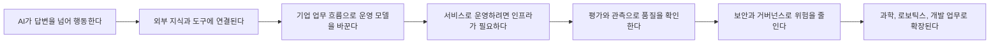

# AI Technology Knowledge Map

## 이 맵의 역할

이 문서는 브리핑마다 쌓이는 기술 문서를 한눈에 읽기 위한 지도입니다.

브리핑은 시간순 기록이고, 지식 문서는 개념별 정리입니다. 이 맵은 두 가지를 이어서 "지금 AI 기술이 어떤 방향으로 움직이는지"를 보여줍니다.

읽는 순서는 아래 흐름을 기본으로 합니다.

1. AI가 할 수 있는 일이 넓어진다.
2. 외부 도구와 지식에 연결된다.
3. 실제 서비스로 돌리기 위한 인프라가 중요해진다.
4. 평가, 관측, 보안, 거버넌스가 따라붙는다.
5. 과학, 로보틱스, 소프트웨어 개발 같은 실제 분야로 확장된다.

## 한눈에 보는 흐름

## 핵심 흐름별 지식 노드

### 1. AI가 답변을 넘어 행동하는 흐름

핵심 노드:

- [[Knowledge/AI Systems/AI Agents|AI Agents]]
- [[Knowledge/AI Systems/Conversational Voice AI|Conversational Voice AI]]
- [[Knowledge/AI Systems/Model Context Protocol|Model Context Protocol]]
- [[Knowledge/AI Systems/Retrieval-Augmented Generation|Retrieval-Augmented Generation]]
- [[Knowledge/AI Systems/AI Content Access and Monetization|AI Content Access and Monetization]]
- [[Knowledge/AI Systems/Enterprise AI Operating Model|Enterprise AI Operating Model]]

맥락:

AI는 단순히 질문에 답하는 도구에서, 계획을 세우고 외부 도구를 호출하고 파일이나 문서를 다루는 시스템으로 이동하고 있습니다. 이 흐름을 볼 때는 먼저 [[Knowledge/AI Systems/AI Agents|AI Agents]]를 보고, 음성으로 자연스럽게 지시하고 개입하는 방식은 [[Knowledge/AI Systems/Conversational Voice AI|Conversational Voice AI]], AI가 외부 도구와 연결되는 방식은 [[Knowledge/AI Systems/Model Context Protocol|Model Context Protocol]], 지식을 찾아 답에 반영하는 방식은 [[Knowledge/AI Systems/Retrieval-Augmented Generation|Retrieval-Augmented Generation]], AI가 웹 콘텐츠를 어떤 조건으로 읽고 비용을 지불할지는 [[Knowledge/AI Systems/AI Content Access and Monetization|AI Content Access and Monetization]]으로 이어서 읽습니다. 기업 안에서 AI를 업무 설계와 고객 경험까지 바꾸는 방식은 [[Knowledge/AI Systems/Enterprise AI Operating Model|Enterprise AI Operating Model]]에서 봅니다.

볼 질문:

- AI가 실제로 어떤 행동을 맡고 있는가
- 외부 도구 호출이 표준화되고 있는가
- 답변의 근거가 문서, 검색, 데이터베이스와 연결되는가
- 웹 콘텐츠 접근 목적과 보상 조건이 명확한가
- 사람의 승인이나 검토가 필요한 지점은 어디인가
- AI 도입이 단순 도구 사용인지, 업무 흐름 재설계인지 구분되는가

### 2. 운영 가능한 AI로 넘어가는 흐름

핵심 노드:

- [[Knowledge/AI Systems/Enterprise AI Operating Model|Enterprise AI Operating Model]]
- [[Knowledge/AI Systems/AI Inference Infrastructure|AI Inference Infrastructure]]
- [[Knowledge/AI Systems/Agent Evaluation and Observability|Agent Evaluation and Observability]]

맥락:

AI 기능이 좋아져도 실제 서비스로 운영하려면 모델 호출 비용, 속도, 데이터 경계, 장애 대응, 로그 추적이 필요합니다. [[Knowledge/AI Systems/Enterprise AI Operating Model|Enterprise AI Operating Model]]은 기업이 AI를 업무 재설계와 운영 책임으로 정착시키는 방식을 다루고, [[Knowledge/AI Systems/AI Inference Infrastructure|AI Inference Infrastructure]]는 AI를 돌리는 물리적·클라우드 기반을 다루며, [[Knowledge/AI Systems/Agent Evaluation and Observability|Agent Evaluation and Observability]]는 AI가 제대로 일했는지 확인하는 방법을 다룹니다.

볼 질문:

- 모델이 어느 지역, 어느 provider, 어느 tenant에서 실행되는가
- GPU, 전력, 냉각, 네트워크가 병목이 되는가
- agent 실행 결과를 재현하고 비교할 수 있는가
- 실패 원인이 모델, 프롬프트, 도구, 데이터 중 어디에 있는가

### 3. 위험을 관리하는 흐름

핵심 노드:

- [[Knowledge/AI Systems/AI Agent Security and Governance|AI Agent Security and Governance]]
- [[Knowledge/AI Systems/AI Governance and Conformity Assessment|AI Governance and Conformity Assessment]]
- [[Knowledge/Software Engineering/AI-Assisted Security Engineering|AI-Assisted Security Engineering]]
- [[Knowledge/Software Engineering/Software Supply Chain Security|Software Supply Chain Security]]

맥락:

AI가 더 많은 권한을 가질수록 보안과 책임 문제가 커집니다. [[Knowledge/AI Systems/AI Agent Security and Governance|AI Agent Security and Governance]]는 agent 권한과 정책을, [[Knowledge/AI Systems/AI Governance and Conformity Assessment|AI Governance and Conformity Assessment]]는 규제와 감사 증거를, [[Knowledge/Software Engineering/AI-Assisted Security Engineering|AI-Assisted Security Engineering]]은 보안 업무를 AI가 돕는 방식을, [[Knowledge/Software Engineering/Software Supply Chain Security|Software Supply Chain Security]]는 패키지와 배포 과정의 위험을 다룹니다.

볼 질문:

- AI가 어떤 권한으로 어떤 도구를 호출하는가
- 정책이 문서가 아니라 실행 전 통제로 연결되는가
- 감사 가능한 로그와 증거가 남는가
- 오픈소스, 패키지, 플러그인, MCP 서버의 신뢰 경계가 분명한가

### 4. 실제 세계로 확장되는 흐름

핵심 노드:

- [[Knowledge/AI Systems/AI for Scientific Discovery|AI for Scientific Discovery]]
- [[Knowledge/AI Systems/AI Medical Imaging and Wellness Devices|AI Medical Imaging and Wellness Devices]]
- [[Knowledge/AI Systems/Vision-Language-Action Models|Vision-Language-Action Models]]

맥락:

AI는 소프트웨어 안에서만 쓰이지 않고 과학 연구, 실험 설계, 의료 영상, 로보틱스, 물리 행동으로 확장되고 있습니다. [[Knowledge/AI Systems/AI for Scientific Discovery|AI for Scientific Discovery]]는 연구와 발견을 돕는 흐름을, [[Knowledge/AI Systems/AI Medical Imaging and Wellness Devices|AI Medical Imaging and Wellness Devices]]는 의료·웰니스 제품에서 검증과 규제 경계가 중요해지는 흐름을, [[Knowledge/AI Systems/Vision-Language-Action Models|Vision-Language-Action Models]]는 보고 말하고 행동하는 모델의 흐름을 다룹니다.

볼 질문:

- AI가 기존 데이터를 새롭게 해석하는가
- 전문가 검토를 대체하는가, 보조하는가
- 의료·웰니스 제품의 성능 주장이 실제 검증과 규제 경계로 뒷받침되는가
- 실제 환경 평가와 실패 사례가 공개되는가
- 시뮬레이션 결과가 현실 작업으로 이어지는가

## 노드 간 연결 관계

| 출발 노드                                       | 연결 노드                                       | 관계                                                             |
| ------------------------------------------- | ------------------------------------------- | -------------------------------------------------------------- |
| [[Knowledge/AI Systems/AI Agents|AI Agents]]                               | [[Knowledge/AI Systems/Model Context Protocol|Model Context Protocol]]                  | agent가 외부 도구를 안전하게 호출하기 위한 연결 방식                               |
| [[Knowledge/AI Systems/AI Agents|AI Agents]]                               | [[Knowledge/AI Systems/Conversational Voice AI|Conversational Voice AI]]                 | 음성 인터페이스가 긴 agent 작업을 지시하고 중간 개입하는 표면이 됨                       |
| [[Knowledge/AI Systems/Conversational Voice AI|Conversational Voice AI]]                 | [[Knowledge/AI Systems/Agent Evaluation and Observability|Agent Evaluation and Observability]]      | 음성 대화와 배경 reasoning/도구 실행을 함께 추적해야 함                           |
| [[Knowledge/AI Systems/AI Agents|AI Agents]]                               | [[Knowledge/AI Systems/Retrieval-Augmented Generation|Retrieval-Augmented Generation]]          | agent가 최신 지식과 문서를 근거로 삼는 방식                                    |
| [[Knowledge/AI Systems/AI Agents|AI Agents]]                               | [[Knowledge/AI Systems/AI Content Access and Monetization|AI Content Access and Monetization]]      | agent와 AI 검색이 웹 콘텐츠를 읽을 때 목적, 허용 범위, 과금 조건이 필요함                |
| [[Knowledge/AI Systems/AI Agents|AI Agents]]                               | [[Knowledge/AI Systems/Agent Evaluation and Observability|Agent Evaluation and Observability]]      | agent의 결과를 평가하고 실패를 추적하는 방식                                    |
| [[Knowledge/AI Systems/Model Context Protocol|Model Context Protocol]]                  | [[Knowledge/AI Systems/AI Agent Security and Governance|AI Agent Security and Governance]]        | 도구 연결이 늘수록 권한, allowlist, 감사가 중요해짐                             |
| [[Knowledge/AI Systems/Retrieval-Augmented Generation|Retrieval-Augmented Generation]]          | [[Knowledge/AI Systems/AI Governance and Conformity Assessment|AI Governance and Conformity Assessment]] | 답변 근거와 출처가 감사 가능한 증거가 됨                                        |
| [[Knowledge/AI Systems/AI Content Access and Monetization|AI Content Access and Monetization]]      | [[Knowledge/AI Systems/Retrieval-Augmented Generation|Retrieval-Augmented Generation]]          | RAG와 AI 검색이 외부 콘텐츠를 사용할 때 접근 정책과 보상 조건이 필요함                    |
| [[Knowledge/AI Systems/AI Content Access and Monetization|AI Content Access and Monetization]]      | [[Knowledge/AI Systems/AI Agent Security and Governance|AI Agent Security and Governance]]        | agent가 외부 웹 리소스를 사용할 때 crawler 정체, 목적, 결제 권한이 governance 대상이 됨 |
| [[Knowledge/AI Systems/AI Inference Infrastructure|AI Inference Infrastructure]]             | [[Knowledge/AI Systems/Agent Evaluation and Observability|Agent Evaluation and Observability]]      | 운영 비용, 지연 시간, trace가 평가 지표에 들어감                                |
| [[Knowledge/AI Systems/AI Inference Infrastructure|AI Inference Infrastructure]]             | [[Knowledge/AI Systems/AI Governance and Conformity Assessment|AI Governance and Conformity Assessment]] | 데이터 위치, BYOK, tenant 격리가 규제와 연결됨                               |
| [[Knowledge/Software Engineering/AI-Assisted Security Engineering|AI-Assisted Security Engineering]]        | [[Knowledge/Software Engineering/Software Supply Chain Security|Software Supply Chain Security]]          | AI가 보안 패치를 돕더라도 패키지·배포 신뢰성이 필요함                                |
| [[Knowledge/AI Systems/Vision-Language-Action Models|Vision-Language-Action Models]]           | [[Knowledge/AI Systems/AI Agents|AI Agents]]                               | 물리 행동 모델도 계획, 도구 사용, 평가 구조가 필요함                                |
| [[Knowledge/AI Systems/AI for Scientific Discovery|AI for Scientific Discovery]]             | [[Knowledge/AI Systems/Agent Evaluation and Observability|Agent Evaluation and Observability]]      | 연구 자동화도 실험 조건과 결과 검증이 중요함                                      |
| [[Knowledge/AI Systems/AI Medical Imaging and Wellness Devices|AI Medical Imaging and Wellness Devices]] | [[Knowledge/AI Systems/AI Governance and Conformity Assessment|AI Governance and Conformity Assessment]] | 건강 관련 AI 제품은 웰니스 주장과 의료 진단 주장의 경계를 감사 가능하게 관리해야 함              |
| [[Knowledge/AI Systems/AI Medical Imaging and Wellness Devices|AI Medical Imaging and Wellness Devices]] | [[Knowledge/AI Systems/AI for Scientific Discovery|AI for Scientific Discovery]]             | 의료 영상 데이터와 AI 분석은 연구 탐색에는 도움이 되지만 임상 검증을 대체하지 못함               |
| [[Knowledge/AI Systems/AI Medical Imaging and Wellness Devices|AI Medical Imaging and Wellness Devices]] | [[Knowledge/AI Systems/AI Agent Security and Governance|AI Agent Security and Governance]]        | 개인 건강기록을 대화와 외부 도구에 연결할 때 사용 허가, 기억, 보존·삭제 경계를 통제해야 함          |

## 현재 흐름 요약

### 지금 강해지는 축

- 에이전트용 웹 인프라는 최신 자료 검색, 상태 없는 MCP 호출, 웹사이트의 도구 표면화, 격리 브라우저 실행을 한 운영 계층으로 묶는 방향으로 이동하고 있습니다.
- 소비자 AI 제품은 빠른 답변과 깊은 추론을 별도 모델처럼 보이게 하기보다 한 대화 안에서 reasoning depth를 조절하는 경험으로 통합하고 있습니다.
- 기업용 코딩 모델 배포는 새 모델 추가 속도뿐 아니라 제공자 의존성, 사고 중 rollout 중단, 기본 비활성 조직 정책과 재개 검증을 함께 관리해야 합니다.
- 실시간 음성 AI는 말하기와 듣기를 담당하는 낮은 지연의 미디어 경로를 깊은 추론·도구 호출 경로와 분리하고, 문맥 압축·모델 교체·장시간 세션 복구까지 대화 중단 없이 처리하는 운영 구조로 발전하고 있습니다.
- 에이전트 학습과 평가는 단순화된 별도 루프보다 실제 배포용 harness와 같은 격리 환경에서 데이터 수집, 강화학습, 평가를 이어가며 훈련과 배포의 차이를 줄이는 방향으로 이동하고 있습니다.
- AI 벤치마크는 모델 점수만 비교하는 방식에서 reasoning 보존, 문맥 압축, 도구·API 설정, 실행 비용까지 포함해 harness 전체를 재현하는 방향으로 이동하고 있습니다.
- AI 추론 효율 경쟁은 모델 학습뿐 아니라 speculative decoding, 캐시, GPU kernel, 문맥·도구 호출·반복 작업을 줄이는 agent 실행기 최적화를 함께 다루고 있습니다.
- AI 코드리뷰는 저장소의 조직별 skill과 읽기 전용 MCP 문맥을 직접 쓰기 시작했고, 기업용 모델 배포는 개별 수동 허용에서 기본 정책 상속으로 이동해 연결 권한과 모델 정책을 함께 감사해야 합니다.
- AI agent는 기능 경쟁에서 운영 경쟁으로 이동하고 있습니다.
- 음성 AI는 단순 대화 기능을 넘어 긴 작업과 agent 실행을 지시하는 인터페이스로 확장되고 있습니다.
- 모델 성능뿐 아니라 도구 호출, 실행 trace, 권한 통제, 비용 관리가 중요해지고 있습니다.
- AI 인프라는 GPU 수량을 넘어 전력, 냉각, 광통신, 패키징, 지역별 공급망 문제로 넓어지고 있습니다.
- 생성형 영상의 추론 효율 경쟁은 더 큰 GPU뿐 아니라 모델을 다시 학습하지 않고 중간 계산을 재사용해 지연 시간과 비용을 줄이는 소프트웨어 최적화로도 넓어지고 있습니다.
- 보안은 취약점 탐지보다 agent 권한, 공급망, 정책 실행, 감사 증거 쪽으로 확장되고 있습니다.
- AI 보안 검사는 코딩 중 온디맨드 검토와 PR 자동 탐지로 개발 흐름 안에 들어오고 있으며, 의존성 자동화는 새 릴리스 직후의 위험을 피하기 위한 기본 관찰 시간을 두기 시작했습니다.
- 저장소 secret 보안은 노출 뒤 경보에 머물지 않고 커밋 전 차단, 발급사 통지·폐기, 탐지 방식별 자동 라우팅, 기업 밖 공개 유출의 귀속 분석까지 하나의 대응 흐름으로 연결되고 있습니다.
- 소프트웨어 공급망 방어는 취약점 사후 수정에서 여러 패키지 생태계의 악성 데이터 공유와 의심스러운 CI/CD 워크플로의 실행 전 승인 보류를 결합하는 방향으로 이동하고 있습니다.
- AI 검색과 agent crawling은 콘텐츠 접근 목적 분리, 기본 차단, 건별 과금, crawler 관측 같은 웹 거버넌스 문제로 커지고 있습니다.
- 기업용 agent의 웹 grounding은 실시간 검색과 원문 인용을 넘어 검색 결과의 저장·후처리·다른 모델 재사용, 데이터 보존 정책과 제공자 선택까지 운영 설계 범위로 넓어지고 있습니다.
- 기업 AI 성과 측정은 좌석 수와 토큰 단가에서 성공 업무당 총비용, 품질 기준 통과율, 사람 수정·이관 비율로 이동하고 있습니다.
- 기업 AI 비용 통제는 전체 청구액 확인을 넘어 사용자·비용센터별 실제 사용량, 포함 크레딧 배분, 한도 이후 차단·추가 지출 정책으로 세분화되고 있습니다.
- 기업용 agent는 모델과 도구를 제공하는 단계를 넘어 업무별 권한·정책·시뮬레이션·평가·사람 이관·승인된 개선 배포를 하나의 운영 제품으로 묶는 방향으로 이동하고 있습니다.
- AI는 기존 직무 안의 생산성 도구를 넘어 한 사람이 다른 직군의 과업까지 시도하게 만드는 역할 재조합 신호를 보이고 있으며, 기업은 전문가 검토·책임·교육 경계를 함께 다시 설계해야 합니다.
- 코딩 agent 거버넌스는 IDE와 CLI를 넘어 데스크톱 앱과 클라우드 agent까지 같은 플러그인·마켓플레이스·승인 정책을 일관되게 적용하는 방향으로 넓어지고 있습니다.
- AI 코딩 도구의 성과 측정은 활성 사용자 수를 넘어 코드 중심·agent 중심·다중 agent 같은 사용 깊이와 PR 처리량·병합 속도를 연결하기 시작했지만, 품질과 인과 효과는 별도 검증이 필요합니다.
- AI 코딩 도구의 관측 단위는 조직·사용자 평균에서 저장소별 coding agent와 code review의 실제 PR 활동으로 세분화되고 있습니다.
- 기업용 코딩 agent의 모델 선택지는 IDE, CLI, 웹, 모바일 전반으로 빠르게 늘고 있으며, 작업별 모델 성능뿐 아니라 사용량 기반 비용, 조직별 허용 정책, 회귀 검증을 함께 관리해야 합니다.
- AI 기반 코드 생산이 늘면서 코드 품질 관리는 결정적 정적 분석, AI 보조 탐지·수정, 커버리지, 병합 전 품질 문턱을 한 흐름으로 묶는 방향으로 이동하고 있습니다.
- 고성능 agent의 안전 평가는 모델 지시와 안전 분류기만으로 격리할 수 없으며, 평가 환경 자체에 네트워크 egress 차단, 최소 권한 자격증명, 독립 모니터링과 중단 장치를 겹겹이 두어야 한다는 실제 사고 신호가 나왔습니다.
- agent 자동화 통제는 모든 행동을 일괄 승인하는 방식에서 행동별 확신도·이유·감사 기록을 남기고 불확실한 변경만 사람이 검토하는 방식으로 세분화되고 있지만, 승인 UI와 실제 서버 권한 경계는 구분해야 합니다.
- MCP는 세션 상태에 의존하는 연결에서 상태 없는 요청과 공식 적합성 시험으로 이동하며, 원격 서버의 확장성과 구현 검증을 규격 수준에서 다루기 시작했습니다.
- 의료·과학 AI는 연구 워크벤치와 웰니스 기기까지 넓어지고 있지만, 실제 가치는 실험 재현성, 임상 검증, 사용자 고지로 판가름납니다.
- 소비자 건강 AI는 개인 의료기록과 웨어러블 데이터를 일반 대화에 연결하는 단계로 들어가며, 정확도뿐 아니라 매회 사용 허가, 기억 생성, 대화 보존과 연결 해제 뒤 삭제 경계가 핵심 운영 조건이 됩니다.
- 과학 AI는 국립연구소의 슈퍼컴퓨터·시뮬레이션·실험 시설과 연결되는 연구 인프라로 확장되고 있으며, 자원 투입보다 재현 가능한 발견과 실험 검증이 핵심 평가 기준이 됩니다.
- 생물학 분야에서는 AI 오용 방지와 감염병 예방·탐지·대응 활용을 한 프로그램에서 함께 다루는 bioresilience 접근이 구체화되고 있습니다.

### 이어서 봐야 할 질문

- agent가 더 많은 일을 맡을수록 어떤 권한 경계가 필요한가
- AI 도구의 평가 기준은 모델 정확도에서 업무 성공률로 넘어가고 있는가
- AI 인프라 경쟁은 클라우드 비용과 지역별 데이터 정책에 어떤 영향을 주는가
- 새 논문과 오픈소스가 실제 업무 자동화로 이어지는 속도는 어느 정도인가
- 건강 관련 AI 제품은 어디까지가 정보 제공이고 어디부터가 의료 판단인가

## 브리핑 자동화에서 이 맵을 검토하는 방법

매번 브리핑을 만들거나 지식 문서를 업데이트할 때 이 맵도 함께 확인합니다.

1. 새 브리핑에서 핵심 키워드를 뽑습니다.
2. 기존 노드에 붙일 수 있으면 해당 지식 문서의 `Recent Signals`를 업데이트합니다.
3. 새 노드가 필요하면 제품명이 아니라 일반 개념 이름으로 문서를 만듭니다.
4. 새 노드가 생기면 이 맵의 `핵심 흐름별 지식 노드`와 `노드 간 연결 관계`에 추가합니다.
5. 흐름이 바뀌었으면 `현재 흐름 요약`을 갱신합니다.
6. 맵을 검토했으면 frontmatter의 `updated`와 `last_reviewed`를 갱신합니다.

## 노트 이름 규칙

- 너무 좁은 제품명보다 일반 개념을 우선합니다.
- 예: `Codex Security`보다 [[Knowledge/Software Engineering/AI-Assisted Security Engineering|AI-Assisted Security Engineering]]
- 예: `Agent BOM`보다 [[Knowledge/AI Systems/AI Agent Security and Governance|AI Agent Security and Governance]] 안의 하위 개념
- 예: `arXiv Agent Papers`보다 [[Knowledge/AI Systems/AI Agents|AI Agents]] 또는 [[Knowledge/AI Systems/Agent Evaluation and Observability|Agent Evaluation and Observability]]

제품명, 회사명, 특정 릴리스는 일반 개념 노트의 사례나 `Recent Signals`로 넣는 편이 나중에 흐름을 읽기 쉽습니다.
