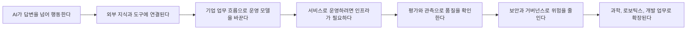

# AI Technology Knowledge Map

## 이 맵의 역할

이 문서는 브리핑마다 쌓이는 기술 문서를 한눈에 읽기 위한 지도입니다.

브리핑은 시간순 기록이고, 지식 문서는 한 파일·한 개념으로 정리한 백과사전입니다. [[Knowledge/00 Tech Encyclopedia Index|00 Tech Encyclopedia Index]]는 "무엇이 있는가"를 보여주고, 이 맵은 개념들이 "어떻게 이어지는가"를 보여줍니다.

읽는 순서는 아래 흐름을 기본으로 합니다.

1. AI가 할 수 있는 일이 넓어진다.
2. 외부 도구와 지식에 연결된다.
3. 실제 서비스로 돌리기 위한 인프라가 중요해진다.
4. 평가, 관측, 보안, 거버넌스가 따라붙는다.
5. 과학, 로보틱스, 소프트웨어 개발 같은 실제 분야로 확장된다.

## 한눈에 보는 흐름

## 핵심 흐름별 지식 노드

### 1. AI가 답변을 넘어 행동하는 흐름

핵심 노드:

- [[Knowledge/AI Systems/AI Agents|AI Agents]]
- [[Knowledge/AI Systems/Conversational Voice AI|Conversational Voice AI]]
- [[Knowledge/AI Systems/Model Context Protocol|Model Context Protocol]]
- [[Knowledge/AI Systems/Retrieval-Augmented Generation|Retrieval-Augmented Generation]]
- [[Knowledge/AI Systems/AI Content Access|AI Content Access]]
- [[Knowledge/AI Systems/AI Content Monetization|AI Content Monetization]]
- [[Knowledge/AI Systems/Enterprise AI Operating Model|Enterprise AI Operating Model]]

맥락:

AI는 단순히 질문에 답하는 도구에서, 계획을 세우고 외부 도구를 호출하고 파일이나 문서를 다루는 시스템으로 이동하고 있습니다. 이 흐름을 볼 때는 먼저 [[Knowledge/AI Systems/AI Agents|AI Agents]]를 보고, 음성으로 지시하고 개입하는 방식은 [[Knowledge/AI Systems/Conversational Voice AI|Conversational Voice AI]], 외부 도구 연결은 [[Knowledge/AI Systems/Model Context Protocol|Model Context Protocol]], 근거 검색은 [[Knowledge/AI Systems/Retrieval-Augmented Generation|Retrieval-Augmented Generation]]으로 이어서 읽습니다. 웹을 누가 어떤 목적으로 읽는지는 [[Knowledge/AI Systems/AI Content Access|AI Content Access]], 그 접근의 보상 구조는 [[Knowledge/AI Systems/AI Content Monetization|AI Content Monetization]]에서 분리해 봅니다. 기업 업무 재설계는 [[Knowledge/AI Systems/Enterprise AI Operating Model|Enterprise AI Operating Model]]에서 봅니다.

볼 질문:

- AI가 실제로 어떤 행동을 맡고 있는가
- 외부 도구 호출이 표준화되고 있는가
- 답변의 근거가 문서, 검색, 데이터베이스와 연결되는가
- 웹 콘텐츠 접근 목적과 보상 조건이 명확한가
- 사람의 승인이나 검토가 필요한 지점은 어디인가
- AI 도입이 단순 도구 사용인지, 업무 흐름 재설계인지 구분되는가

### 2. 운영 가능한 AI로 넘어가는 흐름

핵심 노드:

- [[Knowledge/Data Systems/Aggregate Metrics|Aggregate Metrics]]

- [[Knowledge/AI Systems/Enterprise AI Operating Model|Enterprise AI Operating Model]]
- [[Knowledge/AI Systems/AI Inference Infrastructure|AI Inference Infrastructure]]
- [[Knowledge/AI Systems/Agent Evaluation|Agent Evaluation]]
- [[Knowledge/AI Systems/Agent Observability|Agent Observability]]

맥락:

AI 기능이 좋아져도 실제 서비스로 운영하려면 모델 호출 비용, 속도, 데이터 경계, 장애 대응, 로그 추적이 필요합니다. [[Knowledge/AI Systems/Enterprise AI Operating Model|Enterprise AI Operating Model]]은 기업의 업무·역할 구조를, [[Knowledge/AI Systems/AI Inference Infrastructure|AI Inference Infrastructure]]는 모델 실행 기반을 다룹니다. [[Knowledge/AI Systems/Agent Evaluation|Agent Evaluation]]은 "잘했는가"를 판정하고, [[Knowledge/AI Systems/Agent Observability|Agent Observability]]는 "무엇을 했는가"를 재구성할 증거를 제공합니다.

볼 질문:

- 모델이 어느 지역, 어느 provider, 어느 tenant에서 실행되는가
- GPU, 전력, 냉각, 네트워크가 병목이 되는가
- agent 실행 결과를 재현하고 비교할 수 있는가
- 실패 원인이 모델, 프롬프트, 도구, 데이터 중 어디에 있는가

### 3. 위험을 관리하는 흐름

핵심 노드:

- [[Knowledge/AI Systems/AI Agent Security|AI Agent Security]]
- [[Knowledge/AI Systems/AI Agent Governance|AI Agent Governance]]
- [[Knowledge/AI Systems/AI Governance|AI Governance]]
- [[Knowledge/AI Systems/AI Conformity Assessment|AI Conformity Assessment]]
- [[Knowledge/Software Engineering/AI-Assisted Security Engineering|AI-Assisted Security Engineering]]
- [[Knowledge/Software Engineering/Software Supply Chain Security|Software Supply Chain Security]]
- [[Knowledge/Security/Zero-Knowledge Proofs|Zero-Knowledge Proofs]]

맥락:

AI가 더 많은 권한을 가질수록 기술적 보호와 조직적 책임을 구분해야 합니다. [[Knowledge/AI Systems/AI Agent Security|AI Agent Security]]는 공격·권한 오용을 줄이고, [[Knowledge/AI Systems/AI Agent Governance|AI Agent Governance]]는 목적·승인·책임 운영을 정합니다. 조직 전체의 AI 위험 체계는 [[Knowledge/AI Systems/AI Governance|AI Governance]], 특정 법·표준 요구사항 판정은 [[Knowledge/AI Systems/AI Conformity Assessment|AI Conformity Assessment]]가 맡습니다. [[Knowledge/Software Engineering/AI-Assisted Security Engineering|AI-Assisted Security Engineering]]은 보안 업무를 AI로 돕는 방식이고, [[Knowledge/Software Engineering/Software Supply Chain Security|Software Supply Chain Security]]는 패키지와 출하 경로를 보호합니다.

개인정보를 검증하는 과정에서는 [[Knowledge/Security/Zero-Knowledge Proofs|Zero-Knowledge Proofs]]로 원본 비밀을 전달하지 않고 필요한 조건만 입증할 수 있습니다. 다만 발급자 신뢰, 철회, 기기·네트워크 식별은 별도 경계로 남습니다.

볼 질문:

- AI가 어떤 권한으로 어떤 도구를 호출하는가
- 정책이 문서가 아니라 실행 전 통제로 연결되는가
- 감사 가능한 로그와 증거가 남는가
- 오픈소스, 패키지, 플러그인, MCP 서버의 신뢰 경계가 분명한가

### 4. 실제 세계로 확장되는 흐름

핵심 노드:

- [[Knowledge/AI Systems/AI for Scientific Discovery|AI for Scientific Discovery]]
- [[Knowledge/AI Systems/AI Medical Imaging|AI Medical Imaging]]
- [[Knowledge/AI Systems/AI Wellness Devices|AI Wellness Devices]]
- [[Knowledge/AI Systems/Vision-Language-Action Models|Vision-Language-Action Models]]
- [[Knowledge/AI Systems/Time-Series Foundation Models|Time-Series Foundation Models]]

맥락:

AI는 소프트웨어 안에서만 쓰이지 않고 과학 연구, 실험 설계, 의료 영상, 로보틱스, 물리 행동으로 확장되고 있습니다. [[Knowledge/AI Systems/AI for Scientific Discovery|AI for Scientific Discovery]]는 연구와 발견을 돕는 흐름을, [[Knowledge/AI Systems/AI Medical Imaging|AI Medical Imaging]]은 임상 영상 해석을, [[Knowledge/AI Systems/AI Wellness Devices|AI Wellness Devices]]는 저위험 생활습관 지원을 다룹니다. [[Knowledge/AI Systems/Vision-Language-Action Models|Vision-Language-Action Models]]는 보고 말하고 행동하는 로봇 모델의 흐름을 다룹니다.

시계열 예측은 여러 분야의 관측 패턴을 재사용하는 [[Knowledge/AI Systems/Time-Series Foundation Models|Time-Series Foundation Models]]로 확장되고 있습니다. 이때 공개 벤치마크 성능과 실제 업무의 분포 이동·데이터 누수·확률 보정을 분리해 봅니다.

볼 질문:

- AI가 기존 데이터를 새롭게 해석하는가
- 전문가 검토를 대체하는가, 보조하는가
- 의료·웰니스 제품의 성능 주장이 실제 검증과 규제 경계로 뒷받침되는가
- 실제 환경 평가와 실패 사례가 공개되는가
- 시뮬레이션 결과가 현실 작업으로 이어지는가
- 사전학습 시계열 모델이 단순 기준선보다 실제 데이터에서도 안정적으로 나은가

관측 결과를 비교할 때는 [[Knowledge/Data Systems/Aggregate Metrics|Aggregate Metrics]]의 대상·시간 구간·계산 규칙을 고정합니다. 개별 실행 trace와 집계는 서로를 보완하며, 사용량 자체가 업무 품질을 뜻하지는 않습니다.

## 노드 간 연결 관계

| 출발 노드 | 연결 노드 | 관계 |
|---|---|---|
| [[Knowledge/AI Systems/Agent Observability|Agent Observability]] | [[Knowledge/Data Systems/Aggregate Metrics|Aggregate Metrics]] | 개별 실행 기록을 같은 기준의 처리량·오류 지표로 요약 |
| [[Knowledge/Data Systems/Aggregate Metrics|Aggregate Metrics]] | [[Knowledge/AI Systems/Enterprise AI Operating Model|Enterprise AI Operating Model]] | 정의가 일치하는 업무 성과를 비교하되 사용량과 품질을 구분 |
| [[Knowledge/AI Systems/AI Agents|AI Agents]] | [[Knowledge/AI Systems/Model Context Protocol|Model Context Protocol]] | 에이전트가 외부 도구와 데이터를 발견·호출하는 연결 규격 |
| [[Knowledge/AI Systems/AI Agents|AI Agents]] | [[Knowledge/AI Systems/Conversational Voice AI|Conversational Voice AI]] | 음성이 긴 작업을 지시하고 중간 개입하는 인터페이스가 됨 |
| [[Knowledge/AI Systems/Conversational Voice AI|Conversational Voice AI]] | [[Knowledge/AI Systems/Agent Observability|Agent Observability]] | 음성 대화와 배경 도구 실행 상태를 같은 trace로 연결해야 함 |
| [[Knowledge/AI Systems/AI Agents|AI Agents]] | [[Knowledge/AI Systems/Retrieval-Augmented Generation|Retrieval-Augmented Generation]] | 에이전트가 최신 지식과 문서를 근거로 삼는 방식 |
| [[Knowledge/AI Systems/AI Agents|AI Agents]] | [[Knowledge/AI Systems/Agent Evaluation|Agent Evaluation]] | 업무 결과와 실행 과정을 기준에 따라 판정 |
| [[Knowledge/AI Systems/AI Agents|AI Agents]] | [[Knowledge/AI Systems/Agent Observability|Agent Observability]] | 실패한 실행을 단계별로 재구성 |
| [[Knowledge/AI Systems/Model Context Protocol|Model Context Protocol]] | [[Knowledge/AI Systems/AI Agent Security|AI Agent Security]] | 연결된 도구마다 인증·최소 권한·schema 변경 통제가 필요 |
| [[Knowledge/AI Systems/AI Agent Security|AI Agent Security]] | [[Knowledge/AI Systems/AI Agent Governance|AI Agent Governance]] | 기술 통제를 목적·승인·책임 정책과 연결 |
| [[Knowledge/AI Systems/AI Agent Governance|AI Agent Governance]] | [[Knowledge/AI Systems/AI Governance|AI Governance]] | 에이전트 운영 정책을 조직 전체 AI 체계 안에 배치 |
| [[Knowledge/AI Systems/AI Governance|AI Governance]] | [[Knowledge/AI Systems/AI Conformity Assessment|AI Conformity Assessment]] | 운영 증거를 특정 법·표준 요구사항 판정에 사용 |
| [[Knowledge/AI Systems/AI Content Access|AI Content Access]] | [[Knowledge/AI Systems/Retrieval-Augmented Generation|Retrieval-Augmented Generation]] | 외부 콘텐츠를 검색하기 전에 신원·목적·허용 범위를 확인 |
| [[Knowledge/AI Systems/AI Content Access|AI Content Access]] | [[Knowledge/AI Systems/AI Content Monetization|AI Content Monetization]] | 허용된 접근에 가격·지불·정산을 선택적으로 결합 |
| [[Knowledge/AI Systems/AI Inference Infrastructure|AI Inference Infrastructure]] | [[Knowledge/AI Systems/Agent Observability|Agent Observability]] | 지연·비용·오류·provider 라우팅을 trace에 기록 |
| [[Knowledge/AI Systems/AI Inference Infrastructure|AI Inference Infrastructure]] | [[Knowledge/AI Systems/AI Governance|AI Governance]] | 데이터 위치·tenant 격리·provider 정책을 운영 규칙과 연결 |
| [[Knowledge/Software Engineering/AI-Assisted Security Engineering|AI-Assisted Security Engineering]] | [[Knowledge/Software Engineering/Software Supply Chain Security|Software Supply Chain Security]] | AI 패치도 의존성·빌드·서명·배포 신뢰를 통과해야 함 |
| [[Knowledge/Security/Zero-Knowledge Proofs|Zero-Knowledge Proofs]] | [[Knowledge/AI Systems/AI Governance|AI Governance]] | 최소 공개 증명을 데이터 최소화·신원 정책과 연결 |
| [[Knowledge/AI Systems/Vision-Language-Action Models|Vision-Language-Action Models]] | [[Knowledge/AI Systems/Agent Evaluation|Agent Evaluation]] | 물리 행동은 시뮬레이션과 실환경의 실패 조건으로 평가 |
| [[Knowledge/AI Systems/AI for Scientific Discovery|AI for Scientific Discovery]] | [[Knowledge/AI Systems/Agent Evaluation|Agent Evaluation]] | 연구 자동화는 재현 가능한 실험 조건과 결과 검증이 필요 |
| [[Knowledge/AI Systems/AI Medical Imaging|AI Medical Imaging]] | [[Knowledge/AI Systems/AI Conformity Assessment|AI Conformity Assessment]] | 임상 사용 의도와 시스템 버전에 맞는 안전·성능 증거가 필요 |
| [[Knowledge/AI Systems/AI Wellness Devices|AI Wellness Devices]] | [[Knowledge/AI Systems/AI Governance|AI Governance]] | 웰니스 주장과 의료적 주장, 데이터 동의 경계를 관리 |
| [[Knowledge/AI Systems/Time-Series Foundation Models|Time-Series Foundation Models]] | [[Knowledge/AI Systems/AI Inference Infrastructure|AI Inference Infrastructure]] | 예측 지연·비용·모델 버전과 데이터 경계를 운영 환경에서 관리 |
| [[Knowledge/AI Systems/Time-Series Foundation Models|Time-Series Foundation Models]] | [[Knowledge/AI Systems/Agent Evaluation|Agent Evaluation]] | 시간 분할, 단순 기준선, 확률 보정으로 예측 성능과 실패 조건을 검증 |

## 현재 흐름 요약

### 지금 강해지는 축

- AI 에이전트 경쟁은 모델 기능만이 아니라 도구 연결, 실제 업무 성공률, trace, 권한, 비용을 함께 운영하는 경쟁으로 이동하고 있습니다.
- 검색과 웹 자동화는 콘텐츠 접근자의 신원·목적을 구분하고, 허용된 접근에만 선택적으로 보상 구조를 붙이는 방향으로 세분화되고 있습니다.
- 기업 AI 성과는 좌석 수와 토큰 단가보다 성공 업무당 총비용, 품질 문턱 통과율, 사람 수정·이관 비율로 측정되는 흐름이 강해지고 있습니다.
- 보안은 모델 출력 필터를 넘어 에이전트 권한·격리·중단과 조직의 승인·책임을 서로 다른 통제로 설계하는 방향으로 이동하고 있습니다.
- 소프트웨어 개발에서는 AI 보안 리뷰와 결정적 정적 분석을 결합하고, 패키지·CI·서명·배포 공급망을 별도 경계로 보호하는 방식이 중요해지고 있습니다.
- 과학·의료·로보틱스 AI는 시뮬레이션이나 내부 점수보다 재현 가능한 실험, 임상 사용 의도, 실제 환경 실패 조건으로 가치를 판정하는 단계로 들어가고 있습니다.
- 시계열 파운데이션 모델은 단변량 zero-shot을 넘어 여러 목표·공변량을 함께 처리하는 방향으로 확장되고 있으며, 업무별 시간 분할 검증과 누수 통제가 핵심 평가 경계가 되고 있습니다.

### 이어서 봐야 할 질문

- agent가 더 많은 일을 맡을수록 어떤 권한 경계가 필요한가
- AI 도구의 평가 기준은 모델 정확도에서 업무 성공률로 넘어가고 있는가
- AI 인프라 경쟁은 클라우드 비용과 지역별 데이터 정책에 어떤 영향을 주는가
- 새 논문과 오픈소스가 실제 업무 자동화로 이어지는 속도는 어느 정도인가
- 건강 관련 AI 제품은 어디까지가 정보 제공이고 어디부터가 의료 판단인가

## 브리핑 자동화에서 이 맵을 검토하는 방법

매번 브리핑을 만들거나 지식 문서를 업데이트할 때 이 맵도 함께 확인합니다.

1. 새 브리핑에서 핵심 키워드를 뽑습니다.
2. [[Knowledge/00 Tech Encyclopedia Index|00 Tech Encyclopedia Index]]에서 기존 canonical 이름과 alias를 확인합니다.
3. 기존 원자적 노드에 붙일 수 있으면 해당 문서의 `최근 변화`에 개념을 바꾼 신호만 짧게 반영합니다.
4. 한 파일에 독립 개념이 둘 이상 필요하면 먼저 문서를 분리하고, 기존 경로는 탐색용 인덱스로 남깁니다.
5. 새 노드가 생기면 백과사전 인덱스와 이 맵의 노드·관계를 함께 갱신합니다.
6. 흐름이 바뀌었으면 `현재 흐름 요약`을 갱신합니다.
7. 실제로 맵을 검토했으면 `last_reviewed`를, 노드·관계가 바뀌었으면 `updated`도 갱신합니다.

## 노트 이름 규칙

- 너무 좁은 제품명보다 일반 개념을 우선합니다.
- 예: `Codex Security`보다 [[Knowledge/Software Engineering/AI-Assisted Security Engineering|AI-Assisted Security Engineering]]
- 예: `Agent BOM`을 보안과 운영 책임으로 뭉치지 말고 [[Knowledge/AI Systems/AI Agent Security|AI Agent Security]] 또는 [[Knowledge/AI Systems/AI Agent Governance|AI Agent Governance]]에 정확히 배치
- 예: `arXiv Agent Papers`보다 [[Knowledge/AI Systems/AI Agents|AI Agents]], 평가 방법이면 [[Knowledge/AI Systems/Agent Evaluation|Agent Evaluation]], trace라면 [[Knowledge/AI Systems/Agent Observability|Agent Observability]]

제품명, 회사명, 특정 릴리스는 일반 개념 노트의 정의가 아니라 `최근 변화`와 날짜별 매거진에 넣습니다.
